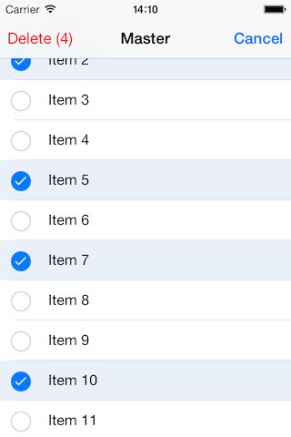

> 导航：[总目录](../../README.md) · [samplecode](../../_indexes/samplecode.md)

[Next](ReadMe.txt.md)

# Multiple Selection with UITableView

|  |  |
| --- | --- |
| __Last Revision:__ | Version 2.2, 2014-01-13 Fixed selection logic bug in "updateButtonsToMatchTableState" method. [(Full Revision History)](Document%20Revision%20History.md#apple-f4xwc4dqnrsv64tfmyxwi33df52wszbpirkfgnbqgaytcmjyhewvezlwnfzws33ojbuxg5dpoj4s2rdpnz2ey2lonncwyzlnmvxhiskel4yq) |
| __Build Requirements:__ | Xcode 5.0 or later, iOS 6 SDK or later. |
| __Runtime Requirements:__ | iOS 6.0 or later |

"TableMultiSelect" demonstrates the use of multiple selection of table cells in UITableView, in particular using multiple selection to delete one or more items.

[Next](ReadMe.txt.md)

