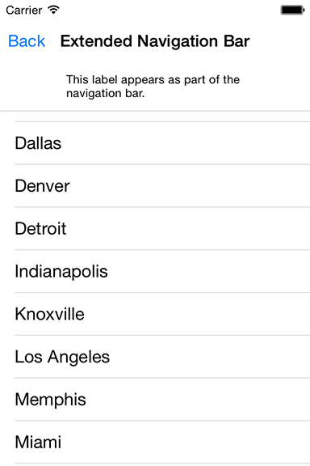

> 导航：[总目录](../../README.md) · [samplecode](../../_indexes/samplecode.md)

[Next](ReadMe.md.md)

# NavBar: Customizing UINavigationBar's appearance

|  |  |
| --- | --- |
| __Last Revision:__ | Version 8.0, 2017-12-07 Upgraded to iOS 11 SDK, Upgraded to Swift 4, added large title support. [(Full Revision History)](Document%20Revision%20History.md#apple-f4xwc4dqnrsv64tfmyxwi33df52wszbpirkfgnbqgaydonbrhawvezlwnfzws33ojbuxg5dpoj4s2rdpnz2ey2lonncwyzlnmvxhiskel4yq) |
| __Build Requirements:__ | iOS 11.0 SDK or later |
| __Runtime Requirements:__ | iOS 10.0 or later |

NavBar demonstrates using UINavigationController and UIViewController classes together as building blocks to your application's user interface. Use it as a reference when starting the development of your new application. The various pages in this sample exhibit different ways of how to modify the navigation bar directly, using the appearance proxy, and by modifying the view controller's UINavigationItem. Among the levels of customization are varying appearance styles, and applying custom left and right buttons known as UIBarButtonItems.

[Next](ReadMe.md.md)

