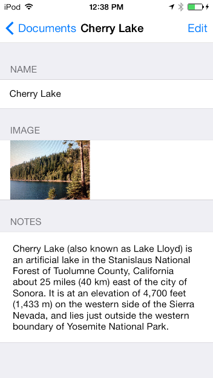

> 导航：[总目录](../../README.md) · [samplecode](../../_indexes/samplecode.md)

[Next](PackagedDocument-main.m.md)

# Packaged Document for iOS

|  |  |
| --- | --- |
| __Last Revision:__ | Version 1.1, 2016-02-04 Upgraded for iOS 9 SDK, replace use of UIAlertView with UIAlertController. [(Full Revision History)](Document%20Revision%20History.md#apple-f4xwc4dqnrsv64tfmyxwi33df52wszbpirkfgnbqgaytimjthewvezlwnfzws33ojbuxg5dpoj4s2rdpnz2ey2lonncwyzlnmvxhiskel4yq) |
| __Build Requirements:__ | iOS 9.0 SDK or later |
| __Runtime Requirements:__ | iOS 8.0 or later |

"PackagedDocument_iOS" is a sample application for opening, editing and saving packaged documents using UIDocument and NSFileWrapper. This sample is ARC-enabled (Automatic Reference Counting).

File Format and NSFileWrapper: It is important to consider NSFileWrapper when designing your document format. Choices you make in designing your document format can impact issues like network transfer performance to and from iCloud for your app’s documents, should you choose to suppose iCloud someday. The most important choice is to be sure to use a file package for your document format. If your document data format consists of multiple distinct pieces, use a file package for your document file format. A file package, which you access by way of an NSFileWrapper object, lets you store the elements of a document as individual files and folders that can be read and written separately—while still appearing to the user as a single file. For example the iCloud upload and download machinery makes use of this factoring of content within a file package; only changed elements are uploaded or downloaded.

Two distinctive components of this document format: This sample demonstrates the use of NSFileWrapper by writing two distinctive files: text, image.

[Next](PackagedDocument-main.m.md)

