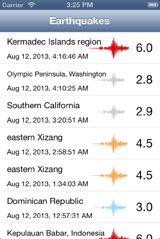

> 导航：[总目录](../../README.md) · [samplecode](../../_indexes/samplecode.md)

[Next](SeismicXML-main.m.md)

# SeismicXML: Using NSXMLParser to parse XML documents

|  |  |
| --- | --- |
| __Last Revision:__ | Version 6.0, 2016-01-08 Upgraded to the iOS 9.0 SDK, now uses NSURLSession, changed to a newer xml feed and updated the parser. [(Full Revision History)](Document%20Revision%20History.md#apple-f4xwc4dqnrsv64tfmyxwi33df52wszbpirkfgnbqgaydomzsgmwvezlwnfzws33ojbuxg5dpoj4s2rdpnz2ey2lonncwyzlnmvxhiskel4yq) |
| __Build Requirements:__ | iOS 9.0 SDK or later |
| __Runtime Requirements:__ | iOS 8.0 or later |

"SeismicXML" demonstrates how to use NSXMLParser to parse XML data. The XML parsing occurs on a background thread using NSOperation and updates the earthquakes table view with batches of parsed objects.

[Next](SeismicXML-main.m.md)

