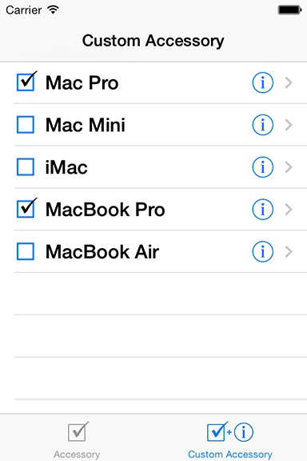

> 导航：[总目录](../../README.md) · [samplecode](../../_indexes/samplecode.md)

[Next](ReadMe.txt.md)

# TableViewCell Accessory

|  |  |
| --- | --- |
| __Last Revision:__ | Version 1.4, 2014-02-21 Updated for iOS 7; Merged in content from the 'TouchCells' sample; The checkbox is now implemented as a custom control. [(Full Revision History)](Document%20Revision%20History.md#apple-f4xwc4dqnrsv64tfmyxwi33df52wszbpirkfgnbqgaydqmbwgywvezlwnfzws33ojbuxg5dpoj4s2rdpnz2ey2lonncwyzlnmvxhiskel4yq) |
| __Build Requirements:__ | iOS 7.0 SDK or later |
| __Runtime Requirements:__ | iOS 6.0 or later |

This sample demonstrates two methods that can be used to implement a custom accessory view in your UITableViewCell's. In both examples, a custom control that implements a toggle-able checkbox is used.

The first method shows you how to override the appearance or control of the accessory view, much like that of "UITableViewCellAccessoryDetailDisclosureButton". It implements the custom accessory view by setting the table's "accessoryView" property with a custom control which draws a checkbox. It can be toggled by selecting the entire table row by implementing UITableView's "didSelectRowAtIndexPath". The checkbox is trackable (checked/unchecked), and can be toggled independent of table selection.

The second method shows how to implement a trackable-settable UIControl embedded in a UITableViewCell. This approach is handy if an application already uses its accessory view to the right of the table cell, but still wants a checkbox view that supports toggling states of individual row items. The checkbox on the left provides fulfills this need and is trackable (checked/unchecked) independent of table selection. This is a similar user interface to that of Mail's Inbox table where mail items can be individually checked and unchecked for deletion. The checkbox is trackable (checked/unchecked), and can be toggled independent of table selection.

[Next](ReadMe.txt.md)

