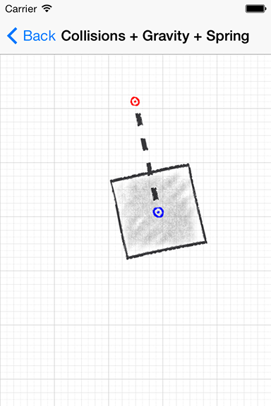

> 导航：[总目录](../../README.md) · [samplecode](../../_indexes/samplecode.md)

[Next](ReadMe.txt.md)

# UIKit Dynamics Catalog

|  |  |
| --- | --- |
| __Last Revision:__ | Version 1.3, 2013-09-23 First public release; Added additional UIKit Dynamics demonstrations and enhanced the UI; Expanded the ReadMe file to introduce each demonstration. |
| __Build Requirements:__ | Xcode 5.0 or later; iOS SDK 7.0 or later |
| __Runtime Requirements:__ | iOS 7.0 or later |

UIKit Dynamics Catalog illustrates a number of uses of UIKit Dynamics, the iOS API that provides physics-related capabilities and animations to views and other dynamic items. Each of the 10 view controllers in this project shows a different way to use UIKit Dynamics—-in many cases, combining dynamic behaviors for interesting results.

[Next](ReadMe.txt.md)

