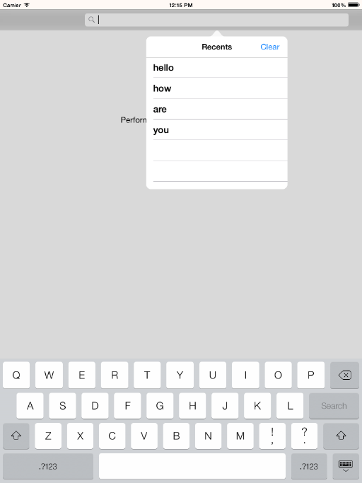

> 导航：[总目录](../../README.md) · [samplecode](../../_indexes/samplecode.md)

[Next](ReadMe.txt.md)

# Using a Search Bar in a Toolbar

|  |  |
| --- | --- |
| __Last Revision:__ | Version 2.3, 2013-09-03 Upgraded to support iOS 7 appearance. [(Full Revision History)](Document%20Revision%20History.md#apple-f4xwc4dqnrsv64tfmyxwi33df52wszbpirkfgnbqgaydsnbwgewvezlwnfzws33ojbuxg5dpoj4s2rdpnz2ey2lonncwyzlnmvxhiskel4yq) |
| __Build Requirements:__ | Xcode 5.0 or later, iOS SDK 7.0 or later |
| __Runtime Requirements:__ | iOS 6.0 or later |

"ToolbarSearch" shows how to use a search bar in a toolbar and present recent searches in a popover.

[Next](ReadMe.txt.md)

