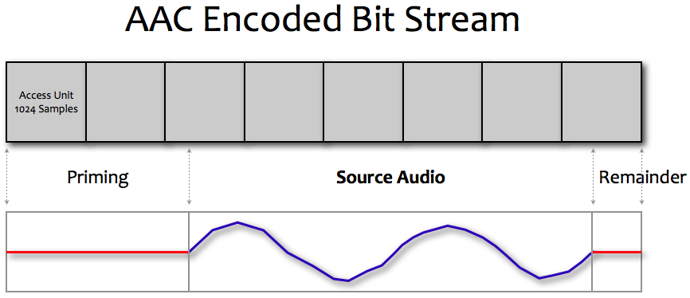

> 导航：[总目录](../../README.md) · [technotes](../../_indexes/technotes.md)

Technical Note TN2258

# AAC Audio - Encoder Delay and Synchronization

This Technical Note discusses AAC encoder delay and how it relates to synchronization with other media such as video.

[Introduction](#apple-f4xwc4dqnrsv64tfmyxwi33df52wszbpirkfgnbqgaydsmzzgywugsbrfvjukq2ujfhu4mi)[Encoder Delay](#apple-f4xwc4dqnrsv64tfmyxwi33df52wszbpirkfgnbqgaydsmzzgywugsbrfvjukq2ujfhu4mq)[Synchronization](#apple-f4xwc4dqnrsv64tfmyxwi33df52wszbpirkfgnbqgaydsmzzgywugsbrfvjukq2ujfhu4my)[The 2112 Sample Assumption](#apple-f4xwc4dqnrsv64tfmyxwi33df52wszbpirkfgnbqgaydsmzzgywugsbrfvjukq2ujfhu4na)[Encoder Delay Recommendation](#apple-f4xwc4dqnrsv64tfmyxwi33df52wszbpirkfgnbqgaydsmzzgywugsbrfvjukq2ujfhu4ni)[QuickTime And Core Audio APIs](#apple-f4xwc4dqnrsv64tfmyxwi33df52wszbpirkfgnbqgaydsmzzgywugsbrfvjukq2ujfhu4nq)[MovieAudioExtraction And Movie Playback](#apple-f4xwc4dqnrsv64tfmyxwi33df52wszbpirkfgnbqgaydsmzzgywugsbrfvjvkqstivbviskpjy3a)[Audio Converter](#apple-f4xwc4dqnrsv64tfmyxwi33df52wszbpirkfgnbqgaydsmzzgywugsbrfvjvkqstivbviskpjy3q)[Extended Audio File](#apple-f4xwc4dqnrsv64tfmyxwi33df52wszbpirkfgnbqgaydsmzzgywugsbrfvjvkqstivbviskpjy4a)[Audio Queue](#apple-f4xwc4dqnrsv64tfmyxwi33df52wszbpirkfgnbqgaydsmzzgywugsbrfvjvkqstivbviskpjy4q)[Audio File](#apple-f4xwc4dqnrsv64tfmyxwi33df52wszbpirkfgnbqgaydsmzzgywugsbrfvjvkqstivbviskpjyyta)[Reference](#apple-f4xwc4dqnrsv64tfmyxwi33df52wszbpirkfgnbqgaydsmzzgywugsbrfvjukq2ujfhu4mjs)[Document Revision History](#apple-f4xwc4dqnrsv64tfmyxwi33df52wszbpirkfgnbqgaydsmzzgywvezlwnfzws33ojbuxg5dpoj4s2rdpnz2ey2lonncwyzlnmvxhiskel4yq)

## Introduction

AAC requires additional data in order to correctly encode and decode audio samples. During the encoding process, an AAC encoder will require some number of audio samples at input before it can generate an AAC access unit (also referred to as an audio packet). During decoding, data dependencies existing between AAC access units require an AAC decoder to see the "prior" AAC access unit in order to correctly decode the current AAC access unit.

Encoder delay is the term used to describe the delay incurred at encode to produce properly encoded packets. This is the number of silent sample frames (also called priming frames) added to the front of an AAC encoded bitstream.

The term Remainder refers to the number of silent samples (padding) added to the end of an AAC bitstream to round up to the AAC access unit size.

__Note:__ The encoding delay for an AAC encoder is implementation dependent. The decoding delay for an AAC decoder should be fixed and consistent across different implementations.

[Back to Top](#)

## Encoder Delay

In the original AAC implementations, the common practice was to propagate the encoding delay in the provided AAC bitstream. With these original implementations, the most common delay used was __2112__ audio samples. Therefore, an AAC bitstream would generally be 3 AAC access units larger than what was theoretically required by the original signal.

__Note:__ AAC typically represents 1024 samples in one AAC access unit.

As this encoding delay is represented in the AAC bitstream, the first actual audio sample is 2112 samples (the length of the encoding delay) into the decoded output.

In other words, the first and second AAC access units decoded would each produce 1024 samples of silence and the third AAC access unit decoded would produce the first 960 samples of the original source data. 960 being 1024 samples minus the remaining 64 samples of the encoding delay.

__Note:__ 1024 + 1024 + 64 = 2112 encoding delay samples.

A playback implementation would then need to discard these first 2112 silent samples from the decoded output since they contain none of the original source audio data; these samples are an artifact of the encoding/decoding process.

2112 samples was chosen because at that time this was the common encoding delay used by most of the shipping implementations of AAC encoders (commercial and otherwise).

__Figure 1__

In the above diagram, the source audio to be encoded shown as the blue waveform is __5,389__ samples long.

This data will be represented in 8 AAC access units, where each access unit represents 1024 audio samples. The total duration represented by these 8 AAC access units is __8192__  samples (note that this is longer than the duration of the source audio).

The result breaks down into the following values:

- 2112 priming samples at the start - required to correctly encode the start of the audio.
- 5389 samples of actual audio.
- 691 remainder samples - required to round up the last samples to the packet size.

Therefore, to correctly extract the original 5389 samples of source audio, the first 2112 samples of priming and the last 691 samples of the remainder must be removed.

8192 - 2112 - 691 = 5389 original source samples.

__Important:__ Regardless of the length of source audio, the priming value is currently fixed at 2112 samples and the remainder will always be less than 1024 samples or 1 encoded packet long.

[Back to Top](#)

## Synchronization

If an audio playback system attempting to synchronize AAC encoded audio and video does not compensate for this delay (that is, does not discard these silent samples), the audio and video will be out of synchronization by 2112 samples -- the audio will be 2112 samples behind the video since the first real audio sample is actually 2112 samples past the beginning of the decoded data.

Therefore, a playback system must trim this data to preserve correct synchronization.

This trimming by the playback system should be done in two places:

- When playback first begins.
- When the playback position is moved to another location - for example, the user skips ahead or back to another part of the media and begins playback from that new location.

[Back to Top](#)

## The 2112 Sample Assumption

As there was no explicit notion with the first implementations of this encoding delay in an AAC bitstream, Apple chose to assume that the AAC bitstream always contained an encoding delay of 2112 samples.

With MPEG-4 and ADTS/MPEG-2 bitstreams and file containers, there is still no satisfactory and explicit signaling mechanism for either the encoding delay or remainder padding. Therefore, there is no explicit means to correctly determine the location of the first and last actual audio sample(s) in the bitstream. The [Core Audio File Format](https://developer.apple.com/mac/library/documentation/MusicAudio/Reference/CAFSpec/CAF_intro/CAF_intro.html) (`.caf`) specification contains an explicit entry in the packet table chunk to capture both of these values.

[Back to Top](#)

## Encoder Delay Recommendation

Apple recommends 3rd party products and devices generating AAC bitstreams do so with the assumption that the playback system will __always__ assume there is an encoding delay of 2112 samples in the produced bitstream. It must also be assumed that without an explicit value, the playback system will trim 2112 samples from the AAC decoder output when starting playback from any point in the bistream.

__Note:__ This problem is not unique to AAC. MP3 also has these data dependencies and delays in its bitstream, as do proprietary codecs such as AC-3 and others.

In all of these cases the behaviour is as described above; an implicit, not-signalled, assumption is made about the size of this delay and the playback engine is required to trim this designated number of samples from its output at the start of playback.

[Back to Top](#)

## QuickTime And Core Audio APIs

The default setting for AAC priming is 2112 samples, and the default setting for remainder samples is 0.

### MovieAudioExtraction And Movie Playback

When playing back a QuickTime `Movie` or when using `MovieAudioExtraction` APIs to decode audio samples from a `Movie`, the default priming and remainder samples are removed from the decoded bitstream. When creating a file, no priming or remainder information is added to any file container at this time.

### Audio Converter

When using an `AudioConverter` object directly, the default setting for priming is used for encoding and decoding.

During decode, these default may be overridden with the `kAudioConverterPrimeInfo` property and set to whatever values are appropriate.

During encode, a value may be set, however the specific encoder being used may not support your requested settings.

### Extended Audio File

With `ExtAudioFile`, priming and remainder values are read from the file (if present) and those samples are removed from the decoded bitstream automatically on behalf of the client. If these values are not present in the file, the default values are used.

### Audio Queue

`AudioQueue` objects do not handle priming or remainder samples for you, it is the clients responsibility to specify priming and remainder values if applicable.

For example, when "enqueuing" the first buffers from an AAC bitstream the client should specify 2112 samples of trimming at the start of that first buffer (if there is no specifically signaled priming samples). For the last buffer, the client should also trim out the remainder samples (if known).

Refer to the documentation for `AudioQueueEnqueueBufferWithParameters` and Q&A 1636 for more information.

### Audio File

When creating a file using the `AudioFile` API, priming and remainder file values will be written if specified with the `kAudioFilePropertyPacketTableInfo` property and the file type being written supports these values. Currently, only the Core Audio File Format (`.caf`) and MPEG-4 Audio (`.m4a`) containers have a described means to carry this information.

`ExtAudioFile` will perform this work on behalf of the client; automatically obtaining the priming information from the `AudioConverter` and calculating the remainder frames.

[Back to Top](#)

## Reference

[Technical Q&A QA1636, 'Audio Queue - Looping Compressed Audio'](https://developer.apple.com/qa/qa2009/qa1636.html)

[Advanced Audio Coding](http://en.wikipedia.org/wiki/Advanced_Audio_Coding)

[Back to Top](#)

---

#### Document Revision History

| __Date__ | __Notes__ |
| 2009-11-19 | New document that discusses AAC encoder delay and the effects on synchronization with other media such as video. |

