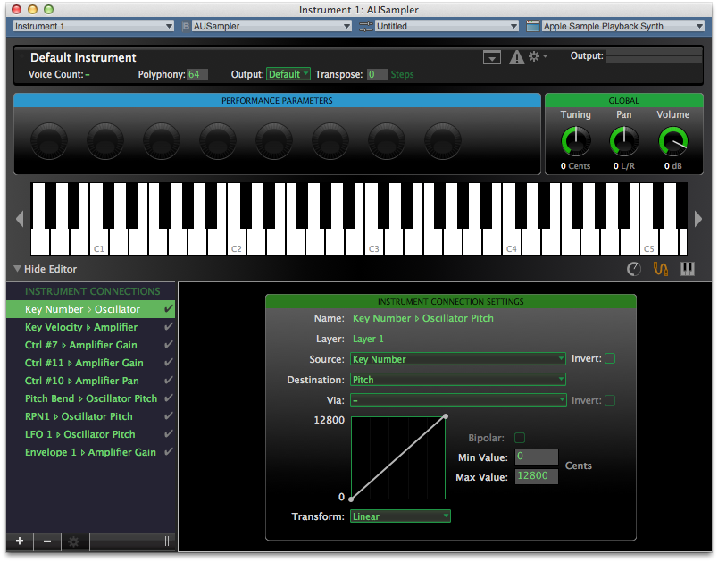
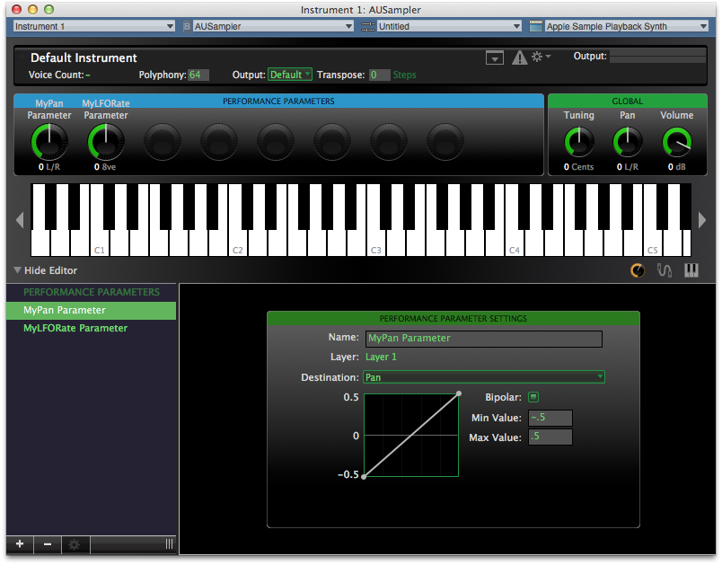
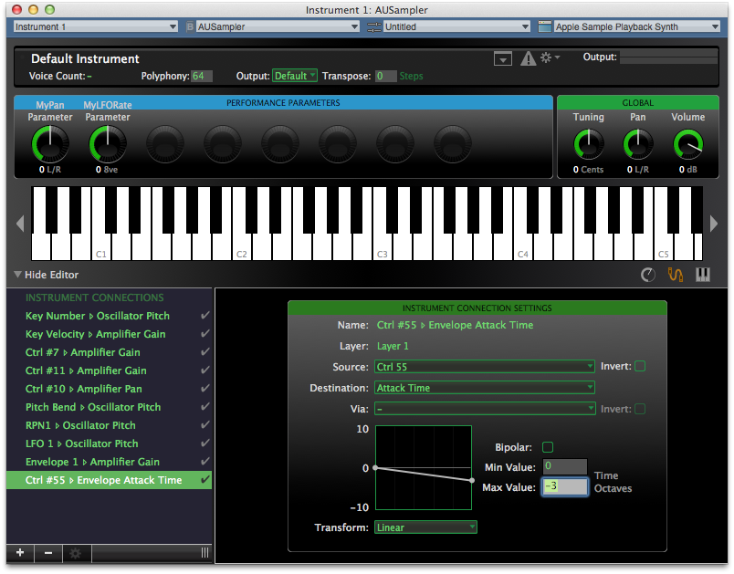
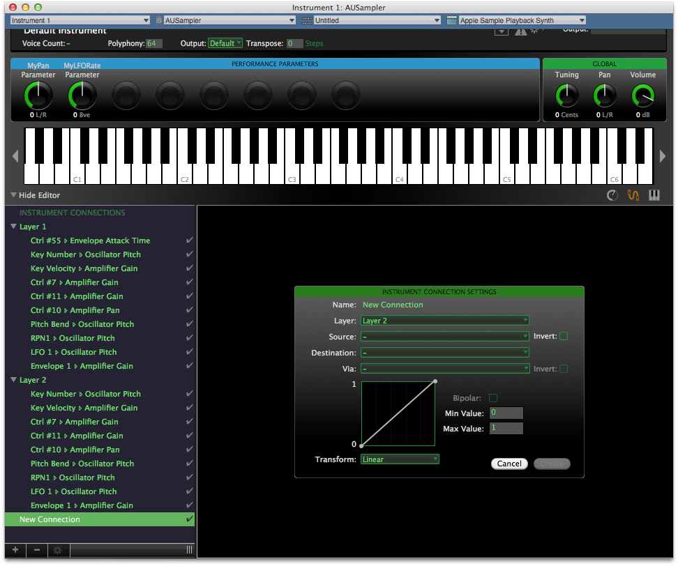

> 导航：[总目录](../../README.md) · [technotes](../../_indexes/technotes.md)


Technical Note TN2331

# AUSampler - Controlling the Settings of the AUSampler in Real Time

A Note on Terminology:

In this document, the individual internal parts of the Sampler Audio Unit’s synthesis engine are referred to as “subcomponents”. These should not be confused with audio components or any other system within the Audio Toolbox.

[Controlling the Settings of the AUSampler in Real Time](#apple-f4xwc4dqnrsv64tfmyxwi33df52wszbpirkfgnbqgaytimbsg4wugsbrfvbu6tsukjhuytcjjzdv6vciivpvgrkukreu4r2tl5humx2ujbcv6qkvknau2ucmivjf6skol5jekqkml5kestkf)[Performance Parameters](#apple-f4xwc4dqnrsv64tfmyxwi33df52wszbpirkfgnbqgaytimbsg4wugsbrfvbu6tsukjhuytcjjzdv6vciivpvgrkukreu4r2tl5humx2ujbcv6qkvknau2ucmivjf6skol5jekqkml5kestkffviekusgj5je2qkoincv6ucbkjau2rkuivjfg)[MIDI Controller Messages](#apple-f4xwc4dqnrsv64tfmyxwi33df52wszbpirkfgnbqgaytimbsg4wugsbrfvbu6tsukjhuytcjjzdv6vciivpvgrkukreu4r2tl5humx2ujbcv6qkvknau2ucmivjf6skol5jekqkml5kestkffvgusrcjl5bu6tsukjhuytcfkjpu2rktknauorkt)[Group Scope Parameters](#apple-f4xwc4dqnrsv64tfmyxwi33df52wszbpirkfgnbqgaytimbsg4wugsbrfvbu6tsukjhuytcjjzdv6vciivpvgrkukreu4r2tl5humx2ujbcv6qkvknau2ucmivjf6skol5jekqkml5kestkffvdvet2vkbpvgq2pkbcv6ucbkjau2rkuivjfg)[What Settings Can I Control in this Fashion?](#apple-f4xwc4dqnrsv64tfmyxwi33df52wszbpirkfgnbqgaytimbsg4wugsbrfvbu6tsukjhuytcjjzdv6vciivpvgrkukreu4r2tl5humx2ujbcv6qkvknau2ucmivjf6skol5jekqkml5kestkffvluqqkul5jukvcujfheou27inau4x2jl5bu6tsukjhuyx2jjzpviscjknpumqktjbeu6ts7)[Document Revision History](#apple-f4xwc4dqnrsv64tfmyxwi33df52wszbpirkfgnbqgaytimbsg4wvezlwnfzws33ojbuxg5dpoj4s2rdpnz2ey2lonncwyzlnmvxhiskel4yq)

## Controlling the Settings of the AUSampler in Real Time

The Sampler Audio Unit supports the ability to modify the settings of its subcomponents (oscillator pitch, filter cutoff, envelope attack time, etc.) via control information supplied in real time by the host application. The control inputs of all subcomponents are designed as “summing” inputs: The overall effect of the inputs is always equal to the linear sum of all connected inputs (in whatever units the input expects). This means that each connection input added for real-time control will be combined with the existing inputs to produce the final result.

The full set of currently-connected inputs can always be examined via the INSTRUMENT CONNECTIONS panel in AU Lab’s editor for the Sampler (See Figure 1). The control input connections themselves are configured in advance as part of a preset created using AU Lab. Each connection is set up to modify the value of a particular subcomponent on a one-to-one basis. The relationship between the value at the input of the connection and the value that is sent to the subcomponent’s input is called the “mapping”. This is configurable and extremely flexible.

__Figure 1__  AULab Instrument Connections Panel.



There are three types of real-time connection:

- Performance Parameters
- MIDI Controller Messages
- Group Scope Parameters

### Performance Parameters

Performance Parameters are a set of eight Audio Unit parameter values (1000-1007) which can be configured to modify any of the Sampler’s subcomponents. These parameters are discoverable via the `kAudioUnitProperty_ParameterList` property, and they default to an “unmapped” state in which they control nothing, and by default are named “Performance Parameter 1” through “Performance Parameter 8". The input range for Performance Parameters is always normalized to -1.0 to 1.0, or 0.0 to 1.0, depending on what input is being controlled.

The advantage of these parameters over the other types of input connections is that they are discoverable (via the AUParameterInfo mechanism) by host applications such as Logic Studio, so they can take full advantage of the parameter automation features of such applications. They can be created and configured using the PERFORMANCE PARAMETERS panel in AU Lab’s editor for the Sampler.

In Figure 2, two Performance Parameters have been created and given them custom names. The first of these is selected to show that the parameter is mapped to the Pan input for the Layer.

__Figure 2__  AULab Performance Parameters Panel.



### MIDI Controller Messages

In order for the default Sampler Audio Unit (i.e., with no user preset loaded) to behave in a reasonable fashion in response to MIDI input, it is set up to use several of the standard General MIDI controller connections. Among these are controller #7 and #11 modifying gain, controller #10 modifying pan, and so forth. The input range of these messages conforms to the MIDI specification’s range of 0 to 127. The vast majority of the 128 total MIDI controller numbers are not set up by default to modify anything, and are available to use as control inputs for various Sampler subcomponents, which is useful if you have a complex preset.

Once a MIDI controller connection is configured and loaded as part of the preset, each particular subcomponent can be modified independently by sending MIDI control messages with the specific controller numbers (and values) to the Sampler via `MusicDeviceMIDIEvent`. Each of these connections may be created, modified, and examined using the INSTRUMENT CONNECTIONS panel in AU Lab’s editor for the Sampler.

In Figure 3 an additional connection has been created, mapping MIDI controller #55 to the Attack Time of the Layer's envelope.

__Figure 3__  Creating MIDI Controller Connections.



### Group Scope Parameters

The Sampler Audio Unit also supports a way to send control information to any MIDI controller connection (described above) using AudioUnitSetParameter() calls rather than sending MIDI events. When parameter values are set on the Sampler using the Audio Unit Scope `kAudioUnitScope_Group`, the parameter change is interpreted as though the parameter ID was a MIDI controller number. For example, the code in Listing 1 will produce the same effect on a Sampler which has a connection set up for MIDI controller #55:

__Listing 1__

```
UInt8 channel = 0;
UInt8 controllerNumber = 55;
UInt8 controllerValue = 127; /* set it to max */

MusicDeviceMIDIEvent(theSampler,
                     kMidiMessage_ControlChange|channel, /* status combines the message type and channel */
                     controllerNumber,
                     controllerValue,
                     0);

AudioUnitSetParameter(theSampler,
                      controllerNumber,
                      kAudioUnitScope_Group,
                      (AudioUnitElement )channel,
                      (AudioUnitParameterValue) controllerValue,
                      0);
```

These parameters are not externally discoverable like the Performance Parameters, but using MIDI events you can still create MIDI control data which will, when played back via the Sampler, automate the changes to the subcomponents controlled by those connections.

__Note:__ If no connection exists for MIDI controller #55, neither of the above calls will have any effect, nor will they return an error (a nonexistent connection is legal).

### What Settings Can I Control in this Fashion?

Here is a list of the subcomponents and their inputs that can be controlled using connections:

#### Amplifier

__Table 1__

| Parameter | Units |
| Gain | Decibels (-96 to 0) |
| Pan | Percent (-0.5 to 0.5) |

#### Oscillator

__Table 2__

| Parameter | Units |
| Pitch | Cents |
| Sample Start | Milliseconds |
| Sample Start Factor | Percentage of sample length (1.0 == 100%) |

#### Filter

__Table 3__

| Parameter | Units |
| Cutoff | Cents |
| Resonance (Q) | Decibels |

#### LFO

__Table 4__

| Parameter | Units |
| Delay Time | Time Octaves\*\* |
| Rate | Octaves |

#### Envelope

__Table 5__

| Parameter | Units |
| Delay Time | Time Octaves\*\* |
| Attack Time | Time Octaves\*\* |
| Hold Time | Time Octaves\*\* |
| Decay Time | Time Octaves\*\* |
| Release Time | Time Octaves\*\* |
| Sustain Level | Percent (1.0 == 100%) |

__Note:__ __\*\*__ The term "Time Octaves" refers to a way of controlling time in an exponential fashion, such that a value of 1.0 doubles the amount of time, 2.0 quadruples it, and so on.

__Note:__ Envelope Factor-based versions of Delay Time, Attack Time, Hold Time, Decay Time and Release Time use Linear time factor units, (e.g. an attack value of 3.0 implies the envelope takes 3x longer to attack).

It is important to remember that within any Sampler preset, the filters, oscillators, low frequency oscillators, and envelopes are defined at the Layer level, so presets with multiple layers have multiple independent sets of subcomponents, each of which can be controlled independently. If you open a preset with multiple layers in AU Lab’s INSTRUMENT CONNECTIONS editor, you will see the “destination” for each connection specifies both the layer number and the particular subcomponent input.

In Figure 4, a new connection is being created which will control a subcomponent in Layer 2.

__Figure 4__  Instrument Connections For Multiple Layers

[Back to Top](#)

---

#### Document Revision History

| __Date__ | __Notes__ |
| 2014-01-16 | New document that discusses different methods of controlling the AUSampler audio unit in real time. |

