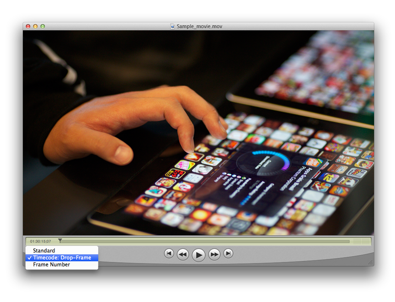
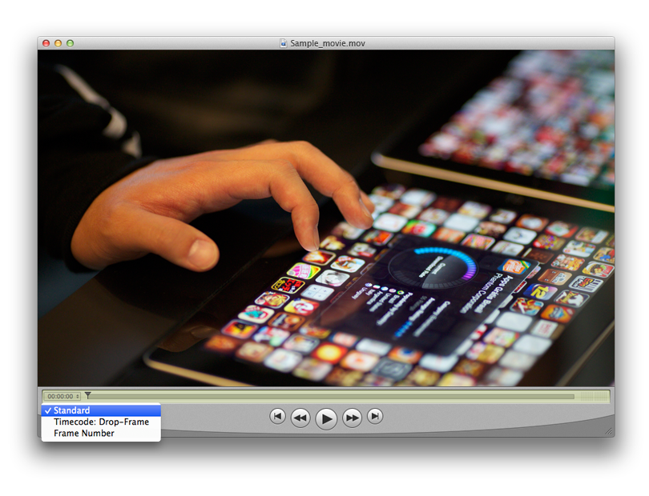

> 导航：[总目录](../../README.md) · [technotes](../../_indexes/technotes.md)


Technical Note TN2310

# AVFoundation - Timecode Support with AVAssetWriter and AVAssetReader

AVFoundation includes support for timecode tracks. Timecode tracks allow you to store external timecode information such as SMPTE timecode, in QuickTime movie files (.mov). This technical note discusses how to write and read a 32-bit timecode (`'tmcd'`) media sample with `AVAssetWriter` and `AVAssetReader`.

[Prerequisites](#apple-f4xwc4dqnrsv64tfmyxwi33df52wszbpirkfgnbqgaytgmztgqwugsbrfviferksivivksktjfkekuy)[About Timecodes](#apple-f4xwc4dqnrsv64tfmyxwi33df52wszbpirkfgnbqgaytgmztgqwugsbrfvke4vcbi4yq)[AVAssetWriter Writing Timecode](#apple-f4xwc4dqnrsv64tfmyxwi33df52wszbpirkfgnbqgaytgmztgqwugsbrfvavmqktkncviv2sjfkekus7k5jesvcjjzdv6vcjjvcugt2eiu)[Creating a Timecode Track](#apple-f4xwc4dqnrsv64tfmyxwi33df52wszbpirkfgnbqgaytgmztgqwugsbrfvavmqktkncviv2sjfkekus7k5jesvcjjzdv6vcjjvcugt2eiuwugusfifkestshl5av6vcjjvcugt2eivpviusbinfq)[The Timecode Format Description](#apple-f4xwc4dqnrsv64tfmyxwi33df52wszbpirkfgnbqgaytgmztgqwugsbrfvavmqktkncviv2sjfkekus7k5jesvcjjzdv6vcjjvcugt2eiuwviscfl5kestkfinhuirk7izhvetkbkrpuirktinjesucujfhu4)[The Timecode Media Sample](#apple-f4xwc4dqnrsv64tfmyxwi33df52wszbpirkfgnbqgaytgmztgqwugsbrfvavmqktkncviv2sjfkekus7k5jesvcjjzdv6vcjjvcugt2eiuwviscfl5kestkfinhuirk7jvcuiskbl5juctkqjrcq)[Appending a Timecode Media Sample](#apple-f4xwc4dqnrsv64tfmyxwi33df52wszbpirkfgnbqgaytgmztgqwugsbrfvavmqktkncviv2sjfkekus7k5jesvcjjzdv6vcjjvcugt2eiuwucucqivheiskoi5pucx2ujfgukq2pircv6tkfireucx2tifgvatcf)[AVAssetReader Reading Timecode](#apple-f4xwc4dqnrsv64tfmyxwi33df52wszbpirkfgnbqgaytgmztgqwugsbrfvavmqktkncviusfifcekus7kjcucrcjjzdv6vcjjvcugt2eiu)[Timecode Utility Functions](#apple-f4xwc4dqnrsv64tfmyxwi33df52wszbpirkfgnbqgaytgmztgqwugsbrfvke4vcbi43a)[Verifying The Timecode Track](#apple-f4xwc4dqnrsv64tfmyxwi33df52wszbpirkfgnbqgaytgmztgqwugsbrfvlekusjizmustshl5keqrk7kreu2rkdj5cekx2ukjaugsy)[About The TimeCode64 Format Type](#apple-f4xwc4dqnrsv64tfmyxwi33df52wszbpirkfgnbqgaytgmztgqwugsbrfvauet2vkrpviscfl5kestkfinhuirjwgrpumt2sjvavix2ulfiek)[References](#apple-f4xwc4dqnrsv64tfmyxwi33df52wszbpirkfgnbqgaytgmztgqwugsbrfvke4vcbi4ytc)[Document Revision History](#apple-f4xwc4dqnrsv64tfmyxwi33df52wszbpirkfgnbqgaytgmztgqwvezlwnfzws33ojbuxg5dpoj4s2rdpnz2ey2lonncwyzlnmvxhiskel4yq)

## Prerequisites

This technical note assumes the reader is familiar with AVFoundation and more specifically with the `AVAssetWriter` and `AVAssetReader` classes. Some background with CoreMedia Sample Buffer APIs is also assumed. See the [References](#apple-f4xwc4dqnrsv64tfmyxwi33df52wszbpirkfgnbqgaytgmztgqwugsbrfvke4vcbi4ytc) section of this document for more information.

[Back to Top](#)

## About Timecodes

QuickTime movie files (.mov) allow for the storage of timing information that is derived from the movie’s original source material such as frame duration that affects how the media is interpreted and played.

QuickTime movie files also allow you to store additional timing information that will not specifically affect media playback. This additional timing information would typically be derived from the original source material; for example, as SMPTE timecode. In essence, you can think of the timecode as providing a link between the media specific timing information and the timing information from the original source material.

A QuickTime movie file's timecode information is stored in a timecode track. Timecode tracks contain a format description consisting of the following:

- Timecode format information specifying the characteristics of the timecode and how to interpret the timecode information.
- Frame numbers as a way to map from a given movie frame, in terms of AVFoundation time values, to its corresponding timecode value.
- Source identification information which optionally can identify a source name, for example the name of the source reel, clip or project.

The information that is stored in the track is in a manner that is independent of any specific timecode standard. The format of this information is sufficiently flexible to accommodate all known timecode standards, including SMPTE timecode which is the focus of this technical note. The timecode format information provides AVFoundation users with the parameters for understanding the timecode and converting time values into timecode time values and vice versa.

One key timecode attribute relates to the technique used to synchronize timecode values with video frames. Most video source material is recorded at whole-number frame rates. For example, both PAL and SECAM video contain exactly 25 frames-per-second. However, some video source material is not recorded at whole-number frame rates. In particular, NTSC color video contains 29.97 frames-per-second (though it is typically referred to as 30 frames-per-second video). However, NTSC timecode values correspond to the full 30 frames-per-second rate; this is a holdover from NTSC black-and-white video. For such video sources, you need a mechanism that corrects the error that will develop over time between timecode values and actual video frames.

A common method for maintaining synchronization between timecode values and video data is called dropframe. Contrary to its name, the dropframe technique actually skips timecode values at a predetermined rate in order to keep the timecode and video data synchronized. It does not actually drop video frames. In NTSC color video, which uses the dropframe technique, the timecode values skip two frame values every minute, except for minute values that are evenly divisible by ten. So NTSC timecode values, which are expressed as HH:MM:SS:FF (hours, minutes, seconds, frames) skip from 00:00:59:29 to 00:01:00:02 (skipping 00:01:00:00 and 00:01:00:01). There is a flag in the timecode format description that indicates whether the timecode uses the drop-frame technique.

[Back to Top](#)

## AVAssetWriter Writing Timecode

An `AVAssetWriter` object is used to write media data to a new file of a specified audiovisual container type. For timecode, this should be a QuickTime movie file (.mov) which is defined in AVFoundation as `AVFileTypeQuickTimeMovie`.

Creating the timecode track and appending timecode media is performed in the same manner used to create any other track type for adding audio or video media using `AVAssetWriter`. Create an `AVAssetWriter` for the `AVFileTypeQuickTimeMovie` file type. Create an `AVAssetWriterInput` with the timecode media type `AVMediaTypeTimecode`, to write the timecode track. Make a format description describing the specific timecode media type being used (`kCMTimeCodeFormatType_TimeCode32` is the most common) by calling `CMTimeCodeFormatDescriptionCreate`. This format description defines the timecode data format you will be adding to the track. Then use core media sample buffer APIs such as `CMSampleBufferCreate` to create the sample media buffer and finally the `AVAssetWriterInput` `-(BOOL)appendSampleBuffer:(CMSampleBufferRef)sampleBuffer` method to add the timecode media sample buffer to the timecode track.

### Creating a Timecode Track

To create the timecode track create an `AVAssetWriterInput` with the `AVMediaTypeTimecode` media type.

When working with timecode tracks you must also define the relationship between the timecode track and one or more video tracks the timecode is associated with. This is done by using the videos `AVAssetWriterInput` objects `-(void)addTrackAssociationWithTrackOfInput:(AVAssetWriterInput *)input type:(NSString *)trackAssociationType` method to set up this track association.

Listing 1 demonstrates how to create `AVAssetWriter` and `AVAssetWriterInput` objects for both a video and timecode track and how to set up the track association.

__Listing 1__  Creating a `AVAssetWriterInput` for TimeCode Media.

```
AVAssetWriter *assetWriter = [[AVAssetWriter alloc] initWithURL:localOutputURL
                  fileType:AVFileTypeQuickTimeMovie error:&localError];

...

// Setup video track to write video samples into
AVAssetWriterInput *videoInput = [AVAssetWriterInput assetWriterInputWithMediaType:
                                    [videoTrack mediaType] outputSettings:nil];

[assetWriter addInput:videoInput];

...

// Setup timecode track to write timecode samples into
AVAssetWriterInput *timecodeInput =
                        [AVAssetWriterInput assetWriterInputWithMediaType:AVMediaTypeTimecode
                            outputSettings:nil];

// add track association with video track
[videoInput addTrackAssociationWithTrackOfInput:timecodeInput
    type:AVTrackAssociationTypeTimecode];

[assetWriter addInput:timecodeInput];
```

Each sample in the timecode track provides timecode information for a span of movie time. The timecode media sample includes duration information. As a result, you typically add each timecode sample after you have created the corresponding content track or tracks.

__Note:__ By default a timecode's track dimensions are set to __0.0 x 0.0__. If there is a need to change this default, the `AVAssetWriterInput` property `naturalSize` may be used to set track dimensions.

`@property (nonatomic) CGSize naturalSize`

### The Timecode Format Description

The timecode media format description contains the control information that allows AVFoundation to interpret the samples. The actual sample data contains a frame number that identifies one or more video content frames that use this timecode. Stored as a `Big-Endian` `int32_t` when using the format type `kCMTimeCodeFormatType_TimeCode32`, this value identifies the first frame in the group of frames that use this timecode sample. In the case of a movie made from source material that contains no edits, you would only need one sample. When the source material contains edits, you typically need one sample for each edit. Those samples would contain the frame numbers of the frames that begin each new group of frames.

To create the format description use `CMTimeCodeFormatDescriptionCreate`.

```
/*!
    @function   CMTimeCodeFormatDescriptionCreate
    @abstract   Creates a format description for a timecode media.
    @discussion The caller owns the returned CMFormatDescription,
                and must release it when done with it. All input parameters
                are copied (the extensions are deep-copied).
                The caller can deallocate them or re-use them after making this call.
*/
CM_EXPORT OSStatus CMTimeCodeFormatDescriptionCreate(
    CFAllocatorRef allocator,                   /*! @param allocator
                                                    Allocator to be used for creating the
                                                    FormatDescription object */
    CMTimeCodeFormatType timeCodeFormatType,    /*! @param timeCodeFormatType
                                                    One of the CMTimeCodeFormatTypes */
    CMTime frameDuration,                       /*! @param frameDuration
                                                    Duration of each frame (eg. 100/2997) */
    uint32_t frameQuanta,                       /*! @param frameQuanta
                                                    Frames/sec for timecode (eg. 30) OR
                                                    frames/tick for counter mode */
    uint32_t tcFlags,                           /*! @param tcFlags
                                                    kCMTimeCodeFlag_DropFrame,
                                                    kCMTimeCodeFlag_24HourMax,
                                                    kCMTimeCodeFlag_NegTimesOK */
    CFDictionaryRef extensions,                 /*! @param extensions
                                                    Keys are always CFStrings. Values are
                                                    always property list objects (ie. CFData).
                                                    May be NULL. */
    CMTimeCodeFormatDescriptionRef *descOut) /*! @param descOut
                                                Receives the newly-created CMFormatDescription. */
__OSX_AVAILABLE_STARTING(__MAC_10_7,__IPHONE_4_0);
```

The timecode format description defines the format and content of a timecode media sample and is composed of the following information:

- Timecode format type (CMTimeCodeFormatType) - one of the time code format types, for example `kCMTimeCodeFormatType_TimeCode32`, which describes the sample type as a 32-bit integer.
- Frame Duration (`CMTime`) - the duration of each frame (eg. 100/2997). This specifies how long each frame lasts as defined by the time scale.
- Frame Quanta (`uint32_t`) - Indicates the number of frames stored per second, for example 30.
- Time Code Flags (`uint32_t`) - Flags that provide some timecode format information, for example `kCMTimeCodeFlag_DropFrame` indicating that the timecode drops frames occasionally in order to stay in synchronization. Some timecodes run at other than a whole number of frames-per-second. For example, NTSC video runs at 29.97 frames-per-second. In order to resynchronize between the timecode rate and a 30 frames-per-second playback rate, the timecode drops a frame at a predictable time (in much the same way that leap years keep the calendar synchronized). Set this flag to 1 if the timecode uses the drop-frame technique. Other flags include `kCMTimeCodeFlag_24HourMax` to indicate that the timecode values wrap at 24 hours. Set this flag to 1 if the timecode hour value wraps (that is, returns to 0) at 24 hours and `kCMTimeCodeFlag_NegTimesOK` to indicate that the timecode supports negative time values. Set this flag to 1 if the timecode allows negative values.
- Extensions (`CFDictionary`) - An optional dictionary providing the source name information (`kCMTimeCodeFormatDescriptionExtension_SourceReferenceName`). This extension is a `CFDictionary` containing the following two keys; `kCMTimeCodeFormatDescriptionKey_Value` a `CFString` and `kCMTimeCodeFormatDescriptionKey_LangCode` a `CFNumber`. The description key might contain the name of the videotape from which the movie was created.

#### Creating a Timecode Format Description

The best way to understand how to format and interpret the timecode format description is to consider an example. If you were creating a movie from an NTSC video source recorded at 29.97 frames-per-second, you would create a format description as follows:

__Listing 2__  Create a TimeCode Format Description.

```
...

CMTimeCodeFormatDescriptionRef formatDescription = NULL;
uint32_t tcFlags = kCMTimeCodeFlag_DropFrame | kCMTimeCodeFlag_24HourMax;

OSStatus status = CMTimeCodeFormatDescriptionCreate(kCFAllocatorDefault,
                                                    kCMTimeCodeFormatType_TimeCode32,
                                                    CMTimeMake(100, 2997),
                                                    30,
                                                    tcFlags,
                                                    NULL,
                                                    &formatDescription);
...
```

The movie’s natural frame rate of 29.97 frames-per-second is obtained by dividing the timescale value by the frame duration (2997 / 100). The flags field indicates that the timecode uses the drop-frame technique to resync the movie’s natural frame rate of 29.97 frames-per-second with its playback rate of 30 frames-per-second.

### The Timecode Media Sample

The media sample written to the track contains a frame number that identifies one or more video frames that use this timecode. When using the timecode format type `kCMTimeCodeFormatType_TimeCode32` this frame number is stored as a `Big-Endian` `int32_t`.

Given a timecode format description, you can convert from frame numbers to SMPTE time values and from SMPTE time values to frame numbers. A simple example of this is for a SMPTE time value of 00:00:12:15 (HH:MM:SS:FF) 30fps, non-drop frame, you would obtain a frame number of 375 ((12\*30) + 15). See the [Timecode Utility Functions](#apple-f4xwc4dqnrsv64tfmyxwi33df52wszbpirkfgnbqgaytgmztgqwugsbrfvke4vcbi43a) section of this document for two utility functions that allow you to perform these back and forth conversions for the `kCMTimeCodeFormatType_TimeCode32` timecode sample format type.

When working with SMPTE time values the Core Video `CVSMPTETime` structure is used to store these time values. The `CVSMPTETime` structure allows you to interpret the time information as time values (HH:MM:SS:FF) and is defined as follows:

```swift
struct CVSMPTETime
{
    SInt16  subframes;
    SInt16  subframeDivisor;
    UInt32  counter;
    UInt32  type;
    UInt32  flags;
    SInt16  hours;
    SInt16  minutes;
    SInt16  seconds;
    SInt16  frames;
};
typedef struct CVSMPTETime    CVSMPTETime;
```

If timecode values allow negative time values (format description flags field has the `kCMTimeCodeFlag_NegTimesOK` flag set), the minutes field of the `CVSMPTETime` structure indicates whether the time value is positive or negative. If the `tcNegativeFlag (0x80)` bit of the minutes field is set, the time value is negative.

#### Timecode Sample Data

__Note:__ 'tmcd' Timecode Sample Data Format - QuickTime File Format Specification.

```
CMTimeCodeFormatType_TimeCode32 ('tmcd') Timecode Sample Data Format.

The timecode media sample data format is a big-endian signed 32-bit integer and may be interpreted into a timecode value as follows:

Hours
An 8-bit unsigned integer that indicates the starting number of hours.

Negative
A 1-bit value indicating the time’s sign. If bit is set to 1, the timecode record value is negative.

Minutes
A 7-bit integer that contains the starting number of minutes.

Seconds
An 8-bit unsigned integer indicating the starting number of seconds.

Frames
An 8-bit unsigned integer that specifies the starting number of frames. This field’s value cannot exceed the value of the frame quanta value in the timecode format description.
```

#### Creating a Timecode Media Sample

Listing 3 demonstrates the steps required to create a timecode media sample. The method creates a single timecode media sample for SMPTE time 01:30:15:07 (HH:MM:SS:FF), 30fps drop-frame format lasting the entire duration of the video track.

__Listing 3__  Create a Timecode Media Sample.

```objc
// this method creates a single SMPTE timecode media sample for time 01:30:15:07 (HH:MM:SS:FF)
// 30fps, drop frame format lasting the entire duration of the video track
- (CMSampleBufferRef)createTimecodeSampleBuffer
{
    CMSampleBufferRef sampleBuffer = NULL;
    CMBlockBufferRef dataBuffer = NULL;

    CMTimeCodeFormatDescriptionRef formatDescription = NULL;
    CVSMPTETime timecodeSample = {0};

    OSStatus status = noErr;

    timecodeSample.hours   = 1; // HH
    timecodeSample.minutes = 30; // MM
    timecodeSample.seconds = 15; // SS
    timecodeSample.frames  = 7; // FF

    status = CMTimeCodeFormatDescriptionCreate(kCFAllocatorDefault, kCMTimeCodeFormatType_TimeCode32, CMTimeMake(100, 2997), 30, kCMTimeCodeFlag_DropFrame | kCMTimeCodeFlag_24HourMax, NULL, &formatDescription);

    if ((status != noErr) || !formatDescription) {
        NSLog(@"Could not create format description");
    }

    // use utility function to convert CVSMPTETime time into frame number to write
    int32_t frameNumberData = frameNumber32ForTimecodeUsingFormatDescription(timecodeSample, formatDescription);

    status = CMBlockBufferCreateWithMemoryBlock(kCFAllocatorDefault, NULL, sizeof(int32_t), kCFAllocatorDefault, NULL, 0, sizeof(int32_t), kCMBlockBufferAssureMemoryNowFlag, &dataBuffer);
    if ((status != kCMBlockBufferNoErr) || !dataBuffer) {
        NSLog(@"Could not create block buffer");
    }

    status = CMBlockBufferReplaceDataBytes(&frameNumberData, dataBuffer, 0, sizeof(int32_t));
    if (status != kCMBlockBufferNoErr) {
        NSLog(@"Could not write into block buffer");
    }

    CMSampleTimingInfo timingInfo;
    // duration of each timecode sample is from the current frame to the next frame specified along with a timecode
    // in this case the single sample will last the entire duration of the video content
    timingInfo.duration = [[sourceVideoTrack asset] duration];
    timingInfo.decodeTimeStamp = kCMTimeInvalid;
    timingInfo.presentationTimeStamp = kCMTimeZero;

    size_t sizes = sizeof(int32_t);
    status = CMSampleBufferCreate(kCFAllocatorDefault, dataBuffer, true, NULL, NULL, formatDescription, 1, 1, &timingInfo, 1, &sizes, &sampleBuffer);
    if ((status != noErr) || !sampleBuffer) {
        NSLog(@"Could not create block buffer");
    }

    CFRelease(formatDescription);
    CFRelease(dataBuffer);

    return sampleBuffer;
}
```

### Appending a Timecode Media Sample

Appending a timecode media sample is done in the same fashion as other media data. The `AVAssetWriterInput` `-(BOOL)appendSampleBuffer:(CMSampleBufferRef)sampleBuffer` method is used to append media samples packaged as CMSampleBuffer objects. Listing 4 shows some standard AVFoundation code used to append the timecode sample buffer created in listing 3.

__Listing 4__  Appending a Sample Buffer.

```
...

if ([timecodeInput isReadyForMoreMediaData] && !completedOrFailed) {
    CMSampleBufferRef sampleBuffer = NULL;

    sampleBuffer = [timecodeSampleBufferGenerator createTimecodeSampleBuffer];

    if (sampleBuffer != NULL) {
        BOOL success = [timecodeInput appendSampleBuffer:sampleBuffer];
        CFRelease(sampleBuffer);
        sampleBuffer = NULL;

        completedOrFailed = !success;
    } else {
        completedOrFailed = YES;
    }
}

...
```

[Back to Top](#)

## AVAssetReader Reading Timecode

An `AVAssetReader` object is used to obtain the media data of an asset. Reading a timecode media sample(s) stored in a timecode track is performed in the same manner used to read any other media such as audio or video media using `AVAssetReader`.

Once you allocate an `AVAssetReader` object with the asset you want to read from, create an `AVAssetReaderTrackOutput` for the timecode track then call `-(BOOL)startReading` to prepare the reader for reading sample buffers from the asset. Then send the `-(CMSampleBufferRef)copyNextSampleBuffer` method to the track output object to receive a timecode sample.

The returned `CMSampleBufferRef` containing the timecode sample may be interpreted as required by the application, for example the returned frame number may be converted to a `CVSMPTETime` representation. See the [Timecode Utility Functions](#apple-f4xwc4dqnrsv64tfmyxwi33df52wszbpirkfgnbqgaytgmztgqwugsbrfvke4vcbi43a) section of this document for utility functions that allow you to perform conversions for the `kCMTimeCodeFormatType_TimeCode32` timecode sample format type. To retrieve the format description describing the format details of the timecode sample call `CMSampleBufferGetFormatDescription`.

Listing 5 demonstrates how to create an `AVAssetReader` object and a `AVAssetReaderTrackOutput` object for a timecode media track.

__Listing 5__  Creating a Reader and Reader Output Object.

```
...

// Create asset reader
assetReader = [[AVAssetReader alloc] initWithAsset:localAsset error:&localError];
success = (assetReader != nil);

// Create asset reader output for the first timecode track of the asset
if (success) {
    AVAssetTrack *timecodeTrack = nil;

    // Grab first timecode track, if the asset has them
    NSArray *timecodeTracks = [localAsset tracksWithMediaType:AVMediaTypeTimecode];
    if ([timecodeTracks count] > 0)
        timecodeTrack = [timecodeTracks objectAtIndex:0];

    if (timecodeTrack) {
        timecodeOutput = [AVAssetReaderTrackOutput assetReaderTrackOutputWithTrack:timecodeTrack outputSettings:nil];
        [assetReader addOutput:timecodeOutput];
    } else {
        NSLog(@"%@ has no timecode tracks", localAsset);
    }
}

...
```

Listing 6 presents two methods. The first demonstrates how to read sample buffers from an `AVAssetReaderTrackOutput` and the second demonstrates how to retrieve the sample data and interpret it. In this case, calling one of the timecode utility functions from the [Timecode Utility Functions](#apple-f4xwc4dqnrsv64tfmyxwi33df52wszbpirkfgnbqgaytgmztgqwugsbrfvke4vcbi43a) section of this document to convert the sample data to a `CVSMPTETime` then simply printing out the values.

__Listing 6__  Read a Timecode Sample Buffer and print out the `CVSMPTETime`.

```objc
- (BOOL)startReadingAndPrintingOutputReturningError:(NSError **)outError
{
    BOOL success = YES;
    NSError *localError = nil;

    // Instruct the asset reader to get ready to do work
    success = [assetReader startReading];

    if (!success) {
        localError = [assetReader error];
    } else {
        CMSampleBufferRef currentSampleBuffer = NULL;

        while ((currentSampleBuffer = [timecodeOutput copyNextSampleBuffer])) {
            [self outputTimecodeDescriptionForSampleBuffer:currentSampleBuffer];
        }

        if (currentSampleBuffer) {
            CFRelease(currentSampleBuffer);
        }
    }

    if (!success && outError)
        *outError = localError;

    return success;
}

- (void)outputTimecodeDescriptionForSampleBuffer:(CMSampleBufferRef)sampleBuffer
{
    CMBlockBufferRef blockBuffer = CMSampleBufferGetDataBuffer(sampleBuffer);
    CMFormatDescriptionRef formatDescription =  CMSampleBufferGetFormatDescription(sampleBuffer);

    if (blockBuffer && formatDescription) {

        size_t length = 0;
        size_t totalLength = 0;
        char *rawData = NULL;

        OSStatus status = CMBlockBufferGetDataPointer(blockBuffer, 0, &length, &totalLength, &rawData);
        if (status != kCMBlockBufferNoErr) {
            NSLog(@"Could not get data from block buffer");
        }
        else {

            CMMediaType type = CMFormatDescriptionGetMediaSubType(formatDescription);

            if (type == kCMTimeCodeFormatType_TimeCode32) {
                int32_t *frameNumberRead = (int32_t *)rawData;
                CVSMPTETime timecode = timecodeForFrameNumber32UsingFormatDescription(*frameNumberRead, formatDescription);

                BOOL dropFrame = CMTimeCodeFormatDescriptionGetTimeCodeFlags(formatDescription) & kCMTimeCodeFlag_DropFrame;
                char separator = dropFrame ? ',' : '.';
                NSLog(@"%@",[NSString stringWithFormat:@"HH:MM:SS%cFF => %02d:%02d:%02d%c%02d (frame number: %d)", separator, timecode.hours, timecode.minutes, timecode.seconds,  separator, timecode.frames, (int)Endian32_Swap(*frameNumberRead)]);
            }
        }
    }
}
```

[Back to Top](#)

## Timecode Utility Functions

Listing 7 and 8 provide utility functions demonstrating how to convert from a `CVSMPTETime` to a frame number and from the frame number to a `CVSMPTETime` for the `kCMTimeCodeFormatType_TimeCode32` timecode media sample format.

```
enum {
    tcNegativeFlag = 0x80    /* negative bit is in minutes */
};
```

__Listing 7__  `CVSMPTETime` to Frame Number (`kCMTimeCodeFormatType_TimeCode32` Media Sample)

```
int32_t frameNumber32ForTimecodeUsingFormatDescription(CVSMPTETime timecode, CMTimeCodeFormatDescriptionRef formatDescription)
{
    int32_t frameNumber = 0;

    if (CMTimeCodeFormatDescriptionGetFormatType(formatDescription) == kCMTimeCodeFormatType_TimeCode32) {
        int32_t frameQuanta = CMTimeCodeFormatDescriptionGetFrameQuanta(formatDescription);

        frameNumber = timecode.frames;
        frameNumber += timecode.seconds * frameQuanta;
        frameNumber += (timecode.minutes & ~tcNegativeFlag) * frameQuanta * 60;
        frameNumber += timecode.hours * frameQuanta * 60 * 60;

        int32_t fpm = frameQuanta * 60;

        if (CMTimeCodeFormatDescriptionGetTimeCodeFlags(formatDescription) & kCMTimeCodeFlag_DropFrame) {
            int32_t fpm10 = fpm * 10;
            int32_t num10s = frameNumber / fpm10;
            int32_t frameAdjust = -num10s*(9*2);
            int32_t numFramesLeft = frameNumber % fpm10;

            if (numFramesLeft > 1) {
                int32_t num1s = numFramesLeft / fpm;
                if (num1s > 0) {
                    frameAdjust -= (num1s-1)*2;
                    numFramesLeft = numFramesLeft % fpm;
                    if (numFramesLeft > 1)
                        frameAdjust -= 2;
                    else
                        frameAdjust -= (numFramesLeft+1);
                }
            }
            frameNumber += frameAdjust;
        }

        if (timecode.minutes & tcNegativeFlag) {
            frameNumber = -frameNumber;
        }
    }

    return EndianS32_NtoB(frameNumber);
}
```

__Listing 8__  Frame Number (`kCMTimeCodeFormatType_TimeCode32` Media Sample) to `CVSMPTETime`

```
CVSMPTETime timecodeForFrameNumber32UsingFormatDescription(int32_t frameNumber, CMTimeCodeFormatDescriptionRef formatDescription)
{
    CVSMPTETime timecode = {0};

    if (CMTimeCodeFormatDescriptionGetFormatType(formatDescription) == kCMTimeCodeFormatType_TimeCode32) {
        frameNumber = EndianS32_BtoN(frameNumber);

        short fps = CMTimeCodeFormatDescriptionGetFrameQuanta(formatDescription);
        BOOL neg = FALSE;

        if (frameNumber < 0) {
            neg = TRUE;
            frameNumber = -frameNumber;
        }

        if (CMTimeCodeFormatDescriptionGetTimeCodeFlags(formatDescription) & kCMTimeCodeFlag_DropFrame) {
            int32_t fpm = fps*60 - 2;
            int32_t fpm10 = fps*10*60 - 9*2;
            int32_t num10s = frameNumber / fpm10;
            int32_t frameAdjust = num10s*(9*2);
            int32_t numFramesLeft = frameNumber % fpm10;

            if (numFramesLeft >= fps*60) {
                numFramesLeft -= fps*60;
                int32_t num1s = numFramesLeft / fpm;
                frameAdjust += (num1s+1)*2;
            }
            frameNumber += frameAdjust;
        }

        timecode.frames = frameNumber % fps;
        frameNumber /= fps;
        timecode.seconds = frameNumber % 60;
        frameNumber /= 60;
        timecode.minutes = frameNumber % 60;
        frameNumber /= 60;

        if (CMTimeCodeFormatDescriptionGetTimeCodeFlags(formatDescription) & kCMTimeCodeFlag_24HourMax) {
            frameNumber %= 24;
            if (neg && !(CMTimeCodeFormatDescriptionGetTimeCodeFlags(formatDescription) & kCMTimeCodeFlag_NegTimesOK)) {
                neg = FALSE;
                frameNumber = 23 - frameNumber;
            }
        }
        timecode.hours = frameNumber;
        if (neg) {
            timecode.minutes |= tcNegativeFlag;
        }

        timecode.flags = kCVSMPTETimeValid;
    }

    return timecode;
}
```

[Back to Top](#)

## Verifying The Timecode Track

QuickTime Player 7 can be used as a quick way to visually check that your `kCMTimeCodeFormatType_TimeCode32` timecode track has been written correctly.

Assuming a single timecode media sample representing 01:30:15:07 (HH:MM:SS:FF) was written to correspond to movie time 00:00:00 for some 29.97 fps video content using the information provided in listing 3, the results will appear as shown in figure 1.

You may also toggle the timeline display as desired as shown in figure 2. The display says Drop-Frame in figure 1 because the format description we created to represent the type of sample we wrote in listing 3 contained the `kCMTimeCodeFlag_DropFrame` flag and therefore the timecode media sample is being interpreted as 29.97 drop-frame.

__Figure 1__  Timecode Time.



__Figure 2__  Standard Movie Time.

[Back to Top](#)

## About The TimeCode64 Format Type

The `kCMTimeCodeFormatType_TimeCode64` (`'tc64'`) format is recommended when building __AVFoundation__ based media application, while use of the `kCMTimeCodeFormatType_TimeCode32` format as discussed in this document should be considered as a solution for applications having specific interoperability requirements with older legacy QuickTime based media applications that may only support the `'tmcd'` timecode sample format.

A `kCMTimeCodeFormatType_TimeCode64` format media sample is stored as a `Big-Endian` `SInt64`.

__Note:__ 'tc64' Timecode Sample Data Format.

```
CMTimeCodeFormatType_TimeCode64 ('tc64') Timecode Sample Data Format.

The timecode media sample data format is a big-endian signed 64-bit integer representing a frame number that is typically converted to and from SMPTE timecodes representing hours, minutes, seconds, and frames, according to information carried in the format description.

Converting to and from the frame number stored as media sample data and a CVSMPTETime structure is performed using simple modular arithmetic with the expected adjustments for drop frame timecode performed using information in the format description such as the frame quanta and the drop frame flag.

The frame number value may be interpreted into a timecode value as follows:

Hours
A 16-bit signed integer that indicates the starting number of hours.

Minutes
A 16-bit signed integer that contains the starting number of minutes.

Seconds
A 16-bit signed integer indicating the starting number of seconds.

Frames
A 16-bit signed integer that specifies the starting number of frames. This field’s value cannot exceed the value of the frame quanta value in the timecode format description.
```

See the Timecode Reader/Writer sample code for more information and utility conversion functions.

[Back to Top](#)

## References

[AVFoundation Programming Guide](https://developer.apple.com/library/mac/#documentation/AudioVideo/Conceptual/AVFoundationPG/Articles/00_Introduction.html)

[AVAssetReader API Reference](https://developer.apple.com/library/mac/#documentation/AVFoundation/Reference/AVAssetReader_Class/Reference/Reference.html)

[AVAssetWriter API Reference](https://developer.apple.com/library/mac/#documentation/AVFoundation/Reference/AVAssetWriter_Class/Reference/Reference.html)

[CMSampleBuffer Reference](https://developer.apple.com/library/mac/#documentation/CoreMedia/Reference/CMSampleBuffer/Reference/Reference.html)

[QuickTime File Format Specification](https://developer.apple.com/library/mac/#documentation/QuickTime/QTFF/QTFFPreface/qtffPreface.html)

[SMPTE Standards](http://standards.smpte.org)

_[AVFoundation - Timecode Reader/Writer (avtimecodereadwrite)](../../samplecode/AVFoundation%20-%20Timecode%20Reader-Writer%20%28avtimecodereadwrite%29/AVFoundation%20-%20Timecode%20Reader-Writer%20%28avtimecodereadwrite%29.md#apple-f4xwc4dqnrsv64tfmyxwi33df52wszbpirkfgnbqgaytgmzvga)_

[Back to Top](#)

---

#### Document Revision History

| __Date__ | __Notes__ |
| 2014-01-20 | Removed incorrect free() of rawData pointer in - (void)outputTimecodeDescriptionForSampleBuffer:(CMSampleBufferRef)sampleBuffer. |
|  | Removed incorrect free() of rawData pointer in - (void)outputTimecodeDescriptionForSampleBuffer:(CMSampleBufferRef)sampleBuffer. |
| 2013-06-18 | Editorial |
| 2013-06-03 | Editorial |
| 2013-05-16 | New document that this technical note discusses how to read and write the kCMTimeCodeFormatType_TimeCode32 'tmcd' media sample with AVAssetReader and AVAssetWriter. |

