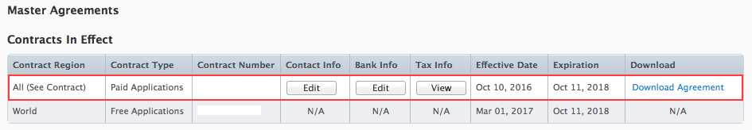
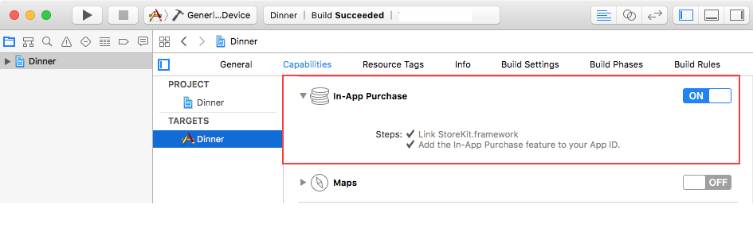
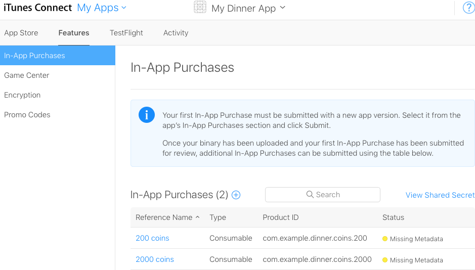
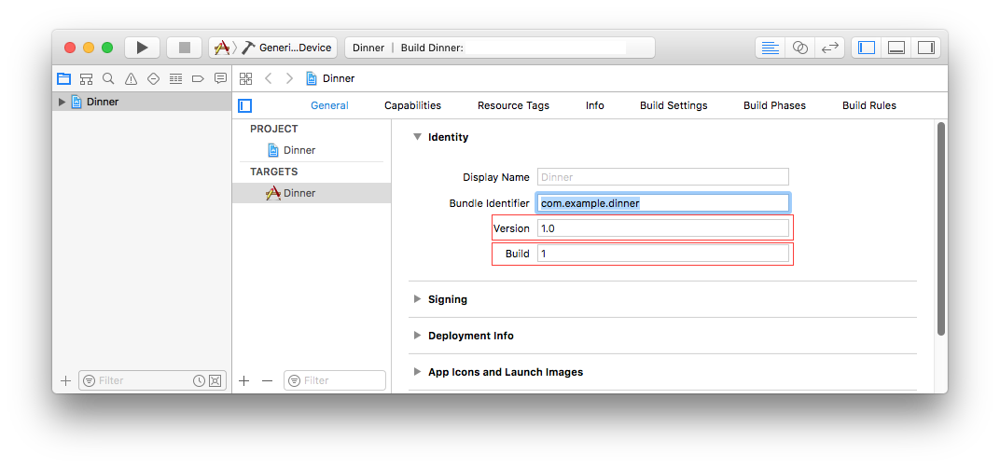

> 导航：[总目录](../../README.md) · [technotes](../../_indexes/technotes.md)


Technical Note TN2259

# Adding In-App Purchase to Your Applications

In-App Purchase allows you to sell additional features and functionality from within your iOS, macOS, and tvOS apps. If you wish to offer in-app purchases in your applications, you must complete several steps before you can do it. This document provides step-by-step instructions for setting up and testing in-app purchase. It also answers common questions about in-app purchase. The "Agreements, Tax, and Banking Information" section describes all the financial documents that must be completed. The "Certificates, Identifiers & Profiles" and "iTunes Connect" sections indicate the steps to be respectively done in the Certificates, Identifiers & Profiles section of Account and iTunes Connect. The "What's Next" section shows how to test in-app purchase. The "Update Your App for Ask to Buy" section describes how to support the Ask to Buy feature.

This document does not cover how to implement in-app purchase in your applications. Read the [In-App Purchase Programming Guide](https://developer.apple.com/library/ios/documentation/NetworkingInternet/Conceptual/StoreKitGuide/Introduction.html) for detailed information about implementing in-app purchase in your applications.

__Note:__ In-App Purchase is available in iOS 3.0 and later, macOS 10.7 and later, and tvOS 9.0 and later.

[Agreements, Tax, and Banking Information](#apple-f4xwc4dqnrsv64tfmyxwi33df52wszbpirkfgnbqgaydsnjxhawugsbrfvauousfivguktsuknpv6vcblbpv6qkoirpueqkojneu4r27jfhemt2sjvaviskpjy)[Certificates, Identifiers & Profiles](#apple-f4xwc4dqnrsv64tfmyxwi33df52wszbpirkfgnbqgaydsnjxhawugsbrfvbukusujfdesq2bkrcvgx27jfcektsujfdesrksknpv6x2qkjhumskmivjq)[iTunes Connect](#apple-f4xwc4dqnrsv64tfmyxwi33df52wszbpirkfgnbqgaydsnjxhawugsbrfvevivkoivjv6q2pjzhekq2u)[What's Next?](#apple-f4xwc4dqnrsv64tfmyxwi33df52wszbpirkfgnbqgaydsnjxhawugsbrfvluqqkul5jv6tsflbkf6)[Update Your App for Ask to Buy](#apple-f4xwc4dqnrsv64tfmyxwi33df52wszbpirkfgnbqgaydsnjxhawugsbrfvkvarcbkrcv6wkpkvjf6qkqkbpumt2sl5avgs27krhv6qsvle)[References](#apple-f4xwc4dqnrsv64tfmyxwi33df52wszbpirkfgnbqgaydsnjxhawugsbrfvjekrsfkjcu4q2fkm)[Document Revision History](#apple-f4xwc4dqnrsv64tfmyxwi33df52wszbpirkfgnbqgaydsnjxhawvezlwnfzws33ojbuxg5dpoj4s2rdpnz2ey2lonncwyzlnmvxhiskel4yq)

## Agreements, Tax, and Banking Information

You must complete the following steps before you can support in-app purchase in your applications:

1. Agree to the latest Developer Program License Agreement.

   Your team agent must agree to the latest Apple Developer Program License Agreement in [Account](https://developer.apple.com/account/) before you are allowed to create in-app purchases.
2. Complete your contract, tax, and banking Information.

   You must have a Paid Applications contract in effect with Apple and have provided your tax and banking information in [iTunes Connect](http://itunesconnect.apple.com) as seen in Figure 1. Read [Manage agreements, tax, and banking](https://help.apple.com/itunes-connect/developer/#/devb6df5ee51) for more information.

__Figure 1__  Paid Applications contract in iTunes Connect.

[Back to Top](#)

## Certificates, Identifiers & Profiles

The Certificates, Identifiers & Profiles section of Account is used to configure your App ID and Provisioning Profiles for in-app purchase. You must complete the following step in that section:

1. Register an explicit App ID for your application.

   Explicit App IDs are App IDs whose Bundle Identifier portion is a string without the wildcard ("\*") character. Furthermore, they are automatically registered for in-app purchase and Game Center as shown in Figure 2. Using an explicit App ID ensures that your in-app purchases are only associated with your application. For example, use `com.example.dinner` rather than `com.example.*`.

   Your team agent or admin should navigate to the App IDs section of Certificates, Identifiers & Profiles to create App IDs for your applications. Read [Registering App IDs](https://developer.apple.com/library/content/documentation/IDEs/Conceptual/AppDistributionGuide/MaintainingProfiles/MaintainingProfiles.html) to find out how to create App IDs.

__Figure 2__  Explicit App ID.

[Back to Top](#)

## iTunes Connect

To test in-app purchase, you need to create products to purchase and test accounts to make the purchases. iTunes Connect allows you to create and manage in-app purchases and test user accounts. You must complete the following steps in iTunes Connect:

1. Create test user accounts.

   Apple provides a testing environment, called the sandbox, which allows you to test your in-app purchases without incurring any financial charges. The sandbox environment uses special test user accounts rather than your regular iTunes Connect accounts to test in-app purchase. See [Create a sandbox tester account](https://help.apple.com/itunes-connect/developer/#/dev8b997bee1) for more information about creating test user accounts.

   __Note:__ You can use the same test user accounts to test both your iOS, macOS, and tvOS applications. Each in-app purchase test user account is tied to one and only one email address. As such, you cannot reuse an existing email address with another test user account. You can create as many test user accounts as you want in iTunes Connect.
2. Create In-App Purchase products.

   Creating in-app purchase products is available via the In-App Purchases feature for your app in iTunes Connect. This feature is only visible to users with admin or technical role in iTunes Connect. See [Creating In-App Purchase Products](https://developer.apple.com/library/ios/documentation/LanguagesUtilities/Conceptual/iTunesConnectInAppPurchase_Guide/Chapters/CreatingInAppPurchaseProducts.html) for more information.

   - Fill out the In-App Purchases form.

     The In-App Purchase form contains the Product ID field, which specifies a unique identifier for each of your in-app purchase products. See [Technical Q&A QA1329, 'In-App Purchase Product Identifiers'](https://developer.apple.com/library/content/qa/qa1329/_index.html) for more information about product identifiers.
   - Leave the state of your product as Missing Metadata as shown in Figure 3.

     __Note:__ Upload a a screenshot of your in-app purchase product once you are done testing it and ready to upload it for review.
   - Clear your product for sale.

     The In-App Purchases form contains a Cleared for Sale checkbox, which determines whether your in-app purchase product will be available for purchase from within your application. Check that box to make sure your product is available for sale.

__Figure 3__  Status of Product IDs.

[Back to Top](#)

## What's Next?

You have successfully set up in-app purchase for your application, let's implement and test it:

1. Launch or create your project in Xcode.
2. Enter the Bundle Identifier portion of your App ID in the Bundle Identifier field of your Target's Info pane in Xcode.
3. Enter a version number (CFBundleVersion) and a build number (CFBuildNumber) in the Version and Build fields of your Target's General Pane in Xcode, respectively as seen in Figure 4.

   __Note:__ CFBundleVersion and CFBuildNumber are strings that can only contain unsigned integers and a period (.) characters. See [CFBundleVersion](https://developer.apple.com/library/content/documentation/General/Reference/InfoPlistKeyReference/Articles/CoreFoundationKeys.html#//apple_ref/doc/uid/TP40009249-102364-TPXREF106) for more information.

__Figure 4__  Setting the version and build in the General pane.



1. Set up your project to use automatic provisioning. Read [Technical Q&A, QA1814, Setting up Xcode to automatically manage your provisioning profiles](https://developer.apple.com/library/ios/qa/qa1814/_index.html) for more information.
2. Add the in-app purchase capability to your app as seen in Figure 5.

   Xcode will automatically create a development provisioning profile enabled for in-app purchase. Read [Enabling In-App Purchase (iOS, tvOS, Mac)](https://developer.apple.com/library/ios/documentation/IDEs/Conceptual/AppDistributionGuide/AddingCapabilities/AddingCapabilities.html#//apple_ref/doc/uid/TP40012582-CH26-SW10) for more information.

   __Important:__ You must be a team admin or agent in order to enable this capability. If you are a team member, ask your team admin or agent to create a team provisioning profile with in-app purchase as outlined in [Create the Team Provisioning Profile](https://developer.apple.com/library/ios/documentation/IDEs/Conceptual/AppStoreDistributionTutorial/CreatingYourTeamProvisioningProfile/CreatingYourTeamProvisioningProfile.html#//apple_ref/doc/uid/TP40013839-CH33-SW4). Refresh your provisioning profiles as described in [Downloading Provisioning Profiles in Xcode](https://developer.apple.com/library/ios/documentation/IDEs/Conceptual/AppDistributionGuide/MaintainingProfiles/MaintainingProfiles.html#//apple_ref/doc/uid/TP40012582-CH30-SW26) once the team profile has been created.

__Figure 5__  Enable in-app purchase for your app.


1. Write code for your application.

   - Read the [In-App Purchase Programming Guide](https://developer.apple.com/library/ios/documentation/NetworkingInternet/Conceptual/StoreKitGuide/Introduction.html) and [Receipt Validation Programming Guide](https://developer.apple.com/library/ios/releasenotes/General/ValidateAppStoreReceipt/Introduction.html) for detailed information about implementing in-app purchase in your applications and receipt validation, respectively.

     __Important:__ The [Retrieving Product Information](https://developer.apple.com/library/ios/documentation/NetworkingInternet/Conceptual/StoreKitGuide/Chapters/ShowUI.html#//apple_ref/doc/uid/TP40008267-CH3-SW5) chapter of the In-App Purchase Programming Guide describes how to request information about your products from the App Store. Apple strongly recommends that you populate your user interface with products that were returned by the App Store. This ensures that your customers are only presented with products they can buy.
   - macOS applications should perform receipt validation immediately after launch. The apps should call `exit` with a status of `173` if validation fails as shown in Listing 1.

     __Listing 1__  Receipt validation

     ```swift
     func applicationDidFinishLaunching(_ aNotification: Notification) {
        // Test whether the app's receipt exists.
        if let url = Bundle.main.appStoreReceiptURL, let _ = try? Data(contentsOf: url) {
           // The receipt exists. Do something.
        }
        else {
           // Validation fails. The receipt does not exist.
           exit(173)
        }
     }
     ```
2. Test your application in the sandbox environment.

   - __iOS and tvOS developers__ must complete the following steps:

     - Sign out of the Store in the Settings application on your testing device.
     - Set the run destination of your application to an iOS or tvOS Device in Xcode.
     - Build and run your application from Xcode.
   - __macOS developers__ must complete the following steps:

     - Build your application in Xcode.
     - Run your application.

       You must launch your application from the Finder rather than from Xcode the first time in order to obtain a receipt. Click on your application in the Finder to launch it. macOS displays a "Sign in to download from the App Store." dialog. Enter your test user account and password as requested. The sandbox provides you with a new receipt upon successful authentication.

       __Note:__ Launch your application from the Finder whenever you need a new receipt.

   __Important:__ Use your test user account when prompted by StoreKit to confirm a purchase from within your application.

   StoreKit connects to the sandbox environment when you launch your application from Xcode, from your test device (iOS and tvOS), or from the Finder (macOS). It connects to a production environment for applications that were downloaded from the App Store. You must not use your test user account to sign into the production environment. This will result in your test user account becoming invalid. Invalid test accounts cannot be used to test in-app purchase again.
3. Submit your In-App Purchase products for review.

   Log in to [iTunes Connect](http://itunesconnect.apple.com) to submit your in-app purchase products for review by Apple, after you are done thoroughly testing them in the sandbox environment.

[Back to Top](#)

## Update Your App for Ask to Buy

iOS 8 introduces Ask to Buy, which lets parents approve any purchases initiated by children, including apps or in-app purchases on the App Store. When a child requests to make a purchase, Ask to Buy will indicate that the app is awaiting the parent’s approval for this purchase by sending the `Deferred` state to the `paymentQueue(_:updatedTransactions:)` method on your transaction queue observer as shown in Listing 2. You should update your UI to reflect this deferred state, and expect `paymentQueue(_:updatedTransactions:)` to be called again with a new transaction state reflecting the parent’s decision or after the transaction times out. Avoid blocking your UI or gameplay while waiting for the transaction to be updated. Furthermore, be sure to follow the [Add a transaction queue observer at application launch](https://developer.apple.com/library/ios/technotes/tn2387/_index.html#//apple_ref/doc/uid/DTS40014795-CH1-BEST_PRACTICES-ADD_A_TRANSACTION_QUEUE_OBSERVER_AT_APPLICATION_LAUNCH) best practice.

__Listing 2__  Responding to transaction statuses

```swift
func paymentQueue(_ queue: SKPaymentQueue, updatedTransactions transactions: [SKPaymentTransaction]) {
   for transaction in transactions {
      switch transaction.transactionState {
         // Call the appropriate custom method for the transaction state.
         case .purchasing: break
         // Do not block your UI. Allow the user to continue using your app.
         case .deferred: deferredTransaction(transaction)
         case .purchased: completeTransaction(transaction)
         case .restored: restoreTransaction(transaction)
         case .failed: failedTransaction(transaction)
      }
   }
}
```

__Note:__ The parent has 24 hours to approve or cancel their child's purchase after the Ask to Buy process has begun. If the parent fails to respond within the 24 hours, the Ask to Buy request is deleted from iTunes Store servers and your app's observer does not receive any notifications.

If the child makes multiple Ask to Buy requests, only the most recent request is presented to the parent. Each new request restarts the 24 hour clock for processing the purchase request.

[Back to Top](#)

## References

- [In-App Purchase](https://developer.apple.com/in-app-purchase)
- [App Distribution Guide](https://developer.apple.com/library/ios/documentation/IDEs/Conceptual/AppDistributionGuide/Introduction/Introduction.html)
- [TN2413: In-App Purchase FAQ](https://developer.apple.com/library/ios/technotes/tn2413/_index.html)
- [iTunes Connect Developer Help](http://help.apple.com/itunes-connect/developer/)
- [In-App Purchase Programming Guide](https://developer.apple.com/library/ios/documentation/NetworkingInternet/Conceptual/StoreKitGuide/Introduction.html)
- [Receipt Validation Programming Guide](https://developer.apple.com/library/mac/releasenotes/General/ValidateAppStoreReceipt/Introduction.html)
- [TN2387: In-App Purchase Best Practices](https://developer.apple.com/library/ios/technotes/tn2387/_index.html#//apple_ref/doc/uid/DTS40014795)
- [QA1329: In-App Purchase Product Identifiers](https://developer.apple.com/library/content/qa/qa1329/_index.html)
- [In-App Purchase Configuration Guide for iTunes Connect](https://developer.apple.com/library/ios/documentation/LanguagesUtilities/Conceptual/iTunesConnectInAppPurchase_Guide/Chapters/Introduction.html)

[Back to Top](#)

---

#### Document Revision History

| __Date__ | __Notes__ |
| 2017-06-29 | Updated screenshots and urls. |
|  | Updated screenshots and urls. |
| 2017-06-28 | Updated screenshots and urls. |
|  | Updated screenshots and urls. |
| 2016-11-09 | Updated screenshots, listing code, and links. |
| 2016-08-10 | Editorial update. |
| 2015-06-24 | Editorial update. Moved the FAQ section to TN2413, In-App Purchase FAQ. |
| 2014-09-12 | Added the Update Your App for Ask to Buy section. Updated FAQ 9. |
| 2014-08-06 | Editorial update. |
| 2014-01-30 | Updated for iOS 7. |
| 2013-02-21 | Fixed typos and updated the FAQ section. |
| 2012-08-29 | Updated the FAQ section and fixed typos. |
| 2012-02-22 | Added screenshots. Updated the "What's Next?" and FAQ sections. |
| 2011-08-03 | Added information about In App Purchase in Mac OS X 10.7. Updated the FAQ section. |
| 2011-05-23 | Updated the "What's Next?" section. |
| 2011-05-05 | Updated the FAQ section. |
| 2010-10-20 | Removed the Enable your App ID for In App Purchase section. Updated the FAQ section. |
| 2010-03-03 | New document that describes how to set up and test in-app purchase in your iOS, macOS, and tvOS applications. |

