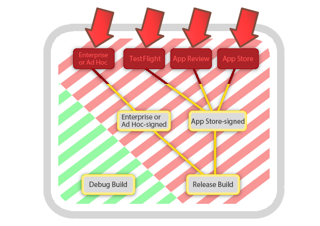
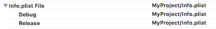
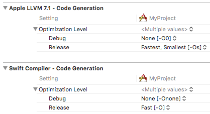
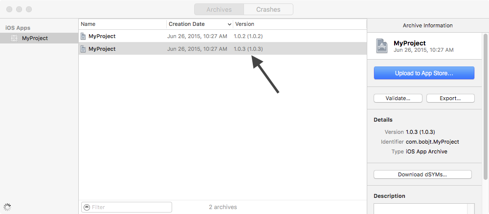
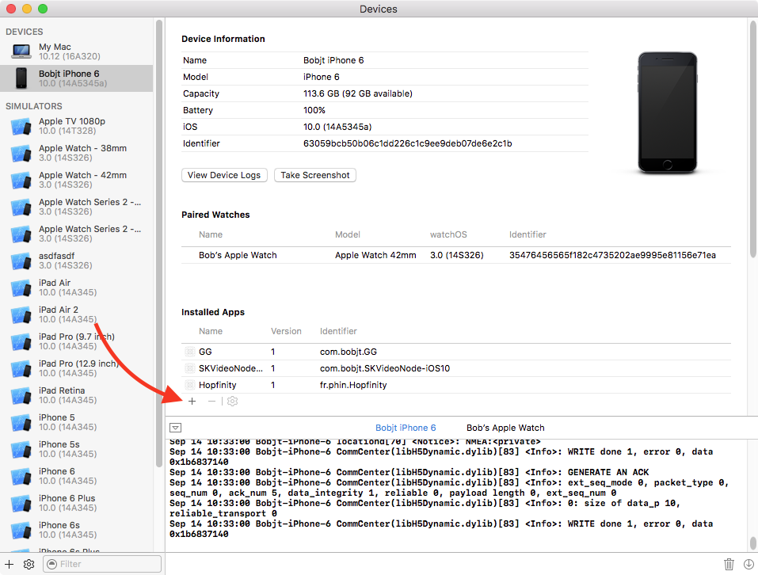

> 导航：[总目录](../../README.md) · [technotes](../../_indexes/technotes.md)


Technical Note TN2431

# App Testing Guide

This guide covers recommended procedures for app testing. Though the importance of testing apps and app updates before submission or deploying to Enterprise users is common knowledge, this guide highlights specific areas that are frequently overlooked. Additionally, strategies are provided to debug general problems that might occur in your app's distribution build.

[Introduction](#apple-f4xwc4dqnrsv64tfmyxwi33df52wszbpirkfgnbqgaytonbzg4wugsbrfveu4vcsj5cfkq2ujfhu4)[Terms definition](#apple-f4xwc4dqnrsv64tfmyxwi33df52wszbpirkfgnbqgaytonbzg4wugsbrfvkekusnknpuirkgjfhesvcjj5ha)[App Testing Procedure](#apple-f4xwc4dqnrsv64tfmyxwi33df52wszbpirkfgnbqgaytonbzg4wugsbrfvavauc7krcvgvcjjzdv6ucsj5bukrcvkjcq)[1. Test your Release Build](#apple-f4xwc4dqnrsv64tfmyxwi33df52wszbpirkfgnbqgaytonbzg4wugsbrfvavauc7krcvgvcjjzdv6ucsj5bukrcvkjcs2mk7l5keku2ul5mu6vksl5jektcfifjukx2ckveuyra)[2. Test on supported OS versions and device types](#apple-f4xwc4dqnrsv64tfmyxwi33df52wszbpirkfgnbqgaytonbzg4wugsbrfvavauc7krcvgvcjjzdv6ucsj5bukrcvkjcs2ms7l5keku2ul5hu4x2tkvifat2skrcuix2pknpvmrkskneu6tstl5au4rc7ircvmskdivpviwkqivjq)[3. Test a clean installation](#apple-f4xwc4dqnrsv64tfmyxwi33df52wszbpirkfgnbqgaytonbzg4wugsbrfvavauc7krcvgvcjjzdv6ucsj5bukrcvkjcs2m27l5keku2ul5av6q2mivau4x2jjzjviqkmjraviskpjy)[4. Test an app update](#apple-f4xwc4dqnrsv64tfmyxwi33df52wszbpirkfgnbqgaytonbzg4wugsbrfvavauc7krcvgvcjjzdv6ucsj5bukrcvkjcs2nc7l5keku2ul5au4x2bkbif6vkqiraviri)[Common causes of customer facing issues](#apple-f4xwc4dqnrsv64tfmyxwi33df52wszbpirkfgnbqgaytonbzg4wugsbrfvbu6tknj5hf6q2bkvjuku27j5df6q2vknke6tkfkjpumqkdjfheox2jknjvkrkt)[Debugger effects](#apple-f4xwc4dqnrsv64tfmyxwi33df52wszbpirkfgnbqgaytonbzg4wugsbrfvbu6tknj5hf6q2bkvjuku27j5df6q2vknke6tkfkjpumqkdjfheox2jknjvkrktfvcekqsvi5dukus7ivdemrkdkrjq)[Device power](#apple-f4xwc4dqnrsv64tfmyxwi33df52wszbpirkfgnbqgaytonbzg4wugsbrfvbu6tknj5hf6q2bkvjuku27j5df6q2vknke6tkfkjpumqkdjfheox2jknjvkrktfvcekvsjincv6ucpk5cve)[Build configuration](#apple-f4xwc4dqnrsv64tfmyxwi33df52wszbpirkfgnbqgaytonbzg4wugsbrfvbu6tknj5hf6q2bkvjuku27j5df6q2vknke6tkfkjpumqkdjfheox2jknjvkrktfvbfkskmirpugt2oizeuovksifkest2o)[Compiler optimizations](#apple-f4xwc4dqnrsv64tfmyxwi33df52wszbpirkfgnbqgaytonbzg4wugsbrfvbu6tknj5hf6q2bkvjuku27j5df6q2vknke6tkfkjpumqkdjfheox2jknjvkrktfvbu6tkqjfgekus7j5ifisknjfnecvcjj5hfg)[Code-signing provisioning profile](#apple-f4xwc4dqnrsv64tfmyxwi33df52wszbpirkfgnbqgaytonbzg4wugsbrfvbu6tknj5hf6q2bkvjuku27j5df6q2vknke6tkfkjpumqkdjfheox2jknjvkrktfvbu6rcfl5jusr2ojfheox2qkjhvmsktjfhu4skoi5pvauspizeuyri)[User privileges](#apple-f4xwc4dqnrsv64tfmyxwi33df52wszbpirkfgnbqgaytonbzg4wugsbrfvbu6tknj5hf6q2bkvjuku27j5df6q2vknke6tkfkjpumqkdjfheox2jknjvkrktfvkvgrksl5ifeskwjfgekr2fkm)[App update process](#apple-f4xwc4dqnrsv64tfmyxwi33df52wszbpirkfgnbqgaytonbzg4wugsbrfvavaucvkbcecvcf)[Network conditions](#apple-f4xwc4dqnrsv64tfmyxwi33df52wszbpirkfgnbqgaytonbzg4wugsbrfvhekva)[Memory availability](#apple-f4xwc4dqnrsv64tfmyxwi33df52wszbpirkfgnbqgaytonbzg4wugsbrfvbu6tknj5hf6q2bkvjuku27j5df6q2vknke6tkfkjpumqkdjfheox2jknjvkrktfvpu2rknj5jfsx2bkzaustcbijeuyskule)[Data edge-cases](#apple-f4xwc4dqnrsv64tfmyxwi33df52wszbpirkfgnbqgaytonbzg4wugsbrfvbu6tknj5hf6q2bkvjuku27j5df6q2vknke6tkfkjpumqkdjfheox2jknjvkrktfvcecvcbl5cuir2fl5bucu2fkm)[Internationalization](#apple-f4xwc4dqnrsv64tfmyxwi33df52wszbpirkfgnbqgaytonbzg4wugsbrfvbu6tknj5hf6q2bkvjuku27j5df6q2vknke6tkfkjpumqkdjfheox2jknjvkrktfveu4vcfkjhecvcjj5hectcjljaviskpjy)[Release build debugging strategies](#apple-f4xwc4dqnrsv64tfmyxwi33df52wszbpirkfgnbqgaytonbzg4wugsbrfvjektcfifjukx2ckveuyrc7ircuevkhi5eu4r27knkfeqkuivdusrkt)[Obtaining crash logs](#apple-f4xwc4dqnrsv64tfmyxwi33df52wszbpirkfgnbqgaytonbzg4wugsbrfvbveqktjbge6ry)[Obtaining app logging](#apple-f4xwc4dqnrsv64tfmyxwi33df52wszbpirkfgnbqgaytonbzg4wugsbrfvbu6tstj5gektcpi4)[Persistent Issues](#apple-f4xwc4dqnrsv64tfmyxwi33df52wszbpirkfgnbqgaytonbzg4wugsbrfviekustjfjvirkokrpusu2tkvcvg)[Related material](#apple-f4xwc4dqnrsv64tfmyxwi33df52wszbpirkfgnbqgaytonbzg4wugsbrfvjektcbkrcuix2nifkekusjifga)[Document Revision History](#apple-f4xwc4dqnrsv64tfmyxwi33df52wszbpirkfgnbqgaytonbzg4wvezlwnfzws33ojbuxg5dpoj4s2rdpnz2ey2lonncwyzlnmvxhiskel4yq)

## Introduction

Before submitting your app or its update to the App Store or deploying to Enterprise users, apps must be tested in a simulated customer environment in order to guard against failures that result from untested circumstances. This guide covers the general process to do so including common areas that new apps and app updates frequently miss during testing.

[Back to Top](#)

## Terms definition

This document uses the following terms:

- __Customer Environment__ within the context of this document, refers to your app's end users – their computer or device on which your app runs, and its hardware constraints and other unique features that could affect your app, such as the strength of its network connection, memory availability, and disk space.
- __Release build__ refers to an app bundle created with Xcode's __Release__ build configuration. __Release__ is the build configuration used when archiving an app in Xcode, by default. Since archives are the recommended way to distribute all apps, this document uses "Release build" to refer to a distribution build created from an Xcode archive that is code signed by an Ad Hoc, Enterprise, or App Store provisioning profile (the latter including TestFlight builds).
- __App Testing__ used within this guide refers to all testing of the app’s __Release build__ before it is submitted for App Store review or distributed to Enterprise users. This includes new apps and updates to existing apps.
- __Debug build__ refers an app bundle created with Xcode's __Debug__ build configuration. __Debug__ is the default build configuration used when running an app on a device through Xcode.
- __Distribution build__ is synonymous with __Release build__ in the context of this document. It is a Release build that is code signed by one of the various distribution provisioning profiles.
- __Development build__ is synonymous with __Debug build__ in the context of this document. It is a Debug build that is code signed by a developer provisioning profile.

__Figure 1__  A problem that only occurs with the Release build can surface in the varying environments pictured here.

[Back to Top](#)

## App Testing Procedure

The recommended app testing procedure follows. Because there are differences between the app's Debug build (ran during development) and the Release build (the app Xcode optimizes for submission), the full app testing procedure covered by this guide should be used to maximize the chances of catching problems that could otherwise surface in the customer environment.

__Reproducing release build issues locally__

Should a customer facing issue be reported in your app's Release build, use the app testing procedure to debug the issue in your local development environment. This section also focuses on increasing chances of reproducing a customer facing issue as that is key to confirming the problem is solved after app changes are made to address an issue.

### 1. Test your Release Build

Release build testing involves a unique workflow in Xcode that is different from Building and Running connected to the debugger. The difference is important because they can, when properly facilitated, reveal problems that weren't visible during development. The largest source of issues found in the customer environment are due to lack of thoroughly testing the Release build, and respecting the large number of fundamental differences between development and distribution builds.

Testing your Release build can be done in the following ways varying by platform:

- __iOS, tvOS__, and __watchOS__, use one of:

  - TestFlight (this is the preferred method).

    __App Distribution Guide__ > [Distributing Your App Using TestFlight (iOS, tvOS, watchOS)](https://developer.apple.com/library/ios/documentation/IDEs/Conceptual/AppDistributionGuide/DistributingYourAppUsingTestFlight/DistributingYourAppUsingTestFlight.html#//apple_ref/doc/uid/TP40012582-CH37-SW1).

    __Note:__ TestFlight offers a testing environment that most closely matches the real world environment of a customer's device. For apps built with Bitcode, distributing with TestFlight is the only way to test the final build of your app that is created by the App Store.
  - Ad Hoc distribution

    __Important:__ Only use Ad Hoc distribution to test your Release build if there is a good reason you cannot use TestFlight. Ad Hoc testing requires the app to be re-signed an additional time during submission, and the resulting switch in provisioning profile introduces the opportunity for the submitted build to behave differently than the Ad Hoc version. TestFlight solves this problem by submitting the same build that was tested. Other benefits of using TestFlight are listed above.

    __App Distribution Guide__ > [Exporting Your App for Testing (iOS, tvOS, watchOS)](https://developer.apple.com/library/ios/documentation/IDEs/Conceptual/AppDistributionGuide/TestingYouriOSApp/TestingYouriOSApp.html#//apple_ref/doc/uid/TP40012582-CH8-SW1) (Ad Hoc).
- __macOS__: __App Distribution Guide__ > [Exporting Your App for Testing (Mac)](https://developer.apple.com/library/ios/documentation/IDEs/Conceptual/AppDistributionGuide/BetaTestingYourMacApp/BetaTestingYourMacApp.html#//apple_ref/doc/uid/TP40012582-CH34-SW1).

### 2. Test on supported OS versions and device types

It is possible that a particular app issue only reproduces on a specific version of the OS or device type. Therefore, testing all the OS versions and device types your app supports is crucial to ensuring a good customer experience.

- __Issues reported on a specific OS version and device type__

  If an issue is reported against your app's release build, pay close attention to the OS version and device type it occurred on when trying to reproduce the issue in your local development environment.
- __Maintaining a robust suite of test devices__

  It can be difficult to acquire and maintain configuration of all the combinations of device type and OS versions your app supports, but this section helps offer a reasonable strategy to maximize your ability to do so.
- __General recommendations for testing specific devices and OS versions__

  - Try to maintain a spread of test devices (32- vs 64-bit, memory sizes, processor speed, GPU, iPad vs compact devices like iPhone and iPod touch, OS releases).
  - Maximize your deployment target (and thus minimize the spread of OS releases you need to cover).
  - Buy devices on a regular basis; iPod touch is your friend.
  - When a new OS release is imminent, carefully plan which devices you’re going to take to the new OS release and which devices you want left on the old OS release; upgrade the latter __before__ the new OS is released.
- __Obtaining the device type and OS version related to a specific issue__

  The following examples illustrate ways to get this important information:

  - For crashing Issues, the OS version and specific device type can be found at the top of a crash log. As an example, see the OS and device in the example crash log shown in __Analyzing Crash Reports__ section of __TN2151__ - [Understanding and Analyzing iOS Application Crash Reports](https://developer.apple.com/library/ios/technotes/tn2151/_index.html#ANALYZING_CRASH_REPORTS).

    - Crash logs that are generated in App Review will be attached to the rejection letter.
    - Crash logs that happen for your App Store customers or TestFlight testers are available in Xcode; the following guide walks through obtaining these types of crash logs __App Distribution Guide__ > [Analyzing Crash Reports](https://developer.apple.com/library/ios/documentation/IDEs/Conceptual/AppDistributionGuide/AnalyzingCrashReports/AnalyzingCrashReports.html).
  - For problems reported by testers or Enterprise users, the OS and device type should be collected by the user in the following ways varying by platform:

    - __iOS__: Settings app > General > About, "Version" and "Model".
    - __tvOS__: Settings app > General > About, "tvOS" and "Model".
    - __watchOS__: Apple Watch App (on the paired iPhone) > My Watch tab > General > About> "Version" and "Model".
    - __macOS__: Apple menu > About This Mac, and System Information utility > Model Identifier.

### 3. Test a clean installation

Incidentally creating a dependency on the presence of previously-created data while iteratively developing an app is a common problem. Xcode's app install process is optimized for development, but is slightly different than how iTunes and the App Store install apps. Prior to distributing a new version of your app, thoroughly test launching from a clean installation – one that is free from any data that might have been created by an older version of your app.

1. Remove previous builds of your application from the testing device.

   - You can delete an application and its container from the iOS home screen or using [Xcode's Devices window](https://developer.apple.com/library/ios/recipes/xcode_help-general/AbouttheDevicesWindow/AbouttheDevicesWindow.html).
   - tvOS apps can also be removed in Xcode's Devices window.
   - Watch apps can be removed using the paired phone's Apple Watch App.
2. If your application uses a shared app group container to store common data files, you should also remove all other applications in that app group from the testing device. Shared containers are not deleted until all applications in the app group are removed from the device.
3. Keychain data previously created by your application may not be deleted when the app is removed from the device. To clear its keychain, an application can call the [SecItemDelete](https://developer.apple.com/library/ios/documentation/Security/Reference/keychainservices/#//apple_ref/c/func/SecItemDelete) API with a query that matches all existing items. You might find it more convenient to prepare a small utility application that you can quickly install on your test device for this task. This utility application must have the same __bundle identifier__ (and __App ID prefix__) as your real application to modify its keychain.

### 4. Test an app update

Unless this is the a new application, the majority of your customers will be upgrading from a previous release. Test that upgrading the app on top of a prior installation of your app works smoothly and, if you have made changes to your file format, that existing data is successfully migrated, or continues to be supported in some other fashion. This recommendation generally applies to all platforms, including macOS.

App update testing recommendations specific to __watchOS, tvOS__ and __iOS__:

- Save and restore __app containers__ using Xcode's Devices Window.

  __Important:__ On macOS, the filesystem is more readily accessible for the purposes of testing the app's behavior with specific files on disk. On iOS, tvOS and watchOS, this is done by viewing, downloading and restoring __app containers__ through Xcode's Devices Window.

  - An app's container that is saved through Xcode includes data that was created through use of the following APIs:

    - Files saved through NSFileManager to locations defined by `NSPathUtilities,` such as `NSDocumentDirectory,` and NSCachesDirectory.
    - App preferences that are saved through NSUserDefaults.
  - To test an app in a specific state, save the app's container on the device whose state you want to preserve, and restore it on the testing device using the steps in:

    • __Devices Window Help__ > [Managing Containers on a Device](https://developer.apple.com/library/ios/recipes/xcode_help-devices_organizer/articles/manage_containers.html#//apple_ref/doc/uid/TP40010392-CH14-SW1).
- Follow the general app update testing procedure covered in:

  • __TN2285__ - [Testing iOS App Updates](https://developer.apple.com/library/ios/technotes/tn2285/_index.html).

The issue of forgetting to test the app-update scenario before going live is one of the common customer-facing issues covered in this guide; see section:  [App update process](#apple-f4xwc4dqnrsv64tfmyxwi33df52wszbpirkfgnbqgaytonbzg4wugsbrfvavaucvkbcecvcf). If you're experiencing a different customer-facing issue in the Release build, the next section lists other common problems that are frequently first-detected in customer environments.

[Back to Top](#)

## Common causes of customer facing issues

Sometimes issues that surface only in the customer environment can relate to the build configuration that was used to build the app (Debug versus Release) or, the code signing profile used to sign the app (Developer versus Distribution). Other times, the issue only reproduces when disconnected from the debugger, running on an macOS guest account, or ran within differing network or memory-availability conditions. This section lists common causes of release build differences; often times, solutions or workarounds can be inferred once specific triggers are identified.

### Debugger effects

There are a couple monumental differences that result from running your app through Xcode (therefore, attached to the debugger). This section covers the differences that frequently cause problems you should therefore be mindful of.

- __The debugger disables Watchdog timeouts__

  The Xcode debugger disables crashes due to watchdog time outs, and for this reason, crashes due to watchdog timeout are often noticed only in the Release build. The easiest way to check for watchdog timeouts is to disconnect the Lightning cable and run the development build from the home screen. For more information on watchdog timeouts, see:

  •  __QA1693__ - [Synchronous Networking On The Main Thread](https://developer.apple.com/library/ios/qa/qa1693/_index.html).
- __The debugger prevents your app from being suspended__

  Because the debugger prevents apps from being suspended, your app must be launched from the home screen in order to test any background processes your app might implement. For example, `NSURLSession` allows an app to opt into a background session, however this code will not be properly tested until the app is run disconnected from the Xcode debugger. For more information on this topic, see: __Apple Developer Forums__ > [Topic 42353](https://forums.developer.apple.com/message/42353).

### Device power

iOS may behave differently depending on battery charge level, how and when the battery was last fully charged, and whether or not the device is currently being charged. Therefore, to confirm your app behaves properly across the myriad of differences that can result from power level, you should:

1. Test the app unplugged from a power source.
2. Test the app in __Low Power Mode__.

   - Steps to enable Low Power Mode on iOS:

     1. Navigate to Settings > Battery.
     2. Switch on Low Power Mode.

        __Note:__ The battery indicator turns yellow to indicate the device is in Low Power Mode.

__Note:__ An example is how the factors above change the behavior of Core Location. Core Location always provides whichever accuracy the client app has requested but, depending on the factors above as well as the accuracy requested by other apps on the system, it might return much higher accuracy than was directly specified. Unplugging your device from a power source and enabling Low Power Mode is one of the only ways to ensure an app using Core Location behaves correctly in all conditions.

__Important:__ This section does not attempt to list specific heuristics that trigger OS differences due to power level, but impresses that testing your app in varying power levels is an important consideration, regardless.

### Build configuration

__Exercise to determine if an issue is Build Configuration related__. What configuration was used in the build that failed?

1. Set the Run task Build Configuration to the configuration used to build the failing app.
2. If the issue does not reproduce, the problem is likely not related to the build configuration.
3. If the issue does reproduce, now set the Run task Build Configuration to the opposite configuration used to build the failing app.
4. If the issue does not reproduce, this confirms the issue is related to the build configuration. Check each build setting that is different across the configurations for potential causes of the problem.

__Notes on Build Setting differences:__

In Xcode's Build Settings almost every setting has the capability of being set differently for each build configuration. The default build configurations are Debug and Release, and by default, most build settings are the same. As an example, if Xcode were using a different Info.plist file for release builds, there is a good chance the Info.plist build setting differs across the two build configurations. Because the Info.plist build setting is the same across the two build settings by default, a change to this setting must have been made explicitly by the developer of this project.

__Figure 2__  Example build setting that shows how something as crucial as the Info.plist could be set differently for Release builds.



### Compiler optimizations

A build setting that is different by default across the two build configurations is Optimization Level. This build setting controls compiler optimizations, which are code optimizations that are made by the compiler at build time. Compiler optimizations are on by default for Release builds because they result in a more performant app, however, you should be mindful of differences in behavior that can occur if you do not follow language rules.

For example, in Objective-C, the following article covers a hypothetical example of a Release build difference that results from compiler optimizations:

• __LLVM PROJECT BLOG__ - [What Every C Programmer Should Know About Undefined Behavior](http://blog.llvm.org/2011/05/what-every-c-programmer-should-know_14.html).

For a Swift example, see the optimization note within:

• __The Swift Programming Language__ > Declarations > [In-Out Parameters](https://developer.apple.com/library/ios/documentation/Swift/Conceptual/Swift_Programming_Language/Declarations.html#//apple_ref/doc/uid/TP40014097-CH34-ID545):

```
"As an optimization, when the argument is a value stored at a physical address in memory, the same memory location is used both inside and outside the function body. The optimized behavior is known as call by reference; it satisfies all of the requirements of the copy-in copy-out model while removing the overhead of copying. Write your code using the model given by copy-in copy-out, without depending on the call-by-reference optimization, so that it behaves correctly with or without the optimization."
```

__Figure 3__  The default Optimization Level build settings.



__Important:__ Different build settings define code optimizations across Objective-C and Swift because they have different compilers.

Use the following steps to confirm whether compiler optimizations causing the difference in your Release build:

1. Reproduce the issue by running the app's Release build.
2. Temporarily set this build setting's __Release__ value equal to the value of __Debug__ (which is `None [-O0]`).
3. Then, build and test a new Release build of the app.
4. If the issue does not reproduce, the issue is related to a compiler optimizations.

   __Important:__ As a workaround in this case, you can submit a Release build of your app that is built with optimizations turned off, by setting Release to `None [-O0]`.

### Code-signing provisioning profile

- __Exercise to determine if an issue is Provisioning Profile related__ • Was a distribution or development provisioning profile used to code sign the failing app?

  1. Create an installable .ipa of the app file using the steps in __App Distribution Guide__ > [Distributing Your App Using TestFlight (iOS, tvOS, watchOS)](https://developer.apple.com/library/ios/documentation/IDEs/Conceptual/AppDistributionGuide/DistributingYourAppUsingTestFlight/DistributingYourAppUsingTestFlight.html#//apple_ref/doc/uid/TP40012582-CH37-SW1) and code sign the app with the same App Store profile that was used to sign the problematic app.
  2. When creating the app, use the process in [How to test the same build that generated a crash log](#apple-f4xwc4dqnrsv64tfmyxwi33df52wszbpirkfgnbqgaytonbzg4wugsbrfvgucvcdjbbfkskmiq) to ensure you choose the right app archive. If the issue is not crash-related, refer to the __Version__ column of the Archives Organizer to make sure the correct archive is chosen.
  3. If the issue does not reproduce with the newly created TestFlight build, the problem is not related to the code signing provisioning profile.
  4. If the issue does reproduce, now grab the development signed version of this same app as it resides on disk within the .xcarchive file.

     - Control-click on the archive in Xcode's > Window menu > Archives, and choose "Show in Finder"
     - Control-click on the .xcarchive in Finder and choose "Show Package Contents"
     - Find the .app within the ./Products/Applications folder

       __Note:__ The app within the .xcarchive is signed with developer profile if you're using default Xcode build settings, or if you've properly reverted to the default build settings using the steps in __QA1814__ - [Setting up Xcode to automatically manage your provisioning profiles](https://developer.apple.com/library/ios/qa/qa1814/_index.html). For the purposes of this test, you perform the steps on new archive built using the recommended settings if they were not used to create the initial archive.
     - Install this developer-signed version of the same app using Xcode's > Window menu > Devices, with the steps in __Devices Organizer Help__ > [Installing Apps on a Device](https://developer.apple.com/library/ios/recipes/xcode_help-devices_organizer/InstallingAppsonaniOSDevice/InstallingAppsonaniOSDevice.html#//apple_ref/doc/uid/TP40010392-CH19-SW1)
  5. If the issue does not reproduce with the developer signed version of the app, this confirms the issue is related to provisioning profile. Check the entitlements of each profile for differences that could potentially cause the issue using the steps in __TN2415__ - Entitlements Troubleshooting > [Inspecting a profile's entitlements](https://developer.apple.com/library/ios/technotes/tn2415/_index.html#//apple_ref/doc/uid/DTS40016427-CH1-PROFILESENTITLEMENTS).
  6. The best way to confirm which entitlements are enabled on a build submitted to the App Store is to view build details in iTunes Connect. For more information, see:

     • __iTunes Connect Developer Guide__ > Viewing App Information > [Viewing Build Details](https://developer.apple.com/library/ios/documentation/LanguagesUtilities/Conceptual/iTunesConnect_Guide/Chapters/ChangingAppMetadata.html#//apple_ref/doc/uid/TP40011225-CH3-SW30) section.
- It's possible that one of the provisioning profiles used during the signing of either the development or release build are out of sync with the current state of enabled capabilities. If it's the distribution profile that is out of sync, the issue produced as a result will only be present in the distribution build and not exhibited in the development build.

### User privileges

__Testing your app on a Guest Account__ is an essential step to simulate the customer environment for an macOS app. Mac App Review facilitates review with minimally-privileged accounts for the purpose of catching bugs that developers and testers might have missed testing the app on an Admin account. For example, ensuring the guest account login runs your app smoothly ensures there are no privileges problems or missing files or folders that had been preconfigured within the development environment.

### App update process

The following are important notes that relate to issues that can occur during the app update process:

- Building and Running a pending app update through Xcode does not properly test the case of installing an app update on top of an existing app downloaded from the app store.
- App Review devices typically do not contain an existing installation of your app from the App Store and therefore, the review process does not test the case of updating an existing customer installation.
- An example issue that could only be caught while testing an app update is if your app has changed a file format and forgets to check for or support existing customer files in the previous format. The app might crash assuming that all files in the users Documents directory are in the new file format.
- Test your app update using the steps in __TN2285__ - [Testing iOS App Updates](https://developer.apple.com/library/ios/technotes/tn2285/_index.html)

### Network conditions

Debug builds are often tested within an isolated network, whereas Release builds run in varying network conditions that your users are exposed to. The result is an issue can appear to be related to the apps Release build, but may in fact relate only to the network that either build runs under.

To alleviate these kinds of issues:

- Use the __Network Link Conditioner__

  This tool runs on your iOS device or tvOS device simulating slow or unreliable internet connections. The Network Link Conditioner can be activated using __Settings app__ > Developer > Network Link Conditioner on the testing device.
- __Test in IPv6-only networks__

  It's possible for an issue to surface in an IPv6-only or IPv4-only network, and not the other, so it's a good idea to test your app in both. Since IPv4-only networks are still widely in use, it's more common that an app issue relating to DNS64/NAT64 go undetected before submission.
- Follow the steps in the definitive guide: __Networking Overview__ > [Designing for Real-World Networks](https://developer.apple.com/library/ios/documentation/NetworkingInternetWeb/Conceptual/NetworkingOverview/WhyNetworkingIsHard/WhyNetworkingIsHard.html#//apple_ref/doc/uid/TP40010220-CH13-SW1).

### Memory availability

Another important consideration involves understanding there are different amounts of memory available to various devices and a given customer's instantiation of your app. This section recommends you walk through the process of minimizing your app's memory footprint as the best way to ensure your app avoids memory warnings or termination due to memory depletion in the customer environment. In addition, minimizing memory usage using Instruments can sometimes be a quick exercise that can yield surprising performance gains. To do so, follow the steps in:

• __TN2434__ - [Minimizing your app's Memory Footprint](https://developer.apple.com/library/ios/technotes/tn2434/_index.html#//apple_ref/doc/uid/DTS40017252)

__Note:__ In addition, __simulating memory warnings__ using the iOS Simulator is the easiest way to test how your app recovers from memory warnings. For example, if your implementation of -didReceiveMemory warning causes other bugs, you'll want to reconsider how the app responds to low memory conditions.

### Data edge-cases

Apps that rely on customer-supplied data face the challenge of anticipating uncommon situations while processing that data. The wider the range of variations in customer supplied data your app accepts, the more responsibility there is to detect and gracefully handle unsupported cases. These kinds of considerations during testing are referred to here as __data edge cases__.

The following are example data edge cases:

- If your app loads user-defined images, test the loading of an excessively large image. Because many images are compressed file formats, loading an image in memory can require significantly more space than is required to store it on disk. If an excessively large image opens normally in your app, does your app implement a size limit at a certain point larger than that?
- If your app loads user Contacts, how does the app behave with an extremely large amount of Contacts? The extreme case of one or no contacts should also be tested.

__Important:__ Your app is responsible for detecting and gracefully handling cases where the user has supplied data that could risk the stability of your app.

### Internationalization

To test every language that your app aims to support you must update the __Language__ preference on the device.

In addition, the __Region__ setting changes the device locale which causes dates to be returned, parsed and presented differently. Here are some example reasons why adjusting __Region__ should be a regular part of your app testing process:

- If you work with dates or times, test with a 12 hour region, a 24 hour region, with a 12 hour region that’s overridden to use 24 hour, and a 24 hour region that’s overridden to use 12 hours
- If you work with dates or times, test with a non-Gregorian calendar
- Test with region that uses non-Latin digits

__Important:__ App review is performed with the English language and United States region set by default. Though apps are not required to support this specific localization, developers should be mindful of this who are creating apps that do support this localization in addition to other localizations.

Here's how to set the Language (localization) and Region (locale):

- __iOS__ – Settings app > General > Language & Region
- __tvOS__

  1. Settings > General > Apple TV Language
  2. Settings > General > Region Format
- __macOS__ – Apple menu > System Preferences > Language & Region
[Back to Top](#)

## Release build debugging strategies

Problems that surface in the customer environment can be daunting to debug; this section covers the options that are available to you to collect information that is helpful for debugging problems that occur in Release builds. Xcode's debugger does not connect to apps that are code signed with a distribution profile, and therefore, Crash Logs and Console Logging are key to diagnosing a problem surfacing in the customer environment.

### Obtaining crash logs

Use the following steps to collect crash logs __with Xcode:__

1. Plug the device running the problematic Release build into your Mac using the Lightning cable.
2. Open Xcode's > Window menu > Devices
3. Choose the device from the left sidebar.
4. Click the View Device Logs button in the center pane.
5. Sort the crash logs in the left-sidebar by date and view the log whose date and time matches the time of failure that you're troubleshooting.

Use the following steps to collect crash logs __without Xcode:__

1. Open the __Settings__ app on the iOS device.
2. Navigate to Privacy > Diagnostics & Usage.
3. Select Diagnostics & Usage Data.
4. Locate the log for the crashed app. The logs will be named in the format: <AppName>_<DateTime>_<DeviceName>
5. Select the desired log. Then, using the text selection UI select the entire text of the log. Once the text is selected, tap Copy.
6. Paste the copied text to Mail and send to an email address as desired.

#### Pairs of crash logs and console logs are ideal

There may often be additional information available in the __console log__ that is helpful for debugging crashes. See section [Obtaining app logging](#apple-f4xwc4dqnrsv64tfmyxwi33df52wszbpirkfgnbqgaytonbzg4wugsbrfvbu6tstj5gektcpi4) to collect those from a customer device. Because crash logs include the date/time of a crash, a large amount of console logging can be sifted by paying closer attention to the events that occurred at-or-around the time of the crash. Though it's not always the case, console logging can often reveal additional information about a crash that is not contained within the crash log.

#### Symbolicating crash logs

Before a crash log is human-readable, it must be symbolicated – the process that replaces hexadecimal values in the stack trace with actual method names that are used in your app's code and within the frameworks.

Steps to symbolicate a crash log:

- Follow the steps in the Symbolication section of the following guide.

  • __TN2151__ > [Understanding and Analyzing iOS Application Crash Reports](https://developer.apple.com/library/ios/technotes/tn2151/_index.html).
- __Note for apps with bitcode enabled:__ dSYM files (that are used to symbolicate crash logs) must be downloaded manually. Use the following steps to manually download .dSYMs for bitcode-enabled apps:

  - Open Xcode's > Window menu > Organizer
  - Select your app on the left-sidebar
  - Click __Download dSYMs__.

  __Note:__ The steps to manually download .dSYMs for bitcode-enabled apps are necessary for TestFlight, App Review, and App Store apps.

#### How to test the same build that generated a crash log

Testing the exact build that generated a particular crash log can be a valuable exercise, as this is one of the only ways to ensure that source code changes are not affecting your ability to reproduce a Release build issue.

As an example use case:

```
 A crash-log from a customer's app crash is pulled down by Xcode and you want to create an Ad Hoc testing build from the same app archive that is running on the customer's device. If there are many app archives in Xcode, or the most recent App Store version is newer than the customer install, how to know which archive was used to distribute the desired version of the app?
```

Follow these steps:

1. Take note of the app's version at the top of the crash log, e.g.

   ```
   Version: 1.0.3 (1.0.3)
   ```
2. Open Xcode's > Window menu > Organizer > Archives tab.
3. Locate the archive whose version matches that in the crash log, e.g.

   
4. You can test this build either of the following ways:

   - To test an Ad Hoc or TestFlight version of this archive, use the __Export__ button on the right-pane of the Archives window. The tested build will be a distribution-signed Release build.
   - To test the development-signed version of this Release build:

     - Control-click on an archive and choose __Show In Finder__.
     - Control-click on the .xcarchive file in Finder and choose __Show Package Contents__.
     - Find the .app file inside the Products > Applications folder.
     - Install the app using the "+" button on Xcode's __Window__ menu > Devices pane, after selecting the device to install the app onto from the left-sidebar.

       

### Obtaining app logging

Use the following steps to access your app's logging:

- In __macOS Sierra__, it is possible to obtain logging for all platforms (iOS, Apple TV, Apple Watch, Mac) using the "Devices" section of the Console app sidebar.
- For __OS X 10.11__ and lower:

  - Obtaining console logging for __iOS, watchOS__ and __tvOS__ apps:

    1. Plug the device running the problematic Release build into your Mac using the Lightning cable. For Apple Watch apps, plug in the watch's paired phone.
    2. Open Xcode's > Window menu > Devices
    3. Choose the device from the left sidebar.
    4. Expand the device's console by clicking the triangle on the bottom-left of the window.
    5. You may also click the down-arrow on the bottom-right to save the console logging to disk.
  - Obtaining console logging for __macOS__ apps:

    1. Open the __Console__ app in /Applications/Utilities
    2. Logging from your app is visible in the center pane.
  - Obtaining console logging __without Xcode__:

    - It is possible to retrieve device console logging using [Apple Configurator 2](https://itunes.apple.com/us/app/apple-configurator-2/id1037126344?mt=12).

#### Tips to maximize debugging ability

1. In iOS 10+, use the Unified Logging APIs rather than NSLog, printf, and print.

   - See the [WWDC 2016 - session 761 - Unified Logging and Activity Tracing](https://developer.apple.com/videos/play/wwdc2016/721/) talk.
   - And the [Logging](https://developer.apple.com/reference/os/1891852-logging?language=objc) API reference.

   __Important:__ There are a number of benefits that unified logging provide, such as performance, and kernel and user-space logging consolidation.
2. The following recommendations apply to logging in general:

   - Classify logging as to whether it’s appropriate to include in a customer build or not; for example, too much logging might bloat the size of your app unnecessarily, or slow things down even though the logging is disabled at runtime.
   - Construct your logging such that customer builds only get the logging you intend.
   - Provide a ‘secret’ way to enable that logging on the device; make sure App Review knows about this.
   - Provide a way for the user to send that log to you.
   - Throughout this process carefully consider both the security and privacy implications of your logging; for example, don’t log passwords and, if the user sends you a log, make sure the user understands what’s in that log.
[Back to Top](#)

## Persistent Issues

If you still require help troubleshooting a Release build issue after reading this guide and exhausting its recommendations, use the following steps to contact Apple Developer Technical Support (DTS).

__Note:__ DTS provides code-level support for iOS, macOS, tvOS and watchOS apps built using Xcode and Apple-provided frameworks and APIs. If your project is built with a third-party development environment or library, you should contact its authors for support.

__Important:__ If you're attempting to resolve an issue identified by App Review but need additional steps to reproduce the problem they experienced, use the [Resolution Center](https://developer.apple.com/news/?id=03292016a) or [App Review Contact](https://developer.apple.com/appstore/contact/?topic=clarification) form to ask them directly. DTS is unable to provide steps to trigger a specific issue that was experienced during App Review.

- __Steps to contact DTS__

  Provide the following information while contacting DTS. Failure to provide some or all of the following information might delay the processing of your request.

  1. Provide the build UUID of the app build you are testing using the steps in section [How to test the same build that generated a crash log](#apple-f4xwc4dqnrsv64tfmyxwi33df52wszbpirkfgnbqgaytonbzg4wugsbrfvgucvcdjbbfkskmiq).
  2. For crashing issues, provide a fully symbolicated crash log using the steps in section [Obtaining crash logs](#apple-f4xwc4dqnrsv64tfmyxwi33df52wszbpirkfgnbqgaytonbzg4wugsbrfvbveqktjbge6ry).
  3. Give plentiful detail about the issue, including the pertinent debugging steps you considered and tried from within this guide.
  4. Submit a technical support request by choosing the __Requesting Code-Level Support__ option on the [Developer Support](https://developer.apple.com/support/development/) page.

[Back to Top](#)

## Related material

The following documents are linked within this guide and are listed here for your reference.

__QA1747__ - [Debugging Deployed iOS Apps](https://developer.apple.com/library/ios/qa/qa1747/_index.html)

__QA1814__ - [Setting up Xcode to automatically manage your provisioning profiles](https://developer.apple.com/library/ios/qa/qa1814/_index.html)

__TN2151__ - [Understanding and Analyzing iOS Application Crash Reports](https://developer.apple.com/library/ios/technotes/tn2151/_index.html)

__QA1693__ - [Synchronous Networking On The Main Thread](https://developer.apple.com/library/ios/qa/qa1693/_index.html)

__TN2285__ - [Testing iOS App Updates](https://developer.apple.com/library/ios/technotes/tn2285/_index.html)

[Back to Top](#)

---

#### Document Revision History

| __Date__ | __Notes__ |
| 2016-09-28 | Add app review and DTS contacts. |
| 2016-08-05 | New document that covers a breadth of error points that are commonly overlooked during app testing. |
