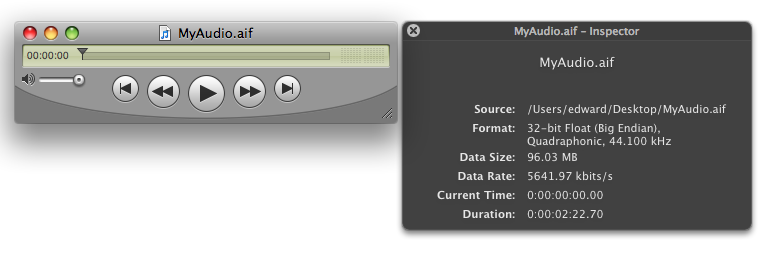
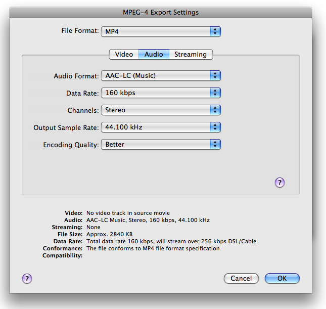
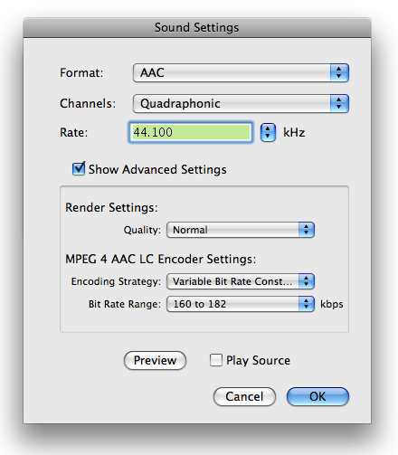
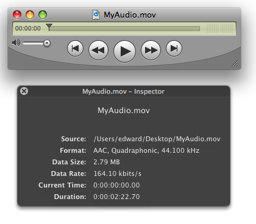
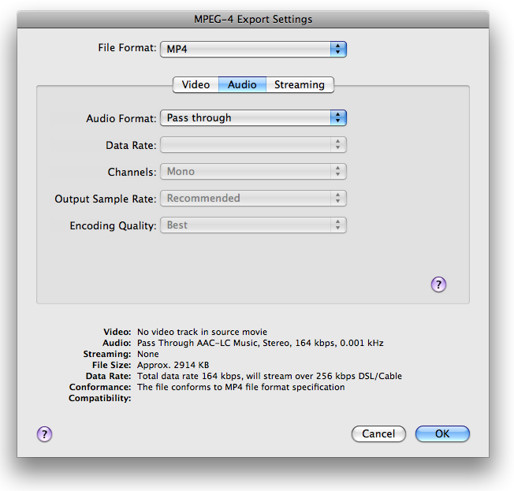
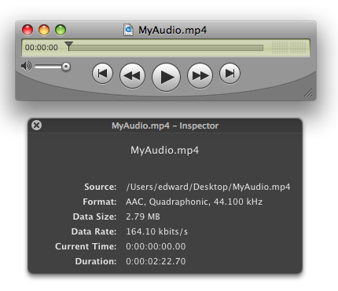

> 导航：[总目录](../../README.md) · [technotes](../../_indexes/technotes.md)


Technical Note TN2237

# Audio Export - Encoding AAC Audio For MPEG-4 Export

"...you don't want to throw too many curves at your audio and video guys." - Rick Moranis

[Introduction](#apple-f4xwc4dqnrsv64tfmyxwi33df52wszbpirkfgnbqgaydqmjug4wugsbrfvjukq2ujfhu4mi)[The Dialogs](#apple-f4xwc4dqnrsv64tfmyxwi33df52wszbpirkfgnbqgaydqmjug4wugsbrfvjukq2ujfhu4mq)[MPEG-4 Export Settings](#apple-f4xwc4dqnrsv64tfmyxwi33df52wszbpirkfgnbqgaydqmjug4wugsbrfvjvkqstivbviskpjyza)[QuickTime Movie Export Settings](#apple-f4xwc4dqnrsv64tfmyxwi33df52wszbpirkfgnbqgaydqmjug4wugsbrfvjvkqstivbviskpjyzq)[The Problem](#apple-f4xwc4dqnrsv64tfmyxwi33df52wszbpirkfgnbqgaydqmjug4wugsbrfvjukq2ujfhu4ni)[Two Step Export Using Pass Through](#apple-f4xwc4dqnrsv64tfmyxwi33df52wszbpirkfgnbqgaydqmjug4wugsbrfvjukq2ujfhu4nq)[Step One](#apple-f4xwc4dqnrsv64tfmyxwi33df52wszbpirkfgnbqgaydqmjug4wugsbrfvjvkqstivbviskpjy3a)[Step Two](#apple-f4xwc4dqnrsv64tfmyxwi33df52wszbpirkfgnbqgaydqmjug4wugsbrfvjvkqstivbviskpjy3q)[But wait, there's more...](#apple-f4xwc4dqnrsv64tfmyxwi33df52wszbpirkfgnbqgaydqmjug4wugsbrfvjukq2ujfhu4oi)[Encoding Properties In Detail](#apple-f4xwc4dqnrsv64tfmyxwi33df52wszbpirkfgnbqgaydqmjug4wugsbrfvjukq2ujfhu4mjq)[Render Setting](#apple-f4xwc4dqnrsv64tfmyxwi33df52wszbpirkfgnbqgaydqmjug4wugsbrfvjvkqstivbviskpjyyta)[Encoding Strategy](#apple-f4xwc4dqnrsv64tfmyxwi33df52wszbpirkfgnbqgaydqmjug4wugsbrfvjvkqstivbviskpjyytc)[References](#apple-f4xwc4dqnrsv64tfmyxwi33df52wszbpirkfgnbqgaydqmjug4wugsbrfvjukq2ujfhu4mjt)[Document Revision History](#apple-f4xwc4dqnrsv64tfmyxwi33df52wszbpirkfgnbqgaydqmjug4wvezlwnfzws33ojbuxg5dpoj4s2rdpnz2ey2lonncwyzlnmvxhiskel4yq)

## Introduction

QuickTime allows content creators and application developers to export Movies as MPEG-4 (`.mp4`) or QuickTime movie (`.mov`) files containing AAC encoded audio tracks.

This task may be accomplished using the QuickTime MPEG-4 Exporter or the QuickTime Movie Exporter (depending on the required file type, `.mp4` or `.mov`) and the QuickTime Player application (Pro features enabled), or with Cocoa APIs and the QTKit Framework if a custom application is required.

However, there is a subtle difference between the above mentioned export components when it comes to the AAC audio encoding options accessible and configurable with each.

In some cases when creating an `.mp4` file, more control may be desired over the AAC encoding process than currently provided using the MPEG-4 export component. This may require a slightly different approach to the export workflow.

[Back to Top](#)

## The Dialogs

As an example, let's assume we want to export a source `.aif` file containing 4 channels of PCM audio sampled at 44.1k with a Quadraphonic channel layout (L R Ls Rs) and inspect the options for both the MPEG-4 Exporter and the QuickTime Movie Exporter.

Our hypothetical export requirements are; an `.mp4` file with the same sample rate and channel layout as the source, but we want to allow the AAC codec to vary the data rate as needed (within our constraints <185 kbps) to produce the best audio quality for the chosen sample rate.

Let's see what we can do with each Exporter.

__Figure 1__  PCM Source `.aif` File



### MPEG-4 Export Settings

To view the `.mp4` export audio options in QuickTime Player:

- Choose Export from the File Menu.
- Select "Movie to MPEG-4" from the Export pop-up.
- Click the "Options..." button.
- Select the "Audio" tab.
- Choose AAC-LC (Music) for the Audio Format

__Figure 2__  Movie to MPEG-4 Exporter.



When exporting to AAC, you have access to the following options:

__Audio Format:__ None, AAC-LC (Music) or "Pass through" if the source audio is already AAC encoded.

__Data Rate:__ An Average bit rate (ABR) value in kilobits per second. A determiner of output audio quality, in general, the higher the data rate, the better the audio quality. The effective data rate is also affected by other compression options such as the sampling rate.

__Channels:__ Mono (1 channel) or Stereo (2 channels).

__Output Sample Rate:__ Also a determiner of output audio quality, the available sample rates presented in the pop-up will change depending on the data rate chosen. Selecting "Recommended" will allow the codec to make the best choice to achieve the best audio quality depending on the requested data rate.

__Encoding Quality:__ Good, Better or Best. The Good setting is optimized for the highest-speed encoding, for higher-quality choose Better or Best (optimal for 24-bit source). The tradeoff is between encoding speed and audio quality.

### QuickTime Movie Export Settings

To view the `.mov` export audio options in QuickTime Player:

- Choose Export from the File Menu.
- Select "Movie to QuickTime Movie" from the Export pop-up.
- Click the "Options..." button.
- Ensure the "Sound" checkbox is checked
- Click the "Settings..." button.
- Choose AAC as the Audio Format

__Figure 3__  Movie to QuickTime Movie Exporter.



With AAC selected as the format, you have access to the following options:

__Channels:__ Depending on the source, you have a number of audio channel layouts to choose from; Mono, Stereo, Quadraphonic, 5.1 (C L R Ls Rs LFE) and so on.

__Sample Rate:__ A determiner of output audio quality, the available sample rates presented in the pop-up will change depending on the data rate chosen. Selecting "Recommended" will allow the codec to make the best choice to achieve the best audio quality depending on the requested data rate and encoder strategy.

__Render Settings (Quality):__ The codec quality setting allows a choice between encoding speed and sound quality. There are five settings to choose from; Faster, Fast, Normal, Better and Best.

__Encoding Settings (Encoder Strategy):__ The bit rate allocation strategy for the codec; Average, Variable, Variable Constrained and Constant. A determiner of output audio quality, each setting allows optimization dependent on specific needs. See Encoding Properties In Detail.

__Encoding Settings (Target Bit Rate, Estimated Bit Rate or Bit Rate Range):__ Also a determiner of output audio quality, the data rate selected is coupled to the selected codec strategy.

[Back to Top](#)

## The Problem

It is clear from inspecting the AAC audio encoding options available in each exporter that the QuickTime Movie Exporter presents a more robust set of encoding options. This allows for finer grain control over the creation of audio assets when using the AAC codec.

Since it seems that the MPEG-4 Audio Exporter is somewhat simplified (we wouldn't be able to choose our required channel layout for example), how can a `.mp4` file be created with QuickTime if more control is required for tweaking parameters such as the Audio Channel Layout, Encoding Strategy or Data Rate?

A two step export process must be used along with the MPEG-4 Exporters "Pass through" Audio Format setting.

[Back to Top](#)

## Two Step Export Using Pass Through

Conceptually, the two step export process is very straight forward; Using the same `.aif` file from Figure 1 with the AAC options presented by the QuickTime Movie Export component as seen in Figure 3, let's create an `.mp4` file containing AAC audio encoded to specifications outside of what could be achieved using the MPEG-4 Exporter alone.

### Step One

- Select and Open your source file. In our example, the file is called MyAudio.aif as shown in Figure 1.
- Choose Export from the File Menu.
- Select "Movie to QuickTime Movie" from the Export pop-up.
- Click the "Options..." button.
- Ensure the "Sound" checkbox is checked
- Click the "Settings..." button.
- Choose "AAC" as the Audio Format
- Select the appropriate channel layout. Since the source has 4 channels (L R Ls Rs) we'll choose "Quadraphonic". This setting is not available with the MPEG-4 Exporter.
- Select "Normal" from the Render Settings Quality pop-up. The "Normal" setting is the same as choosing "Better" in the MPEG-4 Exporter dialog. Choosing "Faster" or "Fast" is the same as "Good" in the MPEG-4 Exporter dialog while selecting "Better" or "Best" is the same as choosing "Best".
- Select "Variable Bit Rate Constrained" from the Encoder Settings Encoding Strategy pop-up. This setting is not available with the MPEG-4 Exporter.
- Select "160 to 182" kbps from the Encoder Settings Bit Rate Range pop-up. This setting is not available with the MPEG-4 Exporter.
- Click the "Ok" button, to return to the Movie Settings then click the "Ok" button again.
- Click "Save" to export the file. For our example, MyAudio.mov will be created.

__Figure 4__  AAC Encoded `.mov` File



### Step Two

Now that we have our source AAC encoded to our specifications, we need to save it in a `.mp4` file without any further manipulation. The MPEG-4 Audio Export settings "Pass through" option will do the trick.

- Select and Open the AAC encoded source file. Our example file is called MyAudio.mov as shown in Figure 4.
- Choose Export from the File Menu.
- Select "Movie to MPEG-4" from the Export pop-up.
- Click the "Options..." button.
- Select the "Audio" tab.
- Choose "Pass through" for the Audio Format, all other pop-ups will become inactive.

The dialog should look like Figure 5.

__Figure 5__  MPEG-4 Export Settings - Audio Pass Though Selected.



- Click the "Ok" button.
- Click "Save" to export the file. Our final MyAudio.mp4 will be created.

__Figure 6__



Figure 6 shows the final `.mp4` file resulting from the two step process.

[Back to Top](#)

## But wait, there's more...

If all this exporting and dialog configuration with QuickTime Player just to get all the available AAC encoding options is giving you a headache, you may be wondering if there's a way to do the same thing in a single step?

The `afconvert` tool located in `/usr/bin/` is the answer.

`afconvert` (a.k.a. Audio File Convert) will convert a source audio file to a new audio file and supports a large set of file formats, data formats and encoding options.

To produce the same `.mp4` file from the original source `.aif` file in a single step, we can simply use `afconvert` from the Terminal. The options specified on the command line will be the same options chosen in the QuickTime Movie Exporter dialog.

```
[theanalogkid:~] geddy% afconvert -v -f 'mp4f' -d aac@44100 -c 4 -l Quadraphonic -b 160000 -q 64 -s 2 /MyAudio.aif /MyAudio.mp4  Input file: MyAudio.aif, 6293438 frames, Quadraphonic codec quality = 64 strategy = 2 bitrate = 160000 Formats:   Input file     4 ch,  44100 Hz, 'lpcm' (0x0000000B) 32-bit big-endian float                  Quadraphonic -- overriding layout Quadraphonic in file   Output file    4 ch,  44100 Hz, 'aac ' (0x00000000) 0 bits/channel, 0 bytes/packet, 1024 frames/packet, 0 bytes/frame                  Quadraphonic   Output client  4 ch,  44100 Hz, 'lpcm' (0x0000000B) 32-bit big-endian float AudioConverter 0x811434 [0x134ef0]:   PCMConverter 0x13f8c0     Input: 4 ch,  44100 Hz, 'lpcm' (0x0000000B) 32-bit big-endian float     Output: 4 ch,  44100 Hz, 'lpcm' (0x00000009) 32-bit little-endian float   CodecConverter 0x137720     Input: 4 ch,  44100 Hz, 'lpcm' (0x00000009) 32-bit little-endian float     Output: 4 ch,  44100 Hz, 'aac ' (0x00000000) 0 bits/channel, 0 bytes/packet, 1024 frames/packet, 0 bytes/frame     Input layout tag: 6C0004     Output layout tag: 6C0004 Output file: MyAudio.mp4, 6295552 frames
```

__Verbose -v:__ Simply prints the applications progress verbosely and is completely optional.

__File Format -f:__ The wanted output file format. `'mp4f'` specifying an MPEG-4 file.

__Data Format -d:__ The wanted data format and sample rate. Specifying `aac` without a sample rate defaults to the "Recommended" choice as seen in the dialogs.

__Number Of Channels -c:__ The number of channels for the output file. This parameter may be used to add or remove channels without any regard to channel order.

__Channel Layout -l:__ The channel layout for the output file or both input and output files. If specified once, the layout applies to the output file. If specified twice, the first layout applies to the input file while the second applies to the output file. Some tags that can be used are Mono, Stereo, Quadraphonic, AAC_5_1 and so on. A full list may be found in `CoreAudio/CoreAudioTypes.h`.

__Bit Rate (bps) -b:__ Output data rate in bits-per-second.

__Quality -q:__ A value from 0-127 representing codec quality. See Encoding Properties In Detail.

__Encoding Strategy -s:__ A value from 0 to 3 representing encoding strategy:

- 0 - Constant Bit Rate (CBR)
- 1 - Average Bit Rate (ABR)
- 2 - Variable Bit Rate Constrained (VBR Constrained)
- 3 - Variable Bit Rate (VBR)

For a detailed list of every possible parameter accepted by `afconvert`, use either the `-h (--help)` parameter or simply type `afconvert` at the command prompt.

[Back to Top](#)

## Encoding Properties In Detail

### Render Setting

The values in Table 1 are the Quality Render Settings available when using the QuickTime Movie Exporter or `afconvert` and clearly indicate the tradeoff between CPU time and audio quality.

__Table 1__  Constants used with `kAudioCodecPropertyQualitySetting` and -q parameter in `afconvert`.

| Quality | AudioCodecQuality (AudioCodec.h) | Value |
| Faster | kAudioCodecQuality_Min | 0 |
| Fast | kAudioCodecQuality_Low | 32 (0x20) |
| Normal | kAudioCodecQuality_Medium | 64 (0x40) |
| Better | kAudioCodecQuality_High | 96 (0x60) |
| Best | kAudioCodecQuality_Max | 127 (0x7F) |

### Encoding Strategy

These encoding strategies (a.k.a bit rate control modes) are used with the `-s` parameter in `afconvert` and the `kAudioCodecPropertyBitRateControlMode (AudioUnit/AudioCodec.h)` property.

__Constant Bit Rate (CBR)__ `kAudioCodecBitRateControlMode_Constant` - Recommended for live streaming.

This mode achieves a constant target bit rate and is completely compliant to the CBR mode specified in the MPEG-4 standard. This mode is suitable for constant-bit-rate network transmission when decoding in real-time with a fixed end-to-end audio delay. However, due to the strict constant bit rate constraint, this mode offers the lowest audio quality and highest complexity among all the encoding modes offered.

__Average Bit Rate (ABR)__ `kAudioCodecBitRateControlMode_LongTermAverage` - Default Mode, recommended for controlling file size.

A target bit rate is achieved over a long term average (typically after the first few seconds of encoding). Unlike the CBR mode, this mode does not provide constant delay when using constant bit rate transmission, but provides best overall quality while still being able to strictly control the resulting file size with less complexity than the CBR mode.

__Variable Bit Rate (VBR)__ `kAudioCodecBitRateControlMode_Variable` - Recommended for controlling audio quality.

The audio signal is encoded with constant (and settable) quality and virtually no bit rate constraints. This is the best mode to achieve consistent audio quality across many files and the smallest file size to achieve that quality. It also has the lowest complexity of all the encoding modes.

__Variable Bit Rate But Constrained (VBR Constrained)__ `kAudioCodecBitRateControlMode_VariableConstrained` - Recommended as a compromise between VBR and ABR.

This mode is similar to VBR but limits the average bit rate variation. The lower limit is the user-selected bit rate. Higher bit rate is adapted for difficult tracks and can generate larger files than the ABR mode.

__Note:__ When using the VBR encoding strategy, `afconvert` will also allow you to specify a __Sound Quality__ level. In addition to the encoding time to audio quality tradeoff, sound quality can be thought of as the tradeoff between audio quality and the final output file size. Different file sizes will be produced depending on this sound quality value (the higher the sound quality value the larger the resulting file).

This VBR sound quality level is configured in `afconvert` using the -u parameter and the four-character-code for the  `kAudioCodecPropertySoundQualityForVBR` property `'vbrq'`.

For example:

`"-u vbrq <sound_quality>"` where <sound_quality> is a value: 0-127.

This property is currently not directly configurable when using the QuickTime Movie Exporter, it is mapped to "Estimated Bit Rate".

[Back to Top](#)

## References

[Compressing QuickTime Movies for the Web](https://developer.apple.com/technotes/tn2008/tn2218.html)

[Back to Top](#)

---

#### Document Revision History

| __Date__ | __Notes__ |
| 2009-01-27 | Editorial |
| 2008-12-22 | The QT MPEG4 Exporter does not show all options for generating AAC, this TN discusses workarounds. |
|  | New document that the QT MPEG4 Exporter does not show all options for generating AAC, this TN discusses workarounds. |

