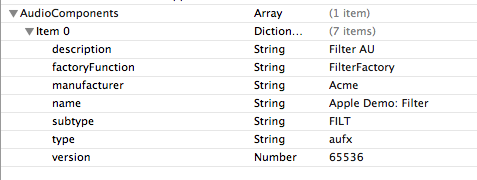
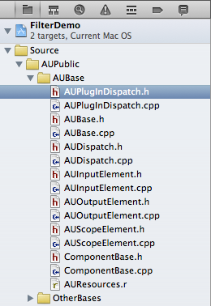

> 导航：[总目录](../../README.md) · [technotes](../../_indexes/technotes.md)


Technical Note TN2276

# Audio Unit AUPlugIn - Updating an existing Audio Unit for OS X Lion and later

When updating audio units for Mac OS X Lion or later there are a number of changes that must be made to your Xcode project for the audio unit to build and run on the system. Once these changes are in place, the audio unit will build and run in Mac OS X Lion and also run when deployed in Mac OS X v10.6.x.

This technical note discusses these changes using the FilterDemo audio unit sample code project as an example.

__Important:__ Audio units already compiled for Mac OS X v10.6.x continue to work in Mac OS X Lion without modification.

[Overview](#apple-f4xwc4dqnrsv64tfmyxwi33df52wszbpirkfgnbqgaytcmbtgewugsbrfvke4vcbi4yq)[Example: Updating the FilterDemo Audio Unit](#apple-f4xwc4dqnrsv64tfmyxwi33df52wszbpirkfgnbqgaytcmbtgewugsbrfvke4vcbi4za)[Document Revision History](#apple-f4xwc4dqnrsv64tfmyxwi33df52wszbpirkfgnbqgaytcmbtgewvezlwnfzws33ojbuxg5dpoj4s2rdpnz2ey2lonncwyzlnmvxhiskel4yq)

## Overview

Mac OS X Lion introduces a new plug-in model called `AUPlugIn` which is no longer based on the Component Manager. The `AUPlugIn` model has a new dispatch mechanism requiring the inclusion of two new dispatch helper files called `AUPlugInDispatch.h` and `AUPlugInDispatch.cpp` respectively.

A new `AUDIOCOMPONENT_ENTRY()` macro has been added to `ComponentBase.h` and by using this macro audio unit entry points are created for both the audio unit plug-in for Mac OS X Lion and the Component Manager component for backwards compatibility with Mac OS X v10.6.x.

Because audio units no longer use the Component Manager on Mac OS X Lion or newer, `AUPlugIn` based audio units do not use resource files (`.r` files) or the '`thng`' resource to define properties such as `kComponentType`, `kComponentSubType`, and `kComponentManufactureType`. These properties are now specified in the project's `Info.plist` file for the audio unit. You can continue to include the Component Manager resource file in the project for backwards compatibility with Mac OS X v10.6.x.

The new `AUPlugIn` entry point generated by the `AUDIOCOMPONENT_ENTRY()` macro is required and must be added to the exports file (`.exp`). You can leave the Component Manager entry point in the exports file to provide backwards compatibility with Mac OS X v10.6.x.

[Back to Top](#)

## Example: Updating the FilterDemo Audio Unit

Download the FilterDemo Audio Unit sample and walk though the following update steps. Mac OS X Lion and the associated Xcode tools are required.

1. Open the file `Filter.cpp` and replace `COMPONENT_ENTRY(Filter)` with `AUDIOCOMPONENT_ENTRY(AUBaseFactory,` `Filter)`. This is the new macro that generates the plugin entry for the audio unit. See Listing 1.
2. Add the new entry point called `_FilterFactory` to the `Filter.exp` file. `_FilterFactory` is generated by the `AUDIOCOMPONENT_ENTRY()` macro. Leave `_FilterEntry` for backwards compatibility. See Listing 2.
3. Add an `AudioComponents` dictionary to the `Info.plist` file. Audio unit plugins do not use resource files to define their properties, therefore these items now need to be specified in the `Info.plist` file. Note that the resource file (`Filter.r`) should be left in place for backwards compatibility. See Listing 3 and Figure 1.
4. Add the `AUPlugInDispatch.h` and `AUPlugInDispatch.cpp` files to the project. These dispatch helper files are located in `Developer/Extras/CoreAudio/AUPublic/AUBase` and are required by the `AUPlugIn` manager. See Figure 2.

__Listing 1__  Change entry point generation macro in `Filter.cpp`

```
//~~~~~~~~~~~~~~~~~~~~~~~~~~~~~~~~~~~~~~~~~~~~~~~~~~~~~~~~~~~~~~~~~~~~~~~~~~~~~~~~~~~~~~~~~~
//	Standard DSP AudioUnit implementation

// old component manager entry point no longer required
//COMPONENT_ENTRY(Filter)

// new AUPlugIn macro
AUDIOCOMPONENT_ENTRY(AUBaseFactory, Filter)
```

__Listing 2__  Add new entry point in `Filter.exp`

```
_FilterEntry
_FilterFactory
```

__Listing 3__  `AudioComponents` array in the `Info.plist` file.

```
<key>AudioComponents</key>
<array>
<dict>
<key>description</key>
<string>Filter AU</string>
<key>factoryFunction</key>
<string>FilterFactory</string>
<key>manufacturer</key>
<string>Acme</string>
<key>name</key>
<string>Apple Demo: Filter</string>
<key>subtype</key>
<string>FILT</string>
<key>type</key>
<string>aufx</string>
<key>version</key>
<integer>65536</integer>
</dict>
</array>
```

__Figure 1__  Graphical representation of `AudioComponents` array.



__Figure 2__  AUPlugInDispatch files added to Xcode project.

[Back to Top](#)

---

#### Document Revision History

| __Date__ | __Notes__ |
| 2012-08-17 | Fixed plist information |
| 2012-05-09 | Editorial |
| 2011-09-30 | Fixed plist information |
| 2011-08-22 | Editorial |
| 2011-05-23 | New document that discusses required audio unit project changes for building and running on OS X Lion (and v10.6.x). |

