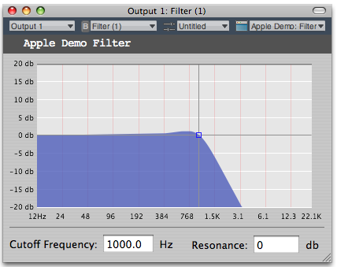

> 导航：[总目录](../../README.md) · [technotes](../../_indexes/technotes.md)


Technical Note TN2104

# Audio Unit Development - Handling Audio Unit Events

This technote describes how to use Audio Unit Events to send and receive notifications about an Audio Unit's changing state, whether those changes are due to "gestures", or changes in the values of parameters or properties.

Using the Audio Unit Event API, Audio Units, Audio Unit Hosts, and their UIs now have a unified method of sending and receiving notifications of events. Notifications of events can be sent and received without the need of different implementations for both Carbon and Cocoa UIs. This greatly simplifies the interaction between Audio Units, their hosts, and their UIs.

There are three different types of events that can fall into the `AudioUnitEvent` category:

- Parameter value changes.
- Changes to an Audio Unit Property value.
- The begin or end of Audio Unit Parameter change gestures.

The Audio Unit Event API is simply a mechanism for sending notification of these types of changes. This new implementation builds on top of the existing Core Audio API for Audio Unit property and parameter listening. This new implementation allows better cooperation among clients by using AudioUnitEvents to be aware of what the other client is doing. Now, when an Audio Unit host changes an Audio Unit's parameter (or property value), that change can be reflected in the host's GUI, and vice versa.

This API also provides a universal notification of the begin or end parameter change gestures. An example of a gesture would be a user clicking and dragging a slider on an UI. The begin gesture in this case would be the users first click, whereas the end gesture would be when the user releases the mouse button. This is much like Carbon mouse click events, but now a developer can expand the definition of gestures to events other than just mouse clicks (such as pressing a key on the keyboard).

[AudioUnitEvents and AUEventListeners](#apple-f4xwc4dqnrsv64tfmyxwi33df52wszbpirkfgmjqgaydgmjzhawugsbrfvavkrcjj5cvmrkokq)[Handling Parameter Changes](#apple-f4xwc4dqnrsv64tfmyxwi33df52wszbpirkfgmjqgaydgmjzhawugsbrfviecusbjvcvirkskm)[Handling Property Changes](#apple-f4xwc4dqnrsv64tfmyxwi33df52wszbpirkfgmjqgaydgmjzhawugsbrfvifet2qivjfiskfkm)[Notifications of Begin/End Gestures](#apple-f4xwc4dqnrsv64tfmyxwi33df52wszbpirkfgmjqgaydgmjzhawugsbrfvduku2ukvjekuy)[Summary - The FilterDemo Sample](#apple-f4xwc4dqnrsv64tfmyxwi33df52wszbpirkfgmjqgaydgmjzhawugsbrfvjvktknifjfsx27l5keqrk7izeuyvcfkjcektkpl5juctkqjrcq)[References](#apple-f4xwc4dqnrsv64tfmyxwi33df52wszbpirkfgmjqgaydgmjzhawugsbrfvjekrsfkjcu4q2fkm)[Document Revision History](#apple-f4xwc4dqnrsv64tfmyxwi33df52wszbpirkfgmjqgaydgmjzhawvezlwnfzws33ojbuxg5dpoj4s2rdpnz2ey2lonncwyzlnmvxhiskel4yq)

## AudioUnitEvents and AUEventListeners

An `AudioUnitEvent` is comprised of an `AudioUnitEventType` and possibly an argument, which can refer to either an `AudioUnitParameter` or an `AudioUnitProperty`.

__Listing 1__  The `AudioUnitEvent` struct as defined in AudioUnitUtilities.h

```c
/*!
    @struct     AudioUnitEvent
    @abstract   Describes a change to an Audio Unit's state.
    @field      mEventType
        The type of event.
    @field      mArgument
        Specifies the parameter or property which has changed.
*/
typedef struct AudioUnitEvent {
    AudioUnitEventType                  mEventType;
    union {
        AudioUnitParameter  mParameter; // for parameter value change, begin and end gesture
        AudioUnitProperty   mProperty; // for kAudioUnitEvent_PropertyChange
    }                                   mArgument;
} AudioUnitEvent;
```

An `AudioUnitEventType` will describe an `AudioUnitEvent`. Event types are restricted to the following four types of events: begin and end gestures, parameter changes, and property changes. If the intended use of an `AudioUnitEvent` is to send a notification of `AudioUnitParameter` activity, then the only event types that may be used are `kAudioUnitEvent_ParameterValueChange`, `kAudioUnitEvent_BeginParameterChangeGesture`, or `kAudioUnitEvent_EndParameterChangeGesture`. Similarly, an `AudioUnitProperty` can only use `kAudioUnitEvent_PropertyChange` as the event type.

__Listing 2__  `AudioUnitEventType` as defined in AudioUnitUtilities.h

```c
/*!
    @enum       AudioUnitEventType

    @abstract   Types of Audio Unit Events.

    @constant   kAudioUnitEvent_ParameterValueChange
                    The event is a change to a parameter value
    @constant   kAudioUnitEvent_BeginParameterChangeGesture
                    The event signifies a gesture (e.g. mouse-down) beginning a potential series of
                    related parameter value change events.
    @constant   kAudioUnitEvent_EndParameterChangeGesture
                    The event signifies a gesture (e.g. mouse-up) ending a series of related
                    parameter value change events.
    @constant   kAudioUnitEvent_PropertyChange
                    The event is a change to a property value.
*/
enum {  // typedef UInt32 AudioUnitEventType
    kAudioUnitEvent_ParameterValueChange        = 0,
    kAudioUnitEvent_BeginParameterChangeGesture = 1,
    kAudioUnitEvent_EndParameterChangeGesture   = 2,
    kAudioUnitEvent_PropertyChange              = 3
};
typedef UInt32 AudioUnitEventType;
```

Listeners can be created to monitor changes in the parameters or properties of an Audio Unit. The `AUEventListenerCreate` method (defined in `<AudioToolbox/AudioUnitUtilities.h>`) will create an `AUEventListener` for your Audio Unit. To correctly create an event listener with the `AUEventListenerCreate` method, you must include the `CFRunLoop` and the `CFRunLoop` mode on which you intend to receive `AudioUnitEvent` notifications.

While these notifications may be issued from real-time priority threads, they may be received on another run loop that can be specified when the event listener is created. When using `AUEventListenerCreate`, you must also specify the interval between calls to the `AUEventListenerProc` calback, as well as the granularity with which the parameter value changes will queued by the listener callback. This will improve performance because it defines the correct frequency for notifications to occur, which enables Audio Units and hosts to react more appropriately to an event. For example, when an event follows a previous one by a smaller time interval than the granularity, then the listener will only be notified for the second parameter change. This can be very helpful depending on the type of Audio Unit or host being created. Please refer to `<AudioToolbox/AudioUnitUtilities.h>` for more information and examples of notification intervals and value change granularity.

After the event listener is created, you may add events it will listen for by using `AUEventListenerAddEventType`. `AUEventListenerAddEventType` requires an `AUEventListenerRef` and an `AudioUnitEvent`.

__Listing 3__  The `AUEventListenerProc` callback as defined in <AudioToolbox/AudioUnitUtilities.h>

```c
/*!
    @typedef    AUParameterListenerProc
    @abstract   A function called when an Audio Unit event occurs.
    @param  inCallbackRefCon
                The value passed to AUListenerCreate when the callback function was installed.
    @param  inObject
                The object which generated the parameter change.
    @param  inEvent
                The event which occurred.
    @param  inEventHostTime
                The host time at which the event occurred.
    @param  inParameterValue
                If the event is parameter change, the parameter's new value (otherwise, undefined).
*/
typedef void (*AUEventListenerProc)(void *                  inCallbackRefCon,
                                    void *                  inObject,
                                    const AudioUnitEvent *  inEvent,
                                    UInt64                  inEventHostTime,
                                    AudioUnitParameterValue inParameterValue);
```

__Listing 4__  `AUEventListenerCreate` declaration as defined in <AudioToolbox/AudioUnitUtilities.h>

```
/*!
    @functiongroup  AUEventListener
*/

/*!
    @function   AUEventListenerCreate
    @abstract   Creates an Audio Unit event listener.
    @param      inProc
                    Function called when an event occurs.
    @param      inCallbackRefCon
                    A reference value for the use of the callback function.
    @param      inRunLoop
                    The run loop on which the callback is called. If NULL,
                    CFRunLoopGetCurrent() is used.
    @param      inRunLoopMode
                    The run loop mode in which the callback's underlying run loop source will be
                    attached. If NULL, kCFRunLoopDefaultMode is used.
    @param      inNotificationInterval
                    The minimum time interval, in seconds, at which the callback will be called.
    @param      inValueChangeGranularity
                    Determines how parameter value changes occuring within this interval are
                    queued; when an event follows a previous one by a smaller time interval than
                    the granularity, then the listener will only be notified for the second
                    parameter change.
    @param      outListener
                    On succcessful return, an AUEventListenerRef.

    @discussion
        AUEventListener is a specialization of AUParameterListener; use AUListenerDispose to
        dispose of an AUEventListener. You may use AUListenerAddParameter and
        AUListenerRemoveParameter with AUEventListerRef's, in addition to
        AUEventListenerAddEventType / AUEventListenerRemoveEventType.

        Some examples illustrating inNotificationInterval and inValueChangeGranularity:

        [1] a UI receiver: inNotificationInterval = 100 ms, inValueChangeGranularity = 100 ms.
            User interfaces almost never care about previous values, only the current one,
            and don't wish to perform redraws too often.

        [2] An automation recorder: inNotificationInterval = 200 ms, inValueChangeGranularity = 10 ms.
            Automation systems typically wish to record events with a high degree of timing precision,
            but do not need to be woken up for each event.

        In case [1], the listener will be called within 100 ms (the notification interval) of an
        event. It will only receive one notification for any number of value changes to the
        parameter concerned, occurring within a 100 ms window (the granularity).

        In case [2], the listener will be received within 200 ms (the notification interval) of
        an event It can receive more than one notification per parameter, for the last of each
        group of value changes occurring within a 10 ms window (the granularity).

        In both cases, thread scheduling latencies may result in more events being delivered to
        the listener callback than the theoretical maximum (notification interval /
        granularity).
*/
extern OSStatus
AUEventListenerCreate(AUEventListenerProc   inProc,
                      void *                inCallbackRefCon,
                      CFRunLoopRef          inRunLoop,
                      CFStringRef           inRunLoopMode,
                      Float32               inNotificationInterval,     // seconds
                      Float32               inValueChangeGranularity,   // seconds
                      AUEventListenerRef *  outListener)
```

__Listing 5__  Creating an Audio Unit Event Listener

```
// The inObject parameter should specify an object interested in the event type.
// This object is passed as the inObject parameter to the listener callback function.
OSStatus createListener(void *inObject)
{
    AudioUnitEvent      myPropertyEvent;
    AudioUnitProperty   myProperty;
    AUEventListenerRef  MyListener;

    OSStatus result = noErr;

    //this may be a run loop of your choosing
    CFRunLoopRef runLoop = (CFRunLoopRef)GetCFRunLoopFromEventLoop(GetCurrentEventLoop());
    CFStringRef loopMode = kCFRunLoopDefaultMode;

    myPropertyEvent.mEventType = kAudioUnitEvent_PropertyChange;

    myProperty.mAudioUnit = mAudioUnit;
    myProperty.mPropertyID = kAudioUnitCustomProperty_FilterFrequencyResponse;
    myProperty.mScope = kAudioUnitScope_Global;
    myProperty.mElement = 0;

    myPropertyEvent.mArgument.mProperty = myProperty;

    result = AUEventListenerCreate(MyPropertyListener,
                                   NULL,
                                   runLoop,
                                   loopMode,
                                   0.05,
                                   0.05,
                                   &MyListener);

    if (noErr == result) {
        result = AUEventListenerAddEventType(MyListener, inObject, &myPropertyEvent);
    }

    return result;
}
```

[Back to Top](#)

## Handling Parameter Changes

Audio Unit parameters are used to modify the behavior of the rendering process of an Audio Unit. Parameters can be used to modify volume, gain, delay and many other behaviors that would have an effect on an Audio Unit. These changes are often applied in real time and notifications of these changes can be sent and received through an `AudioUnitEvent`.

Parameter change notifications can be sent by an Audio Unit or host using `AUEventListenerNotify`. The `AudioUnitEvent` must have `kAudioUnitEvent_ParameterValueChange` as the type and an `AudioUnitParameter` for the argument. The events are delivered serially to the listener interspersed with parameter changes, preserving the time order of the events and parameter changes. This is much like what `AUParameterListener` already does, but in a more general case. An `AUParameterListener` can generate theses notifications by using `AUParameterSet` and `AUParameterListenerNotify`.

The `AUEventListener` API's extend the above `AUParameterListener` API's by adding a semantic of events other than parameter changes.

__Listing 6__  Creating an `AudioUnitEvent` (`kAudioUnitEvent_ParameterValueChange`) and notifying the `AUEventListener`

```
AudioUnitEvent myEvent;

myEvent.mEventType = kAudioUnitEvent_ParameterValueChange;
myEvent.mArgument.mParameter.mAudioUnit = mAudioUnit;
myEvent.mArgument.mParameter.mParameterID = kFilterParam_CutoffFrequency;
myEvent.mArgument.mParameter.mScope = kAudioUnitScope_Global;
myEvent.mArgument.mParameter.mElement = 0;

AUEventListenerNotify(NULL, NULL, &myEvent);
```

[Back to Top](#)

## Handling Property Changes

Properties represent a general and extensible mechanism for passing information to and from Audio Units. The type of information passed by properties can be managed by listening for Audio Unit Events. Actions both internal and external to an Audio Unit can change a properties value.

For instance, an output audio unit that tracks the device that a user chooses in the Sound Preferences pane is the Default Output Unit. The device can be changed at any time through user interaction. If a program has an instance of the Default Output Unit open, a property listener for the `kAudioOutputUnitProperty_CurrentDevice` property can be established to allow the program to detect that change. Alternatively, the program may not care about the particular device that the Default Output Unit is connected to, but may care about the format of that device for example, the sample rate of the device. To detect that property has changed, a listener can also be established beforehand to notify that a property value has changed. Then the host or Audio Unit can take any appropriate actions that it needs to.

Property change notifications can be implemented by using an `AudioUnitEvent`. The `AudioUnitEvent` must have an `AudioUnitProperty` and `kAudioUnitEvent_PropertyChange` as the type. After a listener is created using `AUEventListenerCreate`, the Audio Unit or host can receive these notifications safely on the thread where it will be most applicable instead of the thread where the change actually occurred. This is particularly useful for notifications which are generated on an audio rendering thread (such threads typically run with realtime priority).

__Listing 7__  Creating an `AudioUnitEvent` (`kAudioUnitEvent_PropertyChange`) and notifying `AUEventListener`

```
AudioUnitEvent myEvent;

myEvent.mEventType = kAudioUnitEvent_PropertyChange;
myEvent.mArgument.mProperty.mAudioUnit = mAudioUnit;
myEvent.mArgument.mProperty.mPropertyID = kAudioUnitCustomProperty_FilterFrequencyResponse;
myEvent.mArgument.mProperty.mScope = kAudioUnitScope_Global;
myEvent.mArgument.mProperty.mElement = 0;

AUEventListenerNotify(NULL, NULL, &myEvent);
```

[Back to Top](#)

## Notifications of Begin/End Gestures

Audio Units have a general method of sending begin and end gesture notifications. Begin and end gesture notifications send an event to say that a parameter is about to be changed or has finished changing. This enables both Carbon and Cocoa UIs to send and receive these types of event notifications from user interactions, then decide what to do with that information. This mechanism generalizes the definition of gestures so that any interaction with the GUI can be interpreted as a gesture, therefore removing the limitation of mouse clicks (mouse up, mouse down) as the only valid gesture that can be interpreted.

__Note:__ This will eventually deprecate the Carbon view events `kAudioUnitCarbonViewEvent_MouseDownInControl` and `kAudioUnitCarbonViewEvent_MouseUpInControl`.

For example, a user may want to click and drag a parameter button on an Audio Unit's GUI to change its value. The user interface can be made to react to the user's selection by changing the button color to provide feedback to the user that a parameter value is about to be changed. After the parameter button is released, an end parameter change gesture notification can be sent out to revert the button color.

Begin and end gesture notifications have no data associated with them. Using `AUEventListenerNotify` with the event types `kAudioUnitEvent_BeginParameterChangeGesture`, or `kAudioUnitEvent_EndParameterChangeGesture` will ignore parameter argument value if one exists. `AudioUnitParameter` data will only be passed through an `AudioUnitEvent` if the event is of the `kAudioUnitEvent_ParameterValueChange` type.

__Listing 8__  Managing parameter value changes using begin & end gestures

```
void CreateAudioUnitEventForParameterID(AudioUnitEvent *myEvent, AudioUnitParameterID inParameterID)
{

    myEvent->mArgument.mParameter.mAudioUnit = mAudioUnit;
    myEvent->mArgument.mParameter.mParameterID = inParameterID;
    myEvent->mArgument.mParameter.mScope = kAudioUnitScope_Global;
    myEvent->mArgument.mParameter.mElement = 0;

}

void HandleMouseDown(AudioUnitEvent *myEvent)
{
    myEvent->mEventType = kAudioUnitEvent_BeginParameterChangeGesture;

    AUEventListenerNotify(NULL, NULL, myEvent);
}

void HandleParameterChange(AudioUnitEvent *myEvent)
{
    myEvent->mEventType =kAudioUnitEvent_ParameterValueChange;

    AUEventListenerNotify(NULL, NULL, myEvent);
}

void HandleMouseUp(AudioUnitEvent *myEvent)
{
    myEvent->mEventType = kAudioUnitEvent_EndParameterChangeGesture;

    AUEventListenerNotify(NULL, NULL, myEvent);
}
```

[Back to Top](#)

## Summary - The FilterDemo Sample

The following section discusses Audio Unit Event Handling using the Audio Unit FilterDemo sample project as the basis for discussion. The code snippets are from the `AppleDemoFilter_UIView.m` and `AppleDemoFilter_GraphView.m` files. While some of the more important functions are highlighted, there's no substitute for installing the sample, setting up some breakpoints and working along with the code to understand the event logic.

Audio Unit Event Listeners are used by the Audio Unit View to receive notifications when a parameter of the audio unit changes. There are a few different notifications (`AudioUnitEventType`), with one of the more important ones being `kAudioUnitEvent_ParameterValueChange`. Listeners are used to decouple the Audio Unit from its User Interface since an Audio Unit may be running on a different process, processor, or even a different machine than the View making direct manipulation of the Audio Unit from the View a bad idea.

There are many reasons for a parameter change: the parameter value could be programmatically set, changed by a preset, changed by another view and so on.

The Audio Unit FilterDemo sample uses the concept of Model-View-Controller to decouple the Audio Unit from its View. When a control is changed in the View, it sets the value of the corresponding parameter. This causes the Event Listener to be fired, which then notifies the View to update its display. This guarantees that the View and Audio Unit are never out of synch.

Gestures are used by hosts for automation. Controls need to be able to tell the host when they are first touched, and then again when they are released. If a host is overwriting an existing automation, it needs to be aware of when a control is touched so that if it moves, previous values can be overwritten. This is done via the `kAudioUnitEvent_BeginParameterChangeGesture` and `kAudioUnitEvent_EndParameterChangeGesture`.

In the FilterDemo sample, the `AppleDemoFilter_UIView` acts as the Controller, while the `AppleDemoFilter_GraphView` acts as the View.

__Figure 1__  Apple Filter Demo View



`setAU:` shown in Listing 9 is called when the GraphView (as seen in Figure 1) is instantiated. This method is responsible for setting up various event listeners as required by the View. The Cocoa notifications are controller glue used to communicate between the GraphView and the View Controller so when the GraphView changes, Cocoa notification are sent to the Controller.

__Listing 9__  Setting Up the View

```objc
- (void)setAU:(AudioUnit)inAU {
    // remove previous listeners
    if (mAU)
        [self priv_removeListeners];

    if (!mData) // only allocate the data once
        mData = malloc(kNumberOfResponseFrequencies * sizeof(FrequencyResponse));

    mData = [graphView prepareDataForDrawing: mData]; // fill out the initial
                                                      //frequency values for the data displayed by the graph

    // register for resize notification and data changes for the graph view
    [[NSNotificationCenter defaultCenter] addObserver: self
                                             selector: @selector(handleGraphDataChanged:)
                                                 name: kGraphViewDataChangedNotification
                                               object: graphView];

    [[NSNotificationCenter defaultCenter] addObserver: self
                                             selector: @selector(handleGraphSizeChanged:)
                                                 name: NSViewFrameDidChangeNotification
                                               object: graphView];

    [[NSNotificationCenter defaultCenter] addObserver: self
                                             selector: @selector(beginGesture:)
                                                 name: kGraphViewBeginGestureNotification
                                               object: graphView];

    [[NSNotificationCenter defaultCenter] addObserver: self
                                             selector: @selector(endGesture:)
                                                 name: kGraphViewEndGestureNotification
                                               object: graphView];

    mAU = inAU;

    // add new listeners
    [self priv_addListeners];

    // initial setup
    [self priv_synchronizeUIWithParameterValues];
}
```

The `priv_addListeners` method shown in Listing 10 is called from `setAU:` creating the Audio Unit Event listener and adding event types.

__Listing 10__  Creating the Audio Unit Event Listener and Adding Event Types

```objc
void addParamListener (AUEventListenerRef listener, void* refCon, AudioUnitEvent *inEvent)
{
    inEvent->mEventType = kAudioUnitEvent_BeginParameterChangeGesture;
    verify_noerr (AUEventListenerAddEventType(listener, refCon, inEvent));

    inEvent->mEventType = kAudioUnitEvent_EndParameterChangeGesture;
    verify_noerr (AUEventListenerAddEventType(listener, refCon, inEvent));

    inEvent->mEventType = kAudioUnitEvent_ParameterValueChange;
    verify_noerr (AUEventListenerAddEventType(listener, refCon, inEvent));
}

- (void)priv_addListeners
{
    if (mAU) {
        verify_noerr(AUEventListenerCreate(EventListenerDispatcher, self,
                                           CFRunLoopGetCurrent(), kCFRunLoopDefaultMode, 0.05, 0.05,
                                           &mAUEventListener));

        AudioUnitEvent auEvent;
        AudioUnitParameter parameter = {mAU, kFilterParam_CutoffFrequency, kAudioUnitScope_Global, 0 };
        auEvent.mArgument.mParameter = parameter;

        addParamListener (mAUEventListener, self, &auEvent);

        auEvent.mArgument.mParameter.mParameterID = kFilterParam_Resonance;
        addParamListener (mAUEventListener, self, &auEvent);

        /* Add a listener for the changes in our custom property */
        /* The Audio unit will send a property change when the unit is initialized */
        auEvent.mEventType = kAudioUnitEvent_PropertyChange;
        auEvent.mArgument.mProperty.mAudioUnit = mAU;
        auEvent.mArgument.mProperty.mPropertyID = kAudioUnitCustomProperty_FilterFrequencyResponse;
        auEvent.mArgument.mProperty.mScope = kAudioUnitScope_Global;
        auEvent.mArgument.mProperty.mElement = 0;
        verify_noerr (AUEventListenerAddEventType (mAUEventListener, self, &auEvent));
    }
}
```

Audio Unit Events are handled via the `EventListenerDispatcher` function (installed by the call to `AUEventListenerCreate` in Listing 10) and the `priv_eventListener:event:` method so the GraphView can update as required.

__Listing 11__  The Audio Unit Event Listener.

```objc
void EventListenerDispatcher (void *inRefCon, void *inObject, const AudioUnitEvent *inEvent,
                              UInt64 inHostTime, Float32 inValue)
{
    AppleDemoFilter_UIView *SELF = (AppleDemoFilter_UIView *)inRefCon;
    [SELF priv_eventListener:inObject event: inEvent value: inValue];
}

- (void)priv_eventListener:(void *) inObject event:(const AudioUnitEvent *)inEvent value:(Float32)inValue {
    switch (inEvent->mEventType) {
        case kAudioUnitEvent_ParameterValueChange: // Parameter Changes
            switch (inEvent->mArgument.mParameter.mParameterID) {
                case kFilterParam_CutoffFrequency: // handle cutoff frequency parameter
                    [cutoffFrequencyField setFloatValue: inValue]; // update the frequency text field
                    [graphView setFreq: inValue]; // update the graph's frequency visual state
                    break;
                case kFilterParam_Resonance: // handle resonance parameter
                    [resonanceField setFloatValue: inValue]; // update the resonance text field
                    [graphView setRes: inValue]; // update the graph's gain visual state
                    break;
            }
            // get the curve data from the audio unit
            [self updateCurve];
            break;
        case kAudioUnitEvent_BeginParameterChangeGesture: // Begin gesture
            [graphView handleBeginGesture]; // notify graph view to update visual state
            break;
        case kAudioUnitEvent_EndParameterChangeGesture: // End gesture
            [graphView handleEndGesture]; // notify graph view to update visual state
            break;
        case kAudioUnitEvent_PropertyChange: // custom property changed
            if (inEvent->mArgument.mProperty.mPropertyID == kAudioUnitCustomProperty_FilterFrequencyResponse)
                [self updateCurve];
            break;
    }
}
```

Here's the basic flow of control when a user enters a new value in the Cutoff Frequency field:

- User types a new value in the Cutoff Frequency field.
- The UIView controller `cutoffFrequencyChanged:` action is called, see listing 12.
- A call to `AUParameterSet` is made for the `kFilterParam_CutoffFrequency` parameter with the new value.
- The Parameter value is set in the Audio Unit.
- The Audio Unit notifies listeners of the parameter value change.
- The UIView contoller `priv_eventListener:event:value:` method is called.
- UIView controller sets the value in the field and tells the GraphView to redraw.

__Listing 12__  Handling a Value Change in the Cutoff Frequency Field.

```objc
- (IBAction) cutoffFrequencyChanged:(id)sender {
    float floatValue = [sender floatValue];
    AudioUnitParameter cutoffParameter = {mAU, kFilterParam_CutoffFrequency, kAudioUnitScope_Global, 0 };

    NSAssert(AUParameterSet(mAUEventListener, sender, &cutoffParameter, (Float32)floatValue, 0) == noErr,
             @"[AppleDemoFilter_UIView cutoffFrequencyChanged:] AUParameterSet()");
}
```

The call to `AUParameterSet` changes the parameter value of the Audio Unit and causes the Audio Unit to issue a parameter changed message. You can see the audio unit instance is being passed is as the first item in the `AudioUnitParameter` structure.

__Note:__ `AUParameterSet` is a convenience function that performs two functions for you:

1) Sets an AudioUnit parameter value.

2) Performs/schedules notification callbacks to all parameter listeners for the parameter -- note that no callback is generated for the inListener / inObject pair.

Here's of the basic flow of control when a user enters a new value in the GraphView Control:

- User moves the GraphView Control.
- GraphView `mouseDown:` posts a `kGraphViewBeginGestureNotification` Cocoa notification.
- The UIView Controller receives the Cocoa notification via the `beginGesture:` method.
- The UIView Controller calls `AUEventListenerNotify` to notify all listeners (the Host for example) of the `kAudioUnitEvent_BeginParameterChangeGesture` Audio Unit Event.
- GraphView responds to the mouse event by calling `handleMouseEventAtLocation:` then posts a `kGraphViewDataChangedNotification` Cocoa notification.
- The UIView Controller handles this notification in `handleGraphDataChanged:` and calls `AUParameterSet` once for each parameter.
- The Parameter values are set in the Audio Unit.
- The Audio Unit notifies listeners of the parameter value change.
- The UIView contoller `priv_eventListener:event:value:` method is called.
- UIView controller sets the value in the fields and tells the GraphView to redraw.
- GraphView mouseUp: posts a `kGraphViewEndGestureNotification` Cocoa notification.
- The UIView Controller receives the Cocoa notification via the `endGesture:` method.
- The UIView Controller calls `AUEventListenerNotify` to notify all listeners (the Host for example) of the `kAudioUnitEvent_EndParameterChangeGesture` Audio Unit Event.

__Listing 13__  Posting the `kAudioUnitEvent_BeginParameterChangeGesture` Audio Unit Event.

```objc
- (void) beginGesture:(NSNotification *) aNotification {
    AudioUnitEvent event;
    AudioUnitParameter parameter = {mAU, kFilterParam_CutoffFrequency, kAudioUnitScope_Global, 0 };
    event.mArgument.mParameter = parameter;
    event.mEventType = kAudioUnitEvent_BeginParameterChangeGesture;

    AUEventListenerNotify (mAUEventListener, self, &event);

    event.mArgument.mParameter.mParameterID = kFilterParam_Resonance;
    AUEventListenerNotify (mAUEventListener, self, &event);
}
```

__Listing 14__  Handling the Value Changes.

```objc
- (void) handleGraphDataChanged:(NSNotification *) aNotification {
    float resonance = [graphView getRes];
    float cutoff    = [graphView getFreq];

    AudioUnitParameter cutoffParameter    = {mAU, kFilterParam_CutoffFrequency, kAudioUnitScope_Global, 0 };
    AudioUnitParameter resonanceParameter = {mAU, kFilterParam_Resonance, kAudioUnitScope_Global, 0 };

    NSAssert(AUParameterSet(mAUEventListener, cutoffFrequencyField, &cutoffParameter, (Float32)cutoff, 0) ==
             noErr, @"[AppleDemoFilter_UIView cutoffFrequencyChanged:] AUParameterSet()");

    NSAssert(AUParameterSet(mAUEventListener, resonanceField, &resonanceParameter, (Float32)resonance, 0) ==
             noErr,  @"[AppleDemoFilter_UIView resonanceChanged:] AUParameterSet()");
}
```

__Listing 15__  Posting the `kAudioUnitEvent_EndParameterChangeGesture` Audio Unit Event.

```objc
- (void) endGesture:(NSNotification *) aNotification {
    AudioUnitEvent event;
    AudioUnitParameter parameter = {mAU, kFilterParam_CutoffFrequency, kAudioUnitScope_Global, 0 };
    event.mArgument.mParameter = parameter;
    event.mEventType = kAudioUnitEvent_EndParameterChangeGesture;

    AUEventListenerNotify (mAUEventListener, self, &event);

    event.mArgument.mParameter.mParameterID = kFilterParam_Resonance;
    AUEventListenerNotify (mAUEventListener, self, &event);
}
```

__Important:__ You must remember to dispose all listeners before destroying the view, otherwise a crash may result.

The `priv_removeListeners` method is called from `dealloc` when the GraphView is destroyed and calls `AUListenerDispose` to dispose the listener.

__Listing 16__  Removing the Listener.

```objc
- (void)priv_removeListeners
{
    if (mAUEventListener) verify_noerr (AUListenerDispose(mAUEventListener));
    mAUEventListener = NULL;
    mAU = NULL;
}
```

[Back to Top](#)

## References

Audio Unit FilterDemo Sample installed with the Xcode Development Tools.

[Back to Top](#)

---

#### Document Revision History

| __Date__ | __Notes__ |
| 2011-10-27 | Editorial |
| 2009-12-10 | Editorial |
| 2009-05-18 | Editorial corrections and added summary section. |
| 2005-04-29 | AUEvent notifications clarification. |
| 2004-02-16 | New document that this technote explains how to handle AudioUnit Events |

