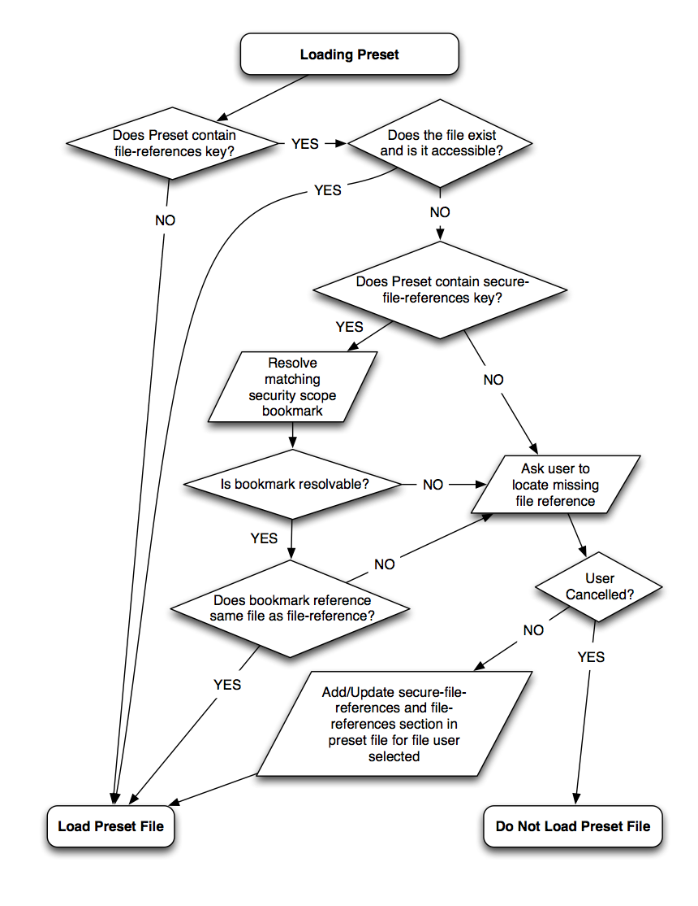

> 导航：[总目录](../../README.md) · [technotes](../../_indexes/technotes.md)


Technical Note TN2312

# Audio Unit Host Sandboxing Guide

This technical note provides an overview of the changes that an Audio Unit Host application needs to make in order to adopt the App Sandbox.

These changes include the following:

- Adding the appropriate entitlements
- Migrating to the Audio Component API
- Checking to see if Audio Units are Sandbox Safe
- Preflighting Audio Components using `AudioComponentCopyConfigurationInfo`
- Writing and resolving Security-scoped bookmarks in AUPreset Files and Application documents

[Prerequisites](#apple-f4xwc4dqnrsv64tfmyxwi33df52wszbpirkfgnbqgaytgmztguwugsbrfviferksivivksktjfkekuy)[Entitlements and System Resource Access](#apple-f4xwc4dqnrsv64tfmyxwi33df52wszbpirkfgnbqgaytgmztguwugsbrfvke4vcbi4yq)[Using the Audio Component API](#apple-f4xwc4dqnrsv64tfmyxwi33df52wszbpirkfgnbqgaytgmztguwugsbrfvke4vcbi4za)[Checking to see if an Audio Unit is Sandbox-Safe](#apple-f4xwc4dqnrsv64tfmyxwi33df52wszbpirkfgnbqgaytgmztguwugsbrfvke4vcbi4zq)[Preflighting Audio Components](#apple-f4xwc4dqnrsv64tfmyxwi33df52wszbpirkfgnbqgaytgmztguwugsbrfvke4vcbi42a)[Persistent File Access](#apple-f4xwc4dqnrsv64tfmyxwi33df52wszbpirkfgnbqgaytgmztguwugsbrfvke4vcbi43a)[Loading Audio Unit Preset Files](#apple-f4xwc4dqnrsv64tfmyxwi33df52wszbpirkfgnbqgaytgmztguwugsbrfvke4vcbi43q)[Writing Audio Unit Presets](#apple-f4xwc4dqnrsv64tfmyxwi33df52wszbpirkfgnbqgaytgmztguwugsbrfvke4vcbi44a)[Saving and Restoring Application Documents](#apple-f4xwc4dqnrsv64tfmyxwi33df52wszbpirkfgnbqgaytgmztguwugsbrfvke4vcbi44q)[Document Revision History](#apple-f4xwc4dqnrsv64tfmyxwi33df52wszbpirkfgnbqgaytgmztguwvezlwnfzws33ojbuxg5dpoj4s2rdpnz2ey2lonncwyzlnmvxhiskel4yq)

## Prerequisites

Before reading this document, you should familiarize yourself with the following documents which explain general App Sandbox concepts and provide specific information about Audio Units in a sandboxed environment:

- [App Sandbox Design Guide](https://developer.apple.com/library/mac/#documentation/Security/Conceptual/AppSandboxDesignGuide/AboutAppSandbox/AboutAppSandbox.html#//apple_ref/doc/uid/TP40011183-CH1-SW1)
- [Enabling App Sandbox](https://developer.apple.com/library/mac/#documentation/Miscellaneous/Reference/EntitlementKeyReference/Chapters/EnablingAppSandbox.html#//apple_ref/doc/uid/TP40011195-CH4-SW1)
- [App Sandbox Entitlement Keys](https://developer.apple.com/library/mac/#documentation/Miscellaneous/Reference/EntitlementKeyReference/Chapters/EnablingAppSandbox.html#//apple_ref/doc/uid/TP40011195-CH4-SW1)
- [Enumerating Sandbox Safe Audio Components](https://developer.apple.com/library/mac/technotes/tn2247/_index.html#//apple_ref/doc/uid/DTS40012567-CH1-HOSTING_AUDIO_COMPONENTS_IN_A_SANDBOXED_APPLICATION)
- [Testing your custom Audio Unit in a sandboxed environment](https://developer.apple.com/library/mac/#qa/qa1483/_index.html)
- [Audio Components and the Application Sandbox](https://developer.apple.com/library/mac/#technotes/tn2247/_index.html)

[Back to Top](#)

## Entitlements and System Resource Access

An Audio Unit host needs access to specific system resources in order to open Audio Units, use MIDI, and read and write files. The Sandboxed host needs to declare its intentions to perform these actions via an entitlement.

An entitlement is a key-value pair that identifies a specific capability, such as the capability to use a built-in microphone, and is specified in a .entitlements property list file in Xcode.

Common entitlements that you may want to add to your sandboxed AU host application:

__Table 1__  Common Entitlements

| Entitlement | Purpose |
| com.apple.security.temporary-exception.audio-unit-host | Allows opening of Audio Units that are not sandbox-safe |
| com.apple.security.files.user-selected.read-write | Enables reading and writing of user selected files |
| com.apple.security.files.bookmarks.document-scope | Enables reading and writing of document-scope security bookmarks |
| com.apple.security.files.bookmarks.app-scope | Enables reading and writing of application-scope security bookmarks |
| com.apple.security.temporary-exception.mach-lookup.global-name | Enables MIDI (Type is an array of two string values). See Table 2. |

__Table 2__  com.apple.security.temporary-exception.mach-lookup.global-name Array String Values

| String Values | Notes |
| com.apple.midiserver | Required |
| com.apple.midiserver.io | Optional |

When you add the `com.apple.security.temporary-exception.audio-unit-host entitlement`, you gain the ability to load Audio Units that are not sandbox-safe (more on this later). When a non-sandbox-safe Audio Unit is loaded, the system will show the user a dialog indicating that the process is attempting to open an Audio Component that isn’t Sandbox Safe.

__Important:__ Using the com.apple.security.temporary-exception.audio-unit-host key can cause the system to disable the host application's sandbox completely. It is therefore important to understand the ramifications of using this key in a sandbox compatibility testing scenario. See [Audio Components and the Application Sandbox](https://developer.apple.com/library/mac/#technotes/tn2247/_index.html%23//apple_ref/doc/uid/DTS40012567) for more information.

For more information on entitlements see: [Entitlements and System Resource Access](https://developer.apple.com/library/mac/#documentation/Security/Conceptual/AppSandboxDesignGuide/AppSandboxInDepth/AppSandboxInDepth.html#//apple_ref/doc/uid/TP40011183-CH3-SW1)

[Back to Top](#)

## Using the Audio Component API

Audio Unit Host applications that run in an App Sandbox must migrate to the AudioComponent API and can no longer rely on the Component Manager to query, load, or manipulate components. Only Audio Component Plug-ins can declare themselves safe to open in a sandboxed process. All Component Manager components are assumed to be unsafe.

[Back to Top](#)

## Checking to see if an Audio Unit is Sandbox-Safe

Audio Unit Hosts may need to check if an Audio Unit is Sandbox-safe before attempting to open it. A “Sandbox Safe Audio Component” is defined to be an Audio Component that can function correctly in a process that has the most severely restricting Sandbox- preventing access to the file system, network, and drivers in the kernel.

A Sandbox Safe Audio Component will have the `kAudioComponentFlag_SandboxSafe` flag set in the componentFlags field of its AudioComponentDescription. If this flag is not present, the Audio Unit may not be sandbox-safe.

See Technical Note TN2247 for a code snippet on [Enumerating Sandbox Safe Audio Components](https://developer.apple.com/library/ios/#technotes/tn2247/_index.html).

[Back to Top](#)

## Preflighting Audio Components

Many applications build up a list of the various Audio Components and their capabilities. Since querying an Audio Component to find out what it does requires opening the Audio Component, this may cause the application’s sandbox to drop even if the application never uses any of the queried Audio Components.

To avoid dropping the application’s sandbox while querying components, the new `AudioComponentCopyConfigurationInfo` API can be used.

__Listing 1__  Checking to see if an AudioComponent has a custom view without opening it.

```
AudioComponentDescription delayDescription;

delayDescription.componentType = kAudioUnitType_Effect;
delayDescription.componentSubType = kAudioUnitSubType_Delay;
delayDescription.componentManufacturer = kAudioUnitManufacturer_Apple;

AudioComponent delayReference = AudioComponentFindNext(NULL, &delayDescription);
NSDictionary *configDictionary;
OSStatus result = AudioComponentCopyConfigurationInfo(delayReference, &((CFDictionaryRef)configDictionary));

if (result != noErr && configDictionary) {
    BOOL hasCustomView = [[configDictionary objectForKey:@kAudioUnitConfigurationInfo_HasCustomView] boolValue];

    NSLog(@“The delay effect %@ have a custom view”, hasCustomView ? @“does” : @“does not”);
}
```

For more information about this API, [see Technical Note TN2247](https://developer.apple.com/library/ios/#technotes/tn2247/_index.html).

[Back to Top](#)

## Persistent File Access

Audio Unit hosts manage loading, saving, and restoring Audio Unit presets as well as Audio Unit state stored in their document files. As sandboxed hosts have restrictions on file access, care must be taken to ensure that files can be saved and reopened with a minimum of user interaction across launches and even by other Sandboxed Audio Unit Hosts.

This is further complicated by the fact that Audio Units may need access to external files, for example, a sample-based Instrument or a reverb effect that uses impulse response files to model its environments. The following sections discuss in detail changes that the host needs to make in order to load and save Audio Unit preset files and documents, ensuring that any external references are loadable by the Audio Unit.

[Back to Top](#)

## Loading Audio Unit Preset Files

Audio Units that reference external files and need the host to manage their file access will have a section in their preset file in the following format:

```
<key>file-references</key>
<dict>
    <key>File 1</key>
    <string>/Users/Apple/Music/Samples/Boink.aiff</string>
</dict>
```

The file-references dictionary contains one or more key-value pairs where the value is the path to the file that needs to be accessed. If an Audio Unit Preset File does not contain this key, the host does not need to do any additional work.

In the above example, the file is accessible if the host has an entitlement to access the user’s Music folder. The host can load the AUPreset file since it has access to the file-reference used in the preset and by extension, so will the Audio Unit.

If however, the file system location is outside of the hosts’ container or in a location that is not accessible via an entitlement (such as on the desktop or an external volume), the host would have to ask permission from the user to access the file by going through Powerbox. See [App Sandbox Design Guide](https://developer.apple.com/library/mac/#documentation/Security/Conceptual/AppSandboxDesignGuide/AboutAppSandbox/AboutAppSandbox.html#//apple_ref/doc/uid/TP40011183-CH1-SW1) for more information.

As this extra level of user interaction every time the preset is loaded may be undesirable to the user, the preset file has a standard mechanism for persistent secure file access. An additional key, file-secure-references, contains a dictionary that is similar to the file-references dictionary except that the value holds an NSData object that is a document-scoped security bookmark for the file specified by the key.

```
<key>file-secure-references</key>
<dict>
    <key>File 1</key>
    <data>
        Ym9va9AC1THISISNOTVALIDDATAiVEKsUkH83gyyVB11mwqxk2XWd7RiOVDs
        ...
        DAgBAAAAAAAAEcAAABQAAAAAAAAAEsAAABgBAAAAAAAAENAAAKgBAAAAAAAA
    </data>
</dict>
```

If this key is present in the preset dictionary, the host can resolve the URL using [CFURLCreateByResolvingBookmarkData](https://developer.apple.com/library/mac/#documentation/CoreFoundation/Reference/CFURLRef/Reference/reference.html#//apple_ref/c/func/CFURLCreateByResolvingBookmarkData) and passing the URL to the preset file as the relativeToURL parameter. Note that a specific entitlement is required to be able to create security-scoped bookmarks.

__Figure 1__



The host should verify that the URL that is resolved in the bookmark data refers to the same file that is contained in the file-references dictionary with the matching key. If these differ, then the host should assume that the bookmark is stale and ask the user for permission to access the file (via a standard file dialog). If the user grants permission to access the file, the host should update the secure-file-references section with a newly created document-scoped bookmark based on the file the user has chosen in order to ensure persistent access to the file. The host should also update the file-references path entry if the user selects a different file.

__Important:__ For backwards compatibility, Audio Units will only ever read the file-references section of a preset file and it is the responsibility of the Host to keep it up to date and to ensure the path is accessible.

Document-scoped bookmarks can only reference a single file, not a directory. The user will have to individually grant access to every single file used by the preset. That is why it is very important to store document-scoped bookmarks for each file so the user only has to grant access the first time the preset file is used.

[Back to Top](#)

## Writing Audio Unit Presets

The Host application needs to ensure that any newly created AUPreset files have a corresponding file-secure-references section for any file-references entries with valid document-scoped bookmarks. The document-scoped bookmark can be created by using either [CFURLCreateBookmarkData](https://developer.apple.com/library/mac/#documentation/CoreFoundation/Reference/CFURLRef/Reference/reference.html%23//apple_ref/c/func/CFURLCreateBookmarkData) or the corresponding methods in [NSURL](https://developer.apple.com/library/mac/#documentation/Cocoa/Reference/Foundation/Classes/NSURL_Class/Reference/Reference.html).

[Back to Top](#)

## Saving and Restoring Application Documents

Application documents contain the saved state of every Audio Unit in its graph and they may also contain references to audio files. As with Audio Unit Presets, the host application is responsible for creating security-scoped bookmarks for each of these items that are outside of its accessible file-system so that documents can be reopened without user interaction. The bookmarks should be application-scoped as these files do not need to be opened by other hosts.

[Back to Top](#)

---

#### Document Revision History

| __Date__ | __Notes__ |
| 2014-03-06 | Fixed bad URLs. |
| 2013-05-16 | New document that this guide provides an overview of the changes that an Audio Unit Host application needs to make in order to adopt the App Sandbox. |

