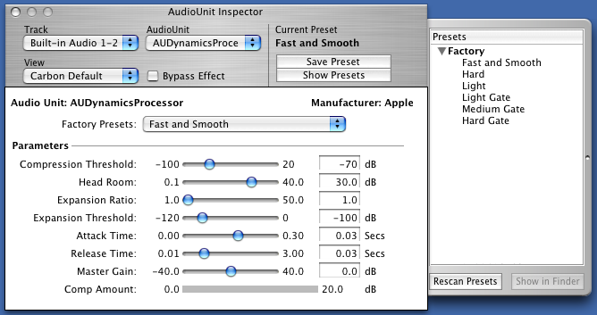
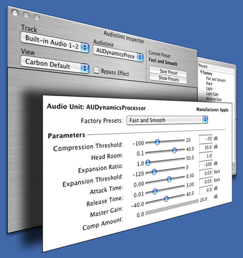

> 导航：[总目录](../../README.md) · [technotes](../../_indexes/technotes.md)


# Retired Document

__Important:__
This document may not represent best practices for current development. Links to downloads and other resources may no longer be valid.

Technical Note TN2213

# Audio Units: Embedding a Carbon View in a Cocoa Window

__Important:__ This document may not represent best practices for current development. Links to downloads and other resources may no longer be valid.

Now that Audio Units support both Cocoa and Carbon custom views, Audio Unit host applications should support both kinds of views in order to provide a complete user experience.

[Introduction](#apple-f4xwc4dqnrsv64tfmyxwi33df52wszbpirkfgmjqgaydinjwhewugsbrfveu4vcsj5cfkq2ujfhu4)[Process](#apple-f4xwc4dqnrsv64tfmyxwi33df52wszbpirkfgmjqgaydinjwhewugsbrfvifet2divjvg)[Managing Carbon/Cocoa Window Activation](#apple-f4xwc4dqnrsv64tfmyxwi33df52wszbpirkfgmjqgaydinjwhewugsbrfvguctsbi5eu4r27inaveqspjzpugt2dj5av6v2jjzce6v27ifbviskwifkest2o)[Managing Carbon/Cocoa Window Resizing](#apple-f4xwc4dqnrsv64tfmyxwi33df52wszbpirkfgmjqgaydinjwhewugsbrfvguctsbi5eu4r27inaveqspjzpugt2dj5av6v2jjzce6v27kjcvgsk2jfheo)[References](#apple-f4xwc4dqnrsv64tfmyxwi33df52wszbpirkfgmjqgaydinjwhewugsbrfvjekrsfkjcu4q2fkm)[Document Revision History](#apple-f4xwc4dqnrsv64tfmyxwi33df52wszbpirkfgmjqgaydinjwhewvezlwnfzws33ojbuxg5dpoj4s2rdpnz2ey2lonncwyzlnmvxhiskel4yq)

## Introduction

Using Cocoa's parent-child window relationships (WindowGroups in Carbon) creatively, we can provide the illusion of supporting a Carbon view in a Cocoa window, or of supporting a Cocoa view in a Carbon window. This document details the implementation of carbon view support in a cocoa inspector window.

__Figure 1__  A Cocoa window hosting the Carbon view



Figure 1 shows the Carbon view contained in a shadowless, plain Carbon window that is exactly the size of the Carbon view it contains. Its window is linked to the owning Cocoa window.

__Figure 2__  Illustration of how the windows are stacked



Figure 2 shows that the Cocoa Window contains a navigation toolbar and a drawer.

[Back to Top](#)

## Process

This hybrid, embedded view is created using Cocoa's NSWindow class and Carbon's Window Manager. There's a good deal of functionality overlap between the two (i.e., the Window Manager can be used to manipulate Cocoa windows to some degree, and the NSWindow API can be used to manipulate Carbon windows to some degree.) If your hosting application is written with Carbon APIs, feel free to lean more heavily on the Window Manager equivalents of the Cocoa calls indicated.

Here are the steps required to configure your windows in a parent/child relationship:

1. Create your Cocoa and Carbon windows:

   ```
   NSWindow *owningCocoaWindow;
   WindowRef ownedCarbonWindow;
   ```
2. Position the Carbon window so that it is aligned with the Cocoa window the way you want using:

   ```
   void MoveWindow (short x, short y);
   void SizeWindow (short width, short height);
   ```
3. Wrap your Carbon window in Cocoa:

   ```
   NSWindow *wrappedCarbonWindow = [[NSWindow alloc] initWithWindowRef:ownedCarbonWindow];
   ```
4. Establish the parent-child relationship:

   ```
   [owningCocoaWindow addChildWindow:wrappedCarbonWindow ordered:NSWindowAbove];
   ```

   This will "lock" the child window to the parent window. Moving the parent window will move the child window as if they are the same entity.

   __Important:__ Child windows can be moved independently of the parent. Consequently, using textured windows, or windows with titlebars can present UI difficulties.

When you want to remove the Carbon view, first end the parent-child relationship: `[owningCocoaWindow removeChildWindow:wrappedCarbonWindow];` and then close or hide the window, relinquishing resources as normal.

[Back to Top](#)

## Managing Carbon/Cocoa Window Activation

When a Carbon window is the child of a Cocoa window, there can be activation issues. For example, when a window is not active and the user clicks on the Carbon window, the Carbon child window becomes active without activating its parent. This results in a strange appearance because the window still appears inactive even though the user clicked in the content.

Your application can choose to use a floating window to alleviate some of these problems, but you may still have some activation problems that you need to address.

There are two ways of solving this problem. The most straightforward, is to tell the Window Manager not to update the activation state of the window. You may do this by calling:

```
 OSStatus result = SetWindowActivationScope( ownedCarbonWindow, kWindowActivationScopeNone);
```

You then register to listen to the `NSWindowDidBecomeMainNotification` and the `NSWindowDidResignMainNotification` notifications on the Cocoa window. When you receive the notification, activate or deactivate the Carbon window as appropriate:

```
 ActivateWindow(ownedCarbonWindow, [(NSWindow *)[notification object] isMainWindow]);
```

Alternatively, install a Carbon Event handler on the Carbon child window. This activates the parent window when the Carbon child window gets activated.

This is accomplished by using the Carbon Event Manager API:

1. Install a Carbon Event handler.

   ```
   EventHandlerRef 	mCarbonEventHandlerRef; // Keep this variable as a data member of your parent window.
                                                              // It needs to be valid as long as the window is visible

       EventTypeSpec	windowEventTypes[] = {
           {kEventClassWindow, kEventWindowGetClickActivation },
           {kEventClassWindow, kEventWindowHandleDeactivate }
       };

       EventHandlerUPP   ehUPP = NewEventHandlerUPP(CarbonWindowEventHandler);
       OSStatus result = InstallWindowEventHandler( ownedCarbonWindow, ehUPP,
                                            sizeof(windowEventTypes) / sizeof(EventTypeSpec),
                                             windowEventTypes, self, &mCarbonWindowHandlerRef );
   ```
2. Once you have installed the Carbon Event handler, handle those two events:

   ```
   pascal OSStatus CarbonWindowEventHandler(EventHandlerCallRef nextHandlerRef,
                                                      EventRef event, void *userData)
       {
           UInt32      eventKind = GetEventKind(event);
           switch (eventKind) {
               case kEventWindowHandleDeactivate:
                   // don't allow window to get deactivated while app is active
                   // (do this only if you are a floating window that doesn't hide)
                   ActivateWindow(ownedCarbonWindow, TRUE);
                   return noErr;

               case kEventWindowGetClickActivation:
                   ClickActivationResult howToHandleClick = kActivateAndHandleClick;
                   SetEventParameter(event, kEventParamClickActivation, typeClickActivationResult,
                               sizeof(ClickActivationResult), &howToHandleClick);
                   return noErr;
           }
           return eventNotHandledErr;
       }
   ```

__Important:__ You must remove your Carbon Event handler in the windowWillClose: delegate method of your Cocoa window before you remove the child Carbon window from its parent: `RemoveEventHandler(mCarbonWindowHandlerRef);`

If you do not use a floating window, you must handle application activation and deactivation. To do this, install an application event handler:

1. Install an application [De]Activation Carbon event handler.

   ```
   EventHandlerRef applicationHandlerRef;

       EventTypeSpec   applicationEventTypes[] = {
           {kEventClassApplication, kEventAppActivated },
           {kEventClassApplication, kEventAppDeactivated }
       };

       EventHandlerUPP ehUPP = NewEventHandlerUPP(CarbonApplicationEventHandler);
       OSStatus result = InstallApplicationEventHandler( ehUPP,
                                                         sizeof(applicationEventTypes) / sizeof(EventTypeSpec),
                                                         applicationEventTypes, self, & applicationHandlerRef ));
   ```
2. Once you have installed the event handler, handle those two events:

   ```
   pascal OSStatus CarbonApplicationEventHandler (EventHandlerCallRef nextHandlerRef,
                                                            EventRef event, void *userData)
       {
           UInt32      eventKind = GetEventKind(event);

           switch (eventKind) {
               case kEventAppActivated:
                   ActivateWindow(ownedCarbonWindow, TRUE);
                   return noErr;
               case kEventAppDeactivated:
                   ActivateWindow(ownedCarbonWindow, FALSE);
                   return noErr;

               default:
                   // pass-thru all kEventClassApplication events we're not interested in.
                   break;
           }
           return eventNotHandledErr;
       }
   ```
3. You need to do something similar for the Cocoa window when its child Carbon window receives an activation notification:

   ```objc
   - (void)applicationDidBecomeActiveNotification:(NSNotification *)inNotification
       {
           if (ownedCarbonWindow)
               ActivateWindow(ownedCarbonWindow, TRUE);
       }

       - (void)windowDidBecomeKey:(NSNotification *)inNotification
       {
           [NSApp activateIgnoringOtherApps:YES];

           if (ownedCarbonWindow)
               ActivateWindow(ownedCarbonWindow, TRUE);
       }
   ```

As you did previously, remove your event handler in your windowWillClose: delegate method: `RemoveEventHandler(applicationHandlerRef);`

Keep in mind that this source code is simplified. Your application must ensure that when `ActivateWindow` is called from within the application event handler, the event is not processed in the window event handler. We recommend setting a flag whenever `ActivateWindow` is called on the Carbon window. Then in the event handler, you can return `noErr` if that flag is set. This prevents the Carbon event handler from processing the event twice.

[Back to Top](#)

## Managing Carbon/Cocoa Window Resizing

The advantage of installing a Carbon event handler to handle activation is that it also allows you to handle window resizing in the same manner. If the Carbon view resizes itself in response to user interaction (ie, to expand its window in response to the user clicking on a disclosure triangle), the well-behaved host needs to resize the parent Cocoa view as well.

This is accomplished by installing a control event handler:

```
EventTypeSpec   controlEventTypes[] = {
        {kEventClassControl, kEventControlBoundsChanged }
    };
```

You must install a control event handler on the Carbon window (you may pass the object that needs to handle the resizing in the user info parameter):

1. Install a control bounds changed Carbon event handler.

   ```
   EventHandlerRef carbonEventHandlerRef;
   EventTypeSpec   controlEventTypes[] = {
   {kEventClassControl, kEventControlBoundsChanged }
   };

   verify_noerr (InstallControlEventHandler(rootCarbonControl, NewEventHandlerUPP(CarbonEventHandler),
                                                      sizeof(controlEventTypes) / sizeof(EventTypeSpec),
                                                      controlEventTypes, owningCocoaWindow,
                                                      &carbonEventHandlerRef));
   ```
2. Add a new case to your handler for the control event class:

   ```
   pascal OSStatus CarbonEventHandler (EventHandlerCallRef nextHandlerRef, EventRef event, void *userData)
       {
           NSInspectorWindow   *cocoaWindow = (NSInspectorWindow *)userData;
           ControlRef           control;
           UInt32               eventKind = GetEventKind(event);

           GetEventParameter(event, kEventParamDirectObject, typeControlRef,
                                       NULL, sizeof(control), NULL, &control);
           switch (eventKind) {
               case kEventControlBoundsChanged:
                   [cocoaWindow performSelectorOnMainThread:@selector(fitCarbonWindowToParentWindow)
                                                             withObject:nil waitUntilDone:YES];
                   err = noErr;
                   break;
               default:
                   break; // pass-thru all kEventClassControl events we're not prepared for.
               }
           }
           return eventNotHandledErr;
       }
   ```

In your `fitCarbonWindowToParentWindow` method, you can resize both windows in order to accommodate the new size of the Carbon control. It's generally a good idea to remove the child Carbon window from its parent before you do any resizing. Glue the windows back together again when you are done moving and resizing them. Although it is fairly straightforward, the implementation of this may vary based on the contents of the host window and are therefore best left as an exercise to the reader.

Don't forget to remove the event handler when your window closes: `RemoveEventHandler(carbonEventHandlerRef);`

Like the activation code, this code is a bit simplified. Note that you may need to add a flag that you can access in your Carbon event handler that lets you know when you are in the process of manually resizing your Carbon window. This flag allows you to ignore your `kEventControlBoundsChanged` event to avoid getting caught in an infinite loop.

[Back to Top](#)

## References

- [Core Audio Overview](https://developer.apple.com/mac/library/documentation/MusicAudio/Conceptual/CoreAudioOverview/Introduction/Introduction.html)
- [Audio Unit Programming Guide](https://developer.apple.com/documentation/MusicAudio/Conceptual/AudioUnitProgrammingGuide/index.html)
- [CoreAudio Mailing List](http://lists.apple.com/mailman/listinfo/coreaudio-api)
- [Cocoa in Carbon Sample Code](https://developer.apple.com/samplecode/CocoaInCarbon/)
- [Carbon in Cocoa](https://developer.apple.com/documentation/Cocoa/Conceptual/CarbonCocoaDoc/CarbonCocoaDoc.html)

[Back to Top](#)

---

#### Document Revision History

| __Date__ | __Notes__ |
| 2010-06-04 | Fixed a bug with listing 2 in Activation section to now return eventNotHandledErr correctly. |
| 2008-02-29 | New document that carbon-Cocoa Integration for Audio Units |

