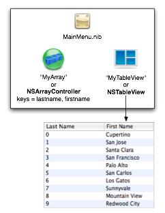

> 导航：[总目录](../../README.md) · [technotes](../../_indexes/technotes.md)


Technical Note TN2203

# Automatic Table Sorting with NSArrayController

Cocoa Bindings can be a powerful tool especially when it comes to important tasks like populating tables and sorting its data. If done in code, populating tables with data and sorting their contents can require a fair amount of work. Cocoa Bindings can eliminate the need for most, if not all, of that effort. This Tech Note shows how you can use Cocoa Bindings to automatically sort rows in an `NSTableView` with data provided by an `NSArrayController`.

[Introduction](#apple-f4xwc4dqnrsv64tfmyxwi33df52wszbpirkfgnbqgaytcobthawugsbrfvke4vcbi4yq)[Automatic Table Sorting](#apple-f4xwc4dqnrsv64tfmyxwi33df52wszbpirkfgnbqgaytcobthawugsbrfvke4vcbi4za)[Improvements to Mac OS X 10.5](#apple-f4xwc4dqnrsv64tfmyxwi33df52wszbpirkfgnbqgaytcobthawugsbrfveu2ucsj5lektkfjzkfgx2uj5pu2qkdl5hvgx2yl4ytaxzv)[Document Revision History](#apple-f4xwc4dqnrsv64tfmyxwi33df52wszbpirkfgnbqgaytcobthawvezlwnfzws33ojbuxg5dpoj4s2rdpnz2ey2lonncwyzlnmvxhiskel4yq)

## Introduction

In our example, we have an `NSTableView` with two `NSTableColumn` objects bound to an `NSArrayController` named "MyArray". The `NSArrayController` has its Class set to `NSMutableDictionary`, with Keys set to `lastname`, `firstname`. Each `NSTableColumn` has the following bindings as shown in Table 1.

__Table 1__  `NSTableColumn` Bindings

| Column | Bound To | Controller Key | Model Key Path |
| Last Name | "MyArray" | arrangedObjects | lastname |
| First Name | "MyArray" | arrangedObjects | firstname |

__Figure 1__  Nib Layout



When the table is first loaded and displayed you can tell the table view how to sort the data. Use the following in Listing 1 to make the table initially sorted by Last Name. This code should reside in your controller object that owns the table view as an outlet, typically inside `awakeFromNib`.

__Listing 1__  Initially Sorting the Table View.

```
[myTableView setSortDescriptors:
    [NSArray arrayWithObject:
        [[[NSSortDescriptor alloc] initWithKey:@"lastname" ascending:YES] autorelease]]];
```

Users will then be able to freely sort the table by clicking on each `NSTableColumn` title.

[Back to Top](#)

## Automatic Table Sorting

When users add more names to the table the list then appears out of order. What should be done to keep the given sort order when additional names are added to the table? This is where the `NSSortDescriptor` object bound to an `NSArrayController` comes in handy.

You need to bind your `NSArrayController` to a set of `NSSortDescriptor` objects. This can be done by providing a controller object that implements a method to return an `NSArray` of `NSSortDescriptor` objects.

__Listing 2__  Controller object that returns NSSortDescriptors

```objc
@implementation MyControllerObject

- (NSArray *)sortDescriptors
{
    return [myTableView sortDescriptors];
}

//...

@end
```

Then you can bind your `NSArrayController` to "MyControllerObject", Model Key Path = `sortDescriptors`.

Even given this binding, objects are not kept sorted when newly inserted. This is perhaps even more confusing when the column headings indicate the sorting has been done. Why is this? We've put sorting completely in the hands of the array controller. The good news is that all we need to do is to tell it to take notice and call rearrangeObjects.

`[myArrayController rearrangeObjects];`

Listing 3 is an example showing how to add a new name to the `NSArrayController`.

__Listing 3__  Adding a name to the `NSArrayController`

```
NSMutableDictionary *dict = [NSMutableDictionary dictionaryWithObjectsAndKeys:
                                     @"Sally", @"firstname",
                                     @"Sixpack", @"lastname",
                                     nil];
[myArrayController addObject: dict];
[myArrayController rearrangeObjects];
```

[Back to Top](#)

## Improvements to Mac OS X 10.5

Thanks to the addition of the "Auto Rearrange Objects" feature of `NSArrayController` for 10.5, you no longer have to call:

`[myArrayController rearrangeObjects];`

To use the "Auto Rearrange Objects" feature either:

1. Set the "Auto Rearrange Objects" checkbox for your `NSArrayController` in Interface Builder.
2. Call `[myArrayController setAutomaticallyRearrangesObjects:YES];` in your code.

Names added to the array controller will automatically be sorted with the rest of the list.

[Back to Top](#)

---

#### Document Revision History

| __Date__ | __Notes__ |
| 2012-02-22 | New document that shows how you can use Cocoa bindings to automatically sort rows in an NSTableView. |

