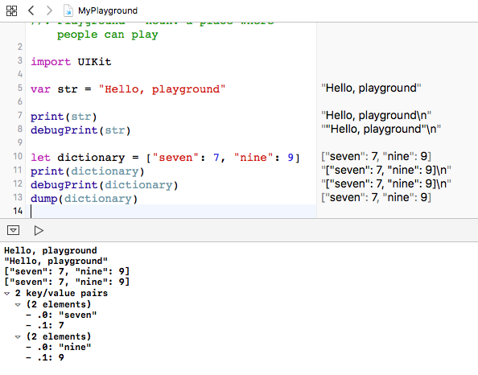
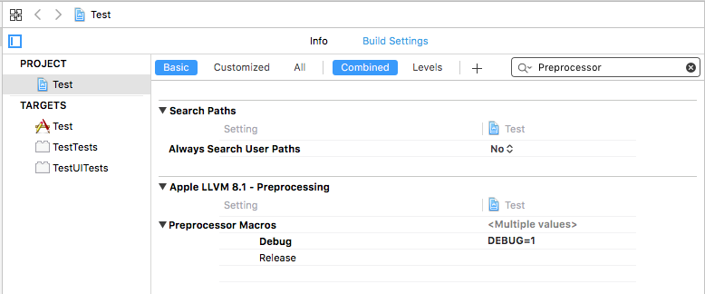

> 导航：[总目录](../../README.md) · [technotes](../../_indexes/technotes.md)


Technical Note TN2347

# Basic debugging using logging for Swift and Objective-C apps.

Displaying log messages in the system console while running your application is one of the oldest debugging mechanisms available. Using logging, you can generate a transcript describing the operations being performed by your application that you can review long after your application has finished running. Also, while your application is running, you can observe log messages being generated and written to the console as the events in your app they describe are taking place. As a developer, you are in complete control of the text and information displayed in the console by `NSLog`. Logging can reveal even the toughest to find problems in an app.

This document talks about practical considerations about the `NSLog` function and the DEBUG preprocessor macro that are helpful for debugging.

[Logging in Swift](#apple-f4xwc4dqnrsv64tfmyxwi33df52wszbpirkfgnbqgaytinjrgywugsbrfvke4vcbi5jtc)[NSLog examples](#apple-f4xwc4dqnrsv64tfmyxwi33df52wszbpirkfgnbqgaytinjrgywugsbrfvke4vcbi5hdc)[Where to find NSLog's output](#apple-f4xwc4dqnrsv64tfmyxwi33df52wszbpirkfgnbqgaytinjrgywugsbrfvke4vcbi4yq)[How to call NSLog](#apple-f4xwc4dqnrsv64tfmyxwi33df52wszbpirkfgnbqgaytinjrgywugsbrfvee6v27krhv6q2bjrgf6tstjrhuo)[Simple example](#apple-f4xwc4dqnrsv64tfmyxwi33df52wszbpirkfgnbqgaytinjrgywugsbrfvee6v27krhv6q2bjrgf6tstjrhuolktjfgvatcfl5cvqqknkbgek)[Advanced details](#apple-f4xwc4dqnrsv64tfmyxwi33df52wszbpirkfgnbqgaytinjrgywugsbrfvee6v27krhv6q2bjrgf6tstjrhuolkbirlectsdivcf6rcfkraustct)[Good things to include in your logs](#apple-f4xwc4dqnrsv64tfmyxwi33df52wszbpirkfgnbqgaytinjrgywugsbrfvke4vcbi5bq)[Logic and branching](#apple-f4xwc4dqnrsv64tfmyxwi33df52wszbpirkfgnbqgaytinjrgywugsbrfvke4vcbi5da)[Unique and easy to find text patterns](#apple-f4xwc4dqnrsv64tfmyxwi33df52wszbpirkfgnbqgaytinjrgywugsbrfvke4vcbi5dq)[Variable and property values](#apple-f4xwc4dqnrsv64tfmyxwi33df52wszbpirkfgnbqgaytinjrgywugsbrfvke4vcbi5cq)[Who is being called?](#apple-f4xwc4dqnrsv64tfmyxwi33df52wszbpirkfgnbqgaytinjrgywugsbrfvke4vcbi5ca)[Log a backtrace of your stack!](#apple-f4xwc4dqnrsv64tfmyxwi33df52wszbpirkfgnbqgaytinjrgywugsbrfvke4vcbi5aq)[The DEBUG preprocessor macro](#apple-f4xwc4dqnrsv64tfmyxwi33df52wszbpirkfgnbqgaytinjrgywugsbrfvkeqrk7ircuevkhl5iferkqkjhugrktknhvex2nifbvety)[The DEBUG preprocessor macro in Xcode](#apple-f4xwc4dqnrsv64tfmyxwi33df52wszbpirkfgnbqgaytinjrgywugsbrfvkeqrk7ircuevkhl5iferkqkjhugrktknhvex2nifbvetznkreekx2eivbfkr27kbjekucsj5buku2tj5jf6tkbinje6x2jjzpvqq2pircq)[More is better, really](#apple-f4xwc4dqnrsv64tfmyxwi33df52wszbpirkfgnbqgaytinjrgywugsbrfvgu6usfl5evgx2civkfirksl5pverkbjrgfs)[NSLog is everyone's friend](#apple-f4xwc4dqnrsv64tfmyxwi33df52wszbpirkfgnbqgaytinjrgywugsbrfvke4vcbi5ba)[Additional Resources](#apple-f4xwc4dqnrsv64tfmyxwi33df52wszbpirkfgnbqgaytinjrgywugsbrfvke4vcbi4zq)[Document Revision History](#apple-f4xwc4dqnrsv64tfmyxwi33df52wszbpirkfgnbqgaytinjrgywvezlwnfzws33ojbuxg5dpoj4s2rdpnz2ey2lonncwyzlnmvxhiskel4yq)

## Logging in Swift

Swift provides a default debugging textual representation that you can use for printing any type. The print(_:) or debugPrint(_:) functions can be used to log output from your app to the console for any data type. As shown in Figure 1, the debugPrint(_:) function will sometimes display additional information and the dump(_:) function will use the object's mirror to print information to standard output.

__Figure 1__  Example showing logging in Swift using the debugPrint(_:) and dump(_:) functions.



For more information about the debugPrint(_:) function, see [Standard Swift Library API Reference: debugPrint(_:separator:terminator:to:)](https://developer.apple.com/reference/swift/1641201-debugprint).

To override the default representation used for logging your custom data types using the the debugPrint(_:) function, you can make your custom data types conform to the CustomDebugStringConvertible protocol. For more information about the CustomDebugStringConvertible protocol, see [Standard Swift Library API Reference: CustomDebugStringConvertible](https://developer.apple.com/reference/swift/customdebugstringconvertible).

The remainder of this document discuses the `NSLog` function, however many of the same strategies discussed apply to apps written using the Swift language.

[Back to Top](#)

## NSLog examples

Here is an example of what a call to `NSLog` looks like:

```
NSString *message = @"test message";

NSLog( @"Here is a test message: '%@'", message );
```

and, for the above statement, the console output would appear as follows:

```
Here is a test message: 'test message'
```

It's really just that simple! And, at this point in this document, you now have enough information to start using `NSLog` to debug your app. But, you should continue to read on: the remainder of this document adds additional details that you can use to empower yourself to use logging more effectively in your projects.

This document is appropriate for all iOS and macOS developers. It assumes the reader is using Xcode, is acquainted with the Objective-C language, and understands the basics of using the C language preprocessor.

[Back to Top](#)

## Where to find NSLog's output

The Foundation framework's `NSLog` function is available in every version of iOS and macOS. As such, you can rely on it being available for your debugging purposes on any Apple platform where your app will run. `NSLog` outputs messages to the Apple System Log facility or to the Console app (usually prefixed with the time and the process id). Many of the system frameworks use `NSLog` for logging exceptions and errors, but there is no requirement to restrict its usage to those purposes. It is also perfectly acceptable to use `NSLog` for outputting variable values, parameters, function results, stack traces, and other information so you can see what is happening in your code at runtime.

Console output can appear in a number of places including (but not limited to) Xcode and the Console app. For more information about finding the console output from your app's calls to `NSLog`, please see [Technical Q&A QA1747: Debugging Deployed iOS Apps](https://developer.apple.com/library/ios/qa/qa1747/_index.html).

[Back to Top](#)

## How to call NSLog

The Foundation framework's `NSLog` function operates just like the standard C library `printf` function, the big difference being that the format string is specified as a "`NSString *`" typed value instead of a C-style string.

### Simple example

Here is an example showing how to call `NSLog`:

```
NSString *outputData = @"The quick brown fox jumps over a lazy dog!";

NSLog( @"text: %@", outputData );

/* Comment:

    @"text: %@" - is the printf style formatting template for output (an NSString *)

    outputData - refers to to the text we wish to display (also an NSString *)

*/
```

And, here is how the output will appear:

```
text: The quick brown fox jumps over a lazy dog!
```

### Advanced details

The definition for the `NSLog` function appears as follows:

```
void NSLog(NSString *format, ...);
```

Note the first parameter is a formatting string and it can contain special substitution tokens that imply additional arguments are expected after that. If care and attention is not taken to ensure that the contents of the format string match up with the remaining arguments, your app may crash (or, at the very least, it will output unusable data to the console).

Like the `printf` function, `NSLog` uses substitution tokens; however, there is one additional substitution token available in Objective-C, `%@`, used to indicate that its corresponding parameter should be an Objective-C object.

In addition to the `%@` substitution token, all of the regular `printf` style substitution tokens are available for your use. For more information about the substitution tokens used by `NSLog` see the "[String Format Specifiers](https://developer.apple.com/library/ios/documentation/Cocoa/Conceptual/Strings/Articles/formatSpecifiers.html#//apple_ref/doc/uid/TP40004265-SW1)" section of the "[String Programming Guide](https://developer.apple.com/library/ios/documentation/Cocoa/Conceptual/Strings/introStrings.html)".

[Back to Top](#)

## Good things to include in your logs

Logging allows you to create a transcript describing the operation of your application that you can later analyze at your leisure. As such, you want to include as much useful information in your logs as possible so that it is easier for you to really see what is happening as your app runs. Here are some items that are commonly included in logs with some explanation:

### Logic and branching

Adding logging statements inside of the logic of your code will help you understand which parts are being executed and which branches in your logic are being utilized. It is often useful to add many `NSLog` statements to especially complex sequences of code so you can better understand the flow of execution at runtime.

### Unique and easy to find text patterns

In every log statement, it is useful to include some unique and easy to find text pattern so if you do identify a problem in that log statement you can easily search through your source files and find its location.

### Variable and property values

Printing variable and property values at key places during the execution of your app will allow you to verify that those values are within acceptable bounds. Printing error messages in your logs that explicitly tell you when values are out of range will help you recognize these cases.

In addition to the `%@` substitution token, all of the regular `printf` style substitution tokens can be used in the formatting string. This will allow you to display many different kinds of values. For more information about the substitution tokens that can be used with `NSLog` see the "[String Format Specifiers](https://developer.apple.com/library/ios/documentation/Cocoa/Conceptual/Strings/Articles/formatSpecifiers.html#//apple_ref/doc/uid/TP40004265-SW1)" section of the "[String Programming Guide](https://developer.apple.com/library/ios/documentation/Cocoa/Conceptual/Strings/introStrings.html)".

__Note:__ The `printf` function offers a number of substitution tokens for printing numbers (%d, %ld, %f, %d, for example). As a convenience, you can use Objective-C's boxing capability to save time and avoid compiler warnings. For example, the following:

```
double myNumber = 7.7;
NSLog(@"number: %@", @(myNumber));
```

Will print:

```
number: 7.7
```

This technique works with all numeric types that the compiler is aware of (signed or unsigned integer or floating point numbers of any size - 8, 16, 32 or 64 bits), and will perform any necessary type coercions for you without generating any compiler warnings.

### Who is being called?

In analyzing the operation of your application, it may be critical for you to know the sequence in which calls are being made to functions or methods in your application. In these cases, it is a really good idea to add an `NSLog` statement near the beginning of your method and function definitions that simply prints out the name of the function:

```objc
- (void)pressButton:(id)sender
{
    NSLog( @"calling: %s", __PRETTY_FUNCTION__ );
    ....
```

Here, the pre-defined compile time variable `__PRETTY_FUNCTION__` (a C style string) is used to print the name of the function being called. This technique is especially useful when you are analyzing code using lots of delegates and you would like to understand the sequence in which calls are being made to your delegate's methods.

The above will print the following in the console:

```
calling: -[MyObjectClassName pressButton:]
```

__Note:__ The `__PRETTY_FUNCTION__` compile time variable and others like it are discussed in [Technical Q&A QA1669: Improved logging in Objective-C](https://developer.apple.com/library/mac/qa/qa1669/_index.html).

### Log a backtrace of your stack!

When examining crash logs, a stack backtrace is invaluable for figuring out the chain of events that led to any particular circumstance. When using `NSLog` for debugging, you can retrieve a copy of the current stack backtrace at any time by calling `NSThread`'s `-callStackSymbols` class method. The backtrace is returned as an `NSArray` of strings and you can use `NSLog` together with the `%@` substitution token to output the backtrace to the console:

```
NSLog(@"%@", [NSThread callStackSymbols]);
```

And, here is an example of what the output of the above statement looks like:

```
2014-04-30 18:44:30.075 AVCustomEdit[52779:60b] (
 0  AVCustomEdit      0x0000efa6 -[APLSimpleEditor buildCompositionObjectsForPlayback:] + 278
 1  AVCustomEdit      0x0000686e -[APLViewController viewDidAppear:] + 590
 2  UIKit             0x007a4099 -[UIViewController _setViewAppearState:isAnimating:] + 526
 3  UIKit             0x007a4617 -[UIViewController __viewDidAppear:] + 146
 4  UIKit             0x007a49aa -[UIViewController _executeAfterAppearanceBlock] + 63
 5  UIKit             0x0069f0d0 ___afterCACommitHandler_block_invoke_2 + 33
 6  UIKit             0x0069f055 _applyBlockToCFArrayCopiedToStack + 403
 7  UIKit             0x0069ee9a _afterCACommitHandler + 568
 8  CoreFoundation    0x029db2bf __CFRunLoopDoObservers + 399
 9  CoreFoundation    0x029b9254 __CFRunLoopRun + 1076
 10 CoreFoundation    0x029b89d3 CFRunLoopRunSpecific + 467
 11 CoreFoundation    0x029b87eb CFRunLoopRunInMode + 123
 12 GraphicsServices  0x0318b5ee GSEventRunModal + 192
 13 GraphicsServices  0x0318b42b GSEventRun + 104
 14 UIKit             0x00681f9b UIApplicationMain + 1225
 15 AVCustomEdit      0x000026bd main + 141
 16 libdyld.dylib     0x0269e701 start + 1
)
```

[Back to Top](#)

## The DEBUG preprocessor macro

In a nutshell, the DEBUG preprocessor macro acts like a switch that you can use to turn on or off different sections of your code. Specifically, the DEBUG macro is intended to be used to turn on and off different sections of your source code related to debugging. Xcode, by default, includes a definition for the DEBUG macro that is set to 1 for debug builds and 0 for release builds. And, you can take advantage of this to automatically include additional debugging and logging code in your debug builds.

Here is an example showing how the DEBUG macro can be used:

```objc
- (void)pressButton:(id)sender
{
#if DEBUG
    NSLog(@"preparing to press button!");
#endif
    [self prepareForButtonPress];

#if DEBUG
    NSLog(@"pressing button!");
#endif

    [self activatePressButtonSequence:self withCompletion:^{
#if DEBUG
        NSLog(@"button sequence complete.");
#endif
            [self buttonPowerDown];
        }];
    NSLog(@"This line has no DEBUG macro, so it gets printed in both debug and release builds!");
}
```

The debug build (with DEBUG==1) will produce the following output in the console:

```
preparing to press button!
pressing button!
button sequence complete.
This line has no DEBUG macro, so it gets printed in both debug and release builds!
```

The release build (with DEBUG==0) will produce the following output in the console:

```
This line has no DEBUG macro, so it gets printed in both debug and release builds!
```

__Note:__ `NSLog` can take time to execute and this will add additional overhead to the runtime of your application (especially if you add lots and lots of `NSLog` statements to your app). During testing, this normally isn't a problem. But, for your final shipping product, it is better to remove all of the logging so your customers can enjoy faster performance without the logging going on. Because of this, it is a common practice among developers to use the DEBUG preprocessor macro to conditionally compile your logging code so that it only appears in your debug builds (and does not ship to your final customers).

### The DEBUG preprocessor macro in Xcode

The preprocessor "DEBUG" macro is defined in all Xcode project templates for debug builds. Preprocessor macros are interpreted at compile time and the DEBUG preprocessor macro can be used to allow debug code to be run in debug builds of your project. If you aren't sure that your project has it defined, you can verify that this it is by selecting the project in Xcode and clicking on the build settings tab. Search for Preprocessing and make sure that DEBUG=1 is being defined for your debug builds (as shown bellow). If it isn't already defined in your project, you can add it. Preprocessor macros are case sensitive.

__Figure 2__  The DEBUG preprocessor macro setting in an Xcode project.

[Back to Top](#)

## More is better, really

If you are debugging your app and you have added logging, but you continue to be eluded by the problem you are trying to find, then you haven't added enough logging. Continue adding logging to your app until you are able to retrieve enough information so you are able to understand what is happening.

[Back to Top](#)

## NSLog is everyone's friend

Every iOS or macOS developer you will ever meet has probably encountered `NSLog` at one time or another. And, developers you know may have some interesting ideas about how to use it that may be helpful for you. If you have any additional questions about `NSLog` or need help with debugging, please ask questions in the Xcode Debugger section of the Apple Developer Forums. If you have any feedback about this document, please submit it using the Feedback tab at the bottom of the document.

[Back to Top](#)

## Additional Resources

- [Technical Q&A QA1747: Debugging Deployed iOS Apps](https://developer.apple.com/library/ios/qa/qa1747/_index.html)
- [Technical Q&A QA1669: Improved logging in Objective-C](https://developer.apple.com/library/mac/qa/qa1669/_index.html)
- [Technical Note TN2124: Mac OS X Debugging Magic](https://developer.apple.com/library/mac/technotes/tn2124/_index.html)
- "[String Format Specifiers](https://developer.apple.com/library/ios/documentation/Cocoa/Conceptual/Strings/Articles/formatSpecifiers.html#//apple_ref/doc/uid/TP40004265-SW1)" section of the "[String Programming Guide](https://developer.apple.com/library/ios/documentation/Cocoa/Conceptual/Strings/introStrings.html)"
- [Technical Q&A QA1431: How do I use asserts while debugging](https://developer.apple.com/library/ios/qa/qa1431/_index.html)
- [Technical Note TN2239: iOS Debugging Magic](https://developer.apple.com/library/ios/technotes/tn2239/_index.html)

[Back to Top](#)

---

#### Document Revision History

| __Date__ | __Notes__ |
| 2017-04-06 | Corrected some grammatical and spelling errors in the text. Added new information about logging in the Swift language. |
| 2017-04-05 | Corrected some grammatical and spelling errors in the text. Added new information about logging in the Swift language. |
|  | Corrected some grammatical and spelling errors in the text. Added new information about logging in the Swift language. |
| 2014-05-14 | New document that talks about basic debugging using the NSLog function and the "DEBUG" preprocessor macro. |

