> 导航：[总目录](../../README.md) · [technotes](../../_indexes/technotes.md)


Technical Note TN2313

# Best Practices for Color Management in OS X and iOS

This document discusses best practices for color management in OS X and iOS.

[Introduction](#apple-f4xwc4dqnrsv64tfmyxwi33df52wszbpirkfgnbqgaytinrzgqwugsbrfveu4vcsj5cfkq2ujfhu4)[Active and Targeted Color Management](#apple-f4xwc4dqnrsv64tfmyxwi33df52wszbpirkfgnbqgaytinrzgqwugsbrfvaugvcjkzcuctsekraver2fkrcuiq2pjrhvetkhjvka)[Display Referred Environment](#apple-f4xwc4dqnrsv64tfmyxwi33df52wszbpirkfgnbqgaytinrzgqwugsbrfveu4vcsj5cfkq2ujfhu4lkejfjvatcblfpverkgivjferkel5cu4vsjkjhu4tkfjzka)[Authoring Intent](#apple-f4xwc4dqnrsv64tfmyxwi33df52wszbpirkfgnbqgaytinrzgqwugsbrfvavkvcij5jfgskokrcu4va)[Color Management Workflows](#apple-f4xwc4dqnrsv64tfmyxwi33df52wszbpirkfgnbqgaytinrzgqwugsbrfvbu6tcpkjpu2qkoifduktkfjzkf6v2pkjfumtcpk5jq)[Controlling Color conversions](#apple-f4xwc4dqnrsv64tfmyxwi33df52wszbpirkfgnbqgaytinrzgqwugsbrfvbu6tcpkjpu2qkoifduktkfjzkf6v2pkjfumtcpk5js2q2pjzkfet2mjreu4r27inhuyt2sl5bu6tswivjfgskpjzjq)[Device Color Capabilities](#apple-f4xwc4dqnrsv64tfmyxwi33df52wszbpirkfgnbqgaytinrzgqwugsbrfvbu6tcpkjpu2qkoifduktkfjzkf6v2pkjfumtcpk5js2rcfkzeugrk7inhuyt2sl5bucucbijeuyskujfcvg)[Problem to Solve](#apple-f4xwc4dqnrsv64tfmyxwi33df52wszbpirkfgnbqgaytinrzgqwugsbrfvbu6tcpkjpu2qkoifduktkfjzkf6v2pkjfumtcpk5js2ucsj5beyrknl5ke6x2tj5gfmri)[Color Values in Perspective](#apple-f4xwc4dqnrsv64tfmyxwi33df52wszbpirkfgnbqgaytinrzgqwugsbrfvbu6tcpkjpu2qkoifduktkfjzkf6v2pkjfumtcpk5js2q2pjrhvex2wifgfkrktl5eu4x2qivjfgucfinkesvsf)[Active Color Management with ColorSync](#apple-f4xwc4dqnrsv64tfmyxwi33df52wszbpirkfgnbqgaytinrzgqwugsbrfvaugvcjkzcugt2mj5je2r2nkrbu6tcpkjjvstsd)[How Does ColorSync Work?](#apple-f4xwc4dqnrsv64tfmyxwi33df52wszbpirkfgnbqgaytinrzgqwugsbrfvaugvcjkzcugt2mj5je2r2nkrbu6tcpkjjvstsdfvee6v27irhuku27inhuyt2sknmu4q27k5hves27)[Frameworks for Color Matching when Rendering to the Display](#apple-f4xwc4dqnrsv64tfmyxwi33df52wszbpirkfgnbqgaytinrzgqwugsbrfvdfeqknivlu6uslknpumt2sl5bu6tcpkjpu2qkuineestshl5luqrkol5jektseivjestshl5ke6x2ujbcv6rcjknieyqkz)[Quartz 2D (Core Graphics)](#apple-f4xwc4dqnrsv64tfmyxwi33df52wszbpirkfgnbqgaytinrzgqwugsbrfvdfeqknivlu6uslknpumt2sl5bu6tcpkjpu2qkuineestshl5luqrkol5jektseivjestshl5ke6x2ujbcv6rcjknieyqkzfvpvcvkbkjkfuxzsirpv6q2pkjcv6r2sifieqskdknpq)[Core Animation](#apple-f4xwc4dqnrsv64tfmyxwi33df52wszbpirkfgnbqgaytinrzgqwugsbrfvdfeqknivlu6uslknpumt2sl5bu6tcpkjpu2qkuineestshl5luqrkol5jektseivjestshl5ke6x2ujbcv6rcjknieyqkzfvbu6usfl5au4sknifkest2o)[Core Image](#apple-f4xwc4dqnrsv64tfmyxwi33df52wszbpirkfgnbqgaytinrzgqwugsbrfvdfeqknivlu6uslknpumt2sl5bu6tcpkjpu2qkuineestshl5luqrkol5jektseivjestshl5ke6x2ujbcv6rcjknieyqkzfvbu6usfl5eu2qkhiu)[AV Foundation](#apple-f4xwc4dqnrsv64tfmyxwi33df52wszbpirkfgnbqgaytinrzgqwugsbrfvdfeqknivlu6uslknpumt2sl5bu6tcpkjpu2qkuineestshl5luqrkol5jektseivjestshl5ke6x2ujbcv6rcjknieyqkzfvavmx2gj5ku4rcbkreu6tq)[Application Kit](#apple-f4xwc4dqnrsv64tfmyxwi33df52wszbpirkfgnbqgaytinrzgqwugsbrfvdfeqknivlu6uslknpumt2sl5bu6tcpkjpu2qkuineestshl5luqrkol5jektseivjestshl5ke6x2ujbcv6rcjknieyqkzfvavaucmjfbucvcjj5hf6s2jkq)[Frameworks for Color Matching when Not Rendering to the Display](#apple-f4xwc4dqnrsv64tfmyxwi33df52wszbpirkfgnbqgaytinrzgqwugsbrfvdfeqknivlu6uslknpumt2sl5bu6tcpkjpu2qkuineestshl5luqrkol5he6vc7kjcu4rcfkjeu4r27krhv6vciivpuisktkbgecwi)[vImage](#apple-f4xwc4dqnrsv64tfmyxwi33df52wszbpirkfgnbqgaytinrzgqwugsbrfvdfeqknivlu6uslknpumt2sl5bu6tcpkjpu2qkuineestshl5luqrkol5he6vc7kjcu4rcfkjeu4r27krhv6vciivpuisktkbgecwjnkzeu2qkhiu)[Color Management - Choosing a Framework](#apple-f4xwc4dqnrsv64tfmyxwi33df52wszbpirkfgnbqgaytinrzgqwugsbrfvbu6tcpkjpu2qkoifduktkfjzkf6x27inee6t2tjfheox2bl5dfeqknivlu6usl)[Color Managed Frameworks - Integrated with ColorSync](#apple-f4xwc4dqnrsv64tfmyxwi33df52wszbpirkfgnbqgaytinrzgqwugsbrfveesr2ijrcvmrkminhuyt2sknmu4q2gkjau2rkxj5jewuy)[Quartz (Core Graphics)](#apple-f4xwc4dqnrsv64tfmyxwi33df52wszbpirkfgnbqgaytinrzgqwugsbrfvivkqkskrnegt2sivdveqkqjbeuguy)[Other frameworks in Quartz](#apple-f4xwc4dqnrsv64tfmyxwi33df52wszbpirkfgnbqgaytinrzgqwugsbrfveesr2ijrcvmrkminhuyt2sknmu4q2gkjau2rkxj5jewuznj5keqrksl5dfeqknivlu6uslknpusts7kfkucusuli)[Example - What happens in an Application using Color Managed Frameworks](#apple-f4xwc4dqnrsv64tfmyxwi33df52wszbpirkfgnbqgaytinrzgqwugsbrfveesr2ijrcvmrkminhuyt2sknmu4q2gkjau2rkxj5jewuznivmectkqjrcv6x27k5eecvc7jbavaucfjzjv6skol5au4x2bkbieyskdifkest2ol5kvgskoi5pugt2mj5jf6tkbjzauorkel5dfeqknivlu6uslkm)[Color Managed Frameworks - Your Responsibilities](#apple-f4xwc4dqnrsv64tfmyxwi33df52wszbpirkfgnbqgaytinrzgqwugsbrfvbu6tcpkjguctsbi5cuirssifgukv2pkjfverktkbhu4u2jijeuyskujfcvg)[Pixel Buffers should be Tagged](#apple-f4xwc4dqnrsv64tfmyxwi33df52wszbpirkfgnbqgaytinrzgqwugsbrfvbu6tcpkjguctsbi5cuirssifgukv2pkjfverktkbhu4u2jijeuyskujfcvglkqjfmektc7ijkumrsfkjjv6u2ij5kuyrc7ijcv6vcbi5dukra)[Graphics Contexts must be fully specified](#apple-f4xwc4dqnrsv64tfmyxwi33df52wszbpirkfgnbqgaytinrzgqwugsbrfvbu6tcpkjguctsbi5cuirssifgukv2pkjfverktkbhu4u2jijeuyskujfcvglkhkjavascjinjv6q2pjzkekwcuknpu2vktkrpuerk7izkuytczl5jvarkdjfdesrke)[Use of device RGB colors is problematic](#apple-f4xwc4dqnrsv64tfmyxwi33df52wszbpirkfgnbqgaytinrzgqwugsbrfvbu6tcpkjguctsbi5cuirssifgukv2pkjfverktkbhu4u2jijeuyskujfcvglkvkncv6t2gl5cekvsjincv6ushijpugt2mj5jfgx2jknpvauspijgektkbkreug)[Non-Color Managed Frameworks](#apple-f4xwc4dqnrsv64tfmyxwi33df52wszbpirkfgnbqgaytinrzgqwugsbrfvhe6tsdj5ge6usnifhecr2firdfeqknivlu6uslkm)[vImage](#apple-f4xwc4dqnrsv64tfmyxwi33df52wszbpirkfgnbqgaytinrzgqwugsbrfvhe6tsdj5ge6usnifhecr2firdfeqknivlu6uslkmwvmsknifduk)[OpenGL - Explicit Color Management Example](#apple-f4xwc4dqnrsv64tfmyxwi33df52wszbpirkfgnbqgaytinrzgqwugsbrfvhe6tsdj5ge6usnifhecr2firdfeqknivlu6uslkmwu6ucfjzduyx27l5cvqucmjfbusvc7inhuyt2sl5guctsbi5cu2rkokrpukwcbjvieyri)[Targeted Color Management - iOS sRGB](#apple-f4xwc4dqnrsv64tfmyxwi33df52wszbpirkfgnbqgaytinrzgqwugsbrfvkecushivkekrcdj5ge6usni5gvi)[Authoring Content for iOS - Best Practices](#apple-f4xwc4dqnrsv64tfmyxwi33df52wszbpirkfgnbqgaytinrzgqwugsbrfvkecushivkekrcdj5ge6usni5gvilkbkvkeqt2sjfheox2dj5hfirkokrpumt2sl5eu6u27l5puerktkrpvausbinkesq2fkm)[Evaluating Results](#apple-f4xwc4dqnrsv64tfmyxwi33df52wszbpirkfgnbqgaytinrzgqwugsbrfvkecushivkekrcdj5ge6usni5gvilkfkzauyvkbkreu4r27kjcvgvkmkrjq)[Content with Embedded Trick Profile](#apple-f4xwc4dqnrsv64tfmyxwi33df52wszbpirkfgnbqgaytinrzgqwugsbrfvkecushivkekrcdj5ge6usni5gvilkdj5hfirkokrpvoskujbpuktkcivceirkel5kfeskdjnpvauspizeuyri)[References](#apple-f4xwc4dqnrsv64tfmyxwi33df52wszbpirkfgnbqgaytinrzgqwugsbrfvjekrsfkjcu4q2fkm)[Document Revision History](#apple-f4xwc4dqnrsv64tfmyxwi33df52wszbpirkfgnbqgaytinrzgqwvezlwnfzws33ojbuxg5dpoj4s2rdpnz2ey2lonncwyzlnmvxhiskel4yq)

## Introduction

Color makes a difference—often a dramatic difference—in our photographs, graphics, and other media. Accurate color that matches your expectations can help you generate more engaging visual products, and reduce development costs and timetables. How can you make informed decisions during development so the final result matches your intentions across all the different configurations your customers may have?

OS X and iOS provide a robust, standards-based solution for color management that is designed to give you the best possible representation of your source media on all the various devices and environments you are working with. There are different methods to how this happens, and these will be covered in this document.

This color management ensures the color fidelity of the original throughout the digital workflow -- it delivers color that accurately represents the original. The colors the camera produces by taking a snapshot of a given scene will be reproduced faithfully on the display and in the finished printed product. Your colors are accurately translated from one device to another across your workflow. Your colors will be consistent over time, across media, and across different devices. This color management offers the best color fidelity of the source media whether seen on a monitor, printed on a desktop printer or viewed on a mobile device.

### Active and Targeted Color Management

Apple uses two different approaches to color management -- one is __active__ color management, which is provided in OS X. Active color management is a dynamic process, applied to every pixel in real time on every frame. For each pixel a color match is performed from the source content's profile space to the destination space, possibly with an intermediate space or working space (requiring an additional color match) in between. This color matching can be GPU accelerated when rendering to the display, or vectorized accelerated on the CPU when not rendering to the display (for example, when sending output to disk). This color management provides the formula to perform the color match, and that formula is applied to every pixel in the different frameworks (Core Image, Core Animation, ColorSync, Accelerate and various others) and applications.

OS X provides [Active Color Management with ColorSync](#apple-f4xwc4dqnrsv64tfmyxwi33df52wszbpirkfgnbqgaytinrzgqwugsbrfvaugvcjkzcugt2mj5je2r2nkrbu6tcpkjjvstsd). Active color management is all about flexibility. It allows you to use any content and view it on any display, certainly on a desktop environment where you have many different display devices or other forms of output devices such as printers.

The other type of color management used by Apple is __targeted__ color management, which is a technique to apply color management during authoring on the Mac before delivering your content on iOS. See [Targeted Color Management - iOS sRGB](#apple-f4xwc4dqnrsv64tfmyxwi33df52wszbpirkfgnbqgaytinrzgqwugsbrfvkecushivkekrcdj5ge6usni5gvi).

### Display Referred Environment

The goal of ColorSync color management is to reproduce the [Authoring Intent](#apple-f4xwc4dqnrsv64tfmyxwi33df52wszbpirkfgnbqgaytinrzgqwugsbrfvavkvcij5jfgskokrcu4va) — what the author saw and signed-off on their own display or output device. This form of color management is called __output referred__ (if you are targeting the display it may also be called __display referred__).

__Important:__ Many people believe a camera is designed to capture the reality of a scene, and the display to reproduce that. This is what is called __scene referred__. In reality, this is not how devices like a TV work. In fact, it is impossible to do, because the actual scene you attempt to record will have an enormous dymanic range that will go beyond the scale of color your devices can record and your output devices can reproduce.

### Authoring Intent

The creation of film images and other forms of media are creative endeavors. This means a newly recorded scene is typically not distributed as the finished product. Instead, it is manipulated first (in the industry, this is called __color timing__). The result is the authoring intent. Only after the scene has been manipulated to the author’s satisfaction does it get distributed.

For example, consider broadcast video. Once distributed, broadcast video is really only intended to be looked at on a TV in a specific viewing environment. According to standards, that viewing environment is a fairly dark 1950's era living room. Modern usage is of course very different, and varying. You are probably not viewing media content in your living room on a modern workstation or personal computer. Instead, you probably have a large, bright display. There are even more environments. There are mobile devices you look at outdoors in the sunshine, or you may be looking at these devices in a dark theatre environment. Clearly there is a need to produce a consistent color appearance on different devices in different environments. That's what color management begins to solve.

[Back to Top](#)

## Color Management Workflows

### Controlling Color conversions

What is the color management workflow?

Figure 1 illustrates an example of a typical workflow for many Mac users.

A typical workflow starts with three devices processing digital media: a camera, a Mac and a printer. Images are first downloaded from the camera, then viewed on the Mac display and finally printed on the printer. The expectation is the colors the camera produces by taking a snapshot of a given scene will be reproduced faithfully on the Mac display. Similarly, when the image is printed, the printer will reflect what was captured by the camera. In other words, you expect the workflow will produce consistent color across different devices. This is what color management is all about:

__Color management = a controlled conversion between different color representations in order to achieve a consistent color appearance.__

This workflow can quickly become very complicated. The user may bring in additional color media from the web, and may present this media on other computers like workstations, laptops and portable devices such as the iPhone or iPad. In addition, digital video might be added to the mix -- it has slightly different requirements. In the end, the goal is to have a consistent color appearance across all devices.

__Figure 1__  Typical Color Management Workflow.

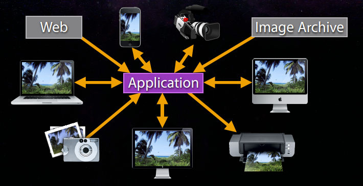

### Device Color Capabilities

#### Device Gamut

To reproduce color on different devices you need to find a way of characterizing the color capabilities of any of those devices. The term __device gamut__ describes those color capabilities. A given device can only reproduce part of the complete visible spectrum (all the colors that exist in nature). The device gamut is all the colors reproducible by the device.

### Problem to Solve

The problem that must be solved is how to reproduce color on different devices knowing the gamut of the devices are different. In the simple workflow from above, there are three different gamuts; one each for camera, display and printer. Let’s say you want to reproduce a color from the camera across all the devices. You can express the color space of any given device mathematically. Figure 2 shows the different color spaces for the camera (Adobe RGB), Mac laptop display and inkjet printer.

__Figure 2__  Different Device Color Spaces.

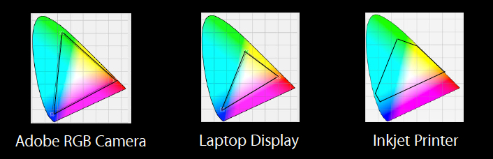

As you can see, the color spaces are vastly different. You can convert color from one color space to another through a mathematical conversion called gamut mapping, but it really depends on which colors you are trying to reproduce. You are limited to what colors the device can represent. This has consequences in terms of organizing your workflow. For example, when proofing you should have a large size gamut on your device. Otherwise, the gamut mapping may result in colors which are not correct in terms of the original data.

Color conversions are non-linear. Conversion to a smaller gamut can cause irreversible damage. Once you convert down specific colors in this manner they will remain there. Let’s imagine your camera acquires a blue color as shown in Figure 3 below, and you want to display this color across all your devices. Gamut mapping will covert it from the camera gamut to the laptop display gamut. You can see it lands inside the display gamut after the conversion. There is no problem reproducing it in the different gamut. The same is true if you try to print it.

Now imagine your camera acquires a very saturated green. The problem is this color does not exist in the gamuts of the other two devices. What happens in this case is the color is pushed inside the gamut. As a result, the saturated green becomes somewhat yellow. It is no longer the same color it was originally. In the case of the printer, the color shift isn’t very big. It's still very close to the original green.

This illustrates an important point: color conversions are very often irreversible. If you commit to the wrong colorspace when designing your workflow you may lose color information.

__Figure 3__  Color Conversions.

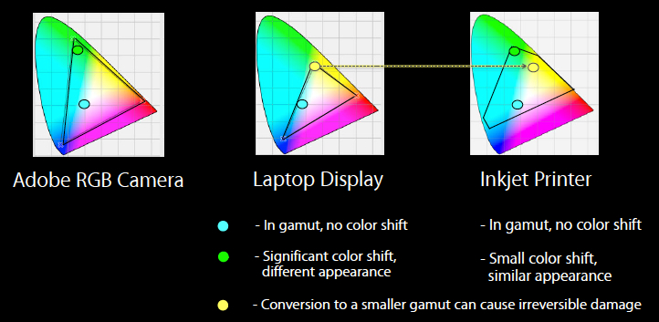

### Color Values in Perspective

This illustrates another point. RGB device color values are not the same across different color spaces. These values are dependent upon the color space they are defined in.

For example, if you are given some RGB device values but you don't know what color space they came from, they really tell you nothing. Figure 4 compares the two color spaces discussed previously, Adobe RGB vs the smaller LCD display.

As you can see, the fully saturated green on the laptop display RGB is somewhere in the middle of chromaticity diagram. By contrast, the fully saturated Adobe RGB green is high up in the greens. These are not the same colors even though the RGB values are the same. This underscores the importance of knowing where the color values are coming from.

The conclusion to be drawn from this is color values are only meaningful when they are tagged with the proper profile.

__Figure 4__  RGB device colors are not the same across different color spaces.

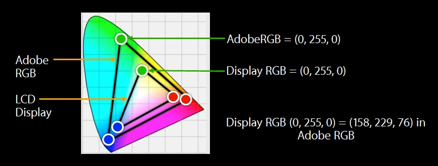[Back to Top](#)

## Active Color Management with ColorSync

ColorSync is the color management system provided in OS X. It is the OS X implementation of the International Color Consortium (ICC) specification, providing system-level color management of images, documents, and devices. ColorSync consists of several parts as shown in Figure 5.

It includes a color management module (CMM). This is a mathematical engine that converts color data from one device to another. OS X ships a default CMM, the Apple CMM, as part of ColorSync. ColorSync also provides a plugin architecture for CMM's. If you have written a custom CMM to use in your application there is a specific plugin API to invoke it.

ColorSync uses ICC profiles for color matching or color conversion across different color spaces. ICC profiles characterize devices in terms of color capabilities. They contain mathematical primitives that describe how to convert data between device color space and a reference color space called the profile connection space (PCS) . A PCS is a device-independent color space used as an intermediate when converting from one device-dependent color space to another. Colorsync includes profiles for different color spaces with OS X, and you can add your own profiles as well.

ColorSync has a device integration database. Every device that is connected to the Mac will be registered with the device integration database. This provides an opportunity for device developers to integrate their device and any associated profiles with ColorSync. If the device manufacturer provides factory ICC profiles these will be registered with the device integration database for use as needed. In addition, the user can assign custom profiles to a device.

__Figure 5__  What is ColorSync.

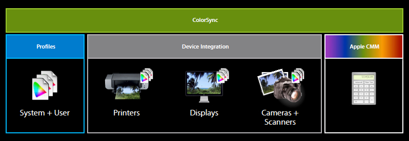

### How Does ColorSync Work?

Consider an image taken from a digital camera. The image will contain a profile characterizing that color space. Profiles contain tags that describe how to convert data between the device color space and the PCS. Profile connection spaces are based on spaces derived from the CIE color space. ColorSync supports two of these spaces, XYZ and L\*a\*b. The CIE color spaces can fully represent all the visible colors, thus ensuring there are no errors incurred during the process.

The profile that is associated with the image and describes the characteristics of the device on which the image was created is called the __source profile__. Displaying the image requires another profile, which is associated with the output device, such as a display. The profile for the output device is called the __destination profile__. If the image is destined for a display, a color match is performed by the CMM using the display’s profile (the destination profile) along with the image source profile to match the image colors to the display gamut. To perform the color match, the CMM creates a transform which converts color data from the source device to the destination through the PCS. See Figure 6.

This workflow can be repeated for many different devices. For example, you can scan an image on a scanner and view it on the display. If the image is printed, the ColorSync color matching will use the printer profile to match the image colors to the printer. If you have a properly built profile, you can analyze all the properties of your printer, and before commiting ink on paper (which can be costly) you can simulate the printer using a printer profile. This is called soft proofing. Soft proofing allows you to view on your computer monitor what your printout will look like when it is on a specific paper. The paper and ink combination is defined by the profile that you or someone else has made for your printer paper and ink combination. When a printer profile is made, the color of the paper is one of the factors that is figured into the profile. If you are able to view your image through the printer profile, you can see how that particular combination of ink and paper will reproduce it, taking into account the gamut as well as other characteristics of the inks used.

__Figure 6__  How does ColorSync work?

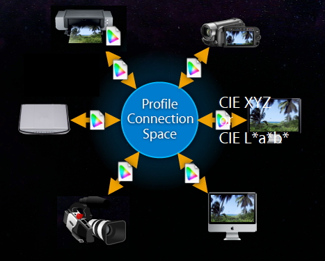[Back to Top](#)

## Frameworks for Color Matching when Rendering to the Display

OS X offers a number of frameworks that perform GPU-accelerated color matching when rendering to the display. Here's a brief summary:

### Quartz 2D (Core Graphics)

The Quartz 2D API is part of the Core Graphics framework (`CoreGraphics.framework`). Quartz 2D is an advanced, two-dimensional drawing engine. Quartz 2D provides low-level, lightweight 2D rendering with advanced color management that provides unmatched output fidelity regardless of display or printing device.

### Core Animation

Core Animation is a graphics rendering and animation infrastructure that you use to animate the views and other visual elements of your app. With Core Animation, most of the work required to draw each frame of an animation is done for you. All you have to do is configure a few animation parameters, and Core Animation does the rest, handing most of the actual drawing work off to the onboard graphics hardware to accelerate the rendering. This automatic graphics acceleration results in high frame rates and smooth animations without burdening the CPU and slowing down your app. Color management is applied as necessary.

### Core Image

Core Image is an image processing and analysis technology designed to provide near real-time processing for still and video images. It operates on image data types from the Core Graphics, Core Video, and Image I/O frameworks, using either a GPU or CPU rendering path. Core Image hides the details of low-level graphics processing by providing an easy-to-use application programming interface (API) so you don’t need to know the details of OpenGL to leverage the power of the GPU. The entire pipleline is color managed.

### AV Foundation

AV Foundation is a powerful framework for playing and creating time-based audiovisual media. It allows you to add audio and video playback, capture, and encoding to your application. It delivers efficient media playback, and provides a GPU accelerated, color managed video pipeline. AV Foundation automatically applies color management to video on input, during playback, and on output. For more information, see _[Video Color Management in AV Foundation and QTKit](../Video%20Color%20Management%20in%20AV%20Foundation%20and%20QTKit/Video%20Color%20Management%20in%20AV%20Foundation%20and%20QTKit.md#apple-f4xwc4dqnrsv64tfmyxwi33df52wszbpirkfgnbqgaytcmztgu)_.

### Application Kit

The Application Kit framework contains the objects you need to implement a graphical, event-driven user interface. The Application Kit handles all the details for you as it efficiently draws on the screen. AppKit also color manages all the interface elements that you typically use in your windows.

[Back to Top](#)

## Frameworks for Color Matching when Not Rendering to the Display

You can use the vImage framework to perform CPU accelerated (vectorized) color matching when not rendering to the display:

### vImage

vImage is a CPU-based, high-performance image processing framework. It is a subframework of the Accelerate framework. The vImage framework uses vectorized code that makes use of Single Instruction Multiple Data (SIMD) vector units, when available. It uses the best code for the hardware it is running on, in a manner completely transparent to the calling application. It includes high-level functions for image manipulation—convolutions, geometric transformations, histogram operations, morphological transformations, and alpha compositing—as well as utility functions for format conversions and other operations.

[Back to Top](#)

## Color Management - Choosing a Framework

OS X is implemented as a set of layers. The lower layers of the system provide the fundamental services on which all software relies. You should typically use the highest-level abstraction available that allows you to perform the tasks you want; remember that the higher-level frameworks simplify your work and are, for this reason, usually preferred.

There are a number of high-level frameworks in OS X integrated with ColorSync that offer automatic color management. These are discussed below in [Color Managed Frameworks - Integrated with ColorSync](#apple-f4xwc4dqnrsv64tfmyxwi33df52wszbpirkfgnbqgaytinrzgqwugsbrfveesr2ijrcvmrkminhuyt2sknmu4q2gkjau2rkxj5jewuy). To ensure your content is properly color managed when using these frameworks you must follow the guidelines discussed in [Color Managed Frameworks - Your Responsibilities](#apple-f4xwc4dqnrsv64tfmyxwi33df52wszbpirkfgnbqgaytinrzgqwugsbrfvbu6tcpkjguctsbi5cuirssifgukv2pkjfverktkbhu4u2jijeuyskujfcvg).

If you are using a low-level framework, you must explicitly perform color management prior to rendering. See [Non-Color Managed Frameworks](#apple-f4xwc4dqnrsv64tfmyxwi33df52wszbpirkfgnbqgaytinrzgqwugsbrfvhe6tsdj5ge6usnifhecr2firdfeqknivlu6uslkm).

[Back to Top](#)

## Color Managed Frameworks - Integrated with ColorSync

OS X offers automatic color management through frameworks integrated with ColorSync. Here is a list of several modern frameworks for processing color media that are tightly integrated with the color management provided by ColorSync:

- Quartz (Core Graphics)
- Image I/O
- Image Capture
- AV Foundation
- Printing

Details about the color management aspects of these frameworks are described below:

### Quartz (Core Graphics)

Quartz provides rendering with advanced color management. Quartz defines a number of basic objects that allow you to describe and process color. Here are the objects pertaining to color:

- `CGColorSpaceRef`
- `CGColorRef`
- `CGImageRef`
- `CGContextRef`

The first is `CGColorSpace`. The `CGColorSpace` object allows Quartz to interpret your color data.

Color spaces can be created many different ways, but here is a simple API:

__Listing 1__  Creating a color space.

```
CGColorSpaceRef colorspace = CGColorSpaceCreateWithName(kCGColorSpaceSRGB);
```

Color spaces can also be created directly from an ICC profile:

__Listing 2__  Creating a color space from an ICC profile.

```
CGColorSpaceRef colorspace = CGColorSpaceCreateWithICCProfile(<#Data containing the ICC Profile#>);
```

The `CGColorRef` object contains a set of components values (such as red, green, and blue) that uniquely define a color, and a color space that specifies how those components should be interpreted.

__Listing 3__  Creating a `CGColorRef`.

```
CGColorSpaceRef colorspace = CGColorSpaceCreateWithName(kCGColorSpaceSRGB);
if (colorspace != NULL)
{
    CGFloat comp[4] = {0.5, 1.0, 0.7, 1.0}; // Last component is alpha

    // Create CGColorRef
    CGColorRef color = CGColorCreate(colorspace, comp);

        // do something with CGColorRef here.

        CGColorRelease(color); // Release CGColorRef when done

    // Release CGColorSpaceRef when done
    CGColorSpaceRelease(colorspace);
}
```

`CGImageRef`

CGImage consists of a `CGColorSpaceRef` and array of component values organized in rows and columns. These component values correspond to color space primaries.

__Listing 4__  Creating a CGImage.

```
CGImageRef image = CGImageCreate(width,
                                 height,
                                 ...
                                 ...
                                 colorSpace,
                                 ...
                                 renderingIntent);
```

To create a `CGImageRef` from a image file on disk, you can do as follows:

__Listing 5__  Create a `CGImageRef` from a image file on disk.

```
CFURLRef path = <#A path to an image#>; // Path to image
CGImageSourceRef imageSource = CGImageSourceCreateWithURL( path, NULL );
// Make sure the image source exists before continuing
if (imageSource != NULL)
{
    // Create an image from the first item in the image source.
    CGImageRef myImage = CGImageSourceCreateImageAtIndex(imageSource, 0, NULL);

        // do something with CGImageRef here.

        CGImageRelease(myImage); // Release CGImageRef when done

    // Release CGImageSourceRef when done
    CFRelease(imageSource);
}
```

Similarly, with a chunk of compressed image data in memory:

__Listing 6__  Create a `CGImageRef` from image data in memory.

```
CFDataRef data = <#Your image data#>;
CGImageSourceRef imageSource = CGImageSourceCreateWithData(data, NULL);
// Make sure the image source exists before continuing
if (imageSource != NULL)
{
    // Create an image from the first item in the image source.
    CGImageRef myImage = CGImageSourceCreateImageAtIndex(imageSource, 0, NULL);

        // do something with CGImageRef here.

        CGImageRelease(myImage); // Release CGImageRef when done

    // Release CGImageSourceRef when done
    CFRelease(imageSource);
}
```

`CGContextRef`

The `CGContextRef` represents a Quartz 2D drawing destination. A graphics context contains drawing parameters and all the device-specific information needed to render the paint on a page to the destination, whether the destination is a window in an application, a bitmap image, a PDF document, or a printer.

__Listing 7__  Drawing into a graphics context.

```
CGContextRef cgcontext = <#A graphics context#>
CGContextDrawImage(cgcontext,...);
...
CGContextStrokeRect(cgcontext,...);
CGContextFillRect(cgcontext,...);
```

Quartz provides creation functions for various flavors of Quartz graphics contexts including bitmap images and PDF. The most significant difference between different types of contexts is there are some that contain their own color space, and others that do not require color conversion because they are recording contexts.

These contexts let you specify a `CGColorSpace`:

- `CGBitmapContext`
- `CGWindowContext`

And these do not:

- `CGPDFContext`
- `CGPostScriptContext`

You can create a context with a specific color space and draw content into it with many types of color. Automatic color management is performed in the graphics context if the context’s `CGColorSpace` is different from the source `CGColorSpace`. For example, you can create an sRGB context and draw a CMYK image into it and composite that with monochrome or some other color. In this scenario, since the color space of the context destination is different than the source Core Graphics will automatically invoke ColorSync and perform the necessary color correction.

### Other frameworks in Quartz

#### Core Animation

Core Animation is another framework in Quartz. Core Animation will take advantage of the GPU when drawing images, and use color management. All you need to do is assign the contents of your Core Animation layer to the image.

__Listing 8__  Using the GPU when drawing a `CGImageRef` into a window (`NSView`).

```
[NSView layer].contents = <#CGImageRef to display#>; // set layer contents to CGImageRef
```

#### Core Image

Core Image is an image processing framework that allows you to display images and color convert them very quickly using the GPU. Core Image provides access to built-in image processing filters and the ability to chain multiple filters together to create custom effects.

Here's how to chain two filters together and apply them to an image:

__Listing 9__  The basics of applying filters to an image.

```
CIImage* image = [CIImage imageWithContentsOfURL: <#NSURL location of the file#>];
if (image != NULL)
{
    image = [[[CIFilter filterWithName:@"CISepiaTone" keysAndValues:
          kCIInputImageKey, image,
          kCIInputIntensityKey, [NSNumber numberWithFloat:1.0], nil]
          valueForKey: kCIOutputImageKey];
    image = [[[CIFilter filterWithName:@"CIHueAdjust" keysAndValues:
          kCIInputImageKey, image,
          kCIInputAngleKey, [NSNumber numberWithFloat:1.57], nil]
          valueForKey: kCIOutputImageKey];
    [context drawImage: image atPoint:CGPointZero fromRect:[image extent]];
}
```

#### Image I/O

The Image I/O framework allows applications to read and write most image file formats. It is highly efficient, allows easy access to metadata, and provides color management.

Many file formats allow you to directly embed a color profile to characterize the image. When Image I/O reads an image file it will retrieve all the color metric information contained in any embedded color profile or metadata and create a `CGColorSpace`. You as the programmer need not worry about this.

__Figure 7__  Image I/O - `CGColorSpace` created from embedded profile or metadata.

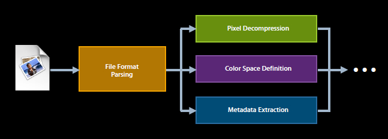

The Image I/O framework provides opaque data types for reading image data from a source (`CGImageSourceRef`):

__Listing 10__  Reading image data - Create a `CGImageSourceRef` and acquire a `CGImageRef`.

```
CFURLRef path = <#A path to an image#>; // Path to image
CGImageSourceRef imageSource = CGImageSourceCreateWithURL( path, NULL );
// Make sure the image source exists before continuing
if (imageSource != NULL)
{
    // Create an image from the first item in the image source.
    CGImageRef myImage = CGImageSourceCreateImageAtIndex(imageSource, 0, NULL);

        // do something with CGImageRef here.

        CGImageRelease(myImage); // Release CGImageRef when done

    // Release CGImageSourceRef when done
    CFRelease(imageSource);
}
```

and writing image data to a destination (`CGImageDestinationRef`):

__Listing 11__  Writing image data - Create a `CGImageDestinationRef` in a specified file format and add a `CGImageRef`.

```
CFURLRef url = <#URL of image destination#>;
CGImageDestinationRef myImageDest = CGImageDestinationCreateWithURL(url, kUTTypePNG, 1, NULL);
// Make sure the image destination exists before continuing
if (myImageDest != NULL)
{
   CGImageRef image = <#Image to add#>;
   // Add an image to the image destination
   CGImageDestinationAddImage(myImageDest, image, NULL);
   CGImageDestinationFinalize(myImageDest);
   CFRelease(myImageDest);
}
```

You create an image from an image source with functions like `CGImageSourceCreateImageAtIndex`, which will retrieve any color matching information in the image and create an appropriate `CGColorSpace`.

An image destination abstracts the data-writing task and eliminates the need for you to manage data through a raw buffer. You create an image destination with functions like `CGImageDestinationCreateWithURL` or `CGImageDestinationCreateWithData`. After you create an image destination, you can add an image to it by calling the `CGImageDestinationAddImage` or `CGImageDestinationAddImageFromSource` functions. Calling the function `CGImageDestinationFinalize` signals Image I/O that you are finished adding images.

#### Image Capture

Another important framework from the color management perspective is Image Capture.

Image Capture allows you to acquire images directly from cameras and scanners. It is based on Image I/O.

Image Capture consists of the ImageKit framework and the ImageCaptureCore framework. High-level image capture classes in the ImageKit framework allow you to construct applications that control cameras and scanners entirely by dragging and dropping elements in Interface Builder, literally without writing a line of code.

The following ImageKit classes are all color managed to the current display:

- `IKDeviceBrowserView`
- `IKCameraDeviceView`
- `IKScannerDeviceView`
- `IKImageView`

Similar classes in the ImageCaptureCore framework provide the equivalent capabilities to quickly find and control cameras and scanners, but without the built-in UI, allowing you to write headless applications or to provide your own custom UI. Use the following ImageCaptureCore classes for lower-level camera control:

- `ICDeviceBrowserDelegate`
- `ICCameraDeviceDelegate`
- `ICScannerDeviceDelegate`
- `ICCameraDeviceDownloadDelegate` (e.g. for downloading images)

For those file formats that do not contain color metric information, Image Capture will use ColorSync to query the Device Integration Database to determine an appropriate profile to assign to the image, and create a `CGColorSpace` from it. Image Capture will also color convert images for display.

#### AV Foundation

AV Foundation is a framework for playing and creating time-based audiovisual media. You can use it to examine, create, edit, or reencode media files. You can also get input streams from devices and manipulate video during realtime capture and playback.

The AV Foundation framework automatically applies color management to video on input, during playback, and on output. For more information, see _[Video Color Management in AV Foundation and QTKit](../Video%20Color%20Management%20in%20AV%20Foundation%20and%20QTKit/Video%20Color%20Management%20in%20AV%20Foundation%20and%20QTKit.md#apple-f4xwc4dqnrsv64tfmyxwi33df52wszbpirkfgnbqgaytcmztgu)_.

#### Application Kit

The Application Kit is a framework containing the objects you need to implement a graphical, event-driven user interface. The Application Kit handles all the details for you as it efficiently draws on the screen. AppKit also color manages all the interface elements that you typically use in your windows.

To draw into a window using the OS X frameworks in Quartz you will need to access the `CGContextRef` for the window. Here’s how:

__Listing 12__  Acquire `CGContextRef` for the window.

```
CGContextRef cgcontext = [[NSGraphicsContext currentContext] graphicsPort];
```

When a window is created, AppKit automatically sets the window backing store color space. In OS X, the graphics context are connected to a window backing store. By default, the window context is tagged with the current display profile. However, in certain situations the color space can be changed by the application:

__Listing 13__  Setting the window's color space.

```
NSWindow *myWindow = <#Your window#>
[myWindow setColorSpace: [NSColorSpace sRGBColorSpace]];
```

You can then can draw different types of images and composite them together to this window graphics context and your custom color space will be used. See Figure 8.

__Figure 8__  Window backing store color space can be set by the application.

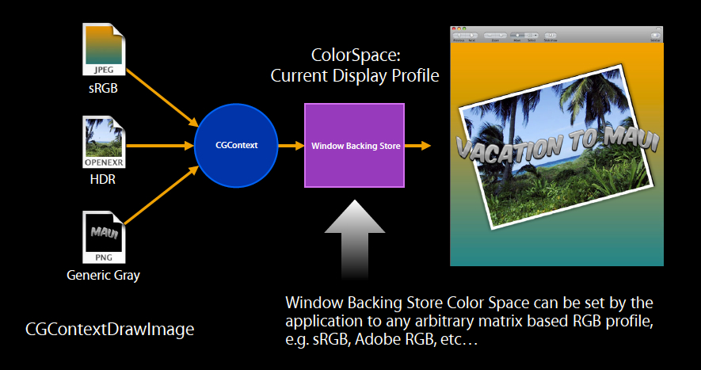

You can also register for display change notifications (`NSWindowDidChangeScreenProfileNotification`):

__Listing 14__  Register for Display Change Notification.

```
NSWindow *myWindow = <#Your window#>
[myWindow setDisplaysWhenScreenProfileChanges:YES];
```

The display change notification is posted whenever the display profile for the screen containing the window changes. This notification is sent only if the window returns `YES` from the `NSWindow` `displaysWhenScreenProfileChanges` method as shown here:

__Listing 15__  Indicates whether the window context should be updated when the screen profile changes or when the window moves to a different screen.

```objc
- (BOOL)displaysWhenScreenProfileChanges
{
    return YES;
}
```

The `NSWindowDidChangeScreenProfileNotification` may be sent when a majority of the window is moved to a different screen (whose profile is also different from the previous screen) or when the ColorSync profile for the current screen changes.

If you are caching information that is tied to the display you should discard it to allow for the proper color matching of your content.

__Figure 9__  Display Change Notification called when majority of window is moved to a different screen.

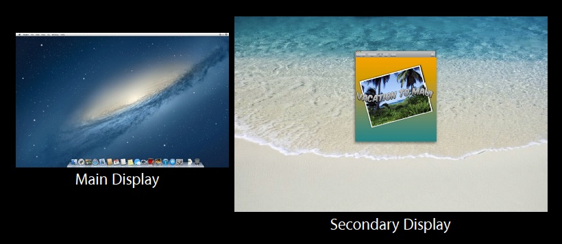

After the window context is updated, the window is told to display itself. If you need to update offscreen caches for the window, you should register to receive the `NSWindowDidChangeScreenProfileNotification` notification.

### Example - What happens in an Application using Color Managed Frameworks

Let's put this all together and see what happens in a simple app that acquires an image from a camera.

If the app is using Image Capture to acquire the image (as a `CGImageRef`), it will be properly tagged, and contain all the necessary color metric information (see previous Image Capture section). See Figure 10.

If the app then wants to draw the image on the screen, it simply calls the proper Quartz functions to perform the drawing; no further steps are necessary. Quartz will consult ColorSync to find the proper display profile, and convert the image data to the display profile color space to ensure it is displayed correctly. See Figure 10.

Printing an image is a similar process. If you are using CUPS, you don't even need to know which printer the user has selected. The CUPS printing architecture will determine the proper profile for the selected printer, and convert the data and print the job. See Figure 10.

In summary, OS X provides automatic color management through the various frameworks integrated with ColorSync.

__Figure 10__  An app acquiring an image from a camera, drawing to the display, and printing to the printer .

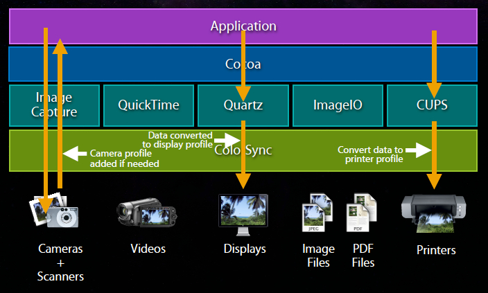[Back to Top](#)

## Color Managed Frameworks - Your Responsibilities

As discussed in [Color Managed Frameworks - Integrated with ColorSync](#apple-f4xwc4dqnrsv64tfmyxwi33df52wszbpirkfgnbqgaytinrzgqwugsbrfveesr2ijrcvmrkminhuyt2sknmu4q2gkjau2rkxj5jewuy), the high-level OS X frameworks integrated with ColorSync provide automatic color management. However, you still have some responsibilities to ensure your content is properly color managed when using these frameworks:

### Pixel Buffers should be Tagged

If you are working with pixel buffers explicitly you should make sure they have a `CGColorSpace` attached to them (the term __tagging__ is used to describe this). Tagging pixel buffers is especially important if your application is synthesizing these buffers.

If you are reading pixel buffers from Core Media, AV Foundation, ImageIO or other framework, or even from another application, chances are they are already tagged -- if taken from a media file, the file will likely have a tag associated with it. Nevertheless, it is good practice to check them programmatically and make sure they are tagged. Pixel data that is not tagged is considered undefined, and can cause your colors to come out looking wrong. It is good practice to make sure everything is tagged, even programmatically. Untagged content should be tagged with something, and you'll need to determine what is most appropriate. For example, if you have untagged content that was intended for the web or PC, chances are it should be tagged as sRGB.

### Graphics Contexts must be fully specified

The OS X frameworks very often require you setup a graphics context. Make sure your contexts are fully specified with an appropriate color space in order to be properly color managed.

### Use of device RGB colors is problematic

RGB device values without any color space information really tell you nothing. The colors produced by RGB (and CMYK) are specific to a device. Because their color appearance is device dependent, these spaces are actually the worst choice for faithful color reproduction across different devices. Devices (displays, printers, scanners, cameras) don't treat color the same way; each has its own range of colors that the device can produce faithfully. A color produced on one device might not be able to be produced on another device. Therefore, device RGB color usage is strongly discouraged. Don’t expect consistent results when using device RGB colors with the OS X frameworks because each individual framework may treat these differently.

[Back to Top](#)

## Non-Color Managed Frameworks

If you are working with a lower level framework, you’ll need to provide your own explicit color management prior to rendering.

### vImage

With vImage you can perform explicit color management of images. Of particular interest with regard to color management are the transformation and format conversion functions. Image transformation operations alter the values of pixels in an image as defined by custom functions provided as a callback. With vImage, you can use image transformation operations on the following sorts of functions:

- Matrix multiplication

  Color space conversion

  Hue, saturation, brightness

  Color effects
- Gamma correction

You use a `vImageConverter` object to convert an image from one format to another. A `vImageConverter` interoperates with Core Graphics by supporting the `CGImageRef` object. To use a `vImageConverter` you define a `vImage_CGImageFormat` structure which describes your image format. The `vImage_CGImageFormat` structure defines the ordering of the color channels, how many there are, the size and type of the data in the color channels, whether the data is premultiplied by alpha or not, and the color space model for the pixel data. This format mirrors the image format descriptors used by CoreGraphics to create things like `CGImageRef` and `CGBitmapContextRef`:

__Listing 16__  The `vImage_CGImageFormat` structure.

```c
typedef struct
{
   uint32_t                bitsPerComponent; /* # bits in each color channel */
   uint32_t                bitsPerPixel; /* # of bits in each pixel. */
   CGColorSpaceRef         colorSpace; /* color space model for the pixels */
   CGBitmapInfo            bitmapInfo; /* describes the color channels */
   uint32_t                version; /* Reserved for future expansion */
   const CGFloat           *decode; /* Decode parameter */
   CGColorRenderingIntent  renderingIntent; /* See CGColorSpace.h */
}vImage_CGImageFormat;
```

vImage functions use a `vImage_Buffer` structure to receive and supply the pixel data. The `vImage_Buffer` contains a pointer to the pixel data, the height and width of the buffer, and the number of bytes in a pixel row. The following example shows how to initialize a `vImage_Buffer` of a desired format, from a file referenced by a `CFURLRef`:

__Listing 17__  Initializing a `vImage_Buffer` of a desired format.

```
CFURLRef url = <#A url to your source image file#>;
CGImageSourceRef imageSource = CGImageSourceCreateWithURL(url, NULL);
CGImageRef image = CGImageSourceCreateImageAtIndex( imageSource, 0, NULL );
vImage_Buffer result;
vImage_CGImageFormat format = {
    .bitsPerComponent = (uint32_t) CGImageGetBitsPerComponent(image),
    .bitsPerPixel = (uint32_t) CGImageGetBitsPerPixel(image),
    .bitmapInfo = CGImageGetBitmapInfo(image),
    .colorSpace = CGImageGetColorSpace(image)
}; // .version, .renderingIntent and .decode all initialized to 0 per C rules
vImage_Error err = vImageBuffer_InitWithCGImage( &result, &format, NULL, image, kvImageNoFlags );
```

A `vImageConverter` object is used to convert an image. A `vImageConverter` object is created by specifying a source and destination `vImage_CGImageFormat`, optionally with a custom colorspace transform. Listing 18 shows how to create a `vImageConverter`, and uses a colorspace transform you pass in. This gives you greater control over the fine details of colorspace conversion, for exacting color fidelity.

__Listing 18__  Creating a `vImageConverter`.

```
CFArrayRef profileSequence = <#A set of profiles to be used in the transform#>;
CFTypeRef codeFragment = NULL;
/* transform to be used for converting color */
ColorSyncTransformRef transform = ColorSyncTransformCreate (profileSequence, NULL);
/* get the code fragment specifying the full conversion */
codeFragment = ColorSyncTransformCopyProperty(transform, kColorSyncTransformFullConversionData, NULL);
if (transform) CFRelease (transform);
vImage_CGImageFormat inpFormat = { /* Your source image format */ };
vImage_CGImageFormat outFormat = { /* Your output image format */ };
vImage_Error err;
/* create a converter to do the image format conversion. */
vImageConverterRef converter = vImageConverter_CreateWithColorSyncCodeFragment( codeFragment, &inpFormat, &outFormat, NULL, kvImageNoFlags, &err );
```

You call the `vImageConvert_AnyToAny` function with an appropriately configured `vImageConverter` to convert the image.

__Listing 19__  Converting an image with the `vImageConvert_AnyToAny` function.

```
vImageConverterRef converter = <#A configured image converter#>;
vImage_Buffer srcBuf = <#an array of vImage_Buffer structs describing the source data planes#>;
vImage_Buffer destBuf = <#an array of vImage_Buffer structs describing the destination data planes#>;
vImage_Error err;
err = vImageConvert_AnyToAny(converter, & srcBuf, & destBuf, NULL, kvImageNoFlags );
```

Finally, call the `vImageCreateCGImageFromBuffer` function to create a `CGImageRef` from the converted image data in the `vImage_Buffer`.

__Listing 20__  Calling `vImageCreateCGImageFromBuffer` to create a `CGImageRef` from the converted image data.

```
vImage_Error err;
vImage_Buffer destBuf = <#A buffer with the converted image data#>;
vImage_CGImageFormat outFormat = { /*The output image format */ };
CGImageRef outImage = vImageCreateCGImageFromBuffer( &destBuf, &outFormat, NULL, NULL, kvImageNoAllocate, &err );
```

### OpenGL - Explicit Color Management Example

OpenGL is not color managed. As a consequence, it might require additional effort to devise solutions to specific color problems you may encounter when using it. The fundamental problem is OpenGL has one set of assumptions, and the display buffer has another.

OpenGL has a linear light model. For example, if you apply a garoud shade to a scene in OpenGL you are working with a linear light model.

OpenGL has RGB values, but they are not RGB specific in any particular gamut.

The display buffer is largely sRGB 2.2 gamma.

How do you go from the OpenGL linear model into something that is appropriate for the display buffer? There are two different strategies you can take: a simple one, and one slightly more sophisticated.

#### OpenGL Options For Simple Color Management - Do Nothing

The simplest approach of all is to do nothing.

What does it mean if you do nothing? It means you are putting linear light data in a 2.2 gamma buffer. Implicitly, that will provide a gamma boost. A gamma of 2.2 is a big boost. It will be much more contrasty than you'd expect. If you are working with lighting models, you will get lighting that is really unexpected. It will probably not look like the environment you are trying to target. That also may be ok, if you've lived with it being contrasty that's fine. Or there may be circumstances where it may even be the correct thing.

Not everybody uses OpenGL to do 3D. A lot of people use OpenGL to do simple compositing. If you are compositing content that is sRGB based, it is already a 2.2 gamma, and it may be perfectly fine to composite it and place it into a 2.2 buffer. It will actually come out looking correct.

#### Provide 1.0 -> 2.2 gamma conversion in shader

The next simplest thing to do (which may be trivial if you are already using shaders) is to provide the gamma correction component of color correction. This is what changes the contrast (also called tonality). It is actually a bigger, more perceptually significant factor than the color correction aspect.

The mathematical part of gamma correction can be described as a pure power function. You take a pixel value (in this case it is a floating point value between 0 and 1) and raise it to a power. That power happens to be the ratio of the source gamma to the destination gamma. In the above OpenGL example, source gamma is 1.0 and destination gamma is 2.2, thus the ratio is 1 over 2.2. See Listing 21.

It turns out the power function on many GPU’s is very expensive. You can simplify it as a square root. A square root is raising the value to the 1 over 2.2 power. It is not quite accurate, but it is very close, and is what many OpenGL games use.

__Listing 21__  Provide 1.0 -> 2.2 gamma-only conversion via shader.

```
result = pow(fvalue, (source / destination));
result = sqrt(fvalue); // approximation
```

#### OpenGL Options for Advanced Color Management

This option is actually quite simple if you are using the proper framework. If you are using AppKit, you can very easily access the Window Manager's backing store, and set a color space on it using the method described in Listing 13.

The Window Manager will then use a shader based color match for you. It may not be the most efficient technique, but it is probably sufficient for most.

Finally, you can explicity call ColorSync to get the best possible result. Simply call ColorSync and pass it your source profile and destination profile. It will return to you a “recipe” to perform the color correction. That recipe actually has a linearization, a color conversion (a 3x3 conversion matrix) and a gamma.

__Listing 22__  Create shader to apply ColorSync linearization, color conversion, and gamma recipe.

```
FragmentInfo = ColorSyncTransformCopyProperty (transform, kColorSyncTransformFullConversionData, NULL);
```

If you like, you can combine all those operations into a 3D lookup table. That's actually what happens in the color management of many of the OS X frameworks and applications.

[Back to Top](#)

## Targeted Color Management - iOS sRGB

iOS application development uses the targeted color management model. Your content is matched to the sRGB color space on the authoring platform. This matching is not performed dynamically on the iOS device. Instead, it happens during authoring on your Mac OS X desktop. Targeted color management is similar to what the video industry has traditionally done in targeting High Definition (HD) video, where the source content is transformed to the HD color space. That way, when the content is rendered on HD displays nothing further has to be done.

Targeted color management may also occur when you sync content to your mobile device. In fact, iTunes running on the desktop provides color management to the iOS targeted color space when you sync content from iPhoto to your iOS device.

Targeted color management on iOS saves tremendous amounts of power, which extends runtime, and unburdens other valuable resources like the GPU to perform other operations. With targeted management you are getting the same high quality result as active management. However, the color match it is occurring at authoring time instead of dynamically at runtime.

### Authoring Content for iOS - Best Practices

Consider some typical scenarios: let's say you have a company logo, and you want your iOS app's logo to have the same appearance as your company logo. Or what if you are targeting a specific color from a color chart for some particular elements in your app. How do you go about it?

Here’s some general guidelines to follow to ensure your colors come out looking right when authoring content for iOS apps.

#### Setup Authoring Workstation/Environment

When authoring you should use a desktop display. Desktop displays are better than laptop displays for authoring because they have a very wide viewing angle and they're brighter. Don’t use a wide gamut display. Wide gamut displays can have a tremendously wide color gamut, and are beautiful to look at, but unless you are a very sophisticated developer with regard to color management it is easy to make mistakes. A wide-gamut monitor can display colors that are outside the gamut of more commonly used color spaces such as sRGB. However, your images must actually contain those colors, in a color space with a larger gamut than sRGB. You also need color managed software that can recognize the larger color space and translate it properly into colors on the monitor. In addition, your monitor needs to be properly calibrated and profiled to tell the color management system how to do the translation.

You should also strive for a consistent viewing environment. Unfortunately, that means forsaking windows. In addition to the big difference between sunlight and darkness, your perceptions of what you are viewing can change dramatically, even when the sun ducks behind a cloud entirely.

It is good to backlight your displays (have a light illuminate the wall behind you, and optimally the wall should be some kind of neutral color). At the very least that reduces eye strain.

Monitor calibration is not strictly required. For Apple devices, the ColorSync device integration database provides a profile for the display. You still may want to calibrate, and OS X provides a software calibrator for the system.

#### Content Authoring/Proofing

It is imperative you use color managed authoring tools. All of the various Apple tools are color managed — some third party tools are color managed as well. Tools that are color managed are usually very sophisticated. It is up to you to make sure they are properly configured.

When configuring your tool you’ll need to set a working color space. The working color space is a device independent color space used for image editing (such as color and tone adjustments). You should use sRGB as the working color space in your authoring tool when editing media for iOS. Your source content can be in any color space as long as it is properly tagged.

When your content is imported, convert it to the working color space sRGB. Even if your media is in a wider gamut (for example, raw photos), and your monitor can display wider than the sRGB gamut, your color managed application will translate those colors to sRGB, the color space for the finished product. By using an sRGB working color space you can get an accurate prediction of what your media will look like when displayed on the actual iOS device. This is how soft proofing works. Soft proofing allows you to see how the iOS device will render the colors in your media by displaying a "simulation" of this on your monitor. For example, here’s what happens when you soft proof an image on your monitor using an sRGB working space:

- the image is first color converted from the image profile (the profile tagged to the image) to the sRGB profile.

- once colors have been converted to the sRGB profile, a second color conversion is performed that converts color from the sRGB profile to your monitor profile.

By converting to color used by the sRGB working space and then converting the color to the color used by the monitor, you can simulate on the monitor what the image will look like on the actual iOS device.

Finally, you should make sure and tag the exported file with an sRGB color profile.

#### Tagging Content

Tagging means attaching meta information to your content that makes it self-describing from a color perspective. For still images, that is the ICC profile. The various Apple tools will automatically tag content they generate. That is not necessarily true of third-party tools. It is your responsibility to make sure that all your content is tagged and looks correct.

OS X contains the following tools for tagging your media:

- Preview
- ColorSync Utility
- Automator

#### Preview

The Preview app is color managed, and is a great tool for opening your content and making sure it looks correct. If you bring up the inspector window (Tools > Show Inspector menu item) it will tell you if there is a tag attached.

__Figure 11__  Using the Preview Tools > Show Inspector menu item to reveal image tags.

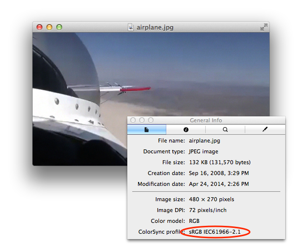

This is important, because you could be looking at untagged content. Very often it won't be obvious if a particular image is tagged or untagged. In addition, untagged content may look correct — even non color managed content may look corrrect on a particular display, but it is almost guaranteed to look different on another person’s display. Color management not only makes things look correct, but it makes them consistent.

With Preview, you can tag an image with a color profile using the Tools > Assign Profile menu item.

__Figure 12__  Assigning a color profile to an image using the Preview Tools > Assign Profile menu item.

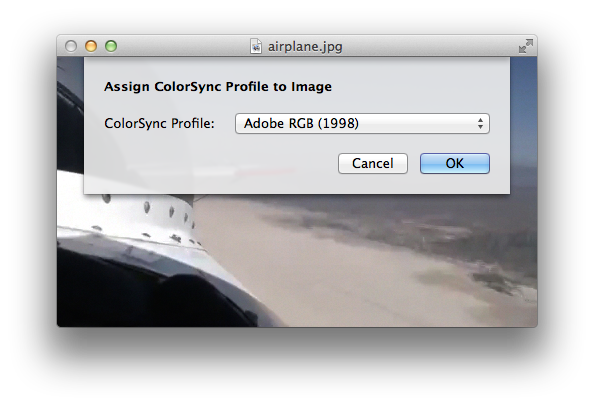

This allows you to set the color space for an image. Note it doesn't change the pixel values in your file, it changes the information that is associated with it. It tells the color management system how to render those pixels.

#### ColorSync Utility

ColorSync Utility is very powerful app. There are a number of different things you can do with it, such as assign a profile to image data. You can also perform a profile match operation. This is an operation that actually modifies pixels. For instance, if you open a ProPhoto wide gamut image you can have it matched to sRGB so that all the pixel values are converted to sRGB and saved in the file. The file will then have an sRGB profile associated with it.

You can compare ICC profiles in three dimensions. This becomes very useful when comparing gamuts. As a case in point, if you want to figure out if all the colors in an image in a certain color space can be represented in another color space, you can compare both of those in 3D, and spin the result around and see if any stick out. Those colors that stick out cannot be represented in that color space.

__Figure 13__  Using ColorSync Utility to view ICC profiles in three dimensions.

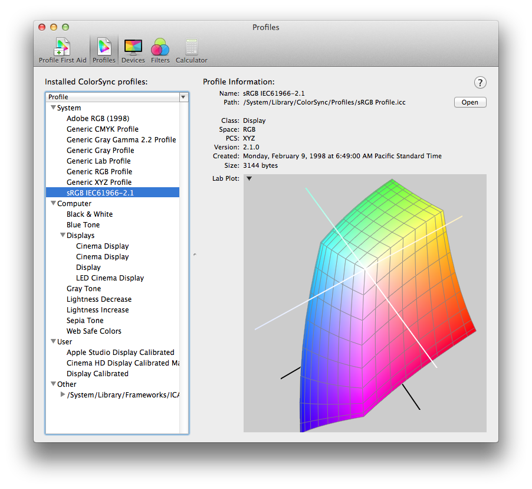

ColorSync Utility also has a calculator that allows you to perform math calculations. For instance, you can use the calculator to determine what a value in the ProPhoto color space is in sRGB. This can be useful if you are authoring RGB values for OpenGL rendering and you want to match something that is color managed. It can also be useful for HTML or for the web.

__Figure 14__  ColorSync Utility Calculator.

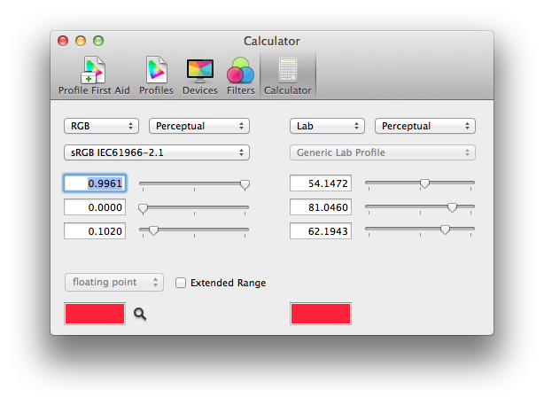

#### Automator Profile action

Automator is an Apple app that automates repetitive procedures on OS X. With Automator, users can construct arbitrarily complex workflows from modular units called actions. An action performs a discrete task, such as opening a file or cropping an image. A workflow is a number of actions in a particular sequence.

Apple includes a suite of ready-made actions with Automator. These include an action that allows you to apply a selected ColorSync profile to an image. For instance, you could use this action to create a workflow that assigns an sRGB profile to all the images in a specified folder.

__Figure 15__  Automator Action to apply a selected ColorSync profile to an image.

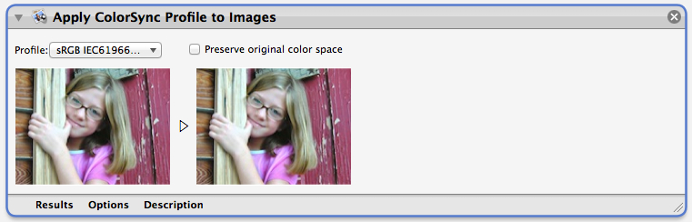

#### SIPS Tool (Scriptable Image Processing System)

The `sips` tool is used to query or modify raster image files and ColorSync ICC profiles. It also allows you to perform batch processing. This means if you have a whole library of thousands of images you want to tag you can easily do it as a batch using the `sips` tool. In this example, all images in a directory are color matched to the sRGB profile.

__Listing 23__  Convert all jpegs in directory to sRGB using the `sips` tool.

```
sips —matchto “/System/Library/ColorSync/Profiles/sRGB Profile.icc” *.jpg
```

See the `sips` man page to learn about the many different things you can do with this very capable tool.

### Evaluating Results

How do you evaluate the results of any image editing to make sure the colors are correct? One very powerful technique is to use what is called a “trick” profile. Here’s an explanation:

### Content with Embedded Trick Profile

This is special content with an embedded “trick” profile. A “trick” profile is not a regular profile you would expect to see in an image file. Instead, it is a profile specially made to allow you to easily tell whether or not ColorSync color management is being performed when the image is drawn or printed. If you view this special content in a non color managed application you can see it is clearly wrong.

__Figure 16__  Special content looks wrong when viewed in a non color managed application.

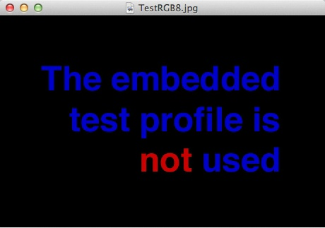

If you look at it in a color managed application such as Preview you can see it is correct.

__Figure 17__  Color managed applications display the special content correctly.

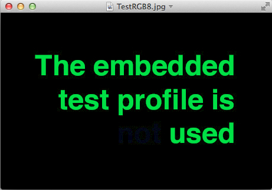

You can use this content in your own applications too. It is part of the _[ImageApp](../../samplecode/ImageApp/ImageApp.md#apple-f4xwc4dqnrsv64tfmyxwi33df52wszbpirkfgmjqgaydgnrygu)_. See also the _[Image Color Management](../Image%20Color%20Management/Image%20Color%20Management.md#apple-f4xwc4dqnrsv64tfmyxwi33df52wszbpirkfgmjqgaydimbzha)_ for more information.

[Back to Top](#)

## References

- _[Image Color Management](../Image%20Color%20Management/Image%20Color%20Management.md#apple-f4xwc4dqnrsv64tfmyxwi33df52wszbpirkfgmjqgaydimbzha)_
- _[Evaluating an Application's Video Color](../Evaluating%20an%20Application%27s%20Video%20Color/Evaluating%20an%20Application%27s%20Video%20Color.md#apple-f4xwc4dqnrsv64tfmyxwi33df52wszbpirkfgnbqgaytgmzygu)_
- _[Video Color Management in AV Foundation and QTKit](../Video%20Color%20Management%20in%20AV%20Foundation%20and%20QTKit/Video%20Color%20Management%20in%20AV%20Foundation%20and%20QTKit.md#apple-f4xwc4dqnrsv64tfmyxwi33df52wszbpirkfgnbqgaytcmztgu)_
- _[ImageApp](../../samplecode/ImageApp/ImageApp.md#apple-f4xwc4dqnrsv64tfmyxwi33df52wszbpirkfgmjqgaydgnrygu)_
- _[Converting an Image with Black Point Compensation](../../samplecode/Converting%20an%20Image%20with%20Black%20Point%20Compensation/Converting%20an%20Image%20with%20Black%20Point%20Compensation.md#apple-f4xwc4dqnrsv64tfmyxwi33df52wszbpirkfgnbqgaytgnbzha)_

[Back to Top](#)

---

#### Document Revision History

| __Date__ | __Notes__ |
| 2014-06-26 | New document that describes best practices for color management in OS X and iOS |

