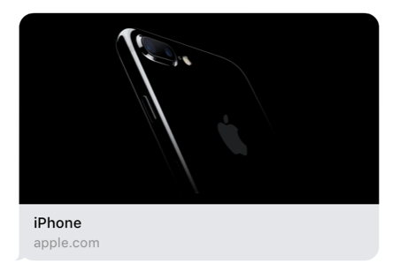

> 导航：[总目录](../../README.md) · [technotes](../../_indexes/technotes.md)


Technical Note TN2444

# Best Practices for Link Previews in Messages

Messages in iOS and macOS will automatically generate inline previews for links people send. By default these render as gray bubbles showing the page title, domain, and small icon. By adding a small amount of Open Graph metadata on your website pages, you can make these iMessage link previews look great by displaying images and meaningful captions.

[Introduction](#apple-f4xwc4dqnrsv64tfmyxwi33df52wszbpirkfgnbqgaytonrxg4wugsbrfvke4vcbi4yq)[Enabling Link Previews](#apple-f4xwc4dqnrsv64tfmyxwi33df52wszbpirkfgnbqgaytonrxg4wugsbrfvcu4qkcjreu4r27jreu4s27kbjekvsjivlvg)[Document Revision History](#apple-f4xwc4dqnrsv64tfmyxwi33df52wszbpirkfgnbqgaytonrxg4wvezlwnfzws33ojbuxg5dpoj4s2rdpnz2ey2lonncwyzlnmvxhiskel4yq)

## Introduction

When people send messages containing links to web sites, Messages in iOS and macOS will automatically generate inline previews for the links. These previews rely on metadata from the page referenced by the link. If no metadata can be found, a generic link preview is generated as shown in Figure 1.

__Figure 1__  Default link preview for http://www.example.com.


However, by adding a small amount of [Open Graph metadata](http://ogp.me) on your pages you can enable a much richer link preview as shown in Figure 2.

__Figure 2__  Link preview for http://www.apple.com/iphone includes metadata for an image and title.



This is accomplished by including the following meta tags on the webpage:

__Listing 1__  Open Graph meta tags included on http://www.apple.com/iphone.

```
<meta property="og:title" content="iPhone" />
<meta property="og:image" content="https://www.apple.com/v/iphone/home/t/images/home/og.png?201610171354" />
```

[Back to Top](#)

## Enabling Link Previews

Below are additional tips on how to get great looking link previews in Messages.

__Consistent metadata for all user agents__

- Serve the same metadata to both mobile and desktop versions of the page.
- Clients shouldn’t have to play User-Agent tricks to receive useful metadata.

__Images in link previews__

- Use `og:image` to include an image in your link preview. Images specified with this metadata will typically be displayed at a fairly large size so be sure that the image is representative of the page, includes interesting details, and is of high enough quality to display beautifully (especially important on retina screens).
- For lower quality images that won’t display well at large size or for icons, use an [apple-touch-icon](https://developer.apple.com/library/content/documentation/AppleApplications/Reference/SafariWebContent/ConfiguringWebApplications/ConfiguringWebApplications.html#//apple_ref/doc/uid/TP40002051-CH3-SW4) instead.
- Provide a high-resolution icon in addition to any images. The link preview generation will look for an apple-touch-icon, favicon, or one specified by <link rel="...">.
- Avoid text in images. Images will be displayed at varying sizes depending on context and device, potentially making text unreadably small or comically large. It is much better to keep the image graphical and to use other metadata tags for text. The text provided in the metadata is also accessible for people using VoiceOver.

__Videos in link previews__

- Putting a direct link to your video asset in the Open Graph metadata is better than referencing an embeddable video page. With the direct link to video, Messages will load and display fast, and use the system user interface for video playback.
- If the link preview machinery encounters a `og:video` or `twitter:player:stream` that points to a downloadable single media asset (for example, an MPEG-4 file) that can be played, it will attempt to download the video and automatically play it back.
- Video that can be streamed but not downloaded (such as HTTP Live Streams or QuickTime Reference Movies) will still play inline, but require the user to tap to start playback. Video that requires embedding HTML or plug-ins will not play inline.

__Titles in link previews__

- Use `og:title` to specify the title of your link preview.
- Titles should be short and sufficiently specific that different pages on the same site are distinguishable. For example, product pages should indicate the product name in the title; articles should provide the title of the article.
- Do not put the site name or other branding in the `og:title`. Doing so often leads to duplication of information between the title and other parts of the rich presentation, and is semantically incorrect. Use `og:site_name` for the site name instead.

__Reachability__

- The machinery that creates link previews will not follow <meta> redirects, nor run JavaScript, so metadata must be available on the page without either occurring. Server-side redirects are followed, however, and are a good alternative.
- Pages that sit behind authentication walls should still have meaningful metadata. This can be done without revealing any sensitive content.
- On pages that require authentication, the main resource should ideally provide metadata for the page behind the wall, not for the sign in page itself. Given the need for authentication, the metadata may not be as rich, but providing a title with at least as much context as the user could have gleaned from the raw URL should be feasible in many cases and would produce much better link previews than showing “Sign In” for every page behind the authentication wall.

__Limits__

- All limits are subject to change at any point in time; use these only as guidelines.
- Icons should be square, and at least 108px per side.
- Images should be at least 900px in width.
- Images less than 150px in width will not be used, or may be presented as icons.
- The main resource located at the link is limited to 1MB. The total size of sub-resources (the icons, images, and videos which are selected as most interesting) is limited to 10MB.

__Other Resources__

- The official [Open Graph documentation](http://ogp.me/)
- Facebook's [Open Graph Debugger](https://developers.facebook.com/tools/debug/)

[Back to Top](#)

---

#### Document Revision History

| __Date__ | __Notes__ |
| 2017-09-08 | New document that explains how website developer can add metadata in order to get better link previews in Messages for iOS and macOS. |
