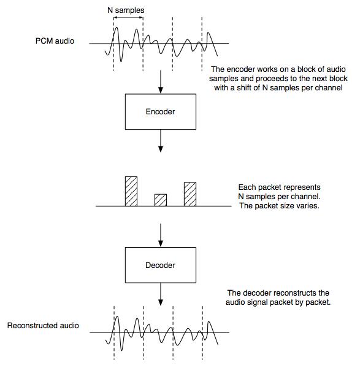
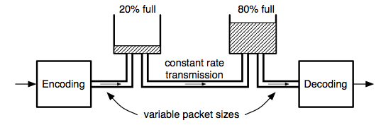
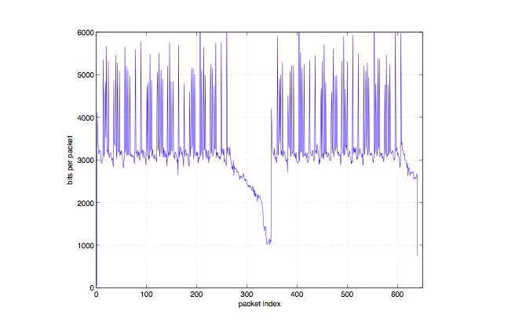
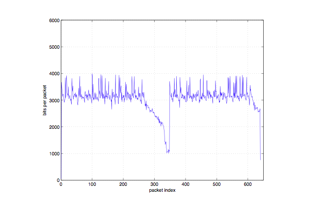
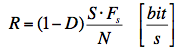
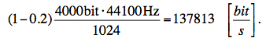

> 导航：[总目录](../../README.md) · [technotes](../../_indexes/technotes.md)


Technical Note TN2271

# Bit Rate Control Modes for AAC Encoding

Apple’s AAC audio encoder supports various bit rate control strategies tailored for a wide range of applications. This document explains these strategies and guides the user when selecting a strategy for a given application.

[Introduction](#apple-f4xwc4dqnrsv64tfmyxwi33df52wszbpirkfgnbqgaytenrwg4wugsbrfvke4vcbi4yq)[Specifying the amount of output data and target quality](#apple-f4xwc4dqnrsv64tfmyxwi33df52wszbpirkfgnbqgaytenrwg4wugsbrfvke4vcbi4za)[Offline Applications](#apple-f4xwc4dqnrsv64tfmyxwi33df52wszbpirkfgnbqgaytenrwg4wugsbrfvke4vcbi4zc2t2gizgestsfl5avaucmjfbucvcjj5hfg)[Real-time Applications](#apple-f4xwc4dqnrsv64tfmyxwi33df52wszbpirkfgnbqgaytenrwg4wugsbrfvke4vcbi4zc2usfifgf6vcjjvcv6qkqkbgesq2bkreu6tst)[Interfaces](#apple-f4xwc4dqnrsv64tfmyxwi33df52wszbpirkfgnbqgaytenrwg4wugsbrfvke4vcbi4zq)[Command Line Settings](#apple-f4xwc4dqnrsv64tfmyxwi33df52wszbpirkfgnbqgaytenrwg4wugsbrfvke4vcbi4zs2q2pjvguctsel5gestsfl5jukvcujfheouy)[Bit rate control via API](#apple-f4xwc4dqnrsv64tfmyxwi33df52wszbpirkfgnbqgaytenrwg4wugsbrfvke4vcbi4zs2qsjkrpveqkuivpugt2okrje6tc7kzeucx2bkbeq)[Summary](#apple-f4xwc4dqnrsv64tfmyxwi33df52wszbpirkfgnbqgaytenrwg4wugsbrfvke4vcbi42a)[Constant Bit Rate (CBR)](#apple-f4xwc4dqnrsv64tfmyxwi33df52wszbpirkfgnbqgaytenrwg4wugsbrfvke4vcbi42c2q2pjzjviqkokrpueskul5jecvcfl5pugqssl5pq)[Average Bit Rate (ABR) - Default Mode](#apple-f4xwc4dqnrsv64tfmyxwi33df52wszbpirkfgnbqgaytenrwg4wugsbrfvke4vcbi42c2qkwivjecr2fl5besvc7kjavirk7l5aueus7l5pv6rcfizavktcul5gu6rcf)[Variable Bit Rate But Constrained (VBR_Constrained)](#apple-f4xwc4dqnrsv64tfmyxwi33df52wszbpirkfgnbqgaytenrwg4wugsbrfvke4vcbi42c2vsbkjeucqsmivpueskul5jecvcfl5bfkvc7inhu4u2ukjaustsfirpv6vsckjpugt2oknkfeqkjjzcuix27)[Variable Bit Rate (VBR)](#apple-f4xwc4dqnrsv64tfmyxwi33df52wszbpirkfgnbqgaytenrwg4wugsbrfvke4vcbi42c2vsbkjeucqsmivpueskul5jecvcfl5pvmqssl4)[Document Revision History](#apple-f4xwc4dqnrsv64tfmyxwi33df52wszbpirkfgnbqgaytenrwg4wvezlwnfzws33ojbuxg5dpoj4s2rdpnz2ey2lonncwyzlnmvxhiskel4yq)

## Introduction

Just as with many other lossy compression tools, AAC offers different tradeoffs between audio quality and the amount of output data. The amount of output data can be measured in terms of bit rate, packet sizes, and file size. The AAC encoder supports direct control over the amount of output data by a bit rate parameter. Although it is challenging to measure the subjective audio quality, AAC supports direct control over this property by a quality parameter. Due to the contradicting requirements of achieving a certain bit rate versus quality, only one of the two parameters can be used for encoding.

AAC supports four bit rate control modes supporting either a bit rate or a quality parameter as shown in Table 1.

__Table 1__  The four bit rate control modes and their main parameter.

| Bit rate control mode ( kAudioCodecPropertyBitRateControlMode ) | Parameter | Parameter Constant |
| CBR (Constant Bit Rate) - kAudioCodecBitRateControlMode_Constant | Bit Rate | kAudioCodecPropertyCurrentTargetBitRate |
| ABR (Average Bit Rate) - kAudioCodecBitRateControlMode_LongTermAverage | Bit Rate | kAudioCodecPropertyCurrentTargetBitRate |
| VBR_constrained (Constrained VBR) - kAudioCodecBitRateControlMode_VariableConstrained | Bit Rate | kAudioCodecPropertyCurrentTargetBitRate |
| VBR (Variable Bit Rate) - kAudioCodecBitRateControlMode_Variable | Quality | kAudioCodecPropertySoundQualityForVBR |

The three modes that are based on the bit rate parameter permit different amounts of variations of the bit rate over time.

[Back to Top](#)

## Specifying the amount of output data and target quality

The amount of output data generated by the encoder is commonly specified by the bit rate parameter in bits per second. The codec aims at the target bit rate. The `CBR` mode provides the tightest control of the bit rate target, while `ABR` mode and `VBR_constrained` mode impose lesser restrictions on the bit rate variation over time. In VBR mode the bit rate will increase when the quality parameter is increased but there is no direct control of the average bit rate. All control modes will generate packets with varying size as illustrated in Fig. 1, even in `CBR` mode.

__Figure 1__  Illustration of packets representing the audio signal.



### Offline Applications

In offline or file-based applications the compressed file size is the most important measure related to the bit rate or quality setting. Hence, for these applications the instantaneous bit rate fluctuation and varying packet sizes are less important. Ultimately, the goal here is to achieve the best audio quality for a given file size, or conversely, to get the smallest file size for a given quality.

The target file size can be controlled in `ABR` mode, with the bit rate approximation of file size divided by the audio duration. The target quality can be controlled using `VBR` mode. The `VBR_constrained` mode provides a compromise between `ABR` and `VBR` modes. The average bit rate in this mode will be at least as high as in `ABR` mode but it is permitted to increase if the quality would otherwise drop.

### Real-time Applications

For real-time applications such as streaming or communications, the instantaneous packet sizes and temporally varying bit rates can be more important depending on the properties of the transmission channel. While the `ABR` mode is tailored to control file size in offline applications, the `VBR` and `CBR` modes are more appropriate for real time.

The encoder generates packets of varying size representing constant-size blocks of the input audio signal. The packet size can vary significantly depending on the audio content up to 6144 bits per channel. In CBR mode, the packet sizes are constrained so that a true constant bit rate can be achieved with a specified end-to-end delay. This mode conforms to the `CBR` mode as defined in the MPEG-4 standard. In this case the end-to-end delay is the codec delay plus the delay due to the bitstream buffering. The bitstream buffering is used to enable a constant bit rate transmission of variable packet sizes.

Fig. 2 illustrates the bitstream buffering at the encoder and decoder site to smooth out the variable packet sizes of the encoder. The transmission rate in this scenario is perfectly constant and the buffer fullness at the encoder and decoder always add up to 100%.

__Figure 2__  Illustration of the bit buffering scheme in CBR mode to achieve a perfectly constant transmission rate.



First appearing in iOS 6.0, applications that need to limit the maximum packet size can force the encoder to maintain that limit. This is only supported in `VBR` mode. The packet size limit will automatically result in the appropriate VBR quality setting that can maintain the packet size limit. The equivalent bit rate limit is usually about 20% below the virtual bit rate necessary to continuously transmit packets with the maximum size.

Fig. 3 shows the packet sizes of a castanet recording in VBR mode. The packet sizes vary by a large factor. Fig. 4 shows the resulting packet sizes with the same encoder settings but additional packet size limitation to 4000 bits.

__Figure 3__  Packet sizes of a stereo castanet signal in VBR mode (VBR quality = 64, sample rate = 44100).



__Figure 4__  Packet sizes of a stereo castanet signal in VBR mode with a packet size limit of 4000 bits.



Given a packet size limit, the average bit rate can be estimated by:

__Figure 5__



with

R: estimated average bit rate

D: margin (usually 0.2)

S: maximum packet size in bits

Fs: output audio sample rate

N: codec block size in samples per channel

Example, for the low-complexity AAC encoder at a sample rate of 44.1kHz with a packet size limit of 4000 bit/s the result is:

__Figure 6__

[Back to Top](#)

## Interfaces

OS X includes a command line tool and APIs to control the AAC encoder settings.

### Command Line Settings

`afconvert` is a command line tool for audio file conversion including encoding and decoding. It supports all bit rate control options. Table 2 lists the relevant command line options for bit rate control of `afconvert` in the first column.

__Table 2__  Command line settings for `afconvert`.

| Command line parameter | Value | Notes |
| -s <control mode> | <control mode> = Bit rate control mode: 0 = CBR 1 = ABR 2 = VBR_constrained 3 = VBR |  |
| -b <bit rate> | <bit rate> = Total bit rate in bit/s | Not applicable in VBR mode |
| -u 'vbrq' <quality> | <quality> = VBR quality in the range 0…127 | VBR mode only |

#### afconvert Example Usage

A command line to encode a PCM file using ABR mode with 128 kbit/s:

```
afconvert PCMin.wav AACout.caf –d aac –s 1 –b 128000
```

A command line to encode a PCM file using VBR mode with VBR quality 64:

```
afconvert PCMin.wav AACout.caf –d aac –s 3 –u vbrq 64
```

A command line to encode a PCM file using VBR_constrained mode with 128 kbit/s:

```
afconvert PCMin.wav AACout.caf –d aac –s 2 –b 128000
```

More information about the command line options of `afconvert` can be obtained when entering:

```
afconvert -h
```

Certain command line parameters will implicitly set the bit rate control mode as they are only available for one specific mode, this includes the following parameters that are only valid in VBR mode, therefore the encoder will use VBR mode even if the –s 3 parameter is omitted.

```
-u vbrq <n>
```

The bitrate parameter `–b <n>` cannot be used in VBR mode.

The average audio bit rate of a file can be obtained with the command line tool `afinfo`.

### Bit rate control via API

When using the API, the properties available for bit rate control are listed in Table 3. The encoder will be configured according to these property values. The properties can be read as well. This way the user can find out for instance which VBR quality is used when a certain packet size limit is set.

__Table 3__  Bit rate control via API.

| API Property | Value | Notes |
| kAudioCodecPropertyBitRateControlMode | <control mode> = Bit rate control mode: 0 = CBR 1 = ABR 2 = VBR_constrained 3 = VBR |  |
| kAudioCodecPropertyCurrentTargetBitRate | <bit rate> = Total bit rate in bit/s | Not applicable in VBR mode |
| kAudioCodecPropertySoundQualityForVBR | <quality> = VBR quality in the range 0…127 | VBR mode only |
| kAudioCodecPropertyPacketSizeLimitForVBR | <size limit> = packet size limit in bits | VBR mode only |

[Back to Top](#)

## Summary

Apple’s AAC encoder provides four bit rate control modes as described below. The first three are based on a target bit rate while the fourth is based on a quality target.

### Constant Bit Rate (CBR)

This mode achieves a constant target bit rate and is compliant with the CBR mode specified in the MPEG-4 standard. This mode is suitable for constant-bit-rate network transmission when decoding in real-time with a fixed end-to-end audio delay. However, due to the strict constant bit rate constraint, this mode results in lower audio quality and higher complexity than other encoding modes.

### Average Bit Rate (ABR) - Default Mode

-- Recommended for controlling file size --

A target bit rate is achieved over a long-term average (typically after the first few seconds of encoding). Unlike CBR mode, this mode does not provide constant delay when using constant bit rate transmission, but this mode provides almost best global quality while still being able to strictly control the resulting file size.

### Variable Bit Rate But Constrained (VBR_Constrained)

-- Recommended as a compromise between VBR and ABR --

This mode is similar to VBR but limits the average bit rate variation. The lower limit is the user-selected bit rate. Higher bit rate is adapted for difficult audio.

### Variable Bit Rate (VBR)

-- Recommended for controlling the audio quality --

The audio signal is encoded with constant quality and virtually no bit rate constraints. This is the best mode to achieve consistent audio quality with the lowest overall bit rate.

A packet size limit can be applied in this mode if required for real-time transmission.

[Back to Top](#)

---

#### Document Revision History

| __Date__ | __Notes__ |
| 2012-10-16 | Updated text + added illustrations and API control information. |
| 2012-08-22 | New document that explains AAC encoder strategies and guides the user when selecting a specific encoding strategy for a given application. |

