> 导航：[总目录](../../README.md) · [technotes](../../_indexes/technotes.md)


Technical Note TN2284

# Building 64-bit and Universal 32/64-bit FxPlugs

All existing FxPlugs need to be recompiled for 64-bit to continue to work with Motion 5, Final Cut Pro X and the FxPlug 2.0 SDK. This document describes how to build a 64-bit FxPlug as well as how to build a universal 32/64-bit FxPlug.

[Introduction](#apple-f4xwc4dqnrsv64tfmyxwi33df52wszbpirkfgnbqgaytcmjuhawugsbrfvke4vcbi4yq)[Building a 64-bit FxPlug](#apple-f4xwc4dqnrsv64tfmyxwi33df52wszbpirkfgnbqgaytcmjuhawugsbrfvke4vcbi4za)[Building a Universal FxPlug](#apple-f4xwc4dqnrsv64tfmyxwi33df52wszbpirkfgnbqgaytcmjuhawugsbrfvke4vcbi4zq)[Document Revision History](#apple-f4xwc4dqnrsv64tfmyxwi33df52wszbpirkfgnbqgaytcmjuhawvezlwnfzws33ojbuxg5dpoj4s2rdpnz2ey2lonncwyzlnmvxhiskel4yq)

## Introduction

Motion 5 and Final Cut Pro X are 64-bit only. The FxPlug 2.0 SDK builds 64-bit plug-ins only. This means that all existing FxPlugs need to be recompiled for 64-bit. In the following, we describe how to update an existing 32-bit FxPlug to 64-bit. It is also possible (yet more complicated) to build a single universal plug-in that works in both 32 and 64-bit. The document lists the steps to achieve that as well.

[Back to Top](#)

## Building a 64-bit FxPlug

In most cases, building a 64-bit FxPlug is a simple process as described below, if you aren't using technologies that don't exist in 64-bit such as QuickTime or Carbon UI. If you are however, you'll need to rewrite those parts of your plug-in to be 64-bit compatible.

__Important:__ If you're using technologies that don't exist in 64-bit, such as QuickTime or Carbon UI, you'll need to rewrite those parts of your plug-in.

Here are the steps to update an existing 32-bit FxPlug to 64-bit:

1) Set your architecture to "64-bit Intel"

To do this:

- Select the target
- Click on the "Build Setting" tab
- Click "All" (The Xcode 4 default is "Basic" which excludes the "Architectures" settings.)
- Set the "Architectures" pop-up to "64-bit Intel"

__Figure 1__  Setting the architecture

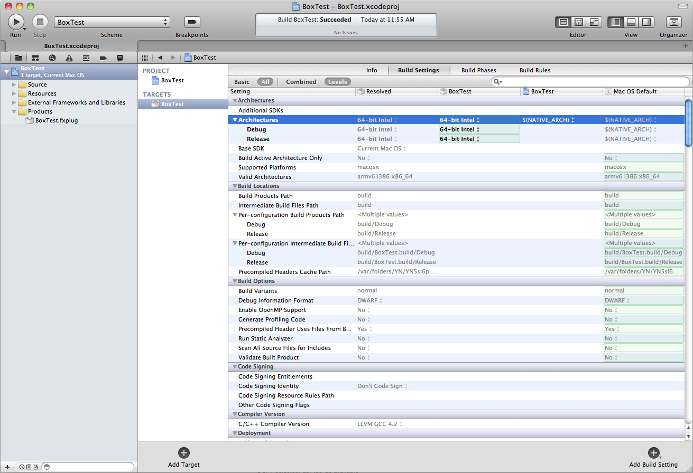

2) Link against the 64-bit version of `FxPlug.framework` and `PluginManager.framework` (if your project requires it)

To do this, first remove the 32-bit `FxPlug.framework` and `PluginManager.framework` from your project. When prompted, be sure to select the "Remove Reference Only" option.

Add the 64-bit `FxPlug.framework` and `PluginManager.framework` by following these steps:

- Select the target
- Click on the "Build Phases" tab
- Under "Link Binary With Libraries", click on the + sign
- Click "Add Other..."
- Navigate to `/Developer/Examples/FxPlug/`
- Select `FxPlug.framework` and `PluginManager.framework` and click "Open"

__Note:__ When you install the FxPlug 2.0 SDK, the 64-bit `FxPlug.framework` and `PluginManager.framework` are installed in `/Developer/Examples/FxPlug/`. If you have an older version of each in `/Library/Frameworks/`, they will remain there.

__Figure 2__  Adding frameworks

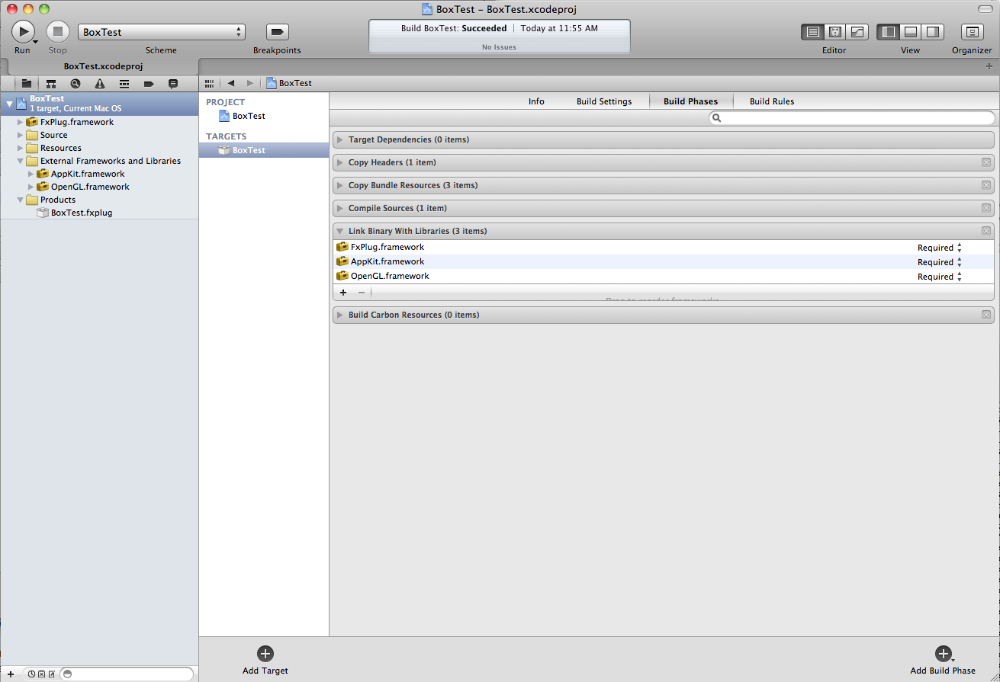

3) Set your active executable to Motion 5

To do this, choose "Edit Scheme" from the "Scheme" pop-up and choose Motion 5 as the product you want to run.

__Figure 3__  Setting the active executable

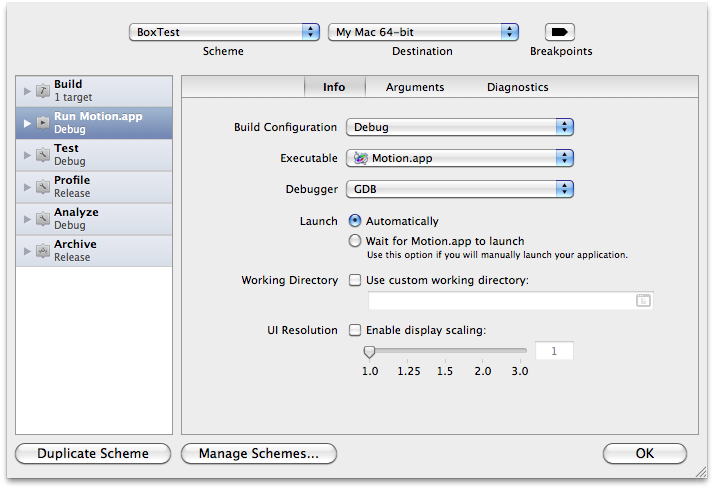

4) Update method signatures and properties.

Find in your code all method parameters of `UInt32` type and change them to `NSUInteger`. An example of such a method is `-getOutputWidth:height:withInput:withInfo:`. You also need to update your plugin's `-properties` method to remove the `kFxPropertyKey_EquivalentSMPTEWipeCode` key and its corresponding value, as this key is no longer used by the host applications.

At this point you should be able to build a 64-bit plug-in that is loaded by Motion 5 if you aren't using any APIs or libraries that are not 64-bit compatible. If you are, you'll need to update your code and/or libraries to be 64-bit compatible.

[Back to Top](#)

## Building a Universal FxPlug

You can also choose to build a single universal plug-in that works in both 32 and 64-bit, but it's generally a much more tedious process. See below for the steps to make a universal 32/64-bit FxPlug from an existing 32-bit FxPlug. For convenience, we refer the name of your plug-in to <PLUG-IN_NAME>.

1) Create a copy of your existing target

To do this, select the 32-bit target, right or control click on it, and choose "Duplicate" from the menu.

__Figure 4__  Selecting Duplicate from the control-click menu

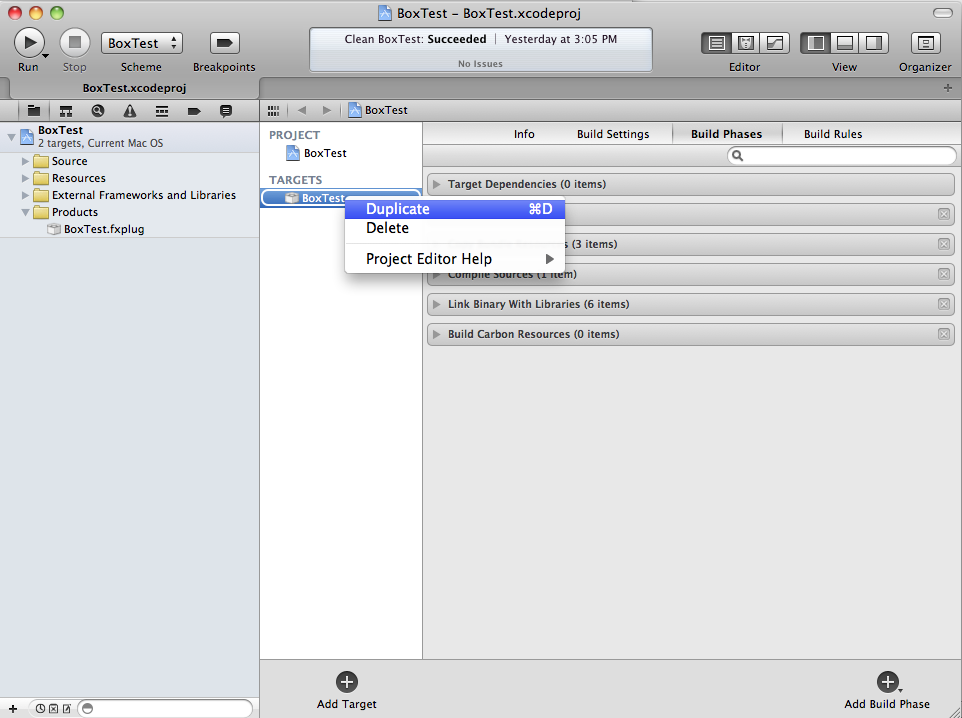

__Figure 5__  The resulting target copy

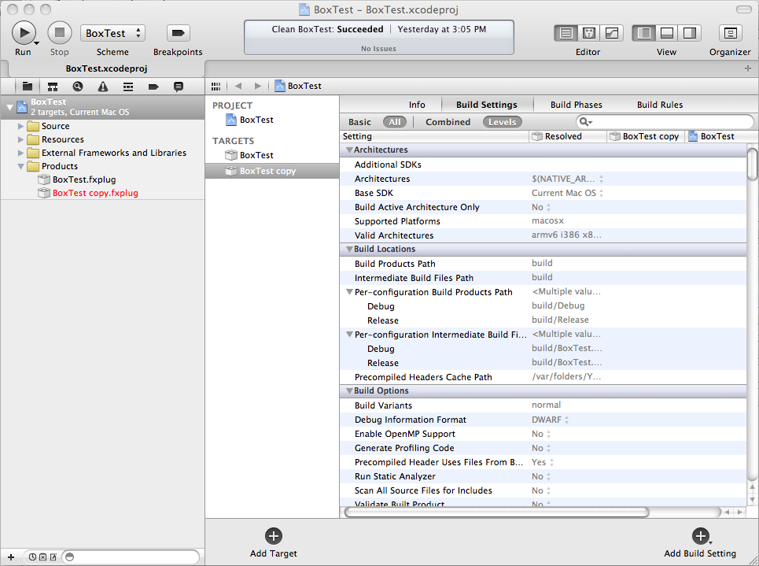

2) Rename the original target and its associated product to <PLUG-IN_NAME>32bit.

__Note:__ The name of the target does not have to be the same as the name of its product. You could name the target anything that you think is appropriate.

To change the name of the product, select the target, click on the "Build Settings" tab, look for "Product Name" in the "Packaging" section, and type in the name you want to change it to. You'll notice the entry in the "Products" group in the navigator changes.

__Figure 6__  Renaming the original target and product

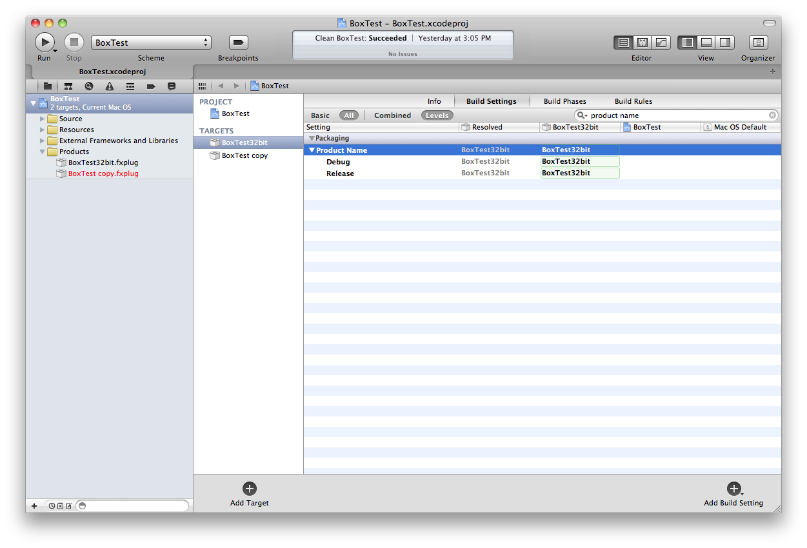

3) Similarly, rename the newly-created target to something appropriate such as <PLUG-IN_NAME>64bit. Rename its associated product to be exactly <PLUG-IN_NAME>, as we will make this product a universal one.

__Figure 7__  Renaming the new target and product

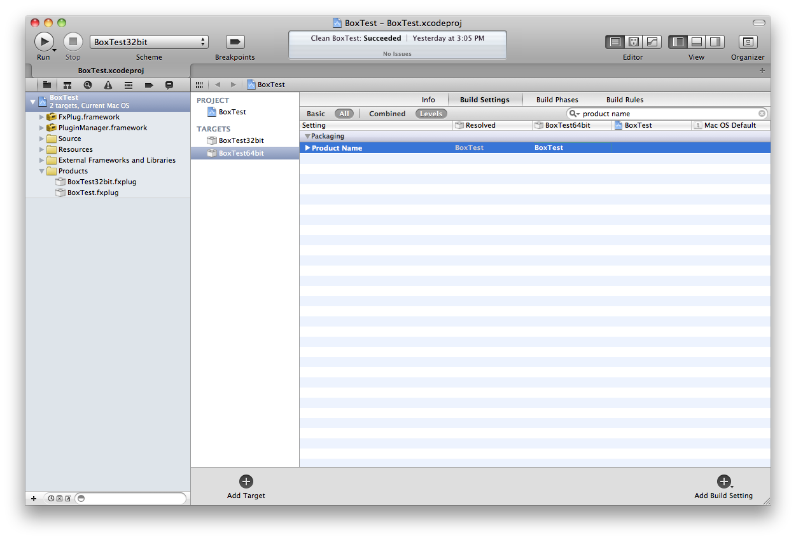

4) By default, Xcode 4 automatically creates schemes when creating each target, so rename the schemes for consistency.

To do this, select "Manage Schemes..." from the "Scheme" pop-up.

__Figure 8__  Selecting Manage Schemes...

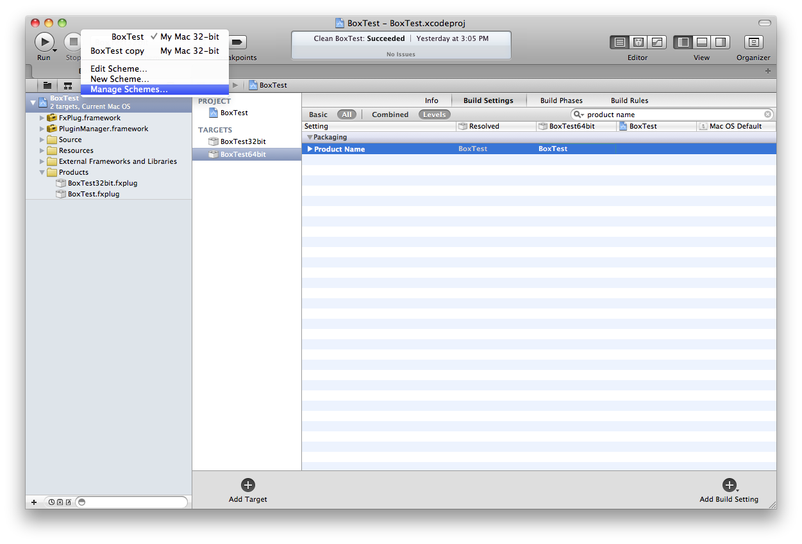

__Figure 9__  Renaming existing schemes

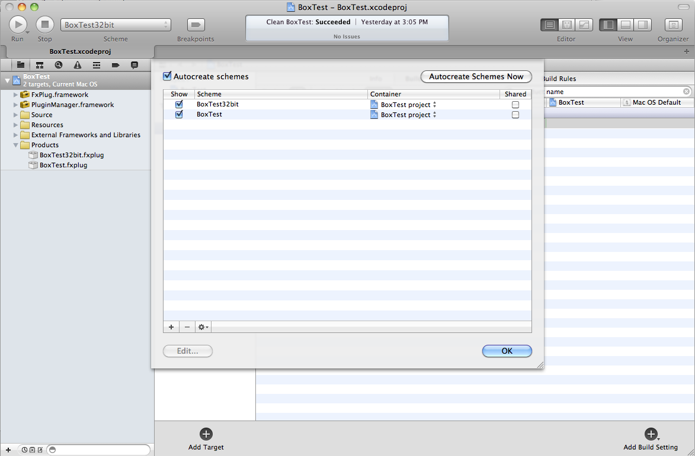

5) Make this new target 64-bit by following the procedures outlined above in the section: [Building a 64-bit FxPlug](#apple-f4xwc4dqnrsv64tfmyxwi33df52wszbpirkfgnbqgaytcmjuhawugsbrfvke4vcbi4za). Again if you are using any APIs or libraries that are not 64-bit compatible, you'll need to update your code and/or libraries to be 64-bit compatible.

6) Create a new Aggregate style target.

To do this, click on the "Add Target" button at the bottom and select the "Aggregate" template under the "Other" category.

__Figure 10__  Creating an Aggregate style target

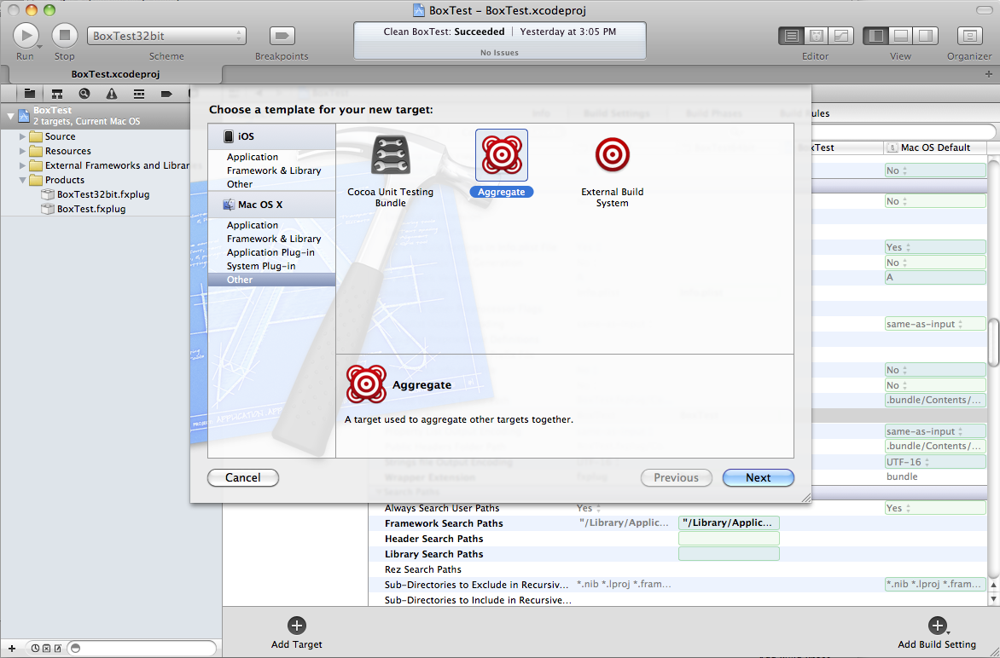

Enter <PLUG-IN_NAME> in the "Product Name" box in the next page and click "Finish".

__Figure 11__  Entering your plug-in name

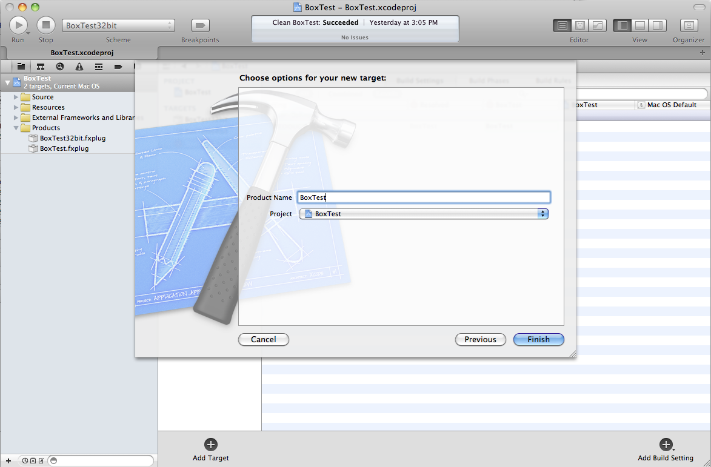

7) Switch to this Aggregate target. Click on the "Build Phases" tab. Make the 32-bit and 64-bit targets be dependencies of the Aggregate target.

__Figure 12__  Adding dependencies

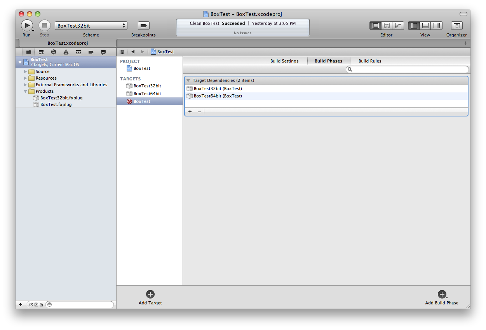

8) Add a "Run Script" build phase to the aggregate target.

To do this, click on the "Add Build Phase" button at the bottom and select "Add Run Script".

__Figure 13__  Adding a build phase

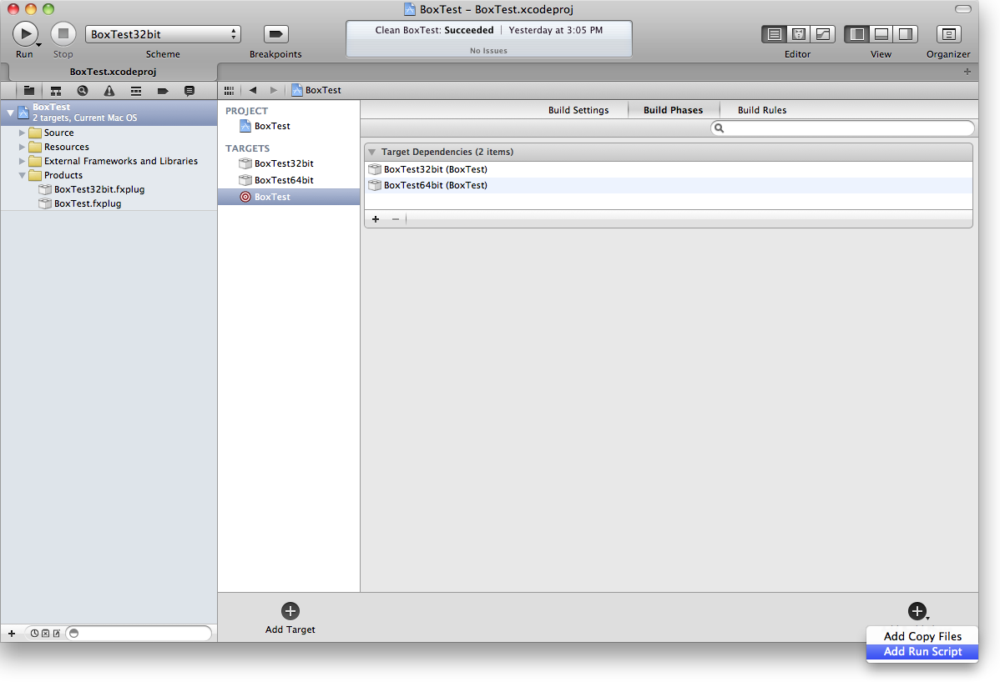

Enter the following listing as the text of the script, replacing <PLUG-IN_NAME> with the actual name of your plug-in.

__Listing 1__  Running script when building the aggregate target

```
# Remove the 32-bit variant if it exists or the next lipo call will fail lipo ${BUILD_DIR}/${CONFIGURATION}/<PLUG-IN_NAME>.fxplug/Contents/MacOS/<PLUG-IN_NAME> -output ${BUILD_DIR}/${CONFIGURATION}/<PLUG-IN_NAME>.fxplug/Contents/MacOS/<PLUG-IN_NAME> -thin x86_64  # Add in the newly build 32-bit variant to the 64-bit variant lipo ${BUILD_DIR}/${CONFIGURATION}/<PLUG-IN_NAME>.fxplug/Contents/MacOS/<PLUG-IN_NAME> ${BUILD_DIR}/${CONFIGURATION}/<PLUG-IN_NAME>32bit.fxplug/Contents/MacOS/<PLUG-IN_NAME>32bit -output ${BUILD_DIR}/${CONFIGURATION}/<PLUG-IN_NAME>.fxplug/Contents/MacOS/<PLUG-IN_NAME> -create
```

__Figure 14__  Entering the content of the script

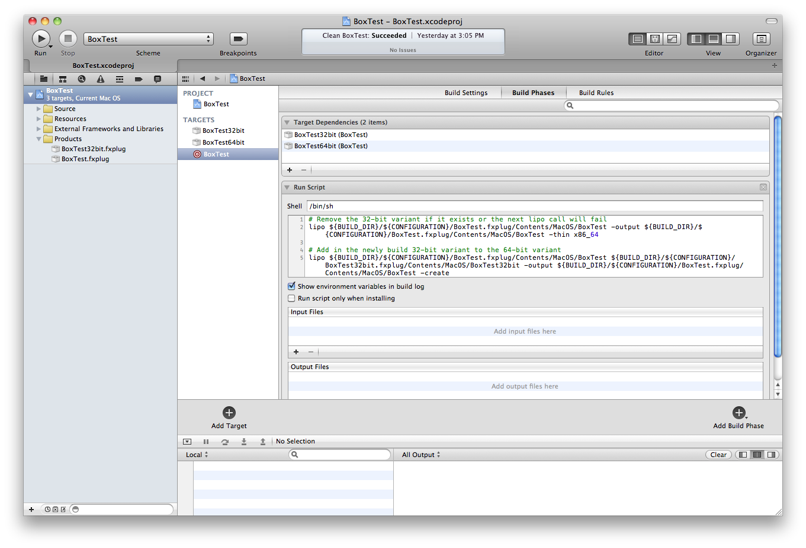

9) Select the corresponding scheme of the Aggregate target from the "Scheme" pop-up. Clean and build the Aggregate target. Copy the resulting FxPlug into the Plug-Ins folder or make a sym-link to the built binary as you normally would.

[Back to Top](#)

---

#### Document Revision History

| __Date__ | __Notes__ |
| 2011-07-12 | New document that discusses how to build 64-bit and universal 32/64-bit FxPlugs for Motion 5, Final Cut Pro X and the FxPlug 2.0 SDK. |

