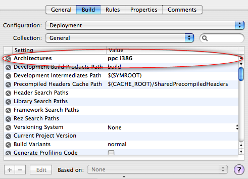
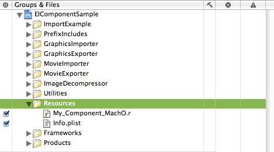
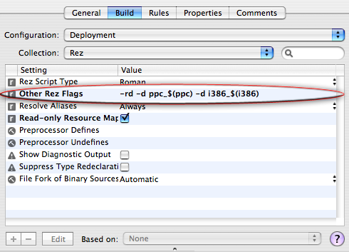
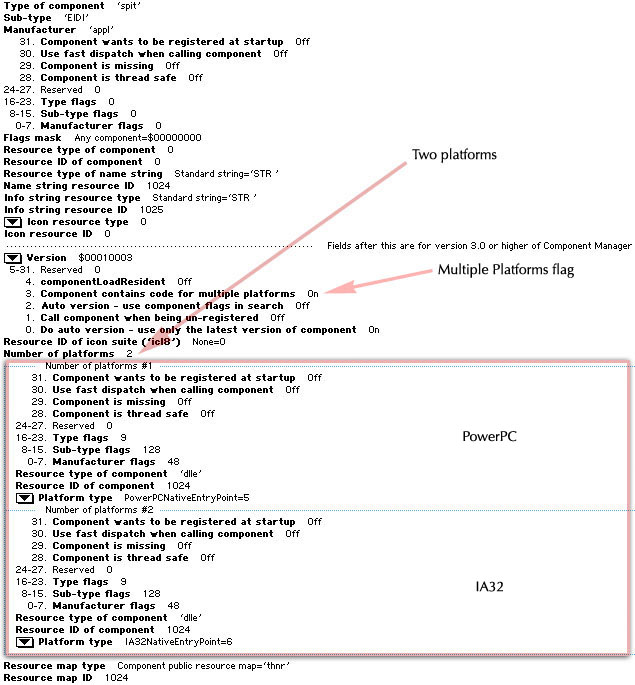

> 导航：[总目录](../../README.md) · [technotes](../../_indexes/technotes.md)


# Retired Document

__Important:__
This document may not represent best practices for current development. Links to downloads and other resources may no longer be valid.

Technical Note TN2012

# Building Universal QuickTime Components for Mac OS X

__Important:__ This document may not represent best practices for current development. Links to downloads and other resources may no longer be valid.

This technical note discusses building Carbon Mach-O QuickTime Components for Mac OS X and demonstrates how to configure a Component Manager thing (`'thng'`) resource to build universal binary components supporting both PowerPC-based and Intel-based Macintoshes.

[Binary Formats](#apple-f4xwc4dqnrsv64tfmyxwi33df52wszbpirkfgmjqgaydgmbvgewugsbrfvke4vcbi44da)[Mach-O Components](#apple-f4xwc4dqnrsv64tfmyxwi33df52wszbpirkfgmjqgaydgmbvgewugsbrfvke4vcbi44de)[Universal Binary Components](#apple-f4xwc4dqnrsv64tfmyxwi33df52wszbpirkfgmjqgaydgmbvgewugsbrfvke4vcbi44di)[Bundled Components](#apple-f4xwc4dqnrsv64tfmyxwi33df52wszbpirkfgmjqgaydgmbvgewugsbrfvke4vcbi44dg)[lipo](#apple-f4xwc4dqnrsv64tfmyxwi33df52wszbpirkfgmjqgaydgmbvgewugsbrfvke4vcbi4zde)[Rosetta](#apple-f4xwc4dqnrsv64tfmyxwi33df52wszbpirkfgmjqgaydgmbvgewugsbrfvke4vcbi4ytc)[File Extension and Location](#apple-f4xwc4dqnrsv64tfmyxwi33df52wszbpirkfgmjqgaydgmbvgewugsbrfvke4vcbi43a)[Sample Code](#apple-f4xwc4dqnrsv64tfmyxwi33df52wszbpirkfgmjqgaydgmbvgewugsbrfvke4vcbi43q)[References](#apple-f4xwc4dqnrsv64tfmyxwi33df52wszbpirkfgmjqgaydgmbvgewugsbrfvke4vcbi44q)[Document Revision History](#apple-f4xwc4dqnrsv64tfmyxwi33df52wszbpirkfgmjqgaydgmbvgewvezlwnfzws33ojbuxg5dpoj4s2rdpnz2ey2lonncwyzlnmvxhiskel4yq)

## Binary Formats

Mac OS X supports two application binary formats; Mach-O and CFM.

Mach-O is the native Mac OS X object format and is supported by the gcc compiler and Xcode.

CFM (Code Fragment Manager) is the legacy format used on Power Macintosh Computers running traditional Mac OS and is supported by compilers such as Metrowerks CodeWarrior.

While Carbon components for Mac OS X may be built as Mach-O or CFM code, the use of CFM is no longer recommended. More importantly, Mach-O is the only binary format that has the capability to run natively on an Intel-based Macintosh.

If you're building a new component, start with the latest version of Xcode (2.1 or greater) and build a universal binary component (this is a single component binary containing code that will run on PowerPC and Intel-based Macintoshes). If you're updating an older component, you'll first need to move to the latest version of Xcode then update your components code as needed. See the [References](#apple-f4xwc4dqnrsv64tfmyxwi33df52wszbpirkfgmjqgaydgmbvgewugsbrfvke4vcbi44q) section at the end of this document for links to documentation aimed at developers transitioning to Xcode.

__Note:__ While CodeWarrior does have the ability to build Mach-O binaries, it can't build universal binaries that will run natively on both PowerPC and Intel-based Macintosh computers.

[Back to Top](#)

## Mach-O Components

Mach-O components for Mac OS X contain a dynamic library (dylib) in their data fork and are built using similar mechanisms to those for traditional Mac OS with the following differences:

- The entry point is found by symbol name using the same mechanism as on Windows -- the "code resource type" is `'dlle'` and the `'dlle'` resource contains a C string which is the exported symbol name. See Listing 1.
- If you're building a component for a PowerPC-based Macintosh, the platform type should be `platformPowerPCNativeEntryPoint` and not `platformPowerPC`. See Listing 2.
- If you're building a component for an Intel-based Macintosh, the platform type should be `platformIA32NativeEntryPoint`. See Listing 3.

__Listing 1__  Mach-O & Windows Entry Point.

```
// Code Entry Point for PowerPC-based & Intel-based Macs and Windows
resource 'dlle' (256) {
    "MyComponentDispatch"
};
```

__Listing 2__  Mach-O PowerPC-based Mac `'thng'` Resource.

```c
// extended 'thng' template
#define thng_RezTemplateVersion 1

#include <Carbon/Carbon.r>
#include <QuickTime/QuickTime.r>

resource 'thng' (256) {
    kSomeComponentType, // Type
    'DEMO',             // SubType
    'DEMO',             // Manufacturer
    0,                  // use componentHasMultiplePlatforms
    0,
    0,
    0,
    'STR ',             // Name Type
    128,                // Name ID
    'STR ',             // Info Type
    129,                // Info ID
    0,                  // Icon Type
    0,                  // Icon ID
    kMyComponentVersion,  // Version
    componentHasMultiplePlatforms + // Registration Flags
    myComponentRegistrationFlags,
    0,                  // Resource ID of Icon Family
    {
      kMyComponentFlags,
      'dlle',           // Entry point found by symbol name 'dlle' resource
      256,              // ID of 'dlle' resource
      platformPowerPCNativeEntryPoint, // Architecture
    };
};
```

__Listing 3__  Mach-O Intel-based Mac `'thng'` Resource.

```c
// extended 'thng' template
#define thng_RezTemplateVersion 1

#include <Carbon/Carbon.r>
#include <QuickTime/QuickTime.r>

resource 'thng' (256) {
    kSomeComponentType, // Type
    'DEMO',             // SubType
    'DEMO',             // Manufacturer
    0,                  // use componentHasMultiplePlatforms
    0,
    0,
    0,
    'STR ',             // Name Type
    128,                // Name ID
    'STR ',             // Info Type
    129,                // Info ID
    0,                  // Icon Type
    0,                  // Icon ID
    kMyComponentVersion,  // Version
    componentHasMultiplePlatforms + // Registration Flags
    myComponentRegistrationFlags,
    0,                  // Resource ID of Icon Family
    {
      kMyComponentFlags,
      'dlle',           // Entry point found by symbol name 'dlle' resource
      256,              // ID of 'dlle' resource
      platformIA32NativeEntryPoint, // Architecture
    };
};
```

### Universal Binary Components

#### Architecture settings

Once you've set the target architecture settings to build both `ppc` and `i386` and set the `SDKROOT` as described in the [Building Universal Binary Programming Guidelines](https://developer.apple.com/documentation/MacOSX/Conceptual/universal_binary/) document, you're all set to build a universal binary Component. See Figure 1.

__Figure 1__  Xcode architecture target settings.



#### ComponentPlatformInfo

The Component Manager however, recognizes which architectures a QuickTime component supports by looking at the components `'thng'` resource and not the architecture of the binary file. Specifically, the Component Manager looks at the `ComponentPlatformInfo` array within the `'thng'` resource.

Because the "platform" information in the `'thng'` resource is an array of multiple `ComponentPlatformInfo` entries, it's easy to build a single component supporting multiple architectures. On traditional Mac OS, 68k/PPC "FAT" components were built this way, and included two entries specifying the appropriate architectures as part of this platform array.

Building a Mach-O universal binary component today is no different, simply specify both `platformPowerPCNativeEntryPoint` and `platformIA32NativeEntryPoint` architectures in the `ComponentPlatformInfo` array as shown in Listing 4.

__Listing 4__  Universal Binary Component `'thng'` Resource.

```c
// File : My_Component.r

// extended 'thng' template
#define thng_RezTemplateVersion 1

#if TARGET_REZ_CARBON_MACHO
    #include <Carbon/Carbon.r>
    #include <QuickTime/QuickTime.r>
#else
    #include "ConditionalMacros.r"
    #include "MacTypes.r"
    #include "Components.r"
    #include "QuickTimeComponents.r"
    #include "ImageCompression.r"
#endif

resource 'thng' (256) {
    kSomeComponentType, // Type
    'DEMO',             // SubType
    'DEMO',             // Manufacturer
    0,                  // use componentHasMultiplePlatforms
    0,
    0,
    0,
    'STR ',             // Name Type
    128,                // Name ID
    'STR ',             // Info Type
    129,                // Info ID
    0,                  // Icon Type
    0,                  // Icon ID
    kMyComponentVersion,  // Version
    componentHasMultiplePlatforms + // Registration Flags
    myComponentRegistrationFlags,
    0,                  // Resource ID of Icon Family
    { // COMPONENT PLATFORM INFORMATION ----------------------
#if TARGET_OS_MAC
    #if TARGET_REZ_CARBON_MACHO
        #if !(TARGET_REZ_MAC_PPC || TARGET_REZ_MAC_X86)
            #error "Platform architecture not defined!"
        #endif
        #if TARGET_REZ_MAC_PPC
              kMyComponentFlags,
              'dlle',
              256,
              platformPowerPCNativeEntryPoint,  // PowerPC-based Macintosh
        #endif
        #if TARGET_REZ_MAC_X86
              kMyComponentFlags,
              'dlle',
              256,
              platformIA32NativeEntryPoint,     // Intel-based Macintosh
        #endif
    #else
        #error "TARGET_REZ_CARBON_MACHO should be defined."
    #endif
#elif TARGET_OS_WIN32
    #if TARGET_REZ_WIN32
        kMyComponentFlags,
        'dlle',
        256,
        platformWin32,
    #else
        #error "TARGET_REZ_WIN32 should be defined."
    #endif
#else
    #error "I have no idea what you're trying to do!"
#endif
    };
};
```

#### Resource File Defines

One easy way to setup your component resource files is to include a master resource ( .r ) file that defines the appropriate `TARGET_REZ_XXX_XXX` identifiers, then include all the other individual component resource ( .r ) files from within that master file. See Figure 2.

Listing 5 shows what a master resource file might look like. Note how this file sets the appropriate defines then includes the specific component resource file called `My_Component.r`.

__Figure 2__  Adding a single master resource file.



__Listing 5__  Master resource file.

```c
// File : My_Component_MachO.r
//
//
// Mac OS X Mach-O Component: Set TARGET_REZ_CARBON_MACHO to 1
//
// In the target settings of your Xcode project, add one or both of the
// following defines to your OTHER_REZFLAGS depending on the type of component
// you want to build:
//
//      PPC only: -d ppc_$(ppc)
//      x86 only: -d i386_$(i386)
//      Universal Binary: -d ppc_$(ppc) -d i386_$(i386)
//
// Windows Component: Set TARGET_REZ_CARBON_MACHO to 0
// ---------------------------------------------------

// Set to 1 == building Mac OS X
#define TARGET_REZ_CARBON_MACHO 1

#if TARGET_REZ_CARBON_MACHO
    #if defined(ppc_YES)
        // PPC architecture
        #define TARGET_REZ_MAC_PPC 1
    #else
        #define TARGET_REZ_MAC_PPC 0
    #endif

    #if defined(i386_YES)
        // x86 architecture
        #define TARGET_REZ_MAC_X86 1
    #else
        #define TARGET_REZ_MAC_X86 0
    #endif

    #define TARGET_REZ_WIN32 0
#else
    // Must be building on Windows
    #define TARGET_REZ_WIN32 1
#endif

// include the individual component resource files
#include "My_Component.r"
```

#### Other Rez Flags

`My_Component_MachO.r` relies on either `ppc_YES` and/or `i386_YES` being defined. Depending on the target architecture you're building for, add one or both of these defines to the Other Rez Flags (`OTHER_REZFLAGS`) Rez settings of your target:

- `-d ppc_$(ppc)` for PPC
- `-d i386_$(i386)` for x86
- `-d ppc_$(ppc) -d i386_$(i386)` for both

__Figure 3__  Setting up defines for Rez.



#### Resourcerer Tool

[Resourcerer](http://www.mathemaesthetics.com/ResorcererIndex.html) from Mathemaesthetics, Inc. is a great utility for QuickTime component developers. You can use it to view and edit resources and quickly check the correctness of your `'thng'` resource. Figure 4 shows a `'thng'` resource built in a universal binary configuration with two entries in it's `ComponentPlatformInfo` array.

__Figure 4__  Universal Binary Component `'thng'` viewed in Resourcerer.



### Bundled Components

A [Bundle](https://developer.apple.com/documentation/CoreFoundation/Conceptual/CFBundles/CFBundles.html) is a directory in the file system that groups related resources together in one place. Xcode allows building components as both bundles and single file dylibs. QuickTime components however, should be built as Mac OS X bundles. Building a single file Mach-O component dylib is not recommended.

Developers having older components configured as a single file binary should update their targets and build component bundles. Additionally, developers using older tools should make sure [not to build resources into the resource fork of a Mach-O binary](https://developer.apple.com/qa/qa2001/qa1175.html).

To build a component bundle, select 'Carbon Bundle' from Xcode's 'New Project' dialog or 'Loadable Bundle' from the 'New Target' dialog if you're adding a target to an existing Xcode project.

[Back to Top](#)

## lipo

The `lipo` command is used by Xcode in the universal binary build process, it creates and operates on universal binaries. By using the `-detailed_info` option, `lipo` can retrieving a list of the architectures built into a universal binary file. See Listing 6.

__Note:__ For more information about the `lipo` command, type `man lipo` from the Terminal application.

__Listing 6__  Using `lipo` to get information about a universal binary.

```
toronto:~ ed$ lipo -detailed_info /ElectricImageUniversal.component/Contents/MacOS/ElectricImageUniversal

Fat header in: /ElectricImageUniversal.component/Contents/MacOS/ElectricImageUniversal
fat_magic 0xcafebabe
nfat_arch 2
architecture ppc
    cputype CPU_TYPE_POWERPC
    cpusubtype CPU_SUBTYPE_POWERPC_ALL
    offset 4096
    size 128176
    align 2^12 (4096)
architecture i386
    cputype CPU_TYPE_I386
    cpusubtype CPU_SUBTYPE_I386_ALL
    offset 135168
    size 132084
    align 2^12 (4096)
```

[Back to Top](#)

## Rosetta

Rosetta is a translation process that runs a PowerPC binary on an Intel-based Macintosh. This technology allows applications to run as non-native binaries. Rosetta however, does not support mixing native and translated code in a process. It does not provide the equivalent of the traditional Mac OS "Mixed Mode" technology.

PowerPC-only components will __NOT__ load into universal binary applications running natively on an Intel-based Macintosh. This means that components must be built as a universal binary or users will not be able to work with content that requires a non-native component in native applications.

Conversely, applications running under Rosetta will __always__ load the PowerPC version of a universal binary component, never the x86 version. This means that media playback performance will be limited in non-universal applications.

__Important:__ QuickTime component developers are encouraged to build universal binary versions of their components. This will avoid situations where users may encounter difficulty performing expected tasks from within native applications.

[Back to Top](#)

## File Extension and Location

A component files should have a ".component" file name extension and be placed in the /Library/QuickTime directory.

[Back to Top](#)

## Sample Code

The [Electric Image Component](https://developer.apple.com/samplecode/ElectricImageComponent/ElectricImageComponent.html) sample demonstrates the techniques outlined in this document and shows how to build five QuickTime Components; a Graphics Importer, Graphics Exporter, Movie Importer, Movie Exporter, and Image Decompressor, which all work together to allow QuickTime to use Electric Image format image files.

[Back to Top](#)

## References

- [Porting CodeWarrior Projects to Xcode](https://developer.apple.com/documentation/DeveloperTools/Conceptual/MovingProjectsToXcode/index.html)
- [Xcode Tools](https://developer.apple.com/tools/xcode/index.html)
- [Xcode User Guide](https://developer.apple.com/documentation/DeveloperTools/Conceptual/XcodeUserGuide21/Contents/Resources/en.lproj/index.html)
- [Building Universal Binary Programming Guidelines](https://developer.apple.com/documentation/MacOSX/Conceptual/universal_binary/)
- [Developer Transition Kit](https://developer.apple.com/transitionkit.html)

[Back to Top](#)

---

#### Document Revision History

| __Date__ | __Notes__ |
| 2005-07-21 | Updated for Tiger, added universal binary information |
| 2001-03-08 | New document that discusses the changes necessary to build Universal Mach-O QuickTime Components for Mac OS X. |

