> 导航：[总目录](../../README.md) · [technotes](../../_indexes/technotes.md)


Technical Note TN2322

# Building a Cocoa-AppleScript (AppleScriptObjC) Automator Action

This document explains how to use the Cocoa-AppleScript (AppleScriptObjC) Xcode template to create an Automator action.

Xcode includes a template that makes it easy to create Cocoa-AppleScript Automator actions. Building an action with this template consists of the following key steps:

- Build an Xcode project
- Configure action attributes and behavior
- Create an interface for your action
- Add code to your action
- Test the action with Automator
- Build the action
- Install the action

__Note:__ NOTE: Cocoa-AppleScript refers to AppleScriptObjC, which replaced AppleScript Studio in Xcode, effective OS X v10.6. For information on AppleScriptObjC, see the [AppleScriptObjC Release Notes](https://developer.apple.com/library/mac/releasenotes/ScriptingAutomation/RN-AppleScriptObjC/index.html).

[To create a Cocoa-AppleScript Automator action Xcode project:](#apple-f4xwc4dqnrsv64tfmyxwi33df52wszbpirkfgnbqgaytkmjugiwugsbrfvke6x2dkjcucvcfl5av6q2pinhucx2bkbieyrktinjesucul5avkvcpjvavit2sl5augvcjj5hf6wcdj5cekx2qkjhuurkdkrpq)[To configure your action’s attributes and behavior:](#apple-f4xwc4dqnrsv64tfmyxwi33df52wszbpirkfgnbqgaytkmjugiwugsbrfvke6x2dj5hemskhkvjekx2zj5kvex2binkest2ol5pv6u27ifkfiusjijkvirktl5au4rc7ijcuqqkwjfhvexy)[To create an interface for your action:](#apple-f4xwc4dqnrsv64tfmyxwi33df52wszbpirkfgnbqgaytkmjugiwugsbrfvke6x2dkjcucvcfl5au4x2jjzkekusgifbukx2gj5jf6wkpkvjf6qkdkreu6ts7)[To map a parameter to an interface element attribute:](#apple-f4xwc4dqnrsv64tfmyxwi33df52wszbpirkfgnbqgaytkmjugiwugsbrfvke6x2nifif6qk7kbaveqknivkekus7krhv6qkol5eu4vcfkjdecq2fl5cuyrknivhfix2bkrkfeskckvkekxy)[To add code to your action:](#apple-f4xwc4dqnrsv64tfmyxwi33df52wszbpirkfgnbqgaytkmjugiwugsbrfvke6x2bircf6q2pircv6vcpl5mu6vksl5augvcjj5hf6)[To retrieve a parameter value in your AppleScript code:](#apple-f4xwc4dqnrsv64tfmyxwi33df52wszbpirkfgnbqgaytkmjugiwugsbrfvke6x2sivkfeskfkzcv6qk7kbaveqknivkekus7kzauyvkfl5eu4x2zj5kvex2bkbieyrktinjesucul5bu6rcfl4)[To test your action with Automator:](#apple-f4xwc4dqnrsv64tfmyxwi33df52wszbpirkfgnbqgaytkmjugiwugsbrfvke6x2uivjvix2zj5kvex2binkest2ol5lusvcil5avkvcpjvavit2sl4)[To build and install your action:](#apple-f4xwc4dqnrsv64tfmyxwi33df52wszbpirkfgnbqgaytkmjugiwugsbrfvke6x2ckveuyrc7ifheix2jjzjviqkmjrpvst2vkjpucq2ujfhu4xy)[Document Revision History](#apple-f4xwc4dqnrsv64tfmyxwi33df52wszbpirkfgnbqgaytkmjugiwvezlwnfzws33ojbuxg5dpoj4s2rdpnz2ey2lonncwyzlnmvxhiskel4yq)

## To create a Cocoa-AppleScript Automator action Xcode project:

- Launch Xcode.
- Choose File > New > Project from the menu bar, or press Command-Shift-N.
- In the Xcode template selection dialog, click System Plug-in > Automator Action, and then, click Next.

__Figure 1__

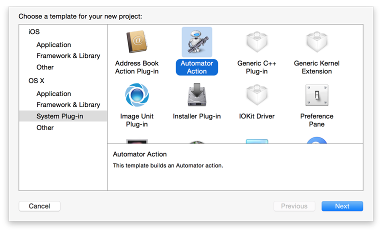

- Enter a name for your Automator action, your organization name, and identifier, and then select Cocoa-AppleScript from the Type pop-up menu.

__Figure 2__

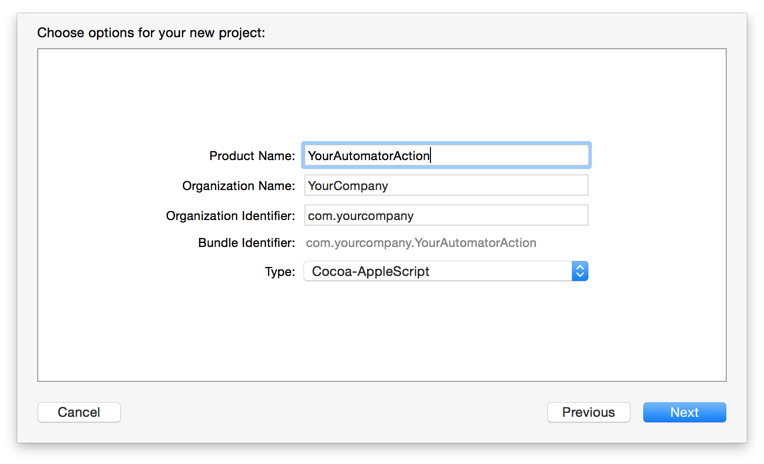

- Choose a location for the action project, and click Create.

__Figure 3__

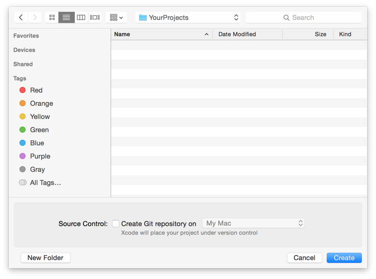

Your project is saved where you specified, and Xcode opens it in a new window. The next step is to configure attributes for your action and its behavior.

[Back to Top](#)

## To configure your action’s attributes and behavior:

- Click on your action project in the Xcode project navigator.

__Figure 4__

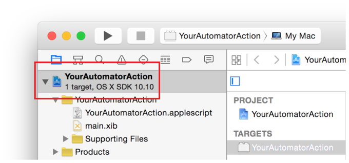

- In the editor area, select the target for your project.

__Figure 5__

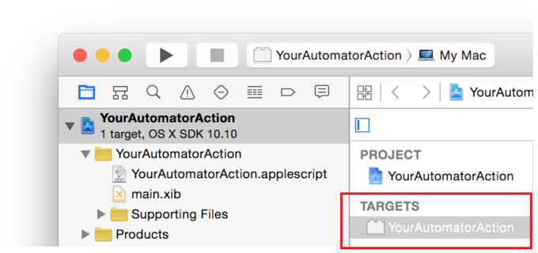

- Select a category, and enter the application your action will target. These settings control how your action is organized and found by users within the Automator action library.

__Figure 6__

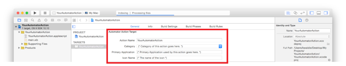

- In the Description area, enter a summary (required) for your action, and fill in any other optional fields you may need. This content will appear in the description area when the action is selected in the Automator action library. Be detailed, because end users will refer to this information in order to determine what your action does and how to configure it.

__Figure 7__

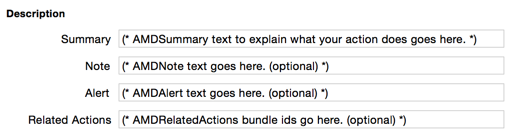

- Click Input, and specify the type of input your action will accept. If input is not required, select the Optional checkbox. If helpful to the user, consider expanding on the action’s input type by providing a detailed description.

__Figure 8__

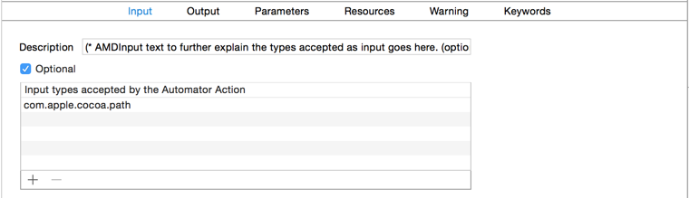

__Note:__ For information on the types of input an action can accept and the types of output an action can provide, see [Type Identifiers](https://developer.apple.com/library/mac/documentation/AppleApplications/Conceptual/AutomatorConcepts/Articles/AutomatorPropRef.html#//apple_ref/doc/uid/TP40001515-101803-BCIFFIAA) in the [Automator Programming Guide](https://developer.apple.com/library/mac/documentation/AppleApplications/Conceptual/AutomatorConcepts/Automator.html).

- Click Output, and specify the type of output your action will provide. Optionally, specify a more detailed description of the output.

__Figure 9__

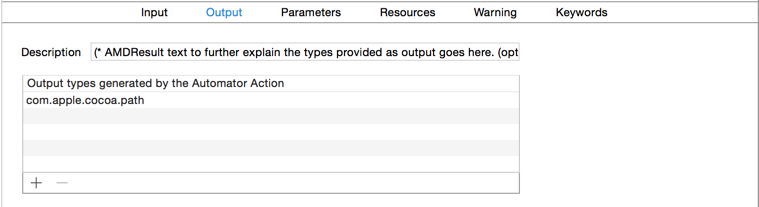

- Click Parameters, and add any parameters for your action. Parameters are configuration values that are typically bound to elements in your action’s interface. For example, a parameter may be a value for a text field, the selected state of a checkbox, or the enabled state of a button. Parameters enable your action to display a certain state when added to a workflow, and provide information back to your action’s code about any configuration changes the user may have made.

__Figure 10__

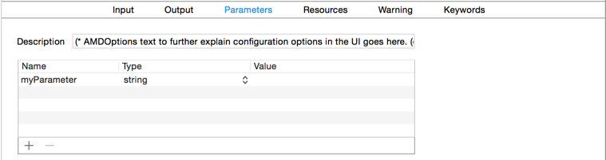

- If your action requires any resources, such as specific app versions or files, click Resources and add them.

__Figure 11__

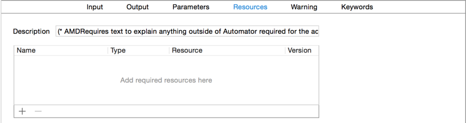

- If your action requires a warning message when added to the workflow, click Warning and provide the necessary details. Note that any action that will modify the user’s data in a manner which cannot be undone should include a warning. For these types of actions, set the warning Level pop-up menu to Irreversible.

__Figure 12__

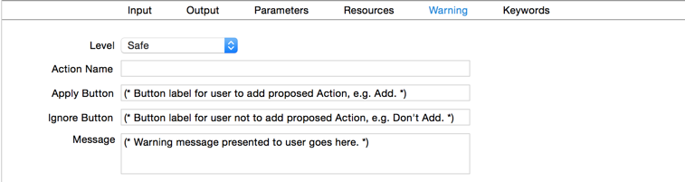

- Click Keywords, and add keywords that may pertain to your action. Keywords are queried when a user searches for an action, so it’s important to provide variations that a user might enter. For example, if your action processes Address Book records, you might specify the following keywords: card, contacts, people, person, and vcard. Providing a range of good keywords will make your action more findable.

__Figure 13__

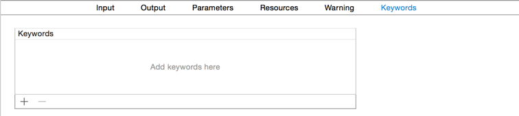

Not all Automator actions require an interface. Some actions simply receive input, process it, and produce a result. For example, the Eject Disk action that’s included with Automator doesn’t have any configurable settings. It just receives one or more disks as input, ejects them, and moves on to the next action in the workflow. Because there’s nothing to configure, this action doesn’t have an interface.

[Back to Top](#)

## To create an interface for your action:

- Click main.xib in the Xcode Project Navigator.

__Figure 14__

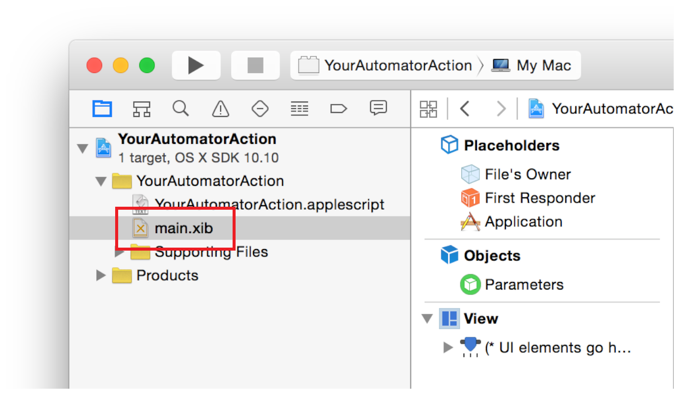

- Click the default view, which is included in the Cocoa-AppleScript template.

__Figure 15__

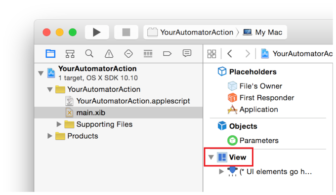

__Figure 16__

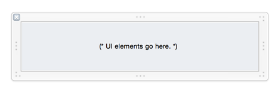

- Add the desired interface elements to the view.

__Figure 17__

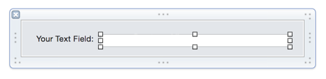

When adding interface elements to an Automator action view, adhere to the following design guidelines:

- Allow a 10-point margin between the edge of the action view and any interface elements.
- Don’t use labels to repeat information that already exists in the action’s name or description.
- Minimize the use of vertical space. For example, consider using pop-up menus instead of radio buttons.
- Use small-size interface elements.
- Use progress indicators to indicate when an interface element is busy loading its content.
- Follow the [OS X Human Interface Guidelines](https://developer.apple.com/library/mac/documentation/UserExperience/Conceptual/OSXHIGuidelines/index.html#//apple_ref/doc/uid/20000957).

[Back to Top](#)

## To map a parameter to an interface element attribute:

- Select the interface element in the main.xib view.

__Figure 18__

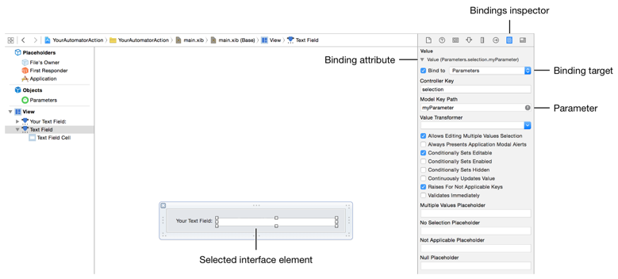

- Click the Bindings inspector in the Utilities pane, or press Command-Option-7.
- Locate the desired binding attribute, and click its disclosure triangle to expand it.
- Set the binding target to bind the attribute to Parameters.
- Enter the parameter name, which you specified when you configured your action’s attributes and behavior, into the Model Key Path field.

[Back to Top](#)

## To add code to your action:

- Click yourprojectname.applescript in the Xcode project navigator.

__Figure 19__

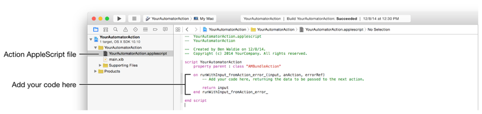

- Enter the desired processing code into the runWithInput_fromAction_error_ handler.

[Back to Top](#)

## To retrieve a parameter value in your AppleScript code:

Call valueForKey for the parameters method of the action, passing it the name of the parameter you wish to retrieve. For example:

__Listing 1__

```
valueForKey_("myParameter") of parameters() of me
```

__Figure 20__

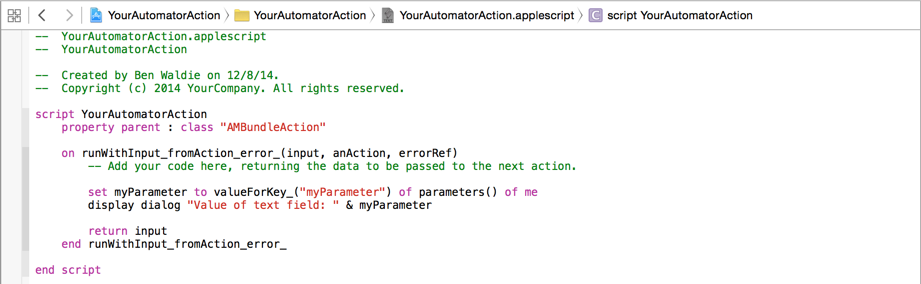

In order to test an Automator action Xcode project, you need to do two things. First, you need to set Automator as the run executable for the project. Second, you need to provide an argument that tells Automator where to find your action.

[Back to Top](#)

## To test your action with Automator:

- Choose Product > Scheme > Edit Scheme to open the scheme editor dialog.

__Figure 21__

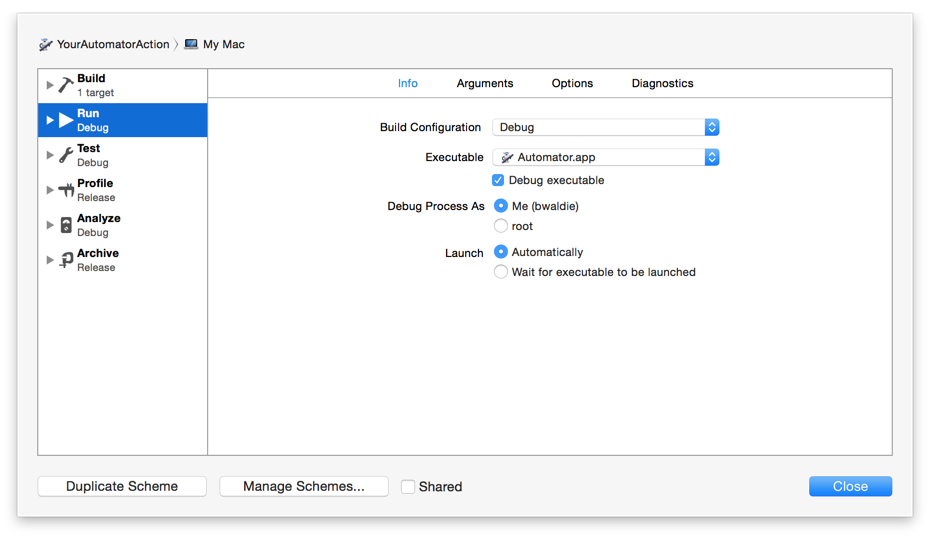

- In the list along the left side of scheme editor dialog, click Run.
- Set the Executable pop-up menu to Automator. Choose Other from the pop-up menu, and navigate to Automator in `/Applications`.
- Click Arguments.
- In the Arguments Passed On Launch area, click the Add button (+) to add a new argument. Set the argument to:

__Listing 2__

```
-action "$(BUILT_PRODUCTS_DIR)/$(FULL_PRODUCT_NAME)"
```

__Figure 22__

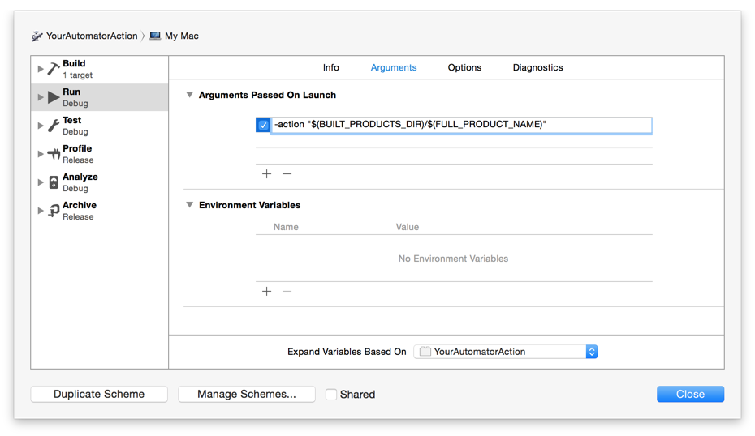

- Click Close to close the scheme editor dialog.

After configuring your Xcode project as described above, choose Product > Run or enter Command-R. An instance of Automator should launch and load your action. You can search the Automator action library to find it. Now, you can test your action and return to Xcode when you’re done to stop testing and resume development.

__Figure 23__

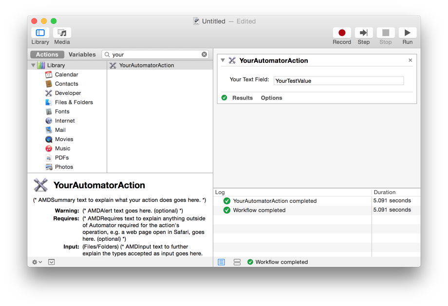[Back to Top](#)

## To build and install your action:

- Choose Product > Archive to display the archives pane of the organizer window.

__Figure 24__

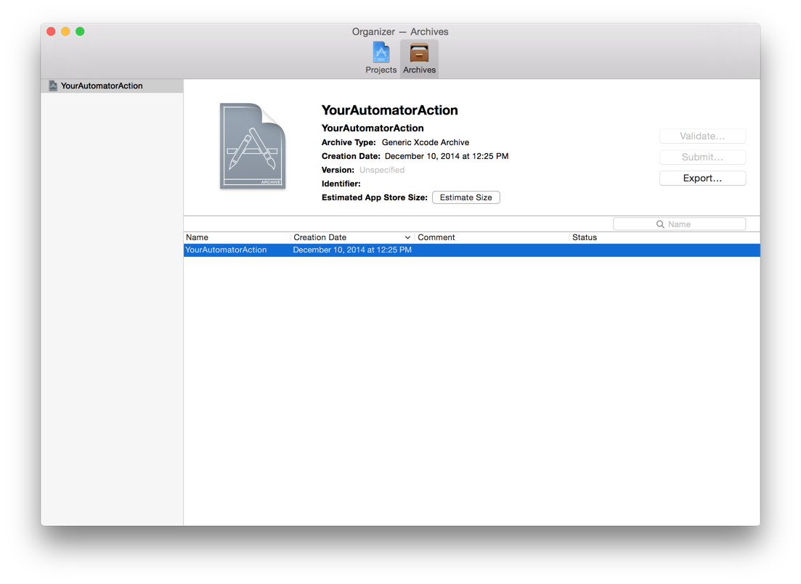

- Select the archive of your action, and click Export.
- Click Save Built Products, and click Next

__Figure 25__

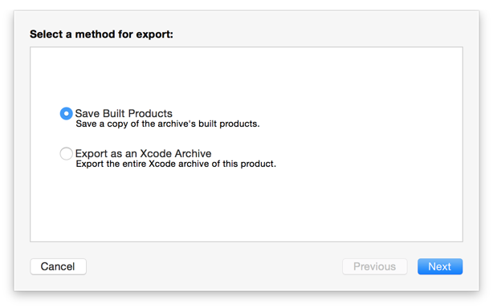

- Choose a location to save your action, and click Export.

__Figure 26__

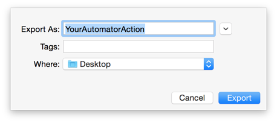

After you’ve exported your action, it can be installed into one of the following locations:

`/Library/Automator/` - Install it here to make it available to all users.

`~/Library/Automator/` - Install it here to make it available to the current user.

When Automator launches, it scans these folders and loads any actions that it finds.

If you’re an app developer, you can install the action into a `/Contents/Library/Automator/` directory within your app bundle and Automator will find it there, too.

[Back to Top](#)

---

#### Document Revision History

| __Date__ | __Notes__ |
| 2015-01-26 | New document that explains how to create a Cocoa-AppleScript (AppleScriptObjC) Automator action. |

