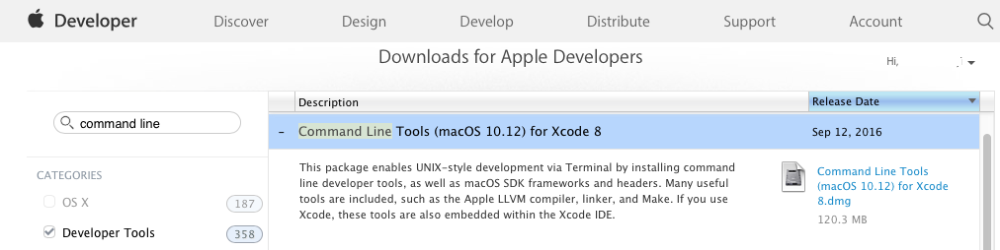
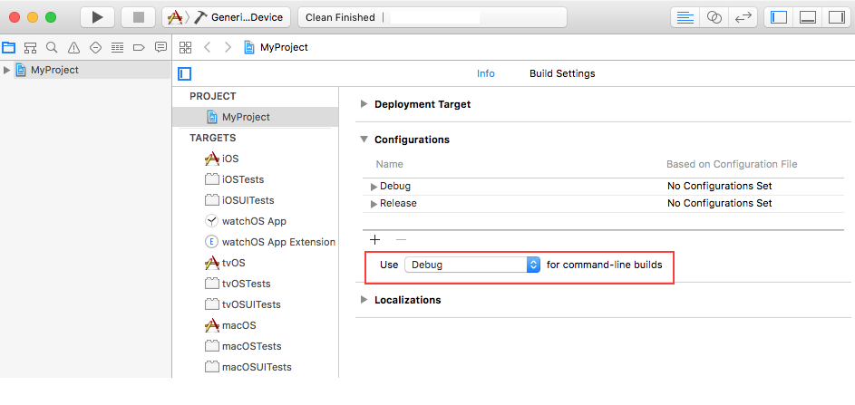
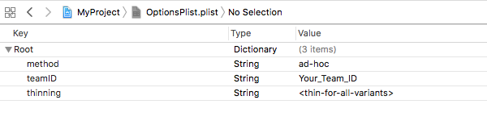

> 导航：[总目录](../../README.md) · [technotes](../../_indexes/technotes.md)


Technical Note TN2339

# Building from the Command Line with Xcode FAQ

This document provides answers to frequently asked questions about command line tools.

[What is the Command Line Tools Package?](#apple-f4xwc4dqnrsv64tfmyxwi33df52wszbpirkfgnbqgaytinjyhawugsbrfvluqqkul5evgx2ujbcv6q2pjvguctsel5gestsfl5ke6t2mknpvaqkdjnauork7)[Downloading command-line tools is not available in Xcode for macOS 10.9. How can I install them on my machine?](#apple-f4xwc4dqnrsv64tfmyxwi33df52wszbpirkfgnbqgaytinjyhawugsbrfvce6v2ojrhucrcjjzdv6q2pjvguctsel5gestsfl5ke6t2mknpusu27jzhvix2bkzaustcbijgekx2jjzpvqq2pircv6rspkjpu2qkdj5jv6mjql44v6x2ij5lv6q2bjzpusx2jjzjviqkmjrpviscfjvpu6ts7jvmv6tkbineestsfl4)[How can I uninstall the command-line tools?](#apple-f4xwc4dqnrsv64tfmyxwi33df52wszbpirkfgnbqgaytinjyhawugsbrfvee6v27inau4x2jl5ku4skoknkectcml5keqrk7inhu2tkbjzcf6tcjjzcv6vcpj5gfgxy)[I have multiple versions of Xcode installed on my machine. What version of Xcode do the command-line tools currently use?](#apple-f4xwc4dqnrsv64tfmyxwi33df52wszbpirkfgnbqgaytinjyhawugsbrfvev6scbkzcv6tkvjrkesucmivpvmrkskneu6tstl5humx2yinhuirk7jfhfgvcbjrgekrc7j5hf6tkzl5gucq2ijfhekx27k5eecvc7kzcveu2jj5hf6t2gl5megt2eivpuit27kreekx2dj5gu2qkoirpuyskoivpvit2pjrjv6q2vkjjektsujrmv6vktivpq)[How do I select the default version of Xcode to use for my command-line tools?](#apple-f4xwc4dqnrsv64tfmyxwi33df52wszbpirkfgnbqgaytinjyhawugsbrfvee6v27irhv6sk7kncuyrkdkrpviscfl5cekrsbkvgfix2wivjfgskpjzpu6rs7lbbu6rcfl5ke6x2vkncv6rspkjpu2wk7inhu2tkbjzcf6tcjjzcv6vcpj5gfgxy)[How do I build my projects from the command line?](#apple-f4xwc4dqnrsv64tfmyxwi33df52wszbpirkfgnbqgaytinjyhawugsbrfvee6v27irhv6sk7ijkustcel5gvsx2qkjhuurkdkrjv6rssj5gv6vciivpugt2njvau4rc7jreu4rk7)[My app has multiple build configurations. How do I set a default build configuration for xcodebuild?](#apple-f4xwc4dqnrsv64tfmyxwi33df52wszbpirkfgnbqgaytinjyhawugsbrfvgvsx2bkbif6scbknpu2vkmkrevatcfl5bfkskmirpugt2oizeuovksifkest2oknpv6scpk5puit27jfpvgrkul5av6rcfizavktcul5bfkskmirpugt2oizeuovksifkest2ol5de6us7lbbu6rcfijkustcel4)[How do I run unit tests from the command line?](#apple-f4xwc4dqnrsv64tfmyxwi33df52wszbpirkfgnbqgaytinjyhawugsbrfvku4sku)[How do I implement the Build For Testing and Test Without Building features from the command line?](#apple-f4xwc4dqnrsv64tfmyxwi33df52wszbpirkfgnbqgaytinjyhawugsbrfvifet2ekvbvi)[What keys can I pass to the exportOptionsPlist flag?](#apple-f4xwc4dqnrsv64tfmyxwi33df52wszbpirkfgnbqgaytinjyhawugsbrfvluqqkul5fukwktl5bucts7jfpvaqktknpvit27kreekx2flbie6usuj5ifiskpjzjvatcjknkf6rsmifdv6)[How do I archive and export my app for distribution?](#apple-f4xwc4dqnrsv64tfmyxwi33df52wszbpirkfgnbqgaytinjyhawugsbrfvee6v27irhv6sk7ifjegscjkzcv6qkoirpukwcqj5jfix2nlfpucucql5de6us7irevgvcsjfbfkvcjj5hf6)[Document Revision History](#apple-f4xwc4dqnrsv64tfmyxwi33df52wszbpirkfgnbqgaytinjyhawvezlwnfzws33ojbuxg5dpoj4s2rdpnz2ey2lonncwyzlnmvxhiskel4yq)

## What is the Command Line Tools Package?

The Command Line Tools Package is a small self-contained package available for download separately from Xcode and that allows you to do command line development in macOS. It consists of the macOS SDK and command-line tools such as Clang, which are installed in the `/Library/Developer/CommandLineTools` directory.

[Back to Top](#)

## Downloading command-line tools is not available in Xcode for macOS 10.9. How can I install them on my machine?

In macOS 10.9 and later, the Downloads pane of Xcode Preferences does not support downloading command-line tools. Use any of the following methods to install command-line tools on your system:

- Install Xcode

  If Xcode is installed on your machine, then there is no need to install them. Xcode comes bundled with all your command-line tools. macOS 10.9 and later includes shims or wrapper executables. These shims, installed in `/usr/bin`, can map any tool included in `/usr/bin` to the corresponding one inside Xcode. xcrun is one of such shims, which allows you to find or run any tool inside Xcode from the command line. Use it to invoke any tool within Xcode from the command line as shown in Listing 1.

  __Listing 1__  Using xcrun to run dwarfdump in the Terminal application.

  ```shell
  $ xcrun dwarfdump --uuid  MySample.app/MySample
  UUID: AD019F0E-1318-3F9F-92B6-9F95FBEBBE6F (armv7) MySample.app/MySample
  UUID: BB59C973-06AC-388F-8EC1-FA3701C9E264 (arm64) MySample.app/MySample
  ```

- Download the Command Line Tools package from the Developer website

  The Command Line Tools package is available for download on the [Download for Apple Developers](https://developer.apple.com/downloads/index.action) page. Log in with your Apple ID, then search and download the Command Line Tools package appropriate for your machine such as macOS 10.12 as shown in Figure 1.

__Figure 1__  Download page for the Command Line Tools package.



__Note:__ In macOS 10.9 and later, Software update notifies you when new versions of the command-line tools are available for update.

- Install the Command Line Tools package via the Terminal application

  You can install the Command Line Tools package by running the  `xcode-select --install` command.

  __Note:__ macOS comes bundled with  `xcode-select`, a command-line tool that is installed in `/usr/bin`. It allows you to manage the active developer directory for Xcode and other BSD development tools. See its [man page](x-man-page://xcode-select) for more information.

[Back to Top](#)

## How can I uninstall the command-line tools?

- Xcode includes all of the command-line tools. If it is installed on your system, remove it to uninstall the command-line tools.
- If the `/Library/Developer/CommandLineTools` directory exists on your system, remove it to uninstall the command-line tools.

[Back to Top](#)

## I have multiple versions of Xcode installed on my machine. What version of Xcode do the command-line tools currently use?

To find out what version of Xcode is being used by your tools, run the following command in Terminal:

```shell
$ xcode-select --print-path
```

__Listing 2__  Printing the version of Xcode currently used by the command-line tools.

```shell
$ xcode-select --print-path
/Applications/Xcode8.3.3/Xcode.app/Contents/Developer
```

[Back to Top](#)

## How do I select the default version of Xcode to use for my command-line tools?

To select a default Xcode for your command-line tools, run the following command in Terminal:

```shell
$ sudo xcode-select -switch <path/to/>Xcode.app
```

where <path/to/> is the path to the Xcode.app package you wish to use for development.

__Listing 3__  Setting the default Xcode version.

```shell
$ sudo xcode-select -switch /Applications/Xcode8.3.3/Xcode.app
```

[Back to Top](#)

## How do I build my projects from the command line?

xcodebuild is a command-line tool that allows you to perform build, query, analyze, test, and archive operations on your Xcode projects and workspaces from the command line. It operates on one or more targets contained in your project, or a scheme contained in your project or workspace. xcodebuild provides several options for performing these operations as seen its [man page](x-man-page://xcodebuild). xcodebuild saves the output of your commands in the locations defined in the [Locations preferences](http://help.apple.com/xcode/mac/current/#/devd12cb6068) pane of your Xcode application, by default.

See below for various xcodebuild usage. Be sure to navigate to the directory containing your project or workspace in Terminal before running any of the following commands.

- To list all schemes in your workspace, run the following command in Terminal:

  ```
  xcodebuild -list -workspace <your_workspace_name>.xcworkspace
  ```

  where <your_workspace_name> is the name of your workspace.

  __Listing 4__  Listing all schemes in the MyApplication workspace.

  ```shell
  $ cd /Users/username/Desktop/MyApplication
  $ xcodebuild -list -workspace MyApplication.xcworkspace
  Information about workspace "MyApplication":
      Schemes:
          iOSApp
          tvOSApp
          macOSApp
          iOSWithWatchApp
          iOSWithWatchApp WatchKit App
  ```
- To list all targets, build configurations, and schemes used in your project, run the following command in Terminal:

  ```
  xcodebuild -list -project <your_project_name>.xcodeproj
  ```

  where <your_project_name> is the name of your project.

  __Listing 5__  Listing all information about MyProject, an Xcode project.

  ```shell
  $ cd /Users/username/Desktop/MyProject
  $ xcodebuild -list -project MyProject.xcodeproj
  Information about project "MyProject":
      Targets:
          iOS
          iOSTests
          iOSUITests
          watchOS App
          watchOS App Extension
          tvOS
          tvOSTests
          tvOSUITests
          macOS
          macOSTests
          macOSUITests

      Build Configurations:
          Debug
          Release

   If no build configuration is specified and -scheme is not passed then "Debug" is used.

      Schemes:
          iOS
          watchOS App
          tvOS
          macOS
  ```
- To build a scheme in your project, run the following command in Terminal:

  ```
   xcodebuild -scheme <your_scheme_name> build
  ```

  where <your_scheme_name> and build are respectively the name of your scheme to be built and the action to be performed on your scheme.

  __Listing 6__  Building the tvOS scheme.

  ```shell
  $ xcodebuild -scheme tvOS  build
  === BUILD TARGET tvOS OF PROJECT MyProject WITH CONFIGURATION Debug ===
  ...
  ```

  __Note:__ xcodebuild supports various build actions such as `build`, `analyze`, and `archive` that can be performed on your target or scheme. However, `build` is performed by default when no action is specified as shown in Listing 7.
- To build your target with a configuration file, run the following command in Terminal:

  ```
  xcodebuild -target <your_target_name> -xcconfig <your_configuration_file>.xcconfig
  ```

  where <your_target_name> and <your_configuration_file> are respectively the name of your target to be built and the name of your configuration file. See [Xcode Help's Build configuration file reference](http://help.apple.com/xcode/mac/current/#/dev745c5c974) for more information about xcconfig files.

  __Listing 7__  Building the iOS target with a configuration file.

  ```shell
  $ xcodebuild -target iOS -xcconfig configuration.xcconfig
  Build settings from configuration file 'configuration.xcconfig':
     IPHONEOS_DEPLOYMENT_TARGET = 10
     SWIFT_TREAT_WARNINGS_AS_ERRORS = YES

  === BUILD TARGET watchOS Extension OF PROJECT MyProject WITH THE DEFAULT CONFIGURATION (Debug) ===
  ...
  === BUILD TARGET watchOS App OF PROJECT MyProject WITH THE DEFAULT CONFIGURATION (Debug) ===
  ...
  === BUILD TARGET iOS OF PROJECT MyProject WITH THE DEFAULT CONFIGURATION (Debug) ===
  ...
  ```
- To change the output locations of your xcodebuild command, use the SYMROOT (Build Products Path) and DSTROOT (Installation Build Products Location) build settings that respectively specify a location for your debug products and .dSYM files and one for your released products. See [Xcode Help's Build setting reference](https://help.apple.com/xcode/mac/current/#/itcaec37c2a6) for more information about these build settings.

  __Listing 8__  Setting up a location for iOS' debug app version.

  ```shell
  $ xcodebuild -scheme iOS SYMROOT="/Users/username/Desktop/DebugLocation"
  Build settings from command line:
      SYMROOT = "/Users/username/Desktop/DebugLocation"

  === BUILD TARGET watchOS Extension OF PROJECT MyProject WITH CONFIGURATION Debug ===
  ...
  === BUILD TARGET watchOS App OF PROJECT MyProject WITH CONFIGURATION Debug ===
  ...
  === BUILD TARGET iOS OF PROJECT MyProject WITH CONFIGURATION Debug ===
  ...
  ```

  __Listing 9__  Setting up a location for iOS's released app version.

  ```shell
  $ xcodebuild -scheme iOS  DSTROOT="/Users/username/Desktop/ReleaseLocation" archive
  Build settings from command line:
      DSTROOT = /Users/username/Desktop/ReleaseLocation

  === BUILD TARGET watchOS Extension OF PROJECT MyProject WITH CONFIGURATION Release ===
  ...
  === BUILD TARGET watchOS App OF PROJECT MyProject WITH CONFIGURATION Release ===
  ...
  === BUILD TARGET iOS OF PROJECT MyProject WITH CONFIGURATION Release ===
  ...
  ```

[Back to Top](#)

## My app has multiple build configurations. How do I set a default build configuration for xcodebuild?

In Xcode, the Configurations section of your project's Info pane provides a pop-up menu, which sets the default configuration to be used by xcodebuild when building a target. Use this pop-up menu to select a default build configuration for xcodebuild as seen in Figure 2.

__Figure 2__  Debug set as the default build configuration for xcodebuild.

[Back to Top](#)

## How do I run unit tests from the command line?

xcodebuild provides several options for running unit tests.

To build and run unit tests from the command line, execute the following command in Terminal:

```
xcodebuild test [-workspace <your_workspace_name>]
                [-project <your_project_name>]
                -scheme <your_scheme_name>
                -destination <destination-specifier>
                [-only-testing:<test-identifier>]
                [-skip-testing:<test-identifier>]
```

To build unit tests without running them from the command line, execute the following command in Terminal:

```
xcodebuild build-for-testing [-workspace <your_workspace_name>]
                             [-project <your_project_name>]
                             -scheme <your_scheme_name>
                             -destination <destination-specifier>
```

To run unit tests without building them from the command line, execute any of the following command in Terminal:

```
xcodebuild test-without-building [-workspace <your_workspace_name>]
                                 [-project <your_project_name>]
                                 -scheme <your_scheme_name>
                                 -destination <destination-specifier>
                                 [-only-testing:<test-identifier>]
                                 [-skip-testing:<test-identifier>]
```

```
xcodebuild test-without-building -xctestrun <your_xctestrun_name>.xctestrun
                                 -destination <destination-specifier>
                                 [-only-testing:<test-identifier>]
                                 [-skip-testing:<test-identifier>]
```

The test action requires specifying a scheme and a destination. See [How do I implement the Build For Testing and Test Without Building features from the command line?](#apple-f4xwc4dqnrsv64tfmyxwi33df52wszbpirkfgnbqgaytinjyhawugsbrfvifet2ekvbvi) for more information about build-for-testing and test-without-building actions.

The `-workspace` option allows you to specify the name of your workspace. Use this option when your scheme is contained in an Xcode workspace.

The `-project` option allows you to specify the name of your Xcode project. Use this option when your scheme is contained in an Xcode project. It is required when there are multiple Xcode projects in the same directory and optional, otherwise.

The `-destination` option allows you to specify a destination for your unit tests. It takes an argument `<destination-specifier>`, which describes the device, simulator, or Mac to use as a destination. It consists of a set of comma-separated key=value pairs, which are dependent upon the the device, simulator, or Mac being used.

The `-only-testing` and `-skip-testing` options, which are optional, allow you to run only a specific test and to skip a test, respectively. They take an argument `<test-identifier>`, which specifies the test to be executed or excluded. `test-identifier`'s format is as follows:

```
TestTarget[/TestClass[/TestMethod]]
```

`TestTarget`, which is required, is the name of the test bundle. `TestClass` and `TestMethod`, which are both optional, respectively represent the name of the class and the name of the method to be tested.

__Note:__ See [Xcode Scheme](https://developer.apple.com/library/ios/featuredarticles/XcodeConcepts/Concept-Schemes.html) and [Run your app in Simulator](http://help.apple.com/xcode/mac/8.0/#/dev2809b6cff) for more information about scheme and destination, respectively.

- For macOS apps, `destinationspecifier` supports the platform and arch keys as seen in [Table 1](#apple-f4xwc4dqnrsv64tfmyxwi33df52wszbpirkfgnbqgaytinjyhawugsbrfvkecqsmiuyq). Both keys are required for running your unit tests in macOS.

  __Table 1__  Supported keys for macOS apps.

  | Key | Description | Value |
  | platform | The supported destination for your unit tests. | macOS |
  | arch | The architecture to use to run your unit tests. | i386 or x86_64 |

  See Listing 10 for an example that tests a scheme in macOS and where `destinationspecifier` is set to 'platform=macOS,arch=x86_64'.

  __Listing 10__  Tests the macOS scheme for 64-bit in macOS.

  ```
  xcodebuild test -scheme macOS -destination 'platform=macOS,arch=x86_64'
  ```
- For iOS and tvOS apps, `destinationspecifier` supports the platform, name, and id keys as seen in [Table 2](#apple-f4xwc4dqnrsv64tfmyxwi33df52wszbpirkfgnbqgaytinjyhawugsbrfvkecqsmiuza).

  __Table 2__  Supported keys for iOS and tvOS apps.

  | Key | Description | Value |
  | platform | The supported destination for your unit tests. | iOS (for iOS apps) tvOS (for tvOS apps) |
  | name | The full name of your device to be used for your unit tests. | The name of your device as displayed in the Devices Organizer in Xcode. |
  | id | The identifier of your device to be used for your unit tests. | See Locate a device identifier for more information about getting your device identifier. |

  The name and id keys are intergeably used with platform, which is a required key as seen in Listing 11 and Listing 12.

  __Listing 11__  Tests the iOS scheme on a device identified by 965058a1c30d845d0dcec81cd6b908650a0d701c.

  ```
  xcodebuild test -workspace MyApplication.xcworkspace -scheme iOSApp -destination 'platform=iOS,id=965058a1c30d845d0dcec81cd6b908650a0d701c'
  ```

  __Listing 12__  Testing the iOSApp scheme on an iPhone.

  ```shell
  $ xcodebuild test -workspace MyApplication.xcworkspace -scheme iOSApp -destination 'platform=iOS,name=iPhone'
  ...
  === BUILD TARGET iOSApp OF PROJECT iOSApp WITH CONFIGURATION Debug ===
  ...
  === BUILD TARGET iOSAppTests OF PROJECT iOSApp WITH CONFIGURATION Debug ===
  ...
  === BUILD TARGET iOSAppUITests OF PROJECT iOSApp WITH CONFIGURATION Debug ===
  ...
  Test Suite 'All tests' started at ...
  Test Suite 'iOSAppTests.xctest' started at ...
  Test Suite 'SecondTestClass' started at ...
  Test Case '-[iOSAppTests.SecondTestClass testExampleA]' started.
  Test Case '-[iOSAppTests.SecondTestClass testExampleB]' started.
  Test Suite 'SecondTestClass' passed at ...
  ...
  Test Suite 'iOSAppTests' started at ...
  Test Case '-[iOSAppTests.iOSAppTests testExample]' started.
  Test Case '-[iOSAppTests.iOSAppTests testPerformanceExample]' started.
  Test Suite 'iOSAppTests' passed at ...
  ...
  Test Suite 'iOSAppUITests.xctest' started at ...
  Test Suite 'iOSAppUITests' started at ...
  Test Case '-[iOSAppUITests.iOSAppUITests testLabels]' started.
  Test Case '-[iOSAppUITests.iOSAppUITests testToolbar]' started.
  ...
  ** TEST SUCCEEDED **
  ```

  __Listing 13__  Do not test iOSAppUITests on an iPhone.

  ```
  xcodebuild test -workspace MyApplication.xcworkspace -scheme iOSApp -destination 'platform=iOS,name=iPhone' -skip-testing:iOSAppUITests
  ```

  __Listing 14__  Only testing SecondTestClass' testExampleB in the iOSAppTests unit test.

  ```shell
  $ xcodebuild test -workspace MyApplication.xcworkspace -scheme iOSApp -destination 'platform=iOS,name=iPhone' -only-testing:iOSAppTests/SecondTestClass/testExampleB
  ...
  === BUILD TARGET iOSApp OF PROJECT iOSApp WITH CONFIGURATION Debug ===
  ...
  === BUILD TARGET iOSAppTests OF PROJECT iOSApp WITH CONFIGURATION Debug ===
  ...
  === BUILD TARGET iOSAppUITests OF PROJECT iOSApp WITH CONFIGURATION Debug ===
  ...
  Test Suite 'Selected tests' started at ...
  Test Suite 'iOSAppTests.xctest' started at ...
  Test Suite 'SecondTestClass' started at ...
  Test Case '-[iOSAppTests.SecondTestClass testExampleB]' started.
  Test Case '-[iOSAppTests.SecondTestClass testExampleB]' passed (0.007 seconds).
  Test Suite 'SecondTestClass' passed at ...
      ...
  ** TEST SUCCEEDED **
  ```
- For iOS Simulator and tvOS Simulator apps, `destinationspecifier` supports the platform, name, id, and OS keys as seen in [Table 3](#apple-f4xwc4dqnrsv64tfmyxwi33df52wszbpirkfgnbqgaytinjyhawugsbrfvkecqsmiuzq).

  __Table 3__   Supported keys for iOS Simulator and tvOS Simulator apps.

  | Key | Description | Value |
  | platform | The supported destination for your unit tests. | iOS Simulator (iOS apps) tvOS Simulator (tvOS apps) |
  | name | The full name of the simulator (iOS simulator for iOS apps and tvOS Simulator for tvOS apps) to be used for your unit tests and as displayed in the run destination of your Xcode project. | The name of your device as displayed in the Devices Organizer in Xcode. |
  | id | The identifier of your device to be used for your unit tests. | See Locate a device identifier for more information about getting your device identifier. |
  | OS | The version of iOS or tvOS to simulate such as 9.0 or the string latest to indicate the most recent version of iOS supported by your version of Xcode. | An iOS version, tvOS version, or latest |

  The name and id keys are intergeably used with platform, which is a required key as shown in Listing 15 and Listing 16. The OS key is optional.

  __Listing 15__  Tests the iOS scheme on an iPad Pro (12.9 inch) with iOS 10.2 in the Simulator.

  ```
  xcodebuild test -scheme iOS -destination 'platform=iOS Simulator,name=iPad Pro (12.9-inch),OS=10.2'
  ```

  __Listing 16__  Tests the tvOS scheme on an tvOS Simulator identified by D6FA2C2A-E297-406A-AA22-624B4834ACB2.

  ```
  xcodebuild test -scheme tvOS -destination 'platform=tvOS Simulator,id=D6FA2C2A-E297-406A-AA22-624B4834ACB2'
  ```

The `-destination` option also allows you to run the same unit test on multiple destinations. This is done by adding it multiple times to your xcodebuild test command as demonstrated in Listing 17.

__Listing 17__  Tests the iOS scheme in both the Simulator and on an iPod touch.

```
xcodebuild test -scheme iOS -destination 'platform=iOS Simulator,name=iPhone 6s,OS=10.3' -destination 'platform=iOS,name=iPod touch'
```

__Note:__ xcodebuild runs your tests sequentially. For instance In Listing 17, xcodebuild will first test iOS in the Simulator before executing it on the iPod touch.

[Back to Top](#)

## How do I implement the Build For Testing and Test Without Building features from the command line?

- xcodebuild provides the `build-for-testing` action for Xcode's Product > Build For > Testing feature. You must specify a scheme to use it. To use it, execute the following command in Terminal:

  ```
  xcodebuild build-for-testing [-workspace <your_workspace_name>]
                               [-project <your_project_name>]
                               -scheme <your_scheme_name>
                               -destination <destination-specifier>
  ```

  See [How do I run unit tests from the command line?](#apple-f4xwc4dqnrsv64tfmyxwi33df52wszbpirkfgnbqgaytinjyhawugsbrfvku4sku) for more information about xcodebuild `build-for-testing`'s options.

  __Listing 18__  Builds tests and associated targets in the tvOS scheme using the tvOS Simulator identified by D6FA2C2A-E297-406A-AA22-624B4834ACB2.

  ```
  xcodebuild build-for-testing -scheme tvOS -destination 'platform=tvOS Simulator,id=D6FA2C2A-E297-406A-AA22-624B4834ACB2'
  ```

  `build-for-testing` generates an xctestrun file, which is saved in the derived data folder. See [xcodebuild.xctestrun](x-man-page://xcodebuild.xctestrun)'s man page for more information about xctestrun files.
- xcodebuild provides the `test-without-building` action for Xcode's Product > Perform Action > Test Without Building feature. `test-without-building` requires that you specify either a scheme or an xctestrun file.

  - Usage when using a scheme

    ```
    xcodebuild test-without-building [-workspace <your_workspace_name>]
                                     [-project <your_project_name>]
                                     -scheme <your_scheme_name>
                                     -destination <destination-specifier>
                                     [-only-testing:<test-identifier>]
                                     [-skip-testing:<test-identifier>]
    ```

    See [How do I run unit tests from the command line?](#apple-f4xwc4dqnrsv64tfmyxwi33df52wszbpirkfgnbqgaytinjyhawugsbrfvku4sku) for more information about xcodebuild `test-without-building`'s options.

    __Important:__ When using a scheme, `test-without-building` searches for bundles in the build root (`SYMROOT`). Therefore, be sure to build your target or that your build root includes the bundles to be tested before running this command. See [Xcode Help's Build settings reference](http://help.apple.com/xcode/mac/current/#/itcaec37c2a6) for more information about `SYMROOT`.

    __Listing 19__  Tests the iOSApp scheme on an iPhone SE with iOS 10.1 in the Simulator.

    ```
    xcodebuild test-without-building -workspace MyApplication.xcworkspace -scheme iOSApp -destination 'platform=iOS Simulator,name=iPhone SE,OS=10.1'
    ```
  - Usage when using an xctestrun file

    ```
    xcodebuild test-without-building -xctestrun <your_xctestrun_name>.xctestrun
                                     -destination <destination-specifier>
                                     [-only-testing:<test-identifier>]
                                     [-skip-testing:<test-identifier>]
    ```

    where <your_xctestrun_name> is the name of the file containing your test run parameters. See [xcodebuild.xctestrun](x-man-page://xcodebuild.xctestrun)' s man page for more information about xctestrun files. See [How do I run unit tests from the command line?](#apple-f4xwc4dqnrsv64tfmyxwi33df52wszbpirkfgnbqgaytinjyhawugsbrfvku4sku) for more information about the other options.

    __Important:__ When using an xctestrun file, `test-without-building` searches for bundles at paths specified in the file. Therefore, be sure that the bundles exist at the specified paths before running this command.

    __Listing 20__  Testing bundles and other parameters specified in iOSApp_iphonesimulator.xctestrun using the iOS Simulator identified by 6DC4A7BA-EA7F-40D6-A327-A0A9DF82F7F6.

    ```xml
    $ cat iOSApp_iphonesimulator.xctestrun
    <?xml version="1.0" encoding="UTF-8"?>
    <!DOCTYPE plist PUBLIC "-//Apple//DTD PLIST 1.0//EN" "http://www.apple.com/DTDs/PropertyList-1.0.dtd">
    <plist version="1.0">
    <dict>
        <key>iOSAppTests</key>
        <dict>
            <key>BundleIdentifiersForCrashReportEmphasis</key>
            <array>
                <string>com.myapps.iOSApp</string>
                <string>com.myapps.iOSAppTests</string>
                <string>com.myapps.iOSAppUITests</string>
            </array>
            …
            <key>TestBundlePath</key>
            <string>__TESTHOST__/PlugIns/iOSAppTests.xctest</string>
            <key>TestHostBundleIdentifier</key>
            <string>com.myapps.iOSApp</string>
            <key>TestHostPath</key>
            <string>__TESTROOT__/Debug-iphonesimulator/iOSApp.app</string>
            …
        </dict>
        <key>iOSAppUITests</key>
        …
    </dict>
    </plist>

    $ xcodebuild test-without-building -xctestrun iOSApp_iphonesimulator.xctestrun -destination 'platform=iOS Simulator,id=6DC4A7BA-EA7F-40D6-A327-A0A9DF82F7F6'
    ```

    __Listing 21__  Tests everything but iOSAppUITests specified in iOSApp_iphonesimulator.xctestrun using the iOS Simulator identified by 3D95DF14-E8B7-4A05-B65B-78F381B74B22.

    ```
    xcodebuild test-without-building -xctestrun iOSApp_iphonesimulator.xctestrun -destination 'platform=iOS Simulator,id=3D95DF14-E8B7-4A05-B65B-78F381B74B22' -skip-testing:iOSAppUITests
    ```

__Note:__ `build-for-testing` and `test-without-building` provide support for continuous integration systems.

[Back to Top](#)

## What keys can I pass to the exportOptionsPlist flag?

To get all available keys for `-exportOptionsPlist`, run the following command in Terminal:

```
xcodebuild -help
```

__Listing 22__  Fetching all keys supported by -exportOptionsPlist.

```shell
$ xcodebuild -help
Usage: xcodebuild [-project <projectname>] [[-target <targetname>]...|-alltargets] [-configuration <configurationname>] [-arch <architecture>]
     ...

Available keys for -exportOptionsPlist:

    compileBitcode : Bool
         ...
    embedOnDemandResourcesAssetPacksInBundle : Bool
         ...
    iCloudContainerEnvironment
         ...
    manifest : Dictionary
         ...
    method : String
         ...
    onDemandResourcesAssetPacksBaseURL : String
         ...
    teamID : String
         ...
    thinning : String
         ...
    uploadBitcode : Bool
         ...
    uploadSymbols : Bool
         ...
```

See Figure 3 for a sample file that contains some options for the -exportOptionsPlist flag.

__Figure 3__  Plist file with a list of options for the -exportOptionsPlist flag.

[Back to Top](#)

## How do I archive and export my app for distribution?

To archive and export your app for distribution, run the following command in Terminal:

```
xcodebuild -exportArchive -archivePath <xcarchivepath> -exportPath <destinationpath> -exportOptionsPlist <path>
```

where `<xcarchivepath>` specifies the archive or the path of the archive to be exported, `<destinationpath>` specifies where to save the exported product, and `<path>` is the path to the file with a list of options for the `-exportOptionsPlist` flag.

__Listing 23__  Exports the iOSApp archive to the Release location with the options saved in the OptionsPlist.plist.

```
xcodebuild -exportArchive -archivePath iOSApp.xcarchive -exportPath Release/MyApp -exportOptionsPlist OptionsPlist.plist
```

[Back to Top](#)

---

#### Document Revision History

| __Date__ | __Notes__ |
| 2017-06-19 | Updated the "How do I run unit tests from the command line?" question. Added the "How do I implement the Build For Testing and Test Without Building features from the command line?" and "What keys can I pass to the exportOptionsPlist flag?" questions. |
|  | Updated the "How do I run unit tests from the command line?" question. Added the "How do I implement the Build For Testing and Test Without Building features from the command line?" and "What keys can I pass to the exportOptionsPlist flag?" questions. |
| 2014-05-21 | New document that provides answers to frequently asked questions about command-line tools. |

