> 导航：[总目录](../../README.md) · [technotes](../../_indexes/technotes.md)


Technical Note TN2035

# ColorSync on Mac OS X

ColorSync has a new role in Mac OS X. ColorSync in Mac OS X is fundamentally integrated into the operating system, whereas on previous versions of the operating system it was an optional install. Color management is very important these days to the customer experience. The Mac OS X graphics environment Quartz takes advantage of ColorSync in great detail, plus ColorSync is used throughout the print-path to provide color matching services for printer drivers.

[Overview](#apple-f4xwc4dqnrsv64tfmyxwi33df52wszbpirkfgmjqgaydgmbxgewugsbrfvjukq2ujfhu4mi)[ICC Profiles](#apple-f4xwc4dqnrsv64tfmyxwi33df52wszbpirkfgmjqgaydgmbxgewugsbrfvjvkqstivbviskpjyyq)[CMM](#apple-f4xwc4dqnrsv64tfmyxwi33df52wszbpirkfgmjqgaydgmbxgewugsbrfvjvkqstivbviskpjyza)[ColorSync and Quartz](#apple-f4xwc4dqnrsv64tfmyxwi33df52wszbpirkfgmjqgaydgmbxgewugsbrfvjukq2ujfhu4na)[ColorSync And Quartz Color Management](#apple-f4xwc4dqnrsv64tfmyxwi33df52wszbpirkfgmjqgaydgmbxgewugsbrfvjvkqstivbviskpjy2a)[PDF Color Model](#apple-f4xwc4dqnrsv64tfmyxwi33df52wszbpirkfgmjqgaydgmbxgewugsbrfvjvkqstivbviskpjy2q)[ColorSync/ICC Color Model](#apple-f4xwc4dqnrsv64tfmyxwi33df52wszbpirkfgmjqgaydgmbxgewugsbrfvjvkqstivbviskpjy4a)[Color Model in Quartz](#apple-f4xwc4dqnrsv64tfmyxwi33df52wszbpirkfgmjqgaydgmbxgewugsbrfvjukq2ujfhu4mjs)[Integration of PDF and ICC color models](#apple-f4xwc4dqnrsv64tfmyxwi33df52wszbpirkfgmjqgaydgmbxgewugsbrfvjvkqstivbviskpjyyte)[Color in Quartz Drawing Model](#apple-f4xwc4dqnrsv64tfmyxwi33df52wszbpirkfgmjqgaydgmbxgewugsbrfvjvkqstivbviskpjyytk)[Quartz Printing Front End](#apple-f4xwc4dqnrsv64tfmyxwi33df52wszbpirkfgmjqgaydgmbxgewugsbrfvjvkqstivbviskpjyytm)[Quartz Raster Printing Back End](#apple-f4xwc4dqnrsv64tfmyxwi33df52wszbpirkfgmjqgaydgmbxgewugsbrfvjvkqstivbviskpjyyto)[Quartz in PostScript Back End](#apple-f4xwc4dqnrsv64tfmyxwi33df52wszbpirkfgmjqgaydgmbxgewugsbrfvjvkqstivbviskpjyzda)[Printing Untagged Data](#apple-f4xwc4dqnrsv64tfmyxwi33df52wszbpirkfgmjqgaydgmbxgewugsbrfvjvkqstivbviskpjyzdc)[Drawing to Multiple Screens](#apple-f4xwc4dqnrsv64tfmyxwi33df52wszbpirkfgmjqgaydgmbxgewugsbrfvjukq2ujfhu4mry)[Profiles in Mac OS X](#apple-f4xwc4dqnrsv64tfmyxwi33df52wszbpirkfgmjqgaydgmbxgewugsbrfvjukq2ujfhu4mrz)[Profile prerequisites](#apple-f4xwc4dqnrsv64tfmyxwi33df52wszbpirkfgmjqgaydgmbxgewugsbrfvjvkqstivbviskpjyzds)[New optional profile tags](#apple-f4xwc4dqnrsv64tfmyxwi33df52wszbpirkfgmjqgaydgmbxgewugsbrfvjvkqstivbviskpjyzta)[ICC4 Profiles](#apple-f4xwc4dqnrsv64tfmyxwi33df52wszbpirkfgmjqgaydgmbxgewugsbrfvjvkqstivbviskpjyztc)[CMMs in Mac OS X](#apple-f4xwc4dqnrsv64tfmyxwi33df52wszbpirkfgmjqgaydgmbxgewugsbrfvjukq2ujfhu4mzt)[Building CMMs](#apple-f4xwc4dqnrsv64tfmyxwi33df52wszbpirkfgmjqgaydgmbxgewugsbrfvjvkqstivbviskpjyztg)[ColorSync Preferences and Supporting APIs](#apple-f4xwc4dqnrsv64tfmyxwi33df52wszbpirkfgmjqgaydgmbxgewugsbrfvjukq2ujfhu4mzv)[Profiles for Standard Color Spaces](#apple-f4xwc4dqnrsv64tfmyxwi33df52wszbpirkfgmjqgaydgmbxgewugsbrfvjvkqstivbviskpjyztk)[ColorSync Preferences Tidbits](#apple-f4xwc4dqnrsv64tfmyxwi33df52wszbpirkfgmjqgaydgmbxgewugsbrfvjvkqstivbviskpjyztm)[ColorSync Preferences Summary](#apple-f4xwc4dqnrsv64tfmyxwi33df52wszbpirkfgmjqgaydgmbxgewugsbrfvjvkqstivbviskpjyzto)[ColorSync Device Support](#apple-f4xwc4dqnrsv64tfmyxwi33df52wszbpirkfgmjqgaydgmbxgewugsbrfvjukq2ujfhu4mzz)[Notifications](#apple-f4xwc4dqnrsv64tfmyxwi33df52wszbpirkfgmjqgaydgmbxgewugsbrfvjvkqstivbviskpjyzts)[ColorSync Device Support Summary](#apple-f4xwc4dqnrsv64tfmyxwi33df52wszbpirkfgmjqgaydgmbxgewugsbrfvjvkqstivbviskpjy2da)[Color Management in Printing](#apple-f4xwc4dqnrsv64tfmyxwi33df52wszbpirkfgmjqgaydgmbxgewugsbrfvjukq2ujfhu4nbs)[Color Matching On The Host by ColorSync](#apple-f4xwc4dqnrsv64tfmyxwi33df52wszbpirkfgmjqgaydgmbxgewugsbrfvjvkqstivbviskpjy2de)[cupsICCProfile PPD Declaration Entry](#apple-f4xwc4dqnrsv64tfmyxwi33df52wszbpirkfgmjqgaydgmbxgewugsbrfvjvkqstivbviskpjy2dg)[Quartz Filters](#apple-f4xwc4dqnrsv64tfmyxwi33df52wszbpirkfgmjqgaydgmbxgewugsbrfvjukq2ujfhu4nbv)[Demos of Quartz filters](#apple-f4xwc4dqnrsv64tfmyxwi33df52wszbpirkfgmjqgaydgmbxgewugsbrfvjvkqstivbviskpjy2dk)[Soft-Proofing](#apple-f4xwc4dqnrsv64tfmyxwi33df52wszbpirkfgmjqgaydgmbxgewugsbrfvjvkqstivbviskpjy2dm)[Print dialog](#apple-f4xwc4dqnrsv64tfmyxwi33df52wszbpirkfgmjqgaydgmbxgewugsbrfvjvkqstivbviskpjy2do)[ColorSync Utility](#apple-f4xwc4dqnrsv64tfmyxwi33df52wszbpirkfgmjqgaydgmbxgewugsbrfvjukq2ujfhu4nbz)[ColorSync Preferences](#apple-f4xwc4dqnrsv64tfmyxwi33df52wszbpirkfgmjqgaydgmbxgewugsbrfvjvkqstivbviskpjy2ds)[Administration Features](#apple-f4xwc4dqnrsv64tfmyxwi33df52wszbpirkfgmjqgaydgmbxgewugsbrfvjvkqstivbviskpjy2tc)[3D View Options for Profile Viewer](#apple-f4xwc4dqnrsv64tfmyxwi33df52wszbpirkfgmjqgaydgmbxgewugsbrfvjvkqstivbviskpjy2te)[ColorSync and OpenGL](#apple-f4xwc4dqnrsv64tfmyxwi33df52wszbpirkfgmjqgaydgmbxgewugsbrfvjukq2ujfhu4nju)[ColorSync And QuickTime](#apple-f4xwc4dqnrsv64tfmyxwi33df52wszbpirkfgmjqgaydgmbxgewugsbrfvjukq2ujfhu4njv)[ColorSync And Image Capture](#apple-f4xwc4dqnrsv64tfmyxwi33df52wszbpirkfgmjqgaydgmbxgewugsbrfvjukq2ujfhu4njw)[Display Calibration](#apple-f4xwc4dqnrsv64tfmyxwi33df52wszbpirkfgmjqgaydgmbxgewugsbrfvjukq2ujfhu4njx)[Support for your calibrator](#apple-f4xwc4dqnrsv64tfmyxwi33df52wszbpirkfgmjqgaydgmbxgewugsbrfvjvkqstivbviskpjy2to)[Apple Calibrator Expert Mode](#apple-f4xwc4dqnrsv64tfmyxwi33df52wszbpirkfgmjqgaydgmbxgewugsbrfvjvkqstivbviskpjy2tq)[SIPS](#apple-f4xwc4dqnrsv64tfmyxwi33df52wszbpirkfgmjqgaydgmbxgewugsbrfvjukq2ujfhu4nrq)[ColorSync changes for Mac OS X 10.4 Tiger](#apple-f4xwc4dqnrsv64tfmyxwi33df52wszbpirkfgmjqgaydgmbxgewugsbrfvjukq2ujfhu4nrr)[Floating Point Support](#apple-f4xwc4dqnrsv64tfmyxwi33df52wszbpirkfgmjqgaydgmbxgewugsbrfvjvkqstivbviskpjy3dc)[New structure: CMFloatBitmap](#apple-f4xwc4dqnrsv64tfmyxwi33df52wszbpirkfgmjqgaydgmbxgewugsbrfvjvkqstivbviskpjy3de)[New APIs](#apple-f4xwc4dqnrsv64tfmyxwi33df52wszbpirkfgmjqgaydgmbxgewugsbrfvjvkqstivbviskpjy3dg)[Use of CFTypes](#apple-f4xwc4dqnrsv64tfmyxwi33df52wszbpirkfgmjqgaydgmbxgewugsbrfvjvkqstivbviskpjy3dq)[API Changes](#apple-f4xwc4dqnrsv64tfmyxwi33df52wszbpirkfgmjqgaydgmbxgewugsbrfvjvkqstivbviskpjy3tc)[Custom CMMs](#apple-f4xwc4dqnrsv64tfmyxwi33df52wszbpirkfgmjqgaydgmbxgewugsbrfvjvkqstivbviskpjy3tg)[Changes to ColorSync Utility](#apple-f4xwc4dqnrsv64tfmyxwi33df52wszbpirkfgmjqgaydgmbxgewugsbrfvjvkqstivbviskpjy3to)[References](#apple-f4xwc4dqnrsv64tfmyxwi33df52wszbpirkfgmjqgaydgmbxgewugsbrfvjukq2ujfhu4obr)[Document Revision History](#apple-f4xwc4dqnrsv64tfmyxwi33df52wszbpirkfgmjqgaydgmbxgewvezlwnfzws33ojbuxg5dpoj4s2rdpnz2ey2lonncwyzlnmvxhiskel4yq)

## Overview

There are a wide variety of imaging devices in the market today, such as digital cameras, color scanners, color printers, etc., and each device represents colors in very different ways. They each have different color spaces and different gamuts (ranges of colors). This, of course, makes it very difficult for a document acquired on one device to be rendered correctly on another device. The solution to this problem is ColorSync, a complete color management system, designed to provide consistent color across devices.

The two key foundations upon which ColorSync is built are International Color Consortium (ICC) profiles and Color Management Modules (CMMs).

### ICC Profiles

ICC profiles use a cross-platform file format defined by the ICC. They are documents containing data that describe how to transform colors from device color space to an intermediate color space. This file format allows for the description of a wide variety of devices. The data format has been designed to be quite flexible, and can be extended by developers via optional tags. Furthermore, the format is an evolving format, with ongoing improvements.

### CMM

If you think of profiles as the data used for color management, CMMs are the code. CMMs provide the mathematical engine to perform the profile-to-profile transformations. Apple ships a default CMM, the Apple CMM, as part of ColorSync. This is the same default CMM Apple ships on Mac OS 9. However, we've designed the system to be open and expandable, so third parties can developer their own CMMs if they want to provide their own alternate methods for color transformations.

Here's a diagram showing how ColorSync fits into the Mac OS X architecture:

__Figure 1__  Mac OS X Architecture & ColorSync.

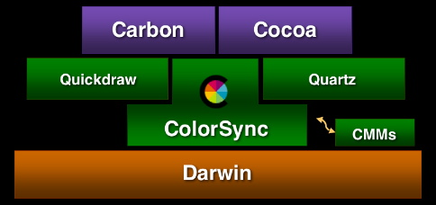

The ColorSync 2.0 and greater APIs are fully supported in Mac OS X. This means it should be very easy for developers to port their applications to Mac OS X. There are also some new APIs in ColorSync in Mac OS X which provide some enhancements you may want to take advantage of. Also, Quartz and the printing model in Mac OS X take full advantage of ColorSync.

[Back to Top](#)

## ColorSync and Quartz

in Mac OS X, ColorSync has been assigned a new role encompassing more than just the standard application services. ColorSync is now used to provide color management to other system components. One of these components is Quartz, Apple's new graphics system based on the PDF imaging model. Quartz has created a new paradigm for color management, which offers alternative access to ColorSync functionality.

### ColorSync And Quartz Color Management

Our goals here were to integrate graphics and color management services, satisfying some basic requirements. First, Quartz needed the ability to composite different color spaces and opacity. To meet this requirement, ColorSync is used to convert data from many different color spaces into the one space selected by Quartz as a working space for a compositer.

A second requirement focused on the needs of the developer, and is based on the fact all applications using Quartz will have to work with color management. This also needed to be a scalable solution, which would serve the needs of a wide range of applications. On the one hand, the involvement of an application in color management can be very minimal, limited to the use of some predefined default settings provided by Quartz. On the other hand, an application can have the same full control over color management as it does when accessing ColorSync directly. Other requirements include color accuracy, performance and compatablilty with PDF.

In simple terms, Quartz color management can be described as being built around ColorSync, which is used as an engine to process PDF color data produced by Quartz.

__Figure 2__  Quartz Color Management.

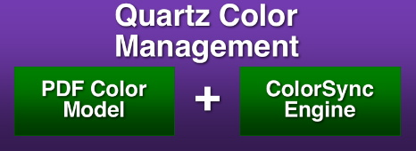

### PDF Color Model

To better understand its design, here's some of the basic concepts pertaining to color in PDF and ColorSync:

#### PDF Color Definition

In PDF, color is defined by one of the known color spaces - Device, Calibrated or ICC based:

__Table 1__  Color Spaces in PDF.

| Color Spaces in PDF |
| /DeviceGray, /DeviceRGB, /DeviceCMYK |
| /CalGray, /CalRGB, /CalLab |
| /ICCBased |

This list essentially reflects the history of color management. Initially, only device color spaces were supported. Based on our perspective today, the device color spaces merely provided a specification for different process color models. Because the color appearance is device dependent, these spaces are actually the worst choice for faithful color reproduction across different devices.

Next, calibrated color was invented, along with the idea of color conversions through device independent color. The advantage of this method is a significant improvement in color matching across different devices. PDF follows by adding calibrated color spaces. Later on, calibrated color evolved into a standard form - the ICC profile. When color management based on ICC profiles gained its popularity and became the de-facto standard among color professionals, PDF added the ICC-based color space, which allows for embedding ICC profiles into PDF documents.

#### PDF Color Conversion

PDF color coversion can be described as a function of source color space, destination color space, and rendering intent. Please take note of the rendering intent values:

__Figure 3__  PDF Color Conversion.

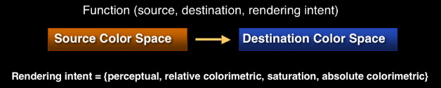

### ColorSync/ICC Color Model

Now let's take a look at how ICC and ColorSync define color and color conversion.

#### ICC color definition

Naturally, color is defined by an ICC profile. As mentioned previously, the ICC profile is the most general form of the color space description.

#### ICC Color Conversions

ICC color conversions are very similar to those in PDF. The differences are an option to insert an intermediate profile between the source and destination profiles:

__Figure 4__  ICC Color Conversions.

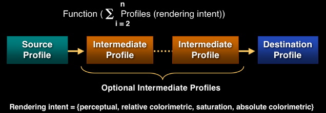

These additional profiles are used for soft-proofing, color device simulation, applying special affects, etc. As we can now see, the rendering intent values in ICC color conversions are the same as those in PDF:

Rendering intent = {perceptual, relative colorimetric, saturation, absolute colorimetric}

[Back to Top](#)

## Color Model in Quartz

### Integration of PDF and ICC color models

The color model in Quartz was created by integrating the ICC and PDF color models. Here're some of the interesting features of this model. All PDF color spaces are expressed in Quartz as ICC profiles. Device color spaces are assigned default profiles as follows:

- /DeviceGray -> Quartz Default Gray
- /DeviceRGB -> Quartz Default RGB
- /DeviceCMYK -> Quartz Default CMYK

Calibrated color spaces contain the calibration record, which can be very easily re-packaged as the ICC profile. Finally, ICC-based color spaces provide their own ICC profiles.

#### PDF color space equivalence

Another simple but very important concept that Quartz inherited from PDF is color space equivalence. An implied rule is that color conversions are necessary only if the source color space is different from the destination. Quartz takes advantage of this simple rule to properly organize the flow of color data through multiple rendering stages:

__Figure 5__  Color space equivalence

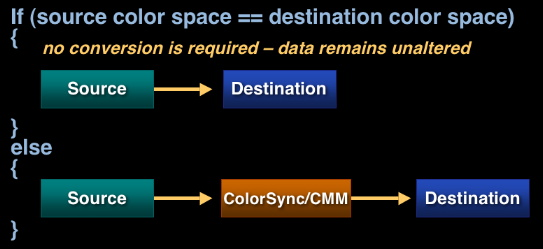

#### Color space is one or more ICC profiles

As mentioned previously, all PDF color spaces are expressed in Quartz as an ICC profile in a manner which is seamless and transparent through all applications working in the PDF imaging model. But at the same time, we needed a provision in Quartz to create color transformations for more than two profiles. For that reason, we designed a color space which can consist of one or more ICC profiles. This way we are able to preserve the PDF concept of matching a single source to a single destination, but at the same time we are able to create those complex color transformations which are suitable for advanced color management. And if the need arises for such a color space to be embedded in PDF, the multiple profiles contained in such a color space can be concatenated by ColorSync into a single profile.

### Color in Quartz Drawing Model

Let's now see how all the things just discussed come together to provide the desired color processing in the Quartz drawing model. From the top-level perspective, there are three main components involved in this model:

- An application generating the graphic contents
- Quartz providing the rendering services
- The destination for the rasterized data

In terms of color processing, the application can request Quartz to render data in any of the PDF color spaces. To accomplish that, Quartz will convert all these into ICC profiles. Default profiles are selected by Quartz, but can be overridden by the application. Quartz will do all compositing in the working space, and ColorSync will be invoked to perform color transformations from any of the source color spaces to the working space. Finally, when compositing is completed, the rasterized data will be sent to the desired destination. Naturally, if the color space of the destination doesn't match the working space, and additional conversion must be done.

Let's see how convenient Quartz color management can be for some color operations. For example, applying special effects to all data can be very easily achieved simply by adding the abstract profile to the working space. As shown in the following diagram, all conversions to the working space will include the transformation defining the abstract profile:

__Figure 6__  Applying Special Effects with Abstract Profile.

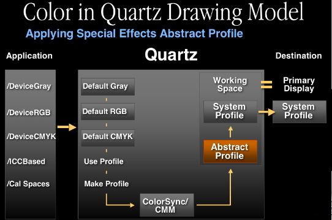

Soft proofing is another task that is particularly suited for color management, By adding a printer profile to the working space, all color corrections that define the printer profile are reflected in the working space, and thus will be shown on the primary display.

__Figure 7__  Soft-proofing Printout on Primary Display.

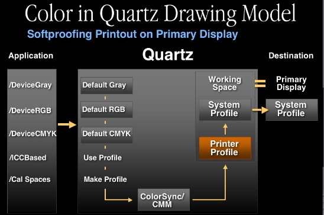

The use of multi-profile color spaces is not limited to the Quartz internals. Applications can also use them. Here is an example of an application using a given color space to create a free-transform color space to produce certain color effects.

__Figure 8__  Free-transform color space used to produce color effects.

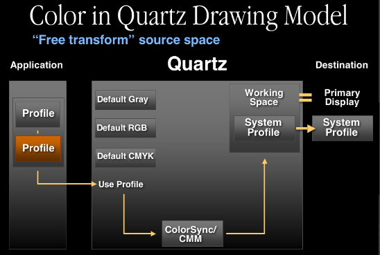

### Quartz Printing Front End

To complete our story about color management in Quartz, let's look at how color is handled in printing from Quartz. So far we've talked about the main flow of color data from the source to the destination. But one more step is also possible here. The contents can be spooled in PDF form for printing, which will be handled by the print center. There is one very important fact about the spooled data. As was pointed out, all color data is tagged in spooled PDF. And profiles are assigned to the data in exactly the same way they are for ColorSync processing:

__Figure 9__  Color data is tagged in spooled PDF.

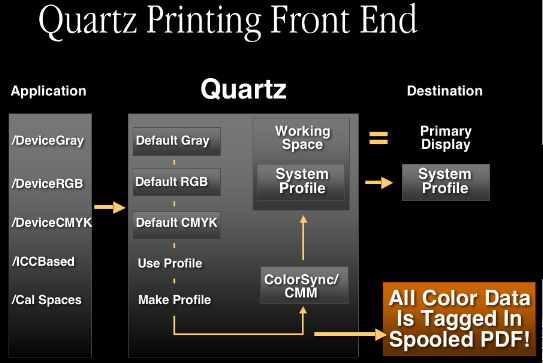

### Quartz Raster Printing Back End

#### ColorSync Color Matching

Quartz is also used to rasterize this spooled PDF at the printing back end. From the color management perspective, we have two options here. The first option is to use ColorSync for color matching. In this case, all color data from the spooled PDF is converted to the printer profile (Note: there is no device data in the spooled PDF).

__Figure 10__  Spooled PDF converted to printer profile.

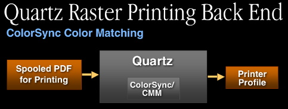

#### Custom Driver Color Matching

Another option is custom driver color matching.The color data, by design, is going to be handed off in the color space of the default profile provided by the system. As a result, all data which is tagged with the same default profile will remain untouched. And obviously all other color data will be converted by ColorSync to the system profile.

__Figure 11__  Custom driver color matching.

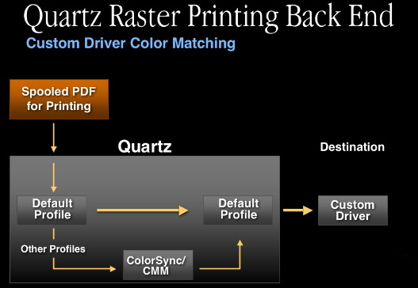

### Quartz in PostScript Back End

ColorSync is also involved in the PostScript back end. From the color management perspective, our goal here is to convert the color spaces contained in the spooled PDF to PostScript color space arrays (CSAs). Quartz has the internal capability to convert PDF calibrated color spaces directly to PostScript CSAs. All ICC profiles will be converted to PostScript CSAs using ColorSync.

__Figure 12__  ICC profiles converted to PostScript CSAs.

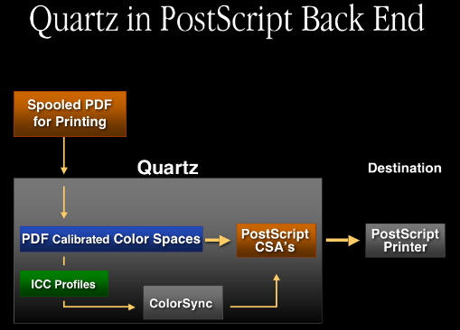

### Printing Untagged Data

Here's some general notes about behaviors you can expect from the printing system when printing untagged data:

#### PDF Display

Untagged RGB data in PDF will be tagged with the Generic RGB profile, and as a result it will be color-matched to the screen.

#### Printing Front End

When passing source data to the print system, the printing front end spools the print job in the PDF format, and as described in the section above Quartz Printing Front End, all color data is tagged in the spooled PDF. Therefore, when passing untagged RGB source data to the print system for printing, ColorSync will tag the data with the Generic RGB profile (just as is done when displaying PDF data).

#### Printing Back End

When printing in Mac OS X, ColorSync will match source data to whatever profile the printer driver provides. For this reason, printer drivers should register profiles for their devices using the Device APIs as discussed in this note.

#### Raster Printing

If a printer driver provides no profile, ColorSync will substitute the Generic RGB profile.

#### PostScript Printing

Originally untagged RGB data is ultimately converted to a CIEBasedABC color space based on the Generic RGB profile.

[Back to Top](#)

## Drawing to Multiple Screens

As described in the section ColorSync and Quartz there is a wide variety of ICC-based color spaces provided by Quartz. This section focuses on those which allow you to access the ColorSync Device Integration database.

An example are the color spaces which allow for drawing directly to the screen. There's the Display RGB color space, which is essentially a wrapper around the primary display profile. Display Gray, composed of two profiles: a device-link profile converting Gray to RGB, which is then attached to the primary display profile. And for more advanced uses there's the Display with ID space, a wrapper for Display By AVID profiles:

__Figure 13__  Color spaces which allow for drawing directly to the screen.

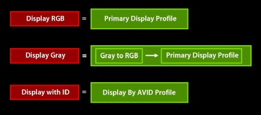

Quartz in Mac OS X v10.3 "Panther" helps solve the problem of drawing to multiple screens. There are three basic choices an application can make, one which can be defined as the "Simple model", another which can be defined as the "Complete model" or lastly an application can use a combination of these two techniques.

These can be characterized as follows:

Applications' choice

Simple model

- color-matched only to the main display
- application makes no updates on screen/profile change

Complete model

- color-matched to individual displays
- application can register for device notifications on screen/profile change and make proper updates as necessary

Some combination of the above

- application can use a combination of the above two techniques

[Back to Top](#)

## Profiles in Mac OS X

On Mac OS 9, profiles are traditionally stored in the Profiles folder within the System folder. An application wanting to gain access to this folder would use the `CMGetColorSyncFolderSpec` API, passing in `kSystemDisk` for the `vRefNum` parameter as follows:

`CMGetColorSyncFolderSpec`(`kSystemDisk`, ...);

You could also use the Mac OS `FindFolder` API as an equivalent technique. However, one of the key features of Mac OS X is it is designed to be fully network and multi-user savvy. For this reason, there is no longer just one location where profiles can be stored, but several. There is a special location within the Mac OS X System folder for profiles:

/System/Library/ColorSync/Profiles/

This is where ColorSync stores profiles it uses internally for critical operations, should others be mistakenly lost or damaged. This folder is locked and protected, but if you need to get access to this folder to be able to read these profiles you can again use the `CMGetColorSyncFolderSpec` API, passing the `kSystemDomain` constant for the `vRefNum` parameter as follows:

`CMGetColorSyncFolderSpec`(`kSystemDomain`, ...);

ColorSync profiles are primary stored here:

/Library/ColorSync/Profiles/

This is where ColorSync stores the majority of its profiles. This is a read/writable folder. If you need to get access to this folder to be able to read these profiles use the `CMGetColorSyncFolderSpec` API, passing the `kLocalDomain` constant for the `vRefNum` parameter as follows:

`CMGetColorSyncFolderSpec`(`kLocalDomain`, ...);

If you are in a network environment, and your network administrator has stored profiles on the network for network devices, these can be stored in:

/Network/Library/ColorSync/Profiles/

If you need to get access to this folder to be able to read these profiles use the `CMGetColorSyncFolderSpec` API, passing the `kNetworkDomain` constant for the `vRefNum` parameter as follows:

`CMGetColorSyncFolderSpec`(`kNetworkDomain`, ...);

Lastly, users can store their own personal profiles in their home directory:

~/Library/ColorSync/Profiles/

If you need to get access to this folder to be able to read these profiles use the `CMGetColorSyncFolderSpec` API, passing the `kUserDomain` constant for the `vRefNum` parameter as follows:

`CMGetColorSyncFolderSpec`(`kUserDomain`, ...);

As on Mac OS 9, ColorSync in Mac OS X supports looking in subfolders of all the above directories (one level deep), or aliases to these folders or profiles. In summary, there are a great many locations where profiles can be stored in Mac OS X. If your application would like to present a list of profiles to the user, we suggest you use the `CMIterateColorSyncFolder` API. This API will greatly simplify your code, as it searches all the above locations for profiles. In addition, it offers great performance benefits because it caches frequently used information.

One important note with respect to this API - if you have a Mac OS Classic system folder setup in addition to the Mac OS X system folder, ColorSync by default will not search this Mac OS Classic system folder for profiles. However, if your application wishes to access profiles in this location, use the `CMIterateColorSyncFolder` API passing `kClassicDomain` for the `vRefNum` parameter:

`CMGetColorSyncFolderSpec`(`kClassicDomain`, ...);

In summary, an application should install profiles in:

/Library/ColorSync/Profiles/

or in a subfolder of it. Users can install personal profiles in:

~/Library/ColorSync/Profiles/

### Profile prerequisites

Traditionally, profiles were filtered based on their type and creator on Mac OS 9 (type '`prof`', creator '`sync`'). However, profiles may not have a type and creator, so ColorSync no longer checks the type and creator of profiles. Also, profiles need not have any suffix. However, if you do use one use '`.icc`'. By standardizing on one suffix it makes it easier for applications using the Cocoa `NSOpenPanel` APIs to filter profiles. Similarly, if you use a type and creator for your profile, use '`prof`' and ''`sync`'', as this will make it easier for the Carbon Navigation Services APIs to filter profiles. At its heart, ColorSync no longer cares about type, creator, or suffix.

What really distinguishes a ColorSync profile from any old file is if it is a valid ICC profile. ColorSync determines if a file is a valid ICC profile by looking for the signature bytes '`acsp`' (stands for "a ColorSync profile") at an appropriate offset in its header block. ColorSync also imposes the additional restriction that the profile contain a valid description tag. Many applications will present lists of profiles to the user, and if a profile has a bad name in the description tag, it will show as garbage or not at all. In order to avoid these problems, we suggest you use the ColorSync Profile First Aid utility to make sure your profiles are free of common errors.

### New optional profile tags

One of the key features of Mac OS X is it is a multilocalized operating system. ColorSync now provides this same functionality for ICC profiles. Currently, the ICC format defines a required tag 'desc' which stores ASCII, UniCode, and ScriptCode versions of the profile description for display purposes. However, this structure allows the profile to be localized for one language only through UniCode or ScriptCode. Profile vendors have to ship many localized versions to different countries. It also creates problems when a document with localized profiles embedded in it is shipped to a system using a different language. ColorSync has defined a new optional tag to remedy this situation:

- '`mluc`' multilocalized UniCode Tag

This tag contains a set of multilingual Unicode strings associated with a profile. We also provide a number of new APIs for easy access to this tag:

```
CMError CMCopyProfileLocalizedStringDictionary   (CMProfileRef prof, OSType tag, CFDictionaryRef* dict);
```

prof - profile to query

tag - tag type of profile to query

dict - returns dictionary

This API allows you to get a `CFDictionary` which contains the language locale and string for multiple localizations from a given tag. Similarly, there is a `CMSetProfileLocalizedStringDictionary` API to allow you to write a dictionary of localized strings to a given tag in a profile:

```
CMError CMSetProfileLocalizedStringDictionary   (CMProfileRef prof, OSType tag, CFDictionaryRef dict);
```

prof - profile to modify

tag - tag type of profile to modify

dict - dictionary to modify

However, most applications will simply want to get one specific string out of a profile. For this reason, we provide the `CMCopyProfileLocalizedString` function:

```
CMError CMCopyProfileLocalizedString (CMProfileRef  prof,                                       OSType        tag,                                       CFStringRef   reqLocale,                                       CFStringRef*  locale,                                        CFStringRef*  str);
```

prof - profile to query

tag - tag type of profile to query

`reqLocale` - requested locale (optional

locale - returns locale (optional)

dict - returns dictionary string (optional)

Here's a short example showing how to use this function. We pass in the optional tag '`dscm`' plus "`enUS`" for the `reqLocale` parameter, looking for a U.S. Enlish string. If a U.S. English string is not found, ColorSync will fall back to a reasonable default:

```
err = CMCopyProfileLocalizedString (prof, 'dscm', CFSTR("enUS"), nil, &theStr);
```

### ICC4 Profiles

The ICC has been working on a new format for profiles to provide for more flexibility and power. This new format is the ICC 4.0 profile format specification. Some of the highlights include:

- New version in header

to distinguish from earlier versions

- New MD5 (message digest) checksum in header

to tell if two profiles are identical , or if a profile has changed over time. You can access this new MD5 checksum directly in the profile header, or alternately there is a new ColorSync API `CMGetProfileMD5`. The ColorSync API has the advantage that it works with both ICC 4 profiles and earlier profiles.

- New tag data types ('`mluc`', '`mBA` ', '`mAB` ', '`para`')

These new tags really demonstrate the new power and flexibility of the ICC 4 profiles. One important note is some of your existing tags may now contain these new data formats e.g., '`A2B0`' may contain '`mft1`' or '`mAB` ' data. The good news is ColorSync and the Apple CMM will be fully ICC4 savvy. This means if your application does not parse profiles, but simply uses profile references for color matching, everything will "just work". However, if your application creates of modifies profiles, you need to be aware of these new tag types to make sure you handle these cases correctly.

[Back to Top](#)

## CMMs in Mac OS X

As with profiles, CMMs can also be installed in multiple locations. Typically, applications would install CMMs in:

/Library/ColorSync/CMMs

Also, users may install personal CMMs (for example, for debugging) in:

~/Library/ColorSync/CMMs

If your application would like to present a list of CMMs to the user, use the `CMMIterateCMMInfo` API. See [Technical Note TN1160, 'What's New With ColorSync 2.6'](https://developer.apple.com/technotes/tn/tn1160.html) for more information. This will give you information about all the CMMs installed on the system, including the default CMM.

### Building CMMs

CMMs in Mac OS X are `CFBundle` based, whereas on Mac OS 9 they are Component Manager based. See the `CFBundle` documentation for details on using these APIs to build your CMM as a `CFBundle`.

CMMs in Mac OS X still contain all the familiar entry points that exist for CMMs on Mac OS 9 such as `CMMOpen`, `CMMConcat`, `CMMMatchBitmap`, `CMMClose`, etc. However, Mac OS X CMMs now have a `CFBundle` wrapper around these entry points instead of a Component Manager wrapper.

The Apple CMM has undergone a lot of work to make sure it is finely tuned and integrated fully with Quartz to handle all the various profile types and image color spaces correctly. If you are writing your own CMM, make sure and test it thoroughly, and under a wide variety of cases to ensure it works in this environment.

[Back to Top](#)

## ColorSync Preferences and Supporting APIs

Under Classic Mac OS, applications performing color management generally do not have knowledge of the various devices on the system. Because of this, applications would find it necessary to present some kind of interface to obtain device color information from the user. Similarly, applications performing color management on data with no associated profile would need to understand what type of device the data originated from. Again, this would require the application present some kind of interface to allow the user to select a default profile for a color space or document. Over time, users were becoming confused by the great myriad of different interfaces being presented by applications performing color management. ColorSync in Mac OS X is now aware of system devices, and the ColorSync user interface has been redesigned to take advantage of this information.

### Profiles for Standard Color Spaces

Documents can of course contain many different types of data. With this menu users can specify profiles for documents for different color spaces. Of course if the document does have a profile, this will take precedence, but often times documents don't have profiles associated with them. Users can retrieve this preference via the `CMGetDefaultProfileBySpace` API as follows:

```
enum {         cmXYZData = 'XYZ ',         cmLabData = 'Lab ',         cmRGBData = 'RGB ',         cmSRGBData = 'sRGB',         ...      };  CMGetDefaultProfileBySpace ( OSType space, CMProfileRef* prof );
```

space - the color space

prof - returns the default profile for the specified color space

Here's sample code demonstrating how an application might benefit from these APIs. The sample accepts an image reference as an input and attempts to obtain information or data from this reference. The first thing an application should do when managing color for a document is to determine whether or not any embedded profile exists for the document. Most of the modern image formats have containers for profiles, so there are known ways to get profiles for documents in these formats. However, if there is no profile associated with the document, we can conveniently use the `CMGetDefaultProfileBySpace` API (after first obtaining the image color space) to get a reasonable default source profile for the document.

Next, we obtain a destination profile for the document. We can use the `CMGetDefaultProfileByUse` to get a destination profile. With both a source and destination profile we are now able to perform our color management - in this example, we use `NCWNewColorWorld` and `CWMatchBitMap`.

One important note regarding this example is the code shown here is appropriate for a Mac OS Classic or Carbon application running on Mac OS 9. In Mac OS X, much of the destination color management is done for you, so you don't need this matching if your application uses Quartz. However, you need to at least be aware of where the data is coming from, and if no profile is associated with it you can tag it using the ColorSync APIs.

ColorSync Prefs Code Sample

```
CMError myMatchImage (myImageRef image) {     CMProfileRef source, dest;     CMWorldRef cw;     CMBitMap bm;      source = myGetEmbeddedProfile (image);     if (source == nil)     {         space = myGetColorImageSpace (image);         err = CMGetDefaultProfileBySpace (space, &source);     }      err = CMGetDefaultProfileByUse (cmDisplayUse, &dest);     err = NCWNewColorWorld (&cw, source, dest);     bm = myGetImageBitMap (image);     err = CWMatchBitMap (cw, &bm, ..., ..., ...); ...
```

### ColorSync Preferences Tidbits

As with ColorSync 3.0 on Mac OS 9, ColorSync applications in Mac OS X can also launch the ColorSync control panel to solicit color choices, including default profiles for devices and documents, as well as the preferred CMM. Users can also switch between named collections of color settings called workflows.

To launch the ColorSync control panel from your application, simply call the following function:

```
pascal CMError CMLaunchControlPanel (UInt32 flags);
```

flags - You must pass a value of 0 for this parameter. Future versions of ColorSync may define constants for the flags parameter to specify how the ColorSync control panel is launched.

function result - A result code of type CMError.

When your application calls the `CMLaunchControlPanel` routine, any changes made by the user will not be available (through calls such as `CMGetDefaultProfileBySpace`) until the user closes the ColorSync control panel. There is currently no ColorSync API for determining if the ColorSync control panel has been closed, though on Mac OS 9 you can use the Process Manager API for this purpose.

### ColorSync Preferences Summary

Since all data is color managed by Quartz in Mac OS X, your application can participate simply by making sure your source and destination data is associated with a profile. Most applications can use the ColorSync Preferences APIs for color management, to get user's preferences. And these profile accessor APIs are extensible, a bridge to future device and color-space support. Lastly, the ColorSync Preferences APIs offer great flexibility in that applications can manage color from both document-centric and device-centric perspectives.

[Back to Top](#)

## ColorSync Device Support

Mac OS X contains new device managers for input, display, and printing. This provides an opportunity for developers to integrate with ColorSync and provide both awareness of devices and access to their profiles. This new device support has been implemented with the following services:

- Device registration
- Profile registration
- Default Device and Default Profile accessors
- Notification

Device and Profile Registration:

ColorSync relies on the Device Managers to detect the presence of devices and to discover or build device profiles. The following are new ColorSync APIs which you can use to capture device and profile information:

__CMRegisterColorDevice__

```
CMError CMRegisterColorDevice(   CMDeviceClass          deviceClass,   CMDeviceID             deviceID,   CFDictionaryRef        deviceName,   const CMDeviceScope *  deviceScope);
```

__Parameters__

deviceClass

The class of the device (e.g., 'scnr', 'cmra', 'prtr', 'mntr')

deviceID

Unique identifier per class (Class + ID uniquely id's device)

deviceName

Name of the device.

deviceScope

Structure defining the user and host scope this device pertains to.

For a device to be recognized by ColorSync (and possibly other parts of MacOSX) it needs to register itself via this API. If the device has ColorSync profiles associated with it, it should identify those via the `CMSetFactoryDeviceProfiles` API, after registering with this API. Once a device is registered, it can appear as an input, output, or proofing device in ColorSync controls, as long as it has profiles associated with it. Registration need only happen once, when the device is installed. Device drivers need not register their device each time they are loaded.

__CMUnregisterColorDevice__

```
CMError CMUnregisterColorDevice (  CMDeviceClass    deviceClass,  CMDeviceID    deviceID );
```

__Parameters__

deviceClass

The class of the device (e.g., 'scnr', 'cmra', 'prtr', 'mntr')

deviceID

Unique identifier per class (Class + ID uniquely id's device)

When a device is no longer to be used on a system (as opposed to being offline), it should be unregistered. If a device is temporarily shut down or disconnected, it need not be un-registered unless the device driver: a) "knows" that it will not be used (being de-installed) b) cannot access the device profiles without the device. If either of these are true, the device should be un-registered.

__CMSetFactoryDeviceProfiles__

```
CMError CMSetFactoryDeviceProfiles (  CMDeviceClass        deviceClass,  CMDeviceID        deviceID,  CMDeviceProfileID    defaultID,  const CMDeviceProfileArray*    deviceProfiles );
```

__Parameters__

deviceClass

The class of the device (e.g., 'scnr', 'cmra', 'prtr', 'mntr')

deviceID

Unique identifier per class (Class + ID uniquely id's device)

defaultID

The id of the default profile for this device.

deviceProfiles

Ptr to caller's storage containing the profile array.

This API establishes the profiles used by a given device. It should be called after device registration to notify ColorSync of the device's profiles. Note that a distinction is made in the API between the "factory" device profiles and the current device profiles, since the latter may contain modifications to the factory set.

Default Devices and Default Profiles:

These new APIs for profiles and standard devices provide access to defaults, not just any device profile. When profiles are registered for a device, one is identified as the default for that device. However, over time, the user may change their settings. When a user changes settings, the default device or default profile may change, and ColorSync is made aware of such changes by the Device Managers. The Device Managers keep track of which device is default.

Here are some new APIs to manage default devices and profiles:

__CMSetDefaultDevice__

```
CMError CMSetDefaultDevice (  CMDeviceClass    deviceClass,  CMDeviceID    deviceID );
```

__Parameters__

deviceClass

The class of the device (e.g., 'scnr', 'cmra', 'prtr', 'mntr')

deviceID

Unique identifier per class (Class + ID uniquely id's device)

For each class of device, a device management layer may establish which of the registered devices is the default. This helps keep color management choices to a minimum and allows for some "automatic" features to be enabled, e.g., "Default printer" as an output profile selection. If no such device (as specified by deviceClass and deviceID) has been registered, an error is returned.

__CMSetDeviceDefaultProfileID__

```
CMError CMSetDeviceDefaultProfileID (  CMDeviceClass        deviceClass,  CMDeviceID        deviceID,  CMDeviceProfileID    defaultID );
```

The default profile ID for a given device is an important piece of information because of the `CMGetProfileByUse` API. This API will return the default profile for devices depending on the user's selection in the ColorSync Control Panel. Device drivers and host software can get and set the default profile for a given device with this API.

__Parameters__

deviceClass

The class of the device (e.g., 'scnr', 'cmra', 'prtr', 'mntr')

deviceID

Unique identifier per class (Class + ID uniquely id's device)

defaultID

The id of the default profile for this device.

Calibration Support:

These new Device Managers in Mac OS X now make if possible for ColorSync to provide support for calibration. This is made possible by the data ColorSync is given for a profile by the Device Managers. Profiles are registered with an ID and a "mode" name (e.g., "plain paper"). Profiles are referenced during processing by ID. Such profiles can be customized by an application. For example a calibration application can get the factory profile for a given calibration mode, and then set a new profile (by ID) to be used for that mode.

Here are some new APIs supporting profile customization:

__CMGetDeviceFactoryProfiles__

```
CMError CMGetDeviceFactoryProfiles (  CMDeviceClass        deviceClass,  CMDeviceID        deviceID,  CMDeviceProfileID*    defaultID,  UInt32*        arraySize,  CMDeviceProfileArray*    deviceProfiles );
```

This API allows the caller to retrieve the original profiles for a given device. These may differ from the actual profiles in use for that device, in the case where any factory profiles have been replaced (updated). To get the actual profiles in use, call `CMGetDeviceProfiles`.

Parameters

deviceClass

The class of the device (e.g., 'scnr', 'cmra', 'prtr', 'mntr')

deviceID

Unique identifier per class (Class + ID uniquely id's device)

defaultID

Ptr to storage for the id of the default profile for this device.

arraySize

Ptr to storage for the size of the array to be returned. The caller may first call this routine to get the size returned, then call it again with the size of the buffer to receive the array.

deviceProfiles

Ptr to callers storage to receive the profile array. The caller may first pass NIL in this parameter to receive the size of the array in the arraySize parameter. Then, once the appropriate amount of storage has been allocated, a pointer to it can be passed in this parameter to have the array copied to that storage.

__CMSetDeviceProfiles__

```
CMError CMSetDeviceProfiles(   CMDeviceClass                 deviceClass,   CMDeviceID                    deviceID,   const CMDeviceProfileScope *  profileScope,   const CMDeviceProfileArray *  deviceProfiles);
```

This API provides a way to change the profile(s) used by a given device. It can be called after device registration by calibration applications to reset a device's profile(s) from factory defaults to calibrated profiles. In order for this call to be made successfully, the caller must pass the `CMDeviceClass` and `CMDeviceID` device being calibrated. (Device selection and identification can be facilitated via the `CMIterateColorDevices`() API). If an invalid `CMDeviceClass` or `CMDeviceID` is passed, an error (`CMInvalidDeviceClass` or `CMInvalidDeviceID`) is returned.

__Parameters__

deviceClass

The class of the device (e.g., 'scnr', 'cmra', 'prtr', 'mntr')

deviceID

Unique identifier per class (Class + ID uniquely id's device)

profileScope

Structure defining the scope these profiles pertain to.

deviceProfiles

Ptr to caller's storage containing the profile array which contains replacements for the factory profiles. Not all the original profiles must be replaced with this call. Therefore the array can contain as few as 1 profile and as many as there were in the factory array if they are all to be replaced. Profiles are repaced by ID.

__CMSetDeviceProfile__

```
CMError CMSetDeviceProfile(   CMDeviceClass                 deviceClass,   CMDeviceID                    deviceID,   const CMDeviceProfileScope *  profileScope,   CMDeviceProfileID             profileID,   const CMProfileLocation *     deviceProfLoc);
```

This API provides a way to change a profile used by a given device by ID. It can be called after device registration by calibration applications to reset a device's profile from factory defaults to calibrated profiles. In order for this call to be made successfully, the caller must pass the `CMDeviceClass` and `CMDeviceID` of the device being calibrated along with the CMDeviceProfileID of the profile to set. (Device selection and identification can be facilitated via the `CMIterateColorDevices`() API). If an invalid `CMDeviceClass` or `CMDeviceID` is passed, an error (`CMInvalidDeviceClass` or `CMInvalidDeviceID`() is returned.

__Parameters__

deviceClass

The class of the device (e.g., 'scnr', 'cmra', 'prtr', 'mntr')

deviceID

Unique identifier per class (Class + ID uniquely id's device)

profileScope

Structure defining the scope these profiles pertain to.

profileID

The id of the default profile for this device.

deviceProfLoc

Ptr to storage for the CMProfileLocation of the profile. Since this structure is a fixed length structure, the caller can simply pass a ptr to a stack-based structure or memory allocated for it.

### Notifications

Applications now can be made aware of changes to devices on their system. ColorSync will post notifications to a distributed notification center (check the Cocoa and Core Foundation documentation for additional details on distributed notification centers). Any process on the system which registers with a distributed center will receive these notifications. Here's some of the available notifications:

- Changes to the default device for a device class
- Changes to a device's factory or custom profiles
- Changes to a device's default profile
- Device registration/un-registration
- Changes to any of the settings in the ColorSync Preferences (for example, if the user changes the preferred CMM)

There are no ColorSync APIs to register to receive the above notifications - ColorSync only posts these notifications to the distributed center. Instead, use the following Cocoa and Core Foundation APIs to receive the above notifications:

```
CFNotificationCenterAddObserver NSDistributedNotificationCenter
```

Here's the specific notification strings (from the ColorSync interface file CMDeviceIntegration.h) which you can use with the above functions:

```
#define  kCMDeviceRegisteredNotification   CFSTR("CMDeviceRegisteredNotification") #define  kCMDeviceUnregisteredNotification  CFSTR("CMDeviceUnregisteredNotification") #define  kCMDeviceOnlineNotification  CFSTR("CMDeviceOnlineNotification") #define  kCMDeviceOfflineNotification  CFSTR("CMDeviceOfflineNotification") #define  kCMDeviceStateNotification   CFSTR("CMDeviceStateNotification") #define  kCMDefaultDeviceNotification  CFSTR("CMDefaultDeviceNotification") #define  kCMDeviceProfilesNotification  CFSTR("CMDeviceProfilesNotification") #define  kCMDefaultDeviceProfileNotification                              CFSTR("CMDefaultDeviceProfileNotification") #define  kCMPrefsChangeDeviceNotification                              CFSTR("AppleColorSyncPreferencesChangedNotification")
```

To demonstrate how the general notification mechanism works, here's a code snippet written in Cocoa showing how you can get notified when the display profile changes. First, register with the default distributed notification center to receive the necessary ColorSync device notifications. Then, when the notification is received, simply call `CMGetDefaultProfileByUse` to determine the current setting for the display profile:

```objc
-(void)registerNotifications {     NSDistributedNotificationCenter *center;      center = [NSDistributedNotificationCenter defaultCenter];      [center addObserver:self                selector:@selector(notification:)                    name:kCMDeviceUnregisteredNotification                  object:nil];     [center addObserver:self                selector:@selector(notification:)                    name:kCMDefaultDeviceNotification                  object:nil];     [center addObserver:self                selector:@selector(notification:)                    name:kCMDeviceProfilesNotification                  object:nil];     [center addObserver:self                selector:@selector(notification:)                    name:kCMDefaultDeviceProfileNotification                  object:nil]; } -(void)notification:(NSNotification *)note {    CMError err = CMGetDefaultProfileByUse(cmDisplayUse, &gProfRef); }
```

Similar code to check for profile changes could be written using the Mac OS X Core Foundation distributed notifications (using NSDistributedNotificationCenter, etc.). Check the Mac OS X Core Foundation documentation for additional information.

### ColorSync Device Support Summary

ColorSync is now integrated with Device Managers. Applications have access to the default profiles for standard devices (input, display, output) via the new ColorSync preferences APIs. Applications can get more specific profile information for registered devices from these APIs. Calibration is now supported in ColorSync plus new notification services are now provided.

[Back to Top](#)

## Color Management in Printing

A very important aspect of color management in Mac OS X is color management in the printing system. Printing in Mac OS X consists of two main components: the front end and the back end. The main role of the front end is to choose the printer, get the necessary print options and spool the print job into PDF.

The main role of the back end is to convert the spooled PDF into an appropriate format for the printer.

If we take a closer look at the printing front end we notice all color data in the spooled PDF is tagged with profiles. By definition, no printer specific color conversions are done at the front end, but it's important to note the printing system will consult the ColorSync Device Integration database and extract the profile matching the current printing conditions.

What happens at the back end depends on the type of printer in use.

For raster printers, the spooled PDF is rasterized and the color data is converted into the printer profile. This is accomplished by extracting the printer profile from the print job. If none exist, the printing system will provide a default profile so matching can occur.

For PostScript printers, there are two options: the first is traditional color matching in the printer. For this option, all the profiles from the spooled PDF are converted into PostScript CSAs.

### Color Matching On The Host by ColorSync

There's an option for doing color matching on the computer using ColorSync. In this case, as with raster printing, profiles are retrieved from the print job. If none exist, the printing system will provide a default profile so color matching can occur.

### cupsICCProfile PPD Declaration Entry

CUPS PostScript and raster drivers may use the `cupsICCProfile` keyword to specify the various modes for a device along with the profiles for each mode. The format for this entry is as follows:

__Listing 1__  New PPD declaration entry.

```
*cupsICCProfile {mode specifier} {profile specifier}
```

where the mode specifier is the concatenation of three fields: color model, media type and resolution. Any of these fields can be omitted to signify any model/media/resolution. The profile specifier is the profile standard file path relative to /usr/share/cups/profiles/.

Here's an example showing a PostScript printer PPD file that is registering two modes: one for 600 X 600 dpi and one for 1200 X 1200 dpi, followed by the profile specifier:

__Listing 2__  Example PostScript PPD file registering two modes.

```
*%======================== *% Device capabilities *%========================   *ColorDevice: True   *DefaultColorSpace: CMYK   *cupsICCProfile ..600x600dpi "cmykProfile600dpi.icc" *cupsICCProfile ..1200x1200dpi "cmykProfile1200dpi.icc"
```

[Technical Q&A QA1352, 'New PPD keywords available in Mac OS X version 10.3'](https://developer.apple.com/qa/qa2004/qa1352.html) describes this new PPD keyword in detail as well.

[Back to Top](#)

## Quartz Filters

Quartz filters are an optional component in the Quartz imaging and color-matching pipeline which allow you to associate a sequence of imaging or color correction operations with a single drawing. Filters may act on all drawing operations or only on a specified set. They can be configured to perform specialized imaging or color operations. They may be defined and saved in XML.

Here's a diagram showing how the Quartz filter component fits into the overall Quartz architecture:

__Figure 14__  Quartz Filter Component in the Quartz Architecture.

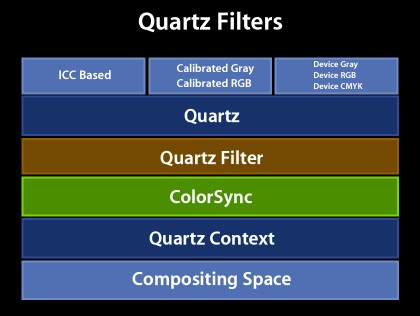

Quartz filters are currently available only through the various Mac OS X system-built utilities and applications. However, a new set of API's will be forthcoming.

### Demos of Quartz filters

### Soft-Proofing

Soft-proofing via Quartz filters is possible from the print dialog. Simply click the "Preview" button in the print dialog and in the Preview window you'll now see a check box titled "Soft Proof" in the lower-left corner of the window. Here's how it looks:

__Figure 15__  Soft-proofing feature.

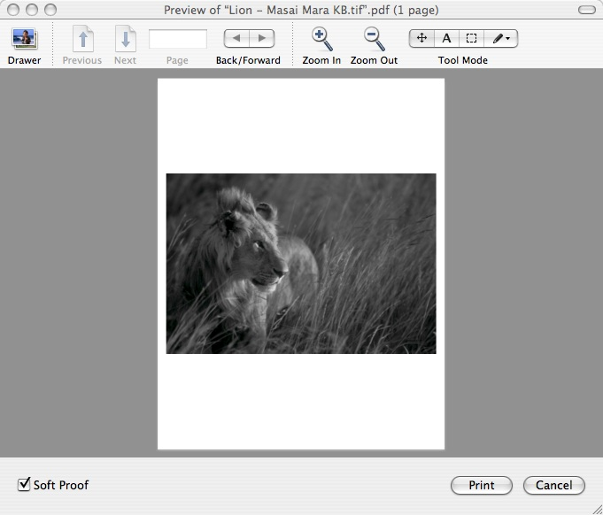

### Print dialog

Notice the above image is very dark. This can be corrected using the ColorSync printer dialog extension (PDE).

To access the ColorSync PDE, open the print dialog, click the "Advanced" button, then in the resulting dialog look for the item "ColorSync" in the popup menu list:

__Figure 16__  ColorSync PDE.

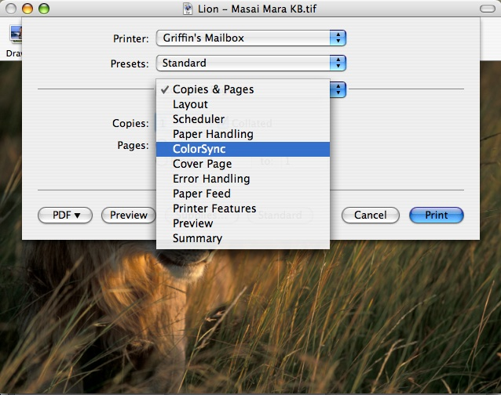

The ColorSync PDE allows PostScript printers to choose which color-matching option to use via the "Color Conversion" popup menu. Select either"Standard" or "In Printer":

__Figure 17__  Color conversion selection.

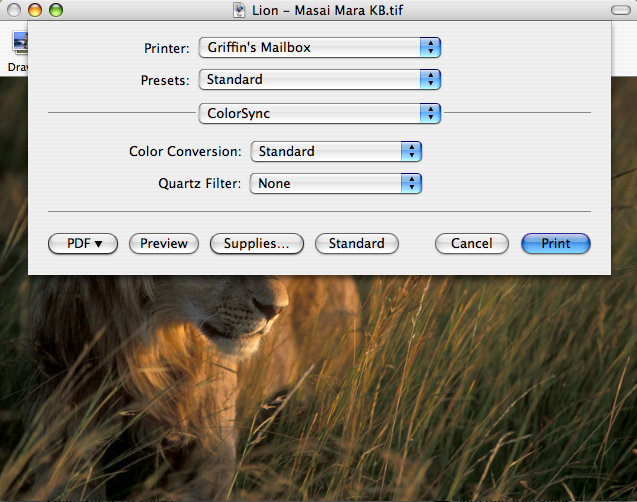

Using the Color Conversion options it's possible to perform color-matching on the computer using the printer profile ("Standard"), or fall-back to traditional color matching in the printing path ("In Printer").

Finally, at the bottom of the "Quartz Filter" menu in the ColorSync PDE there is an option to add Quartz filters when printing,:

__Figure 18__  Quartz filters menu option.

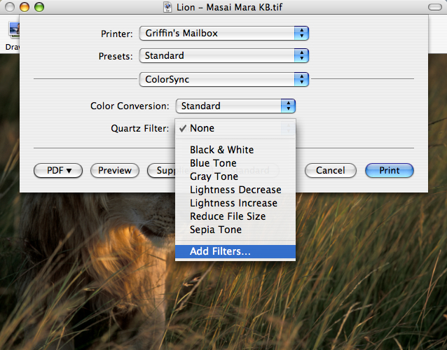

Select this option and the document is spooled to PDF and sent along with the "open" ('`oapp`') AppleEvent to the ColorSync Utility, which opens the document with the filter inspector window as shown below:

__Figure 19__  Filter inspector window.

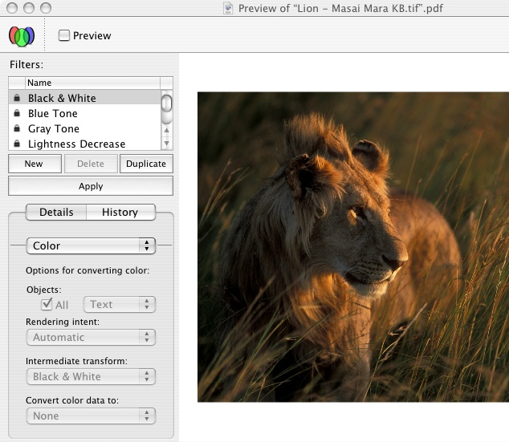

If you click any of the filters in the list and also click the "Preview" check box you can see the results of applying the selected filter. You can add and remove filters by clicking the "New" and "Delete" buttons.

For each filter there are a number of different options which you can manage. These are:

- Color - options for converting color
- Default profiles
- Image sampling/compression/convolution
- Filter domain
- PDF parameters
[Back to Top](#)

## ColorSync Utility

### ColorSync Preferences

The ColorSync Preferences are part of ColorSync Utility (previously they were in the System Preferences). This makes ColorSync Utility the "one-stop shopping" center for all the ColorSync related settings.

It's well known many applications may provide a button in their program's user interface to send users to the ColorSync preferences. This is usually accomplished by calling the `CMLaunchColorSyncPreferences` function. Applications which use this function will continue to work. This function will simply launch the ColorSync Utility instead.

#### Quartz Filter Support

Users can access Quartz filters from the ColorSync Utility. For more information on Quartz filters, see Quartz Filters.

### Administration Features

ColorSync Utility contains administration features which allow the system administrator user to specify the default profiles for other users on the same machine.

### 3D View Options for Profile Viewer

The 3D profile viewer in ColorSync Utility has a contextual menu to allow you to view the profile in a number of different color spaces such as Lab, Luv, Yxy and others. Here's how it looks:

__Figure 20__  3D viewer contextual menu.

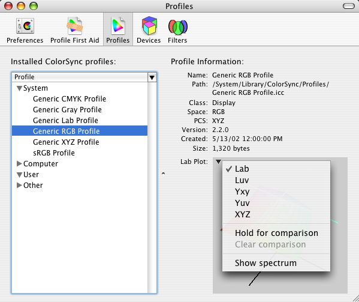

You can also use the profile viewer to compare the gamut of two profiles. A contextual menu item "Hold for comparison" allows you to specify the first of a pair of profiles to use for comparison. Simply control-click on a profile in the viewer pane to bring up the contextual menu, then select "Hold for comparison". The profile will lighten in color to indicated it has been selected as shown here:

__Figure 21__  Hold for comparison menu item.

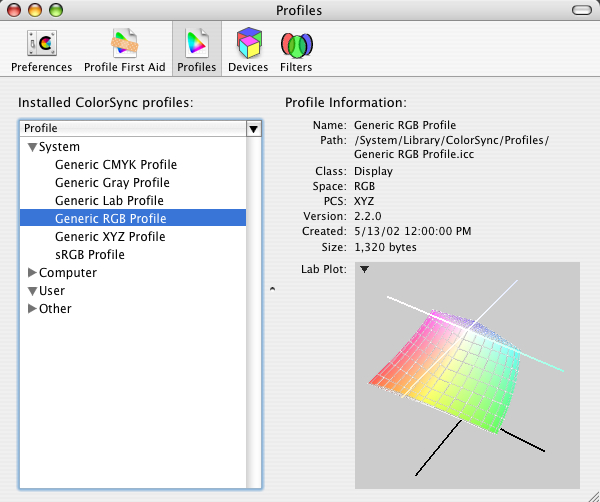

Now select another profile from the list and the viewer pane will show both profiles together along with any overlap.

__Figure 22__  Comparing the gamut of two profiles.

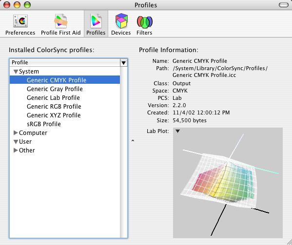[Back to Top](#)

## ColorSync and OpenGL

ColorSync and OpenGL can be used to perform real-time color correction and enhancement of video. In the past, this was only possible on very high-end hardware, but now it can be done on desktop machines due to the availability of high performance video cards.

Many modern video cards have support for per-pixel 3d texture lookup. This is currently available on the following video cards:

- nVidia GeoForce TI
- ATI Radeon 9000 series

By loading color correction transformations into these tables, you can accomplish real-time color correction. This is quite powerful, and it demonstrates the integration of all the graphics technologies available in Mac OS X. It combines the advantages and powers of ColorSync, OpenGL, QuickTime and Quartz.

The way this works is QuickTime content is played on a Quartz OpenGL surface, and attached to that surface is a 3D texture built from a ColorSync color world reference.

In order to make it easier for applications to do this, some APIs were added to ColorSync. The first is `CMMakeProfile`. This is a general purpose function which allows you to create a ColorSync profile given a `CFDictionary` of attributes. For example, you can use this API to create an abstract profile to perform hue rotation, set contrast, and so on. You can also use this API to create standard RGB profiles.

Here's the definition for the `CMMakeProfile` function:

__CMMakeProfile__

```
CMMakeProfile  CMError CMMakeProfile(CMProfileRef prof,                       CFDictionaryRef spec)
```

__Description__

Adds appropriate tags to a profile to make display or abstract profile based on an specification dictionary.

__Parameters__

prof(in/out)

the profile to modify

spec(in)

specification dictionary

One key in the specification dictionary must be "`profileType`" which must have a `CFString` value of "`abstractLab`", "`displayRGB`" or "`displayID`". It can also contain the keys/values:

"`description`" `CFString` (optional)

"`copyright`" `CFString` (optional)

For `profileType` of "`abstractLab`", the dictionary should also contain the keys/values:

"`gridPoints`" `CFNumber`(`SInt32`) (should be odd)

"`proc`" `CFNumber`(SInt64)

(coerced from a `LabToLabProcPtr`)

"`refcon`" `CFNumber`(SInt64) (optional)

(coerced from a void)

For `profileType` of "`displayRGB`", the dictionary should also contain the keys/values:

"`targetGamma`" `CFNumber`(`Float`) (e.g. 1.8) (optional)

"`targetWhite`" `CFNumber`(`SInt32`) (e.g. 6500) (optional)

"`gammaR`" `CFNumber`(`Float`) (e.g. 2.5)

"`gammaG`" `CFNumber`(`Float`) (e.g. 2.5)

"`gammaB`" `CFNumber`(`Float`) (e.g. 2.5)

"`tableChans`" `CFNumber`(`SInt32`) (1 or 3) (optional)

"`tableEntries`" `CFNumber`(`SInt32`) (e.g 16 or 255) (optional)

"`tableEntrySize`" `CFNumber`(`SInt32`) (1 or 2) (optional)

"`tableData`" `CFData` (lut in RRRGGGBBB order) (optional)

either

"`phosphorRx`" `CFNumber`(`Float`)

"`phosphorRy`" `CFNumber`(`Float`)

"`phosphorGx`" `CFNumber`(`Float`)

"`phosphorGy`" `CFNumber`(`Float`)

"`phosphorBx`" `CFNumber`(`Float`)

"`phosphorBy`" `CFNumber`(`Float`)

or

"`phosphorSet`" `CFString` ("`WideRGB`", "700/525/450nm",

"`P22-EBU`", "`HDTV`", "`CCIR709`", "`sRGB`",

"`AdobeRGB98`" or "`Trinitron`")

either

"`whitePointx`" `CFNumber`(`Float`)

"`whitePointy`" `CFNumber`(`Float`)

or

"`whiteTemp`" `CFNumber`(`SInt32`) (e.g. 5000, 6500, 9300)

For `profileType` of "`displayID`", the dictionary should also contain the keys/values:

"`targetGamma`" `CFNumber`(`Float`) (e.g. 1.8) (optional)

"`targetWhite`" `CFNumber`(`SInt32`) (e.g. 6500) (optional)

"`displayID` `CFNumber`(`SInt32`)

Optionally, the keys/values for "`displayRGB`" can be provided to override the values from the display.

Here's a short code snippet showing how to use `CMMakeProfile` to make an abstract profile:

```
void myLabToLabProc(float* L, float* a, float* b, void* refcon) {     float angle = *(float*)refcon;     float aa = (*a), bb = (*b);     *a = aa*cos(angle) - bb*sin(angle);     *b = aa*sin(angle) + bb*cos(angle); }  void makeAbstractWithAngle (CMProfileRef prof, float angle) {     CFDictionaryRef dict;     SInt64 cb64, rc64;     SInt32 gridPoints;     CFStringRef keys[4];     CFTypeRef vals[4];     CMError cmErr;      keys[0] = CFSTR("profileType");     vals[0]= CFSTR("abstractLab");      gridPoints = 33;     keys[1] = CFSTR("gridPoints");     vals[1]= CFNumberCreate(0, kCFNumberSInt32Type, &gridPoints);      cb64 = (SInt64) myLabToLabProc;     keys[2] = CFSTR("proc");     vals[2]= CFNumberCreate(0, kCFNumberSInt64Type, &cb64);      rc64 = (SInt64) &angle;     keys[3] = CFSTR("refcon");     vals[3]= CFNumberCreate(0, kCFNumberSInt64Type, &rc64);      dict = CFDictionaryCreate(nil, keys, vals, 4,                 &kCFTypeDictionaryKeyCallBacks,                 &kCFTypeDictionaryValueCallBacks);      cmErr = CMMakeProfile(prof, dict);      CFRelease(vals[1]); CFRelease(vals[2]); CFRelease(vals[3]);     CFRelease(dict); }
```

The second API added to support the real-time color correction of video is `CWFillLookupTexture`. This API fills a 3D lookup texture from a colorworld. The resulting table is suitable for use in OpenGL to accelerate color management in hardware.

Here's the formal definition for `CWFillLookupTexture`:

`CWFillLookupTexture`

```
CWFillLookupTexture            CMError CWFillLookupTexture( CMWorldRef cw,                                        UInt32 gridPoints,                                        UInt32 format,                                        UInt32 dataSize,                                        void * data)
```

__Description__

This API fills a 3D lookup texture from a colorworld. The resulting table is suitable for use in OpenGL to accelerate color management in hardware.

__Parameters__

cw (in)

the colorworld to use

`gridPoints` (in)

number of grid points per channel in the texture

format (in)

format of pixels in texture (e.g. `cmTextureRGBtoRGBX8`)

dataSize (in)

size in bytes of texture data to fill

data (in/out)

pointer to texture data to fill

Here's a short code snippet showing how to use `CWFillLookupTexture`:

```
void* make_3d_texture(CMProfileRef src, CMProfileRef abs, CMProfileRef dst) {     UInt32 size, grid = 9, fmt = cmTextureRGBtoRGBX8;     CMWorldRef cw;     void* data;     CMError err;      cw = make_colorworld(src, abs, dst);     err = CWFillLookupTexture(cw, grid, fmt, &size, nil);     data = malloc(size);     err = CWFillLookupTexture(cw, grid, fmt, &size, &data);      return data; }
```

Also, sample code is available in the Mac OS X Developer Tools which demonstrates the use of the above-mentioned APIs to perform real-time color correction. Download and install the Mac OS X Developer Tools and look for the "ColorWhirled" sample here :

/Developer/Examples/ColorSync/ColorWhirled

[Back to Top](#)

## ColorSync And QuickTime

QuickTime 6.4 introduces new graphics importer functions such as `GraphicsImportSetDestinationColorSyncProfileRef` that provide support for ColorSync in Mac OS X. These functions make ColorSync matching the default behavior for native applications that use graphics importers, that is, for image files with embedded ColorSync profiles and for image files with CMYK image data, with or without embedded ColorSync profiles.

An opt-out flag is provided for applications that call ColorSync directly.

For a complete list of these new functions, see the [What's New in QuickTime 6.4 document](https://developer.apple.com/documentation/QuickTime/WhatsNewQT6_4/index.html).

[Back to Top](#)

## ColorSync And Image Capture

By default, Image Capture will register a Generic camera profile for all devices, so all downloaded images will be assigned a profile. Optionally, you may specify a profile to be embedded in images you download or scan. Use the `ICADownloadFile` function along with the `kEmbedColorSyncProfile` flag.

See the [Image Capture SDK](https://developer.apple.com/sdk/) for more details.

[Back to Top](#)

## Display Calibration

Display calibration gives the user the ability to automatically generate profiles for the display, and to calibrate the display in an easy to use fashion. Display calibration is performed by clicking the "Calibrate" button in the Display preferences (found in the System Preferences).

Normally, this button will simply launch the Apple calibrator. However, this architecture supports third-party calibrators as well.

There's a few simple modifications you'll need to make to your calibrator for it to be recognized by ColorSync. Here's a quick summary:

### Support for your calibrator

- Build your Carbon or Cocoa calibration application as you would normally
- Add new `CSDisplayCalibrator` key to the Info.plist
- Support a new optional property in the '`oapp`' AppleEvent
- Install your calibrator (or a symlink to it) in /Library/ColorSync/Calibrators/

To get you started, there's an example calibrator that's installed with the Developer Tools in:

/Developer/Examples/ColorSync/

Look for the project "DemoCalibrator". This sample code demonstrates how to make the above modifications to a calibrator. Use this sample as a starting point for your calibrator.

To see how this works, build the demo calibrator and install the built executable into /Library/ColorSync/Calibrators/. Now go to the Display Preferences (in the System Preferences), click the "Color" tab and click the "Calibrate" button. This will bring up a new dialog that allows the user to choose which of the installed calibrators to use. Here's how the dialog looks:

__Figure 23__  Dialog for choosing a Calibrator.

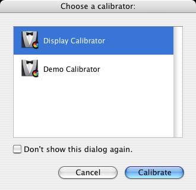

### Apple Calibrator Expert Mode

An expert mode is available for the Apple calibrator. To see this in action, go to the Display Preferences, click the "Color" tab, then click the "Calibrate" button and finally select the "Display Calibrator" (the Apple calibrator) in the list. Now click the "Calibrate" button and in the resulting window click the expert mode check box to turn on expert mode.

The Apple calibrator has the ability to show single-patch, and the ability to adjust the tint/brightness control, which allows for much finer control. This was necessary because it's very hard for users to adjust blue gamma as it is less visible to the human eye.

The Apple calibrator also allows for multiple steps. This means in addition to adjusting mid-tones, you can adjust highlights, shadows and dark shadows. This will result in good calibration on LCD displays, which have complex gamma curves.

The Apple calibrator also allows the calibration profile to be used by other users on the same machine.

[Back to Top](#)

## SIPS

SIPS stands for: Scriptable Image Processing System. SIPS was created because it was determined there was a need for a tool which would perform many common operations on image files in a scriptable manner.

As it stands, there are a number of existing technologies which provide for manipulations of images. For example, ColorSync Scripting can perform many ColorSync operations such as color-matching of images, but it can't rotate, scale or convert formats. Image Capture Scripting can rotate and scale images, but it can't color match or convert formats. Finally, the Preview application can rotate, scale and covert formats, but it is not Apple-scriptable.

SIPS brings all these different technologies together to provide a single tool with which to perform common operations on images. The current feature set for SIPS includes:

- Read, write or convert different raster image formats
- jpeg (Jfif & Xiff), TIFF, GIF, PNG
- Basic image operations
- Rotate, flip, crop, pad, resample, change dpi
- Color management operations
- Embed, extract or match to profiles
- Read or write known metadata tags
- Preserve original content whenever possible

Possible features for future releases of SIPS include:

- Support for complex formats
- Multilayer, multipage or vector-based
- Advanced image operations
- Blur, sharpen, ehnance, etc.
- Read or write any metadata tag (list of metadata tags is always increasing, contact dts@apple.com to suggest additional tags)

SIPS is currently implemented as a simple compiled tool, which is installed in /usr/bin/sips. It links against CoreGraphics, QuickTime and ColorSync. It can operate on one or more file at a time. It can query or modify images or profiles. SIPS queries can return properties in simple text form or in XML form. Actions can modify files in-place or to an output directory.

Because SIPS is a simple command line tool there's lots of ways to use it. It can be invoked from the terminal shell, from AppleScript, from other scripting languages or from an application using C code (AppKit or Posix calls).

For example, open the Terminal and type `sips --help`. This will give the help page for SIPS (a standard man page will be forthcoming). Here's the output you'll see:

```shell
$ sips --help  sips 1.0 - scriptable image processing system. This tool is used to query or modify raster image files and ColorSync ICC profiles. Its functionality can also be used through the "Image Events" AppleScript suite. Usages: sips [-h, --help]  sips [-H, --helpProperties]  sips [image query functions] imagefile(s)  sips [profile query functions] profile(s)  sips [image modification functions] imagefile(s)  [--out outimage | --out outdir]  sips [profile modification functions] profile(s)  [--out outprofile | --out outdir] Profile query functions:  -g, --getProperty key  -X, --extractTag tag tagFile  -v, --verify  Image query functions:  -g, --getProperty key  -x, --extractProfile profile  Profile modification functions:  -s, --setProperty key value  -d, --deleteProperty key  --deleteTag tag  --copyTag srcTag dstTag  --loadTag tag tagFile  --repair  Image modification functions:  -s, --setProperty key value  -d, --deleteProperty key  -e, --embedProfile profile  -E, --embedProfileIfNone profile  -m, --matchTo profile  -M, --matchToWithIntent profile intent  -r, --rotate degreesCW  -f, --flip horizontal|vertical  -c, --cropToHeightWidth pixelsH pixelsW  -p, --padToHeightWidth pixelsH pixelsW  -z, --resampleHeightWidth pixelsH pixelsW  --resampleWidth pixelsW  --resampleHeight pixelsH  -Z, --resampleHeightWidthMax pixelsWH  -i, --addIcon
```

Here's an example of a simple SIPS command to rotate an image 30 degrees:

```
$sips -r 30 /Users/steve/image.JPG
```

Here's an example of a simple SIPS command to get an image property (the image height).

First, get a list of the available image properties with the `--helpProperties` command:

```
$sips --helpProperties    Special properties:      all                  binary data     allxml               binary data   Image properties:      dpiHeight            float      dpiWidth             float      pixelHeight          integer (read-only)     pixelWidth           integer (read-only)     format               string  jpeg | tiff | png | gif | jp2 | pict | bmp | qtif | psd     formatOptions        string  default | [low|normal|high] | packbits     space                string (read-only)     samplesPerPixel      integer (read-only)     bitsPerSample        integer (read-only)     creation             string (read-only)     make                 string      model                string      software             string (read-only)     description          string      copyright            string      artist               string      profile              binary data   Profile properties:      description          utf8 string     size                 integer (read-only)     cmm                  string      version              string      class                string (read-only)     space                string (read-only)     pcs                  string (read-only)     creation             string      platform             string      quality              string  normal | draft | best     deviceManufacturer   string      deviceModel          integer     deviceAttributes0    integer     deviceAttributes1    integer     renderingIntent      string  perceptual | relative | satuation | absolute     creator              string      copyright            string      md5                  string (read-only)
```

Then, issue the command using the image property qualifier:

```shell
$ sips -g dpiHeight image.JPG  image.JPG   dpiHeight: 216.000
```

[Back to Top](#)

## ColorSync changes for Mac OS X 10.4 Tiger

### Floating Point Support

One of the goals of Tiger was to provide a new high fidelity, cinematic graphical environment. In order to achieve this, full floating point support was needed throughout the entire operating system, with ColorSync as one of the key components.

### New structure: CMFloatBitmap

To provide for this new graphical environment, ColorSync has introduced a new bitmap structure `CMFloatBitmap` to support arbitrary bitmaps and floating point data. One of the design goals for this structure was to make it as flexible as possible so developers would not be required to re-pack the data before passing it to ColorSync.

__Listing 3__  `CMFloatBitmap` structure.

```
/*  *  CMFloatBitmap  *   *  Summary:  *    A new structure that defines and arbitrary map of float color  *    values.  *   *  Discussion:  *    The structure defines a pixel array of dimensions  * [height][width][chans] where 'chans' is the number of channels in  *    the colorspace plus an optional one for alpha. The actual memory  *    pointed to by the structure can contain a variety of possible  *    arrangements. The actual data values can be chunky or planar.  *    The channels can by in any order.   *   *    Examples:   *    a) float* p contains a 640w by 480h bitmap of chunky RGB data   *        CMFloatBitmap map = { 0,         // version   *                    {p, p+1, p+2},       // base addrs of R,G,B   *                    480, 640,            // height, width   *                    640*3,               // rowStride   *                    3,                   // colStride   *                    cmRGBData,   *                    kCMFloatBitmapFlagsNone};   *    b) float* p contains a 640w by 480h bitmap of chunky BGRA data   *        CMFloatBitmap map = { 0,         // version   *                    {p+2, p+1, p, p+3},  // base addrs of R,G,B,A   *                    480, 640,            // height, width   *                    640*4,               // rowStride   *                    3,                   // colStride   *                    cmRGBData,   *                    kCMFloatBitmapFlagsAlpha};   *    c) float* p contains a 640w by 480h bitmap of planar CMYK data   *        CMFloatBitmap map = { 0,        // version   *                    {p, p+640*480 , p+2*640*480 , p+3*640*480},   *                    480, 640,           // height, width   *                    640,                // rowStride   *                    1,                  // colStride   *                    cmCMYKData,   *                    kCMFloatBitmapFlagsNone};  */ struct CMFloatBitmap {    /*    * The version number of this structure to allow for future    * expansion. Should contain 0 for now.    */   unsigned long       version;    /*    * The base address for each channel in canonical order. The    * canonical order for RGB is R,G,B. CMYK is C,M,Y,K etc. A maximum    * of sixteen channels is supported. Another way to think of this is    * buffers[c] = &(pixelArray[0][0][c])    */   float *             buffers[16];    /*    * The height (in pixels) of the bitmap.    */   size_t              height;    /*    * The width (in pixels) of the bitmap.    */   size_t              width;    /*    * The number of floats to skip to move from one row to the next.    * This is typically (width*chans) for chunky pixel buffers or    * (width) for planar. Can be negative if the image is vertically    * flipped.    */   ptrdiff_t           rowStride;    /*    * The number of floats to skip to move from one column to the next.    * This is typically (chans) for chunky pixel buffers or (1) for    * planar. Can be negative if the image is horizontally flipped.    */   ptrdiff_t           colStride;    /*    * The colorspace of the data (e.g cmRGBdata cmCMYKData)    */   OSType              space;    /*    * Holds bits to specify the alpha type of the data. The remaining    * bits are reserved for future use.    */   CMFloatBitmapFlags  flags; }; typedef struct CMFloatBitmap            CMFloatBitmap;
```

This new `CMFloatBitmap` structure supports both planar and chunky arrangements of data. Each channel is permitted to have a different base address rather than a single base address for all pixel data. This allows channels to be in any arbitrary order. Also, if you require unusual packing between channels, or if your data needs to be scanned in reverse order the structure allows for both rowbytes and columnbytes to be specified.

### New APIs

A number of new APIs have been introduced for working with the `CMFloatBitmap` structure. These are described below.

#### CMFloatBitmapMakeChunky

Most developers will specify a buffer of chunky or interleaved data with the `CMFloatBitmap` structure, so there is a new utility function `CMFloatBitmapMakeChunky` which will fill in the structure appropriately. You simply supply a single base address. Here's how it looks:

__Listing 4__  `CMFloatBitmapMakeChunky` function.

```
/*  *  CMFloatBitmapMakeChunky()  *   *  Summary:  *    A handy funtion to fill in a CMFloatBitmap.  *   *  Discussion:  *    Returns a filled in CMFloatBitmap structure given a single buffer  *    of chunky data with no alpha.  *   *  Parameters:  *   *    buffer:  * (in) address of interleaved data  *   *    height:  * (in) height of bitmap in pixels  *   *    width:  * (in) width of bitmap in pixels  *   *    space:  * (in) colorsapce of the data  *   *  Result:  *    a filled in CMFloatBitmap  *   *  Availability:  *    Mac OS X: in version 10.4 and later in ApplicationServices.framework  *    CarbonLib: not available  *    Non-Carbon CFM: not available  */ extern CMFloatBitmap  CMFloatBitmapMakeChunky(   float *  buffer,   size_t   height,   size_t   width,   OSType   space) AVAILABLE_MAC_OS_X_VERSION_10_4_AND_LATER;
```

Regardless of whether you fill the structure by hand or call the helper API, you can then use ColorSync to match the data defined by any floating point bitmap. There are three new functions to do this:

#### CMConvertXYZFloatBitmap

`CMConvertXYZFloatBitmap` will convert `CMFloatBitmap` structures across all the CIE related color spaces : XYZ, Yxy, Lab and Luv.

__Listing 5__  `CMConvertXYZFloatBitmap` function.

```
/*  *  CMConvertXYZFloatBitmap()  *   *  Summary:  *    Used to convert CMFloatBitmaps between the related colorspaces  *    XYZ, Yxy, Lab, and Luv.  *   *  Discussion:  *    The buffer data from the source CMFloatBitmap is converted into  *    the buffer data specified the destination CMFloatBitmap.   *    Converion "in-place" is allowed.  *   *  Parameters:  *   *    src:  * (in) description of source data buffer to convert from  *   *    srcIlluminantXYZ:  * (in) required if src->space is XYZ or Yxy  *   *    dst:  * (in,out) description of destination data buffer to convert to  *   *    dstIlluminantXYZ:  * (in) required if dst->space is XYZ or Yxy  *   *    method:  * (in) the chromatic adaptation method to use  *   *  Availability:  *    Mac OS X: in version 10.4 and later in ApplicationServices.framework  *    CarbonLib: not available  *    Non-Carbon CFM: not available  */ extern CMError  CMConvertXYZFloatBitmap(   const CMFloatBitmap *   src,   const float             srcIlluminantXYZ[3],   CMFloatBitmap *         dst,   const float             dstIlluminantXYZ[3],   CMChromaticAdaptation   method) AVAILABLE_MAC_OS_X_VERSION_10_4_AND_LATER;
```

#### CMConvertRGBFloatBitmap

`CMConvertRGBFloatBitmap` will convert `CMFloatBitmap` structures across the RGB derived spaces : RGB, HSV and HLS.

__Listing 6__  `CMConvertRGBFloatBitmap` function.

```
/*  *  CMConvertRGBFloatBitmap()  *   *  Summary:  *    Used to convert CMFloatBitmaps between the related colorspaces  *    RGB, HSV, and HLS.  *   *  Discussion:  *    The buffer data from the source CMFloatBitmap is converted into  *    the buffer data specified the destination CMFloatBitmap.   *    Converion "in-place" is allowed.  *   *  Parameters:  *   *    src:  * (in) description of source data buffer to convert from  *   *    dst:  * (in,out) description of destination data buffer to convert to  *   *  Availability:  *    Mac OS X: in version 10.4 and later in ApplicationServices.framework  *    CarbonLib: not available  *    Non-Carbon CFM: not available  */ extern CMError  CMConvertRGBFloatBitmap(   const CMFloatBitmap *  src,   CMFloatBitmap *        dst) AVAILABLE_MAC_OS_X_VERSION_10_4_AND_LATER;
```

Both of these functions are based on well known textbook formulas, so there's no need to pass in a profile or colorworld to handle the transform. Instead, these functions will perform the mathematical calculations for you with floating point precision.

#### CMMatchFloatBitmap

`CMMatchFloatBitmap` will color match floating point bitmaps. You may pass in a color world reference to perform the actual transformation. You can create the color world by concatenating one or more profiles. The data is then sent through the CMM, and if the CMM supports floating point data the transformation will be performed using full floating point precision.

__Listing 7__  `CMMatchFloatBitmap` function.

```
/*  *  CMMatchFloatBitmap()  *   *  Summary:  *    Used to convert CMFloatBitmaps using a CMWorldRef.  *   *  Discussion:  *    The buffer data from the source CMFloatBitmap is converted into  *    the buffer data specified the destination CMFloatBitmap.   *    Converion "in-place" is allowed.  *   *  Parameters:  *   *    cw:  * (in) the CMWorldRef to convert with  *   *    src:  * (in) description of source data buffer to convert from  *   *    dst:  * (in,out) description of destination data buffer to convert to  *   *  Availability:  *    Mac OS X: in version 10.4 and later in ApplicationServices.framework  *    CarbonLib: not available  *    Non-Carbon CFM: not available  */ extern CMError  CMMatchFloatBitmap(   CMWorldRef             cw,   const CMFloatBitmap *  src,   CMFloatBitmap *        dst) AVAILABLE_MAC_OS_X_VERSION_10_4_AND_LATER;
```

### Use of CFTypes

#### CMProfileRef and CMWorldRef are now a CFType

ColorSync is now more closely integrated with the Core Foundation types (`CFType` objects). The two common opaque ColorSync data types, `CMProfileRef` and `CMWorldRef`, are now `CFType` objects. This is very convenient because you can now use the Core Foundation functions such as `CFRetained` and `CFRelease` with these data types, and you can also add profiles or color worlds to `CFDictionaries` and `CFArrays`. This is handy if you are passing `CFDictionaries` and color worlds around in various parts of your code.

#### CMProfileCopyICCData

The `CMProfileCopyICCData` function lets you extract the data out of the profile. In the past, this was done by calling the `CMCopyProfile` or `CMFlattenProfile` functions and this was a bit more work. Now, the entire process is much easier. Just call `CMProfileCopyICCData` and it will return you all the data in the profile as one big `CFData` object.

__Listing 8__  `CMProfileCopyICCData` function.

```
/*  *  CMProfileCopyICCData()  *   *  Summary:  *    Return a copy of the icc data specified by `prof'.  *   *  Parameters:  *   *    allocator:  * (in) The object to be used to allocate memory for the data  *   *    prof:  * (in) The profile to query  *   *  Availability:  *    Mac OS X: in version 10.4 and later in ApplicationServices.framework  *    CarbonLib: not available  *    Non-Carbon CFM: not available  */ extern CFDataRef  CMProfileCopyICCData(   CFAllocatorRef   allocator,   CMProfileRef     prof) AVAILABLE_MAC_OS_X_VERSION_10_4_AND_LATER;
```

### API Changes

Below is a discussion of APIs changes for ColorSync in Mac OS X 10.4 Tiger.

#### Some of the ColorSync defaults/preferences APIs are to be deprecated

Several years ago, one feature added to ColorSync at both the API and user-interface level was a set of ColorSync Preferences and Supporting APIs to enable applications to specify default profiles based on usage and color space. The goal of these APIs was to simplify the user interface across a wide variety of applications. In practice, very few applications have used these APIs. In addition, developers have indicated they are confused with the user interface in Colorsync Utility, because any changes made in the settings don't seem to have any kind of noticable effect.

As a result, these APIs are being deprecated along with the user interface. However, existing applications that are using these APIs need to function correctly, so the behavior of the following functions has been changed:

`CMGetDefaultProfileBySpace`/`SetDefaultProfileBySpace`

`CMGetDefaultProfileByUse`/`SetDefaultProfileByUse`

`CMGetPreferredCMM`

These functions will now store their preferences in the domain:

Current Application / Current Host / Current User

instead of storing them as a setting that is global across the machine.

Again, these APIs will continue to work, but are now deprecated.

### Custom CMMs

Listed below are changes for Custom CMM's in Mac OS X 10.4 Tiger.

#### Quartz and Printing Graphics Systems will now only use the Apple CMM

New changes to Color Management in Mac OS X 10.4 Tiger have resulted in a tighter and more powerful integration between the Quartz and Printing graphics systems. However, in order for the Quartz and Printing graphics systems to work at peak performance and reliability it was necessary to restrict them to use only the Apple CMM.

#### Applications can still request a custom CMM using NCWConcatColorWorld and explicitly match data

ColorSync has for a long time now allowed developers to build their own CMM's, and it has also allowed applications to use these third-party CMM's in their applications. With Mac OS X 10.4 Tiger, applications may still call third party CMMs and explicity create color worlds using these CMMs. This can be done with the recommended API `NCWConcatColorWorld` which lets you specify a CMM identifier in the `NCMConcatProfileSet` structure.

#### New CMMMatchFloatMap entry point

Also, there's a new entry point for CMMs: `CMMMatchFloatMap`. If your CMM supports this it will give you full access to the new floating point support provided throughout the Quartz system. If you don't support this, your data will be truncated to 16-bit integer.

### Changes to ColorSync Utility

This section discusses changes to ColorSync Utility.

#### Removal of Preferences Pane

As described in API Changes, we are deprecating the Preferences APIs for default profiles. As a result, we are removing the user interface for the Preferences pane in Colorsync Utility.

#### New Color Calculator Pane

We've added a new utility called Color Calculator. This utility lets you easily perform color space conversions with floating point precision. Here's a screenshot showing how it looks:

<IMAGE>

[Back to Top](#)

## References

- [ColorSync Manager Reference](https://developer.apple.com/documentation/GraphicsImaging/Reference/ColorSync_Manager/index.html)
- [Introduction to Color and Color Management](https://developer.apple.com/documentation/GraphicsImaging/Conceptual/csintro/index.html)
- [Technical Note TN1160, 'What's New With ColorSync 2.6'](https://developer.apple.com/technotes/tn/tn1160.html)
- [Technical Q&A QA1352, 'New PPD keywords available in Mac OS X version 10.3'](https://developer.apple.com/qa/qa2004/qa1352.html)
- ColorWhirled sample code (installed with the [Xcode Tools](https://developer.apple.com/tools/macosxtools.html)) at /Developer/Examples/ColorSync/ColorWhirled

[Back to Top](#)

---

#### Document Revision History

| __Date__ | __Notes__ |
| 2005-08-10 | Describes ColorSync changes for Mac OS X 10.4 "Tiger" |
| 2004-06-25 | Miscellaneous formatting changes. |
| 2004-06-16 | Describes ColorSync changes for Mac OS X 10.3 |
| 2003-02-10 | New document that describes ColorSync, which is fundamentally integrated into Mac OS X. |

