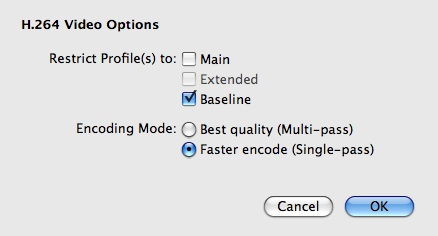
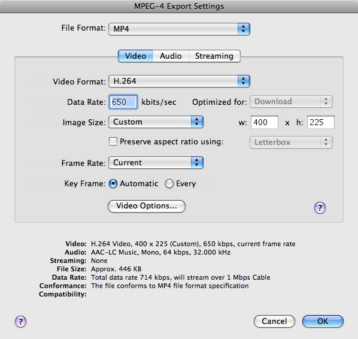
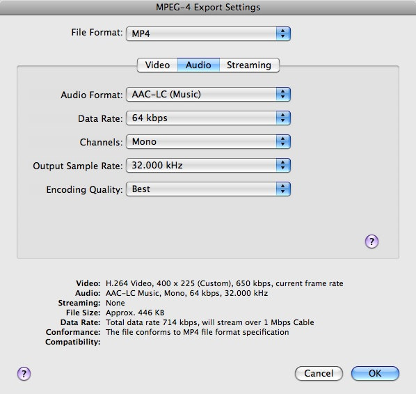
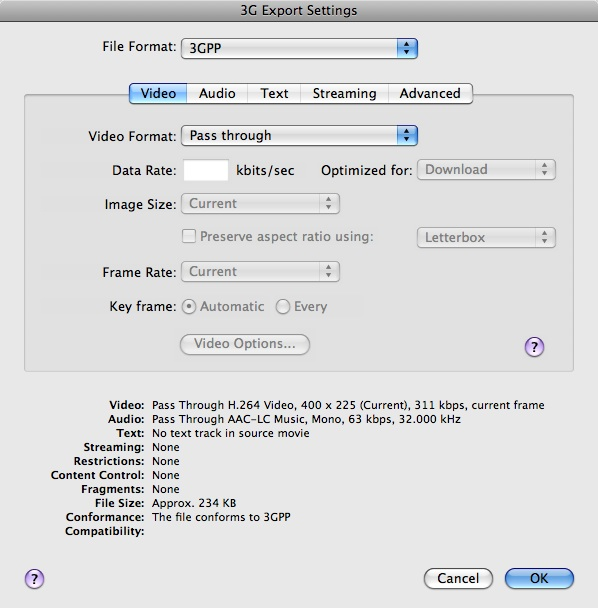
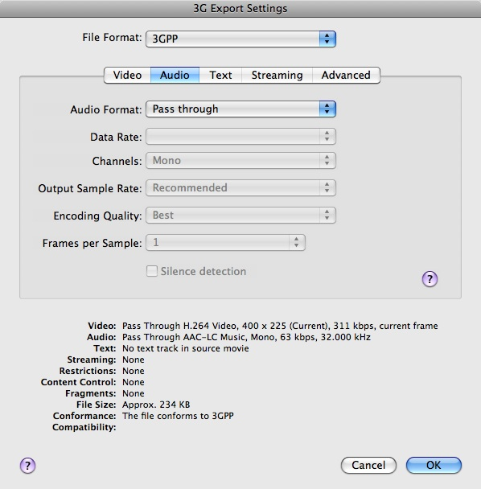
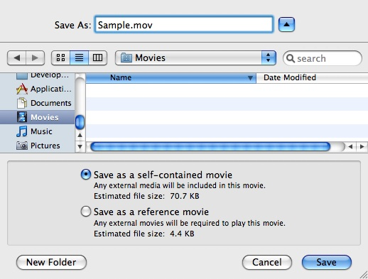

> 导航：[总目录](../../README.md) · [technotes](../../_indexes/technotes.md)

Technical Note TN2218

# Compressing QuickTime Movies for the Web

Describes recommended compression settings to use when creating QuickTime movies for delivery on the web.

[Introduction](#apple-f4xwc4dqnrsv64tfmyxwi33df52wszbpirkfgnbqgaydonrsguwugsbrfvjukq2ujfhu4mi)[Many Devices and Delivery Challenges](#apple-f4xwc4dqnrsv64tfmyxwi33df52wszbpirkfgnbqgaydonrsguwugsbrfvjvkqstivbviskpjyyq)[H.264](#apple-f4xwc4dqnrsv64tfmyxwi33df52wszbpirkfgnbqgaydonrsguwugsbrfvjvkqstivbviskpjyza)[Fast Start (Progressive Download) Movies](#apple-f4xwc4dqnrsv64tfmyxwi33df52wszbpirkfgnbqgaydonrsguwugsbrfvjvkqstivbviskpjyzq)[Use QuickTime Pro](#apple-f4xwc4dqnrsv64tfmyxwi33df52wszbpirkfgnbqgaydonrsguwugsbrfvjvkqstivbviskpjy2q)[The Importance of Source Material](#apple-f4xwc4dqnrsv64tfmyxwi33df52wszbpirkfgnbqgaydonrsguwugsbrfvjukq2ujfhu4ny)[Pick a Target](#apple-f4xwc4dqnrsv64tfmyxwi33df52wszbpirkfgnbqgaydonrsguwugsbrfvjukq2ujfhu4oa)[Device](#apple-f4xwc4dqnrsv64tfmyxwi33df52wszbpirkfgnbqgaydonrsguwugsbrfvjvkqstivbviskpjy4a)[Network](#apple-f4xwc4dqnrsv64tfmyxwi33df52wszbpirkfgnbqgaydonrsguwugsbrfvjvkqstivbviskpjyyta)[MPEG-4 or QuickTime Movie?](#apple-f4xwc4dqnrsv64tfmyxwi33df52wszbpirkfgnbqgaydonrsguwugsbrfvjvkqstivbviskpjyyte)[Recommended H.264 Compressor Settings](#apple-f4xwc4dqnrsv64tfmyxwi33df52wszbpirkfgnbqgaydonrsguwugsbrfvjvkqstivbviskpjyyti)[Examples](#apple-f4xwc4dqnrsv64tfmyxwi33df52wszbpirkfgnbqgaydonrsguwugsbrfvjukq2ujfhu4mjx)[Exporting for iPhone](#apple-f4xwc4dqnrsv64tfmyxwi33df52wszbpirkfgnbqgaydonrsguwugsbrfvjvkqstivbviskpjyyto)[Exporting a 3GP file](#apple-f4xwc4dqnrsv64tfmyxwi33df52wszbpirkfgnbqgaydonrsguwugsbrfvjvkqstivbviskpjyyts)[Converting an MPEG-4 File to a QuickTime Movie](#apple-f4xwc4dqnrsv64tfmyxwi33df52wszbpirkfgnbqgaydonrsguwugsbrfvjvkqstivbviskpjyzda)[Including QuickTime Movies In A Web Page](#apple-f4xwc4dqnrsv64tfmyxwi33df52wszbpirkfgnbqgaydonrsguwugsbrfvjukq2ujfhu4mrs)[Specifying Multiple Movie Targets using Reference Movies](#apple-f4xwc4dqnrsv64tfmyxwi33df52wszbpirkfgnbqgaydonrsguwugsbrfvjvkqstivbviskpjyzde)[QuickTime Pro One-Step Export](#apple-f4xwc4dqnrsv64tfmyxwi33df52wszbpirkfgnbqgaydonrsguwugsbrfvjukq2ujfhu4mru)[for the iPod, Apple TV and iPhone](#apple-f4xwc4dqnrsv64tfmyxwi33df52wszbpirkfgnbqgaydonrsguwugsbrfvjvkqstivbviskpjyzdi)[for the Web](#apple-f4xwc4dqnrsv64tfmyxwi33df52wszbpirkfgnbqgaydonrsguwugsbrfvjvkqstivbviskpjyzdk)[References](#apple-f4xwc4dqnrsv64tfmyxwi33df52wszbpirkfgnbqgaydonrsguwugsbrfvjukq2ujfhu4mrx)[Downloadables](#apple-f4xwc4dqnrsv64tfmyxwi33df52wszbpirkfgnbqgaydonrsguwugsbrfvjukq2ujfhu4mry)[Document Revision History](#apple-f4xwc4dqnrsv64tfmyxwi33df52wszbpirkfgnbqgaydonrsguwvezlwnfzws33ojbuxg5dpoj4s2rdpnz2ey2lonncwyzlnmvxhiskel4yq)

## Introduction

### Many Devices and Delivery Challenges

Content creators wanting to create movies destined for the web are faced with a number of challenges. Movies can be compressed in a variety of ways, using a variety of different codecs, and for each codec there are a myriad of options that must be specified when compressing your movie, such as size, data rate, frame rate, and so on.

Movies should also be optimized for different delivery speeds such as cell phone networks, Wi-Fi, DSL, Cable, and corporate networks. Compressing higher quality movies gives the user a better experience, but a higher quality movie will require more powerful devices for playback, and will also require more bandwidth to download.

Given all these considerations, how can you be sure your movies will look great on the web?

Read on for all the details.

### H.264

QuickTime 7 features a state-of-the-art video codec (compressor) called H.264. For the highest quality at the lowest data rate (or the smallest file), we recommend you use the H.264 video codec to compress your video.

H.264 delivers stunning quality at remarkably low data rates. Ratified as part of the MPEG-4 standard, this ultra-efficient technology gives excellent results across a broad range of bandwidths, from 3G for mobile devices to iChat AV for video conferencing to HD for broadcast and DVD.

H.264 uses the latest innovations in video compression technology to provide incredible video quality from the smallest amount of video data. This means you see crisp, clear video in much smaller files, saving you bandwidth and storage costs over previous generations of video codecs.

H.264 achieves the best-ever compression efficiency for a broad range of applications, such as broadcast, DVD, video conferencing, video-on-demand, streaming and multimedia messaging. And true to its advanced design, H.264 delivers excellent quality across a wide operating range, from 3G to HD and everything in between. Whether you need high-quality video for your mobile phone, iChat, Internet, broadcast or satellite delivery, H.264 provides exceptional performance at impressively low data rates as shown in Table 1.

__Table 1__  H.264: Exceptional quality at any size

| Use Scenario | Resolution & Frame Rate | Example Data Rates |
| Mobile Content | 176x144, 10-15 fps | 50-60 Kbps |
| Internet/Standard Definition | 640x480, 24 fps | 1-2 Mbps |
| High Definition | 1280x720, 24p | 5-6 Mbps |
| Full High Definition | 1920x1080, 24p | 7-8 Mbps |

The Apple H.264 video codec can be used when exporting both MPEG-4 files and QuickTime movies.

Use the MPEG-4 Exporter video settings if you require more precise control when exporting with H.264. See MPEG-4 or QuickTime Movie? for more details.

### Fast Start (Progressive Download) Movies

When preparing movies for delivery on the Web, we recommend you set the Fast Start setting.

Fast Start movies (also known as progressive download) can be displayed before all of their data has been received over a network or other slow link. QuickTime is able to instantiate the movie and start playing it before the entire file has arrived. A Fast-Start download is a simple file transfer.

Any QuickTime movie saved using the Fast-Start option can be played before all of its data has been received.

__Important:__ Editing your movie will break the Fast Start setting.

#### Re-enabling Fast Start with QuickTime Pro

If you notice your movie stuttering & stopping during playback, or if you have to download the entire movie before playing it, you may need to re-enable the Fast Start setting as shown here:

In QuickTime Pro, choose File > Save As and then select "Save as a self-contained movie."

### Use QuickTime Pro

QuickTime 7 Pro was used for all the compression examples in this article. QuickTime 7 Pro is a powerful application ideal for creating high-quality audio and video content. Use it to create H.264 movies, capture audio and video, create multi-channel audio and export multiple files as you continue to playback or edit video. For more information see [QuickTime Pro](http://www.apple.com/quicktime/pro/).

[Back to Top](#)

## The Importance of Source Material

When working with video and audio a good general rule of thumb is to get the highest quality original source material as possible. When you compress, very often some information gets lost or thrown away. Therefore, you should only compress material when encoding for the final destination, because each process will lower the quality. Trying to compress from already heavily compressed source material may give poor results.

Always start with the highest quality source video & audio, and make lower bit rate movies from the original source.

[Back to Top](#)

## Pick a Target

### Device

The first thing to do is pick a device target for your movie: desktop, iPhone, iPod or Apple TV. Movie audio and video must be compressed within a specific range of settings to ensure full compatibility with each device.

#### Device Determines Movie Dimensions

The device you are targeting will determine your movie dimensions. For example, movies targeted for iPod will be generally be smaller than movies targeted for the desktop in order to play back smoothly.

### Network

Next, pick a delivery speed for your movie: cell phone network, Wi-Fi, DSL, Cable, corporate network or desktop.

#### Network Determines Target Bandwidth

The amount of bandwidth available for the target connection will determine what the target data rate should be, and if targeting iPhone over EDGE it may necessitate encoding using 3GPP.

### MPEG-4 or QuickTime Movie?

You may choose to export your file as a QuickTime movie file (.mov) or as an MPEG-4 file (.mp4). Start by creating an MPEG-4 file with H.264 compression because the MPEG-4 exporter video settings dialog gives you the most control over the H.264 compressor settings.

For example, it allows you to restrict the H.264 profile to either Main or Baseline, and to turn off multi-pass compression needed to target iPhone or 3GPP.

__Figure 1__  MPEG-4 Exporter Video Settings for H.264.

You would want to deploy a QuickTime movie if you are going to include chapter tracks or other QuickTime specific features, or take advantage of QuickTime's Fast Start technology.

For more information about the available features in QuickTime, see the [Apple QuickTime technology page](http://www.apple.com/quicktime/).

For information about the QuickTime file format, see the [QuickTime File Format Specification](https://developer.apple.com/documentation/QuickTime/QTFF/QTFFPreface/chapter_1_section_1.html).

#### Converting MPEG-4 files to QuickTime Movies

The MPEG-4 file format is largely based on the QuickTime file format, and an MPEG-4 file can be easily converted to a QuickTime movie file using the steps below.

In QuickTime Pro, choose File > Save As and then select "Save as a self-contained movie."

### Recommended H.264 Compressor Settings

Included with this Technote in the Downloadables section are recommended compression settings to use when creating H.264 compressed QuickTime movies destined for the web. The settings are grouped according to whether you are working with standard definition (SD) or high definition (HD) content, and whether the content is intended to be streamed, downloaded or delivered for iPhone (EDGE/Wi-Fi).

Use these settings as a starting point in your movie creation process, then fine-tune your movies with additional compression to get the desired results.

__Note:__ Your results with movies produced using these same settings may vary considerably depending on real world conditions. For example, movie playback over the Wi-Fi in your local coffee shop may be erratic if there is heavy network traffic.

The settings file defines values for the following compression settings:

- __Aspect Ratio__ - The videographic aspect ratio. The aspect ratio of an image is its width divided by its height. Common videographic aspect ratios include 4:3 (1.33:1) for standard-definition video formats, and 16:9 (1.78:1) for high-definition television and European digital television.
- __Dimensions__ - The width and height of your video, in pixels.
- __Frame Rate__ - Frame rate is the number of individual images shown every second. Standard (NTSC) video has a frame rate of 29.97 frames per second (fps), and the standard for film is 24 fps. The European standard (PAL) is 25 fps. If you are not overly concerned with how big your file is, leave the frame rate at the default — “Current” — for the best quality. This will make the frame rate of your encoded file the same as the frame rate of your source material. However, you can choose to use a lower frame rate if you need to reduce bandwidth and CPU requirements for playback. Movies with higher frame rates show motion better but have larger file sizes. If you choose a frame rate that’s lower than the movie’s current frame rate, frames will be deleted. If you choose a number that’s higher than the movie’s current frame rate, existing frames will be duplicated (not recommended, since it increases file size without improving quality). When choosing a frame rate less than that of your source, use a simple fraction of your current frame rate, such as 1/2, 1/3 and so on. For example, if your current frame rate is 30 (29.97), use 15 or 10. But again, for best quality with H.264, leave the setting at “Current.”
- __Video Data Rate__ - In general, the higher the data rate, the better the quality, but the bigger the file. In most cases, you’ll want to set a data rate based on the way your movie will be viewed. For example, for streaming to 384K broadband connections, you need to limit the data rate to around 350-360 kilobits per second to leave room for network traffic. If the file will be downloaded for playback, the data rate can be much higher (the higher the data rate, however, the longer a slow-connection user has longer to wait before playback begins). In addition, remember that you also need to leave some room for audio.

  Also, it’s important to keep in mind that the data rate of a movie is also affected by other compression options you set, such as the frame rate. So the higher your frame rate, the higher your data rate needs to be. If your data rate requirements aren’t this strict and you’d just like QuickTime to give you a beautiful video, you can let the H.264 codec choose an appropriate data rate for your movie by selecting “Automatic.” The codec will pick its own data rate based on the Size you’ve chosen and your choice of Quality (see below).
- __Audio Data Rate__ -The number of kilobits per second required to deliver your audio. In general, the higher the data rate, the better the quality. The data rate of a movie is also affected by other compression options you set, such as the sampling rate. So the higher your sampling rate, the higher your data rate needs to be.
- __Audio Sample Rate__ - To make a digital recording, you measure the changing voltage at regular intervals and record a number that represents the voltage at that moment. The sampling rate is given in kilohertz (kHz), with 1 kHz = 1000 measurements a second. The more often you measure the voltage, the more accurately you can record the changes. A higher sampling rate and a larger sample size result in better sound. As with video, in most cases you’ll want to set the audio data rate based on the way your audio will be played. For example, audio delivered on Audio CDs uses a sampling rate of 44.1 kHz.
- __Total Bit Rate__ - total bits per second (bps, audio + video), bitrate refers to the size, over time, of a video or audio stream.
- __Optimized For__ - This setting tells the codec how much the data rate can vary above and below the data rate you choose. For the best quality, choose Download. If you intend to deliver your movie via DVD, choose DVD where the data rate needs to be somewhat constrained so that the disc reader can keep up with reading and passing the data on to your viewer’s computer. If you intend to deliver your movie via RTSP streaming, choose Streaming where the data rate will be most constrained. This option is available only for compressors that can apply limits, such as H.264.

  __Note:__ The data rate value specified here indicates an average value. It does not represent a hard limit or ceiling. The rate may fluctuate both above and below this value.
- __Keyframe__ - Many compressors use “frame differencing” to compress moving images. Frame differencing is the process of determining what information has changed from a starting frame (called a “key frame”) to subsequent frames. The key frame contains all of the information for an image. Subsequent frames contain only the information that has changed. Depending on the compressor you use, you can specify how often you want key frames to occur. If you don’t have enough key frames, the quality of your movie might be lower because most frames are generated from others. On the other hand, more key frames result in a larger movie with a higher data rate. With some compressors, an additional key frame is inserted automatically if too much of the image has changed from one frame to the next. A good rule of thumb for general use is to have one key frame every 5 seconds (multiply the frames per second by 5). If you are creating a file for RTSP streaming and have concerns about the reliability of the delivery network (as with the public Internet), you may want to increase key frame frequency to one key frame every 1 or 2 seconds. To leave the key frame interval up to the compressor, select Automatic. For H.264, we recommend leaving the key frame interval up to the compressor; so you should choose “Automatic” for the best quality result.
- __Encoding__ - It’s highly recommend that you use Best quality encoding for H.264 (termed multi-pass, a feature of the codec allowing it to analyze source data multiple times before the actual encoding process begins). However, this option does take some time as the codec executes multiple passes to optimize your movie file for quality and efficiency. So if you’re in a hurry or need to do a “draft” version of your encode, you can select the single-pass option for a faster encode.
- __Frame Reordering__ - Some more advanced compressors like H.264 use “frame reordering” to more efficiently represent movie data. Frame reordering is the concept of allowing frames to be decompressed in a different order than their display order.

  The Apple iPod, iPod Touch and iPhone do not support frame reordering because it is very CPU intensive. Therefore, when targeting these devices do __not__ set this for H.264 encoding.

  The Apple TV __does__ support frame reordering.
- __Approximate Equivalent__ - Devices target transmission speed equivalent (LAN/Intranet, broadband, and so on).

#### Recommendations for Creating Your Own Settings

The Recommended H.264 Compressor Settings produce the highest quality movie without overwhelming the device, and will work on all devices. They are appropriate for "medium" motion content (such as a music video). However, they may not be appropriate for all other types of content.

For example, here's a sampling of some of the different types of video you might be working with:

- Low Motion (News Broadcast)
- Medium Motion (Music Video)
- Fast Motion (Sports)

If you are targeting movies that have very fast motion (such as sporting events), or if you have concerns about bandwidth, you may need to perform additional compression on your video to get the desired results. In this the case, use the above settings as a starting point, and recompress until you are satisfied with the results. Optimal results may take many tries!

Here are some general guidelines for those wishing to target various other types of video:

__For WIFI iPhone.__

__Table 2__  Resolution.

| Aspect Ratio | Resolution |
| 16:9 | 400 X 225 |
| 4:3 | 400 X 300 |

For other aspect ratios adjust accordingly using a width of 400

__Table 3__  Bitrate.

| Aspect Ratio | Bitrate |
| Average Motion 16:9 | 450 kbps |
| Average Motion 4:3 | 525 kbps |

Bitrate will vary based on resolution and type of video.

As the amount of motion in a clip increases, you will need to increase bit rate. We recommend you always increase at an interval of 50 kbps and test again.

__Table 4__  Audio.

| Compression | Bitrate | Sample Rate |
| MPEG-4 AAC | 64 kbps | 32 kHz |

__Table 5__  Frame Rate.

| Frame Rate |
| Same as source |

__For EDGE iPhone.__

__Table 6__  Resolution.

| Aspect Ratio | Resolution |
| 16:9 | 400 X 225 |
| 4:3 | 360 X 270 |

__Table 7__  Bitrate.

| Bitrate |
| Always use 80 kbps |

As the amount of motion in a clip increases you will need to decrease the frame rate.

__Table 8__  Audio.

| Compression | Bitrate | Sample Rate |
| MPEG-4 AAC | 32 kbps | 16 kHz |

__Table 9__  Frame Rate.

| Frame Rate |
| Start at 12 fps |

Adjust downward based on the amount of motion in the clip.

[Back to Top](#)

## Examples

### Exporting for iPhone

Here's how you can export for iPhone using QuickTime Pro.

When targeting movies for iPhone you must be sure they are H.264 Baseline Profile compatible (see [H.264 Profiles](http://en.wikipedia.org/wiki/H.264#Profiles) for more information).

__Warning:__ If you try to export to a movie in QuickTime Pro with the 'Movie to QuickTime Movie' Export option and you use the video and audio settings for iPhone from the enclosed settings file, the resulting movie will not actually be H.264 Baseline Profile compatible.

Instead, use the technique described in this section to target movies for iPhone:

First, use the MPEG-4 exporter video settings dialog to specify the Baseline profile and turn Multi-Pass compression off. Save as an MPEG-4 file. Then save the MPEG-4 file as a QuickTime movie.

For this example, we'll target iPhone for delivery over Wi-Fi (High Motion). The recommended settings are shown here:

- __Dimensions__  - 400 X 225
- __Frame Rate__  - Current
- __Total Bit Rate__  - 714kb
- __Video Data Rate__  - 650kb
- __Audio Data Rate__  - 64kb
- __Audio Sample Rate__  - 32kHz
- __Optimized For__  - Download
- __Keyframe__  - Automatic
- __Encoding__  - Single-pass
- __Frame Reordering__  - Off - Baseline

#### Exporting an MPEG-4 file

Follow these steps:

1. Open your source file in QuickTime Player.

2. Choose File > Export.

3. Select the Movie to MPEG-4 export option.

4. Press the Options button and specify the following video settings:

a. File Format - MP4

b. Compressor - H.264

c. Data Rate - 650kbps

d. Image Size - 400 X 225 (Custom)

e. Frame Rate - Current

f. Key Frame - Automatic

__Figure 2__  MPEG-4 video export settings for iPhone.

5. Press the Video Options button and specify the following settings:

a. Restrict Profiles to Baseline only

b. Single-pass encoding mode

__Figure 3__  H.264 Video Options.

6. Press OK to save your changes.

7. Press the Audio tab and specify the following audio settings:

a. Audio Format - AAC-LC (Music)

b. Data Rate - 64kbps

c. Channels - Mono

d. Output Sample Rate - 32kHz

__Figure 4__  MPEG-4 audio export settings for iPhone.

8. Press OK to save your changes.

9. Press the Save button to save your file as an MPEG-4 file (.mp4).

10. Your MPEG-4 file is now ready for iPhone playback over Wi-Fi.

### Exporting a 3GP file

Follow these steps to create a 3GP file with H.264 compression that is Baseline Profile compatible:

1. Repeat steps 1 thru 10 from Exporting an MPEG-4 file to create an MPEG-4 file with the specified settings.

2. Choose File > Open to open your MPEG-4 file in QuickTime Player.

3. Choose File > Export.

4. Select the Movie to 3GP export option.

5. Press the Options button and specify the following 3GP video settings:

a. File Format = 3GPP

b. Video Format = Pass through

__Figure 5__  3GP Video Settings.

6. Press the Audio tab and specify the following audio settings:

a. Audio Format = Pass through

__Figure 6__  3GP Audio Settings.

7. Press OK to save your changes.

8. Press the Save button to save your 3GP file.

Your 3GP file is now ready for deployment.

### Converting an MPEG-4 File to a QuickTime Movie

Follow these steps to convert your MPEG-4 file to a QuickTime movie:

1. Select File > Open to open your MPEG-4 file.

2. Select File > Save As and save your MPEG-4 file as a self-contained movie:

__Figure 7__  Saving your MPEG-4 file as a self-contained movie.

3. Your movie file is now ready for deployment.

Your movie is now Fast Start enabled as well.

[Back to Top](#)

## Including QuickTime Movies In A Web Page

Now that you've finished compressing your movie, you can deploy it to the web.

QuickTime movies can be included in a web page allowing visitors to your website to experience media seamlessly inside their browser. This is accomplished by adding some HTML to your web page that tells the QuickTime browser plug-in to display the media. See the [Including QuickTime In A Web Page Tutorial](http://www.apple.com/quicktime/tutorials/embed.html) to learn more.

### Specifying Multiple Movie Targets using Reference Movies

If you have more than one target, you should compress your movie more than once. Compressing multiple versions of a movie takes time, and posting multiple versions uses disk space. But it makes a better experience for your users. If you can spend the time and have the space, compress different versions and target them using what is called a __reference movie__.

A reference movie contains pointers to alternate data rate movies--that is, multiple versions of the movie designed for downloading at various data rates. These alternate data rate movies do not typically all reside in the same reference movie file (although you may optionally "flatten" any of these movies into the reference movie so that they are all contained within the same file); any others are included by reference only.

For example, a QuickTime movie can contain a list of references to movies having different data rates, allowing an application to choose the best-looking movie that can play smoothly as it downloads over the Internet, based on the user’s connection speed.

Here's an example: to target iPod Touch and iPhone over EDGE/Wi-Fi you could create two versions of your movie with different data rates as shown in Table 10 and then create a reference movie that targets them based on connection speed:

__Table 10__  Creating Multiple Versions of a Movie to target iPod Touch and iPhone over EDGE/Wi-Fi.

| Movie Size | Device | Total Bit Rate |
| 400 X 225 | iPhone/iPod Touch over Wi-Fi | 714kb |
| 400 X 225 | iPhone over EDGE | 112kb |

You can use the [MakeRefMovie](https://connect.apple.com/cgi-bin/WebObjects/MemberSite.woa/wa/getSoftware?bundleID=19980) tool to create a reference movie.

See the [Reference Movies Tutorial](http://www.apple.com/quicktime/tutorials/refmovies.html) to learn how to use the MakeRefMovie tool to create a reference movie.

The alternative is to optimize compression for one delivery medium at the expense of the others; you can compress for delivery over a slow connection, for example, with lower quality than you could provide to people with faster connections, and let people with slower connections wait a bit longer to see the movie. Some people would rather wait however long it takes to get the best-quality movie, so if you use alternate movies, you might want to include a way for people to download the high-bandwidth version, regardless of their connection speed.

For example, when targeting Apple TV you can provide a separate download to allow users to get the high bandwidth version of your movie as shown here:

__Table 11__  Movie Download for Apple TV.

| Movie Size | Device | Total Bit Rate |
| 1280 X 720 | Apple TV HD | 5Mb |

Here's the download for iPod:

__Table 12__  Movie Download for iPod.

| Movie Size | Device | Total Bit Rate |
| 640 X 480 | iPod | 1.5 MB |

[Back to Top](#)

## QuickTime Pro One-Step Export

### for the iPod, Apple TV and iPhone

This one-step export gives users the ability to quickly and easily produce movies for specific devices. Advanced users who would like to optimize for bandwidth or take advantage of other H.264 features should instead use the techniques described in this article.

### for the Web

QuickTime Pro provides a simple one-step export that will produce different versions of your movie for web-delivery to iPhone and the desktop. It creates a reference movie that automatically selects the best version for the device and Internet connection and produces HTML code with instructions showing how to embed your movie into your web page. This one-step export gives users the ability to quickly and easily produce movies for Web delivery to iPhone and the desktop using the one step exporters for iPod and iPhone. Again, advanced users who would like to optimize for bandwidth or take advantage of other H.264 features should instead use the techniques described in this article.

[Back to Top](#)

## References

- [HTML Scripting Guide for QuickTime](https://developer.apple.com/documentation/QuickTime/Conceptual/QTScripting_HTML/index.html)
- [Including QuickTime In A Web Page](http://www.apple.com/quicktime/tutorials/embed.html)
- [QuickTime Reference Movies](http://www.apple.com/quicktime/tutorials/refmovies.html)
- [Preparing to Deliver Streaming Media](http://www.apple.com/quicktime/tutorials/stream.html)
- [Creating Amazing Video Content with H.264](http://www.apple.com/quicktime/tutorials/h264.html)
- [Creating Movies on a Mac](http://www.apple.com/quicktime/tutorials/creatingmovies.html)
- [MakeRefMovie tool](https://connect.apple.com/cgi-bin/WebObjects/MemberSite.woa/wa/getSoftware?bundleID=19980)
- [Technical Note TN2188 Exporting Movies for iPod, Apple TV and iPhone](https://developer.apple.com/technotes/tn2007/tn2188.html)

[Back to Top](#)

## Downloadables

- Recommended H.264 Settings (Mac Numbers Application format). ("tn2218_Numbers.zip", 111.3K)
- Recommended H.264 Settings file (CSV format). ("tn2218_CSV.zip", 1.2K)

[Back to Top](#)

---

#### Document Revision History

| __Date__ | __Notes__ |
| 2008-05-01 | New document that describes how to create QuickTime content optimized for use on the Web |

