> 导航：[总目录](../../README.md) · [technotes](../../_indexes/technotes.md)


Technical Note TN2326

# Creating Certificates for TLS Testing

When developing secure network software using Transport Layer Security (TLS), it's sometimes necessary to create server and client digital identities for testing. This document shows how to do that using the Certificate Assistant that's built in to OS X.

While this document focuses on TLS, it's also relevant if you're using HTTPS (HTTP over TLS) or TLS's older cousin, Secure Sockets Layer (SSL).

You should read this document if you're creating an OS X or iOS program that uses TLS, SSL or HTTPS, and you need to set up a test server or create a test client digital identity.

[Introduction](#apple-f4xwc4dqnrsv64tfmyxwi33df52wszbpirkfgnbqgaytimjtgywugsbrfvjukq2jjzkfet2ekvbviskpjy)[Creating a Certificate Authority](#apple-f4xwc4dqnrsv64tfmyxwi33df52wszbpirkfgnbqgaytimjtgywugsbrfvjukq2dkjcucvcfinaq)[A. Launch Keychain Access](#apple-f4xwc4dqnrsv64tfmyxwi33df52wszbpirkfgnbqgaytimjtgywugsbrfvjukq2dkjcucvcfinav6qi)[B. Launch Certificate Assistant](#apple-f4xwc4dqnrsv64tfmyxwi33df52wszbpirkfgnbqgaytimjtgywugsbrfvjukq2dkjcucvcfinav6qq)[C. Certificate Authority Basics](#apple-f4xwc4dqnrsv64tfmyxwi33df52wszbpirkfgnbqgaytimjtgywugsbrfvjukq2dkjcucvcfinav6qy)[D. Certificate Information (1)](#apple-f4xwc4dqnrsv64tfmyxwi33df52wszbpirkfgnbqgaytimjtgywugsbrfvjukq2dkjcucvcfinav6ra)[E. Certificate Information (2)](#apple-f4xwc4dqnrsv64tfmyxwi33df52wszbpirkfgnbqgaytimjtgywugsbrfvjukq2dkjcucvcfinav6ri)[F. Accept Lots of Defaults](#apple-f4xwc4dqnrsv64tfmyxwi33df52wszbpirkfgnbqgaytimjtgywugsbrfvjukq2dkjcucvcfinav6rq)[G. Specify a Location](#apple-f4xwc4dqnrsv64tfmyxwi33df52wszbpirkfgnbqgaytimjtgywugsbrfvjukq2dkjcucvcfinav6ry)[H. Conclusion](#apple-f4xwc4dqnrsv64tfmyxwi33df52wszbpirkfgnbqgaytimjtgywugsbrfvjukq2dkjcucvcfinav6sa)[I. Confirm Keychain Items](#apple-f4xwc4dqnrsv64tfmyxwi33df52wszbpirkfgnbqgaytimjtgywugsbrfvjukq2dkjcucvcfinav6si)[Issuing a Digital Identity](#apple-f4xwc4dqnrsv64tfmyxwi33df52wszbpirkfgnbqgaytimjtgywugsbrfvjukq2jknjvkrkjircu4vcjkrmq)[A. Launch Keychain Access](#apple-f4xwc4dqnrsv64tfmyxwi33df52wszbpirkfgnbqgaytimjtgywugsbrfvjukq2jknjvkrk7ie)[B. Launch Certificate Assistant](#apple-f4xwc4dqnrsv64tfmyxwi33df52wszbpirkfgnbqgaytimjtgywugsbrfvjukq2jknjvkrk7ii)[C. Certificate Basics](#apple-f4xwc4dqnrsv64tfmyxwi33df52wszbpirkfgnbqgaytimjtgywugsbrfvjukq2jknjvkrk7im)[D. Certificate Information (1)](#apple-f4xwc4dqnrsv64tfmyxwi33df52wszbpirkfgnbqgaytimjtgywugsbrfvjukq2jknjvkrk7iq)[E. Certificate Information (2)](#apple-f4xwc4dqnrsv64tfmyxwi33df52wszbpirkfgnbqgaytimjtgywugsbrfvjukq2jknjvkrk7iu)[F. Choose an Issuer](#apple-f4xwc4dqnrsv64tfmyxwi33df52wszbpirkfgnbqgaytimjtgywugsbrfvjukq2jknjvkrk7iy)[G. Accept Some Defaults](#apple-f4xwc4dqnrsv64tfmyxwi33df52wszbpirkfgnbqgaytimjtgywugsbrfvjukq2jknjvkrk7i4)[H. Subject Alternate Name Extension](#apple-f4xwc4dqnrsv64tfmyxwi33df52wszbpirkfgnbqgaytimjtgywugsbrfvjukq2jknjvkrk7ja)[I. Specify a Location](#apple-f4xwc4dqnrsv64tfmyxwi33df52wszbpirkfgnbqgaytimjtgywugsbrfvjukq2jknjvkrk7je)[J. Conclusion](#apple-f4xwc4dqnrsv64tfmyxwi33df52wszbpirkfgnbqgaytimjtgywugsbrfvjukq2jknjvkrk7ji)[K. Confirm Keychain Items](#apple-f4xwc4dqnrsv64tfmyxwi33df52wszbpirkfgnbqgaytimjtgywugsbrfvjukq2jknjvkrk7jm)[Exporting Digital Certificates and Identities](#apple-f4xwc4dqnrsv64tfmyxwi33df52wszbpirkfgnbqgaytimjtgywugsbrfvjukq2flbie6usu)[Exporting the Certificate Authority's Root Certificate](#apple-f4xwc4dqnrsv64tfmyxwi33df52wszbpirkfgnbqgaytimjtgywugsbrfvjukq2flbie6usukjhu6va)[Exporting a Digital Identity](#apple-f4xwc4dqnrsv64tfmyxwi33df52wszbpirkfgnbqgaytimjtgywugsbrfvjukq2flbie6usujfcektsujfkfs)[Document Revision History](#apple-f4xwc4dqnrsv64tfmyxwi33df52wszbpirkfgnbqgaytimjtgywvezlwnfzws33ojbuxg5dpoj4s2rdpnz2ey2lonncwyzlnmvxhiskel4yq)

## Introduction

Transport Layer Security (TLS), along with the older Secure Sockets Layer (SSL), are the most important secure networking protocols on both OS X and iOS. When developing a client program that uses TLS, sometimes it's necessary to set up a server to test against, and that requires you to have a TLS server __digital identity__. In other cases it's necessary to have a TLS client digital identity for testing purposes. This document shows how to create both of these things using the Certificate Assistant that's built in to OS X.

__Important:__ In this technote, terms in __bold__ are used as they are defined in the Glossary of [Technical Note TN2232, 'HTTPS Server Trust Evaluation'](https://developer.apple.com/technotes/tn2012/tn2232.html).

The basic approach described in this document is:

1. create a __certificate authority__
2. use that to issue digital identities
3. export the resulting __digital certificates__ and digital identities as necessary

The remaining sections of this document contain detailed instructions for each of these steps. [Creating a Certificate Authority](#apple-f4xwc4dqnrsv64tfmyxwi33df52wszbpirkfgnbqgaytimjtgywugsbrfvjukq2dkjcucvcfinaq) shows how to a create a certificate authority using Certificate Assistant. [Issuing a Digital Identity](#apple-f4xwc4dqnrsv64tfmyxwi33df52wszbpirkfgnbqgaytimjtgywugsbrfvjukq2jknjvkrkjircu4vcjkrmq) shows how to use that certificate authority to issue a TLS digital identity. [Exporting the Certificate Authority's Root Certificate](#apple-f4xwc4dqnrsv64tfmyxwi33df52wszbpirkfgnbqgaytimjtgywugsbrfvjukq2flbie6usukjhu6va) shows how to export the certificate authority __root certificate__; typically you do this so that you can import the root certificate into a client machine so that it trusts certificates issued by your certificate authority. [Exporting a Digital Identity](#apple-f4xwc4dqnrsv64tfmyxwi33df52wszbpirkfgnbqgaytimjtgywugsbrfvjukq2flbie6usujfcektsujfkfs) shows how to export one of the digital identities issued by the certificate authority.

__Important:__ You may be tempted to use a __self-signed certificate__ for TLS testing. This is less than ideal because your program must then work in two different modes: the debug build must accept the self-signed certificate but the production build must not. Forgetting to disable the code that allows for self-signed certificates is a serious security vulnerability.

This document was written and tested on OS X 10.9 Mavericks. Certificate Assistant has changed a little over the years, so some things will be slightly different on older systems. However, the core concepts described here are valid for all versions of OS X.

You can also use the [openssl](x-man-page://1/openssl) tool (specifically its [ca](x-man-page://1/ca) subcommand) to manage a certificate authority. This has a lot more features than Certificate Assistant, although it's also a lot harder to use. If you're just running a test certificate authority, Certificate Assistant is your best bet. If you're running a production certificate authority, you should evaluate other options, including the `openssl` tool.

[Back to Top](#)

## Creating a Certificate Authority

The first step in this process is to create a certificate authority. Certificate Assistant makes this remarkably simple. This section describes the process step-by-step.

__Important:__ Creating and using a certificate authority makes heavy use of the keychain. Things can get confusing if your keychain contains lots of other day-to-day keychain items. You can simplify things by creating a new user for all your certificate authority work. Alternatively, you can create a new keychain (in Keychain Access, choose File > New Keychain) and use it to keep your certificate authority keychain items apart from your day-to-day keychain items.

### A. Launch Keychain Access

In Finder, choose Go > Utilities, then find Keychain Access and launch it.

### B. Launch Certificate Assistant

In Keychain Access, make sure nothing is selected in the panel on the right and then choose Keychain Access > Certificate Assistant > Create a Certificate Authority. This will launch Certificate Assistant.

### C. Certificate Authority Basics

In Certificate Assistant, fill out the Create Your Certificate Authority panel as shown in Figure 1 and then click Continue.

__Figure 1__  Create Your Certificate Authority panel

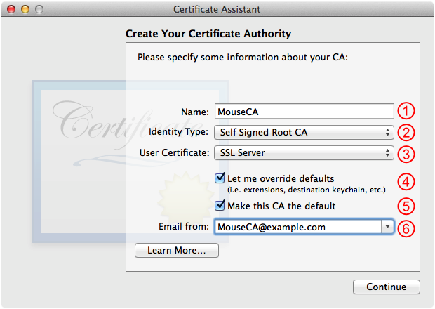

1. Set this to the name of your certificate authority; in this example, we're using "MouseCA".
2. This should default to Self Signed Root CA; leave it at that.
3. The value you use here doesn't really matter because you override it whenever you issue a digital identity. However, it's best to set this to the type of identity that this certificate authority will issue in most cases. So, if you're setting up a certificate authority solely to issue TLS server digital identities, select SSL Server here. Likewise, if your focus is on TLS client digital identities, select SSL Client.
4. Check this.
5. This should be checked by default.
6. Enter an appropriate email address here. This email address is baked into the certificate authority's root certificate, so if you plan to pass that root certificate around, make sure you use an address that you don't mind being spammed.

### D. Certificate Information (1)

Fill out the Certificate Information panel as shown in Figure 2 and then click Continue.

__Figure 2__  Certificate Information panel (1)

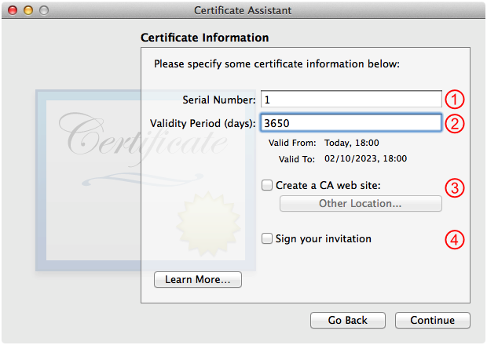

1. Don't modify this item; see the [discussion of serial numbers below](#apple-f4xwc4dqnrsv64tfmyxwi33df52wszbpirkfgnbqgaytimjtgywugsbrfvjukq2jknjvkrk7iq).
2. The default value here is 365 days. You generally want to increase this so that your certificate authority's root certificate stays valid for a long time. The easiest thing to do is add a zero to the end, which keeps your certificate authority's root certificate valid for roughly 10 years.
3. This should not be checked; leave it that way.
4. Uncheck this.

__Note:__ Items 3 and 4 are interesting if you want to issue certificates to users who request them via a certificate signing request (CSR). However, for a test certificate authority, you can simplify your life considerably by opting out of the CSR process.

### E. Certificate Information (2)

The second Certificate Information panel should default to reasonable values, as shown in Figure 3, so just click Continue.

__Figure 3__  Certificate Information panel (2)

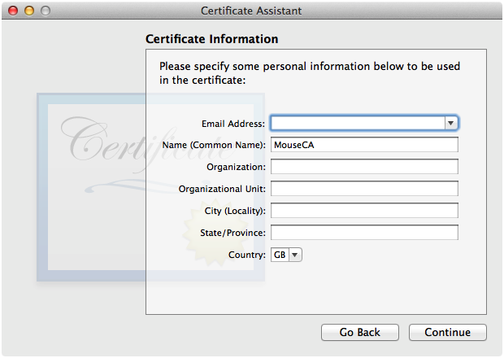

__Note:__ The other fields here are informational and you can fill them out, or not, as you see fit. Keep in mind that certificates are generally considered public information, so you shouldn't include anything too sensitive.

### F. Accept Lots of Defaults

The next 10 panels all default to reasonable values. Keep clicking Continue until the Continue button turns into a Create button (on the Specify a Location For The Certificate panel).

### G. Specify a Location

The last panel you see before creating the certificate authority is the Specify a Location For The Certificate panel, as shown in Figure 4. Consider the items below and then, when you're ready, click Create.

__Figure 4__  Specify a Location For The Certificate panel

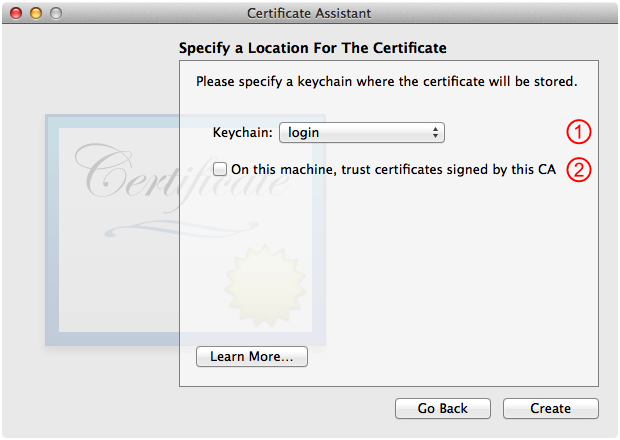

1. This defaults to your default keychain. If you want to use a different keychain to keep your certificate authority keychain items separate from your day-to-day keychain items, you can select it here.
2. This should not be checked; leave it that way.

__Warning:__ Checking item 2 will modify the trust settings on the local machine to always trust certificates issued by this certificate authority. That is virtually never the right thing to do for a test certificate authority. __To maintain system security, make sure that this item is not checked.__

__Important:__ While this panel says that you're choosing a location for the certificate, in reality Certificate Assistant stores a certificate (the certificate authority's root certificate), a __public key__ (the same public key that's embedded in the certificate) and a __private key__ (which matches that public key) into the specified keychain.

__Note:__ Certificate Assistant also stores information about the certificate authority in `~/Library/Application Support/Certificate Authority/`. Each certificate authority is represented by a separate directory, and within that directory are various files including the certificate authority configuration file. For example, after following the steps above, you'll find all of MouseCA's configuration parameters are stored in `~/Library/Application Support/Certificate Authority/MouseCA/MouseCA.certAuthorityConfig`.

### H. Conclusion

After Certificate Assistant has created your certificate authority, you'll see the Conclusion panel shown in Figure 5. Now close the Certificate Assistant window.

__Figure 5__  Conclusion panel

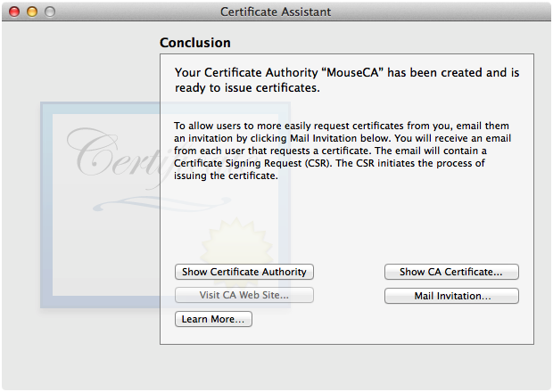

### I. Confirm Keychain Items

After closing the Certificate Assistant window you should be back in Keychain Access. You should confirm that your certificate authority's root certificate, public key and private key are present in the keychain, as shown in Figure 6.

__Figure 6__  Certificate authority keychain items in Keychain Access

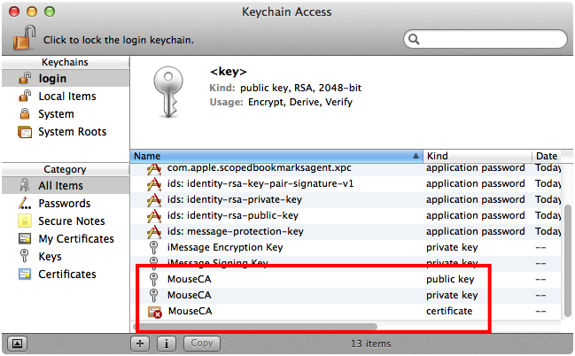[Back to Top](#)

## Issuing a Digital Identity

Once you've created your certificate authority, you can use it to issue a digital identity. This section describes the process for issuing a TLS server digital identity, calling out things that are different for a TLS client digital identity.

### A. Launch Keychain Access

In Finder, choose Go > Utilities, then find Keychain Access and launch it.

### B. Launch Certificate Assistant

In Keychain Access, make sure nothing is selected in the panel on the right and then choose Keychain Access > Certificate Assistant > Create a Certificate. This will launch Certificate Assistant.

### C. Certificate Basics

In Certificate Assistant, fill out the Create Your Certificate panel as shown in Figure 7 and then click Continue.

__Figure 7__  Create Your Certificate panel for a TLS server digital identity

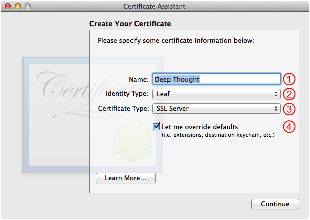

1. Set this to a human readable name for the server.
2. Set this to Leaf.
3. Set this to SSL Server.
4. Check this.

__Note:__ For TLS server digital identities, it's traditional to set item 1 (which ends up in the Common Name field of the certificate) to the DNS name of the server. This is only necessary if you're working with very old SSL clients. For modern clients, it's better to put the server's DNS name (or IP address) into the Subject Alternate Name Extension, as shown in step [H. Subject Alternate Name Extension](#apple-f4xwc4dqnrsv64tfmyxwi33df52wszbpirkfgnbqgaytimjtgywugsbrfvjukq2jknjvkrk7ja).

If you are creating a TLS client digital identity, set item 1 to a name that identities the client and item 3 to SSL Client, as shown in Figure 8.

__Figure 8__  Create Your Certificate panel for a TLS client digital identity

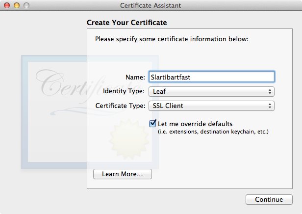

### D. Certificate Information (1)

Fill out the Certificate Information panel as shown in Figure 9 and then click Continue.

__Figure 9__  Certificate Information panel (1)

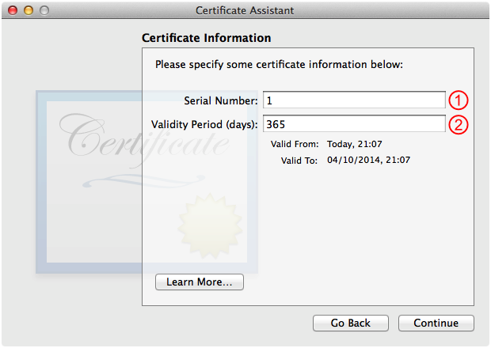

1. Don't modify this item; see the comments below.
2. The default value here is 365 days, which is a reasonable choice for an issued certificate. If the certificate expires, you can always re-issue it.

__Important:__ Each certificate issued by a certificate authority must have a unique serial number. If you just leave the serial number field (item 1) alone, Certificate Assistant will do the right thing (use incrementing serial numbers for each certificate issued).

In theory, you should be able to manually enter the serial number for the certificate to be issued (some folks use serial numbers with a specific format, for example, a certificate issued on 4 Oct 2013 at 23:58 might have a serial number like 201310042358) but this does not work
(r. [15157073](rdar://problem/15157073))
.

If you want to force Certificate Assistant to use a specific serial number, you can set the `LastSerialNumberUsed` property in the [certificate authority configuration file](#apple-f4xwc4dqnrsv64tfmyxwi33df52wszbpirkfgnbqgaytimjtgywugsbrfvjukq2dkjcucvcfinav6ry) to a value of one less than the serial number you want.

### E. Certificate Information (2)

Fill out the second Certificate Information panel as shown in Figure 10 and then click Continue.

__Figure 10__  Certificate Information panel (2) for a TLS server digital identity

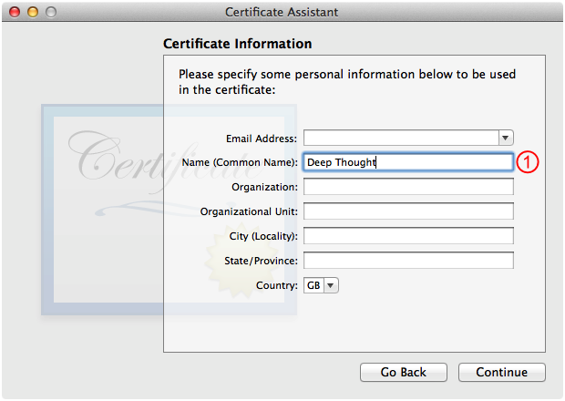

1. Enter the same name you used in step [C. Certificate Basics](#apple-f4xwc4dqnrsv64tfmyxwi33df52wszbpirkfgnbqgaytimjtgywugsbrfvjukq2jknjvkrk7im).

The other fields here are informational and you can fill them out, or not, as you see fit. For example, for a TLS client digital identity you might fill out the fields as shown in Figure 11.

__Figure 11__  Certificate Information panel (2) for a TLS client digital identity

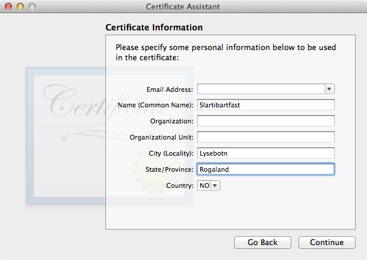

### F. Choose an Issuer

In the Choose An Issuer panel, select the certificate authority that you want to issue the certificate—in Figure 12, we only have one, the "MouseCA" certificate authority that we created in [Creating a Certificate Authority](#apple-f4xwc4dqnrsv64tfmyxwi33df52wszbpirkfgnbqgaytimjtgywugsbrfvjukq2dkjcucvcfinaq)—and click Continue.

__Figure 12__  Choose An Issuer panel

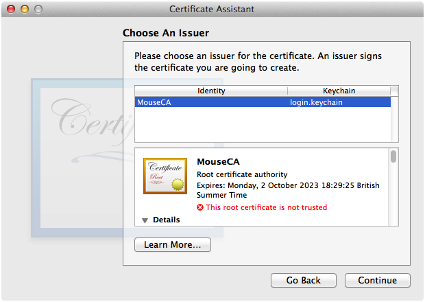

### G. Accept Some Defaults

The next four panels all default to reasonable values. Click Continue until you get to the Subject Alternate Name Extension panel.

### H. Subject Alternate Name Extension

Fill out the Subject Alternate Name Extension panel as shown in Figure 13 and then click Continue.

__Figure 13__  Subject Alternate Name Extension panel

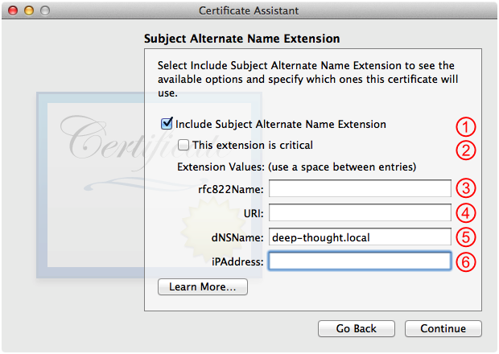

1. This should be checked; leave it that way.
2. This should not be checked; leave it that way.
3. Leave this blank.
4. Leave this blank.
5. Enter the DNS name of the server here, if it has one.
6. If the server doesn't have a DNS name, enter its IP address here.

__Warning:__ If you use a .local DNS name, don't add the trailing dot because not all TLS clients cope well with fully qualified domain names (FQDN).

__Note:__ If you want the server to be contactable at multiple DNS names, just enter them all into item 5, separated by spaces. Likewise for multiple IP addresses in item 6.

If you are issuing a client identity, you can either not include the Subject Alternate Name Extension (by unchecking item 1) or you can include one with an email address (item 3) or URL (item 4), leaving the other fields blank.

### I. Specify a Location

The last panel you see before issuing the certificate is the Specify a Location For The Certificate panel, as shown in Figure 14. Consider the item below and then, when you're ready, click Create.

__Figure 14__  Specify a Location For The Certificate panel

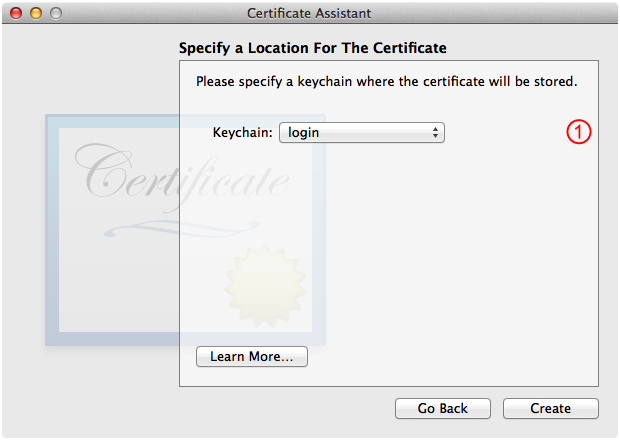

1. This defaults to your default keychain. If you want to use a different keychain to keep your issued keychain items separate from your day-to-day keychain items, you can select it here.

__Important:__ While this panel says that you're choosing a location for the certificate, in reality Certificate Assistant stores a certificate (the certificate that's being issued by the certificate authority), a public key (the same public key that's embedded in the certificate) and a private key (which matches that public key) into the specified keychain. The certificate and the private key make up the digital identity.

### J. Conclusion

After Certificate Assistant has issued the certificate, you'll see the Conclusion panel shown in Figure 15. Now close the Certificate Assistant window.

__Figure 15__  Conclusion panel

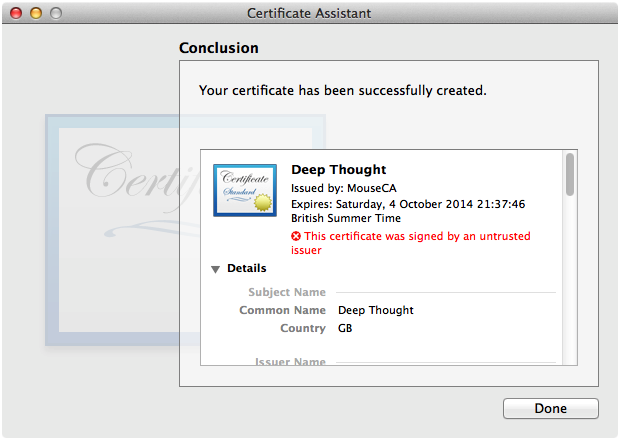

### K. Confirm Keychain Items

After closing the Certificate Assistant window you should be back in Keychain Access. You should confirm that the issued certificate and its associated public and private keys are present in the keychain, as shown in Figure 16.

__Figure 16__  Digital identity keychain items in Keychain Access

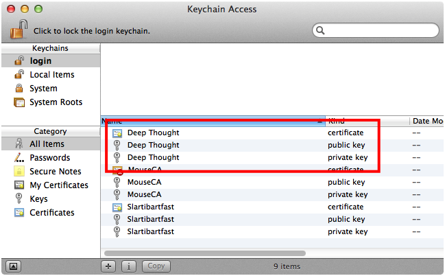[Back to Top](#)

## Exporting Digital Certificates and Identities

Once you have these digital certificates and identities in your keychain, you can export them for use in your tests. This section describes various export scenarios.

### Exporting the Certificate Authority's Root Certificate

Exporting the certificate authority's root certificate is quite simple. This section describes the process step-by-step.

#### A. Launch Keychain Access

In Finder, choose Go > Utilities, then find Keychain Access and launch it.

#### B. Select the Root Certificate

In Keychain Access, select the certificate authority's root certificate, as shown by Figure 17.

__Figure 17__  Selecting the certificate authority root certificate

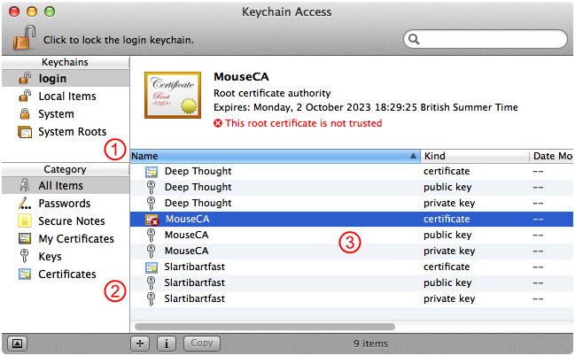

1. Select the correct keychain in the Keychains list. This will be your login keychain unless you've created a [separate keychain](#apple-f4xwc4dqnrsv64tfmyxwi33df52wszbpirkfgnbqgaytimjtgywugsbrfvjukq2dkjcucvcfinaq) for your certificate authority keychain items.
2. Select the All Items category.
3. Select the certificate authority's root certificate in the keychain item list.

__Note:__ For item 2, you might be tempted to select the Certificates category. Don't do that, you'll just confused yourself.

#### C. Export

Choose File > Export Items. This brings up the sheet shown in Figure 18. Setup your export options and then click Save.

__Figure 18__  Certificate authority root certificate export sheet

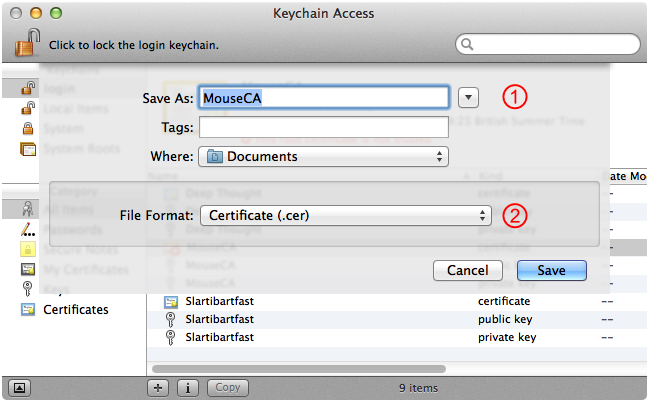

1. Enter the name of file to export to. In the case the default name is taken from the certificate name and is quite appropriate.
2. You should always select Certificate (.cer) here, regardless of the final format you need.

#### D. Convert If Necessary

Some cryptographic toolkits, like the Security framework on OS X and iOS, work best with certificates in their binary form. Other toolkits, most notably OpenSSL, prefer certificates in a textual form. Step B always exports the certificate in binary form. If you want it in the textual form, use the [openssl](x-man-page://1/openssl) command line tool to convert it. Listing 1 shows how to do this, assuming you exported the certificate as `MouseCA.cer`.

__Listing 1__  Convert a certificate from binary to text

```shell
$ openssl x509 -inform DER -in MouseCA.cer -out MouseCA.pem
```

__Note:__ The binary form of a certificate has many names (BER, DER, CER and others) and has a similarly long list of potential file extensions (`.cer`, `.der`, `.crt` and others).

The textual form of a certificate is known as PEM. The standard file extension is `.pem`. PEM files can hold more than just certificates. A PEM file that holds just a certificate commonly has the extension `.crt` (and yes, that means .crt can be used for both binary and textual forms!).

### Exporting a Digital Identity

This section describes the steps needed to export a digital identity that was issued by your certificate authority.

__Important:__ Remember that a digital identity consists of a certificate and the private key associated with the public key embedded in that certificate.

#### A. Launch Keychain Access

In Finder, choose Go > Utilities, then find Keychain Access and launch it.

#### B. Select the Digital Identity

In Keychain Access, select the digital identity to export, as shown by Figure 19.

__Figure 19__  Selecting a digital identity to export

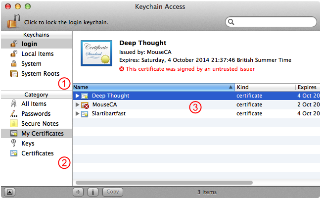

1. Select the correct keychain in the Keychains list. This will be your login keychain unless you've created a [separate keychain](#apple-f4xwc4dqnrsv64tfmyxwi33df52wszbpirkfgnbqgaytimjtgywugsbrfvjukq2dkjcucvcfinaq) for your certificate authority keychain items.
2. Select the My Certificates category.
3. Select the digital identity to export in the keychain item list.

__Note:__ For item 2, you might be tempted to select the Certificates category. That will actually produce the same results in this case but might confuse you in other circumstances. Specifically, My Certificates shows digital identities in the keychain, whereas Certificates shows you all certificates. If you have a certificate without the matching private key, it will show up in Certificates but not in My Certificates. If you then try to export that certificate, you won't be able to export it as a digital identity. By choosing My Certificates, you're guaranteed to only see certificates with matching private keys, that is, things you can export as a digital identity.

#### C. Export

Choose File > Export Items. This brings up the sheet shown in Figure 20. Setup your export options and then click Save.

__Figure 20__  Digital identity export sheet

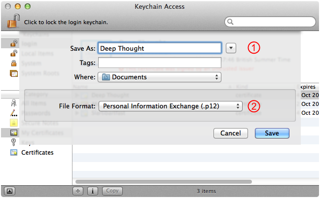

1. Enter the name of the file to export to. The default name here is the unhelpfully-generic "Certificates", so it's a good idea to type in the name of the digital identity you're exporting.
2. You should always select Personal Information Exchange (.p12) here, regardless of the final format you need. This creates a PKCS#12 file which you can convert to the appropriate format [later on](#apple-f4xwc4dqnrsv64tfmyxwi33df52wszbpirkfgnbqgaytimjtgywugsbrfvjukq2flbie6usujfcektsujfkfsx2g).

#### D. PKCS#12 Password

The next step, as shown by Figure 21, is to enter a password to protect the private key embedded in the PKCS#12 file. You should choose a password that's appropriate for the level of security you need. If the private key has limited value (for example, you're only using this digital identity for testing), it's OK to enter a very simple password (in Figure 21, the password was "test").

Enter this PKCS#12 password once into each of the fields and then click OK.

__Figure 21__  Entering a PKCS#12 password to protect the digital identity's private key

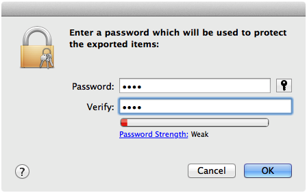

#### E. Keychain Password

Finally, you must enter the keychain password for the keychain containing the digital identity, as shown by Figure 22. This authorizes the export of the digital identity from the keychain. Once you've entered the password, click Allow.

__Figure 22__  Entering the keychain password to authorize export

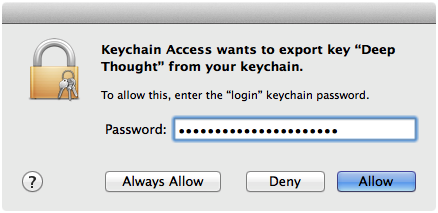

#### F. Convert If Necessary

If the cryptographic toolkit you're using works with PKCS#12 files directly, you're done. If you need the digital identity in some other format, you'll have to convert it. For example, if you want to use the digital identity to set up Apache, you have to extract the certificate and the private key as separate PEM files (the certificate typically goes in `/etc/apache2/server.crt` and the private key goes in `/etc/apache2/server.key`). Listing 2 shows how to use the [openssl](x-man-page://1/openssl) tool to do this conversion.

__Listing 2__  Extracting a digital identity for use with Apache

```shell
$ # First extract the server certificate.
$
$ openssl pkcs12 -in "Deep Thought.p12" -nokeys -out server.crt
Enter Import Password: ****
MAC verified OK
$
$ # Next extract the server private key.
$
$ openssl pkcs12 -in "Deep Thought.p12" -nocerts -nodes -out server.key
Enter Import Password: ****
MAC verified OK
```

In both cases you must enter the PKCS#12 password from step [D. PKCS#12 Password](#apple-f4xwc4dqnrsv64tfmyxwi33df52wszbpirkfgnbqgaytimjtgywugsbrfvjukq2flbie6usujfcektsujfkfsx2e).

__Warning:__ If this private key is meant to stay private, you should do this extraction on your web server so that the key is protected by the PKCS#12 password while it's in transit.

[Back to Top](#)

---

#### Document Revision History

| __Date__ | __Notes__ |
| 2014-02-13 | New document that describes how to use Certificate Assistant to create certificates for TLS (or SSL) testing. |

