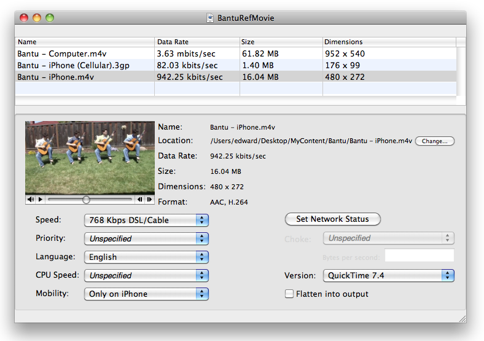

> 导航：[总目录](../../README.md) · [technotes](../../_indexes/technotes.md)

Technical Note TN2266

# Creating Reference Movies - MakeRefMovie

A reference movie contains pointers to alternate data rate movies--that is, multiple versions of the movie designed for downloading at various data rates or other criteria. MakeRefMovie is a utility allowing configuration of auto-selected movies for any connection speed, platform, language and so on without the viewer having to make a choice, and without special coding on the part of the content author.

[About MakeRefMovie](#apple-f4xwc4dqnrsv64tfmyxwi33df52wszbpirkfgnbqgaydsojyhewugsbrfvjukq2ujfhu4mi)[Using MakeRefMovie](#apple-f4xwc4dqnrsv64tfmyxwi33df52wszbpirkfgnbqgaydsojyhewugsbrfvjukq2ujfhu4mq)[Revision History](#apple-f4xwc4dqnrsv64tfmyxwi33df52wszbpirkfgnbqgaydsojyhewugsbrfvjukq2ujfhu4my)[Downloads](#apple-f4xwc4dqnrsv64tfmyxwi33df52wszbpirkfgnbqgaydsojyhewugsbrfvjukq2ujfhu4na)[Document Revision History](#apple-f4xwc4dqnrsv64tfmyxwi33df52wszbpirkfgnbqgaydsojyhewvezlwnfzws33ojbuxg5dpoj4s2u2xhe4tq)

## About MakeRefMovie

[MakeRefMovie](https://connect.apple.com/cgi-bin/WebObjects/MemberSite.woa/wa/getSoftware?bundleID=19980) allows you to create a QuickTime reference movie--a movie that contains pointers to alternate data rate movies which are best suited for the user's current connection speed. For example, you could create three versions of a movie-- a version optimized for low bandwidth, a version for DSL or cable modems and version for LAN users. Instead of having 3 or more links on your page, simply embed the reference movie in your web page and let QuickTime determine the appropriate movie to serve based on the user's current connection speed and device (e.g. iPhone).

In addition to connection speed, MakeRefMovie allows you to specify the version of QuickTime required to view the content and allows you to specify iPhone only delivery.

For a detailed discussion of recommended compression settings to use when creating QuickTime movies for delivery on the web and iPhone, see [Technical Note TN2218, Compressing QuickTime Movies for the Web](https://developer.apple.com/library/mac/#technotes/tn2218/_index.html).

[Back to Top](#)

## Using MakeRefMovie

1. Open the MakeRefMovie Utility.
2. Drag each of the alternate movies onto the main window of MakeRefMovie. An alternate movie will appear for each file you drag-and-drop. Or you can open each file separately by choosing 'Add Movie Files...' from the Movie menu or you can type the URL to your streaming movie by selecting "Add URL..." from the Movie menu.
3. Set the minimum connection speed for each alternate movie in the Speed: pop-up menu.
4. For movies intended for playback on iPhone, set the Mobility setting to "Only on iPhone." This setting ensures that the movies will be ignored by QuickTime on Mac and PC.
5. Ensure that the alternate movies are ordered properly. Movies intended for desktop playback should come first followed by movies intended for iPhone. Also, movies should be ordered from lowest to highest connection speed for desktop and iPhone. You can reorder the movies by simply dragging them to a new position in the UI. If there is more than one movie designed for the same connection speed, set the load order of the movies in the Priority: pop-up.
6. Specify the default movie by checking Flatten into output. The default movie may be compressed with a codec supported by older versions of QuickTime for backward compatibility. This checkbox can only be applied to one movie.
7. Save the reference movie. If you created your alternates using relative URL paths, the reference movie will need to be placed in the same folder as the alternate movies. Upload the directory or folder to the server.

See the following documents for information discussing media deployment:

- [Safari HTML5 Audio and Video Guide](https://developer.apple.com/safari/library/documentation/AudioVideo/Conceptual/Using_HTML5_Audio_Video/Introduction/Introduction.html)
- [Compressing QuickTime Movies for the Web](https://developer.apple.com/safari/library/technotes/tn2008/tn2218.html)
- [Preparing Your Web Content for iPad](https://developer.apple.com/safari/library/technotes/tn2010/tn2262/index.html)
- [Best Practices for Creating and Deploying HTTP Live Streaming Media for the iPhone and iPad](https://developer.apple.com/iphone/library/technotes/tn2010/tn2224.html)

__Figure 1__

__Note:__ Make sure the reference movie filename contains the '.mov' extension. This reference movie will call upon the alternates.

[Back to Top](#)

## Revision History

- MakeRefMovie 2.0.1 adds a user preferences that allow you to choose how alternate movies are added to the reference movie.

[Back to Top](#)

## Downloads

[MakeRefMovie (DMG)](https://connect.apple.com/cgi-bin/WebObjects/MemberSite.woa/wa/getSoftware?bundleID=19980)

[Back to Top](#)

---

#### Document Revision History

| __Date__ | __Notes__ |
| 2010-05-19 | First Version |

