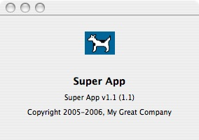

> 导航：[总目录](../../README.md) · [technotes](../../_indexes/technotes.md)


# Retired Document

__Important:__
This document may not represent best practices for current development. Links to downloads and other resources may no longer be valid.

Technical Note TN2179

# Creating an About Panel in Your Cocoa Application

__Important:__ This document may not represent best practices for current development. Links to downloads and other resources may no longer be valid.

A Cocoa application's "About" menu item is set up by sending the message `orderFrontStandardAboutPanel:` up the responder chain and eventually to `NSApplication`. When `NSApplication` receives the message, it goes about building its about panel with various sources of information gathered from the `Info.plist` file and from the Resources folder in the application bundle.

No additional work is required to use the standard about panel so long as you provide the required pieces of information in your Xcode project.

You can, however, create and display the standard about panel yourself programmatically with values determined at runtime using the `orderFrontStandardAboutPanelWithOptions:` message. Another alternative is to completely override this behavior by creating your own about panel.

[Property List Values For The About Panel](#apple-f4xwc4dqnrsv64tfmyxwi33df52wszbpirkfgmjqgaydimjygewugsbrfvke4vcbi4yq)[Version Display Format](#apple-f4xwc4dqnrsv64tfmyxwi33df52wszbpirkfgmjqgaydimjygewugsbrfvke4vcbi44q)[About Panel Using 'orderFrontStandardAboutPanelWithOptions'](#apple-f4xwc4dqnrsv64tfmyxwi33df52wszbpirkfgmjqgaydimjygewugsbrfvke4vcbi4zq)[About Panel Using a Custom 'NSView'](#apple-f4xwc4dqnrsv64tfmyxwi33df52wszbpirkfgmjqgaydimjygewugsbrfvke4vcbi42q)[Technical Documentation](#apple-f4xwc4dqnrsv64tfmyxwi33df52wszbpirkfgmjqgaydimjygewugsbrfvke4vcbi43q)[Document Revision History](#apple-f4xwc4dqnrsv64tfmyxwi33df52wszbpirkfgmjqgaydimjygewvezlwnfzws33ojbuxg5dpoj4s2rdpnz2ey2lonncwyzlnmvxhiskel4yq)

## Property List Values For The About Panel

Information property list files contain essential configuration information for a bundled executable. Most bundles have at least one file of this type (usually named `Info.plist`) containing most of the bundle’s configuration information. Some of this information is used for the app's about panel.

If you choose to use `orderFrontStandardAboutPanelWithOptions:` to render your about panel, you need to be familiar with the various attributes and keys used in defining the options dictionary.

__Table 1__  The following key strings are keys that can be used in the options dictionary:

| Attribute | Key String | Description |
| Main Credits | @"Credits" | An NSAttributedString displayed in the info area of the panel. If not specified, this method then looks for a file named “Credits.html”, “Credits.rtf”, and “Credits.rtfd”, in that order, in the bundle returned by the NSBundle class method mainBundle. The first file found is used. If none is found, this area is left blank. |
| App Name | @"ApplicationName" | An NSString object displayed as the application’s name. Uses the string value of the "CFBundleName" key from the Info.plist file (which is localizable). If not found, this method then uses [[NSProcessInfo processInfo] processName]. This string is what is displayed in the menu bar when your application is active. |
| App Icon | @"ApplicationIcon" | An NSImage object displayed as the application’s icon. Uses the string value of the "CFBundleIconFile" key from the Info.plist file. The filename extension in this string value is not required. If you don't include this value, Mac OS X will search for a file of this name that ends with the ".icns" extension. If not specified, this method then looks for an image named “NSApplicationIcon”, using [NSImage imageNamed:@"NSApplicationIcon"]. |
| App Version String | @"Version" | An NSString object with the build version number of the application (“58.4”). If not specified, this method uses the value of the "CFBundleVersion" key from the Info.plist file. |
| Build Version String | @"ApplicationVersion" | An NSString object with the application version (“Mac OS X”, “3”, “WebObjects 4.5”, “AppleWorks 6”,...). It is also considered the marketing version. If not specified, this method uses the value of the "CFBundleShortVersionString" key from the Info.plist file. If neither is available, the build version, if available, is printed alone, as “Version x.x”. This value is displayed in the Finder preview as well. |
| Copyright | @"Copyright" | An NSString object with a line of copyright information. If not specified, this method uses the string value of the "NSHumanReadableCopyright" key from the Info.plist file. If not found, the copyright area is left blank. |

[Back to Top](#)

## Version Display Format

The algorithm for building the about panel's version string, depending on the availability of marketing version (MV) and build version (BV) is displayed in the about panel like so:

Version MV (BV)

Version MV

Version BV

To reiterate from the table above, MV comes from `ApplicationVersion` in the dictionary; if not provided, then from `CFBundleShortVersionString` in `Info.plist`. BV comes from `Version` in the dictionary; if not provided, then from `CFBundleVersion` in `Info.plist`.

Tiger and later systems add the word "Version". Pre-Tiger systems, the character "v" is used instead.

[Back to Top](#)

## About Panel Using 'orderFrontStandardAboutPanelWithOptions'

This example illusrates how to use the standard about panel with a dictionary of options. It is up to you if you want to implement the credits section (i.e. by including file "`Credits.rtf`" in your project). Since it also provides a specific copyright statement, the string `"NSHumanReadableCopyright"` needs to be removed from the `InfoPlist.strings` file, if it exists.

__Listing 1__  Sample that uses 'orderFrontStandardAboutPanelWithOptions'.

```objc
#import "Controller.h"

@implementation Controller

- (IBAction)openAboutPanel:(id)sender
{
    NSDictionary *options;
    NSImage *img;

    img = [NSImage imageNamed: @"Picture 1"];
    options = [NSDictionary dictionaryWithObjectsAndKeys:
                    @"1.1", @"Version",
                    @"Super App", @"ApplicationName",
                    img, @"ApplicationIcon",
                    @"Copyright 2005-2006, My Great Company", @"Copyright",
                    @"Super App v1.1", @"ApplicationVersion",
                    nil];

    [[NSApplication sharedApplication] orderFrontStandardAboutPanelWithOptions:options];
}

@end
```

__Figure 1__  Sample about panel from Listing 1.

[Back to Top](#)

## About Panel Using a Custom 'NSView'

If you wish to build your own custom about panel, you can directly read your app's bundle information and display them in your own panel, window or `NSView`, for example. Note that in Listing 2, InterfaceBuilder IBOutlets are not used. Rather, each embedded `NSView` is referenced by it's tag. Also keep in mind that the `InfoPlist.strings` entries have priority over `Info.plist` ones.

__Listing 2__  Sample that shows how to use your own about panel inside a custom `NSView`.

```objc
@interface AboutView : NSView
{}
@end

@implementation AboutView

-(id)infoValueForKey:(NSString*)key
{
    if ([[[NSBundle mainBundle] localizedInfoDictionary] objectForKey:key])
        return [[[NSBundle mainBundle] localizedInfoDictionary] objectForKey:key];

    return [[[NSBundle mainBundle] infoDictionary] objectForKey:key];
}

- (void)drawRect:(NSRect)rect
{
    [super drawRect: rect];

    // draw the background in white
    [[NSColor whiteColor] set];
    [NSBezierPath fillRect:rect];

    // display out NSBundle information
    NSString* nameStr = [self infoValueForKey:@"CFBundleName"];
    NSTextField* field = [self viewWithTag: 1];
    [field setStringValue: nameStr];

    NSString* versionStr = [self infoValueForKey:@"CFBundleVersion"];
    field = [self viewWithTag: 2];
    [field setStringValue: versionStr];

    NSString* copyrightStr = [self infoValueForKey:@"NSHumanReadableCopyright"];
    field = [self viewWithTag: 3];
    [field setStringValue: copyrightStr];

    // draw the app's icon
    NSImage* iconImage = nil;
    NSImageView* imageView = [self viewWithTag: 0];
    NSString* iconFileStr = [self infoValueForKey:@"CFBundleIconFile"];
    if ([iconFileStr length] > 0)
    {
        // we have a real icon
        iconImage = [NSImage imageNamed: iconFileStr];
    }
    else
    {
        // no particular app icon defined, use the default system icon
        iconImage = [NSImage imageNamed: @"NSApplicationIcon"];
        // or
        //NSString* appIconType = NSFileTypeForHFSTypeCode(kGenericApplicationIcon);
        //iconImage = [[NSWorkspace sharedWorkspace] iconForFileType:appIconType];
    }
    [imageView setImage: iconImage];
}

@end
```

[Back to Top](#)

## Technical Documentation

- For further information on "`orderFrontStandardAboutPanelWithOptions:`" refer to:

  [NSApplication Class Reference](https://developer.apple.com/documentation/Cocoa/Reference/ApplicationKit/Classes/NSApplication_Class/Reference/Reference.html)
- For detailed information on the `'plist'` or property list refer to:

  [Technote TN2013](https://developer.apple.com/technotes/tn/tn2013.html)
- For additional technical information on information property list files based on XML refer to:

  [Runtime Configuration Guidelines](https://developer.apple.com/documentation/MacOSX/Conceptual/BPRuntimeConfig/Articles/ConfigFiles.html)
- For the Property List Key Reference refer to:

  [Introduction to Runtime Configuration Guidelines](https://developer.apple.com/documentation/MacOSX/Conceptual/BPRuntimeConfig/index.html)
- To view a Cocoa sample that uses a fancy about panel refer to:

  [FancyAbout](https://developer.apple.com/samplecode/FancyAbout/index.html)

[Back to Top](#)

---

#### Document Revision History

| __Date__ | __Notes__ |
| 2007-01-22 | New document that describes different ways in implementing your Cocoa application's "About" panel. |

