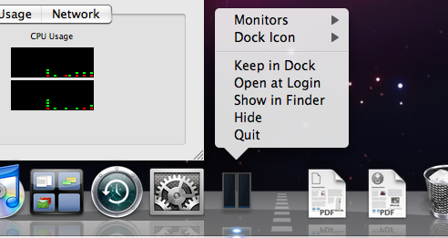
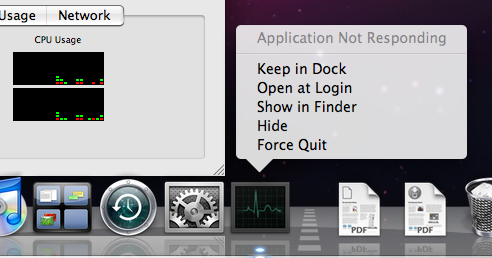
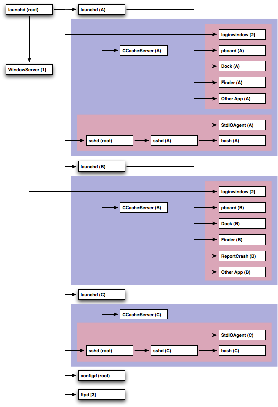
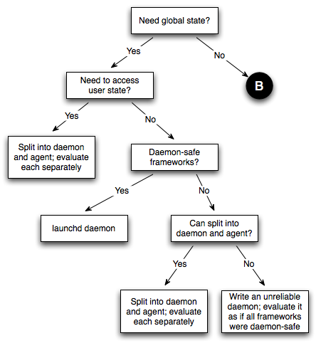
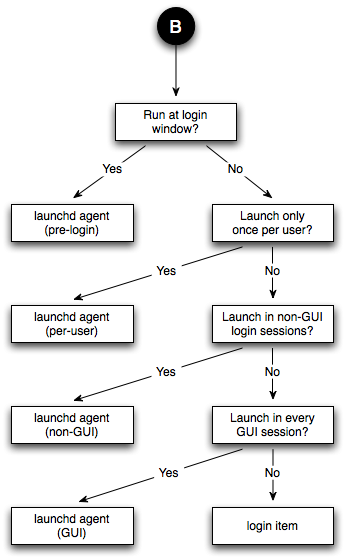
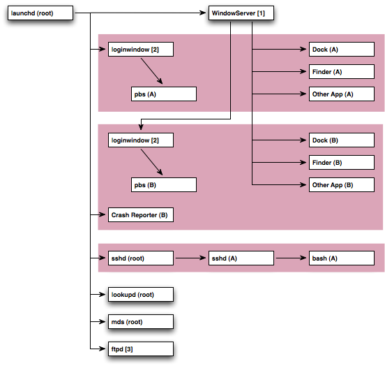
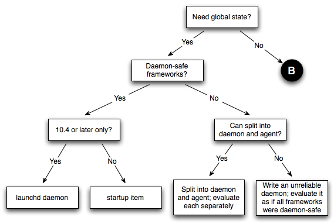
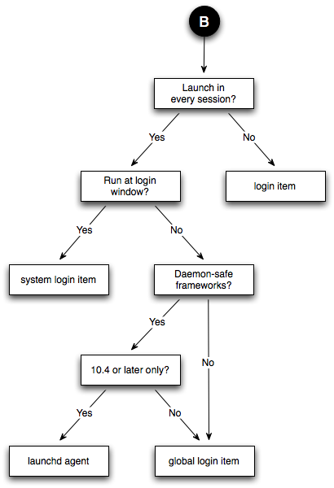

> 导航：[总目录](../../README.md) · [technotes](../../_indexes/technotes.md)


Technical Note TN2083

# Daemons and Agents

Daemons and agents, collectively known as background programs, are programs that operate without any graphical user interface. As a developer, you can use background programs to perform actions without user interaction, and also to manage a shared state between multiple other programs.

This technote describes the most common problems encountered when developing daemons and agents on Mac OS X, and offers detailed advice on solving those problems.

You should read this technote if you're developing a background program for Mac OS X. You should also read this technote if you're developing a plug-in that's hosted by a background program (for example, a [CUPS filter](x-man-page://1/filter)), because your plug-in must abide by the rules of the host's environment.

[Introduction](#apple-f4xwc4dqnrsv64tfmyxwi33df52wszbpirkfgmjqgaydgnzzgqwugsbrfvjukq2ujfhu4mi)[Daemonomicon](#apple-f4xwc4dqnrsv64tfmyxwi33df52wszbpirkfgmjqgaydgnzzgqwugsbrfvjukq2ujfhu4mq)[Daemons](#apple-f4xwc4dqnrsv64tfmyxwi33df52wszbpirkfgmjqgaydgnzzgqwugsbrfvjvkqstivbviskpjyza)[Agents](#apple-f4xwc4dqnrsv64tfmyxwi33df52wszbpirkfgmjqgaydgnzzgqwugsbrfvjvkqstivbviskpjyzq)[Ancient Daemons (and Agents)](#apple-f4xwc4dqnrsv64tfmyxwi33df52wszbpirkfgmjqgaydgnzzgqwugsbrfvjvkqstivbviskpjy3q)[Execution Contexts](#apple-f4xwc4dqnrsv64tfmyxwi33df52wszbpirkfgmjqgaydgnzzgqwugsbrfvjukq2ujfhu4oi)[UIDs and GIDs](#apple-f4xwc4dqnrsv64tfmyxwi33df52wszbpirkfgmjqgaydgnzzgqwugsbrfvjvkqstivbviskpjy4q)[Mach Bootstrap Basics](#apple-f4xwc4dqnrsv64tfmyxwi33df52wszbpirkfgmjqgaydgnzzgqwugsbrfvjvkqstivbviskpjyyta)[Window Server](#apple-f4xwc4dqnrsv64tfmyxwi33df52wszbpirkfgmjqgaydgnzzgqwugsbrfvjvkqstivbviskpjyyti)[Security Context](#apple-f4xwc4dqnrsv64tfmyxwi33df52wszbpirkfgmjqgaydgnzzgqwugsbrfvjvkqstivbviskpjyyts)[Execution Context Summary](#apple-f4xwc4dqnrsv64tfmyxwi33df52wszbpirkfgmjqgaydgnzzgqwugsbrfvjvkqstivbviskpjyzda)[Execution Context Example](#apple-f4xwc4dqnrsv64tfmyxwi33df52wszbpirkfgmjqgaydgnzzgqwugsbrfvjvkqstivbviskpjyzdc)[Layered Frameworks](#apple-f4xwc4dqnrsv64tfmyxwi33df52wszbpirkfgmjqgaydgnzzgqwugsbrfvjukq2ujfhu4mrt)[Living Dangerously](#apple-f4xwc4dqnrsv64tfmyxwi33df52wszbpirkfgmjqgaydgnzzgqwugsbrfvjvkqstivbviskpjyzdg)[Framework Cross Reference](#apple-f4xwc4dqnrsv64tfmyxwi33df52wszbpirkfgmjqgaydgnzzgqwugsbrfvjvkqstivbviskpjyzdi)[Design Considerations](#apple-f4xwc4dqnrsv64tfmyxwi33df52wszbpirkfgmjqgaydgnzzgqwugsbrfvjukq2ujfhu4mrw)[Is It Necessary?](#apple-f4xwc4dqnrsv64tfmyxwi33df52wszbpirkfgmjqgaydgnzzgqwugsbrfvjvkqstivbviskpjyzdm)[The Perils of the Monolith](#apple-f4xwc4dqnrsv64tfmyxwi33df52wszbpirkfgmjqgaydgnzzgqwugsbrfvjvkqstivbviskpjyzdo)[The Client/Server Model](#apple-f4xwc4dqnrsv64tfmyxwi33df52wszbpirkfgmjqgaydgnzzgqwugsbrfvjvkqstivbviskpjyzdq)[Getting Launched](#apple-f4xwc4dqnrsv64tfmyxwi33df52wszbpirkfgmjqgaydgnzzgqwugsbrfvjukq2ujfhu4mzq)[Daemon IPC Recommendations](#apple-f4xwc4dqnrsv64tfmyxwi33df52wszbpirkfgmjqgaydgnzzgqwugsbrfvjukq2ujfhu4mzr)[Mach Considered Harmful](#apple-f4xwc4dqnrsv64tfmyxwi33df52wszbpirkfgmjqgaydgnzzgqwugsbrfvjvkqstivbviskpjyztc)[UNIX Domain Sockets Are Your Friend](#apple-f4xwc4dqnrsv64tfmyxwi33df52wszbpirkfgmjqgaydgnzzgqwugsbrfvjvkqstivbviskpjyzte)[Cross Architecture IPC](#apple-f4xwc4dqnrsv64tfmyxwi33df52wszbpirkfgmjqgaydgnzzgqwugsbrfvjvkqstivbviskpjyztk)[Coding Recommendations](#apple-f4xwc4dqnrsv64tfmyxwi33df52wszbpirkfgmjqgaydgnzzgqwugsbrfvjukq2ujfhu4mzx)[Launching On Demand](#apple-f4xwc4dqnrsv64tfmyxwi33df52wszbpirkfgmjqgaydgnzzgqwugsbrfvjvkqstivbviskpjyzto)[Daemons Accessing User State](#apple-f4xwc4dqnrsv64tfmyxwi33df52wszbpirkfgmjqgaydgnzzgqwugsbrfvjvkqstivbviskpjyztq)[Logging](#apple-f4xwc4dqnrsv64tfmyxwi33df52wszbpirkfgmjqgaydgnzzgqwugsbrfvjvkqstivbviskpjyzts)[Daemon Security Considerations](#apple-f4xwc4dqnrsv64tfmyxwi33df52wszbpirkfgmjqgaydgnzzgqwugsbrfvjvkqstivbviskpjy2dg)[Agents and Fast User Switching](#apple-f4xwc4dqnrsv64tfmyxwi33df52wszbpirkfgmjqgaydgnzzgqwugsbrfvjvkqstivbviskpjy2di)[Process Manager and Launch Services](#apple-f4xwc4dqnrsv64tfmyxwi33df52wszbpirkfgmjqgaydgnzzgqwugsbrfvjvkqstivbviskpjy2dk)[Hints and Tips](#apple-f4xwc4dqnrsv64tfmyxwi33df52wszbpirkfgmjqgaydgnzzgqwugsbrfvjukq2ujfhu4nbx)[Starting a Daemon](#apple-f4xwc4dqnrsv64tfmyxwi33df52wszbpirkfgmjqgaydgnzzgqwugsbrfvjvkqstivbviskpjy2do)[Debugging Startup](#apple-f4xwc4dqnrsv64tfmyxwi33df52wszbpirkfgmjqgaydgnzzgqwugsbrfvjvkqstivbviskpjy2dq)[Debugging Rogue Window Server Use](#apple-f4xwc4dqnrsv64tfmyxwi33df52wszbpirkfgmjqgaydgnzzgqwugsbrfvjvkqstivbviskpjy2ds)[Watch Your Logs!](#apple-f4xwc4dqnrsv64tfmyxwi33df52wszbpirkfgmjqgaydgnzzgqwugsbrfvjvkqstivbviskpjy2ta)[Bootstrap Namespaces: One More Thing](#apple-f4xwc4dqnrsv64tfmyxwi33df52wszbpirkfgmjqgaydgnzzgqwugsbrfvjvkqstivbviskpjy2tc)[Careful With That Fork, Eugene](#apple-f4xwc4dqnrsv64tfmyxwi33df52wszbpirkfgmjqgaydgnzzgqwugsbrfvjvkqstivbviskpjy2te)[Further Reading](#apple-f4xwc4dqnrsv64tfmyxwi33df52wszbpirkfgmjqgaydgnzzgqwugsbrfvjukq2ujfhu4nju)[Old Systems and Technology](#apple-f4xwc4dqnrsv64tfmyxwi33df52wszbpirkfgmjqgaydgnzzgqwugsbrfvjukq2ujfhu4njv)[Deprecated Daemonomicon](#apple-f4xwc4dqnrsv64tfmyxwi33df52wszbpirkfgmjqgaydgnzzgqwugsbrfvjvkqstivbviskpjy2tk)[Execution Context Summary for Deprecated Technologies](#apple-f4xwc4dqnrsv64tfmyxwi33df52wszbpirkfgmjqgaydgnzzgqwugsbrfvjvkqstivbviskpjy3dc)[Execution Context Example on Mac OS 10.4](#apple-f4xwc4dqnrsv64tfmyxwi33df52wszbpirkfgmjqgaydgnzzgqwugsbrfvjvkqstivbviskpjy3de)[Getting Launched Prior To Mac OS X 10.5](#apple-f4xwc4dqnrsv64tfmyxwi33df52wszbpirkfgmjqgaydgnzzgqwugsbrfvjvkqstivbviskpjy3dg)[Obsolete Programming Techniques](#apple-f4xwc4dqnrsv64tfmyxwi33df52wszbpirkfgmjqgaydgnzzgqwugsbrfvjvkqstivbviskpjy3di)[Document Revision History](#apple-f4xwc4dqnrsv64tfmyxwi33df52wszbpirkfgmjqgaydgnzzgqwvezlwnfzws33ojbuxg5dpoj4s2rdpnz2ey2lonncwyzlnmvxhiskel4yq)

## Introduction

Many problems can be solved by programs running in the background. These programs have no graphical user interface (GUI), and only interact with the user indirectly. For example:

- A web server runs in the background and responds to HTTP requests from clients.
- A calendar application installs a background program that manages the calendar database, and relaunches the GUI application when calendar events occur.

This technote discusses the issues associated with writing programs that run in the background. It starts with a formal definition of the types of background programs that you can write (Daemonomicon). It then goes on to discuss the unusual execution contexts encountered by background programs (Execution Contexts) and how Mac OS X uses layered frameworks to manage the issues raised by these contexts (Layered Frameworks). It also offers advice about how to create a background program, starting with some general design recommendations (Design Considerations), followed by advice on launching a background program (Getting Launched) and how to communicate between the various components of the program (Daemon IPC Recommendations). Finally, there are some specific coding recommendations (Coding Recommendations) and some miscellaneous hints and tips (Hints and Tips).

Before reading this technote, you should look at the formal documentation for [System Startup Programming](https://developer.apple.com/documentation/MacOSX/Conceptual/BPSystemStartup/index.html) and [Multiple User Environments](https://developer.apple.com/documentation/MacOSX/Conceptual/BPMultipleUsers/index.html).

__Important:__ This technote strives to clearly explain complicated topics. In many cases, the best way to make a particular point is to offer a concrete example. These examples show detailed information about how the system is implemented. It's important that you concentrate on the point of the example, rather than the specific implementation details which may change in the future.

In cases where the implementation is different on older systems, or is likely to change in the future, the text warns you about these changes.

The examples in this technote are from Mac OS X 10.5.

__Note:__ A previous version of this technote described Mac OS X 10.4. The specific details related to Mac OS X 10.4 have been moved to a separate section, Old Systems and Technology, at the end of the technote. Where appropriate, these changes are also called out in the text.

[Back to Top](#)

## Daemonomicon

There are a variety of terms used to describe programs that run in the background. In many cases the same term is used by different people to mean different things. This section defines the terms used throughout the rest of the technote.

A __background program__ is a program that runs in the background, without presenting any significant GUI. This category is subdivided into daemons (system wide background programs) and agents (which work on behalf of a specific user). The next two sections describe these subdivisions in detail.

### Daemons

A __daemon__ is a program that runs in the background as part of the overall system (that is, it is not tied to a particular user). A daemon cannot display any GUI; more specifically, it is not allowed to connect to the window server. A web server is the perfect example of a daemon.

__Note:__ If you're coming from a traditional UNIX background, be aware that modifying `/etc/rc*` is not a supported way of launching a daemon on Mac OS X. Rather, you should launch your daemon via `launchd`.

Historically, Mac OS X had a number of different ways to start daemons (for details, see Deprecated Daemonomicon). On current systems there is only one recommend way: [launchd](x-man-page://8/launchd).

A __launchd daemon__ is configured by a sophisticated property list file. This file allows the daemon to be launched based on a variety of criteria (connections to listening sockets, items being modified in the file system, periodically, and so on). For details, see the [launchd.plist](x-man-page://5/launchd.plist) man page.

A third party launchd daemon should be installed by adding a property list file to the `/Library/LaunchDaemons` directory.

It is important to realize that not all launchd daemons interact with `launchd` in the same way. The single unifying feature of all launchd daemons is the property list file. This tells `launchd` how to interact with the daemon. For example:

- A __launchd-aware launchd daemon__ is typically launched on demand and must explicitly check in with `launchd`. For an example of this, see [Sample Code 'SampleD'](https://developer.apple.com/samplecode/SampleD/index.html).
- If you have a daemon that was previously launched via `inetd` (or `xinetd`), you can run it from `launchd` by creating a property list file with the `inetdCompatibility` property set appropriately. This results in an __inetd-compatible launchd daemon__. For an example of this, check out `/System/Library/LaunchDaemons/finger.plist`.
- Virtually any program can be run as a launchd daemon by creating a minimal property list file with the `OnDemand` property set to false.

  __Note:__ In Mac OS X 10.5 and later the `OnDemand` property is deprecated in favor of the `KeepAlive` property. You should use the new property unless you need to support Mac OS X 10.4.x. Also, the `KeepAlive` property lets you express more complex criteria under which `launchd` will keep your daemon running. See Launching On Demand for details.

Keep in mind that, regardless of how it interacts with `launchd`, a launchd daemon must not daemonize itself; doing so would undermine `launchd`'s ability to monitor the daemon.

For more information about launchd daemons, read the launchd documentation.

### Agents

An __agent__ is a process that runs in the background on behalf of a particular user. Agents are useful because they can do things that daemons can't, like reliably access the user's home directory or connect to the window server. A calendar monitoring program is a good example of an agent because:

- there should be an instance of the program per GUI login session
- each agent has access to that user's calendar
- the agent can launch the calendar application when certain events occur

The difference between an agent and a daemon is that an agent can display GUI if it wants to, while a daemon can't. The difference between an agent and a regular application is that an agent typically displays no GUI (or a very limited GUI).

Agents have acquired a variety of different names over the years. These include background-only applications (BOAs), faceless background-only applications (FBAs), and UI elements (implying that the agent displays some GUI, but is not a full blown application with a menu bar). These names are more-or-less irrelevant to this discussion. What is relevant, and what distinguishes different types of agents, is how the agent is launched.

__Note:__ Users familiar with traditional Mac OS might describe an FBA or a BOA as a daemon; this is not correct on Mac OS X, where FBAs and BOAs are agents, and agents are quite different from daemons.

__Note:__ Sharp-eyed readers will note that one process on the system, `KernelEventAgent`, is called an agent but is actually a daemon
(r. [4324871](rdar://problem/4324871))
. This is exactly the sort of confusion that I hope to eliminate with this technote.

#### Login Item

A __login item__ is launched when the user logs in using the GUI. A login item can be any openable item, but it is typically an application or an agent.

You can install a login item using the shared file lists interface to Launch Services (see the `LSSharedFileList.h` header file in the LaunchServices subframework of the CoreServices framework). This API is available on Mac OS X 10.5 and later. On earlier systems, you can install a login item is by sending Apple events to the `System Events` process. [Sample Code 'LoginItemsAE'](https://developer.apple.com/samplecode/LoginItemsAE/index.html) shows one way to do this.

#### Global Login Item

A __global login item__ is a login item that is launched when any user logs in. Installing a global login item is roughly equivalent to installing that login item for all users on the system: every time a user logs in, `loginwindow` launches that user's login items and all global login items.

In Mac OS X 10.5 and later you can install a global login item using the shared file lists interface to Launch Services.

__Important:__ Prior to Mac OS X 10.5 there is no supported way to install a global login item. If you need this functionality, please contact [Developer Technical Support (DTS)](mailto:dts@apple.com).

#### launchd Agent

A __launchd agent__ is like a launchd daemon, except that it runs on behalf of a particular user. It is launched by `launchd`, typically as part of the process of logging in the user.

A third party launchd agent should be installed by adding a property list file to the `~/Library/LaunchAgents` directory (to be invoked just for this user) or `/Library/LaunchAgents` directory (to be invoked for all users).

__Warning:__ Prior to Mac OS X 10.5, launchd agents were not particularly useful because there was no way for the agent to specify the type of login session that the agent required
(r. [4255854](rdar://problem/4255854))
. Thus, you couldn't use a launchd agent as the equivalent of a global login item because it might be launched in the context of non-GUI login session. Mac OS X 10.5 has addressed this limitation, as described below. However, if you have to support older systems, you should investigate some of the alternative technologies described in Deprecated Daemonomicon.

launchd agents are further classified by their target session type, as shown in Table 1.

__Table 1__  Types of launchd agent

| Name | Session Type | Notes |
| GUI launchd agent | Aqua | Has access to all GUI services; much like a login item. |
| non-GUI launchd agent | StandardIO | Runs only in non-GUI login sessions (most notably, SSH login sessions) |
| per-user launchd agent | Background | Runs in a context that's the parent of all contexts for a given user |
| pre-login launchd agent | LoginWindow | Runs in the loginwindow context |

To run your agent in a particular session type, use the session type strings from Table 1 as the value of the `LimitLoadToSessionType` property in your agent's property list file. If you want to run in more than one session type, you can set `LimitLoadToSessionType` to an array, where each element is a session type string. If you don't specify the `LimitLoadToSessionType` property, `launchd` assumes a value of `Aqua`.

If you set `LimitLoadToSessionType` to an array, be aware that each instance of your agent runs independently. For example, if you set up your agent to run in `LoginWindow` and `Aqua`, the system will first run an instance of your agent in the loginwindow context. When a user logs in, that instance will be terminated and a second instance will launch in the standard GUI context.

Finally, there are some significant gotchas associated with developing a pre-login launchd agent; see [Sample Code 'PreLoginAgents'](https://developer.apple.com/samplecode/PreLoginAgents/index.html) for more information.

### Ancient Daemons (and Agents)

For information about older ways to launch daemons and agents, see Deprecated Daemonomicon.

[Back to Top](#)

## Execution Contexts

Most Mac OS X programmers are familiar with the user ID (UID) associated with a process (commonly referred to as the process's owner). On a traditional BSD system, this UID control the capabilities of that process. You can, more or less, assume that two processes with matching UIDs have the same capabilities.

This is not true on Mac OS X. There are other elements of the process's context that significantly alter its capabilities. So, for example, a daemon whose UID is set to that of the logged in console user is not equivalent to an application that has been launched by that user.

The following sections describe the elements of process's context, and how they affect background programs.

### UIDs and GIDs

A process's UIDs (its effective (EUID), real (RUID), and saved (SUID) UIDs) are the most well known elements of the process's context. These UIDs control various capabilities of the process, mostly centered on the BSD portions of the system (file system, networking, BSD process control). For example, a process's ability to open a file is controlled by its EUID, and its ability to signal another process is controlled by its EUID and the EUID and RUID of the target.

Processes also have a set of group IDs (GIDs) that are analogous to the UIDs, plus a list of supplemental group IDs.

For more information about these UIDs and GIDs, and how they affect the capabilities of your process, see [Security Overview](https://developer.apple.com/documentation/Security/Conceptual/Security_Overview/index.html).

### Mach Bootstrap Basics

Many Mac OS X subsystems work by exchanging Mach messages with a central service. For such a subsystem to work, it must be able to find the service. This is typically done using the Mach __bootstrap service__, which allows a process to look up a service by name. All processes inherit a reference to the bootstrap service from their parent.

To get an idea of how this works, you can run [launchctl](x-man-page://1/launchctl) with the `bslist` argument. This lists all of the services registered with the bootstrap service. Listing 1 shows an example of its output.

__Listing 1__  BootstrapDump from Terminal

```shell
$ launchctl bslist D  com.apple.rcd A  com.apple.finder.ServiceProvider A  com.apple.systemuiserver.ServiceProvider A  com.apple.systemuiserver-ServicesPortName A  com.apple.dockling.server A  com.apple.SUISMessaging A  com.apple.ipodserver A  com.apple.dock.server D  BezelUI D  edu.mit.Kerberos.KerberosAgent.ipcService [...]
```

As you can see, there are numerous services published via the bootstrap service. Virtually all of them are private. For example, you are not expected to send messages directly to the "com.apple.dock.server" service; rather, you would call a routine exported by a framework (perhaps `SetApplicationDockTileImage`) and, behind the scenes, it exchanges messages with the service to do the job you requested.

#### Bootstrap Namespaces

The previous example raises an interesting point: which Dock does `SetApplicationDockTileImage` interact with? If there are multiple users logged in (via fast user switching), then there are multiple instances of the Dock running, so how does `SetApplicationDockTileImage` know which is the right one? Moreover, how can all of these Docks register the same service name ("com.apple.dock.server") without suffering a name conflict?

The solution to these problems is that the bootstrap service can create multiple __bootstrap namespaces__. Each login session has its own bootstrap namespace, to which all processes running in that session inherit a reference. So, when the Dock registers its service, the registration goes into that login session's namespace. Any other process within that session inherits a reference to the same namespace, and can, therefore, see the Dock's service. Processes in other login sessions reference a different namespace, which prevents them from seeing that service. However, they might be able to see a different instance of the Dock that's registered in their namespace.

It's worth noting the distinction between __GUI and non-GUI per-session bootstrap namespaces__. A GUI per-session bootstrap namespace is instantiated by the GUI infrastructure (`loginwindow` and `WindowServer`) when a user logs in via the GUI. A non-GUI per-session bootstrap namespace is created when a user logs in via SSH. While there is no fundamental difference between these namespaces, GUI-based services, like the Dock, only register themselves in GUI per-session bootstrap namespaces.

__Note:__ Prior to Mac OS X 10.3, non-GUI login sessions ran in the global bootstrap namespace.

__Note:__ Non-GUI per-session bootstrap namespaces are created by `launchd` on behalf of `sshd` because `sshd`'s property list file (`/System/Library/LaunchDaemons/ssh.plist`) includes the `SessionCreate` property. Prior to the introduction of `launchd`, `xinetd` performed a similar function.

In Mac OS X 10.5 and later these non-GUI namespaces are, after the user has logged in, moved below the per-user bootstrap namespace by the launchd PAM module (`/usr/lib/pam/pam_launchd.so`) under the direction of the SSH PAM configuration file (`/etc/pam.d/sshd`).

#### Namespace Hierarchy

Bootstrap namespaces are arranged hierarchically. There is a single __global bootstrap namespace__. Below that is a __per-user bootstrap namespace__ for each user on the system, and below each of those is a __per-session bootstrap namespace__ for each login session. You can print a map of the namespaces on the system using the `BootstrapDump` program (downloadable as [Sample Code 'BootstrapDump'](https://developer.apple.com/samplecode/BootstrapDump/index.html)) with the `MAP` argument, as illustrated by Listing 2.

__Listing 2__  Bootstrap Namespace Hierarchy

```shell
$ sudo BootstrapDump MAP Password:******** 0x0   launchd (root, 1/0)   launchd (quinn, 82/1) 0x30b   kextd (root, 7/1)   DirectoryService (root, 8/1)   notifyd (root, 9/1)   configd (root, 10/1)   [...]   0x10f     0x100b       sshd (root, 443/1)       sshd (quinn, 447/443)       bash (quinn, 449/447)       BootstrapDump (root, 477/449)     0x20b       loginwindow (root, 24/1)       ARDAgent (root, 92/82)       Spotlight (quinn, 94/82)       UserEventAgent (quinn, 95/82)       Dock (quinn, 97/82)       AppleVNCServer (root, 98/92)       pboard (quinn, 99/82)       SystemUIServer (quinn, 100/82)       Finder (quinn, 101/82)       ATSServer (quinn, 102/82)
```

__Note:__ Per-user bootstrap namespaces did not exist prior to Mac OS X 10.5.

If a process running within a namespace registers a service, it is visible in that namespace and any of its descendent namespaces. However, it is not visible in any other namespaces. In practice, this means that:

- processes using the global namespace can only see services in the global namespace
- processes using a per-user namespace can see services in that per-user namespace and the global namespace
- processes using a per-session namespace can see services in that per-session namespace, the parent per-user namespace, and the global namespace
- services registered in a per-session namespace can only be seen by processes using that per-session namespace
- services registered in a per-user namespace can be seen by any process in any of that user's sessions
- services registered in the global namespace can be seen by all processes

You can use `launchctl`'s `bslist` command to view a bootstrap namespace by pointing it at a process using that namespace. For example, Listing 3 shows how to list the services in the global namespace by targeting `kextd`.

__Listing 3__  Dumping the global bootstrap namespace

```
$ # The killall goop in the following command is a sneaky way  $ # to get the process ID for a process name. $ # $ pid=`sudo killall -s kextd | cut -f 3 -d ' '` $ sudo launchctl bslist $pid [...] A  com.apple.KernelExtensionServer D  com.apple.KerberosAutoConfig D  com.apple.java.updateSharingD D  com.apple.installdb.system D  com.apple.IIDCAssistant D  com.apple.system.hdiejectd D  com.apple.gssd A  com.apple.FSEvents [...] $ sudo launchctl bslist $pid | grep dock $ # No results because Dock is not registered in the global namespace.
```

__Important:__ You should not rely on the ability to dump the global bootstrap namespace programmatically. The techniques used in this section are not something that Apple intends to support in the long term; they're appropriate for debugging and illustrative purposes, but you should not ship programs that rely on them.

So the "com.apple.KernelExtensionServer" service is registered in the global bootstrap namespace, and can be seen by all processes on the system. On the other hand, "com.apple.dock.server" service (from Listing 1) is registered in the per-session namespace and can only be seen by processes using that namespace.

So, the rules to remember are:

- If you're developing an agent, make sure it inherits a reference to the correct per-user or per-session bootstrap namespace. Table 2 shows the execution context for each type of background program.
- If you're developing a daemon, make sure it inherits a reference to the global bootstrap namespace.
- If you're developing a daemon, make sure it only uses services that are registered in the global bootstrap namespace. See Layered Frameworks for more information about this.

If you don't follow these rules, things might look like they're working, but you'll run into obscure problems down the line. The next section gives an example of one such problem. This is but one example; there are many more potential problems. The only guaranteed way to avoid such problems is to follow these rules, which are discussed further in Layered Frameworks.

#### Namespace Exploration

All of this might seem a little theoretical, and you're probably wondering how it affects you. Let's make things crystal clear by looking at a concrete example of how bootstrap namespaces affect application functionality.

1. Launch Activity Monitor (in `/Applications/Utilities`) from the Finder.
2. If it's not currently showing its main window, choose Activity Monitor from the Window menu to reveal that window.
3. Configuring it to show a CPU usage meter in its dock icon by choosing Show CPU Usage from the Dock Icon submenu of the View menu. You'll note that the Dock icon now displays a up-to-date representation of the CPU usage, and that the Dock menu works correctly. Figure 1 shows what I'm talking about.
4. Now quit Activity Monitor.
5. Next, open a Terminal window and SSH to yourself, as shown in Listing 4.

   __Listing 4__  Connecting to yourself via ssh

   ```shell
   $ ssh localhost Password:******** Last login: Fri Sep 30 10:07:59 2005 Welcome to Darwin! $
   ```

   __Note:__ For this to work, you'll have to enable Remote Login in the Sharing preferences panel.

   When you log in via ssh, the system creates a new per-session bootstrap namespace for your session. So, anything you execute in this Terminal window is running in a different per-session bootstrap namespace from the GUI applications that you're running.
6. Now run Activity Monitor from this Terminal window, as shown in Listing 5.

   __Listing 5__  Running Activity Monitor from within SSH login session

   ```
   $ /Applications/Utilities/Activity\ Monitor.app/Contents/MacOS/Activity\ Monitor
   ```

   Figure 2 shows what you get. You'll notice two anomalous things:

   - The Dock tile CPU meter is not displayed.
   - If you control click on the Dock tile, the contextual menu contains an "Application Not Responding" item.

   These problems occur because the application is running in a different per-session bootstrap namespace, and is unable to look up the services that it needs to operate correctly (for example, "com.apple.dock.server").

__Important:__ The fact that a copy of Activity Monitor running from an SSH session can display any GUI is quite surprising. This works because Activity Monitor has connected to the global window server service, a subject discussed in detail in the next section.

__Figure 1__  Activity Monitor's presence in the Dock



__Figure 2__  Activity Monitor launched from an SSH session



### Window Server

The __window server__ (on Mac OS X 10.5 this is `/System/Library/Frameworks/ApplicationServices.framework/Frameworks/CoreGraphics.framework/Resources/WindowServer`) is a single point of contact for all applications. It is central to the implementation of the GUI frameworks (AppKit and HIToolbox) and many other services (for example, Process Manager).

__Important:__ The window server does more than just manage windows. Even an application with no user interface (like a background-only application) depends on the window server.

Most of the services provided by the window server are implemented using Mach messages. Thus, to use the window server reliably, you must inherit a reference to a valid GUI per-session bootstrap namespace. This is an expected consequence of the rules given earlier.

What's unexpected, however, is that applications do work (somewhat) if you run them from outside of a GUI login session (that is, if they inherit a reference to the global bootstrap namespace, or some other non-GUI bootstrap namespace). This is because the window server advertises its services in the global bootstrap namespace! This is known as the __global window server service__.

The reasons for this non-obvious behavior are lost in the depths of history. However, the fact that this works at all is pretty much irrelevant because there are important caveats that prevent it from being truly useful. The following sections describe these caveats in detail.

__Warning:__ Apple plans to disable the global window server service in a future release of Mac OS X. Do not write any new code that uses the global window server service. If you have existing code that uses this service, you must eliminate that dependency in order to be compatible in the long term. See The Perils of the Monolith for specific advice on structuring your code to avoid this problem.

#### More Than Window Server

The window server is not the only service that's required for an application to function correctly. As described earlier, the Dock service is also required, and it is only registered in GUI per-session bootstrap namespaces. There are many other services like this.

#### Permission To Connect

The __console user__ is the user whose GUI login session is using the console. The console device, `/dev/console`, is owned by the console user.

A process can only use the global window server service if its EUID is 0 (it's running as root) or matches the UID of the console user. All other users are barred from using it.

For a demonstration of this, you can SSH to your own machine and try to run Activity Monitor from your shell. Listing 6 shows an example of doing this from Terminal. The first attempt to run Activity Monitor command works because it's running as the same user as Terminal. The second attempt fails because the test user (`mrgumby`) does not match the console user, and thus cannot access the global window server service.

__Listing 6__  Accessing the window server from console and non-console users

```shell
$ ssh ${USER}@localhost Password:******** Last login: Wed Jun 20 11:49:23 2007 $ id uid=502(quinn) gid=20(staff) groups=20(staff),81(_appserveradm), 104(com.apple.sharepoint.group.1),79(_appserverusr),80(admin), 101(com.apple.access_remote_ae),103(com.apple.access_ssh-disabled) $ ls -l /dev/console crw------- 1 quinn  staff    0,   0 Jun 20 11:50 /dev/console $ # Launch Activity Monitor and then quit it. $ /Applications/Utilities/Activity\ Monitor.app/Contents/MacOS/\ Activity\ Monitor  $ logout Connection to localhost closed. $ ssh mrgumby@localhost Password:******** Last login: Wed Jun 20 11:49:23 2007 $ id uid=503(mrgumby) gid=20(staff) groups=20(staff),105(com.apple.sharepoint.group.2), 104(com.apple.sharepoint.group.1) $ ls -l /dev/console  crw------- 1 quinn  quinn    0,   0 Oct  3 21:31 /dev/console $ # Activity Monitor fails to launch at all. $ /Applications/Utilities/ctivity\ Monitor.app/Contents/MacOS/Act _RegisterApplication(), FAILED TO establish the default connection to \ the WindowServer, _CGSDefaultConnection() is NULL. 2007-06-20 11:54:31.798 Activity Monitor[863:10b] An uncaught exception  was raised [...] Trace/BPT trap $ logout Connection to localhost closed.
```

This limitation makes it very hard to reliably use the global window service because:

- Standard security practice is that daemons should not run as root; rather, they should be run by a dedicated user (that is, the `wombatd` daemon is run by a dedicated `_wombat` user).

  Also, standard security practice dictates that programs running as root should try to reduce their attack surface by limiting the list of frameworks that they use. Thus, in general, programs running as root should not use high-level frameworks that rely on the window server, like AppKit and HIToolbox.

  So, solving the problem by running as root is a security no-no.
- There is no easy way to solve the problem by running your daemon as the console user because, with fast user switching, the console user can change at any time.

#### Window Server Lifecycle

The final nail in the coffin of the global window server service relates to the __window server lifecycle__. Contrary to what you might expect, the window server is not always running. Rather, at certain times (see the note below), the window server quits and is relaunched by `launchd`. As with the global window server service, the reasons for this are also lost in the depths of history. However, the consequences are crucial: when the window server quits, any process that's connected to it will terminate.

__Note:__ The exact condition under which the window server quits is implementation-specific, and you should not depend on it. Currently (Mac OS X 10.5) the window server quits when the last GUI login session ends, which is not necessarily when the last GUI users logs out.

You can see this in action using the program from Listing 7. This program monitors the foreground application using Carbon Events, which requires it to connect to the window server.

__Listing 7__  A simple program that connects to the window server

```c
#include <assert.h> #include <stdio.h> #include <stdlib.h>  #include <Carbon/Carbon.h>  static OSStatus EventHandlerProc(     EventHandlerCallRef inHandlerCallRef,      EventRef            inEvent,      void *              inUserData) {     fprintf(stderr, "  Switch\n");     return noErr; }  int main(int argc, char **argv) {     static const EventTypeSpec kEvents[] = {          { kEventClassApplication, kEventAppFrontSwitched}      };     OSStatus err;      err = InstallEventHandler(         GetApplicationEventTarget(),          NewEventHandlerUPP( EventHandlerProc ),          sizeof(kEvents) / sizeof(kEvents[0]),          kEvents,          NULL,          NULL     );     assert(err == noErr);      while (true) {         fprintf(stderr, "Running runloop\n");         RunApplicationEventLoop();     }      return EXIT_SUCCESS; }
```

To test this, you have to log in using SSH from a different machine (because Terminal will hold up the GUI logout if there is a process running in one of its windows). Listing 8 shows what this session might look like.

__Listing 8__  Death by GUI logout

```shell
$ ssh victim.local. Password:******** Last login: Thu Jun 21 09:05:00 2007 victim$ ./AppSwitchMonitor  Running runloop   Switch   Switch   Switch Running runloop Killed victim$ echo $? 137
```

To replicate this yourself, do the following.

1. Log into the console of the victim machine (`victim.local.` in this example).
2. From another machine, SSH to the victim machine and run the `AppSwitchMonitor` program. This will run forever, printing a message when the foreground application changes.
3. Using the GUI, log out.
4. You should notice a delay in the log out. This is `loginwindow` waiting for `AppSwitchMonitor` to respond to the `'quit'` Apple event. `AppSwitchMonitor` does get this event, which causes a return from `RunApplicationEventLoop`. However, the while loop around `RunApplicationEventLoop` keeps it running.
5. The `AppSwitchMonitor` program eventually dies. Printing the exit status reveals that it died because of a `SIGKILL` signal (you can decode this exit status using the macros in `<sys/wait.h>`; see the [wait](x-man-page://2/wait) man page for details).

This program is killed because the window server keeps track of the processes that are using its services. When you log out, the system (actually `loginwindow`) tries to quit these. For each GUI process, it sends a `'quit'` Apple event to the process. If any GUI process refuses to quit, `loginwindow` halts the logout and displays a message to the user.

The situation for non-GUI processes is slightly different: `loginwindow` first tries to quit the process using a `'quit'` Apple event; if that fails it terminates the program by sending it a `SIGKILL` signal. There is no way to catch or ignore this signal.

The upshot of this is that, if your process connects to the window server, it will not survive a normal logout.

There are other issues related to the window server lifecycle that cause problems for daemons. Even if you don't actually connect to the window server, you can still get into trouble if your daemon registers services in the per-session bootstrap namespace. When the window server quits, any per-session bootstrap namespaces created by that window server are deactivated. For more information about this, see Bootstrap Namespaces: One More Thing.

#### Pre-Login Trust Issues

If, in Mac OS X 10.5 and later, you see a message like that shown in Listing 9 you might mistakenly think that the solution is to get the system to 'trust' your application, perhaps via code signing.

__Listing 9__  Pre-Login Trust Message

```
Untrusted apps are not allowed to connect to or launch Window Server before login.
```

However, this isn't the case
(r. [5544764](rdar://problem/5544764))
. This message is really telling you is that you're trying to connect to the window server from the wrong context. You see this message if you try to connect to the global window server service from outside of the pre-login context before the user has logged in; typically this means that you're trying to use the window server from a daemon.

You should not attempt to fix this by convincing the window server to trust your program; doing so will just cause other problems further down the road. For example, if you do successfully connect to the window server from your daemon, you still have to deal with window server lifecycle issues described previously.

Instead, you should fix this problem by changing your code to run in the correct context. If you need to connect to the window server in a pre-login context, create a pre-login launchd agent. For an example of this, see [Sample Code 'PreLoginAgents'](https://developer.apple.com/samplecode/PreLoginAgents/index.html).

### Security Context

The __security context__ is another piece of execution context associated with a process. The security context is explicitly managed by the Mac OS X security server (`securityd`). The security context almost always follows the bootstrap namespace: that is, there is a single __global security context__ (also known as the __root security context__), __per-user security contexts__ (for per-user launchd agents), and a __per-session security context__ for each login session.

__Note:__ The only case where the security context and bootstrap namespace are not tied together is if you create your own bootstrap namespace.

In most cases the security context is not directly relevant to your program; more often than not, the bootstrap namespace is the thing that trips you up.

On the other hand, the security context has one nice attribute: you can get useful information about the context using the `SessionGetInfo` routine (from `<Security/AuthSession.h>`). This routine return two useful pieces of information.

The first is the session identifier, a 32-bit number that uniquely identifies this session. This can be helpful in a number of places. For example, if you want to create a shared memory object (perhaps using [shm_open](x-man-page://2/shm_open)) whose scope is limited to processes running within a particular login session, you can fold the session identifier into the object's name. Thus, two shared memory objects from different session won't collide in the shared memory object namespace, and client processes within the login session can easily find the correct shared memory object.

Additionally, `SessionGetInfo` returns a set of flags that describe the current security context. These are:

- `sessionIsRoot` — set if this is the global security context
- `sessionHasGraphicAccess` — set if programs running in this context can access the window server
- `sessionHasTTY` — set if programs running in this context can access the terminal (`/dev/tty`)
- `sessionIsRemote` — set if this context is the being run over the network

__Important:__ The `sessionHasTTY` and `sessionIsRemote` flags are not correct for non-GUI login sessions starting with Mac OS X 10.4
(r. [4280953](rdar://problem/4280953))
; they aren't set, but they should be.

### Execution Context Summary

Table 2 shows how the execution context of your daemon or agent is affected by the mechanism used to launch it.

__Table 2__  Context Cross Reference

| Program Type | UID | Bootstrap Namespace | Security Context |
| launchd daemon | as configured [1] | as configured [2] | as configured [3] |
| login item | user | GUI per-session | per-session |
| global login item | user | GUI per-session | per-session |
| GUI launchd agent [4] | user | GUI per-session | per-session |
| non-GUI launchd agent [4] | user | non-GUI per-session | per-session |
| per-user launchd agent [4] | user | per-user | per-user |
| pre-login launchd agent [4] | root | pre-login [5] | pre-login [5] |

__Note:__ This table only covers recommended technologies. For information about deprecated technologies, see Execution Context Summary for Deprecated Technologies.

__Notes:__

1. Configured using the `UserName` property in the property list file; defaults to `root` if the attribute is not specified.
2. Uses the global bootstrap namespace unless the `SessionCreate` property is specified in the property list file, in which case the daemon runs in its own per-session bootstrap namespace.
3. Uses the global security context unless the `SessionCreate` property is specified in the property list file, in which case the daemon runs in its own per-session security context.
4. Prior to Mac OS X 10.5 there was no way to control the target session type of a launchd agent; launchd agents were executed per-user in an unpredictable context. See Agents for details.
5. Once the user has logged in, this pre-login bootstrap namespace and security context become the bootstrap namespace and security context of the logged in user's login session.

### Execution Context Example

Figure 3 is graphical example of this information. Each box is a process. The text after the process name is either the UID of that process (text in round brackets) or a note that you can look up below (text in square brackets) or both. A directed line represents the parent/child relationship between two processes. Each blue box represents a per-user bootstrap namespace. Each red box represents a per-session bootstrap namespace. Items that aren't in any shaded box are in the global bootstrap namespace. There are two GUI login sessions (user A logged in first and then fast user switched to user B) and two non-GUI login session (user A and user C).

__Figure 3__  Process relationships



__Notes:__

1. `WindowServer` runs with an EUID of `_windowserver` (88) and an RUID of `root` (0).
2. `loginwindow` runs with an EUID of the logged in user and an RUID of `root` (0).
3. `ftpd` runs with an EUID of the logged in user and an RUID of `root` (0). Currently `ftpd` runs in the global security context, but this may change in future systems; it will then will act more like `sshd`, and create a per-user security context for each FTP session.

As you look at Figure 3, consider the various different types of process that it shows.

- There is a global instance of `launchd` (PID 1). There is also an instance of `launchd` for each user.
- There is a single instance of the `WindowServer` process that resides in the global security context. However, it knows about all GUI login sessions and can register its services in each of them.
- The first instance of `loginwindow`, the one associated with user A's login session, is a child of the global `launchd`. The second instance, created when user A fast user switched to user B, is a child of the window server.
- Each per-user instance of `launchd` manages the context for all of that user's login sessions.
- The pasteboard server (`pboard`) is a typical GUI launchd agent.
- `StdIOAgent` is a hypothetical non-GUI launchd agent. It's included to illustrate where this type of agent would appear in the diagram. Mac OS X does not currently install any non-GUI launchd agents by default.
- `CCacheServer` is a per-user launchd agent that maintains the Kerberos credentials cache for a specific user.
- The `ReportCrash` program is a GUI launchd agent with special values in its property list that tell `launchd` to run it in response to crashes.
- `sshd` is a launchd daemon with the `SessionCreate` property set, which means that it runs in its own bootstrap namespace. Once a user logs in, the launchd PAM session module (`/usr/lib/pam/pam_launchd.so`, as configured by `/etc/pam.d/sshd`) moves the bootstrap namespace to within the appropriate per-user bootstrap namespace.
- `configd` is a run-of-the-mill launchd daemon.
- `ftpd` is a launchd daemon that is launched when someone connects to the TCP port specified in its property list file.

__Warning:__ This example was taken from Mac OS X 10.5. It is included for illustrative purposes only. The exact relationship between the various processes running on the system has changed in the past and is likely to change in the future.

__Note:__ For an equivalent example taken from Mac OS X 10.4, see Execution Context Example on Mac OS 10.4.

[Back to Top](#)

## Layered Frameworks

Most Mac OS X functionality is implemented by large system frameworks. Many of these frameworks use Mach-based services that they look up using the bootstrap service. This can cause all sorts of problems if you call them from a program which references the wrong bootstrap namespace.

Apple's solution to this problem is layering: we divide our frameworks into layers, and decide, for each layer, whether that layer supports operations in the global bootstrap namespace. The basic rule is that everything in CoreServices and below (including System, IOKit, System Configuration, Foundation) should work in any bootstrap namespace (these are __daemon-safe frameworks__), whereas everything above CoreServices (including ApplicationServices, Carbon, and AppKit) requires a GUI per-session bootstrap namespace.

The only fly in this ointment is that some frameworks aren't properly layered. QuickTime is a perfect example of this. Because of its traditional Mac OS heritage, QuickTime isn't clearly layered into 'core' and 'application' frameworks. Rather, there is one big framework, and its not documented which bits work from a daemon. The only way to be one hundred percent safe is to not use frameworks like these, but that isn't an option for many developers. You can, however, minimize the risk by restricting the set of routines that you call. Living Dangerously describes this idea in more detail.

In summary, the concrete recommendations are:

- When writing a daemon, only link to daemon-safe frameworks (see Framework Cross Reference).
- When writing a GUI agent, you can link with any framework.
- If you're writing a daemon and you must link with a framework that's not daemon-safe, consider splitting your code into a daemon component and an agent component. If that's not possible, be aware of the potential issues associated with linking a daemon to unsafe frameworks (as described in the next section).

### Living Dangerously

If your daemon uses frameworks that aren't daemon-safe, you can run into a variety of problems.

- Some frameworks fail at load time. That is, the framework has an initialization routine that assumes it's running in a per-session context and fails if it's not.

  This problem is rare on current systems because most frameworks are initialized lazily.
- If the framework doesn't fail at load time, you may still encounter problems as you call various routines from that framework.

  - A routine might fail benignly. For example, the routine might fail silently, or print a message to `stderr`, or perhaps return a meaningful error code.
  - A routine might fail hostilely. For example, it's quite common for the GUI frameworks to call [abort](x-man-page://3/abort) if they're run by a daemon!
  - A routine might work even though its framework is not officially daemon-safe.
  - A routine might behave differently depending on its input parameters. For example, an image decompression routine might work for some types of images and fail for others.
- The behavior of any given framework, and the routines within that framework, can change from release-to-release.

The upshot of this is that, if your daemon links with a framework that's not daemon-safe, you can't predict how it will behave in general. It might work on your machine, but fail on some other user's machine, or fail on a future system release, or fail for different input data. You are living dangerously!

If you must call a framework that's not daemon-safe from your daemon, you should start by [filing a bug](https://developer.apple.com/bugreporter/) describing what you're doing and why. Apple will consider your input as it develops future system software.

Next, you should try to minimize the number of potentially unsafe routines that you call. This will reduce (but not eliminate) the compatible risk.

Finally, you should test your daemon on a wide variety of platforms. And make sure you test with the pre-release builds Mac OS X that are available via Apple's [developer software seeding program](https://developer.apple.com/products/).

### Framework Cross Reference

Table 3 summarizes which frameworks are daemon-safe.

__Table 3__  Daemon-Safe Frameworks

| Framework | Daemon Safe? | Framework | Daemon Safe? |
| Accelerate | yes | InstantMessage | no |
| AddressBook | no | InterfaceBuilder | no |
| AGL | no | IOBluetooth | no |
| AppKit | no | IOBluetoothUI | no |
| AppKitScripting | no | IOKit | yes |
| AppleScriptKit | no | JavaEmbedding | no |
| AppleShareClient | no | JavaFrameEmbedding | no |
| AppleShareClientCore | yes | JavaScriptCore | no |
| AppleTalk | yes | JavaVM | yes [3] |
| ApplicationServices | no | Kerberos | yes [4] |
| AudioToolbox | yes | LatentSemanticMapping | no |
| AudioUnit | yes | LDAP | yes |
| Automator | no | Message | no |
| CalendarStore | no | OpenAL | yes |
| Carbon | no | OpenGL | no |
| Cocoa | no | OSAKit | no |
| Collaboration | no | PCSC | yes |
| CoreAudio | yes | PreferencePanes | no |
| CoreAudioKit | no | PubSub | no |
| CoreData | yes [1] | Python | yes [5] |
| CoreFoundation | yes | QTKit | no |
| CoreMIDI | yes | Quartz | no |
| CoreMIDIServer | yes [2] | QuartzCore | no |
| CoreServices | yes | QuickLook | no |
| CoreVideo | no | QuickTime | no |
| CPlusTest | yes | Ruby | yes |
| DirectoryService | yes | RubyCocoa | no |
| DiscRecording | no | ScreenSaver | no |
| DiscRecordingUI | no | Scripting | yes [1] |
| DiskArbitration | yes | ScriptingBridge | yes |
| DrawSprocket | no | Security | yes |
| DVComponentGlue | no | SecurityFoundation | yes |
| DVDPlayback | no | SecurityInterface | no |
| EGL | no | SyncServices | no |
| ExceptionHandling | yes [1] | System | yes |
| ForceFeedback | no | SystemConfiguration | yes |
| Foundation | yes | Tcl | yes |
| FWAUserLib | yes | Tk | no |
| GLUT | no | TWAIN | no |
| ICADevices | no | vecLib | yes |
| InputMethodKit | no | WebKit | no |
| InstallerPlugins | no | XgridFoundation | yes |

__Notes:__

1. This framework has been daemon-safe since at least Mac OS X 10.4. However, a previous version of this technote documented it as not being daemon safe.
2. This is not a framework that you would usually call yourself.
3. You should define the Java property `java.awt.headless` as `true`, which causes Java to throw an exception if you run code that connects to the window server. See [Technical Q&A QA1328, 'Server Processes and the Dock'](https://developer.apple.com/qa/qa2001/qa1328.html).
4. With restrictions; please write to [Developer Technical Support (DTS)](mailto:dts@apple.com) for the details.
5. Core Python functionality is daemon safe, but certain modules are not. Thus, depending on the modules you use, your Python program may not be daemon safe.

This table lists the frameworks as of Mac OS X 10.5. If a framework is not listed here, it is best to assume that it is not daemon-safe.

If you're interested in the status of a subframework, and that subframework is not listed here, you should look up the status of the framework's umbrella. For example, you can tell that the OSServices framework is safe because its umbrella framework, CoreServices, is safe.

If a framework is listed as safe, it will continue to be safe in future system releases. If a framework is listed as not being safe, it may become safe in future releases.

[Back to Top](#)

## Design Considerations

This section lists some important points that you should consider when designing a background program.

### Is It Necessary?

When contemplating a background program, the first thing to consider is whether you need it at all. Background programs consume resources all the time (although you can minimize the resources they consume by launching on demand), so if you can avoid using one you'll be doing the user a favor. Also, a background program can make the system less robust because it introduces a common point of failure (in this respect, a daemon is worse than an agent, which is worse than no background program at all). On the other hand, using a background program is often better than using a convoluted mechanism for distributed state management.

If you've decided to implement a background program, you must then determine whether you need an agent or a daemon. The main reason for using a daemon is that you need to share some state between multiple processes in different login sessions. If you don't need this, consider using an agent.

### The Perils of the Monolith

A common question we get in DTS is "How can I launch a GUI application from my daemon?" The answer is that you can't. This is a direct consequence of Mac OS X's layered architecture: a daemon can't launch a GUI application because the daemon is running in the wrong context. Even if it could choose which context to run the GUI application in, which would it choose? And what happens if the computer is sitting at the login window, which means there are no valid GUI contexts?

__Note:__ In Mac OS X 10.5 and later it is possible to launch a GUI application from a daemon by calling Launch Services. However, this capability comes with a number of caveats that make it difficult to use in practice. See Process Manager and Launch Services for details.

The correct solution to this problem is to split your program into multiple components, each specialized for a particular role. So, you might have a daemon for managing the global state and an agent operating on behalf of each of the logged in users. If the daemon needs the user to answer a question, it signals all the agents and the agents use local knowledge to decide what to do. For example, the agent might behave differently depending on whether it's running in a GUI or non-GUI login session, or whether the GUI session is active (that is, using the console in a fast user switched environment).

The nice thing about this approach is that it simplifies the daemon's state. The daemon just knows that it's expecting one of the agents to provide the answer to the question; it doesn't care how many agents there are, what type of login context they're running in, or how they go about interacting with the user.

### The Client/Server Model

If you do split your program into multiple components, try to use the client/server model. Specifically, remember that clients connect to servers, and not the other way around. This might sound obvious, but it's easy to forget this point and find yourself in the weeds.

In this context, a server is the background program that contains the global state that's being shared, while the clients are the programs that want to access that state. The server might be an agent (if all of the clients run in the same login session), or it might be a daemon (if it handles clients from multiple login sessions, or it handles other daemons as clients); the key point is that there is a one-to-many relationship between the server and its clients.

In this design, the server should not try to discover or connect to the clients. Rather, the clients should connect to the server. This approach is a good match for the common inter-process communication (IPC) APIs. For example, if you're using UNIX domain sockets, it's easy for a daemon to listen on a single UNIX domain socket and have the clients connect to that socket. It's also easy for the server to handle a client disconnecting (either because it quit or because it died unexpectedly). If you do things the other way around, things start to get messy.

[Back to Top](#)

## Getting Launched

Once you've got the basic design under control, you need to decide how to launch each component. Figure 4 and Figure 5 show how you can evaluate your needs to come up with the best approach.

__Important:__ These figures assume that you're targeting Mac OS X 10.5 and later. If you must support earlier systems, you should look at the equivalent figures in Getting Launched Prior To Mac OS X 10.5.

__Figure 4__  Launching a daemon



__Figure 5__  Launching an agent



As this algorithm shows, Apple recommends that, where possible, you implement background programs using launchd. The reasons for this are:

- `launchd` makes it easy for your background program to launch on demand
- `launchd` makes it easy to install and manage your background program (using [launchctl](x-man-page://1/launchctl))
- Apple recommends that you use UNIX domain sockets for client/daemon communication, and `launchd` makes this easy
- use of the most common alternative, a startup item, is deprecated as of Mac OS X 10.4

[Back to Top](#)

## Daemon IPC Recommendations

Most daemons use some sort of inter-process communication (IPC) to communicate between the daemon and its clients. If you're writing a daemon, one of your first design decisions should be the IPC mechanism to use. This section describes the pitfalls of using Mach message-based IPC in your daemon, and why you should consider UNIX domain sockets as an alternative.

__Important:__ The recommendations in this section are most important when writing a daemon that communicates with clients in a different bootstrap namespace. If all of the processes run in the same bootstrap namespace, you can ignore these recommendations. For example, if you're writing an agent and all of the clients are GUI applications in the same login session, it's perfectly reasonable to communicate using Apple events.

### Mach Considered Harmful

The Mach APIs represent the lowest level interface to the kernel. As such, they are the most likely to change as the system evolves. Apple has consistently recommended that third party developers avoid them. This applies to daemons and agents as it does to everything else.

However, in the case of daemons and agents, Mach APIs are particularly troublesome because you have to worry about bootstrap namespaces. While it's possible—some would even claim easy—to manage bootstrap namespaces correctly, it's better to just avoid the problem altogether by avoiding Mach APIs.

Apple's general recommendation for avoiding the use of Mach APIs includes the advice that it's better to use high-level wrappers. For example, rather than send and receive Mach messages using Mach APIs directly, it's better to use the higher-level CFMessagePort API. This is good advice in general; but, if you're writing a daemon or agent, you will still run into bootstrap namespace problem. Under the covers, `CFMessagePortCreateLocal` registers the service with the bootstrap service, and `CFMessagePortCreateRemote` uses the bootstrap service to look up a registered service by name. So, even if you avoid using Mach messages directly, if you use an API that's layered on top of Mach messages, you still have to worry about bootstrap namespaces.

The high-level IPC APIs that are most likely to trip you up are:

- CFMessagePort — Within this API, all named message ports are implementing using the bootstrap service.
- Distributed Objects (DO) — Named DO connections (such as you would register using `-[NSConnection registerName:]`), are implemented using the bootstrap service.
- Apple events — Apple events are implemented in terms of Mach messages. While it is possible to use Apple events in a daemon (using the routines from `<AE/AEMach.h>`, it's still a tricky exercise.

Overall, it is easier to just avoid Mach messages entirely. Mac OS X provides numerous alternative IPC mechanisms. My personal favorite is UNIX domain sockets.

### UNIX Domain Sockets Are Your Friend

UNIX domain sockets are somewhat like TCP/IP sockets, except that the communication is always local to the computer. You access UNIX domain sockets using the same BSD sockets API that you'd use for TCP/IP sockets. The primary difference is the address format. For TCP/IP sockets, the address structure (that which you pass to `bind`, `connect`, and so on) is `(struct sockaddr_in)`, which contains an IP address and port number. For UNIX domain sockets, the address structure is `(struct sockaddr_un)`, which contains a path.

When the server binds to a UNIX domain socket, the system creates a file system object that represents the socket. For example, the PPP daemon's UNIX domain socket is `/var/run/pppconfd`. When you look at this with `ls -l` (see Listing 10), you'll see the first character of the listing is 's', indicating that this object is a socket.

__Listing 10__  Looking at PPP's UNIX domain socket

```shell
$ ls -l /var/run/pppconfd  srwxrwxrwx  1 root  daemon  0  9 May 12:57 /var/run/pppconfd
```

Once the server is running, the client can connect to it by simply passing this path to the `connect` call. Once the connection is in place, communication proceeds as it would for TCP/IP sockets.

To learn more about UNIX domain sockets, consult any standard UNIX reference. I particularly recommend UNIX Network Programming by Stevens et al.

For an example of using UNIX domain sockets in a client/server environment, see [Sample Code 'CFLocalServer'](https://developer.apple.com/samplecode/CFLocalServer/index.html).

#### Advantages of UNIX Domain Sockets

When implementing a daemon, the UNIX domain sockets API offers a number of advantages over other IPC mechanisms.

- Compared to a TCP socket, it guarantees that only processes running on your local machine can connect to your server. You can also get this guarantee with TCP, but it requires extra work.
- Compared to Apple events, it works on all versions of Mac OS X (there are problems using Apple events from a daemon prior to Mac OS X 10.2). Also, it's a connection-oriented API, so the server automatically learns about the death of a client and it's easy for the server to asynchronously notify the client.
- Compared to Mach messages (and any high-level wrappers, like CFMessagePort), it eliminates any bootstrap namespace concerns. Also, when you use Mach messages directly, you have to do extra work for the server to be notified when a client dies unexpectedly.
- It can be easily integrated into any server architecture, including those based on threads, a runloop (using CFSocket), a select loop, or kqueues.
- It is a well known POSIX API with numerous sources of good documentation.
- Source code based on UNIX domain sockets code is portable to other POSIX platforms.
- It can be nicely integrated into a launchd daemon. Specifically, starting with Mac OS X 10.4.6 it is possible for a launchd daemon to be launched on demand when a client connects to a UNIX domain socket.
- It supports descriptor passing, which makes it easier for you to factor your program into privileged and non-privileged components.

#### Best Practice

When using UNIX domain sockets, keep in mind the following points.

- A UNIX domain socket appears as an item in the file system. The client and server usually hard code the path to this socket. You should use a path to an appropriate directory (like `/var/tmp`) and then give the socket a unique name within that directory. For example, [Sample Code 'CFLocalServer'](https://developer.apple.com/samplecode/CFLocalServer/index.html) uses a path of `/var/tmp/com.apple.dts.CFLocalServer/Socket`.
- Use a socket path that's appropriate to the scope of communications. For example, a daemon can use a constant socket path because all clients connect to the same daemon. On the other hand, an agent should embed some scope identifier in the path. For example, if all of the agent's clients are in the same login session, it should include the session identifier in the path. Or if the agent is intended to be used by all processes of a particular user, it could embed the user ID in the path (or, better yet, the user's UUID).
- When creating your UNIX domain socket, you should be careful to avoid security problems caused by file system race conditions. [Sample Code 'CFLocalServer'](https://developer.apple.com/samplecode/CFLocalServer/index.html) shows one approach for this; download the sample and look at the `SafeBindUnixDomainSocket` routine in `Server.c`.
- Alternatively, if your daemon runs as root, you can put your UNIX domain socket in `/var/run`. This directory is only writable by privileged processes, which avoids the above mentioned security problems.
- You can confirm the identity of the program at the other end of the socket using the [LOCAL_PEERCRED](x-man-page://4/unix) socket option, introduced in Mac OS X 10.4.

### Cross Architecture IPC

Regardless of what IPC mechanism you use, you will have to deal with cross-architectural issues. For example, a given daemon may have clients that have a different:

- byte order (endianness) — The most common case of this is an Intel daemon with a PowerPC client (being run using Rosetta).
- pointer size — For example, a 32-bit daemon with 64-bit clients, or vice versa.

You must design your IPC mechanism to cope with these issues. Common strategy include:

- use a text-base protocol — For example, you might use a CFPropertyList that's been flattened to XML.
- define a byte order and stick to it — For example, you could require that all communications be in network byte order (big endian) and require little endian clients to swap the byte order.
- use native byte order and require compatibility code to swap
- include an indication of the byte order with the message (commonly called a __byte order mark__)
- don't pass pointers over the wire (doing so is a little strange anyway)
- when passing a size, define it in architecture neutral terms — For example, use `uint32_t` or `uint64_t` rather than `size_t`.

Alternatively, require that all clients be of the same architecture.

[Back to Top](#)

## Coding Recommendations

The following sections list various coding recommendations for background programs.

### Launching On Demand

To minimize your use of system resources, it's best to launch your background program (daemon or agent) on demand. That is, rather than always launching at startup (or, for an agent, at login), your program only launches when its services are required.

The basic strategy for launching on demand is:

- You install a launchd configuration file that indicates the criteria under which you should be launched.
- `launchd` will read this file and waits for your launch criteria to be satisfied.
- When your launch criteria are satisfied, `launchd` starts your program, providing it some way to get information about the event that triggered the launch.

The launch criteria supported by `launchd` are listed in Table 4. See [launchd.plist](x-man-page://5/launchd.plist) for the details.

__Table 4__  Launch Criteria

| Criterion | Property List Key | Introduced |
| change to file system object | WatchPaths | 10.4 |
| non-empty directory | QueueDirectories | 10.4 |
| file system mount | StartOnMount | 10.5 |
| periodic | StartInterval | 10.4 |
| wall time | StartCalendarInterval | 10.4 |
| Mach message [1] | MachServices | 10.5 |
| connection to a stream socket [2] | Sockets | 10.4 |
| traffic to a datagram port [3] | Sockets | 10.4 |

__Notes:__

1. `launchd` will create a Mach port and register it in the appropriate bootstrap namespace. It launches your background program if any messages arrive on that port.
2. Typically this is either a TCP socket or a UNIX domain socket. Launching on demand based on a connection to a UNIX domain socket was not feasible until Mac OS X 10.4.6. Specifically, the `SockPathMode` property list key was not supported on PowerPC until Mac OS X 10.4.6
   (r. [4252903](rdar://problem/4252903))
   .
3. Typically this is a UDP socket.

By default `launchd` assumes that your background program wants to run on demand. This behavior is controlled by the `KeepAlive` property on Mac OS X 10.5 and later, and the now-deprecated `OnDemand` property on Mac OS X 10.4.x. Table 5 shows the more common behaviors, and the properties that you need to set in order to get that behavior.

__Table 5__  Launch behavior versus launchd properties

| Minimum System | Desired Behavior | Properties |
| 10.4 | run when loaded and never quit | OnDemand = false |
| 10.4 | run purely on demand | OnDemand = true (default), RunAtLoad = false (default) |
| 10.4 | run once when loaded and thence on demand | OnDemand = true (default), RunAtLoad = true |
| 10.5 | run when loaded and never quit | KeepAlive = true |
| 10.5 | run purely on demand | KeepAlive = false (default), RunAtLoad = false (default) |
| 10.5 | run once when loaded and thence on demand | KeepAlive = false (default), RunAtLoad = true |
| 10.5 | run on demand as long as you exit successfully | KeepAlive = { SuccessfulExit = true }, RunAtLoad = false (default) |
| 10.5 | run on demand as long as a particular path exists | KeepAlive = { PathState = { /example/path = true } }, RunAtLoad = false (default) |

As you can see, the `KeepAlive` property has a lot more flexibility than the `OnDemand` property that it replaces.

### Daemons Accessing User State

It is not possible for a daemon to act on behalf of a user with 100% fidelity. While this might seem like a controversial statement, it's actually pretty easy to prove. For example, consider something as simple as accessing a preference file in the user's home directory. It's not possible for a daemon to reliably do this. If the user has an AFP home directory, or their home directory is protected by FileVault, the volume containing the home directory will only be mounted when the user is logged in. Moreover, it is not possible to mount the that volume without the user's security credentials (typically their password). So, if a daemon tries to get a user preference when the user is not logged in, it will fail.

In some cases it is helpful to impersonate the user, at least as far as the permissions checking done by the BSD subsystem of the kernel. A single-threaded daemon can do this using [seteuid](x-man-page://2/seteuid) and [setegid](x-man-page://2/setegid). These set the effective user and group ID of the process as a whole. This will cause problems if your daemon is using multiple threads to handle requests from different users. In that case you can set the effective user and group ID of a thread using `pthread_setugid_np`. This was introduced in Mac OS X 10.4.

### Logging

In most cases you will want your background program to log information about its activity. These logs are useful during initial bring up, and can also help the user troubleshoot problems. Mac OS X supports a number of different logging facilities.

#### Apple System Log

The Apple System Log (ASL) is a logging facility introduced in Mac OS X 10.4. It allows you to create flexible, structured log entries. It also allows you to write management tools that query these logs.

For information about ASL, see its [man page](x-man-page://3/asl). For an example of its use, see [Sample Code 'SampleD'](https://developer.apple.com/samplecode/SampleD/index.html).

#### Syslog

Syslog is a traditional BSD logging facility. It allows you to log (relatively unstructured) messages, and configure how those messages are processed.

For information about syslog, see the man pages for the [syslogd](x-man-page://8/syslogd), [syslog](x-man-page://1/syslog), and [logger](x-man-page://1/logger) programs; for the [syslog.conf](x-man-page://5/syslog.conf) configuration file; and for the [syslog](x-man-page://3/syslog) API.

#### Logging With printf

If you're creating a launchd daemon or launchd agent, `launchd` makes it easy to log using `printf`. Specifically:

- You can supply a specific destination for `stdout` and `stderr` by setting the `StandardOutPath` and `StandardErrorPath` properties in your program's property list.
- If you don't supply these properties, the behavior in system-specific. Prior to Mac OS X 10.5, your program's `stdout` and `stderr` will be connected to `/dev/null`. In Mac OS X 10.5 and later, `launchd` will capture any output to these streams and redirect it to ASL.

If you're not a launchd daemon or launchd agent, the situation is more complex.

- For daemons that aren't launchd daemons, `stdout` and `stderr` are typically connected to `/dev/null`. If you want to log using `printf`, you will have to redirect them appropriately.
- For applications running on Mac OS X 10.5 and later, `launchd` will redirect `stdout` and `stderr` to ASL (much as it does for launchd agents).
- For applications running on systems prior to Mac OS X 10.5, `stdout` and `stderr` go directly into the console log. For information about the console log, see [Technical Note TN2124, 'Mac OS X Debugging Magic'](https://developer.apple.com/technotes/tn2004/tn2124.html).

### Daemon Security Considerations

By definition, a daemon is a system-wide service. Thus, when creating a daemon, you need to worry about security. While a detailed discussion of secure programming is outside the scope of this document, here's a short list of things that you should consider.

- If possible, create an agent rather than a daemon. This will limit the scope of any security problems.
- If your daemon uses the network, do not trust data you receive from the network. Doing so might allow a remote attacker to subvert your daemon.
- When you install your daemon, make sure that you set the file system permissions correctly. Apple recommends that daemons be owned by `root`, have an owning group of `wheel`, and use permissions 755 (rwxr-xr-x) for executables and directories, and 644 (rw-r--r--) for files. In addition, every directory from your daemon up to the root directory must be owned by root and only writable by the owner (or owned by root and [sticky](x-man-page://8/sticky)). If you don't do this correctly, a non-admin user might be able to escalate their privileges by modifying your daemon (or shuffling it aside).
- Try to avoid running your daemon with elevated privileges (for example, running it as root). If your daemon must run with elevated privileges, do not trust data received from non-privileged processes. Doing so might allow a local user to escalate their privileges.
- Watch out for denial of service attacks. If your daemon sends a message to a client, make sure that it works correctly if the client never responds. Don't allow clients to run your daemon out of memory, or file descriptors, or any other resource.
- Watch out for other common security problems, particularly buffer overruns. The nature of daemons makes these problems more worrisome.

For more information about writing secure software, consult one of the numerous texts available on the topic. I highly recommend Building Secure Software.

### Agents and Fast User Switching

If you're writing an agent, you should be aware of the subtleties associated with fast user switching. For example, your agent might need to know:

- whether it's running in a GUI or non-GUI login session
- whether its GUI login session is active (that is, using the console)
- and so on

For the detailed information about this, see [Multiple User Environments](https://developer.apple.com/documentation/MacOSX/Conceptual/BPMultipleUsers/index.html).

### Process Manager and Launch Services

Historically, neither Process Manager nor Launch Services were daemon safe. This represents a significant gotcha for daemon writers who, quite reasonably, expect that process services should be available to a daemon. However, if you look at the these APIs in their historical context, you can understand why this restriction existed.

Consider the Process Manager routine `GetNextProcess`. Numerous programs, from both Apple and third parties, use this routine to display a list of running applications. It wouldn't make sense for this list to show applications running in other GUI login sessions. Thus, this routine uses the bootstrap namespace as an implicit parameter to determine the login session, and hence the list of running applications to return.

Launch Services, which is layered on top of the Process Manager, had similar issues.

Thus, both Process Manager and Launch Services have, historically, been located in the ApplicationServices framework, and were not available to daemons.

Apple recognizes that this restriction is quite inconvenient and is working to improve things. Mac OS X 10.5 represents the first step on that path. Specifically, the underlying implementation of Process Manager has moved from the window server to the CoreServices daemon (`coreservicesd`). With this change, it is now possible to create daemon-safe system services that deal with Process Manager processes.

The first beneficiary of this change in Launch Services. In Mac OS X 10.5 Launch Services has been moved down to the Core Services layer (it is now a subframework of the CoreServices framework). Thus, it is now daemon-safe.

This raises the question of what happens when you use Launch Services to launch an application from a daemon. Because the daemon is running in the global bootstrap namespace, Launch Services can't use the bootstrap namespace to derive the login session. Rather, Launch Services uses the EUID of the calling process. The behavior is as follows:

- If the EUID of the calling process is zero, the application is launched in the context of the currently active GUI login session. If there is no currently active GUI login session (no one is logged in, or a logged in user has fast user switched to the login window), the behavior is unspecified
  (r. [5321293](rdar://problem/5321293))
  .
- If the EUID of the calling process is not zero and it matches that of a user logged in via the GUI, the application is launched in the context of that user's GUI login session.
- If the EUID of the calling process is not zero but it does not match that of a user logged in via the GUI, the behavior is unspecified
  (r. [5321281](rdar://problem/5321281))
  .

Unfortunately, while the underlying implementation of Process Manager is now at the CoreServices layer, Process Manager itself remains in the ApplicationServices framework. Thus, it's still not possible to use Process Manager from a daemon.

[Back to Top](#)

## Hints and Tips

This section describes various hints and tips that you might find useful when developing a background program.

### Starting a Daemon

If you're writing a daemon, you may encounter problems when you start the daemon immediately after installing it. There are two essentially conflicting requirements.

- You don't want to force the user to reboot.
- If you launch your daemon directly from your configuration application (or installer), it inherits the wrong context (see Execution Contexts for details).

There are a number of ways that you can resolve this conundrum, listed in order of most- to least-preferable.

- If you have a launchd daemon, you can start it by running [launchctl](x-man-page://1/launchctl). `launchctl` works by sending a message to `launchd`, asking it to launch the daemon on your behalf, so your daemon is a child of `launchd` and inherits the correct context.

  __Important:__ For this to work properly, you must run `launchctl` as root (both its EUID and RUID must be 0). This ensures that `launchctl` communicates with the global instance of `launchd`.
- Otherwise, you can launch the daemon in the global bootstrap namespace using the [StartupItemContext](x-man-page://8/StartupItemContext) tool. This tool is not perfect
  (r. [4283301](rdar://problem/4283301))
  , but it works in most situations.
- Finally, if your daemon only uses daemon-safe frameworks and it doesn't use or register Mach messaging services directly or indirectly, you should be able to just launch it. It will be running in the wrong context, but that probably won't cause serious problems.

  __Warning:__ If you take this approach, you must take steps for prevent launchd from garbage collecting your process.

__Note:__ `StartupItemContext` was introduced in Mac OS X 10.3; moreover, the API on which it's based (`bootstrap_parent`) did not function properly until Mac OS X 10.3. If you need to start a daemon in the global bootstrap namespace from a configuration application (or installer) on older systems, please contact [Developer Technical Support (DTS)](mailto:dts@apple.com).

### Debugging Startup

Because background programs are usually run indirectly (that is, they're sublaunched by a system service, such as `launchd`), it can be tricky to debug their startup code. There are three tricks you can use here.

- You can add a command line option (traditionally it's "-d" for "debug") that causes your program to run as a standard tool (for example, a startup item wouldn't daemonize itself). This allows you to debug it directly from the GDB.
- If you're developer a launchd daemon or agent, you can add the `WaitForDebugger` property to your property list file. A true value will cause `launchd` to start your program in a suspended state, whereupon you can attach with the debugger.

  This property is supported in Mac OS X 10.5 and later.
- If the preceding options don't help, you can add a [pause](x-man-page://3/pause) system call to your startup code, as illustrated by Listing 11. This stops the program until a signal arrives and, as it turns out, attaching to the process with GDB sends a signal to the process and unblocks it.

__Listing 11__  Pausing at startup

```
if (1) {     fprintf(         stderr,          "Process %ld waiting for debugger.\n",          (long) getpid()     );     pause(); }
```

__Note:__ If your program is running as a different user, you will have to start GDB as that user, or root, in order to attach to and debug it. You typically do this using `sudo gdb`.

### Debugging Rogue Window Server Use

If your daemon dies with a message like that shown in Listing 6, and you can't think of any reason why it should be attaching to the window server, there are a variety of things you can do to debug the problem. The first is to set the `INIT_Processes` environment variable. When you see the resulting message in the system log, you can attached with GDB and do a backtrace to see what triggered the connection. For more details about this environment variable, see [Technical Note TN2124, 'Mac OS X Debugging Magic'](https://developer.apple.com/technotes/tn2004/tn2124.html).

### Watch Your Logs!

While developing a background program, it's a good idea to habitually monitor its log file. You'd be amazed how often an unexpected log message will let you quickly isolate an obscure problem. This can be as simple as logging using ASL or printf and running the Console application in the background.

If you're writing a daemon that's launched at startup time (before you can launch the Console application or even SSH info the machine), you may be able to see its log messages by holding down command-V at startup (for "verbose boot"). To permanently enable verbose boots, add the "-v" argument to your `boot-args` NVRAM variable, as shown in Listing 12.

__Listing 12__  Enabling verbose boots

```shell
$ sudo nvram boot-args="-v" Password:********
```

### Bootstrap Namespaces: One More Thing

The earlier discussion of bootstrap namespaces (see Bootstrap Namespaces) talked extensively about how they are created, but it glossed over the issue of how they are destroyed. It turns out that a bootstrap namespace exists until the last process that references it quits. So, as long as your process is running, you are guaranteed that your bootstrap namespace will be valid.

There is one gotcha, however. When the system creates a bootstrap namespace, it associates it with the process that created it. When that process quits, the namespace is deactivated. For example, if you start a daemon from within an SSH login session and then log out, the process that created the bootstrap namespace (effectively this is `sshd`) quits, and the bootstrap namespace that it created, which is the namespace that your daemon inherited, is deactivated.

A __deactivated bootstrap namespace__ allows you to look up services, but it does not allow you to register new services. Any attempt to register a service in a deactivate namespace will fail with an error `BOOTSTRAP_NOT_PRIVILEGED` (1100). Similarly, any high-level wrapper that registers a service will fail. For example, `CFMessagePortCreateLocal` will print an error message and return `NULL` if you call it after your namespace has been deactivated.

Earlier versions of Mac OS X (prior to Mac OS X 10.2) did not deactivate bootstrap namespaces; rather, when the process that created a namespace quits, the bootstrap service would destroy the namespace immediately. Any process still referencing that namespace would find itself without any bootstrap namespace (technically, their bootstrap port would now be a Mach dead name).

Apple started deactivating, rather that destroying, bootstrap namespaces as a stopgap measure to improve compatibility for programs that were incorrectly running in the wrong namespace (typically due to a lack of understand of bootstrap namespaces on behalf of the program's author). Future systems may eliminate the concept of deactivated bootstrap namespaces, and thus revert to the pre-10.2 behavior. As long as your program is running in the correct namespace, this should not cause any compatibility problems.

### Careful With That Fork, Eugene

Starting in Mac OS X 10.5 `launchd` works to garbage collect any child processes of a launchd daemon or agent process when that process quits. Specifically, when a launchd daemon or agent quits, `launchd` will send a `SIGTERM` to the associated process group.

This can cause problems if you're developing a launchd daemon that creates a child process to run some other program (by the traditional [fork](x-man-page://2/fork) and [exec](x-man-page://2/execve) combination, or via [posix_spawn](x-man-page://2/posix_spawn)). The child process will inherit its process group ID from your daemon. If your daemon quits before the child process, the child process will receive a `SIGTERM` because it's in the same process group as your daemon.

There are a number of ways to avoid being tripped up by this, listed below in order of most- to least-preferable.

- run the 'child' via `launchd` — If you make the 'child' a separate launchd job, everything will Just Work™.
- create a new session for the child — If you must continue to create the child process manually, have the child process run in a new session (and, consequently, in a new process group) by calling [setsid](x-man-page://2/setsid).
- use the `AbandonProcessGroup` property — If you add this property to your program's property list file, `launchd` will not attempt to garbage collect your child processes.

__Note:__ There are good technical reasons for `launchd` doing this garbage collection
(r. [5501131](rdar://problem/5501131))
. Specifically, if a daemon just spawns a child process without trying to isolate it from the daemon's environment, the child process will inherit things that it should not be inheriting, like a reference to the daemon's controlling terminal. Later on, when the daemon quits, the child is still running, and still holding on to that reference. If the controlling terminal closes, the child will get an unexpected `SIGHUP`, for which the default disposition is to terminate the process.

Traditionally you would isolate the child process from the daemon by having the child call [daemon](x-man-page://3/daemon). And, if you did this, the child would indeed end up in a separate process group, and would not be garbage collected by `launchd`. Keep in mind, however, that the `daemon` routine is officially deprecated in Mac OS X 10.5 and later.

[Back to Top](#)

## Further Reading

- [System Startup Programming Topics](https://developer.apple.com/documentation/MacOSX/Conceptual/BPSystemStartup/index.html)
- [Multiple User Environments](https://developer.apple.com/documentation/MacOSX/Conceptual/BPMultipleUsers/index.html)
- [Kernel Programming Guide](https://developer.apple.com/documentation/Darwin/Conceptual/KernelProgramming/index.html) (specifically the "Bootstrap Contexts" section)
- [Technical Note TN2124, 'Mac OS X Debugging Magic'](https://developer.apple.com/technotes/tn2004/tn2124.html)
- [Sample Code 'LoginItemsAE'](https://developer.apple.com/samplecode/LoginItemsAE/index.html)
- [Sample Code 'BootstrapDump'](https://developer.apple.com/samplecode/BootstrapDump/index.html)
- [Sample Code 'CFLocalServer'](https://developer.apple.com/samplecode/CFLocalServer/index.html)
- [Sample Code 'PreLoginAgents'](https://developer.apple.com/samplecode/PreLoginAgents/index.html)
- [Sample Code 'SampleD'](https://developer.apple.com/samplecode/SampleD/index.html)
- "Advanced Programming in the UNIX Environment", W Richard Stevens, Stephen A Rago, ISBN 0201433079
- "UNIX Network Programming, Volume 1, The Sockets Networking API", W Richard Stevens, Bill Fenner, Andrew M Rudoff, ISBN 0131411551
- [Building Secure Software: How to Avoid Security Problems the Right Way](http://www.buildingsecuresoftware.com), John Viega, Gary McGraw, ISBN 020172152X
- [launchd on Mac OS Forge](http://launchd.macosforge.org/)
- [launchd mailing list](http://lists.macosforge.org/mailman/listinfo/launchd-dev)
- [xinetd web site](http://www.xinetd.org/)
- [launchd](x-man-page://8/launchd) tool man page
- [launchd.plist](x-man-page://5/launchd.plist) configuration file man page
- [launchctl](x-man-page://1/launchctl) tool man page
- [xinetd](x-man-page://8/xinetd) tool man page (not on Mac OS X 10.5 and later)
- [SystemStarter](x-man-page://8/SystemStarter) tool man page
- [StartupItemContext](x-man-page://8/StartupItemContext) tool man page
- [ASL](x-man-page://3/asl) API man page
- [syslogd](x-man-page://8/syslogd) tool man page
- [syslog.conf](x-man-page://5/syslog.conf) configuration file man page
- [logger](x-man-page://1/logger) tool man page
- [syslog](x-man-page://1/syslog) tool man page
- [syslog](x-man-page://3/syslog) API man page
- [open](x-man-page://1/open) tool man page
- [wait](x-man-page://2/wait) system routine man page
- [daemon](x-man-page://3/daemon) system routine man page
- [pause](x-man-page://3/pause) system routine man page

[Back to Top](#)

## Old Systems and Technology

The bulk of this technote reflects the reality of Mac OS X 10.5. This section describes technology from earlier systems that is now deprecated or unsupported, and discusses other topics that do not apply on modern systems.

### Deprecated Daemonomicon

A number of mechanisms used to launch background programs are now deprecated or unsupported. This section describes these mechanisms.

__Important:__ You should only use these technologies on older systems. We recommend that you update your code to use a supported mechanism on current systems, and only resort to a deprecated mechanism when the recommended mechanism is not available.

#### Startup Item

A __startup item__ is a daemon launched at startup time by the [SystemStarter](x-man-page://8/SystemStarter) program (which is launched by `launchd` on Mac OS X 10.4 and later, and directly from `/etc/rc.local` on earlier systems). A third party startup item should be installed in the `/Library/StartupItems` directory. For more information about startup items, see [System Startup Programming Topics](https://developer.apple.com/documentation/MacOSX/Conceptual/BPSystemStartup/index.html).

Starting with Mac OS X 10.4, startup items are deprecated in favor of launchd daemons.

__Important:__ For compatibility reasons, in Mac OS X 10.4 and later, the system will not start any startup items until the network is up and running. As it often takes a while (many seconds) for the network to come up, you may find that your startup item launches much later than it would on previous systems. The best way around this is to switch to using a launchd daemon.

__Note:__ The Accounts preferences panel in Mac OS X 10.3.x used the term "startup item" to refer to login items; this aberrant terminology has been corrected in Mac OS X 10.4 and later.

#### mach_init Daemon

A __mach_init daemon__ is launched by the Mach initialization process (`mach_init` on Mac OS X 10.3.x and earlier, `launchd` on Mac OS X 10.4 and later). A mach_init daemon is installed by placing a property list file in the `/etc/mach_init.d` directory. Apple does not support third party development of mach_init daemons.

Starting with Mac OS X 10.5, mach_init daemons are deprecated in favor of launchd daemons; a launchd daemon can now specify a list of Mach service names to register as part of its property list file.

#### inetd and xinetd Daemon

__inetd daemons__ and __xinetd daemons__ are launched by the Internet super server (originally `inetd` and later `xinetd` and now `launchd`). An inetd daemon is installed by adding a line to `/etc/inetd.conf`. An xinetd daemon is installed by adding a configuration file to the `/etc/xinetd.d` directory.

`xinetd` was introduced with Mac OS X 10.2. Where `xinetd` is available, you should prefer it over `inetd` because it is easier to configure.

Starting with Mac OS X 10.4, inetd and xinetd daemons are deprecated in favor of launchd daemons; a launchd daemon can specify a list of TCP and UDP ports to listen on as part of its property list file.

Starting with Mac OS X 10.5, inetd and xinetd daemons are no longer supported. However, it's easy to run an existing inetd or xinetd daemon by creating and installing a simple launchd property list file (resulting in an __inetd-compatible launchd daemon__). For an example of this, check out `/System/Library/LaunchDaemons/finger.plist`.

For more information about inetd and xinetd daemons, see UNIX Network Programming and xinetd web site.

#### System Login Item

A __system login item__ is a global login item that is launched in each GUI login session before the user logs in. A system login item is useful if you need to use the window server while the login screen is displayed. An example of this is a screen sharing program that allows a remote user to log in via the login window.

System login items are deprecated on Mac OS X 10.5 and later
(r. [5316827](rdar://problem/5316827))
. You should, instead, use a pre-login launchd agent.

__Warning:__ If you're currently shipping a system login item, you must update your code to be a launchd agent in order to ensure long-term binary compatibility.

If you need to develop a system login item for use on systems prior to Mac OS X 10.5, please contact [Developer Technical Support (DTS)](mailto:dts@apple.com) for details.

#### mach_init Agent

A __mach_init agent__ is like a mach_init daemon, except that it runs in the context of a particular user. It is launched (indirectly) by `loginwindow` as part of the process of logging in a GUI user. A mach_init agent is installed by placing a property list file in the `/etc/mach_init_per_user.d` directory. Apple does not support third party development of mach_init agents.

__Important:__ mach_init agents are not launched in non-GUI login sessions.

Starting with Mac OS X 10.5, mach_init agents are deprecated in favor of launchd agents; a launchd agent can now specify a list of Mach service names to register as part of its property list file.

### Execution Context Summary for Deprecated Technologies

Table 6 shows how the execution context of a deprecated background program is affected by the mechanism used to launch it.

__Table 6__  Context Cross Reference for Deprecated Mechanisms

| Program Type | UID | Bootstrap Namespace | Security Context |
| startup item | root | global | global |
| mach_init daemon | root | global | global |
| inetd daemon | as configured [1] | global | global |
| xinetd daemon | as configured [2] | as configured [3] | as configured [4] |
| system login item | root | pre-login | pre-login |
| mach_init agent | user | GUI per-session | per-session |

__Notes:__

1. Configured using the fifth column of the daemon's entry in `inet.conf`.
2. Configured using the `user` attribute in the configuration file; defaults to `root` if the attribute is not specified.
3. Uses the global bootstrap namespace unless the `session_create` attribute is specified in the configuration file, in which case the daemon runs in its own per-session bootstrap namespace.
4. Uses the global security context unless the `session_create` attribute is specified in the configuration file, in which case the daemon runs in its own per-session security context.

### Execution Context Example on Mac OS 10.4

Figure 6 is graphical example of execution contexts on Mac OS X 10.4. Before consulting this figure, you should read the up-to-date information in Execution Context Example. This explains the overall thrust of the diagram. The text in this section concentrates on the differences between this diagram and the equivalent diagram for a modern system.

In this diagram there are three per-session bootstrap namespaces, two for GUI login sessions (users A and B) and one for an SSH login session (user A). These are represented by red boxes. Items that aren't in any red box are in the global bootstrap namespace.

__Figure 6__  Process relationships in Mac OS X 10.4



__Notes:__

1. `WindowServer` runs with an EUID of `windowserver` (88) and an RUID of `root` (0).
2. `loginwindow` runs with an EUID of the logged in user and an RUID of `root` (0).
3. `ftpd` runs with an EUID of the logged in user and an RUID of `root` (0).

As you look at Figure 6, consider the various different types of process that it shows.

- There is a single instance of the `WindowServer` process that resides in the global bootstrap namespace. However, the window server knows about all GUI per-session bootstrap namespaces. In this case, there's a GUI per-session bootstrap namespace for user A's login session, and another for user B's.
- All applications are children of window server, which does the work to ensure that they run in the correct bootstrap namespace.
- The first instance of `loginwindow`, the one associated with user A's login session, is a child of `launchd`. The second instance, created when user A fast user switched to user B, is a child of the window server.
- Each instance of `loginwindow` manages the context for its associated login session.
- `loginwindow` also runs `pbs` (the pasteboard server) directly.
- The `Crash Reporter` application is actually a mach_init agent. Note how its parent process is `launchd`, but it runs in the appropriate user's bootstrap namespace.
- `sshd` is a launchd daemon with the `SessionCreate` property set, which means that it runs in its own non-GUI login session
- `lookupd` is a mach_init daemon.
- `mds` (the Spotlight daemon) is a startup item.
- `ftpd` is a launchd daemon.

Differences between this and Mac OS X 10.5 include:

- In Mac OS X 10.4 you rarely see per-user instances of `launchd`.
- In Mac OS X 10.4, all applications are children of the window server. In Mac OS X 10.5, that responsibility has been taken over by the per-user instances of launchd.
- In Mac OS X 10.4 there are no per-user bootstrap namespaces. Thus, it is not possible to register a service, like the Kerberos credentials cache server (`CCacheServer`) on Mac OS X 10.5, that is available to all login sessions of a particular user.
- In Mac OS X 10.4 the pasteboard server (`pbs`) was launched directly by `loginwindow`. In Mac OS X 10.5, the pasteboard server (`pboard`) is a standard launchd agent.
- In Mac OS X 10.4 launchd agents are launched per-user, with no regard to the user's login session type. This severely limits their usefulness. In fact, Mac OS X 10.4 makes no use of launchd agents. In contrast, on Mac OS X 10.5 a launchd agent can specify which types of login sessions that it supports, and launchd agents are used extensively by the system.
- The mechanism by which the crash reporting application (`Crash Reporter` on 10.4, `ReportCrash` on 10.5) is launched has changed, making the crash reporting process simpler and more reliable.

### Getting Launched Prior To Mac OS X 10.5

Prior to Mac OS X 10.5, `launchd` was significantly less powerful than it is today. Thus, a number of the techniques shown in the figures in Getting Launched are not available. If you need to support older systems, you should consult Figure 7 and Figure 8 when deciding on the best approach to launching your program.

__Important:__ If you need to support a wide range of systems, you may be required to implement a hybrid approach. For example, if you want to run prior to login on Mac OS X 10.3 through Mac OS X 10.5, you must implement a system login item (for Mac OS X 10.3 and 10.4) and a pre-login launchd agent (for Mac OS X 10.5 and later).

__Figure 7__  Launching a daemon prior to Mac OS X 10.5



__Figure 8__  Launching an agent prior to Mac OS X 10.5



### Obsolete Programming Techniques

This section covers some programming techniques that are only interesting if you're developing a deprecated background program.

#### Daemonization

If you're writing a daemon, you may need to isolate your process from the environment that it inherits from its parent. This step is known as __daemonization__. For the nitty-gritty details, see Advanced Programming In The UNIX Environment; also, see Careful With That Fork, Eugene.

Whether daemonization is necessary depends on how you were launched. Table 7 shows this for each type of daemon.

__Table 7__  Daemonization required?

| Daemon Type | Daemonize |
| startup item | must |
| mach_init daemon | should not |
| inetd daemon | must not |
| xinetd daemon | must not |
| launchd daemon | must not |

If you need to daemonize, you can do so using the [daemon](x-man-page://3/daemon) routine.

__Important:__ The `daemon` routine is officially deprecated in Mac OS X 10.5 and later. If you're still using it, you should carefully consider the reason why, and think about how your code might better fit in with the launchd model.

#### Daemonization and Bootstrap Namespaces

Historically the `daemon` routine did not change the bootstrap namespace of the calling program. This has caused numerous problems, and necessitated the creation of the [StartupItemContext](x-man-page://8/StartupItemContext) tool. For more information about this issue, see Starting a Daemon.

Starting with Mac OS X 10.5 the `daemon` routine does switch the calling program into the global bootstrap namespace
(r. [5185932](rdar://problem/5185932))
. However, this has, in turn, caused some compatibility problems
(r. [5499553](rdar://problem/5499553))
. To avoid these problems the following rules now apply:

- If your program is built with the Mac OS X 10.5 SDK (or later) and you set the deployment target to Mac OS X 10.5 (or later), `daemon` will switch your program to the global bootstrap namespace.
- Otherwise, `daemon` behaves as it always has.

#### Daemonizing Frameworks

Many Mac OS X frameworks do not work reliably if you call [fork](x-man-page://2/fork) but do not call [exec](x-man-page://3/exec). The only exception is the System framework and, even there, the POSIX standard places severe constraints on what you can do between a `fork` and an `exec`.

Under the covers the [daemon](x-man-page://3/daemon) routine calls [fork](x-man-page://2/fork). Thus, if you call `daemon` and use frameworks above the System frameworks, you may run into problems. Critically, frameworks that are otherwise daemon safe, like Core Foundation, are not safe to call from this state.

__Important:__ In fact, in Mac OS X 10.5 and later, Core Foundation will detect this situation and print the warning message shown in Listing 13.

__Listing 13__  Core Foundation complaining about fork-without-exec

```
The process has forked and you cannot use this CoreFoundation \ functionality safely. You MUST exec(). Break on __THE_PROCESS_HAS_FORKED_AND_YOU_CANNOT_USE_THIS_\ COREFOUNDATION_FUNCTIONALITY___YOU_MUST_EXEC__() to debug.
```

There are two common solutions to this problem:

- adopt launchd — A launchd daemon does not call `daemon`, and thus does not suffer from this problem. This is the preferred solution.
- exec yourself — If you can't adopt launchd (perhaps your product needs to support Mac OS X 10.3.x), you can solve this problem by exec'ing yourself. Listing 14 shows the basic idea. Keep in mind that this is just a minimal sample—a real daemon would actually handle errors!

__Listing 14__  Using exec to avoid framework problems after daemonization

```c
#include <getopt.h> #include <stdlib.h> #include <string.h> #include <sys/param.h> #include <syslog.h> #include <mach-o/dyld.h>  extern char ** environ;  int main(int argc, char **argv) {     if ( (argc >= 2) && (strcmp(argv[1], "daemon") == 0) ) {         optind = 2;          // ... process any post-daemonization arguments ...          // ... run as a daemon ...     } else {         char **     args;         char        execPath[PATH_MAX];         uint32_t    execPathSize;          // ... process any pre-daemonization arguments ...          // Calculate our new arguments, dropping any arguments that          // have already been processed (that is, before optind) and          // inserting the special flag that tells us that we've          // already daemonized.         //         // Note that we allocate and copy one extra argument so that          // args, like argv, is terminated by a NULL.         //          // We get the real path to our executable using          // _NSGetExecutablePath because argv[0] might be a relative          // path, and daemon chdirs to the root directory. In a real          // product you could probably substitute a hard-wired absolute          // path.          execPathSize = sizeof(execPath);         (void) _NSGetExecutablePath(execPath, &execPathSize);          args = malloc((argc - optind + 1) * sizeof(char *));         args[0] = execPath;         args[1] = "daemon";         memcpy(             &args[2],              &argv[optind],              (argc - optind + 1) * sizeof(char *)         );          // Daemonize ourself.          (void) daemon(0, 0);          // exec ourself.          (void) execve(execPath, args, environ);     }      return EXIT_SUCCESS; }
```

[Back to Top](#)

---

#### Document Revision History

| __Date__ | __Notes__ |
| 2007-11-05 | Major update for Mac OS X 10.5 Leopard. |
| 2006-01-03 | New document that describes the most common problems encountered with daemons and agents, and suggests detailed solutions. |

