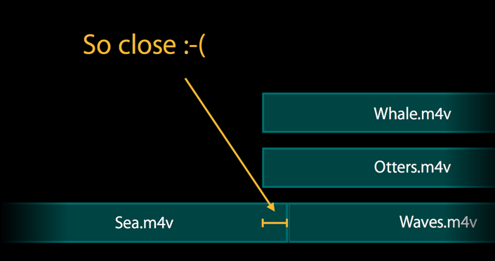
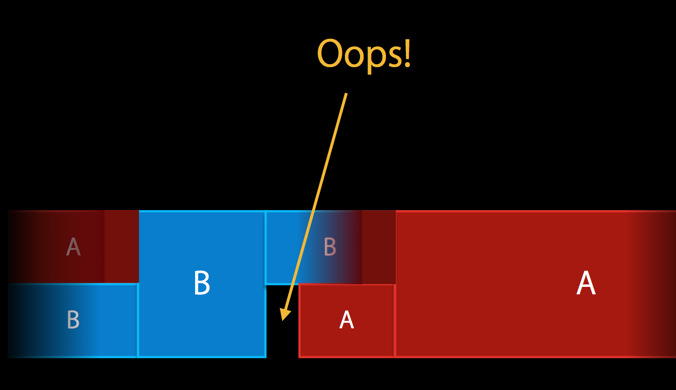
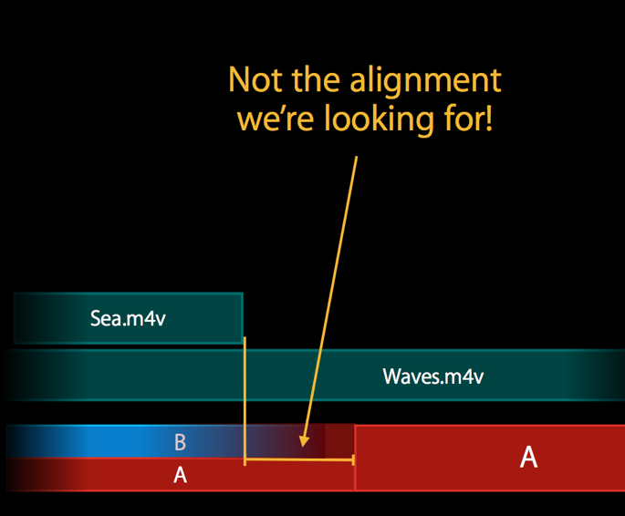
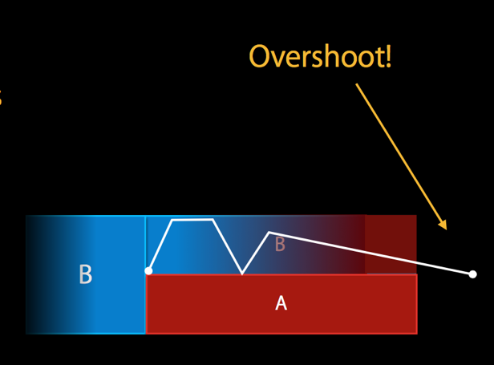
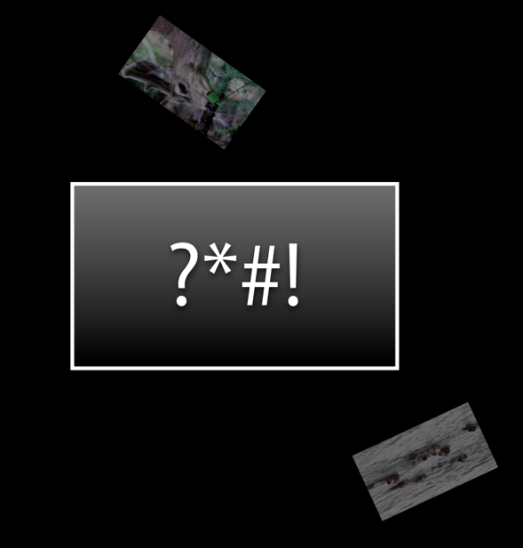
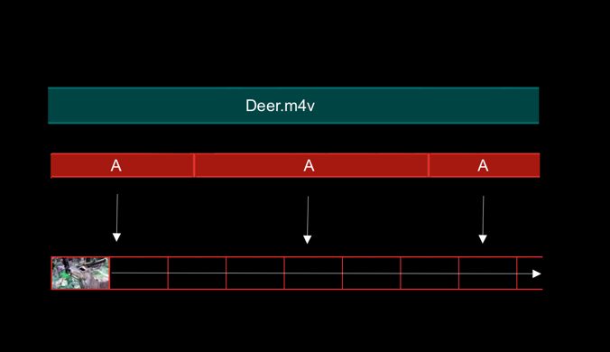
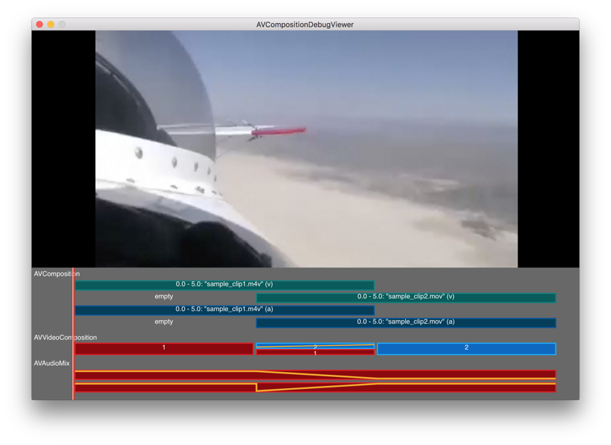

> 导航：[总目录](../../README.md) · [technotes](../../_indexes/technotes.md)

Technical Note TN2447

# Debugging AVFoundation Compositions, Video Compositions, and Audio Mixes

This document discusses some common problems you may encounter when creating complex AVFoundation compositions, video compositions and audio mixes, and how to debug them.

[Introduction](#apple-f4xwc4dqnrsv64tfmyxwi33df52wszbpirkfgnbqgaytonrqg4wugsbrfvke4vcbi4yq)[Common pitfalls](#apple-f4xwc4dqnrsv64tfmyxwi33df52wszbpirkfgnbqgaytonrqg4wugsbrfvbu6tknj5hf6ucjkrdectcmkm)[Compositions](#apple-f4xwc4dqnrsv64tfmyxwi33df52wszbpirkfgnbqgaytonrqg4wugsbrfvbu6tknj5hf6ucjkrdectcmkmwugt2nkbhvgskujfhu4uy)[Video Compositions, Audio Mixes](#apple-f4xwc4dqnrsv64tfmyxwi33df52wszbpirkfgnbqgaytonrqg4wugsbrfvbu6tknj5hf6ucjkrdectcmkmwvmskeivhv6q2pjvie6u2jkreu6tstl5pucvkejfhv6tkjlbcvg)[Debugging Compositions, Video Compositions and Audio Mixes](#apple-f4xwc4dqnrsv64tfmyxwi33df52wszbpirkfgnbqgaytonrqg4wugsbrfvcekqsvi5dustshl5bu6tkqj5jusvcjj5hfgx27kzeuirkpl5bu6tkqj5jusvcjj5hfgx2bjzcf6qkvireu6x2njfmekuy)[Visualize the Composition](#apple-f4xwc4dqnrsv64tfmyxwi33df52wszbpirkfgnbqgaytonrqg4wugsbrfvcekqsvi5dustshl5bu6tkqj5jusvcjj5hfgx27kzeuirkpl5bu6tkqj5jusvcjj5hfgx2bjzcf6qkvireu6x2njfmekuznkzevgvkbjrevurk7kreekx2dj5gvat2tjfkest2o)[Debugging Video Compositions](#apple-f4xwc4dqnrsv64tfmyxwi33df52wszbpirkfgnbqgaytonrqg4wugsbrfvcekqsvi5dustshl5lesrcfj5pugt2nkbhvgskujfhu4uy)[AVVideoCompositionValidationHandling protocol](#apple-f4xwc4dqnrsv64tfmyxwi33df52wszbpirkfgnbqgaytonrqg4wugsbrfvcekqsvi5dustshl5lesrcfj5pugt2nkbhvgskujfhu4uzniflfmskeivhugt2nkbhvgskujfhu4vsbjreuiqkujfhu4scbjzceyskoi5pvauspkrhugt2m)[Additional Information](#apple-f4xwc4dqnrsv64tfmyxwi33df52wszbpirkfgnbqgaytonrqg4wugsbrfvauircjkreu6tsbjrpustsgj5je2qkujfhu4)[Document Revision History](#apple-f4xwc4dqnrsv64tfmyxwi33df52wszbpirkfgnbqgaytonrqg4wvezlwnfzws33ojbuxg5dpoj4s2rdpnz2ey2lonncwyzlnmvxhiskel4yq)

## Introduction

The AVFoundation framework provides a feature-rich set of classes to facilitate the editing of audiovisual assets. At the heart of AVFoundation’s editing API are compositions, defined by the `AVComposition` object. A composition is simply a collection of tracks from one or more different media assets. The `AVMutableComposition` class provides an interface for inserting and removing tracks, as well as managing their temporal orderings. The tracks in an `AVComposition` object are fixed.

If you want to perform any custom audio or video processing on the tracks in your composition, you need to incorporate an audio mix or a video composition, respectively. An `AVAudioMix` object manages the input parameters for mixing audio tracks. It allows custom audio processing to be performed on audio tracks during playback or other operations. You can also set the relative volumes and ramping of audio tracks.

A video composition describes, for any time in the aggregate time range of its instructions, the number and IDs of video tracks that are to be used in order to produce a composed video frame corresponding to that time. When AV Foundation’s built-in video compositor is used, the instructions a video composition contains can specify a spatial transformation, an opacity value, and a cropping rectangle for each video source, and these can vary over time via simple linear ramping functions. An `AVVideoComposition` object represents an immutable video composition. The AV Foundation framework also provides a mutable subclass, `AVMutableVideoComposition`, that you can use to create new videos.

It’s quite possible to construct elaborate and complex compositions, video compositions, and audio mixes with entirely valid values that produce unexpected results. It's possible, for example, for a valid video composition to produce frames from which the contents of the source video tracks are entirely absent.

This document discusses some common pitfalls when constructing these, and ways to more easily debug them.

[Back to Top](#)

## Common pitfalls

Here are some of the common types of problems you may encounter when building complex compositions, video compositions and audio mixes.

### Compositions

#### Misaligned track segments

The alignment of the tracks might be wrong. For example, this can happen as a result of CMTime value rounding errors when inserting tracks into a composition for a specific time.

__Figure 1__  Misaligned track segments.

### Video Compositions, Audio Mixes

#### Gaps between segments

Don’t leave gaps between the segments in a video composition. This will almost certainly result in black frames, or a continuation of the last frame.

__Figure 2__  Gaps between segments.

#### Misaligned layer instructions

There could be a misalignment between the video composition time ranges and the composition track segments.

__Figure 3__  Misaligned layer instructions.

#### Misaligned opacity/audio ramps

You might have made a mistake in one of the ramps — by making it too long, for example.

__Figure 4__  Misaligned opacity/audio ramps.

#### Bogus layer transforms

You may have an error in the layer transformation matrix. This can cause your output to spin off beyond the boundaries of the output frame.

__Figure 5__  Bogus layer transforms.

#### Static frame for the entire duration of the source asset

You may have a video composition that produces a single static frame for the entire duration of the source asset. This can occur if you set the `frameDuration` of the `AVMutableVideoComposition` to the asset's duration. In the processing by the video compositor, only one frame would be produced, at the start time, and then "held" for the specified duration, in spite of the instructions for varying opacities, transforms, etc.

__Figure 6__  Static frame for the entire duration of the source asset.

[Back to Top](#)

## Debugging Compositions, Video Compositions and Audio Mixes

What’s the best way to debug a complex composition, video composition and audio mix?

### Visualize the Composition

One technique that works well is to visualize these. Rather than looking at your code, you look at a picture of your composition, video composition and audio mix.

There’s sample code that has been designed just for this purpose:

[AVCompositionDebugViewer(Mac)](https://developer.apple.com/library/content/samplecode/AVCompositionDebugViewer/)

[AVCompositionDebugVieweriOS](https://developer.apple.com/library/content/samplecode/AVCompositionDebugVieweriOS/Introduction/Intro.html#//apple_ref/doc/uid/DTS40013421)

These sample applications implement a custom `AVCompositionDebugView` class which presents a visual description of the underlying `AVComposition`, `AVVideoComposition` and `AVAudioMix` objects which form the composition. See Figure 7.

Simply drop the `AVCompositionDebugView` into your own app. It’s a non-interactive view. Extend it to draw your own video instructions. It will help you spot any overlaps and gaps in the composition tracks, video instructions, and the audio mix.

__Figure 7__  The AVCompositionDebugViewer app.

[Back to Top](#)

## Debugging Video Compositions

### AVVideoCompositionValidationHandling protocol

The `AVVideoCompositionValidationHandling` protocol declares methods that you can implement in the delegate of an `AVVideoComposition` object to indicate whether validation of a video composition should continue after specific errors have been found:

[videoComposition(_:shouldContinueValidatingAfterFindingInvalidValueForKey:)](https://developer.apple.com/reference/avfoundation/avvideocompositionvalidationhandling/1389404-videocomposition)

[videoComposition(_:shouldContinueValidatingAfterFindingEmptyTimeRange:)](https://developer.apple.com/reference/avfoundation/avvideocompositionvalidationhandling/1388620-videocomposition)

[videoComposition(_:shouldContinueValidatingAfterFindingInvalidTimeRangeIn:)](https://developer.apple.com/reference/avfoundation/avvideocompositionvalidationhandling/1390721-videocomposition)

[videoComposition(_:shouldContinueValidatingAfterFindingInvalidTrackIDIn:layerInstruction:asset:)](https://developer.apple.com/reference/avfoundation/avvideocompositionvalidationhandling/1388452-videocomposition)

In the course of validation with the [isValid(for:timeRange:validationDelegate:)](https://developer.apple.com/reference/avfoundation/avvideocomposition/1389917-isvalid) method, the receiver will invoke its `validationDelegate` with reference to any trouble spots in the video composition.

You should implement the methods defined by the `AVVideoCompositionValidationHandling` protocol to aid in the debugging of a video composition.

[Back to Top](#)

## Additional Information

For more information about the editing of audiovisual assets with AVFoundation, see the [Editing chapter of the AV Foundation Programming Guide](https://developer.apple.com/library/content/documentation/AudioVideo/Conceptual/AVFoundationPG/Articles/03_Editing.html#//apple_ref/doc/uid/TP40010188-CH8-SW1).

[Back to Top](#)

---

#### Document Revision History

| __Date__ | __Notes__ |
| 2017-03-17 | Editorial. |
| 2017-02-13 | New document that discusses techniques for debugging complex AVFoundation Compositions, Video Compositions, and Audio Mixes |

