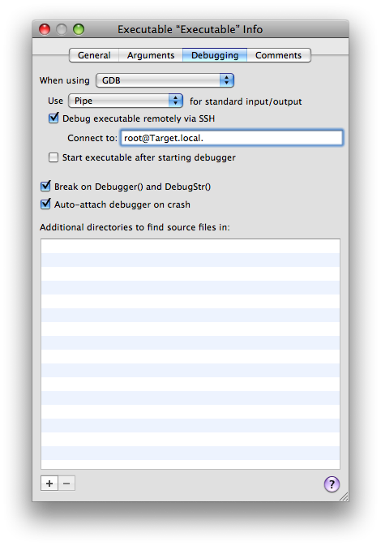

> 导航：[总目录](../../README.md) · [technotes](../../_indexes/technotes.md)


Technical Note TN2108

# Debugging An Authorization Plug-In With Xcode

This technote describes how you can use Xcode's SSH-based debugging feature to remotely debug an authorization plug-in. It is targeted at Mac OS X developers who are developing an authorization plug-in.

[Introduction](#apple-f4xwc4dqnrsv64tfmyxwi33df52wszbpirkfgnbqgaydoojwguwugsbrfvjukq2jjzkfet2ekvbviskpjy)[Getting Started](#apple-f4xwc4dqnrsv64tfmyxwi33df52wszbpirkfgnbqgaydoojwguwugsbrfvjukq2hivkfiskoi5jviqkskrcui)[Sharing The Source](#apple-f4xwc4dqnrsv64tfmyxwi33df52wszbpirkfgnbqgaydoojwguwugsbrfvjukq2tjbaverkeknhvkusdiu)[Enable Key-Based SSH For Root](#apple-f4xwc4dqnrsv64tfmyxwi33df52wszbpirkfgnbqgaydoojwguwugsbrfvjukq2sj5hviu2tja)[Configuring Xcode and Debug](#apple-f4xwc4dqnrsv64tfmyxwi33df52wszbpirkfgnbqgaydoojwguwugsbrfvjukq2dj5hemskhlbbu6rcf)[Lather, Rinse, Repeat](#apple-f4xwc4dqnrsv64tfmyxwi33df52wszbpirkfgnbqgaydoojwguwugsbrfvjukq2siviekqku)[Restoring Your System](#apple-f4xwc4dqnrsv64tfmyxwi33df52wszbpirkfgnbqgaydoojwguwugsbrfvjukq2vjzce6)[Further Reading](#apple-f4xwc4dqnrsv64tfmyxwi33df52wszbpirkfgnbqgaydoojwguwugsbrfvjukq2gkvjfiscfkjjekqkejfheo)[Document Revision History](#apple-f4xwc4dqnrsv64tfmyxwi33df52wszbpirkfgnbqgaydoojwguwvezlwnfzws33ojbuxg5dpoj4s2rdpnz2ey2lonncwyzlnmvxhiskel4yq)

## Introduction

The authorization plug-in facility allows you to run code during the login process. You can't use standard Xcode techniques to debug an authorization plug-in because there is no way to run Xcode at the time that the plug-in runs. This technote describes how you can use Xcode's SSH-based debugging feature to remotely debug an authorization plug-in. The setup is rather complicated (it requires two computers, setting up SSH login for root, and a shared build directory), but it's well worth the effort if you do a lot of work with authorization plug-ins.

__Warning:__ The instructions in this technote are only appropriate if your computers are running on a secure private network (ideally behind a firewall, but behind a NAT will typically be OK as well). There are at least two major security risks:

- You have to enable the root account and Remote Login (SSH), never a good combination.
- You have to enable AFP guest access to your source code.

Once you're done debugging, you should restore your computers to their default state by following the instructions in [Restoring Your System](#apple-f4xwc4dqnrsv64tfmyxwi33df52wszbpirkfgnbqgaydoojwguwugsbrfvjukq2vjzce6).

__Important:__ These instructions were tested with Xcode 3.1 on Mac OS X 10.5.4. They should work back to Xcode 3.0 on Mac OS X 10.5. If you need help setting this up on older versions of Xcode or Mac OS X, please contact [Developer Technical Support](mailto:dts@apple.com).

[Back to Top](#)

## Getting Started

To start, you'll need to do some basic configuration of your computers.

1. Start with two machines, the __development machine__ (which runs Xcode) and the __target machine__ (which runs your authorization plug-in).
2. In the Sharing panel of System Preferences, name the development machine "Development" and the target machine "Target".
3. Install the Xcode developer tools on both machines.

[Back to Top](#)

## Sharing The Source

For debugging to work properly, both machines will need access to your source code with exactly the same path.

1. On the development machine, put your source code on a volume other than the root volume (if you don't have another volume handy, you can use a disk image). Rename the volume to "Source".

   __Note:__ This step is necessary so that the path encoded in your debugger symbols is the same on both development and target machines (that is, it starts with `/Volumes/Source`).
2. On the development machine ensure that the Guest Account is enabled for sharing access ("Allow guests to connect to shared folders" in the Accounts panel of System Preferences).
3. On the development machine, in the Sharing panel of System Preferences, enable File Sharing over AFP.
4. In the same panel, drag the "Source" volume into the Shared Folders list and ensure that Everyone has Read Only access.
5. On the target machine use Connect to Server in the Finder to connect to the development machine as a guest user and verify that you can mount the "Source" volume and see the source code. Then unmount the "Source" volume.
6. On the target machine, add a mount record to your local directory store and refresh the automounter, as shown in Listing 1.

   __Listing 1__  Adding a mount record

   ```
   $ # Create the mount record $ sudo dscl . -create /Mounts/Development.local.:\\/Source $ sudo dscl . -create /Mounts/Development.local.:\\/Source VFSType url $ sudo dscl . -create /Mounts/Development.local.:\\/Source VFSLinkDir \ /Volumes/Source $ sudo dscl . -create /Mounts/Development.local.:\\/Source VFSOpts \ url==afp://\;AUTH=NO%20USER%20AUTHENT@Development.local./Source $ # Refresh the automounter $ sudo /usr/sbin/automount -c
   ```
7. On the target machine, confirm that the automount is working by listing the `/Volumes/Source` directory, as shown in Listing 2. This should automatically mount the "Source" volume on the target machine. However, because the volume is automounted it will not show up in the Finder.

   __Listing 2__  Confirming the automount

   ```shell
   $ ls -lh /Volumes/Source total 32 -r--r--r--@ 1 apple  wheel   1.0K Jun 26 17:23 Desktop DB -r--r--r--@ 1 apple  wheel     2B Jun 26 15:55 Desktop DF drwxrwxrwx@ 7 apple  wheel   264B Nov 28  2007 NullAuthPlugin
   ```

[Back to Top](#)

## Enable Key-Based SSH For Root

On current systems an authorization plug-in is hosted by either `SecurityAgent` or `authorizationhost`. These run as UID 92 (`_securityagent`) or UID 0 (`root`), respectively. To debug them, you'll have to run GDB as root on the target machine. To keep things simple, we will enable the root account and then enable key-based SSH authentication for that account.

1. On the target machine, enable Remote Login (SSH) in the Sharing panel of System Preferences.
2. On the target machine, run Directory Utility and choose enable the root user (choose Enable Root User on the Edit menu).
3. On the development machine, generate an SSH key pair as shown by Listing 3.

   __Listing 3__  Generating an SSH key pair

   ```shell
   $ mkdir -p .ssh $ ssh-keygen  Generating public/private rsa key pair. Enter file in which to save the key (/Users/apple/.ssh/id_rsa): .ssh/id_rsa-wideopen Enter passphrase (empty for no passphrase):  Enter same passphrase again:  Your identification has been saved in .ssh/id_rsa-wideopen. Your public key has been saved in .ssh/id_rsa-wideopen.pub. The key fingerprint is: 90:cc:24:66:ef:bf:8e:61:4a:f3:d0:9c:0f:d4:ac:5f apple@Development.local
   ```
4. Copy the SSH public key to the root user's home directory on the target machine, as shown by Listing 4.

   __Listing 4__  Copying the SSH public key to the root user's home directory

   ```shell
   $ scp .ssh/id_rsa-wideopen.pub root@Target.local.:
   ```
5. On the target machine, log in as root and install the SSH public key, as shown by Listing 5.

   __Listing 5__  Installing the SSH public key

   ```
   # mkdir -p .ssh # cat id_rsa-wideopen.pub > .ssh/authorized_keys
   ```
6. On the development machine, add the SSH key to your [ssh-agent](x-man-page://1/ssh-agent) and then confirm that you can SSH as root to the target machine without requiring a password (see Listing 6).

   __Listing 6__  Testing the SSH setup

   ```shell
   $ ssh-add .ssh/id_rsa-wideopen $ ssh root@Target.local. Last login: Thu Jun 26 23:58:23 2008 from Development.local #
   ```

[Back to Top](#)

## Configuring Xcode and Debug

The last step is to configure Xcode and debug your program. In this step we'll use [Sample Code 'NullAuthPlugin'](https://developer.apple.com/samplecode/NullAuthPlugin/index.html) to provide a concrete illustration as to the steps involved. To start, you wil have to build and install your code and then configure Xcode.

1. On the development machine, download [Sample Code 'NullAuthPlugin'](https://developer.apple.com/samplecode/NullAuthPlugin/index.html) and unpack it to the root directory of your "Source" volume.
2. Open the project in Xcode and build it.
3. On the target machine, copy the built plug-in to `/Library/Security/SecurityAgentPlugins/`, as shown by Listing 7.

   __Listing 7__  Installing the plug-in

   ```shell
   $ sudo cp -R \ /Volumes/Source/NullAuthPlugin/build/Debug/NullAuthPlugin.bundle \ /Library/Security/SecurityAgentPlugins/
   ```

   __Note:__ The command in Listing 7 only works because of the automount you set up in [Sharing The Source](#apple-f4xwc4dqnrsv64tfmyxwi33df52wszbpirkfgnbqgaydoojwguwugsbrfvjukq2tjbaverkeknhvkusdiu).
4. On the target machine, modify the `system.login.console` right in the authorization database (currently `/etc/authorization`) to invoke the plug-in. Start by making a backup of the authorization database, as shown by Listing 8.

   __Listing 8__  Backing up the authorization database

   ```shell
   $ sudo cp /etc/authorization /etc/authorization-orig
   ```

   Then edit the file (using your favorite text editor) to add the mechanism string "NullAuthPlugin:WaitForDebugger" after the mechanism string "HomeDirMechanism:status". Confirm your change using the command shown in Listing 9.

   __Listing 9__  Check the authorization database modification

   ```shell
   $ grep -A 2 HomeDirMechanism /etc/authorization                 <string>HomeDirMechanism:login,privileged</string>                 <string>HomeDirMechanism:status</string>                 <string>NullAuthPlugin:WaitForDebugger</string>                 <string>MCXMechanism:login</string>
   ```
5. On the target machine, log out and then log back in. The login should hang as `NullAuthPlugin` waits for the debugger to connect.
6. On the development machine, bring the `NullAuthPlugin` project to the front in Xcode and choose New Custom Executable from the Project menu. In the resulting dialog leave the Executable Name field set to "Executable" and enter "/System/Library/CoreServices/SecurityAgent.app/Contents/MacOS/SecurityAgent" into the Executable Path field. Then click Finish.
7. In the Debugging tab of the Executable Info window, check the "Debug executable remotely via SSH" checkbox. Enter "root@Target.local." into the "Connect to:" field. And uncheck the "Start executable after starting the debugger" checkbox. The window should now look like Figure 1.

__Figure 1__  Xcode's Executable Info window



Once everything is set up you can use the following steps to actually debug your code.

1. In Xcode, choose Debugger from the Run menu to show the debugger window, then choose Console from the Run menu to show the console window.
2. In Xcode, choose Debug from the Run menu. This console window will now show you the state of GDB running as root on the target machine!
3. In the console window, attach to the `SecurityAgent` as shown in Listing 10.

   __Listing 10__  Attaching to the SecurityAgent

   ```
   (gdb) attach SecurityAgent Attaching to program: `/System/Library/CoreServices/SecurityAgent.app/Contents/MacOS/SecurityAgent', process 263. Reading symbols for shared libraries ...[…]... done 0x920dd806 in __sigsuspend_nocancel () […]
   ```
4. In Xcode, you can now use the debugger window to debug the authorization plug-in as you would any other code.

Phew! It's been a long haul, but I trust that the result is worth the effort.

[Back to Top](#)

## Lather, Rinse, Repeat

Inevitably your debugging efforts will lead to code changes, and that requires you to reinstall your authorization plug-in and debug the new version. This is surprisingly simple.

1. In Xcode on the development machine, stop the debugger.
2. Make your code changes and rebuild your project.
3. On the target machine, reinstall the plug-in by repeating the command in Listing 7.
4. On the target machine, log out and then log back in. The login should hang as `NullAuthPlugin` waits for the debugger to connect.
5. Follow the steps from the previous section to start the debugger.

[Back to Top](#)

## Restoring Your System

Once you're done debugging you should restore your computers to a reasonable state. This section describes the necessary steps.

1. On the target machine, remove the reference to your authorization plug-in from the `system.login.console` right in the authorization database (`/etc/authorization`). You can do this by restoring the database from the backup you made earlier, as shown in Listing 11.

   __Listing 11__  Restoring the authorization database from your backup

   ```shell
   $ sudo cp /etc/authorization-orig /etc/authorization
   ```
2. On the target machine, remove your authorization plug-in from the `/Library/Security/SecurityAgentPlugins/` directory.
3. On the target machine, remove the SSH public key for the root user. Log in as root and then run the command in Listing 12.

   __Listing 12__  Removing the SSH public key

   ```
   # rm .ssh/authorized_keys
   ```
4. On the target machine, disable SSH login (Remote Login in the Sharing panel of System Preferences).
5. On the target machine, disable the root user (in Directory Utility).
6. On the target machine, remove the mount record from your local directory store, as shown in Listing 13.

   __Listing 13__  Remove the mount record

   ```
   $ # Delete the mount record $ sudo dscl . -delete /Mounts/Development.local.:\\/Source $ # Refresh the automounter $ sudo /usr/sbin/automount -c
   ```
7. Restart the target machine.
8. On the development machine, quit Xcode.
9. On the development machine, remove the "Source" volume from the Shared Folders list (in the Sharing panel of System Preferences).
10. On the development machine, disable File Sharing over AFP (in the Sharing panel of System Preferences).
11. On the development machine, restore the Guest Account to your preferred state (in the Accounts panel of System Preferences).
12. Restart the development machine.
13. On each of the development and target machines, restore the computer name to its previous value (in the Sharing panel of System Preferences).

[Back to Top](#)

## Further Reading

- [Authorization Plug-in Reference](https://developer.apple.com/documentation/Security/Reference/AuthorizationPluginRef/index.html)
- [Sample Code 'NullAuthPlugin'](https://developer.apple.com/samplecode/NullAuthPlugin/index.html)
- [ADC Home > Reference Library > Tools > Xcode](https://developer.apple.com/referencelibrary/DeveloperTools/idxXcode-date.html)
- [Debugging with GDB](https://developer.apple.com/documentation/DeveloperTools/gdb/gdb/gdb_toc.html)
- [ssh man page](x-man-page://1/ssh)
- [ssh-keygen man page](x-man-page://1/ssh-keygen)
- [ssh-add man page](x-man-page://1/ssh-add)
- [sshd man page](x-man-page://8/sshd)
- [sshd_config man page](x-man-page://5/sshd_config)

[Back to Top](#)

---

#### Document Revision History

| __Date__ | __Notes__ |
| 2008-09-08 | New document that a tutorial on how to use Xcode to debug an authorization plug-in. |

