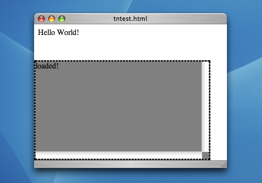
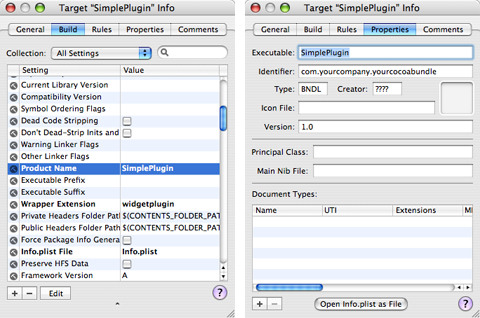
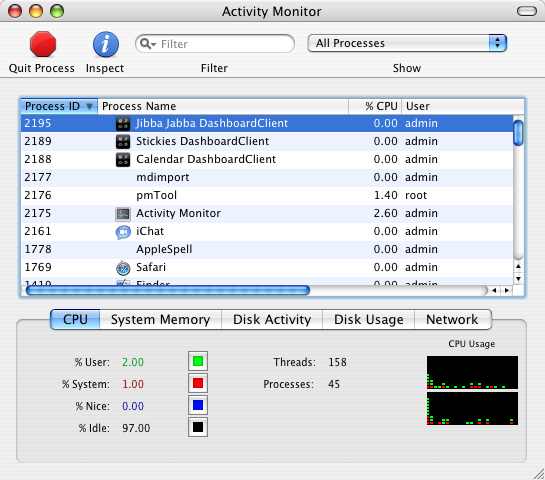
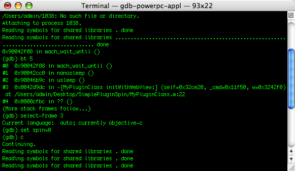

> 导航：[总目录](../../README.md) · [technotes](../../_indexes/technotes.md)


# Retired Document

__Important:__
This document may not represent best practices for current development. Links to downloads and other resources may no longer be valid.

Technical Note TN2139

# Debugging Dashboard Widgets

__Important:__ This document may not represent best practices for current development. Links to downloads and other resources may no longer be valid.

This Technical Note covers common problems and errors encountered during the development of a Dashboard widget, along with techniques for discovering and preventing such problems. It is targeted at developers working with Dashboard on Mac OS X Tiger.

__Note:__ Some of the information in this Technical Note is no longer accurate as of Mac OS X 10.5 Leopard. Developers should use Dashcode for troubleshooting and debugging Dashboard widgets on Mac OS X 10.5 and later.

[Introduction](#apple-f4xwc4dqnrsv64tfmyxwi33df52wszbpirkfgmjqgaydgnjsguwugsbrfvke4vcbi4yq)[Developing in Safari](#apple-f4xwc4dqnrsv64tfmyxwi33df52wszbpirkfgmjqgaydgnjsguwugsbrfvke4vcbi4za)[Printing Debug Information](#apple-f4xwc4dqnrsv64tfmyxwi33df52wszbpirkfgmjqgaydgnjsguwugsbrfvke4vcbi4zq)[Activating Development Mode](#apple-f4xwc4dqnrsv64tfmyxwi33df52wszbpirkfgmjqgaydgnjsguwugsbrfvke4vcbi4ytg)[Widgets That Don't Launch](#apple-f4xwc4dqnrsv64tfmyxwi33df52wszbpirkfgmjqgaydgnjsguwugsbrfvke4vcbi42a)[Dashboard Never Appears](#apple-f4xwc4dqnrsv64tfmyxwi33df52wszbpirkfgmjqgaydgnjsguwugsbrfvke4vcbi4zdc)[Default Image, No Content](#apple-f4xwc4dqnrsv64tfmyxwi33df52wszbpirkfgmjqgaydgnjsguwugsbrfvke4vcbi4zde)[Kicked out of the (Widget) Bar](#apple-f4xwc4dqnrsv64tfmyxwi33df52wszbpirkfgmjqgaydgnjsguwugsbrfvke4vcbi4zdg)[Failure of Specific Features](#apple-f4xwc4dqnrsv64tfmyxwi33df52wszbpirkfgmjqgaydgnjsguwugsbrfvke4vcbi4zdk)[Web Content: Networking, Embeds, File I/O, and Java](#apple-f4xwc4dqnrsv64tfmyxwi33df52wszbpirkfgmjqgaydgnjsguwugsbrfvke4vcbi4zdq)[Widget Preferences](#apple-f4xwc4dqnrsv64tfmyxwi33df52wszbpirkfgmjqgaydgnjsguwugsbrfvke4vcbi4zdm)[Widget Plug-ins](#apple-f4xwc4dqnrsv64tfmyxwi33df52wszbpirkfgmjqgaydgnjsguwugsbrfvke4vcbi42q)[Where's my Plug-in?](#apple-f4xwc4dqnrsv64tfmyxwi33df52wszbpirkfgmjqgaydgnjsguwugsbrfvke4vcbi44a)[Calling a Plug-in](#apple-f4xwc4dqnrsv64tfmyxwi33df52wszbpirkfgmjqgaydgnjsguwugsbrfvke4vcbi4ytc)[Crashing Plug-ins](#apple-f4xwc4dqnrsv64tfmyxwi33df52wszbpirkfgmjqgaydgnjsguwugsbrfvke4vcbi4yte)[Document Revision History](#apple-f4xwc4dqnrsv64tfmyxwi33df52wszbpirkfgmjqgaydgnjsguwvezlwnfzws33ojbuxg5dpoj4s2rdpnz2ey2lonncwyzlnmvxhiskel4yq)

## Introduction

Dashboard widgets are not difficult to create, but they can be challenging to work with once something goes wrong. Developers used to working with languages like Objective-C or Java may be used to more control and feedback during the development process than what is provided from the web-based technologies used to create a widget. This Technical Note discusses effective methods to obtain such control and feedback, hopefully making better use of your development time.

This Technical Note is meant to be a supplement to the [Dashboard Programming Guide](https://developer.apple.com/documentation/AppleApplications/Conceptual/Dashboard_Tutorial/). Developers interested in learning how to create a Dashboard widget should first read that document; the basics of widget development are not covered here.

[Back to Top](#)

## Developing in Safari

One of the most important things to keep in mind when developing a widget is the fact that it is, in many ways, just a web page. Dashboard widgets use the same Web Kit rendering engine as Safari, so you can do almost all of your development inside Safari and not be concerned with bundling, property lists, default images and icons, all of which add their own complexity (these are discussed later).

If you've already bundled your widget, simply Control-click on the `.wdgt` bundle and select Show Package Contents to view all your content from the Finder. You then open your main HTML file in Safari to view its content without the additional variables of the Dashboard runtime.

Testing your content in Safari is particularly essential in the area of JavaScript errors. Dashboard will report JavaScript errors to the Console application, but it is difficult to block execution from inside a widget in order to narrow down the source of an error. Working in Safari will also help you isolate calls to the `widget` object and force the good habit of wrapping such calls with `if (window.widget)` checks.

The first important step for debugging in Safari is enabling the Debug menu. This is accomplished by typing the Terminal command shown in Listing 1:

__Listing 1__  Enabling the Debug Menu in Safari.

```
l337_d3v$ defaults write com.apple.Safari IncludeDebugMenu 1
```

The next time you launch Safari, you should see the Debug menu to the right of the Help menu. Be sure to select the Log JavaScript Exceptions item, to get as much feedback as possible. A new feature in Mac OS X v10.4 is the JavaScript Console, which can also be enabled from the Debug menu. Once the JavaScript console is active, you're ready to work.

[Back to Top](#)

## Printing Debug Information

The most basic and universal debugging aid in JavaScript programming is the `alert` statement. It takes a single argument (usually a string) and displays it in a modal dialog. The blocking nature of the dialog can be used to make "breakpoints" in your JavaScript in order to narrow down exactly when during execution a given error appears in Safari's JavaScript Console.

While the `alert` function's modal behavior can be a blessing, it can also be a curse. It doesn't take long to build up a large number of `alert` statements, and before you know it, you're clicking 30 times whenever you refresh your content. This can become cumbersome, and may create a functional problem for code that is running in a `setInterval` timer. That code may be depending on a certain amount of time to elapse, but if you're busy closing dialogs, the page will take much longer than usual to load and the time elapsed before a single iteration of the timer even got around to executing.

When running in Dashboard, `alert` statements are simply printed to the Console, avoiding any of these issues. To get the best of both worlds, create a debug element in your web page appending your debug information to it when in Safari. This debug element allows you to make logging statements that are much less intrusive than modal alerts.

Declaring a debug element is as simple as inserting a `div` tag anywhere in your page and providing CSS properties to position it. Listing 1 demonstrates the insertion of a debug `div` into a webpage. JavaScript methods to show, hide and print to the `div` are also defined.

__Listing 2__  Inserting a debug `div` into existing content

```
<html>      <head>      <style type="text/css">           #debugDiv {                border-style: dotted;                 border-color: black;                background: gray;                position: absolute;                bottom: 0px;                left: 0px;                height: 200px;                width: 90%;                overflow: scroll;                display:none;           }      </style>      <script language="JavaScript" type="text/javascript">           var debugMode = false;            // Write to the debug div when in Safari.           // Send a simple alert to Console when in Dashboard.           function DEBUG(str) {                if (debugMode) {                     if (window.widget) {                          alert(str);                     } else {                          var debugDiv = document.getElementById('debugDiv');                          debugDiv.appendChild(document.createTextNode(str));                          debugDiv.appendChild(document.createElement("br"));                          debugDiv.scrollTop = debugDiv.scrollHeight;                     }                }           }            // Toggle the debugMode flag, but only show the debugDiv in Safari           function toggleDebug() {                debugMode = !debugMode;                if (debugMode == true && !window.widget) {                     document.getElementById('debugDiv').style.display = 'block';                } else {                     document.getElementById('debugDiv').style.display = 'none';                }           }      </script>      </head>       <body onload='toggleDebug();DEBUG("loaded!");'>            <!-- All our existing content... -->           Hello World!           <!-- Declare the debug div anywhere. CSS handles the positioning -->           <div id='debugDiv'></div>       </body> </html>
```

Figure 1 demonstrates what the above page looks like in Safari. Note the "loaded!" string that is passed to `DEBUG` appears in the `div` at the bottom.

__Figure 1__  A simple web page with a debug/log `div`.



An alternate technique is to create a new window using `window.open`, and write your logging statements directly to that window's `document` object. This would not require any CSS or HTML declarations, but it would require popup blocking to be turned off in Safari.

This document does not discuss the basics of JavaScript debugging. A great article about the basics of JavaScript debugging can be found at [The JavaScript Source](http://javascript.internet.com/debug-guide.html). The article is dated and does not cover some of the newer features of JavaScript and DHTML, but much of the information and common caveats are still applicable. In particular, the `debugDiv` demonstrated above can replaces `document.write` and `alert` calls used in the article. The JavaScript Console in Safari plays the role of the "warning box."

[Back to Top](#)

## Activating Development Mode

When the time comes to test your widget in bundled form, it can be quite cumbersome to repeatedly show and hide the Dashboard to switch between your widget and other Desktop apps, such as Console, or the editor you're using to make changes. To minimize the number of times you show and hide Dashboard, you can place Dashboard in Development Mode. This allows you to keep a widget on screen at all times � even when Dashboard is not shown. To enable Development Mode:

- Type the following in Terminal: `defaults write com.apple.dashboard devmode YES`
- Logout/login (or restart) to reload Dashboard with the new setting
- Load your widget into Dashboard
- Drag your widget a short distance; do __not__ release the mouse
- With the mouse still held down, hide Dashboard; your widget should now be hovering over the desktop

Viewing output, making changes, and reloading will be a much smoother process with your widget permanently visible.

__Note:__ To reload a widget, make sure it is focused and press Command-R on your keyboard. You should see a "swirl" animation, indicating that the widget's content has been reloaded.

[Back to Top](#)

## Widgets That Don't Launch

So you've dropped all your content into a `.wdgt` bundle and are ready to start testing in Dashboard. You pull your widget from the Widget Bar or double-click your bundle in the Finder and nothing happens. Either the widget doesn't show up or it shows up for a split second and vanishes. There are a number of potential reasons for this, categorized below by the accompanying symptoms.

### Dashboard Never Appears

Double-clicking a functional widget from the Finder should result in the Dashboard being shown and the widget being loaded. If you double-click your widget and the Dashboard never shows itself, your bundle is probably missing one of the following items:

- __Default image__. The top level of your widget bundle must contain an image file in PNG format named `Default.png`. This image is displayed while Dashboard loads your regular content. If this file is missing, malformed, or misnamed, the widget will not load. To ensure the image is in the correct format, open it with Preview and select Get Info from the Tools menu. If the info window does not report a Document type of "Portable Network Graphics Image" it is most likely not a valid Default image.
- __Info.plist file__. Perhaps you forgot to include an `Info.plist` file at the top level of your widget bundle. The Dashboard Programming Guide covers all the required keys, but the most important are covered below.
- __CFBundleIdentifier key__. A unique `CFBundleIdentifier` value in your `Info.plist` is essential to any application on Mac OS X; Dashboard widgets are no exception. Widgets do not load without this key defined.
- __MainHTML key__. The `MainHTML` key defines what content is loaded by the widget. If the key is not present, the widget is not loaded. Remember that the value of this key is case-sensitive. Make sure the value matches the filename exactly.

### Default Image, No Content

If your widget successfully displays in Dashboard, you should see its default image on the screen while the main content loads. If the default image vanishes and nothing replaces it, it most likely means your `MainHTML` key does not match the actual HTML filename in the top level of your widget bundle.

__Note:__ If this happens to you, it may be difficult to close the widget. The easiest thing to do in this case is to show the Widget Bar; this reveals the closeboxes for every widget on screen.

Content that shows itself but is not responsive likely threw a error in JavaScript code stemming from the `onload` handler. Check the Console for errors.

### Kicked out of the (Widget) Bar

In order for your widget to appear in the Widget Bar, it must be placed in either `/Library/Widgets` or `~/Library/Widgets`. Widgets without an `Icon.png` image file at the top level of the widget bundle will appear in the Widget Bar but with a generic icon.

Widgets added to one of the two installation directories should appear the next time you show Dashboard. If yours does not, cycle through all the lists in the Widget Bar in case it is just off-screen. The Widget Bar is organized alphabetically based on each widget's localized `CFBundleDisplayName`.

__Note:__ Like the rest of Mac OS X, the Widget Bar gives precedence to filenames that do not match the localized `CFBundleDisplayName`. If your widget bundle is renamed in the Finder, or `CFBundleDisplayName` is not defined, the filename is shown.

[Back to Top](#)

## Failure of Specific Features

### Web Content: Networking, Embeds, File I/O, and Java

As described in the Security section of the Dashboard Programming Guide, certain web content features require special `Info.plist` keys to function in a Dashboard widget. These features include:

- Network Access: document location changes, hypertext links XMLHttpRequest objects, any other items that reach across the network
- Internet Plug-Ins: Web (not widget) plug-ins via the EMBED tag (to display QuickTime content, for example)
- File Access: Attempts to touch the filesystem outside of the `.wdgt` bundle, via absolute or relative paths
- Java Applets: Using the APPLET tag to embed Java content

If content falling under any of these categories is in your widget without the appropriate `Info.plist` key, the content will not be evaluated or rendered. See the Security section of the Dashboard Programming Guide for more information on the restrictions applied to Dashboard widgets.

### Widget Preferences

A common mistake when writing out widget preferences is a reversal of the required parameters. The `widget.setPreferenceForKey` function is defined with a Cocoa-style parameter ordering: parameters are passed in the order the function names them. When calling this function, be sure that you pass the preference value first and the key second. If you're more familiar with Java or JavaScript APIs, you may be expecting to pass the key first, which will persist the information backwards. Subsequent calls to `widget.preferenceForKey` will then likely return null, since the preference was not actually stored correctly.

It is also important to persist both preference values and keys as Strings. Primitive values or objects may not be persisted into preferences successfully; attempting to do so will typically yield an error in Console resembling Listing 3.

__Listing 3__  Typical widget preferences write error.

```
DashboardClient[869] CFLog (15): Could not generate XML data for property list
```

It is worth mentioning that widget preferences are also a mechanism for saving widget state. Remember that at any time, the user may log out or restart the computer, at which point your widget's process will be terminated. If you wish to have any transient state restored when the user logs back in and shows Dashboard again, that state needs to be written out as widget preferences as soon as it changes, and fetched when the widget instance is reloaded.

__Note:__ Killing a `DashboardClient` process is not the same as widget removal - the user action which triggers the `onremove` event handler. Widget removal is only triggered by the user clicking on the closebox. Any widget instance whose `DashboardClient` process was killed will be reloaded the next time the current user logs in.

[Back to Top](#)

## Widget Plug-ins

The concept behind a widget plug-in is simple: providing JavaScript access to native code and APIs. This section covers common problems when developing a plug-in, how to recognize them, and how to solve and prevent them. The basics to developing a widget plug-in are covered in the Dashboard Programming Guide, and are not discussed here.

### Where's my Plug-in?

The most common problem with widget plug-ins is that they just don't show up. This problem is usually accompanied by an error in the Console like the one in Listing 3.

__Listing 4__  Typical error due to a missing widget plug-in.

```
DashboardClient[123] (com.mycompany.MyWidget) undefined: Can't find variable:MyWidgetPlugin (line: 0)
```

This is actually a generic "undefined variable" error from JavaScript; what's unique about it is that the variable in question is the name of your widget plug-in. This error is seen every time your JavaScript code attempts to reference the plug-in and is an indication that the widget does not recognize this variable as your plug-in. This usually happens for one of the following reasons:

- __The plug-in is missing or misnamed__. Widget plug-ins should be at the top-level of the widget bundle with a `.widgetplugin` filename extension and a filename matching the `Plugin` entry in your widget's `Info.plist` file. The value of the `Plugin` key must also include the `.widgetplugin` extension. If any of these requirements are not met, the plug-in is not loaded.

  After adding the `Plugin` key to your `Info.plist`, launching the widget should bring up a confirmation dialog before loading all of the content. This is a good way of confirming that the `DashboardClient` at least recognizes your `Plugin` key. It does not, however, guarantee that the plug-in is present or loaded.
- __A correct implementation of initWithWebView is missing__. The `initWithWebView:` method is a critical piece of code in your widget plug-in. If it is missing, the signature is incorrect, or it produces an error, your plug-in fails to load, usually throwing a `selector not recognized` error in Console.
- __The JavaScript name does not match the native name__. In your plug-in's `windowScriptObjectAvailable:` method, you must register a key/name with the `WebScriptObject` that was passed. This name must match the variable name you are using on the JavaScript side; if it does not, JavaScript does not know to treat the variable as a widget plug-in.
- __The bundle internals are mismatched__. Many developers tend to rename targets in Xcode from time to time. If you rename your widget plug-in's Xcode target, or any of its products, view the Info window for the target and make sure the __Product Name__ property under the Build tab matches the __Executable__ field under the Properties tab. In the built product, this ensures that the name of the compiled binary in your plug-in's Contents/MacOS folder matches the `CFBundleExecutable` value in your plug-in's (not your widget's) `Info.plist` file. If these names do not match, the plug-in's binary is not located and the plug-in does not load. Figure 2 shows the relevant settings in Xcode.

__Figure 2__  Product Name and Executable properties in Xcode target settings.



The easiest way to ensure your plug-in is actually loaded (as opposed to your `Plugin` key being recognized) is to include an `NSLog` statement in your `initWithWebView:` method, as shown in Listing 4:

__Listing 5__  Reporting the loading of a widget plug-in.

```objc
- (id) initWithWebView:(WebView*)webview {      NSLog(@"I'm in!");      // initialize...      return self; }
```

__Note:__ Remember to comment out or remove `NSLog` statements from your plugin when deploying your widget. In a production scenario, log statements should be reserved for errors and exceptions.

### Calling a Plug-in

A widget plug-in's methods are exposed to JavaScript as soon as you bind it to the `WebScriptObject` that was passed to `windowScriptObjectAvailable:`. However, you can choose to provide custom JavaScript signatures for any of your plug-in's methods via the `webScriptNameForSelector:` method. If you choose to do this, take extra care to make sure the signature registered here matches the calls you are making from JavaScript.

It is also important to make sure you have not defined methods you are trying to call or members you are trying to reference inside the `isSelectorExcludedFromWebScript:` or `isKeyExcludedFromWebScript:` methods. These methods, as their names imply, bar access to the specified selectors/keys from JavaScript.

Calls to a plug-in method blocked by either of these mechanisms results in a Console error resembling that shown in Listing 5.

__Listing 6__  Typical method-not-found error from JavaScript..

```
Value undefined (result of expression MyPlugin.MyMethod) is not object. (line: 10)
```

### Crashing Plug-ins

Depending on the complexity of your plug-in, it may end up crashing or hanging during the course of development and use. If the crash is indeed in your code, this should become evident when viewing a crash log from the `DashboardClient` process that loaded your widget. However, the crash log may only tell you so much. If the methods in question are large, it may not be immediately evident what code is crashing, so further isolation is necessary. This is where gdb comes in.

This document only discusses how to best use gdb with a widget plug-in. To learn about general use of gdb, see [Getting Started With gdb](https://developer.apple.com/technotes/tn/tn2032.html) or [Debugging With gdb](https://developer.apple.com/documentation/DeveloperTools/gdb/gdb/gdb_toc.html).

#### Attaching gdb to a Plug-in

In order to attach to your widget, you need the process ID of the `DashboardClient` tied to it. This can be found using Activity Monitor. As Figure 3 demonstrates, the process behind your widget can be identified in Activity Monitor by your widget's `CFBundleName`. From here, you can acquire the pid and attach to your widget's `DashboardClient` from gdb, set breakpoints, and catch crashes.

__Figure 3__  Dashboard widgets inside Activity Monitor.



Also note that an `NSLog` statement contains the pid of your widget's `DashboardClient` process. Therefore, if you are already making log statements in your plug-in, looking in Activity Monitor is not necessary. Again, remember to remove any unnecessary log statements before shipping your widget.

#### Catching a Crash on Startup

If your plug-in crashes as soon as it is loaded, the `DashboardClient` process does not stay up long enough for you to get the pid and attach. Since it is not possible to load a widget from gdb, you need a way to catch the `DashboardClient` between the time it launches and the time it crashes. The simplest way to do this is to insert a loop into your plug-in as early as possible. The best place is inside `initWithWebView:`, the first message your plug-in receives. Listing 6 demonstrates what this might look like.

__Listing 7__  Using a loop to stop a widget plug-in.

```objc
-(id)initWithWebView: (WebView*) w {      NSLog(@"initWithWebView");       // spin before doing anything serious      // this will buy us time to attach with gdb      int spin = 1;      while (spin == 1) {           usleep(1000);      }       self = [super init];      return self; }
```

This should hang your widget up and allow you to attach with gdb before a crash occurs. You get the pid from the `NSLog` statement in Console.

Once you've obtained the pid, you can attach to the process and change your loop condition, allowing execution to continue as expected. Figure 4 shows a simple example of this.

__Figure 4__  Breaking a spin loop from gdb.

[Back to Top](#)

---

#### Document Revision History

| __Date__ | __Notes__ |
| 2009-05-11 | Deprecating this document in favor of Dashcode on 10.5 and later. |
| 2005-09-07 | Added clarification on Default images. |
|  | Added clarification on Default images. |
| 2005-05-02 | Dashboard widget troubleshooting techniques, from start to finish. |
|  | New document that dashboard widget troubleshooting techniques, from start to finish. |

