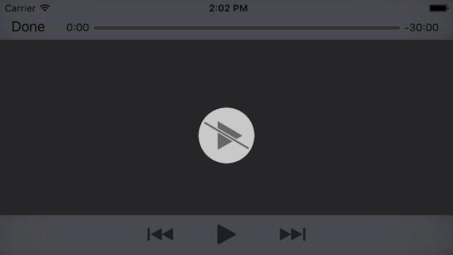
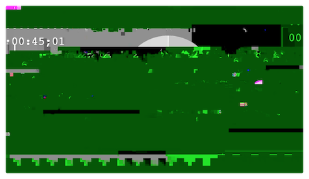

> 导航：[总目录](../../README.md) · [technotes](../../_indexes/technotes.md)


Technical Note TN2454

# Debugging FairPlay Streaming

This document is intended for AVFoundation clients and content owners that are debugging issues when playing FairPlay streaming (FPS) content. This document discusses the most common issues that can arise while during the development process for creating an FPS-aware application as well as how to debug them.

[Debugging FairPlay Streaming Overview](#apple-f4xwc4dqnrsv64tfmyxwi33df52wszbpirkfgnbqgaytonrtgawugsbrfvcekqsvi5dustshl5decskskbgecwk7knkferkbjveu4r27j5lekuswjfcvo)[Content Authoring and Content Playback Issues](#apple-f4xwc4dqnrsv64tfmyxwi33df52wszbpirkfgnbqgaytonrtgawugsbrfvbu6tsuivhfix2bkvkeqt2sjfheox2bjzcf6q2pjzkektsul5ieyqkzijaugs27jfjvgvkfkm)[Quickly Diagnosing Content Key and IV Issues](#apple-f4xwc4dqnrsv64tfmyxwi33df52wszbpirkfgnbqgaytonrtgawugsbrfvbu6tsuivhfix2bkvkeqt2sjfheox2bjzcf6q2pjzkektsul5ieyqkzijaugs27jfjvgvkfkmwvcvkjinfuywk7ireucr2oj5justshl5bu6tsuivhfix2livmv6qkoirpusvs7jfjvgvkfkm)[Investigating Content Authoring Issues](#apple-f4xwc4dqnrsv64tfmyxwi33df52wszbpirkfgnbqgaytonrtgawugsbrfvbu6tsuivhfix2bkvkeqt2sjfheox2bjzcf6q2pjzkektsul5ieyqkzijaugs27jfjvgvkfkmwustswivjviskhifkestshl5bu6tsuivhfix2bkvkeqt2sjfheox2jknjvkrkt)[Verifying Key Security Module (KSM) Implementation](#apple-f4xwc4dqnrsv64tfmyxwi33df52wszbpirkfgnbqgaytonrtgawugsbrfvlekusjizmustshl5fukwk7kncugvksjfkfsx2nj5cfktcfl5puwu2nl5pustkqjrcu2rkokraviskpjy)[Quickly Verifying KSM Implementation With Development Credentials](#apple-f4xwc4dqnrsv64tfmyxwi33df52wszbpirkfgnbqgaytonrtgawugsbrfvlekusjizmustshl5fukwk7kncugvksjfkfsx2nj5cfktcfl5puwu2nl5pustkqjrcu2rkokraviskpjywvcvkjinfuywk7kzcveskglfeu4r27jnju2x2jjvieyrknivhfiqkujfhu4x2xjfkeqx2eivlektcpkbguktsul5bverkeivhfiskbjrjq)[Verifying Content Key and Initialization Vector lookup](#apple-f4xwc4dqnrsv64tfmyxwi33df52wszbpirkfgnbqgaytonrtgawugsbrfvlekusjizmustshl5fukwk7kncugvksjfkfsx2nj5cfktcfl5puwu2nl5pustkqjrcu2rkokraviskpjywvmrksjfdfsskoi5pugt2okrcu4vc7jncvsx2bjzcf6skojfkesqkmjfnecvcjj5hf6vsfinke6us7jrhu6s2vka)[Common KSM Implementation Issues With Deployment Credentials](#apple-f4xwc4dqnrsv64tfmyxwi33df52wszbpirkfgnbqgaytonrtgawugsbrfvlekusjizmustshl5fukwk7kncugvksjfkfsx2nj5cfktcfl5puwu2nl5pustkqjrcu2rkokraviskpjywugt2njvhu4x2lkngv6sknkbgektkfjzkecvcjj5hf6sktknkuku27k5evisc7ircvatcplfguktsul5bverkeivhfiskbjrjq)[Verifying Client FPS Playback Implementation](#apple-f4xwc4dqnrsv64tfmyxwi33df52wszbpirkfgnbqgaytonrtgawugsbrfvlekusjizmustshl5buyskfjzkf6rsqknpvatcblfbecq2ll5eu2ucmivguktsuifkest2o)[Helpful Resources](#apple-f4xwc4dqnrsv64tfmyxwi33df52wszbpirkfgnbqgaytonrtgawugsbrfveektcqizkuyx2sivju6vksincvg)[Document Revision History](#apple-f4xwc4dqnrsv64tfmyxwi33df52wszbpirkfgnbqgaytonrtgawvezlwnfzws33ojbuxg5dpoj4s2rdpnz2ey2lonncwyzlnmvxhiskel4yq)

## Debugging FairPlay Streaming Overview

FairPlay Streaming (FPS) securely delivers keys to Apple mobile devices, Apple TV, and Safari on macOS, which will enable playback of encrypted video content. At a high level there are generally three different issues that can arise during the implementation process which are:

- Content authoring issues or content playback issues.
- Invalid Key Security Module (KSM) implementation.
- Invalid client FPS playback implementation.

To better diagnose the issues you are seeing regarding FPS it helps to try and narrow down the scope of the problem. This document walks you through how to narrow down the nature of issues when creating FPS aware applications and provides debugging guidance.

[Back to Top](#)

## Content Authoring and Content Playback Issues

If the issue you are seeing is that your content is unable to actually play on platforms that support FPS, the underlying issue may fall into one of two groups:

- An invalid content key and/or initialization vector being sent by the KSM.
- An issue with how the content was authored.

If the issue is related to how the content was authored, typically what you will observe on the client side is that it is unable to playback the content:

__Figure 1__  An example stream with a content authoring issue.



In the case of having an invalid content key or initialization vector you may be able to play the content. However, the system will be unable to properly render it:

__Figure 2__  An example stream with an invalid content key or initialization vector.



The following section goes over how you can quickly diagnose if the issue you are seeing is due to an invalid content key and/or initialization vector being sent by the KSM.

### Quickly Diagnosing Content Key and IV Issues

To narrow down if the issue you are seeing is a content authoring issue or a key delivery issue, we recommend you do the following to your test content:

1. In the m3u8 playlist, set the `KEYFORMAT` attribute under the `EXT-X-KEY` tag to value of "identity" instead of "com.apple.streamingkeydelivery". You can also remove the `KEYFORMAT` attribute since its absence indicates an implicit value of "identity". For example the following:

   ```
   #EXT-X-KEY:METHOD=SAMPLE-AES,URI="skd://key67",KEYFORMAT="com.apple.streamingkeydelivery",KEYFORMATVERSIONS="1"
   ```

   Would become:

   ```
   #EXT-X-KEY:METHOD=SAMPLE-AES,URI="skd://key67",KEYFORMAT="identity",KEYFORMATVERSIONS="1"
   ```
2. Remove the `KEYFORMATVERSIONS` attribute from the `EXT-X-KEY` tag:

   ```
   #EXT-X-KEY:METHOD=SAMPLE-AES,URI="skd://key67",KEYFORMAT="identity"
   ```
3. Add the initialization vector (IV) associated with the content key of the test content as an additional attribute called `IV` under the `EXT-X-KEY` tag:

   ```
   #EXT-X-KEY:METHOD=SAMPLE-AES,URI="skd://key67",KEYFORMAT="identity",IV=0xA30FE123ECBF1BE323A775A119C553BC
   ```
4. Make the 16 byte content key associated with the test content available on your web server as a file that can be accessed and update the `URI` attribute under the `EXT-X-KEY` tag to point to the content key file:

   ```
   #EXT-X-KEY:METHOD=SAMPLE-AES,URI="http://mysite.com/my16ByteKey.bin",KEYFORMAT="identity",IV=0xA30FE123ECBF1BE323A775A119C553BC
   ```
5. Attempt to playback the content using the updated playlist.

Performing the above steps allows your client to receive the same content, but instead of decrypting it with FPS, the media framework decrypts it with a clear text AES key.

__Important:__ Please note that you should only ever use the `identity` value for `KEYFORMAT` for testing and you should not deploy your content like this in production.

If after making the above changes your media still does not play, then you should continue to the "[Investigating Content Authoring Issues](#apple-f4xwc4dqnrsv64tfmyxwi33df52wszbpirkfgnbqgaytonrtgawugsbrfvbu6tsuivhfix2bkvkeqt2sjfheox2bjzcf6q2pjzkektsul5ieyqkzijaugs27jfjvgvkfkmwustswivjviskhifkestshl5bu6tsuivhfix2bkvkeqt2sjfheox2jknjvkrkt)" section of this document.

If the content does play, continue to the "[Verifying Key Security Module (KSM) Implementation](#apple-f4xwc4dqnrsv64tfmyxwi33df52wszbpirkfgnbqgaytonrtgawugsbrfvlekusjizmustshl5fukwk7kncugvksjfkfsx2nj5cfktcfl5puwu2nl5pustkqjrcu2rkokraviskpjy)" section of this document.

### Investigating Content Authoring Issues

If you were not able to play your content correctly after using the "identity" `KEYFORMAT` then you may be running into an issue related to how you authored your content. These issues typically fall into one of the following categories:

- Verifying FPS m3u8 playlist

  - It is important to test the validity of any playlist streams using the Media Stream Validator tool. For more information about how to verify your content, see the [Debugging HTTP Live Streaming](https://developer.apple.com/library/content/technotes/tn2436/_index.html) technical note which covers this in great detail.

    - The `mediastreamvalidator` only supports regular HLS `m3u8` playlists so you will need to run it against the unencrypted variant of your content instead of your encrypted variant.
- Sample level encryption

  - There are two types of content that are supported for FairPlay Streaming, MPEG-2 transport stream (ts) and fragmented MPEG-4 (fMP4). Both of these types of content support sample level encryption which means that ranges of individual samples are encrypted with AES-128 CBC with no padding.

    - MPEG-2 TS sample encryption, which is specified in [MPEG-2 Stream Encryption Format for HTTP Live Streaming](../../documentation/Audio%20Video/MPEG-2%20Stream%20Encryption%20Format%20for%20HTTP%20Live%20Streaming/1.0%20Introduction.md#apple-f4xwc4dqnrsv64tfmyxwi33df52wszbpkridimbqgezdqnrsfvbuqnjnknltc). This document describes a sample-level encryption format for several types of elementary streams that can be carried in MPEG-2 Transport Streams "ISO/IEC 13818-1" and MPEG Elementary Audio streams.
    - fMP4 sample encryption which is specified in ISO/IEC 23001:7 2016, Common Encryption in ISO BMFF [CENC]. Apple devices only support 'cbcs', which is specified in CENC Section 10.4.
- Program Association Table (PAT), Program Map Table (PMT) Audio Setup Information

  - For any audio that is encrypted with FairPlay Streaming there are some required metadata updates. Refer to the Audio Setup Information section in MPEG-2 Stream Encryption Format for HTTP Live Streaming for more information: [MPEG-2 Stream Encryption Format for HTTP Live Streaming - Audio Streams](../../documentation/Audio%20Video/MPEG-2%20Stream%20Encryption%20Format%20for%20HTTP%20Live%20Streaming/2.0%20Encryption.md#apple-f4xwc4dqnrsv64tfmyxwi33df52wszbpkridimbqgezdqnrsfvbuqmrnknlts)
- Content Key rotation on HLS segments

  - Avoid rotating your content key on anything that isn't an HLS segment. We recommend that you rotate your keys on HLS segments at the most granular level. You can also change your content key value on a bitrate switch.

If, however the content does play successfully after performing the above changes, the issue is either an invalid Key Security Module (KSM) implementation or an invalid client FPS playback implementation.

[Back to Top](#)

## Verifying Key Security Module (KSM) Implementation

If, after verifying your content is authored correctly you still are observing issues with playback, the next thing you should do is validate your KSM implementation.

### Quickly Verifying KSM Implementation With Development Credentials

A good indicator of if your KSM is processing SPC payloads correctly is to temporarily configure it to do the following:

- Use the development credentials that are included in the FairPlay Streaming Server SDK.
- Use the hardcoded DASk value that is defined in the FairPlay Streaming Programming Guide.
- Capture the CKC and save it to disk in a binary data format.

__Important:__ Please note that you should only make the above changes while debugging your KSM implementation and that you should not support the development credentials on a production KSM.

After making the above changes, do the following to validate your KSM implementation:

- The FairPlay Streaming Server SDK includes multiple SPC test vectors and a verification utility called `verify_ckc`. This utility can be used to test your KSM implementation by verifying the validity of the CKC created by your KSM when using one of the SPC test vectors. For example here is what `verify_ckc` returns when a KSM produces a valid CKC for one of the included SPC test vectors:

  ```
  # For a CKC named "myValidCKC.bin"
          $ ./verify_ckc -s SPC\ CKC\ Tests/FPS/spc1.bin -c ~/Documents/myValidCKC.bin
          CKC/SPC Sanity Test v. 2.01
          ...
          Info: CKC decryption and parsing was successful.
  ```

  If, however your KSM generated an invalid CKC you would see the following:

  ```
  # For a CKC named "myValidCKC.bin"
          $ ./verify_ckc -s SPC\ CKC\ Tests/FPS/spc1.bin -c ~/Documents/myInvalidCKC.bin
          CKC/SPC Sanity Test v. 2.01
          ...
          CKC parsing error! Found a problem with the CKC TLLV structure.
  ```

  __Important:__ Please note however, the `verify_ckc` tool only supports the SPC test vectors that come with the FairPlay Streaming Server SDK. You can not use an SPC generated with your FPS deployment credentials.

  The `verify_ckc` tool can also output all the TLLV content of an SPC and CKC if you pass the `-v` flag. This is useful if you wish to confirm that your KSM implementation is parsing the TLLV blocks correctly from the SPC as well as if it is returning TLLV blocks correctly in the CKC. Here is an example of using the `verify_ckc` tool in this way:

  ```
  # For a CKC named "myCKC.bin"
          $ ./verify_ckc -s SPC\ CKC\ Tests/FPS/spc1.bin -c ~/Documents/myCKC.bin -v
          CKC/SPC Sanity Test v. 2.01
          ...
  ```

  Additional information regarding how to test your KSM can be found in the FairPlay Streaming Programming Guide under the section titled "Testing the Key Security Modules".

  The "FairPlay Streaming Programming Guide", `verify_ckc` utility, and pre-generated SPC test vectors are included in the FairPlay Streaming Server SDK which is available to download here: [FairPlay Streaming - Apple Developer](https://developer.apple.com/streaming/fps/).

### Verifying Content Key and Initialization Vector lookup

While you cannot use the development credentials to test actual playback of protected content, you can verify that your logic for providing the content key and initialization vector for content playback works as expected by using the test SPC vectors and the `verify_ckc` tool:

1. Lookup the asset id for the SPC test vector you are using by running the `verify_ckc` tool:

   ```
   $ ./verify_ckc -s SPC\ CKC\ Tests/FPS/spc1.bin
   CKC/SPC Sanity Test v. 2.01
   ...
   Asset ID Tag -- 1bf7f53f5d5d5a1f
   Tag size: 0x12
   Tag length: 0x80
   Tag value:
                   aa bb cc dd   ee ff aa bb   cc dd ee ff   aa bb cc dd
                   ee ff -- -- -- -- -- -- -- -- -- -- -- -- -- --
   ...
   ```
2. Using the same method you have implemented content key and initialization vector lookup for your actual content, create an entry for the asset id from the input SPC using any content key and initialization vector. For this example:

   - Our asset id is `AABBCCDDEEFFAABBCCDDEEFFAABBCCDDEEFF`.
   - The content key is `3B3B3B3B3B3B3B3B3B3B3B3B3B3B3B3B`.
   - The initialization vector is `D5FBD6B82ED93E4EF98AE40931EE33B7`.
3. Using the SPC test vector from step 1, process the SPC using your KSM with the development credential configuration discussed in the beginning of the "Quickly Verifying KSM Implementation With Development Credentials" section of this document.
4. Run the `verify_ckc` tool using the SPC test vector and the captured CKC.

   ```
   # For a CKC named "myCKC.bin"
   $ ./verify_ckc -s SPC\ CKC\ Tests/FPS/spc1.bin -c ~/Documents/myCKC.bin
   CKC/SPC Sanity Test v. 2.01
   ...
   SPC SK Value:
       af b4 6e 7b   f5 f3 15 96   c1 c6 76 dc   15 e1 4d c6
   ...
   CK Tag -- 58b38165af0e3d5a
   Tag size: 0x20
   Tag length: 0x20
   Tag value:
                   d5 fb d6 b8   2e d9 3e 4e   f9 8a e4 09   31 ee 33 b7
                   3d 56 43 97   87 8b 70 43   e1 54 31 f1   f8 6b c5 62
   ...
   Info: CKC decryption and parsing was successful.
   ```

   There is a section called the `SPC SK Value` which contains a 16 byte value that is used to encrypt and decrypt the content key in the CKC response. In this example it is `AFB46E7BF5F31596C1C676DC15E14DC6`.

   There is a section called `CK Tag -- 58b38165af0e3d5a` which has a value that is 32 bytes long:

   - The first 16 bytes represent the initialization vector you specified in step 2. In this example it is `D5FBD6B82ED93E4EF98AE40931EE33B7`.
   - The second 16 bytes represent the content key from step 2 after it has been encrypted. In this example it is `3D564397878B7043E15431F1F86BC562`.
5. To get the decrypted version of the content key, we need to perform an additional decryption step using the `SPC SK Value` and encrypted content key. Here is an example using the `openssl` command line tool:

   ```shell
   # For an encrypted content key of '3D564397878B7043E15431F1F86BC562'
   # and an SPC SK value of 'AFB46E7BF5F31596C1C676DC15E14DC6'

   $ echo 3D564397878B7043E15431F1F86BC562 | xxd -p -r | openssl enc -d -aes-128-ecb -K AFB46E7BF5F31596C1C676DC15E14DC6 -nosalt -nopad | xxd -p

   3B3B3B3B3B3B3B3B3B3B3B3B3B3B3B3B
   ```

   The unencrypted version of the content key in this example is `3B3B3B3B3B3B3B3B3B3B3B3B3B3B3B3B`.

If the values for the actual initialization vector and/or content key match what you configured in step 2 then your KSM logic should be working as expected.

If the values are not the same, this is a good indicator that the issue is in your KSM implementation's content key and initialization vector lookup code.

### Common KSM Implementation Issues With Deployment Credentials

If after verifying your KSM produces a valid CKC response for the SPC test vectors you are still encountering issues with your deployment credentials the next thing to do is to verify the parts of your KSM that are unique to using deployment credentials. The following are some common debugging tips related to the KSM workflow specific to deployment credentials:

- Once you have confirmed that your KSM generates the expected CKC for the test vectors using the development credentials and fixed DASk, the next thing to verify is your D Function implementation. This is covered in the document titled "D Function Guide" that is in the FPS Deployment package that you received as part of your production FPS credentials.
- Verifying that you are using the correct certificate and private key pair:

  - It is important to make sure that your FPS clients and KSM are using the correct certificate and private key pair. If you are not using the correct pair this can lead to your KSM improperly decrypting the SPC message or your client generating an SPC that you can not process.
  - To verify that you are using the correct certificate and private key pair you can use the `openssl` command line tool as demonstrated below:

  ```shell
  # For a certificate named fairplay.cer
                  $ openssl x509 -noout -modulus -in fairplay.cer -inform der | openssl md5
                  552349e40d222c8e01bbc74d08ceea6f

                  # For a private key named privatekey.pem. This may require you to enter the password protecting the private key file.
                  $ openssl rsa -noout -modulus -in privatekey.pem | openssl md5
                  552349e40d222c8e01bbc74d08ceea6f
  ```

  If the output of both commands matches then this means they belong to the same certificate and private key pair. If they do not match then it means you are not using a matching set and you should update your implementation to ensure you are using the correct credentials.
- Verifying how you are using your ASk

  - It is important to make sure you are treating your ASk as a byte array and not as a string. If you do not treat the ASk as a byte array your KSM may fail to process the SPC correctly. This can lead to creating a CKC that cannot be decrypted by the client. For example:

  ```
  // For a theoretical ASk of 'FFFFFFFFFFFFFFFFFFFFFFFFFFFFFFFF' you should have a byte array of:
                  UInt8 ASk[] = { 0xFF, 0xFF, 0xFF , 0xFF , 0xFF , 0xFF , 0xFF , 0xFF , 0xFF , 0xFF , 0xFF , 0xFF , 0xFF , 0xFF , 0xFF , 0xFF };
  ```
- Content Key and Initialization Vector lookup

  - Verify that your KSM is looking up the correct key in your key database. Since you have verified that your content is playable using the "identity" `KEYFORMAT`, you should make sure that the correct content key and initialization vector are being returned by your KSM.
[Back to Top](#)

## Verifying Client FPS Playback Implementation

To validate your client implementation please do the following:

- General FPS Playback:

  - Verify that your Application certificate is encoded using the X.509 standard with distinguished encoding rules (DER). To verify this you can use the `openssl` command line tool as demonstrated below:

  ```shell
  # For a certificate named fairplay.cer
          $ openssl x509 -in fairplay.cer -inform der -text -noout
          Certificate:
          Data:
              Version: 3 (0x2)
              Serial Number:
                  76:a0:19:cf:0c:4f:15:2b
              Signature Algorithm: sha1WithRSAEncryption
              Issuer: C=US, O=Apple Inc., OU=Apple Certification Authority, CN=Apple Key Services Certification Authority
              ...
  ```

  If the output of the above `openssl` command is similar to the example shown, then your Application Certificate is using the proper DER encoding. If the output of the above command is `unable to load certificate` then the certificate you are using is not using DER encoding and you will need to convert your certificate to use DER encoding.

  Your private key should be in the appropriate format your cryptographic library supports.
- FPS Playback on iOS and tvOS:

  - The FairPlay Streaming Server SDK includes an iOS and tvOS sample that demonstrate how to use the AVFoundation Framework APIs to play FPS content. The FairPlay Streaming Server SDK is available to download here: [FairPlay Streaming - Apple Developer](https://developer.apple.com/streaming/fps/).

    __Important:__ Please note that you will need to update the sample to point to your test content and KSM implementation.
  - To fetch FPS errors from AVFoundation, see the sections titled "Interpreting Error Messages" and "Manually Fetching FPS Error Messages" in the document "FairPlay Streaming Programing Guide". This document is also included as part of the FairPlay Streaming Server SDK.
- FPS Playback in Safari on macOS:

  - To better debug issues with FPS Playback in Safari on supported versions of macOS, you should enable the Web Inspector so that you can use the built-in debugger to debug your JavaScript code. The following documents will show you how to enable the Web Inspector and how to use the built-in debugger:

    - [Safari Web Inspector Guide - Get Oriented](../../documentation/Apple%20Applications/Safari%20Web%20Inspector%20Guide/Get%20Oriented.md#apple-f4xwc4dqnrsv64tfmyxwi33df52wszbpkridimbqga3tqnzufvbuqmrnknltc)
    - [Safari Web Inspector Guide - Debugger](../../documentation/Apple%20Applications/Safari%20Web%20Inspector%20Guide/Debugger.md#apple-f4xwc4dqnrsv64tfmyxwi33df52wszbpkridimbqga3tqnzufvbuqnjnknltc)
  - While using the built-in debugger in the Safari Web Inspector use the following events in your JavaScript to narrow down where the issue is occurring:

    - `webkitneedkey`

      - Typically, in this event you are creating the `MediaKeySession` by calling `MediaKeySession.createSession()` with a byte array containing the AssetID and the Application Certificate. If you are observing an error here, verify that you are passing the byte array correctly and that your application certificate is in the correct format.
    - `webkitkeymessage`

      - This event is where your client should be requesting the CKC from your KSM implementation. If your request succeeds, your client should call `MediaKeySession.update()` using the CKC that the KSM received.
    - `webkitkeyadded`

      - This event is called when a CKC was successfully added to the current `MediaKeySession`. If the CKC is valid for the content you should be able to begin playback.
    - `webkitkeyerror`

      - This event is called when an error occurred in the process of getting a CKC for playback. In this case, it is useful to figure out what calls failed before this event was triggered.

  All of these keys are discussed in more detail in the FairPlay Streaming Programing Guide in the section titled "Integrating FPS in Safari on OS X".

  - The FairPlay Streaming Server SDK includes a sample HTML page that demonstrates how to use the HTML5 Encrypted Media Extensions (EME) JavaScript APIs to play FPS content. The FairPlay Streaming Server SDK is available to download here: [FairPlay Streaming - Apple Developer](https://developer.apple.com/streaming/fps/).

    __Important:__ Please note that you will need to update the sample to point to your test content and KSM implementation.

[Back to Top](#)

## Helpful Resources

The following resources available on the Apple Developer website contain helpful information that you may find useful:

- For information regarding topics specific to FairPlay Streaming as well as the latest version of the FairPlay Streaming Server SDK, please see [FairPlay Streaming - Apple Developer](https://developer.apple.com/streaming/fps/).
- For information regarding topics specific to HTTP Live Streaming such as documentation, videos and streaming examples, please see [HTTP Live Streaming - Apple Developer](https://developer.apple.com/streaming/).
- For information regarding debugging techniques for HTTP Live Streaming, please see [TN2436 Debugging HTTP Live Streaming](https://developer.apple.com/library/content/technotes/tn2436/_index.html).
- For information regarding Safari and the developer tools included in it, please see [Safari for Developers - Apple Developer](https://developer.apple.com/safari/).
- For information regarding the AV Foundation framework on Apple's supported platforms, please see [AV Foundation for iOS and macOS - Apple Developer](https://developer.apple.com/av-foundation/).

[Back to Top](#)

---

#### Document Revision History

| __Date__ | __Notes__ |
| 2018-01-08 | Updated with additional debugging tips for FPS Content Authoring and KSM implementation. |
| 2017-04-13 | New document that new document that explains how to debug common issues related to FairPlay Streaming (FPS). |

