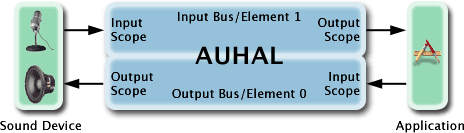

> 导航：[总目录](../../README.md) · [technotes](../../_indexes/technotes.md)


Technical Note TN2091

# Device input using the HAL Output Audio Unit

This technical note illustrates how to obtain input from an audio device by using the Hardware Abstraction Layer's AudioOutputUnit (AUHAL). The AUHAL can be used to simplify input and output operations commonly done with audio devices.

An application can use the Hardware Abstraction Layer's (HAL) AudioOutputUnit to interface to a single audio device. The AudioOutputUnit (AUHAL) unit sits on top of an `AudioDevice` object as defined in <CoreAudio/AudioHardware.h>. The AUHAL can be used for input and output to an audio device.

The AUHAL can be used to capture input from an audio device by following these steps:

1.Open an AUHAL

2.Enable the AUHAL for input.

3.Set the default input device as the current input device of the AUHAL.

4.Obtain the device format and specify the audio format you desire.

5.Create the input callback and register it with the AUHAL.

6.Allocate necessary buffers.

7.Initialize & start the AUHAL.

These steps are illustrated in depth throughout this technote.

[Creating an AudioOutputUnit](#apple-f4xwc4dqnrsv64tfmyxwi33df52wszbpirkfgmjqgaydgmjrhawugsbrfviecusuj5hek)[A quick word on Audio Unit connections](#apple-f4xwc4dqnrsv64tfmyxwi33df52wszbpirkfgmjqgaydgmjrhawugsbrfvjugt2qivjq)[Enabling IO](#apple-f4xwc4dqnrsv64tfmyxwi33df52wszbpirkfgmjqgaydgmjrhawugsbrfviecusukrlu6)[Setting the current device of the AudioOutputUnit](#apple-f4xwc4dqnrsv64tfmyxwi33df52wszbpirkfgmjqgaydgmjrhawugsbrfvbvkussivhfircfkzeugri)[What about the audio data format?](#apple-f4xwc4dqnrsv64tfmyxwi33df52wszbpirkfgmjqgaydgmjrhawugsbrfvde6usnifkfg)[Channel Mapping](#apple-f4xwc4dqnrsv64tfmyxwi33df52wszbpirkfgmjqgaydgmjrhawugsbrfvbuqqkojzcuytkbkbiestsh)[Creating an Input proc for an AudioOutputUnit](#apple-f4xwc4dqnrsv64tfmyxwi33df52wszbpirkfgmjqgaydgmjrhawugsbrfveu4ucvkrifet2d)[Initializing and Starting the AudioOutputUnit](#apple-f4xwc4dqnrsv64tfmyxwi33df52wszbpirkfgmjqgaydgmjrhawugsbrfvjviqkskreu4ry)[Acquiring data from the AudioOutputUnit](#apple-f4xwc4dqnrsv64tfmyxwi33df52wszbpirkfgmjqgaydgmjrhawugsbrfvaugukvjfjestsh)[Conclusion](#apple-f4xwc4dqnrsv64tfmyxwi33df52wszbpirkfgmjqgaydgmjrhawugsbrfvbu6tsdjrkvgskpjy)[Sample Code and References](#apple-f4xwc4dqnrsv64tfmyxwi33df52wszbpirkfgmjqgaydgmjrhawugsbrfvjekrsfkjcu4q2fkm)[Document Revision History](#apple-f4xwc4dqnrsv64tfmyxwi33df52wszbpirkfgmjqgaydgmjrhawvezlwnfzws33ojbuxg5dpoj4s2rdpnz2ey2lonncwyzlnmvxhiskel4yq)

## Creating an AudioOutputUnit

You must first obtain an AudioOutputUnit by using a Component Description, as you would when attempting to obtain any other Audio Unit.

__Listing 1__  How to open an AudioOutputUnit 10.6 and later

```
 AudioComponent comp;
    AudioComponentDescription desc;
    AudioComponentInstance auHAL;

    //There are several different types of Audio Units.
    //Some audio units serve as Outputs, Mixers, or DSP
    //units. See AUComponent.h for listing
    desc.componentType = kAudioUnitType_Output;

    //Every Component has a subType, which will give a clearer picture
    //of what this components function will be.
    desc.componentSubType = kAudioUnitSubType_HALOutput;

     //all Audio Units in AUComponent.h must use
     //"kAudioUnitManufacturer_Apple" as the Manufacturer
    desc.componentManufacturer = kAudioUnitManufacturer_Apple;
    desc.componentFlags = 0;
    desc.componentFlagsMask = 0;

    //Finds a component that meets the desc spec's
    comp = AudioComponentFindNext(NULL, &desc);
    if (comp == NULL) exit (-1);

     //gains access to the services provided by the component
    AudioComponentInstanceNew(comp, &auHAL);
```

__Listing 2__  How to open an AudioOutputUnit 10.5.x and earlier

```
 Component comp;
    ComponentDescription desc;
    ComponentInstance audioOutputUnit;

    //There are several different types of Audio Units.
    //Some audio units serve as Outputs, Mixers, or DSP
    //units. See AUComponent.h for listing
    desc.componentType = kAudioUnitType_Output;

    //Every Component has a subType, which will give a clearer picture
    //of what this components function will be.
    desc.componentSubType = kAudioUnitSubType_HALOutput;

     //all Audio Units in AUComponent.h must use
     //"kAudioUnitManufacturer_Apple" as the Manufacturer
    desc.componentManufacturer = kAudioUnitManufacturer_Apple;
    desc.componentFlags = 0;
    desc.componentFlagsMask = 0;

    //Finds a component that meets the desc spec's
    comp = FindNextComponent(NULL, &desc);
    if (comp == NULL) exit (-1);

     //gains access to the services provided by the component
    OpenAComponent(comp, &audioOutputUnit);
```

[Back to Top](#)

## A quick word on Audio Unit connections

When an audio unit is asked to provide audio data, it does one of two things, depending on how you connect it.

- If the audio unit gets its audio data from your application, it invokes a callback function in your application.
- If the audio unit gets its audio data from another audi unit, it invokes the render method of that audio unit.

In this second case, two audio units are directly connected to each other. For example, say that audio unit A1 feeds audio unit A2. When A2 is asked to provide data, it "pulls" it from A1. This highlights the requirement that connections between audio units must share a common audio stream format. To read more about audio unit connections, refer to the [Audio Processing Graphs and the Pull Model](../../documentation/Music%20Audio/Audio%20Unit%20Programming%20Guide/Audio%20Unit%20Development%20Fundamentals.md#apple-f4xwc4dqnrsv64tfmyxwi33df52wszbpkridimbqgaztenzyfvbuqnznknltcmq) section of the Audio Unit Programming Guide.

__Figure 1__  The signal flow of the AUHAL



Figure 1 illustrates the flow of audio data from audio devices to and from your application. Your application may connect an audio unit to either element (bus) of the AUHAL to simplify operations. Thus, in the case when you are using an audio unit as a source to output audio to a device, use the following connection:

__Table 1__  Output audio to a device

| Source | Destination |
| Source Unit (output scope, output element) | AUHAL (input scope, element 0) |

When you want to get the audio device's input data, the connection should be:

__Table 2__  Capture audio into a device

| Source | Destination |
| AUHAL (output scope, element 1) | Destination Unit (input scope, input element ) |

Of course, for a device like the Built-in Audio device that provides both input and output, a software playthrough mechanism can be established simply by creating the following connection:

__Table 3__  Simple Software playthrough

| Source | Destination |
| AUHAL (output scope, element 1) | AUHAL (input scope, element 0) |

One could also do any number of arbitrary processing operations to the audio from input to output by inserting one or more audio units between the input and output. So, lets take an example where you want to process the Built-in Audio input with a multiband compressor Audio Unit. You can do this by creating the following connections:

__Table 4__  Processing the Built-in Audio's input with a multiband compressor Audio Unit.

| Source | Destination |
| AUHAL (output scope, element 1) | Multiband Compressor (input scope, element 0 ) |
| Multiband Compressor (output scope, element 0) | AUHAL (input scope, element 0) |

The AUGraph APIs (in AudioToolbox.framework) can manage these connections for you. An `AUGraph` is a high level representation of a set of Audio Units and connections between them. See the Audio Unit Processing Graph Services Reference for more information.

If you have two separate audio devices, two AUHALs will be required. However, because each AUHAL is going to run on its own separate I/O proc, you cannot make a direct connection between the two AUHALs. You must use a notification mechanism to notify the output device that data has arrived then pass the data through.

__Note:__ Please note only one AudioOutputUnit can be used per AUGraph.

[Back to Top](#)

## Enabling IO

After creating the AUHAL object, you must enable IO on the input scope of the Audio Unit to obtain device input. Input must be explicitly enabled with the `kAudioOutputUnitProperty_EnableIO` property on element 1 of the AUHAL. Because the AUHAL can be used for both input and output, for this example we must also disable IO on the output scope.

__Listing 3__  Enabling input and disabling output for an AudioOutputUnit

```
 UInt32 enableIO;
     UInt32 size=0;

     //When using AudioUnitSetProperty the 4th parameter in the method
     //refer to an AudioUnitElement. When using an AudioOutputUnit
     //the input element will be '1' and the output element will be '0'.

      enableIO = 1;
      AudioUnitSetProperty(InputUnit,
                kAudioOutputUnitProperty_EnableIO,
                kAudioUnitScope_Input,
                1, // input element
                &enableIO,
                sizeof(enableIO));

      enableIO = 0;
      AudioUnitSetProperty(InputUnit,
                kAudioOutputUnitProperty_EnableIO,
                kAudioUnitScope_Output,
                0,   //output element
                &enableIO,
                sizeof(enableIO));
```

[Back to Top](#)

## Setting the current device of the AudioOutputUnit

The AUHAL must have a device it will interface with. In this example, we will select the system's default input device for our current device. `AudioHardwareGetProperty` used with the parameter `kAudioHardwarePropertyDefaultInputDevice` will obtain the current input device selected by the user. After obtaining the `AudioDeviceID`, you can set the audio device to be the Audio Unit's current device with `AudioUnitSetProperty` and the parameter `kAudioOutputUnitProperty_CurrentDevice`. Please keep in mind that devices can only be set to the AUHAL after enabling IO.

__Listing 4__  How to set the current device of the AudioOutputUnit to the default input device

```
OSStatus SetDefaultInputDeviceAsCurrent(){
    UInt32 size;
    OSStatus err =noErr;
    size = sizeof(AudioDeviceID);

    AudioDeviceID inputDevice;
    err = AudioHardwareGetProperty(kAudioHardwarePropertyDefaultInputDevice,
                                                  &size,
                                                  &inputDevice);

    if (err)
        return err;

    err =AudioUnitSetProperty(InputUnit,
                         kAudioOutputUnitProperty_CurrentDevice,
                         kAudioUnitScope_Global,
                         0,
                         &inputDevice,
                         sizeof(inputDevice));

   return err;

}
```

[Back to Top](#)

## What about the audio data format?

The AUHAL flattens audio data streams of a device into a single de-interleaved stream for both input and output. AUHALs have a built-in `AudioConverter` to do this transformation for you. The AUHAL determines what kind of `AudioConverter` is required by comparing the flattened device format with the client's desired format. Resetting either a device format or a client format will generally be a disruptive event, requiring the AUHAL to establish a new `AudioConverter`. If the channels of the device format and the desired format do not have a 1:1 ratio, the AUHAL unit can use channel maps to determine which channels to present to the user. Lastly, the device sample rate must match the desired sample rate.

For outputting data to an audio device the format is always expressed on the output scope of the AUHAL's Element 0. The audio device format can be obtained by using `AudioUnitGetProperty` with the constant `kAudioUnitProperty_StreamFormat`. Although this information can be obtained, it is NEVER writeable. The user must explicitly change these settings themselves.

For obtaining input from a device, the device format is always expressed on the input scope of the AUHAL's Element 1. Therefore, you must set your desired format to the output scope of the AUHAL's Element 1. The internal `AudioConverter` can handle any \*simple\* conversion. Typically, this means that a client can specify ANY variant of the PCM formats. Consequently, the device's sample rate should match the desired sample rate. If sample rate conversion is needed, it can be accomplished by buffering the input and converting the data on a separate thread with another `AudioConverter`.

__Listing 5__  Setting up the desired 'input' format

```
 CAStreamBasicDescription DeviceFormat;
    CAStreamBasicDescription DesiredFormat;
   //Use CAStreamBasicDescriptions instead of 'naked'
   //AudioStreamBasicDescriptions to minimize errors.
   //CAStreamBasicDescription.h can be found in the CoreAudio SDK.

    UInt32 size = sizeof(CAStreamBasicDescription);

     //Get the input device format
    AudioUnitGetProperty (InputUnit,
                                   kAudioUnitProperty_StreamFormat,
                                   kAudioUnitScope_Input,
                                   1,
                                   &DeviceFormat,
                                   &size);

    //set the desired format to the device's sample rate
    DesiredFormat.mSampleRate =  DeviceFormat.mSampleRate;

     //set format to output scope
    AudioUnitSetProperty(
                            InputUnit,
                            kAudioUnitProperty_StreamFormat,
                            kAudioUnitScope_Output,
                            1,
                            &DesiredFormat,
                            sizeof(CAStreamBasicDescription));
```

[Back to Top](#)

## Channel Mapping

If the data format between the audio device's channels and the desired format's channels do not correspond to a 1:1 ratio, channel mapping is needed. Channel mapping will specify what channels of the device your audio unit will interact with. This only needs to be set if you intend to use any setting other than the default mapping.

__Table 5__  Default Channel Map (channel mapping not needed)

| Device Channel | Your Channel |
| 0 | 0 |
| 1 | 1 |
| 2 | 2 |
| ... | ... |

For example, we have a 4-channel device that we are using for input, but we only desire channels 2 and 3 of the device for stereo input. We must assign (map) the channels that we want from the device to the channels of the AUHAL. To create a channel map for our AUHAL, you must make an array of SInt32 for every \*destination\* of the map. Each element in the array of Sint32 will either refer to the index of the source's channels to be routed to the destination, or -1 meaning "no source". In this example, we would create an array of 2 elements and initialize the values to -1. For the channels that we would like to map, we set the value of the element in the channel map array to 2 & 3. As a result, our channel map is [2,3].

__Table 6__  4 -> 2 Channel Map

| Device Channel | Your Channel |
| 2 | 0 |
| 3 | 1 |

__Listing 6__  An example of 4 -> 2 channel mapping for input

```
 SInt32 *channelMap =NULL;
    UInt32 numOfChannels = DesiredFormat.mChannelsPerFrame; //2 channels
    UInt32 mapSize = numOfChannels *sizeof(SInt32);
    channelMap = (SInt32 *)malloc(mapSize);

    //for each channel of desired input, map the channel from
    //the device's output channel.
    for(UInt32 i=0;i<numOfChannels;i++)
    {
               channelMap[i]=-1;
    }
     //channelMap[desiredInputChannel] = deviceOutputChannel;
    channelMap[0] = 2;
    channelMap[1] = 3;
    AudioUnitSetProperty(InputUnit,
                                        kAudioOutputUnitProperty_ChannelMap,
                                        kAudioUnitScope_Output,
                                        1,
                                        channelMap,
                                        size);
    free(channelMap);
```

[Back to Top](#)

## Creating an Input proc for an AudioOutputUnit

Next, you must register the input procedure for the AUHAL. This procedure will be called when the AUHAL has received new data from your input device.

__Listing 7__  Creating an Input proc for an AudioOutputUnit

```
void MyInputCallbackSetup()
{
    AURenderCallbackStruct input;
    input.inputProc = InputProc;
    input.inputProcRefCon = 0;

    AudioUnitSetProperty(
            InputUnit,
            kAudioOutputUnitProperty_SetInputCallback,
            kAudioUnitScope_Global,
            0,
            &input,
            sizeof(input));
}
```

[Back to Top](#)

## Initializing and Starting the AudioOutputUnit

The AUHAL is now set up to receive input from a device. You must initialize and start the Audio Unit to begin acquiring data.

__Listing 8__  Starting the AUHAL

```
OSStatus InitAndStartAUHAL()
{
   OSStatus err= noErr;

   err = AudioUnitInitialize(InputUnit);
   if(err)
       return err;

   err = AudioOutputUnitStart(InputUnit);

   return err;
}
```

[Back to Top](#)

## Acquiring data from the AudioOutputUnit

The AUHAL is an Audio Unit that can receive and send audio data to an audio device. To receive audio from the AUHAL, you must get it from the output scope of the Audio Unit. In practice, this is done by a client calling `AudioUnitRender`. To give audio to the AUHAL, you must give it data on the input scope. This is done by providing an input callback to the Audio Unit.

In our example, we will call `AudioUnitRender` from within the input proc. The input proc's render action flags, time stamp, bus number and number of frames requested should be propagated down to the `AudioUnitRender` call. The `AudioBufferList`, ioData will be NULL, therefore you must provide your own allocated `AudioBufferList`.

__Listing 9__  Using AudioUnitRender to obtain data

```
AudioBufferList * theBufferList;
/* allocated to hold buffer data  */

OSStatus InputProc(
                    void *inRefCon,
                    AudioUnitRenderActionFlags *ioActionFlags,
                    const AudioTimeStamp *inTimeStamp,
                    UInt32 inBusNumber,
                    UInt32 inNumberFrames,
                    AudioBufferList * ioData)
{
    OSStatus err =noErr;

    err= AudioUnitRender(InputUnit,
                    ioActionFlags,
                    inTimeStamp,
                    inBusNumber,     //will be '1' for input data
                    inNumberFrames, //# of frames requested
                    theBufferList);

    return err;
}
```

[Back to Top](#)

## Conclusion

Using the AUHAL to interface to an audio device greatly simplifies the interaction between applications and audio devices. This Audio Unit can assist audio developers in getting audio device information, as well as transporting and acquiring audio data.

[Back to Top](#)

## Sample Code and References

[CAPlayThrough](https://developer.apple.com/library/mac/samplecode/CAPlayThrough/Introduction/Intro.html)

[Core Audio Overview](https://developer.apple.com/library/mac/documentation/MusicAudio/Conceptual/CoreAudioOverview/Introduction/Introduction.html#//apple_ref/doc/uid/TP40003577-CH1-SW1)

[Back to Top](#)

---

#### Document Revision History

| __Date__ | __Notes__ |
| 2014-01-21 | Updated sample code and reference URLs |
| 2009-09-23 | Editorial |
| 2006-07-25 | added RecordAudioToFile sample code link |
| 2006-07-18 | fixed incorrect display of unicode characters, updated links |
| 2004-08-23 | Added links to AUHAL Sample Code projects. Several minor changes, including a correction to the enable IO process. |
| 2004-07-06 | minor corrections in source listings |
| 2004-03-22 | Unspecified content revisions. |
| 2004-03-04 | New document that how to get input from an audio device by using the HAL's Output Audio Unit. |

