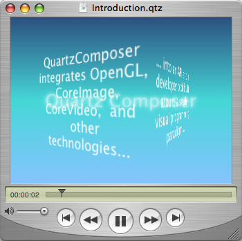
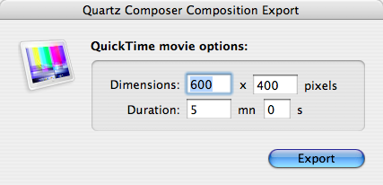
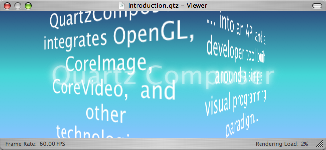
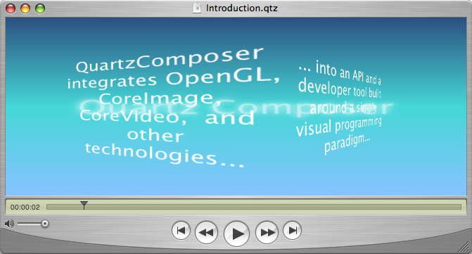
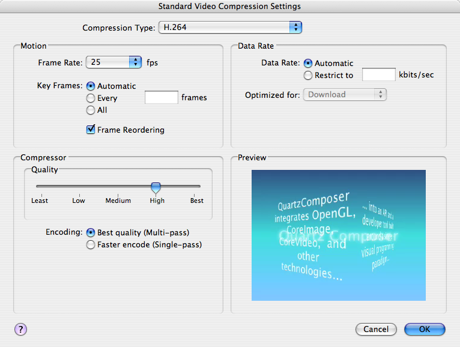

> 导航：[总目录](../../README.md) · [technotes](../../_indexes/technotes.md)


# Retired Document

__Important:__
This document may not represent best practices for current development. Links to downloads and other resources may no longer be valid.

Technical Note TN2145

# Efficiently using Quartz Composer compositions with QuickTime

__Important:__ This document may not represent best practices for current development. Links to downloads and other resources may no longer be valid.

Mac OS X 10.4 includes a new graphics technology called Quartz Composer, which can be used to create motion graphics animations based on OpenGL, Core Image, Core Video and more... Those animations are called "Quartz Composer compositions" and are stored in ".qtz" files.

QuickTime 7 on Mac OS X 10.4 natively supports these ".qtz" files. This means that any application that can manipulate QuickTime movies can potentially handle Quartz Composer compositions. It's just a matter of allowing users to select .qtz files in the open dialogs (and possibly to drag and drop them onto the application's icon as well).

[QuickTime 7 support for Quartz Composer](#apple-f4xwc4dqnrsv64tfmyxwi33df52wszbpirkfgmjqgaydgnzthawugsbrfvke4vcbi4ya)[Important differences with other forms of QuickTime media](#apple-f4xwc4dqnrsv64tfmyxwi33df52wszbpirkfgmjqgaydgnzthawugsbrfvke4vcbi4yq)[Quartz Composer contents renders though OpenGL](#apple-f4xwc4dqnrsv64tfmyxwi33df52wszbpirkfgmjqgaydgnzthawugsbrfvke4vcbi4za)[Quartz Composer contents is resolution independent](#apple-f4xwc4dqnrsv64tfmyxwi33df52wszbpirkfgmjqgaydgnzthawugsbrfvke4vcbi4zq)[Quartz Composer contents has no duration or frame rate](#apple-f4xwc4dqnrsv64tfmyxwi33df52wszbpirkfgmjqgaydgnzthawugsbrfvke4vcbi44q)[Document Revision History](#apple-f4xwc4dqnrsv64tfmyxwi33df52wszbpirkfgmjqgaydgnzthawvezlwnfzws33ojbuxg5dpoj4s2rdpnz2ey2lonncwyzlnmvxhiskel4yq)

## QuickTime 7 support for Quartz Composer

When opening a Quartz Composer composition with QuickTime, the result is a Movie that contains a "Quartz Composer" track of type 'qtz '. A Quartz Composer track contains the original data of the composition, not a rasterized version of it, and has the following characteristics:

- it is evaluated and rendered in real-time,
- it renders square pixels,
- it renders as progressive,
- its alpha channel is valid.

__Figure 1__  A Quartz Composer composition playing inside the QuickTime Player.



__Warning:__ A few features of Quartz Composer are not supported inside QuickTime:

- mouse and keyboard events,
- contents download from Internet (RSS feeds, images...),
- edition of the input parameters of the compositions.

[Back to Top](#)

## Important differences with other forms of QuickTime media

Quartz Composer compositions have special characteristics you should be aware of when using them through QuickTime, in order to preserve quality and performance:

- they render through OpenGL,
- they are resolution independent,
- they don't have defined durations or frame rates.

Each of the above points is explained in details in following sections:

### Quartz Composer contents renders though OpenGL

Quartz Composer back-end is implemented using OpenGL and renders directly on the display card for optimal performance. As a consequence, QuickDraw GWorld based QuickTime applications need to move to the new visual context and Core Video APIs to avoid a severe performance hit.

__Important:__ It's essential that your application switch to the new APIs introduced in QuickTime 7: QTKit for Cocoa applications (see [QuickTime Kit Programming Guide](https://developer.apple.com/documentation/QuickTime/index.html)) and HIMovieView for Carbon applications (see [QuickTime Reference Update](https://developer.apple.com/documentation/QuickTime/index.html)). These playback APIs use the new visual contexts instead of QuickDraw GWorlds and will improve QuickTime playback performance in general and especially in the case of Quartz Composer contents.

For the same reasons, if your application needs to render and perform operations on the movie frames, you should use visual contexts and Core Video buffers instead of QuickDraw GWorlds.

### Quartz Composer contents is resolution independent

Quartz Composer compositions do not inherently specify dimensions at which they are to be rendered. However, for compatibility with QuickTime, the Quartz Composer track must have specified dimensions. If the composition is exported as a QuickTime movie from the Quartz Composer application, users can specify a custom size in the export settings dialog. In most cases however, composition files will be imported through QuickTime into arbitrary applications and default dimensions of 640x480 are used.

__Figure 2__  The Quartz Composer QuickTime movie export dialog.



When rendering a QuickTime movie that has Quartz Composer track in a visual context (either directly or by using QTKit or HIMovieView), the track is always rendered at the final movie size and the initial track dimensions are ignored.

To ensure the best possible quality, it's important to render the QuickTime movie directly at the needed size (using `SetMovieBox` or `SetMovieMatrix` for example). Do not attempt to do any scaling yourself.

__Important:__ If the final rendering size does not have the same aspect ratio as the original track size (for example, if the Quartz Composer track is 640x480 and the movie is displayed at 1024x480), the resulting images will be distorted (non-uniform scaling) and not cropped (uniform scaling). This is expected QuickTime behavior, but is opposite to the way the Quartz Composer playback APIs QCView and QCRenderer behave.

__Figure 3__  Quartz Composer crops when changing a composition's aspect ratio



__Figure 4__  QuickTime distorts when changing a composition's aspect ratio



If you need to avoid any kind of non-uniform scaling or wish to have the Quartz Composer tracks have specific dimensions, you will have to specify custom values for the default dimensions (instead of 640x480). They can be changed globally or per-application using the "defaults" command line tool (units are pixels):

__Listing 1__  Setting the default Quartz Composer QuickTime tracks dimensions from the Terminal.

```
defaults write NSGlobalDomain QuartzComposerDefaultMovieWidth 1024
defaults write NSGlobalDomain QuartzComposerDefaultMovieHeight 768
```

__Note:__ Replace "NSGlobalDomain" with the bundle identifier of an application, like "com.apple.iMovie" to set defaults only for that application.

In the case of your own application, you do not need to use the "defaults" command line tool to set those defaults: just set them using the NSUserDefaults API for Cocoa applications (see [Application Kit Reference](https://developer.apple.com/documentation/Cocoa/index.html)), or the CFPreferences API for Carbon applications (see [Core Foundation Reference](https://developer.apple.com/documentation/CoreFoundation/index.html)). For example, you would add the following method to the application controller class of a Cocoa application to set the default dimensions at initialization time:

__Listing 2__  Setting the default Quartz Composer QuickTime tracks dimensions from inside the application.

```objc
+ (void) initialize
{
    NSUserDefaults*			defaults = [NSUserDefaults standardUserDefaults];

    [defaults setInt:[NSNumber numberWithInt:1024] forKey:@"QuartzComposerDefaultMovieWidth"];
    [defaults setInt:[NSNumber numberWithInt:768] forKey:@"QuartzComposerDefaultMovieHeight"];
}
```

### Quartz Composer contents has no duration or frame rate

Quartz Composer compositions do not specify a duration for which they are to be rendered. For compatibility with QuickTime however, the Quartz Composer track must have a duration. If the composition is exported as a QuickTime movie from the Quartz Composer application, users can specify a custom duration in the export settings dialog. In most cases however, composition files will be imported through QuickTime into arbitrary applications and a default duration of 30 seconds is used.

You can change the default track duration globally or per-application using the "defaults" command line tool (units are seconds):

__Listing 3__  Setting the default Quartz Composer QuickTime tracks duration from the Terminal.

```
defaults write NSGlobalDomain QuartzComposerDefaultMovieDuration 300
```

Quartz Composer compositions do not have a predefined framerate. When playing a QuickTime movie using the QTKit or HIMovieView, rendering of the Quartz Composer track is driven from the Core Video display link (see [Core Video Programming Guide](https://developer.apple.com/documentation/GraphicsImaging/index.html)), which runs at the screen refresh rate (60Hz or more). Unless limited by the complexity of the composition, the track will render as the rate of the Core Video display link.

For compatibility with QuickTime, the Quartz Composer track will return 1/30 increments when `GetNextInterestingTime` is called, even if the composition does not have a real framerate. This matters when rendering the Quartz Composer track into separate frames to be processed and reassembled.

An obvious example is to convert the movie to another format like DV using the QuickTime Player export capabilities. If the frame rate of the export format is different than 30, then QuickTime will need to do some pull-down conversion. This will likely affect the quality of the export.

__Important:__ Explicitly set the "Frame Rate" option of the QuickTime export dialog to the destination format frame rate (24 for cinema, 29.97 for NTSC, 25 for PAL and so on), as the default ("Current") will mean 30 frames per second.

__Figure 5__  The QuickTime Player export video settings dialog.



If you are rendering QuickTime movies frame by frame in your application and those movies contain enabled Quartz Composer tracks, you should ignore completely `GetNextInterestingTime` and ask QuickTime to render movie frames directly at the times you need.

__Listing 4__  Scanning a QuickTime movie for enabled Quartz Composer tracks.

```
Boolean HasEnabledQuartzComposerTracks(Movie movie)
{
    Track					track;

    track = GetMovieIndTrackType(movie, 1, 'qtz ',
            movieTrackMediaType | movieTrackEnabledOnly);

    return (track != NULL ? true : false);
}
```

__Warning:__ For compatibility reasons, a Quartz Composer track can render in a GWorld environment at the expense of performance. This is not recommended as the performace hit is severe.

The following limitations also apply:

- The track renders at its initial dimensions, whatever the final movie size, and QuickTime scales the rendered image as necessary. This behavior limits CPU processing usage, but can be turned off by setting the high-quality Movie playback hint.
- The track renders at 30 frames per second maximum to limit CPU processing usage.
[Back to Top](#)

---

#### Document Revision History

| __Date__ | __Notes__ |
| 2005-07-05 | Fixed HasQuartzComposerTracks() sample code not working correctly: it should scan for Quartz Composer tracks, not video tracks with samples using the Quartz Composer codec. |
| 2005-06-24 | New document that describes how to best use Quartz Composer compositions in a QuickTime environment. |

