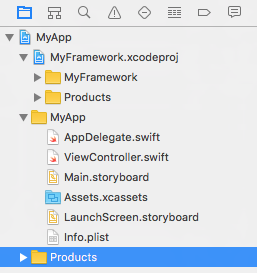
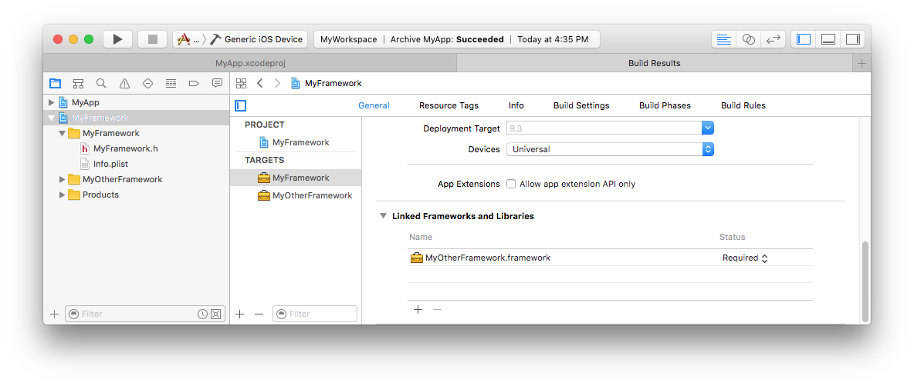
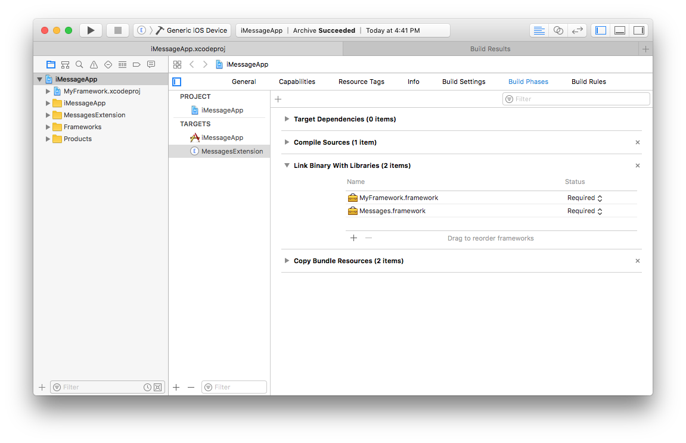
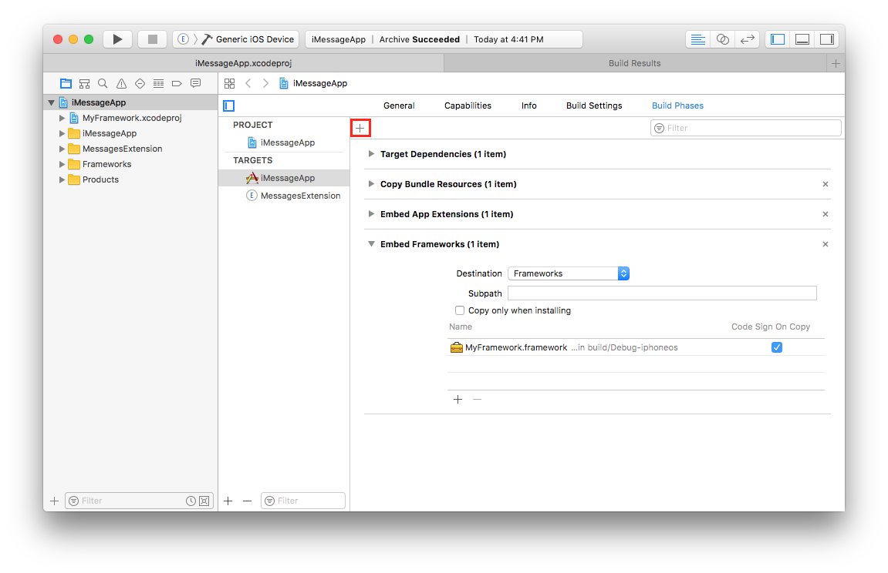
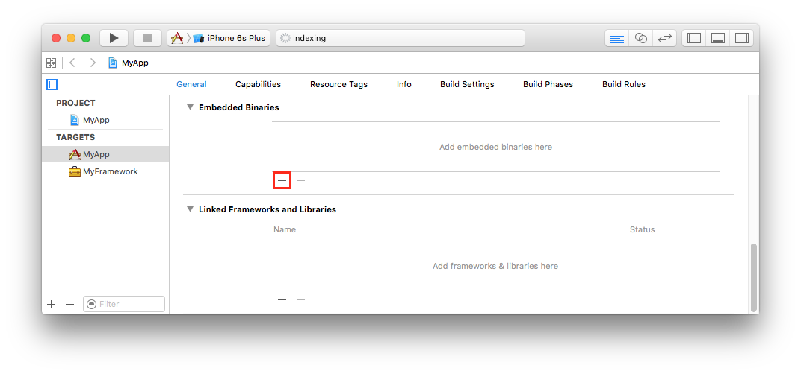
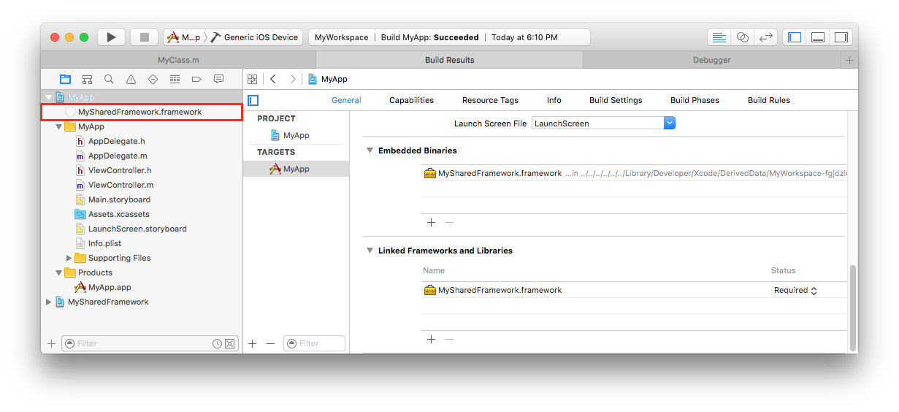

> 导航：[总目录](../../README.md) · [technotes](../../_indexes/technotes.md)


Technical Note TN2435

# Embedding Frameworks In An App

This tech note is for app developers on macOS, iOS, watchOS, and tvOS who are modularizing their code into frameworks. It demonstrates how to embed frameworks built as dependencies of an app for different project configurations. This tech note also provides troubleshooting steps for common issues encountered when embedding frameworks.

[What is a framework?](#apple-f4xwc4dqnrsv64tfmyxwi33df52wszbpirkfgnbqgaytonjugmwugsbrfvluqqkul5evgx2bl5dfeqknivlu6usll4)[Adding A Framework Target](#apple-f4xwc4dqnrsv64tfmyxwi33df52wszbpirkfgnbqgaytonjugmwugsbrfvauirc7izjectkfk5hves27kraver2fkq)[Configuring Your Project](#apple-f4xwc4dqnrsv64tfmyxwi33df52wszbpirkfgnbqgaytonjugmwugsbrfvifet2kl5bu6tsgjfdq)[Apps with One Xcode Project](#apple-f4xwc4dqnrsv64tfmyxwi33df52wszbpirkfgnbqgaytonjugmwugsbrfvifet2kl5bu6tsgjfds2qkqkbjv6v2jkref6t2oivpvqq2pircv6ucsj5fekq2u)[Apps with Multiple Xcode Projects](#apple-f4xwc4dqnrsv64tfmyxwi33df52wszbpirkfgnbqgaytonjugmwugsbrfvifet2kl5bu6tsgjfds2qkqkbjv6v2jkref6tkvjrkesucmivpvqq2pircv6ucsj5fekq2ukm)[Apps with an Xcode Workspace and Multiple Xcode Projects](#apple-f4xwc4dqnrsv64tfmyxwi33df52wszbpirkfgnbqgaytonjugmwugsbrfvifet2kl5bu6tsgjfds2qkqkbjv6v2jkref6qkol5megt2eivpvot2sjnjvaqkdivpuctsel5gvktcujfieyrk7lbbu6rcfl5ifet2kivbviuy)[Apps with Dependencies Between Frameworks](#apple-f4xwc4dqnrsv64tfmyxwi33df52wszbpirkfgnbqgaytonjugmwugsbrfvifet2kl5bu6tsgjfds2qkqkbjv6v2jkref6rcfkbcu4rcfjzbusrktl5bekvcxivcu4x2gkjau2rkxj5jewuy)[Embedding a Framework](#apple-f4xwc4dqnrsv64tfmyxwi33df52wszbpirkfgnbqgaytonjugmwugsbrfvcu2qsfirpvgrkdkreu6tq)[Embedding a Framework in an iMessage App](#apple-f4xwc4dqnrsv64tfmyxwi33df52wszbpirkfgnbqgaytonjugmwugsbrfvcu2qsfirpvgrkdkreu6trnivguerkeireu4r27ifpumusbjvcvot2sjnpusts7ifhf6sknivjvgqkhivpucucq)[Embedding a Framework in iOS, macOS, watchOS, and tvOS Apps](#apple-f4xwc4dqnrsv64tfmyxwi33df52wszbpirkfgnbqgaytonjugmwugsbrfvcu2qsfirpusts7ififax2tivbviskpjy)[Troubleshooting](#apple-f4xwc4dqnrsv64tfmyxwi33df52wszbpirkfgnbqgaytonjugmwugsbrfvkfet2vijgeku2ij5hviskoi4)[Configuration Errors](#apple-f4xwc4dqnrsv64tfmyxwi33df52wszbpirkfgnbqgaytonjugmwugsbrfvkfet2vijgeku2ij5hviskoi4wugt2oizeuovksifkest2ol5cveuspkjjq)[Bundle Errors](#apple-f4xwc4dqnrsv64tfmyxwi33df52wszbpirkfgnbqgaytonjugmwugsbrfvkfet2vijgeku2ij5hviskoi4wuevkoirgekx2fkjje6ust)[Document Revision History](#apple-f4xwc4dqnrsv64tfmyxwi33df52wszbpirkfgnbqgaytonjugmwvezlwnfzws33ojbuxg5dpoj4s2rdpnz2ey2lonncwyzlnmvxhiskel4yq)

## What is a framework?

A framework is a hierarchical directory that encapsulates a dynamic library, header files, and resources, such as storyboards, image files, and localized strings, into a single package. Apps using frameworks need to embed the framework in the app's bundle.

[Back to Top](#)

## Adding A Framework Target

Apps wishing to utilize frameworks to share code across different parts of their application, such as between an app and an app extension, need to start from the framework template appropriate for the app's target platform. The framework target can be added to the same project as the app target, or it can be added to a separate Xcode project.

1. Create a new Xcode target and select the framework template appropriate for your app's target platform.
2. Add all of the framework source files to the new target's Compile Sources build phase.
3. Set the visibility of header files needed by clients of the framework to Public.
4. Add the public headers to the umbrella header file. If your framework is named `YourFramework`, the umbrella header is named `YourFramework.h`.
5. Follow the steps in [Configuring Your Project](#apple-f4xwc4dqnrsv64tfmyxwi33df52wszbpirkfgnbqgaytonjugmwugsbrfvifet2kl5bu6tsgjfdq) to configure the new framework target as a dependency of the app target.

[Back to Top](#)

## Configuring Your Project

Before embedding a framework, set up your Xcode project so the app target depends on the framework target. The following sections describe how to set up this dependency for common project scenarios.

### Apps with One Xcode Project

Apps with one Xcode project containing an app target and a framework target can go on to the [Embedding a Framework](#apple-f4xwc4dqnrsv64tfmyxwi33df52wszbpirkfgnbqgaytonjugmwugsbrfvcu2qsfirpvgrkdkreu6tq) section.

### Apps with Multiple Xcode Projects

Apps not using an Xcode workspace that depend on a framework in a different Xcode project should configure the app project using these instructions:

1. Open the app’s Xcode project.
2. In Finder, locate the framework Xcode project. Drag this Xcode project from Finder to the Project Navigator, inside of the app project. This nests a reference to the framework project in the app project, as shown in Figure 1.
3. Follow the steps in [Embedding a Framework](#apple-f4xwc4dqnrsv64tfmyxwi33df52wszbpirkfgnbqgaytonjugmwugsbrfvcu2qsfirpvgrkdkreu6tq).

__Figure 1__  Framework project nested inside the app project



### Apps with an Xcode Workspace and Multiple Xcode Projects

Apps using an Xcode workspace that depend on a framework in a different Xcode project should configure the app project using these instructions:

1. Open the Xcode workspace.
2. Add each Xcode project to the workspace with File > Add Files to "Workspace Name."
3. Follow the steps in [Embedding a Framework](#apple-f4xwc4dqnrsv64tfmyxwi33df52wszbpirkfgnbqgaytonjugmwugsbrfvcu2qsfirpvgrkdkreu6tq).

### Apps with Dependencies Between Frameworks

An umbrella framework is a framework bundle that contains other frameworks. While it is possible to [create umbrella frameworks for macOS apps](https://developer.apple.com/library/mac/documentation/MacOSX/Conceptual/BPFrameworks/Concepts/FrameworkAnatomy.html#//apple_ref/doc/uid/20002253-97623-BAJJHAJC), doing so is unnecessary for most developers and is not recommended. Umbrella frameworks are not supported on iOS, watchOS, or tvOS.

In nearly all cases, you should include your code in a single, standard framework bundle. If your code is sufficiently modular, you can create multiple frameworks, where the dependencies between frameworks is minimal or nonexistent.

If your app has dependencies between frameworks, configure the dependency with these instructions:

1. In the framework target's General settings, add the frameworks it depends on to the Linked Frameworks and Libraries section, as shown in Figure 2.
2. In the app project, follow the instructions for [Embedding a Framework](#apple-f4xwc4dqnrsv64tfmyxwi33df52wszbpirkfgnbqgaytonjugmwugsbrfvcu2qsfirpvgrkdkreu6tq). The app target is responsible for embedding all of the frameworks, including any frameworks that other frameworks depend on.

__Figure 2__  A framework dependent on a second framework

[Back to Top](#)

## Embedding a Framework

The steps to embed a framework vary, depending on the type of app you are building. The following sections describe how to embed the framework inside the built app for the different types of apps.

### Embedding a Framework in an iMessage App

__Important:__ This section only applies to iMessage apps. For iOS apps providing an iMessage Extension, see [Embedding a Framework in iOS, macOS, watchOS, and tvOS Apps](#apple-f4xwc4dqnrsv64tfmyxwi33df52wszbpirkfgnbqgaytonjugmwugsbrfvcu2qsfirpusts7ififax2tivbviskpjy).

1. Open the iMessage app’s Xcode project or workspace.
2. Go to the Build Phases for the iMessage extension target.
3. Add the framework to the Link Binaries With Libraries list. See Figure 3.
4. Go to the Build Phases for the iMessage app target.
5. Add a New Copy Files Phase by selecting the Add icon, highlighted in Figure 4. Set the Destination field to Frameworks, and add the framework to the list. Ensure Code Sign on Copy is checked.

__Figure 3__  An iMessage extension linked to a framework



__Figure 4__  An iMessage app embedding a framework



### Embedding a Framework in iOS, macOS, watchOS, and tvOS Apps

1. Open the app’s Xcode project or workspace.
2. Go to the app target’s General configuration page.
3. Add the framework target to the Embedded Binaries section by clicking the Add icon, highlighted in Figure 5. Do not drag in the framework from Finder.
4. Select your framework from the list of binaries that can be embedded.

__Figure 5__  Click the Add button to embed a framework

[Back to Top](#)

## Troubleshooting

The following sections describe common errors when embedding frameworks, and steps for resolving each type of error.

### Configuration Errors

The following errors are caused by a project configuration that embeds a framework built for a build configuration that is different from the build configuration for the app.

```
error: <PathToFile>/<YourFrameworkName>.framework: No such file or directory
```

```
Failed to verify bitcode in <YourFrameworkName>.framework/<YourFrameworkName>:
error: Bundle only contains bitcode-marker <PathToExportedApp>
```

```
The path '/var/folders/<OtherPathComponents>/Packages/<YourApp>.ipa' does not contain a file.
```

```
ERROR ITMS-90086: Missing 64-bit support. Beginning on February 1, 2015 new iOS apps submitted to the App Store must include 64-bit support and be built with the iOS 8 SDK. Beginning June 1, 2015 app updates will also need to follow the same requirements. To enable 64-bit in your project, we recommend using the default Xcode build setting of “Standard architectures” to build a single binary with both 32-bit and 64-bit code.
```

```
ERROR ITMS-90203: Invalid architecture: Apps that include an app extension and framework must support arm64.
```

```
Invalid Bundle - This app includes files that were built with bitcode enabled but without doing an Archive or Install build, possibly from a library or framework that was imported but not built as part of the project. Full bitcode content is only generated in an Archive or Install build.
```

```
Dyld Message: Library not loaded: @rpath/<YourFrameworkName>.framework/<YourFrameworkName> + 0
```

```
Dyld Error Message:
  Library not loaded: @rpath/<YourFrameworkName>.framework/<YourFrameworkName>
  Referenced from: <PathToYourApp>
  Reason: no suitable image found. Did find:
    <PathToYourApp>/Frameworks/<YourFrameworkName>.framework/<YourFrameworkName>: mach-o, but wrong architecture
```

```
Dyld Error Message:
Dyld Message: Library not loaded: @rpath/<YourFrameworkName>.framework/<YourFrameworkName>
  Referenced from: <PathToYourApp>
  Reason: image not found
```

To fix any of these errors:

1. Open the Project Navigator.
2. Look for items referencing a framework that your app builds as a dependency that is not in the Products section. Figure 6 shows an example.
3. Delete this item from the Project Navigator. Select "Remove Reference" on the confirmation dialog.
4. Follow the steps in [Configuring Your Project](#apple-f4xwc4dqnrsv64tfmyxwi33df52wszbpirkfgnbqgaytonjugmwugsbrfvifet2kl5bu6tsgjfdq).

__Figure 6__  Framework reference in the Project Navigator that is not in the Products section



### Bundle Errors

#### Missing Framework Bundle

The following error indicates a framework is missing from the app bundle.

```
Invalid Bundle - One or more dynamic libraries that are referenced by your app are not present in the dylib search path.
Once these issues have been corrected, you can then redeliver the corrected binary.
```

To fix this error:

1. Follow the steps in [Inspecting A Binary's Linkage](#apple-f4xwc4dqnrsv64tfmyxwi33df52wszbpirkfgnbqgaytonjugmwugsbrfvkvgrk7j5ke6t2m).
2. In the results from the previous step, find the lines starting with `@rpath` that are not listed in the Embedded Binaries section in the app target's General settings.
3. Remove the frameworks identified in the previous step from the Linked Frameworks and Libraries section in the app target's General settings.
4. Embed the frameworks by following the steps in [Embedding a Framework](#apple-f4xwc4dqnrsv64tfmyxwi33df52wszbpirkfgnbqgaytonjugmwugsbrfvcu2qsfirpvgrkdkreu6tq).

#### Embedded .dylib Files

The following errors may indicate your app is embedding a dynamic library that is not packaged as a framework. Dynamic libraries outside of a framework bundle, which typically have the file extension `.dylib`, are not supported on iOS, watchOS, or tvOS, except for the system Swift libraries provided by Xcode.

```
Invalid Swift Support - The SwiftSupport folder is missing. Rebuild your app using the current public (GM) version of Xcode and resubmit it.
```

```
Invalid Swift Support - The files libswiftDarwin.dylib, libswiftDispatch.dylib, libswiftCoreGraphics.dylib, libswiftUIKit.dylib, libswiftCore.dylib, libswiftFoundation.dylib, libswiftQuartzCore.dylib, libswiftObjectiveC.dylib, libswiftCoreImage.dylib aren’t at the expected location /Payload/<YourApp.app>/Frameworks. Move the file to the expected location, rebuild your app using the current public (GM) version of Xcode, and resubmit it.
```

```
ERROR ITMS-90171: "Invalid Bundle Structure - The binary file '<YourApp>.app/<LibraryName>.dylib' is not permitted. Your app can’t contain standalone executables or libraries, other than the CFBundleExecutable of supported bundles.
```

To determine if the cause of these errors is due to having a dynamic library outside of framework:

1. In the Xcode Organizer, right click on the archive producing the error and select "Show In Finder."
2. Right click on the `.xcarchive` and select "Show Package Contents."
3. Navigate to the `Products/Applications` directory.
4. Open Terminal, and run the command in Listing 1. You can drag and drop the `.app` from Finder to Terminal to fill in the path.
5. Look for any file in the output whose name does not begin with `libSwift`.
6. Convert the library identified in the previous step to a framework by following the steps in [Adding A Framework Target](#apple-f4xwc4dqnrsv64tfmyxwi33df52wszbpirkfgnbqgaytonjugmwugsbrfvauirc7izjectkfk5hves27kraver2fkq).

__Note:__ The Invalid Swift Support errors shown here can also indicate a problem with how the app was archived. If you didn't find any dynamic libraries in the Terminal output above, consult the Xcode documentation for [submitting apps to the App Store](https://help.apple.com/xcode/mac/current/index.html?localePath=en.lproj#/dev067853c94) to ensure that you are using the correct archive process for the App Store.

__Listing 1__  Terminal command to find `.dylib` files

```
find <PathToArchive>/Products/Applications/<AppName>.app -name *.dylib -print
```

#### Embedded Static Libraries

The following error indicates your app embedded a static library.

```
Found an unexpected Mach-O header code: 0x72613c21
```

This is caused by placing a static library in a bundle structure that looks like a framework; this packaging is sometimes referred to by third party framework developers as a static framework. Since the binary in these situations is a static library, apps cannot embed it in the app bundle.

If you are building your own static library and using shell scripts to package it in a `.framework` directory, you need to migrate to building a framework with a dynamic library instead, as this is the correct way to build a framework. Static frameworks are not a supported way of sharing static libraries. To migrate to a framework using a dynamic library, consult [Adding A Framework Target](#apple-f4xwc4dqnrsv64tfmyxwi33df52wszbpirkfgnbqgaytonjugmwugsbrfvauirc7izjectkfk5hves27kraver2fkq).

If you use third party libraries that you do not build yourself, you can solve this error by identifying the static framework and removing it from the Embedded Binaries section.

1. Follow the steps in [Inspecting A Binary's Linkage](#apple-f4xwc4dqnrsv64tfmyxwi33df52wszbpirkfgnbqgaytonjugmwugsbrfvkvgrk7j5ke6t2m).
2. In the results from the previous step, compare the entries starting with `@rpath` in the Terminal output to the libraries listed in the Embedded Binaries section on the app target's General settings. Any library listed in the app target's General settings but not the Terminal output is likely the source of the problem.
3. Confirm each of the libraries identified in the previous step is a static library by running the command in Listing 2 in the Terminal. If the library is a static library, the output of the file command will look like Listing 3.
4. Once you've confirmed the library is static, go to the Build Phases for the app target in Xcode. Remove this library from any build phase named "Copy Files" or "Embed Frameworks." The library should remain in the "Link Binary with Libraries" section.

__Listing 2__  Terminal command to determine if a binary is a static library

```
file <PathToAppFramework>/<FrameworkName>.framework/<FrameworkName>
```

__Listing 3__  Example output for a static library

```
Mach-O universal binary with 2 architectures
<PathToLibrary> (for architecture armv7): current ar archive random library
<PathToLibrary> (for architecture arm64): current ar archive random library
```

#### Inspecting A Binary's Linkage

Some errors require inspecting a binary to see what libraries it is linked against, and comparing this information to the project setup in Xcode. Follow these steps to inspect the binary when directed to by specific troubleshooting sections, and use the results as indicated by that troubleshooting section.

1. In the Xcode Organizer, right click on the archive producing the error and select "Show In Finder."
2. Right click on the `.xcarchive` and select "Show Package Contents."
3. Navigate to the `Products/Applications` directory. Right click on the `.app` and select "Show Package Contents."
4. Find your app's binary, usually named the same as the app's target in Xcode. Open Terminal, and run the command in Listing 4. You can drag and drop the binary from Finder to the Terminal to fill in the path.
5. Repeat these steps for any app extensions or frameworks in your `.app`. Make sure to give the otool command the path to the binary, and not the outer `.framework` or `.appex` directory.

__Listing 4__  Terminal command to list all of the libraries dynamically linked to a binary

```
otool -L <PathToArchive>/Products/Applications/<AppName>.app/<AppBinary>
```

The output of this Terminal command lists all of the dynamic libraries a binary is linked against, for each architecture in the binary.

__Note:__ The system Swift libraries (libraries whose name starts with `libSwift`) will be listed in the Terminal output, but not in Embedded Binaries section of the app target's General settings. This is expected.

[Back to Top](#)

---

#### Document Revision History

| __Date__ | __Notes__ |
| 2017-03-14 | Added information for embedding frameworks in iMessage apps and expanded Troubleshooting section |
| 2016-09-13 | New document that demonstrates how to embed a framework for different project configurations, and how to troubleshoot common errors |

