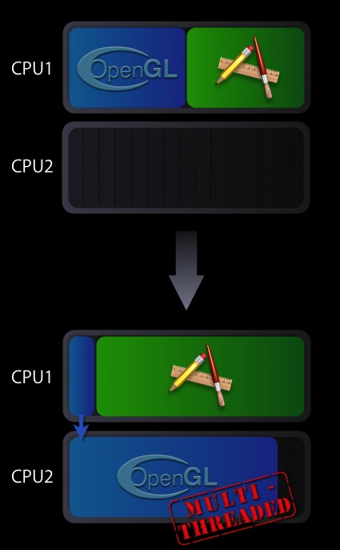

> 导航：[总目录](../../README.md) · [technotes](../../_indexes/technotes.md)


Technical Note TN2085

# Enabling multi-threaded execution of the OpenGL framework

OpenGL on Intel-based Macintosh systems can use multi-threading to increase the performance of CPU-bound OpenGL-based applications.

[Introduction](#apple-f4xwc4dqnrsv64tfmyxwi33df52wszbpirkfgmjqgaydimbxguwugsbrfvjukq2ujfhu4mi)[How it Works](#apple-f4xwc4dqnrsv64tfmyxwi33df52wszbpirkfgmjqgaydimbxguwugsbrfvjukq2ujfhu4mq)[Availability](#apple-f4xwc4dqnrsv64tfmyxwi33df52wszbpirkfgmjqgaydimbxguwugsbrfvjukq2ujfhu4my)[To Enable Multi-threaded OpenGL Execution:](#apple-f4xwc4dqnrsv64tfmyxwi33df52wszbpirkfgmjqgaydimbxguwugsbrfvjukq2ujfhu4na)[Is OpenGL Multi-threaded Execution Right for my Application?](#apple-f4xwc4dqnrsv64tfmyxwi33df52wszbpirkfgmjqgaydimbxguwugsbrfvjvkqstivbviskpjy2a)[Getting the best performance with OpenGL Multi-threaded execution:](#apple-f4xwc4dqnrsv64tfmyxwi33df52wszbpirkfgmjqgaydimbxguwugsbrfvjukq2ujfhu4nq)[See Also](#apple-f4xwc4dqnrsv64tfmyxwi33df52wszbpirkfgmjqgaydimbxguwugsbrfvjukq2ujfhu4ny)[Document Revision History](#apple-f4xwc4dqnrsv64tfmyxwi33df52wszbpirkfgmjqgaydimbxguwvezlwnfzws33ojbuxg5dpoj4s2rdpnz2ey2lonncwyzlnmvxhiskel4yq)

## Introduction

Maximizing your application’s OpenGL performance by threading your graphics code is technically challenging. OpenGL on Intel-based Macintosh systems can take advantage of Mac OS X’s multi-threading capabilities to execute parts of the OpenGL framework on a second thread. When used appropriately, this multi-threaded approach can increase the performance of CPU-bound OpenGL applications. This Tech Note describes requirements for multi-threaded OpenGL execution and how to enable it in your application.

[Back to Top](#)

## How it Works

When your application calls an OpenGL API, the underlying OpenGL framework spends cycles managing state and building instructions for the GPU. Normally this work shows up as time spent on your application’s main thread. As such, your application will be blocked waiting for the OpenGL framework to return.

If you enable multi-threaded OpenGL execution in your application, some of the execution time spent in the OpenGL framework is transferred to a second thread. The second thread will optimally run on one of the available CPU cores. Since part of the OpenGL framework’s workload has been parallelized, OpenGL calls will return control to your application sooner and more CPU cycles will be available for its main thread.

__Figure 1__  Default vs. multi-threaded execution of OpenGL



In the execution scenario shown in Figure 1, the main thread is left primarily with command submission duties, while the second thread is handling the more heavyweight task of the actual OpenGL command processing which involves the management of the GPU. This second thread has the advantage of having its own CPU core to execute on.

__Note:__ Many, but not all, applications will see a performance gain with multi-threaded execution enabled. Whether your application benefits depends on how you've written your OpenGL-based graphics code. Testing your application with the multi-threaded functionality enabled is the only accurate way to see what the performance benefit is, if any.

[Back to Top](#)

## Availability

Mac OS X 10.4.7 or later on Mac Pro Macintosh systems & 10.4.8-or later for other Intel-based Macintosh computers.

[Back to Top](#)

## To Enable Multi-threaded OpenGL Execution:

The CGL context parameter `kCGLCEMPEngine` is the constant you use to enable and disable multi-threaded execution. To enable it, pass the current CGL context along with this parameter to the function `CGLEnable`. To disable it, pass the current CGL context along with this parameter to the function `CGLDisable`. Listing 1 shows how to enable the multi-threaded execution.

The code calls the CGL function `CGLEnable` passing the current context and the context parameter `kCGLCEMPEngine`. Note the error checking. This is an important step because the OpenGL multi-threaded execution is not necessarily available on all computers that have multiple cores.

__Listing 1__  Enabling multi-threaded execution of OpenGL

```c
#include <OpenGL/OpenGL.h>  CGLError err = 0; CGLContextObj ctx = CGLGetCurrentContext();          // Enable the multi-threading err =  CGLEnable( ctx, kCGLCEMPEngine);          if (err != kCGLNoError ) {      // Multi-threaded execution is possibly not available      // Insert your code to take appropriate action }
```

__Note:__ Enabling or disabling multi-threaded execution causes OpenGL to flush the entire pipeline as well as incurring the overhead for setting up for the additional thread. As a result, you should enable or disable the multi-threaded OpenGL execution in an initialization or configuration function rather than in a drawing loop.

### Is OpenGL Multi-threaded Execution Right for my Application?

Enabling multi-threaded execution does not guarantee a performance increase for all applications. Your application most likely will not benefit if it:

- Is not limited by the speed or processing power of a single CPU
- Has plenty of time for all OpenGL operations
- Is fill limited by the GPU
- Frequently calls OpenGL functions that require synchronization. See section entitled “Getting the best performance with OpenGL multi-threaded execution”

Your application is likely to benefit if it:

- Is limited by the speed or processing power of a single CPU
- Doesn't require a lot of data synchronization or retrieval from OpenGL (`glGet`\*, `glPopAttrib`, `glFinish`, etc).

If your application is a candidate for using the OpenGL multi-threaded execution, please be aware of the following issues:

- Increased overhead during synchronization between the CPU and the GPU
- Increased memory usage, which might be significant for applications that use several OpenGL contexts

__Note:__ Enabling multi-threaded OpenGL execution does not make the OpenGL API thread safe. If you are drawing to a single OpenGL context from multiple threads, then your application code will need to manage locks and flushes to ensure correct visual results.

[Back to Top](#)

## Getting the best performance with OpenGL Multi-threaded execution:

To obtain the maximum performance with OpenGL multi-threaded execution, follow these guidelines:

- Avoid the use of `glGet` type calls, or any call that will cause a round trip to and from the GPU. (shadow OpenGL state, check errors only on debug builds, and so forth)
- Double buffer data to avoid stalls
- Use Vertex Buffer Objects (VBO) for vertex data.
- Use Pixel Bufffer Objects (PBO) for pixel data.

See OpenGL Programming Guide for Mac OS X for more details.

[Back to Top](#)

## See Also

For additional information, see "Improving Performance" in [OpenGL Programming Guide for Mac OS X](https://developer.apple.com/documentation/GraphicsImaging/Conceptual/OpenGL-MacProgGuide/). Although all the best practices tips in that chapter will help tune your application, the tips regarding asynchronous use of the CPU and GPU are especially relevant for any application using OpenGL multi-threaded execution.

The `CGLEnable` and `CGLDisable` calls are part of Core OpenGL or CGL for short. Please refer to the [CGL Reference Documentation](https://developer.apple.com/documentation/GraphicsImaging/Reference/CGL_OpenGL/index.html) for a more details.

[Back to Top](#)

---

#### Document Revision History

| __Date__ | __Notes__ |
| 2006-11-07 | New document that openGL on Intel-based Macintosh systems can use multi-threading to increase the performance of CPU-bound OpenGL-based applications. |

