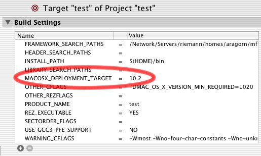

> 导航：[总目录](../../README.md) · [technotes](../../_indexes/technotes.md)


# Retired Document

__Important:__
This document may not represent best practices for current development. Links to downloads and other resources may no longer be valid.

Technical Note TN2064

# Ensuring Backwards Binary Compatibility - Weak Linking and Availability Macros on Mac OS X

__Important:__ This document may not represent best practices for current development. Links to downloads and other resources may no longer be valid.

This Technote describes how to ensure that a Mach-O application built against the latest version of Mac OS X can run effectively on older versions of Mac OS X, and what you should do if your application uses APIs that do not exist in the older version of Mac OS X.

The technologies Apple has provided for handling this include weak linking and Availability Macros.

This technote explains how these technologies work, their benefits and limits, and how to get started using them on Mac OS X. Read this technote if you are writing a Mach--O application and are concerned that APIs you use from today's OS will prevent your application from running properly on earlier versions of Mac OS X.

[Overview](#apple-f4xwc4dqnrsv64tfmyxwi33df52wszbpirkfgmjqgaydgmbzgiwugsbrfvhvmrkskzeukvy)[What's the Challenge Here?](#apple-f4xwc4dqnrsv64tfmyxwi33df52wszbpirkfgmjqgaydgmbzgiwugsbrfvjukq2ujfhu4mi)[(a) Application will not launch](#apple-f4xwc4dqnrsv64tfmyxwi33df52wszbpirkfgmjqgaydgmbzgiwugsbrfvjukq2ujfhu4mjnl5av6x2bkbieyskdifkest2ol5lustcml5he6vc7jravktsdja)[(b) Application crashes at some point during program execution](#apple-f4xwc4dqnrsv64tfmyxwi33df52wszbpirkfgmjqgaydgmbzgiwugsbrfvjukq2ujfhu4mjnl5bf6x2bkbieyskdifkest2ol5bveqktjbcvgx2bkrpvgt2nivpvat2jjzkf6rcvkjeu4r27kbje6r2sifgv6rkyivbvkvcjj5ha)[(c) Application runs but can't be prebound on older OS versions](#apple-f4xwc4dqnrsv64tfmyxwi33df52wszbpirkfgmjqgaydgmbzgiwugsbrfvjukq2ujfhu4mjnl5bv6x2bkbieyskdifkest2ol5jfktstl5bfkvc7inau4x2ul5bekx2qkjcuet2vjzcf6t2ol5huyrcfkjpu6u27kzcveu2jj5hfg)[Solution: Weak Linking](#apple-f4xwc4dqnrsv64tfmyxwi33df52wszbpirkfgmjqgaydgmbzgiwugsbrfvjukq2ujfhu4mq)[Solution: Availability Macros](#apple-f4xwc4dqnrsv64tfmyxwi33df52wszbpirkfgmjqgaydgmbzgiwugsbrfvjukq2ujfhu4my)[MAC_OS_X_VERSION_MIN_REQUIRED](#apple-f4xwc4dqnrsv64tfmyxwi33df52wszbpirkfgmjqgaydgmbzgiwugsbrfvjukq2ujfhu4mznjvaugx2pknpvqx2wivjfgskpjzpu2skol5jekukvjfjekra)[MAC_OS_X_VERSION_MAX_ALLOWED](#apple-f4xwc4dqnrsv64tfmyxwi33df52wszbpirkfgmjqgaydgmbzgiwugsbrfvjukq2ujfhu4mznjvaugx2pknpvqx2wivjfgskpjzpu2qkyl5auytcpk5cui)[One Usage](#apple-f4xwc4dqnrsv64tfmyxwi33df52wszbpirkfgmjqgaydgmbzgiwugsbrfvjukq2ujfhu4mznj5hekx2vknauori)[Fallback Solutions: Bundling and CFBundle](#apple-f4xwc4dqnrsv64tfmyxwi33df52wszbpirkfgmjqgaydgmbzgiwugsbrfvjukq2ujfhu4ni)[CFBundle](#apple-f4xwc4dqnrsv64tfmyxwi33df52wszbpirkfgmjqgaydgmbzgiwugsbrfvjukq2ujfhu4njnindeevkoirgek)[Bundling](#apple-f4xwc4dqnrsv64tfmyxwi33df52wszbpirkfgmjqgaydgmbzgiwugsbrfvjukq2ujfhu4njnijku4rcmjfheo)[Considerations and Issues as of the December 2002 Developer Tools/Headers](#apple-f4xwc4dqnrsv64tfmyxwi33df52wszbpirkfgmjqgaydgmbzgiwugsbrfvjukq2ujfhu4na)[References](#apple-f4xwc4dqnrsv64tfmyxwi33df52wszbpirkfgmjqgaydgmbzgiwugsbrfvjekrsfkjcu4q2fkm)[Document Revision History](#apple-f4xwc4dqnrsv64tfmyxwi33df52wszbpirkfgmjqgaydgmbzgiwvezlwnfzws33ojbuxg5dpoj4s2rdpnz2ey2lonncwyzlnmvxhiskel4yq)

## Overview

This technote describes the technical details of the weak linking and Availability Macros features on Mac OS X (Mac OS X 10.0.x will not be considered, but it works substantially the same as 10.1.x for the purposes of this technote). Before the discussion begins, however, here are a set of high level points summarizing where things stand as of Mac OS X 10.2.x and the December 2002 Mac OS X Developer Tools:

- If an application is designed to run on multiple Mac OS X versions and it uses symbols available only in later Mac OS X versions, the application should use weak linking. Otherwise, it will not launch on the earlier Mac OS X version that does not export all the symbols the application uses.
- Weak linking support was first added in Mac OS X version 10.2. Therefore, it cannot be used to help applications run on both 10.1.x and 10.2. There are some fallback approaches that can be used to help applications run on both 10.1.x and 10.2.
- Availability Macros have been introduced to help automatically take advantage of weak linking for Apple-provided APIs. Furthermore, they can help ensure that an application only uses the APIs available on developer-chosen OS version(s).
- Both weak linking and the Availability Macros are newly introduced technologies, and are works in progress. However, major improvements were made in the December 2002 Mac OS X Developer Tools. It is highly recommended that you use the December 2002 toolset if you want to use weak linking and the Availability Macros.
- Further improvements to weak linking support and the Availability Macros are coming - check back here periodically for updates on tools and OS support.

[Back to Top](#)

## What's the Challenge Here?

When writing a Mach-O application, you will often want to use new APIs introduced in the latest version of Mac OS X that did not exist in prior versions. However, if you do this and then attempt to run your application on an earlier version of the system, the program will (a) fail to launch, (b) crash at some point during program execution, or (c) run correctly but be unable to be prebound on earlier Mac OS X versions. Let's look at each case.

### (a) Application will not launch

When the linker (the program called "`ld`") links an application to the frameworks (such as Carbon or Cocoa) or libraries that the application uses, entries are made in the application binary. These entries reference both the frameworks the application links against, as well as the symbols (functions, global variables) that it uses from those frameworks. To see these entries, fire up Terminal and run `otool -l` on a binary. This will print the binary's load commands for you; many of the load commands will be of the form `LC_LOAD_DYLIB`, followed by the path to a shared library or framework that the application is linked against. Listing 1 shows a small part of the output of `otool -l`.

__Listing 1__  A snippet showing a load command from /usr/bin/perl - perl is linked against /usr/lib/libSystem.B.dylib

```
username% otool -l /usr/bin/perl
.
.
.
Load command 6
          cmd LC_LOAD_DYLIB
      cmdsize 52
         name /usr/lib/libSystem.B.dylib (offset 24)
   time stamp 1028942768 Fri Aug  9 18:26:08 2002
      current version 60.0.0
compatibility version 1.0.0
.
.
.
```

If you are not familiar with `otool`, see the manual page for more details. If a framework or shared library linked by the binary isn't present when the application launches (perhaps the framework is available on 10.2 but not 10.1 like AddressBook.framework), `dyld` (the dynamic loader) will fail to execute the application when it is launched.

__Listing 2__  What happens when you try to run an application and one of the frameworks it is linked against is missing - `dyld` gives an error (ENOENT = 2, from /usr/include/sys/errno.h)

```
username% ./test

dyld: ./test can't open library:
./MyFramework.framework/Versions/A/MyFramework (No such file or
directory, errno = 2)
```

A somewhat more common and slightly trickier case is when the framework itself is present at runtime, but some of the symbols the application is using are missing. For example, perhaps your application uses routines in Carbon.framework newly introduced in 10.2, which are not present at runtime on 10.1.x.

You can get a listing of which symbols an application is importing from other frameworks and libraries by running `nm -mg` on the binary (see the `nm` manual page for more details). Doing so will tell you how the symbols are referenced, and what libraries or frameworks they come from.

__Listing 3__  A snippet showing a partial listing of symbols imported by /usr/bin/perl

```
username% nm -mg /usr/bin/perl

900154a0 (prebound undefined [lazy bound]) external
_NSAddressOfSymbol (from libSystem)
90021440 (prebound undefined [lazy bound]) external
_NSCreateObjectFileImageFromFile (from libSystem)
.
.
.
a0ea736c (prebound undefined) [referenced dynamically] external
_PL_do_undump (from libperl)
a0ea8dcc (prebound undefined) [referenced dynamically] external
_PL_markstack_max (from libperl)
a0ea8dc8 (prebound undefined) [referenced dynamically] external
_PL_markstack_ptr (from libperl)
```

If a symbol the application uses is not present at launch time and the symbol is not lazily bound (discussed later), the application will fail to launch, even if the framework or shared library from which the symbol was linked is present. When this happens, `dyld` will list the symbols it failed to find, as shown in Listing 4.

__Listing 4__  What happens when you try to run an app and one of the symbols it imports (the `SayHello` function, in this case) is missing from the framework it is linked against

```
username% ./test

dyld: ./test Undefined symbols:
./test undefined reference to _SayHello expected to be defined in
MyFramework
```

### (b) Application crashes at some point during program execution

Non-variable symbols (i.e., functions) which do not need their memory addresses resolved immediately at launch time are marked by the linker as "lazy bound" (you can see an example of `nm` output showing lazy bound symbols in Listing 3). Such symbols are lazily bound to their source frameworks by `dyld` - it doesn't bind them until they are actually needed. If the need never arises, the symbol is never bound, and the application can run just fine even on an OS version that doesn't contain those symbols in its frameworks or libraries. If the symbol is ever referenced, the use of the function triggers a fixup call into `dyld`, where it then tries to resolve the symbol before execution jumps to the actual function in question. Typically, most functions are lazy bound; one somewhat common case, however, where a routine cannot be lazy bound is when its address is stored in a pointer. In that case, `dyld` can't be assured of having a chance to resolve the symbol address before it is executed so the function is non-lazy bound. Listing 5 is an example of some code that would produce both lazy and non-lazy bound symbols:

__Listing 5__  `InitCursor` will not be lazy bound, because the address of the function is copied to a pointer, beyond `dyld`'s ability to resolve it behind the scenes. `ObscureCursor`, however, will be lazy bound because `dyld` knows it can resolve the symbol the first time it is explicitly invoked.

```
void (*foobar)(void);

foobar=InitCursor; // This forces InitCursor to be non-lazy
foobar();

ObscureCursor(); // ObscureCursor will be lazy bound
```

The problem with lazy binding is that, depending on how you write your code, your application could be using symbols that do not exist in the target OS version, but you might not find that out without extensive testing. The the application will launch and run successfully when following some codepaths while crashing when following other codepaths (as `dyld` tries to resolve symbols that are reached in a given codepath). Availability Macros (described below) can help catch the use of newer symbols in your application, but it is still up to you to ensure proper conditionalization for all such symbols.

### (c) Application runs but can't be prebound on older OS versions

Another problem with applications that bind to missing symbols is that their prebinding will break (and can't be fixed) on OS versions that do not contain __all__ of the non-weak (described below) symbols (even lazy bound ones) that the application uses. Broken prebinding for your application typically means that it will take longer to launch. This means that lazy binding is not a good solution for conditionalizing the use of APIs that might not be present at runtime - even if you are careful to ensure that new APIs will never be called when the app is run on an older OS version.

[Back to Top](#)

## Solution: Weak Linking

The solution that Apple has developed to solve these problems is called weak linking. It works in a similar manner to the similarly named feature that [CFM](https://developer.apple.com/documentation/mac/PPCSoftware/PPCSoftware-40.html) (the Traditional Mac OS' Code Fragment Manager) had. Weak linking was introduced as a supported OS feature in Mac OS X version 10.2, and the first developer toolset to support weak linking is the July 2002 Developer Tools that shipped as a part of Mac OS X version 10.2. Here's how it works:

Weak linking allows you to link a symbol such that the symbol does not have to be present at runtime for the binary to continue running. Of course, your program can't actually try to use the symbol if it is non-existent, or it will crash. Instead, your code should check to see if the address of the symbol is NULL. If it is, then the symbol is not available, but if the address is a real address, then the symbol exists and can be used.

A symbol will be linked strongly unless you explicitly mark its prototype as weak. Typically this is done in the header containing the prototype for the routine, and is done by adding the `weak_import` attribute to the prototype (this attribute is supported by gcc 3.1 on Mac OS X, but not gcc 2.95). See the [documentation on the gcc web site](http://gcc.gnu.org/onlinedocs/gcc-3.2/gcc/Attribute-Syntax.html#Attribute%20Syntax) for more information about attributes.

__Listing 6__  The `SayHello` function will be weakly linked thanks to the use of the `weak_import` attribute on the prototype

```
extern int SayHello() __attribute__((weak_import));
```

Using the `weak_import` attribute tells the linker that the symbol should be linked weakly. However, weak linking as a feature did not exist in `ld` or `dyld` in Mac OS X versions prior to 10.2, so you have to explicitly enable it by setting an environment variable before compilation to tell linker that features can be used that were introduced starting in version 10.2. Listing 7 shows how you set this environment variable from within Terminal.

__Listing 7__  We need to tell the linker that it can feel free to use Mac OS X 10.2 linker features, including weak linking.

```
setenv MACOSX_DEPLOYMENT_TARGET 10.2
```

If the environment variable is not set to at least 10.2 (a value of 10.1 is assumed if you don't set it), you will see warnings like the following if you try to use the `weak_import` attribute:

__Listing 8__  Attempting to weak link will issue warnings if the `MACOSX_DEPLOYMENT_TARGET` isn't set to a high enough version

```
test.c:4: warning: weak_import attribute ignored when
MACOSX_DEPLOYMENT_TARGET environment variable is set to 10.1
```

The `MACOSX_DEPLOYMENT_TARGET` environment variable can now also be set in a target build setting in Project Builder, allowing you to enable weak linking from within that IDE.

__Figure 1__  Add a custom build setting to set the `MACOSX_DEPLOYMENT_TARGET` environment variable.



Assuming that the environment variable is set and the function prototype is properly marked with the `weak_import` attribute, compilation will cause `ld` to mark the symbol as weak in the final application. You may recall our use of the `nm` tool earlier to explore the symbols that a given application imports and how those symbols are referenced. If we use `nm -mg |grep frameworkname`, we can produce a list of all symbols we reference from a given framework and see whether they are marked weak in the binary or not.

__Listing 9__  Note the description of the `_SayHello` symbol (imported from `MyFramework` ) as weak

```
username% nm -mg test | grep MyFramework
         (undefined) weak external _SayHello (from MyFramework)
```

Once a binary has been built with symbols weakly linked, the existence of those symbols (and thus indirectly, features and APIs) can be checked for at runtime. For example:

__Listing 10__  A complete test program showing the test for the presence of the `SayHello` function at runtime

```c
#include <stdlib.h>
#include <stdio.h>

extern int SayHello() __attribute__((weak_import));

int main()
{
    int result;

    if (SayHello!=NULL)
    {
        printf("SayHello is present!\n");
        result=SayHello();
    }
    else
        printf("SayHello is not present!\n");
}
```

You might notice that this whole approach to weak linking assumes that one is weak linking individual symbols, not entire frameworks or libraries. This is in fact correct; ideally, one would not weak link more symbols than are needed, thus preserving the ability of `dyld` to flag missing symbols as early and completely as possible. However, in some cases it may truly be desirable to weak link an entire framework or shared library - allowing the framework as a whole, not just individual symbols it exports, to be missing at runtime. This is accomplished by the linker in this way: if all symbols that an application imports from a given framework are weakly linked, then the framework as a whole will be automatically marked weak in the application's load command where it loads that framework or shared library. Running `otool -l` on a binary (as was done in Listing 1) will show whether a framework as a whole is weakly linked or not.

__Listing 11__  A snippet showing a load command that weakly loads a framework - note the `LC_LOAD_WEAK_DYLIB`

```
username% otool -l test
.
.
.
Load command 5
          cmd LC_LOAD_WEAK_DYLIB
      cmdsize 72
         name ./MyFramework.framework/Versions/A/MyFramework
(offset 24)
   time stamp 3247416188 Wed Oct 21 05:34:52 1936
      current version 0.0.0
compatibility version 0.0.0
.
.
.
```

One problem that using a lot of weak linking brings up is how one knows which routines are available in a particular OS version. Wouldn't it be great if the Apple-provided system framework headers automatically configured themselves for the OS version you were writing to, and mark routines as weak appropriately? This is where the Availability Macros come in.

[Back to Top](#)

## Solution: Availability Macros

The Availability Macros are a set of macros was introduced in Mac OS X version 10.2 as a part of the July 2002 Developer Tools. They are contained in a header which is located at "/usr/include/AvailabilityMacros.h" on such a system. "AvailabilityMacros.h" helps you determine which OS versions introduced the APIs you are using, and tells the compiler which routines should be weakly linked. Over time, more and more of Apple's frameworks will be adopting the Availability Macros (the Carbon and Cocoa frameworks do to some degree today).

At its most basic level, "AvailabilityMacros.h" provides two compile-time variables (or macros) that you can set to determine how APIs are defined. Here is how things are supposed to work:

### MAC_OS_X_VERSION_MIN_REQUIRED

This macro can be set to a specific OS version (some macro predefines for OS versions are provided in the header), and allows you to specify the minimum OS version that your application will require in order to run. All APIs that use the Availability Macros are conditionalized for the OS version in which they were released, and thus APIs introduced in all OS versions up to and including the minimum OS version required will be strongly linked. "AvailabilityMacros.h" suggests that if `MAC_OS_X_VERSION_MIN_REQUIRED` is undefined, it will be set by default to 10.0. This is correct if `MACOSX_DEPLOYMENT_TARGET` is not set, but what the header doesn't tell you is that the compiler driver checks the `MACOSX_DEPLOYMENT_TARGET` environment variable, and sets the value of `MAC_OS_X_VERSION_MIN_REQUIRED` to be the same as the `MACOSX_DEPLOYMENT_TARGET` if `MACOSX_DEPLOYMENT_TARGET` is set.

### MAC_OS_X_VERSION_MAX_ALLOWED

This macro allows you to specify the maximum allowed OS version that your application can use APIs from. APIs that were first introduced in an OS version later than the maximum allowed will not be visible to the application. APIs introduced after the minimum required OS version, but before or in the maximum allowed OS version, will be weakly linked automatically. If no value is given to this macro, it will be set to the highest major OS version that Availability Macros is aware of (10.2 as of this writing).

### One Usage

One common usage of these macros would be to temporarily set `MAC_OS_X_VERSION_MAX_ALLOWED` to be equal to `MAC_OS_X_VERSION_MIN_REQUIRED` and rebuild one's application to see which APIs are being used that are not present in the minimum required OS version (compilation will produce errors for each usage of the now suddenly unavailable routines). For example, `MAC_OS_X_VERSION_MIN_REQUIRED` might be set to 10.1 (represented as 1010 to the compiler) and `MAC_OS_X_VERSION_MAX_ALLOWED` would be set to 10.1 as well, to see which APIs are being used that were introduced in, say, 10.2. This usage now works for users of both the Cocoa and Carbon frameworks, as of the December 2002 Developer Tools.

[Back to Top](#)

## Fallback Solutions: Bundling and CFBundle

If you need to use APIs introduced in 10.2 in an application that must run on 10.1.x, weak linking is not an option, because it was introduced in Mac OS X version 10.2. So what can be done for this particular OS version transition? There are two main solutions, somewhat similar to each other, for doing what is essentially "manual weak linking" in an application.

### CFBundle

`CFBundle` includes APIs such as `CFBundleGetFunctionPointerForName` that can be used to manually load a function pointer or symbol from a bundle (a framework is a valid bundle). Combined with checks for system version and feature availability, using `CFBundle` can be a good way of conditionally loading newly introduced symbols, and calling them if they exist. The [CallMachOFramework code sample](https://developer.apple.com/samplecode/Sample_Code/Runtime_Architecture/CallMachOFramework.htm) shows an example of using this routine in the context of loading Mach-O symbols in a CFM application, and the [CFBundle documentation](https://developer.apple.com/documentation/CoreFoundation/BundleServices/Bundle_Services_Concepts/Concepts/CFBundle-21.html) provides another good example of this technique.

### Bundling

The above approach, using `CFBundleGetFunctionPointerForName`, is good when only a few symbols are needed. It can be laborious, however, to manually load each symbol directly from the system frameworks if a lot of newly introduced symbols are needed, such as when you adopt a new area of functionality like the AddressBook API. In this situation, the best approach would be to isolate the area of functionality in its own bundle, which is linked directly to the 10.2 system frameworks and has only a few main entry points, and then only load the bundle (using `CFBundle`) if the application is running on 10.2 or higher. Within the bundle, the 10.2-specific APIs can be used freely and directly, because the application loading the bundle would have already determined that the new APIs were present.

[Back to Top](#)

## Considerations and Issues as of the December 2002 Developer Tools/Headers

The implementation of weak linking and Availability Macros today in Mac OS X 10.2 and the December 2002 Developer Tools is a first cut at the functionality. Significant improvements have been made over the July 2002 Developer tools in the December 2002 Developer Tools, and further improvements will be made over time. Here are some of the current considerations, issues, and workarounds with these technologies:

- One good thing about Objective-C is that its runtime is sufficiently dynamic that it doesn't suffer from the strong linking/binary compatibility issues that weak linking was designed to solve for other languages like C and C++. That is, as long as an application checks for their existence at runtime and avoids their use as appropriate, it can go ahead and use newly introduced Objective-C methods and classes and the application will still run on earlier version of Mac OS X that do not have the new symbols. Note, however, that Cocoa currently does not automatically weakly link straight C functions, even ones introduced after `MAC_OS_X_VERSION_MIN_REQUIRED` and before or in MAC_OS_X_VERSOIN_MAX_ALLOWED (r. 3151928).
- Weak linking is only supported by `dyld` in Mac OS X version 10.2 and up. So it cannot be used in applications that need to run on 10.1.x. Weakly linked symbols will be seen as strongly linked symbols on 10.1.x, and weakly linked frameworks or shared libraries will cause the application to crash at launch on 10.1.x.
- There is a known bug in the December 2002 Mac OS X Developer Tools where if you link against a framework or shared library from which you use no symbols (call it library A), but you link against and use symbols from another library (call it library B) that does use symbols from library A, then the linker will attempt to weakly link library A. But if your `MACOSX_DEPLOYMENT_TARGET` isn't set to 10.2 or higher, this will fail (as it should) because earlier OS versions don't support weak linking, and thus a warning will be generated. The warning will be of the form, "`ld`: warning dynamic shared library: /usr/lib/libSystem.dylib not made weak library in output with `MACOSX_DEPLOYMENT_TARGET` environment variable set to: 10.1". This bug should be fixed in the next major version of the Mac OS X Developer Tools (r. 3094497). In the meantime, to get rid of the warnings you can either set the `MACOSX_DEPLOYMENT_TARGET` to 10.2, or make a spurious call into the library to use a symbol from it and get the linker to strongly link it.

There is no obvious way to set the `MACOSX_DEPLOYMENT_TARGET,` `MAC_OS_X_VERSION_MIN_REQUIRED,` and `MAC_OS_X_VERSION_MAX_ALLOWED` settings on a per project basis, if you are using cpp-precomp for precompiled header processing (the default choice in the July 2002 Developer Tools and prior) instead of the new Persistent Front End (PFE) mechanism for precompiled headers (the default choice for new projects in the December 2002 Developer Tools). This is because there is a single system-wide copy of the framework precompiled headers that already assumes values for these defines. Redefining these settings in your project will break the precompiled headers, and compile times will greatly increase (along with lots of warnings being generated). There are two ways to fix this.

- Use the new Persistent Front End (PFE) mechanism for precompiled headers on a per project basis. You can do this using the Build Settings pane in the Targets tab of your project.
- Rebuild (as needed) your system's precompiled headers with the appropriate settings defined before building any project that needs those settings. cpp-precomp's precompiled headers can be rebuilt using the `fixPrecomps` command from the command line, as shown in Listing 12.

__Listing 12__  A snippet showing the setting of weak linking and Availability Macros flags and the rebuilding of cpp-precomp's precompiled headers

```
username% setenv MACOSX_DEPLOYMENT_TARGET 10.1
username% sudo fixPrecomps -force -precompFlags
-DMAC_OS_X_VERSION_MIN_REQUIRED=1010
-DMAC_OS_X_VERSION_MAX_ALLOWED=1010

reading /System/Library/SystemResources/PrecompLists/phase1.precompList
reading /System/Library/SystemResources/PrecompLists/phase2.precompList
-force rebuild /usr/include/libc.p.
/usr/bin/gcc3 -precomp -x objective-c /usr/include/libc.h -o
/usr/include/libc-gcc3.p -DMAC_OS_X_VERSION_MIN_REQUIRED=1010
-DMAC_OS_X_VERSION_MAX_ALLOWED=1010
.
.
.
```

[Back to Top](#)

## References

- Mac OS X version 10.2 `ld`, `dyld`, `nm`, and `otool` manual pages
- [Using the GNU Compiler Collection (GCC)](http://gcc.gnu.org/onlinedocs/gcc-3.2/gcc/Attribute-Syntax.html#Attribute%20Syntax) GNU document on Attribute Syntax Copyright 2002 by the Free Software Foundation, retrieved 11/19/2002
- DTS sample code [CallMachOFramework](https://developer.apple.com/samplecode/Sample_Code/Runtime_Architecture/CallMachOFramework.htm)
- Apple Computer, Inc., [CFBundle Documentation](https://developer.apple.com/documentation/CoreFoundation/BundleServices/Bundle_Services_Concepts/Concepts/CFBundle-21.html), retrieved 11/19/2002.

[Back to Top](#)

---

#### Document Revision History

| __Date__ | __Notes__ |
| 2003-02-18 | Ensuring that Mach-O applications built using today's Mac OS X runs on previous versions of the OS. |
| 2003-01-21 | New document that ensuring that Mach-O applications built using today's Mac OS X runs on previous versions of the OS. |

