> 导航：[总目录](../../README.md) · [technotes](../../_indexes/technotes.md)


Technical Note TN2415

# Entitlements Troubleshooting

Use this document to troubleshoot entitlement related problems that can occur during an Xcode build, app installation or submission.

[Introduction](#apple-f4xwc4dqnrsv64tfmyxwi33df52wszbpirkfgnbqgaytmnbsg4wugsbrfveu4vcsj5cfkq2ujfhu4)[Scope](#apple-f4xwc4dqnrsv64tfmyxwi33df52wszbpirkfgnbqgaytmnbsg4wugsbrfveu4vcsj5cfkq2ujfhu4lktinhvari)[Definition](#apple-f4xwc4dqnrsv64tfmyxwi33df52wszbpirkfgnbqgaytmnbsg4wugsbrfveu4vcsj5cfkq2ujfhu4lkeivdestsjkreu6tq)[Example Errors](#apple-f4xwc4dqnrsv64tfmyxwi33df52wszbpirkfgnbqgaytmnbsg4wugsbrfveu4vcsj5cfkq2ujfhu4lkflbau2ucmivpukussj5jfg)[Troubleshooting Process](#apple-f4xwc4dqnrsv64tfmyxwi33df52wszbpirkfgnbqgaytmnbsg4wugsbrfvkfa)[Entitlements Overview Diagram](#apple-f4xwc4dqnrsv64tfmyxwi33df52wszbpirkfgnbqgaytmnbsg4wugsbrfvkfalkfjzkesvcmivguktsuknpu6vsfkjlesrkxl5cesqkhkjau2)[Target Capabilities](#apple-f4xwc4dqnrsv64tfmyxwi33df52wszbpirkfgnbqgaytmnbsg4wugsbrfvkecushivkegqkqifbestcjkreukuy)[App ID Services](#apple-f4xwc4dqnrsv64tfmyxwi33df52wszbpirkfgnbqgaytmnbsg4wugsbrfvavaucjirjukuswjfbukuy)[Provisioning Profile is created on the website](#apple-f4xwc4dqnrsv64tfmyxwi33df52wszbpirkfgnbqgaytmnbsg4wugsbrfvbverkbkrcvauspizeuyri)[Website provisioning profile library](#apple-f4xwc4dqnrsv64tfmyxwi33df52wszbpirkfgnbqgaytmnbsg4wugsbrfvlukqstjfkekucsj5destcfjreueusbkjmq)[Inspecting a profile's entitlements](#apple-f4xwc4dqnrsv64tfmyxwi33df52wszbpirkfgnbqgaytmnbsg4wugsbrfvifet2gjfgeku2fjzkesvcmivguktsukm)[Installing the profile in Xcode](#apple-f4xwc4dqnrsv64tfmyxwi33df52wszbpirkfgnbqgaytmnbsg4wugsbrfveu4u2uifgeyucsj5destcf)[Xcode's local provisioning profile library](#apple-f4xwc4dqnrsv64tfmyxwi33df52wszbpirkfgnbqgaytmnbsg4wugsbrfvifet2gjfgektcjijjecusz)[Xcode must be configured to choose the code signing profile on your behalf](#apple-f4xwc4dqnrsv64tfmyxwi33df52wszbpirkfgnbqgaytmnbsg4wugsbrfvavkvcpjvaviskdkbje6vsjkneu6tsjjzdq)[View the chosen profile in the build log](#apple-f4xwc4dqnrsv64tfmyxwi33df52wszbpirkfgnbqgaytmnbsg4wugsbrfvbuqt2tivhfauspizeuyri)[Inspect the entitlements of a built app](#apple-f4xwc4dqnrsv64tfmyxwi33df52wszbpirkfgnbqgaytmnbsg4wugsbrfvavaucfjzkesvcmivguktsukm)[App entitlements are validated by the OS during an install or launch](#apple-f4xwc4dqnrsv64tfmyxwi33df52wszbpirkfgnbqgaytmnbsg4wugsbrfvhvgvsbjreuiqkujfhu4)[Inspecting distribution build entitlements while submitting an app in Xcode](#apple-f4xwc4dqnrsv64tfmyxwi33df52wszbpirkfgnbqgaytmnbsg4wugsbrfvkfalkjjzjvarkdkreu4r27irevgvcsjfbfkvcjj5hf6qsvjfgeix2fjzkesvcmivguktsuknpvoscjjrcv6u2vijgusvcujfheox2bjzpucucql5eu4x2yinhuiri)[Code Signing Entitlements files](#apple-f4xwc4dqnrsv64tfmyxwi33df52wszbpirkfgnbqgaytmnbsg4wugsbrfvcu4vcjkrgektkfjzkfgrsjjrcq)[Supporting Information](#apple-f4xwc4dqnrsv64tfmyxwi33df52wszbpirkfgnbqgaytmnbsg4wugsbrfvjvkucqj5jfiskoi5pustsgj5je2qkujfhu4)[List of Entitlements](#apple-f4xwc4dqnrsv64tfmyxwi33df52wszbpirkfgnbqgaytmnbsg4wugsbrfvcu4vcjkrgektkfjzkfgtcjknka)[Entitlement Sources](#apple-f4xwc4dqnrsv64tfmyxwi33df52wszbpirkfgnbqgaytmnbsg4wugsbrfvju6vksincvg)[Entitlement Destinations](#apple-f4xwc4dqnrsv64tfmyxwi33df52wszbpirkfgnbqgaytmnbsg4wugsbrfvceku2ujfhecvcjj5hfg)[App ID Prefix Mismatching](#apple-f4xwc4dqnrsv64tfmyxwi33df52wszbpirkfgnbqgaytmnbsg4wugsbrfviferkgjfme2sktjvaviq2i)[Document Revision History](#apple-f4xwc4dqnrsv64tfmyxwi33df52wszbpirkfgnbqgaytmnbsg4wvezlwnfzws33ojbuxg5dpoj4s2rdpnz2ey2lonncwyzlnmvxhiskel4yq)

## Introduction

### Scope

This document is for app developers who are experiencing entitlement related issues with their app. This material does not intend to provide an exhaustive list of possible errors, nor does it provide specific solutions to individual errors. Instead, the troubleshooting strategy is the same for all errors by providing a high level understanding of the entire entitlements process along with all areas you can check at each phase. By stepping through the whole workflow and double checking entitlements along the way, it is normally enough to resolve entitlement related issues that can occur with your app.

### Definition

An Entitlement can be thought of as the string written into an app's signature that allows a specific capability or opts the app into a specific service. The operating system (OS) checks these strings before allowing an app access to certain features. For example, an app must have the iCloud entitlement before it is allowed to access iCloud APIs at runtime. The OS enforces that by checking the app for an iCloud entitlement such as the following:

```
<key>com.apple.developer.ubiquity-kvstore-identifier</key>
<string>4ZX4Z3MVHG.com.appleseedinc.MyGreatApp</string>
```

__Note:__ Other services that require entitlements are Push Notification, Health Kit, Home Kit, and others.

### Example Errors

The following are a few example entitlement related errors:

__Entitlements mismatch error__

```
The executable was signed with invalid entitlements. The entitlements specified in your application's Code Signing Entitlements file do not match those specified in your provisioning profile.
```

__Installation error__

```
Could not install the application. Your code signing/provisioning profiles are not correctly configured ... you have an entitlement not supported by your current provisioning profile ... (error: 0xe8008016).
```

__Submission error__

```
Invalid Code Signing Entitlements. The entitlements in your app bundle
signature do not match the ones that are contained in the provisioning
profile. According to the provisioning profile, the bundle contains a key value
that is not allowed: '[ A1B2C3D4E5.com.appleseedinc.MyGreatApp ]' for the key
"keychain-access-groups" in "Payload/MyGreatApp.app/MyGreatApp"
```

__Invalid values error__

```
entitlement 'keychain-access-groups' has value not permitted by a provisioning profile
```

To resolve entitlement errors like these, follow the ordered steps given in section: [Troubleshooting Process](#apple-f4xwc4dqnrsv64tfmyxwi33df52wszbpirkfgnbqgaytmnbsg4wugsbrfvkfa).

[Back to Top](#)

## Troubleshooting Process

Begin troubleshooting entitlement errors by working through the complete process. Start with the first step that entitlements are introduced, and trace them to their final destination on the app's signature and embedded provisioning profile. While checking entitlements at various phases during this process the entitlement anomaly will be visible, and in most cases, a solution can be inferred depending on the context of the observation.

### Entitlements Overview Diagram

__Figure 1__  Overview of the entitlements process.

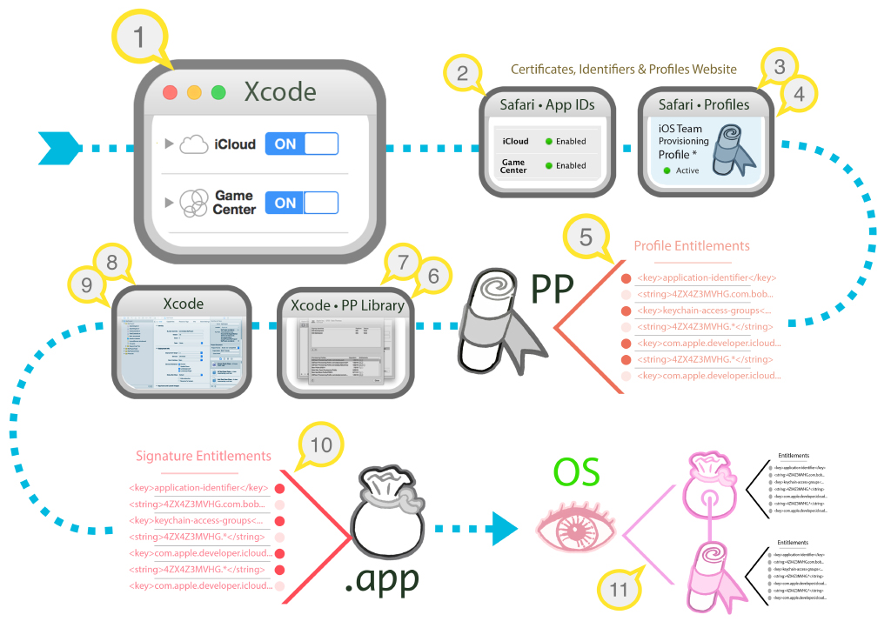

__Figure 1__ Legend:

1. [Target Capabilities](#apple-f4xwc4dqnrsv64tfmyxwi33df52wszbpirkfgnbqgaytmnbsg4wugsbrfvkecushivkegqkqifbestcjkreukuy)
2. [App ID Services](#apple-f4xwc4dqnrsv64tfmyxwi33df52wszbpirkfgnbqgaytmnbsg4wugsbrfvavaucjirjukuswjfbukuy)
3. [Provisioning Profile is created on the website](#apple-f4xwc4dqnrsv64tfmyxwi33df52wszbpirkfgnbqgaytmnbsg4wugsbrfvbverkbkrcvauspizeuyri)
4. [Website provisioning profile library](#apple-f4xwc4dqnrsv64tfmyxwi33df52wszbpirkfgnbqgaytmnbsg4wugsbrfvlukqstjfkekucsj5destcfjreueusbkjmq)
5. [Inspecting a profile's entitlements](#apple-f4xwc4dqnrsv64tfmyxwi33df52wszbpirkfgnbqgaytmnbsg4wugsbrfvifet2gjfgeku2fjzkesvcmivguktsukm)
6. [Installing the profile in Xcode](#apple-f4xwc4dqnrsv64tfmyxwi33df52wszbpirkfgnbqgaytmnbsg4wugsbrfveu4u2uifgeyucsj5destcf)
7. [Xcode's local provisioning profile library](#apple-f4xwc4dqnrsv64tfmyxwi33df52wszbpirkfgnbqgaytmnbsg4wugsbrfvifet2gjfgektcjijjecusz)
8. [Xcode must be configured to choose the code signing profile on your behalf](#apple-f4xwc4dqnrsv64tfmyxwi33df52wszbpirkfgnbqgaytmnbsg4wugsbrfvavkvcpjvaviskdkbje6vsjkneu6tsjjzdq)
9. [View the chosen profile in the build log](#apple-f4xwc4dqnrsv64tfmyxwi33df52wszbpirkfgnbqgaytmnbsg4wugsbrfvbuqt2tivhfauspizeuyri)
10. [Inspect the entitlements of a built app](#apple-f4xwc4dqnrsv64tfmyxwi33df52wszbpirkfgnbqgaytmnbsg4wugsbrfvavaucfjzkesvcmivguktsukm)
11. [App entitlements are validated by the OS during an install or launch](#apple-f4xwc4dqnrsv64tfmyxwi33df52wszbpirkfgnbqgaytmnbsg4wugsbrfvhvgvsbjreuiqkujfhu4)

__Note:__ __PP__ = Provisioning Profile • __.app__ = the built app bundle • __OS__ = Operating System

### Target Capabilities

The first location that entitlements are introduced into your app is in Xcode's target Capabilities tab.



__Figure 2__  The target Capabilities tab.

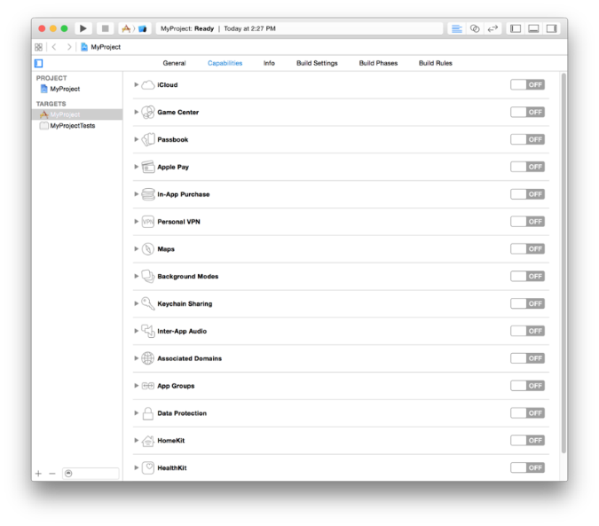

Toggling a target capability causes Xcode to do the following:

1. Xcode creates or updates an entitlements file, if it is necessary, that contains the capability's corresponding entitlement(s).
2. Xcode registers the project's Bundle ID as an App ID on the [Identifiers](https://developer.apple.com/account/ios/identifiers/bundle/bundleList.action) section of the [Certificates, ID's and Profiles](https://developer.apple.com/account/overview.action) website, if it doesn't already exist.
3. Xcode enables (or disables) the corresponding service on your app's App ID. This change is also reflected in the [Identifiers](https://developer.apple.com/account/ios/identifiers/bundle/bundleList.action) section of the [Certificates, ID's and Profiles](https://developer.apple.com/account/overview.action) website.
4. Xcode generates (or updates) a provisioning profile that includes the proper set of entitlements required to support the target's currently enabled capabilities. The generated provisioning profile can be seen in the [Website provisioning profile library](#apple-f4xwc4dqnrsv64tfmyxwi33df52wszbpirkfgnbqgaytmnbsg4wugsbrfvlukqstjfkekucsj5destcfjreueusbkjmq) of [Certificates, ID's and Profiles](https://developer.apple.com/account/overview.action).
5. Xcode downloads and installs the profile into [Xcode's local provisioning profile library](#apple-f4xwc4dqnrsv64tfmyxwi33df52wszbpirkfgnbqgaytmnbsg4wugsbrfvifet2gjfgektcjijjecusz) so it can be used for code signing.

__Figure 3__  Shows enabled target capabilities in Xcode.

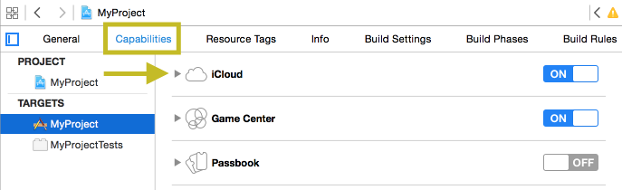

Relevant notes on Capabilities and their corresponding entitlements:

- Though most do, not all capabilities require an entitlement.
- There are more possible entitlements than those which result from enabling capabilities on the target Capabilities tab in Xcode. See the following sections for these types of entitlements: [Code Signing Entitlements files](#apple-f4xwc4dqnrsv64tfmyxwi33df52wszbpirkfgnbqgaytmnbsg4wugsbrfvcu4vcjkrgektkfjzkfgrsjjrcq) and [List of Entitlements](#apple-f4xwc4dqnrsv64tfmyxwi33df52wszbpirkfgnbqgaytmnbsg4wugsbrfvcu4vcjkrgektkfjzkfgtcjknka).

__Things that can go wrong:__

- Xcode uses web services to communicate with the [Certificates, ID's and Profiles](https://developer.apple.com/account/overview.action) website which requires you to have an internet connection to complete capability configuration changes.
- An Admin or Agent team role is required because capability changes require modification of App ID's. Log into Xcode with a team member with Admin privileges in the Preferences menu > Accounts tab.
- If instead you are a team member role, Xcode will highlight in red any privilege related issues next to the capability you attempt to enable. At that point you must request that a team Admin effect the requested capability changes either in Xcode or directly in the [Certificates, ID's and Profiles](https://developer.apple.com/account/overview.action) website. Once that's done, the member role should:

  - Refresh the target capabilities pane. The red items will turn black which indicates Xcode recognizes that the capabilities are now enabled.
  - Refresh provisioning profiles in [Xcode's local provisioning profile library](#apple-f4xwc4dqnrsv64tfmyxwi33df52wszbpirkfgnbqgaytmnbsg4wugsbrfvifet2gjfgektcjijjecusz) using the "⟳" button. This will download the updated provisioning profile(s) that reflect the capability change and allow you to test the capabilities on a device.

### App ID Services

Target Capabilities in Xcode map to Services that are configured for your app's App ID on Certificates, IDs & Profiles:

__Figure 4__  An App ID's enabled services on Certificates, IDs & Profiles.

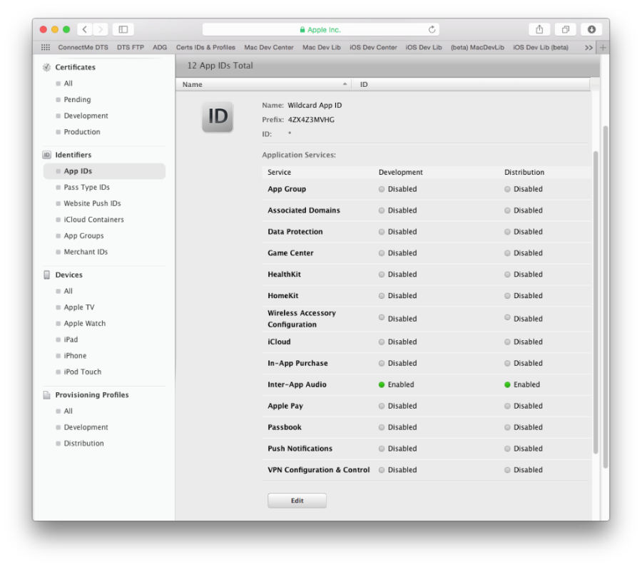

__Figure 5__  Shows an enabled App ID service.

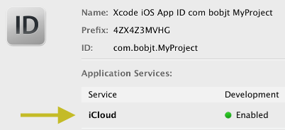

A few notes on App IDs and their entitlements:

- Xcode's use of the term Capabilities is synonymous with the website's use of the term Services.
- There is a one-to-one mapping between capabilities seen in Xcode and its corresponding Service on the website.
- All of the Services listed on the Identifiers section of the website are reserved for App Store apps. Enterprise apps cannot use those services. This is why they are sometimes referred to as Store Services.
- When a target Capability is toggled in Xcode, the corresponding Service is enabled on your app’s App ID on the website.

### Provisioning Profile is created on the website

When a target capability is toggled, Xcode creates or updates a corresponding provisioning profile on the [Website provisioning profile library](#apple-f4xwc4dqnrsv64tfmyxwi33df52wszbpirkfgnbqgaytmnbsg4wugsbrfvlukqstjfkekucsj5destcfjreueusbkjmq) to be used for code signing.

### Website provisioning profile library

This repository of provisioning profiles is located on Apple's servers from which you (or Xcode) can access. The profiles it contains are visible on the [Provisioning Profiles](https://developer.apple.com/account/ios/profile/profileList.action) section of [Certificates, Identifiers & Profiles](https://developer.apple.com/account/overview.action):

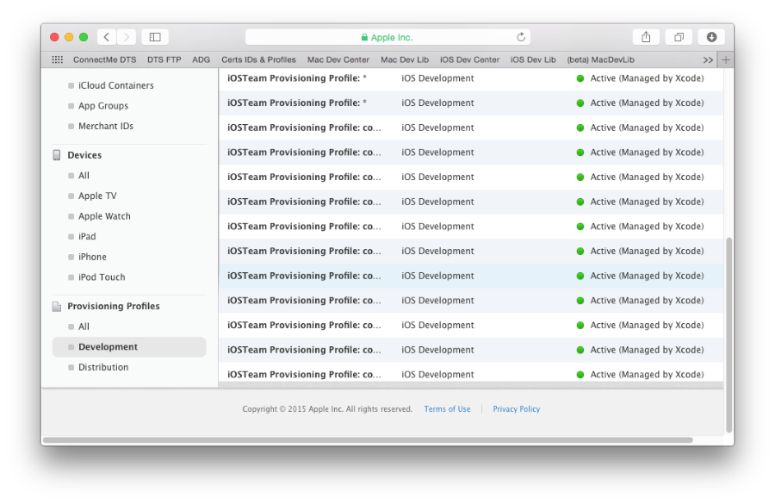

__Figure 6__  Click on a profile to view its enabled services. iCloud is highlighted as an example.

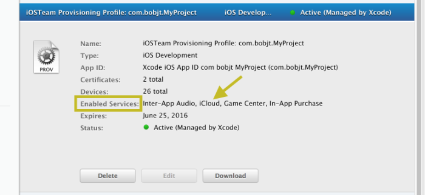

A few notes on provisioning profiles and their embedded entitlements:

- A provisioning profile is associated to exactly one App ID which specifies a single app (or class of apps) and their enabled services. Most services have corresponding entitlements.
- A provisioning profile contains a list of development (or beta test) devices (up to 100 of them) that will be allowed to launch the app once it is code signed.
- The only provisioning profiles that do not contain a list of provisioned devices are App Store profiles, which do not launch on devices, and Enterprise apps, which use a different facility to launch on company owned devices.

### Inspecting a profile's entitlements

You can download a provisioning profile to your Mac using the download button on the Certificates, IDs & Profiles website. To see the profile's entitlements that correspond to its enabled services, use the following Terminal command:

```
security cms -D -i /path/to/iOSTeamProfile.mobileprovision
```

__Listing 1__  Example results of the profile entitlements terminal command clipped to the Entitlements key region.

```
 <key>Entitlements</key>
    <dict>
        <key>keychain-access-groups</key>
        <array>
            <string>4ZX4Z3MVHG.*</string>
        </array>
        <key>inter-app-audio</key>
        <true/>
        <key>get-task-allow</key>
        <true/>
        <key>application-identifier</key>
        <string>4ZX4Z3MVHG.com.appleseedinc.MyProject</string>
        <key>com.apple.developer.ubiquity-kvstore-identifier</key>
        <string>4ZX4Z3MVHG.*</string>

        <key>com.apple.developer.icloud-services</key>
        <string>*</string>
        <key>com.apple.developer.icloud-container-environment</key>
        <array>
            <string>Development</string>
            <string>Production</string>
        </array>
        <key>com.apple.developer.icloud-container-identifiers</key>
        <array>
            <string>iCloud.com.appleseedinc.MyProject</string>
            <string>iCloud.com.appleseedinc.container1</string>
        </array>
        <key>com.apple.developer.icloud-container-development-container-identifiers</key>
        <array>
            <string>iCloud.com.appleseedinc.MyProject</string>
            <string>iCloud.com.appleseedinc.container1</string>
        </array>
        <key>com.apple.developer.ubiquity-container-identifiers</key>
        <array>
            <string>iCloud.com.appleseedinc.MyProject</string>
            <string>iCloud.com.appleseedinc.container1</string>
        </array>
        <key>com.apple.developer.team-identifier</key>
        <string>4ZX4Z3MVHG</string>
        <key>aps-environment</key>
        <string>development</string>

    </dict>
```

__Note:__ A code signed app's embedded provisioning profile is found in the root app bundle folder. Show package contents on the app bundle to find a file that is named `embedded.mobileprovision`.

A few notes on the entitlements that are embedded in a provisioning profile:

- Not only do a profile's enabled services have their corresponding entitlements listed in its text "entitlements" section of the file itself, but this is the sole method of their expression within a profile.
- When a profile is used for code signing, Xcode transfers the profile's associated entitlements to the resulting code signature of the .app.
- Though a profile's enabled services produce entitlements in a profile, Store Services are not the only source of a profile's entitlements. See the section [Entitlement Sources](#apple-f4xwc4dqnrsv64tfmyxwi33df52wszbpirkfgnbqgaytmnbsg4wugsbrfvju6vksincvg) for more information.

  It's also relevant to note that not all enabled services have associated entitlements. See [List of Entitlements](#apple-f4xwc4dqnrsv64tfmyxwi33df52wszbpirkfgnbqgaytmnbsg4wugsbrfvcu4vcjkrgektkfjzkfgtcjknka) for more information.
- It is expected to see asterisks in the profile and not in the app's signature. Therefore, not all entitlement values in the provisioning profile will textually match those on an app signed with that profile in this regard. For the purpose of creating the entitlements that are written into the app's signature during a build, Xcode replaces all asterisk portions of entitlements found in the profile such as application-identifier, iCloud, keychain-access-groups, and others, to be fully qualified based on the values defined in the target's code signing entitlements file.

### Installing the profile in Xcode

Xcode manages all the profiles needed for code signing on your behalf. When you make a new project with a new bundle ID, or toggle capabilities for a target, Xcode manages the App ID, downloads and installs a profile for code signing automatically.

### Xcode's local provisioning profile library

You can view installed provisioning profiles within __Xcode's__ > Preferences menu > Accounts tab > (your account) > View Details:

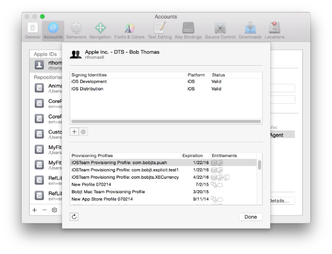

A few notes regarding Xcode's provisioning profile library:

- When a Capability is toggled on the project’s target, Xcode automatically downloads and installs into its profile library an updated provisioning profile reflecting that change.
- Custom provisioning profiles that you've made on the website can be downloaded into Xcode by clicking the "⟳" button on the bottom-left to refresh Xcode's profiles.
- If a profile for your app's App ID is not seen in the list, or, it's capabilities do not reflect changes that were made (either on the Capabilities pane, or that you've made manually on the website) click the "⟳" button on the bottom-left to refresh Xcode's profiles.



### Xcode must be configured to choose the code signing profile on your behalf

After profiles are installed in Xcode, they can be used to code sign an app. Before that, you must configure the target's build settings to allow Xcode to automatically sign the app with the right provisioning profile for you.

The steps to do this are covered in the following document:

__QA1814__ - [Setting up Xcode to automatically manage your provisioning profiles](https://developer.apple.com/library/mac/qa/qa1814/_index.html).

__Figure 7__  Correctly configured Code Signing build settings.

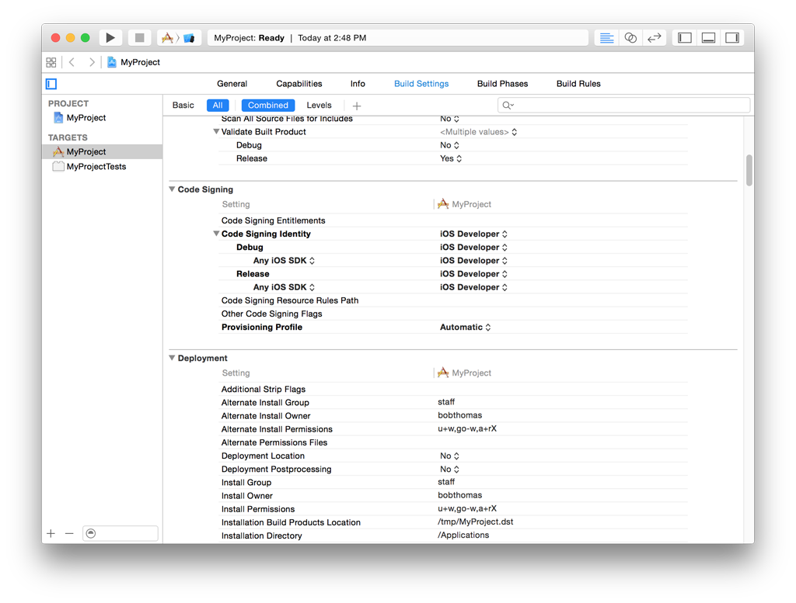

### View the chosen profile in the build log

Once the Xcode project is configured to choose the right profile for code signing, you're ready to build. On a successful build, the provisioning profile Xcode chooses for signing is visible in the "Sign" step of the build log:

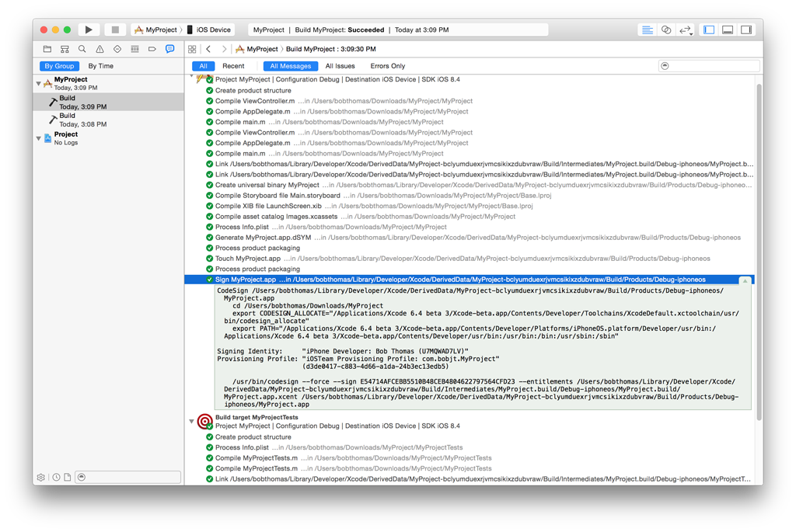

A few notes regarding the profile Xcode chooses for code signing:

__Note:__ Xcode does not code sign Simulator builds, so you must choose an iOS Device run destination in order to view the Code Sign step in the build log.

To double check the entitlements of the profile that Xcode chose to code sign the build, follow these steps:

1. Navigate to [Xcode's local provisioning profile library](#apple-f4xwc4dqnrsv64tfmyxwi33df52wszbpirkfgnbqgaytmnbsg4wugsbrfvifet2gjfgektcjijjecusz).
2. Locate the provisioning profile by the name that was printed in the build log.
3. Control-click on the profile and choose __Show in Finder__.
4. Follow the steps in section [Inspecting a profile's entitlements](#apple-f4xwc4dqnrsv64tfmyxwi33df52wszbpirkfgnbqgaytmnbsg4wugsbrfvifet2gjfgeku2fjzkesvcmivguktsukm).



### Inspect the entitlements of a built app

Running the following terminal command prints the entitlements from its signature:

```shell
$ codesign -d --ent :- /path/to/the.app
```

__Listing 2__  Example app signature entitlements.

```xml
<?xml version="1.0" encoding="UTF-8"?>
<!DOCTYPE plist PUBLIC "-//Apple//DTD PLIST 1.0//EN" "http://www.apple.com/DTDs/PropertyList-1.0.dtd">
<plist version="1.0">
<dict>
    <key>application-identifier</key>
    <string>4ZX4Z3MVHG.com.appleseedinc.MyProject</string>
    <key>com.apple.developer.team-identifier</key>
    <string>4ZX4Z3MVHG</string>
    <key>get-task-allow</key>
    <true/>
    <key>keychain-access-groups</key>
    <array>
        <string>4ZX4Z3MVHG.com.appleseedinc.MyProject</string>
    </array>
</dict>
</plist>
```

Notes on an app's signature entitlements:

- During code signing, the entitlements corresponding to the app’s enabled Capabilities/Services are transferred to the app's signature from the provisioning profile Xcode chose to sign the app.
- The provisioning profile is embedded into the app bundle during the build.
- Entitlements from [Code Signing Entitlements files](#apple-f4xwc4dqnrsv64tfmyxwi33df52wszbpirkfgnbqgaytmnbsg4wugsbrfvcu4vcjkrgektkfjzkfgrsjjrcq) are transferred to the app's signature.

### App entitlements are validated by the OS during an install or launch

When a code signed app is installed or launched, the OS validates its entitlements. If the entitlements do not pass inspection, the install or launch will fail with an entitlement related error.

The OS validates the following:

1. There are no unexpected or misconfigured entitlements.
2. That entitlements match across the app’s signature and the app’s embedded provisioning profile.

### Inspecting distribution build entitlements while submitting an app in Xcode

Xcode shows the distribution build's signature entitlements in the Summary pane during the submission workflow. This is the last opportunity you have to visually ensure that your app contains the expected entitlements before submitting your app for review.

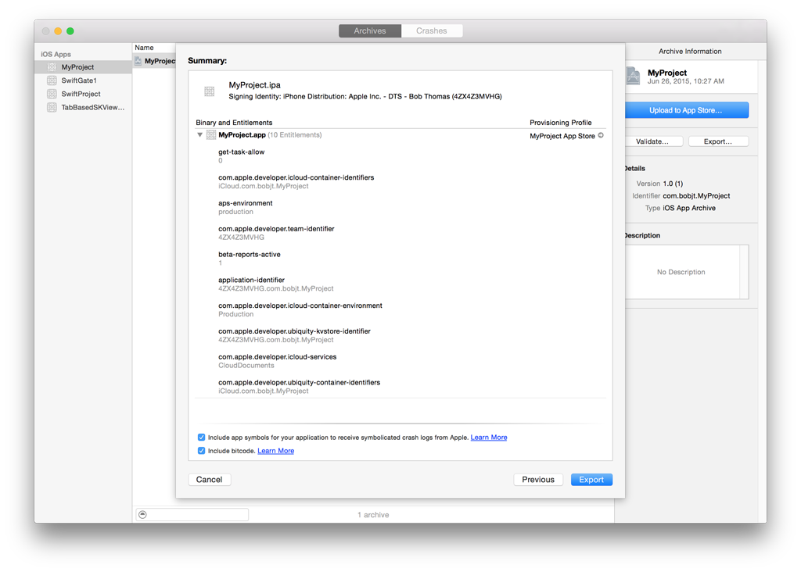

### Code Signing Entitlements files

Code signing entitlements are defined in Xcode using the Code Signing Entitlements build setting seen the following figure.

__Figure 8__  Example Code Signing Entitlements file.

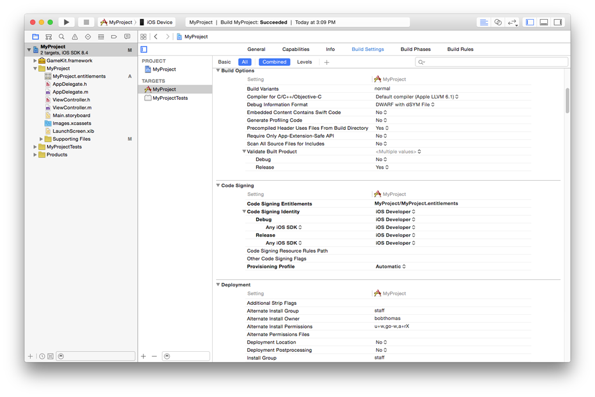

The contents of this example entitlements file are seen here:

__Figure 9__  Contents of the `MyProject.entitlements` file.

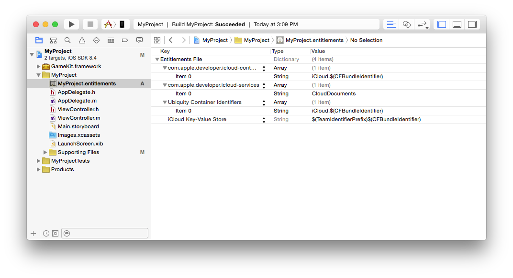

The following are relevant notes regarding Xcode's use of code signing entitlements files:

- Certain capabilities require a code signing entitlements file. Xcode manages the creation of this file automatically when you adjust a target's capabilities.
- When Xcode creates the entitlements for the app's signature, values from the code signing entitlements file are used to fill in any wildcard, asterisk portions of the entitlements that might exist in the code signing provisioning profile.
- Aside from the entitlements that Xcode writes into code signing entitlements files for you, it’s possible to add entitlements into these files yourself. There used to be a need to do this but it is historic and more often the cause of entitlement problems nowadays.
[Back to Top](#)

## Supporting Information

### List of Entitlements

The following is a list of example entitlements found in an app. Rather than provide an exhaustive list, the purpose of this section is to provide you with a few common example entitlements to guide your expectations as you inspect your app while troubleshooting entitlements.

1. `beta-reports-active`

   Beta reports active is a key entitlement with no value. It exists on all App Store distribution provisioning profiles and determines that the app can be distributed through TestFlight.
2. `team-identifier`

   Your Team ID, which is your team's unique 10-digit alpha/numeric value. This value is often used as the default App ID prefix. Certain features are only allowed across apps whose team-identifier value match, for example, Handoff, keychain and UIPasteboard sharing.
3. `get-task-allow`

   The boolean value of get-task-allow determines whether Xcode's debugger can attach to the app.
4. `application-identifier`

   The string value of application-identifier is of the format: <prefix>.<bundle_id> and it corresponds to your app's [App ID](https://developer.apple.com/library/ios/documentation/General/Conceptual/DevPedia-CocoaCore/AppID.html). Often times the prefix is equal to the Team ID though it isn't always the case. In the provisioning profile, this value includes an asterisk if it is associated to a wildcard App ID. In either case, the application-identifier on an app's signature is always fully qualified to include the app's full bundle ID.
5. `keychain-access-groups`

   This entitlement defines an array of strings corresponding to keychains you intend the app to have access to. Each string value in the array are of the format: <prefix>.<bundle_id>. By default, Xcode creates this entitlement for you a value equal to the application-identifier entitlement. All prefixes in this array of strings must match. For more information, see the [SecItemAdd](https://developer.apple.com/library/ios/documentation/Security/Reference/keychainservices/#//apple_ref/c/func/SecItemAdd) section of the [Keychain Services Reference](https://developer.apple.com/library/ios/documentation/Security/Reference/keychainservices/).
6. `push-notification`

   The presence of this entitlement indicates that the app is enabled to receive push notifications. The value of this entitlement is either "production" or "development", which refer to the live and sandbox push notification servers, respectively. For more information on troubleshooting push notifications, see:

   __TN2265__ - [Troubleshooting Push Notifications](https://developer.apple.com/library/ios/technotes/tn2265/_index.html).

For more entitlements, including iCloud and App Sandbox, see the [Entitlement Key Reference](https://developer.apple.com/library/mac/documentation/Miscellaneous/Reference/EntitlementKeyReference/Chapters/AboutEntitlements.html).

__Note:__ In-App Purchase and Game Center services do not have corresponding entitlements. The OS allows an app to use Game Center or In App Purchase if the app's embedded profile specifies an explicit App ID. Conversely, apps that are code signed with a wildcard provisioning profile cannot use Game Center and In-App Purchase.

### Entitlement Sources

This section provides a review of all possible locations that entitlements are defined.

1. Entitlements embedded in a provisioning profile that is used to code sign the app, which are composed of:
2. 1. Capabilities defined on the Xcode project's target Capabilities tab, and/or:
   2. Enabled Services on the app's App ID which are configured on the Identifiers section of the Certificates, ID's and Profiles website.
   3. Other entitlements that are injected by the profile generation service. Unlike entitlements that result from an app's enabled services or capabilities, you do not have control over these entitlements.
3. Entitlements from a code signing entitlements file. See [Code Signing Entitlements files](#apple-f4xwc4dqnrsv64tfmyxwi33df52wszbpirkfgnbqgaytmnbsg4wugsbrfvcu4vcjkrgektkfjzkfgrsjjrcq) for more information.

### Entitlement Destinations

This section provides a review of the locations that entitlements reside. Entitlements end up in two different places within an app:

1. The app's signature. See [Inspect the entitlements of a built app](#apple-f4xwc4dqnrsv64tfmyxwi33df52wszbpirkfgnbqgaytmnbsg4wugsbrfvavaucfjzkesvcmivguktsukm) for more information.
2. The app's embedded provisioning profile. See [Inspecting a profile's entitlements](#apple-f4xwc4dqnrsv64tfmyxwi33df52wszbpirkfgnbqgaytmnbsg4wugsbrfvifet2gjfgeku2fjzkesvcmivguktsukm) for more information.

### App ID Prefix Mismatching

When an app is validated during installation or launch, the operating system ensures that the prefix of the app's application-identifier entitlement matches across the app's signature and its embedded provisioning profile. If they do not match, the app is prevented from installing or launching as a security measure. A couple notes related to App ID prefix mismatching:

- You can diagnose an App ID Prefix mismatch by comparing the entitlements in both places listed in section [Entitlement Destinations](#apple-f4xwc4dqnrsv64tfmyxwi33df52wszbpirkfgnbqgaytmnbsg4wugsbrfvceku2ujfhecvcjj5hfg).
- An App ID Prefix mismatch is resolved by rebuilding the app and making sure that provisioning profiles with matching prefixes are used in all code signing phases.

The following guides cover App ID Prefix issues in detail:

- __QA1879__ - [Resolving App ID Prefix Mismatching](https://developer.apple.com/library/ios/qa/qa1879/_index.html)
- __TN2311__ - [Managing Multiple App ID Prefixes](https://developer.apple.com/library/ios/technotes/tn2311/_index.html)
- __QA1726__ - [Resolving the Potential Loss of Keychain Access warning](https://developer.apple.com/library/ios/qa/qa1726/_index.html)
- __TN2319__ - Installation Failure Troubleshooting for iOS > [Upgrade's application-identifier does not match the installed app](https://developer.apple.com/library/ios/technotes/tn2319/_index.html#//apple_ref/doc/uid/DTS40013778-CH1-ERRORMESSAGES-UPGRADE_S_APPLICATION_IDENTIFIER_DOES_NOT_MATCH_THE_INSTALLED_APP)
[Back to Top](#)

---

#### Document Revision History

| __Date__ | __Notes__ |
| 2015-08-12 | Editorial update. |
| 2015-08-11 | Editorial update. |
|  | Editorial update. |
| 2015-08-04 | New document that assists with troubleshooting entitlement related failures that occur during Xcode build, app installation, or submission. |

