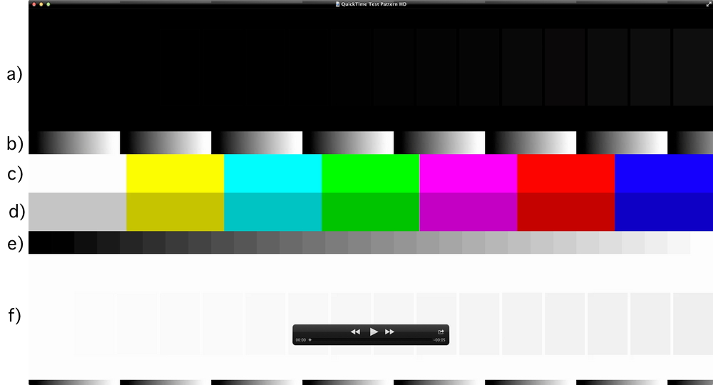
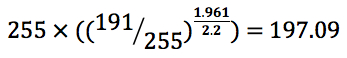
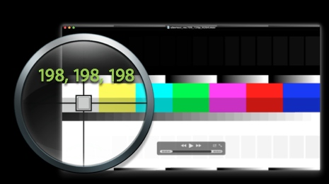
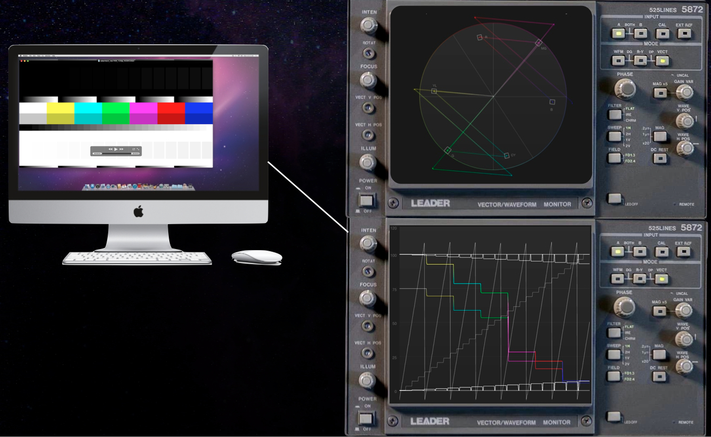

> 导航：[总目录](../../README.md) · [technotes](../../_indexes/technotes.md)

Technical Note TN2257

# Evaluating an Application's Video Color

Describes how to evaluate your application's video color.

[Introduction](#apple-f4xwc4dqnrsv64tfmyxwi33df52wszbpirkfgnbqgaytgmzyguwugsbrfveu4vcsj4)[Evaluating Your Application's Video Using Color Bars](#apple-f4xwc4dqnrsv64tfmyxwi33df52wszbpirkfgnbqgaytgmzyguwugsbrfvcvmqkmkvaviskoi5pvst2vkjpucucqjreugqkujfhu4x2tl5lesrcfj5pvku2jjzdv6q2pjrhvex2cifjfg)[Introduction](#apple-f4xwc4dqnrsv64tfmyxwi33df52wszbpirkfgnbqgaytgmzyguwugsbrfvcvmqkmkvaviskoi5pvst2vkjpucucqjreugqkujfhu4x2tl5lesrcfj5pvku2jjzdv6q2pjrhvex2cifjfglkjjzkfet2ekvbviskpjy)[QuickTime Test Pattern movie files](#apple-f4xwc4dqnrsv64tfmyxwi33df52wszbpirkfgnbqgaytgmzyguwugsbrfvcvmqkmkvaviskoi5pvst2vkjpucucqjreugqkujfhu4x2tl5lesrcfj5pvku2jjzdv6q2pjrhvex2cifjfglkrkveugs2ujfgukx2uivjvix2qifkfirksjzpu2t2wjfcv6rsjjrcvg)[Interpreting 75% Grey Levels](#apple-f4xwc4dqnrsv64tfmyxwi33df52wszbpirkfgnbqgaytgmzyguwugsbrfveu4vcfkjiferkui5jekwkmivlektct)[Output to Vectorscope and/or Waveform Analyzer](#apple-f4xwc4dqnrsv64tfmyxwi33df52wszbpirkfgnbqgaytgmzyguwugsbrfvlekq2uj5jfgq2pkbcq)[Vectorscope](#apple-f4xwc4dqnrsv64tfmyxwi33df52wszbpirkfgnbqgaytgmzyguwugsbrfvlekq2uj5jfgq2pkbcs2vsfinke6ustinhvari)[Waveform Monitor](#apple-f4xwc4dqnrsv64tfmyxwi33df52wszbpirkfgnbqgaytgmzyguwugsbrfvlekq2uj5jfgq2pkbcs2v2bkzcumt2sjvpu2t2ojfke6uq)[Additional pattern features](#apple-f4xwc4dqnrsv64tfmyxwi33df52wszbpirkfgnbqgaytgmzyguwugsbrfvlekq2uj5jfgq2pkbcs2qkeireviskpjzauyx2qifkfirksjzpumrkbkrkverkt)[How to ensure your app video is color managed](#apple-f4xwc4dqnrsv64tfmyxwi33df52wszbpirkfgnbqgaytgmzyguwugsbrfvbuctcmkrhucq2ujfhu4)[Document Revision History](#apple-f4xwc4dqnrsv64tfmyxwi33df52wszbpirkfgnbqgaytgmzyguwvezlwnfzws33ojbuxg5dpoj4s2rdpnz2ey2lonncwyzlnmvxhiskel4yq)

## Introduction

Both AV Foundation and QTKit automatically apply color management to video during playback. See Technical Note TN2227 _[Video Color Management in AV Foundation and QTKit](../Video%20Color%20Management%20in%20AV%20Foundation%20and%20QTKit/Video%20Color%20Management%20in%20AV%20Foundation%20and%20QTKit.md#apple-f4xwc4dqnrsv64tfmyxwi33df52wszbpirkfgnbqgaytcmztgu)_, which is considered a prerequisite for this document.

As discussed in Technical Note TN2227, ColorSync creates a color transform that provides a perceptual match between a known broadcast video color space (as specified by the `'nclc'` tag) and the specific chromaticity and gamma characteristics of your display (as defined by the display's ICC profile). This color transformation is then applied to every pixel of each frame by the GPU in realtime as the video is played back on screen.

__Note:__ Broadcast standards-based video is intended to be viewed in a dimly lit viewing environment such as a living room. The color management applied during playback lessens the contrast to preserve the correct tonality when video is viewed in brighter viewing conditions.

It is important to note that the pixel values are changed by the color management process. This means that values read back from the display buffer via the DigitalColor Meter utility will be different than the actual pixels encoded in the video file. Further, it might not be obvious that the pixel values will likely differ between different displays (even seemingly identical displays) because their display profiles may be different.

This document describes various techniques to evaluate how your application renders video.

[Back to Top](#)

## Evaluating Your Application's Video Using Color Bars

### Introduction

The video industry commonly evaluates color using known test patterns. In this way, it is straightforward to learn how video was processed based on how the pattern deviates from that known standard. Classically, in an analog video environment, SMPTE (Society of Motion Picture and Television Engineers) color bars are used (these are generally referred to as Engineering Guideline EG 1-1990, see the [SMPTE website](https://www.smpte.org/home) for more information).

__Important:__ As with any content, the color bars themselves __must__ be `'nclc'` color tagged to be correctly interpreted. See _[Video Color Management in AV Foundation and QTKit](../Video%20Color%20Management%20in%20AV%20Foundation%20and%20QTKit/Video%20Color%20Management%20in%20AV%20Foundation%20and%20QTKit.md#apple-f4xwc4dqnrsv64tfmyxwi33df52wszbpirkfgnbqgaytcmztgu)_ to learn how to tag your video.

### QuickTime Test Pattern movie files

QuickTime Test Pattern movie files are available for download on the [QuickTime Developer page](https://developer.apple.com/quicktime/). These color bars have been designed to better help you to check the color reproduction of your QuickTime-based application or workflow. See Figure 1 for an example test pattern.

The test patterns contain color and grayscale patterns that let you test issues such as:

a) 16 black levels on black (black crush test/range expansion)

b) Continuous gradient (quantization/super-black,super-white handling)

c) 100% color bars (matrix, color match)

d) 75% color bars (matrix, color match)

e) Quantized gradient (gamma)

f) 16 white levels on white (white crush test/range expansion)

__Figure 1__  QuickTime Test Pattern movie file.

These features can be evaluated by opening the test pattern in the desired application and visually inspecting it, reading back the display buffer pixel values using the DigitalColor Meter utility (see [Interpreting 75% Grey Levels](#apple-f4xwc4dqnrsv64tfmyxwi33df52wszbpirkfgnbqgaytgmzyguwugsbrfveu4vcfkjiferkui5jekwkmivlektct)), or via a professional waveform monitor and/or vectorscope (see [Output to Vectorscope and/or Waveform Analyzer](#apple-f4xwc4dqnrsv64tfmyxwi33df52wszbpirkfgnbqgaytgmzyguwugsbrfvlekq2uj5jfgq2pkbcq)).

### Interpreting 75% Grey Levels

As shown in Figure 1, the QuickTime Test Pattern movie files contain 75% color bars.

The easiest way to check the color management in your application is to use 75% grey bars.

On Mac OS X 10.6 Snow Leopard and later with modern media, 75% grey bars will be processed by a 1.96 to 2.2 gamma conversion, resulting in a 198 value. See Figure 3. Here's a detailed explanation:

AV Foundation and QTKit will use a value of approximately 1.96 as the gamma of video, which is the gamma value without the boost required for classic dim surround viewing environments. Here's how that number is derived: if you had measured the response of a CRT, most had a gamma of between 2.4 and 2.5 (it is dependent on how the brightness and contrast is set on the monitor). If you choose a value halfway in between, 2.45, and remove the contrast enhancement (the 1.25 gamma boost provided for viewing in dimly lit environments) you'll get a value very close to 1.96 (2.45/1.25 = 1.96).

On Mac OS X 10.6 Snow Leopard and later, the video gamma is then converted to the 2.2 display buffer gamma when the application performs the color match to the display.

To recap, if you take the 75% grey bar and perform the 1.96 to 2.2 gamma conversion, the calculations are as follows: 191/255 (75% grey bars in an 8-bit (0-255) RGB space have 191 energy levels, because 191 is 75% of 255), raised to the 1.961/2.2 exponent (gamma conversion), scaled back to 255, producing a value of approximately 198:

__Figure 2__  Gamma Conversion Calculation for 75% Grey Bars

With rounding error, the results will be in this range.

__Figure 3__  75% Grey Levels in AV Foundation and QTKit apps on Mac OS X 10.6 Snow Leopard and later

That's the default behavior for a modern AV Foundation, QTKit and QuickTime Visual Context application during playback. If you get 191's or other values, it probably means there's no color management being applied. See [How to ensure your app video is color managed](#apple-f4xwc4dqnrsv64tfmyxwi33df52wszbpirkfgnbqgaytgmzyguwugsbrfvbuctcmkrhucq2ujfhu4).

__Note:__ By default, color matches are performed using perceptual rendering intent, but because the profiles are "matrix-based", the results of the color match are identical for all rendering intents.

#### Color match will keep grey levels 'pure' grey

In a color managed application, given a correct display profile, a color match won't change a grey value from appearing grey. It may adjust the brightness based on the gamma correction, but it won't add color to it (grey's remain R=G=B). Therefore, the RGB components of a given grey value from one of the color bars will have identical values after the color match. If they don't, that's an issue you should investigate (see [How to ensure your app video is color managed](#apple-f4xwc4dqnrsv64tfmyxwi33df52wszbpirkfgnbqgaytgmzyguwugsbrfvbuctcmkrhucq2ujfhu4)).

#### Interpreting 'pure' (non-grey) colors in the color bar

Pixel values that aren't grey may change due to the color match. As discussed in the [Introduction](#apple-f4xwc4dqnrsv64tfmyxwi33df52wszbpirkfgnbqgaytgmzyguwugsbrfveu4vcsj4), color matches are performed using perceptual rendering intent. This means a 75% green may get any one of a number of color shifts during the color match, depending on the nature of the source profile and display profile. For example, a 75% Green value (0, 191, 0) may change to (40, 200, 8) after the color match.

[Back to Top](#)

## Output to Vectorscope and/or Waveform Analyzer

You can output your video to a vectorscope and/or waveform analyzer to analyze the video signals. For example, gamma, quantization errors and range expansion/compression can be verified by viewing the test pattern on a waveform monitor. Similarly, the correct colorspace conversion matrices (and the presence of a colormatch) can be verified by viewing the test pattern on a vector scope.

__Important:__ Gamma is adjusted for displays, but not video devices, so standard vectorscope targets are inappropriate for evaluating the display outputs (Display Port, or DVI), but are appropriate for video outputs (HDMI, Composite, or Component video output).

### Vectorscope

A vectorscope is a type of instrument that measures the color relationship of a video signal by plotting the two chroma components of a signal. Vectorscopes often include printed boxes indicating standard colors. Ideally, a correctly reproduced color bar signal should 'hit' the vectorscope boxes.

__Figure 4__  Test Pattern Analysis using a Vectorscope (top) and Waveform Analyzer (bottom).

Typically, there is a set of six boxes (Yellow, Cyan, Green, Magenta, Red and Blue) representing 75% color bars, and another set for 100% color bars -- these correspond to sections c) and d) of the QuickTime Test Pattern movie files as shown in Figure 1. If the representation's color vector 'hits' inside the corresponding box during testing, then that color is correct.

__Note:__ These boxes typically only represent HD or SD color bars, and not content that has been converted from one standard to the other (i.e. a rec. 709 (HD) 75% Red is a different color than a rec. 601 (SD) 75% Red, and a signal so converted would not be expected to hit HD or SD targets)

### Waveform Monitor

A waveform monitor displays the composite of the amplitude of all of the lines of a given frame of video over time. Among other things, this instrument can help ensure that all values are used with no range of blacks or whites being truncated (crushed). Here's elements of the QuickTime Test Pattern Movie file (see Figure 1) to examine on a waveform monitor:

a) Black boxes on a black background. On the waveform monitor, this portion of the test signal should be visible as 16 steps beginning with true black.

b) Gradient. This monotonically increasing gradient includes super-whites and super-blacks that are expected to be crushed by a rendering process that includes full-range RGB. Consequently, the result on the waveform monitor should range from true-black to full-white, but the beginning and end of the repeating pattern may be clamped to black or white for the extent of the range corresponding to super-white and super-black. The gradient should form a straight line on the waveform monitor's display (otherwise it indicates a gamma conversion was applied). The line should also be smooth, otherwise quantization may have occurred.

f) White boxes on a full-white background. On the waveform monitor this portion of the test signal should be visible as 16 steps beginning from full-white.

### Additional pattern features

e) Quantized gradient. This is used to perform a numerical method on plotting the area under those targets and solving for the gamma of the signal.

[Back to Top](#)

## How to ensure your app video is color managed

To ensure that the appropriate color management is applied to your video during playback, you should do the following:

- Use high-level frameworks

  Mac OS X offers implicit color management of video through frameworks integrated with ColorSync, such as QTKit and AV Foundation.
- Tag all content

  It is critical that all video content be tagged with an `'nclc'` color tag. You can use the QuickTime X Automator tagging action to perform this operation. The QuickTime X device exporters will also properly tag content for you. If you have applications or components that produce video make sure that you provide the `'nclc'` information in the files that you write. See [Technical Note TN2227, 'Video Color Management in AV Foundation and QTKit'](https://developer.apple.com/technotes/tn2009/tn2227.html) for more information.

  __Important:__ Media without an `‘nclc’` tag will have an undefined color behavior. In most cases, it will be treated if it were created in the SMPTE-C color space. This may result in inconsistent video color across different devices. You should always tag your content to ensure that the appropriate color management is applied. See _[Video Color Management in AV Foundation and QTKit](../Video%20Color%20Management%20in%20AV%20Foundation%20and%20QTKit/Video%20Color%20Management%20in%20AV%20Foundation%20and%20QTKit.md#apple-f4xwc4dqnrsv64tfmyxwi33df52wszbpirkfgnbqgaytcmztgu)_ to learn more about tagging your content.
- Evaluate all results

  Use the techniques described in this tech note to evaluate your results and verify that your video is being properly color managed.

[Back to Top](#)

---

#### Document Revision History

| __Date__ | __Notes__ |
| 2013-06-11 | Editorial. |
| 2013-06-10 | New document that discusses how to evaluate your application's video color. |

