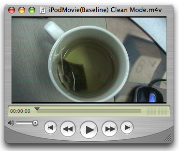
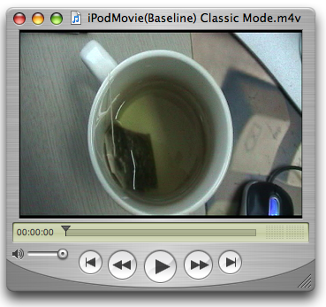

> 导航：[总目录](../../README.md) · [technotes](../../_indexes/technotes.md)


# Retired Document

__Important:__
This document may not represent best practices for current development. Links to downloads and other resources may no longer be valid.

Technical Note TN2188

# Exporting Movies for iPod, Apple TV, iPad and iPhone

__Important:__ This document may not represent best practices for current development. Links to downloads and other resources may no longer be valid.

The QuickTime API supports exporting movies playable by all Apple devices.

Since version 7.0.3, QuickTime has been able to export .m4v files playable on the iPod by using the iPod Export Component. QuickTime 7.1.5 introduced the Apple TV Export Component supporting the creation of .m4v files playable by the Apple TV along with the iPad, and with the release of QuickTime 7.2 the iPhone and iPhone (Cellular) Export Components were introduced supporting the creation of .m4v and .3gp files for iPhone.

This Technical Note discusses the use of the above mentioned Movie Export Components to create media playable by iPod, Apple TV, iPhone and iPad. These QuickTime Components can be thought of as black boxes capable of producing output as described this Technical Note.

Information related to content creation using Compressor 3.x can be found in the Compressor Documentation. For information related to creating media suitable for HTTP streaming, please consult: "Technical Note TN2218 - Compressing QuickTime Movies for the Web" and "Technical Note TN2224 - Best Practices for Creating and Deploying HTTP Live Streaming Media for the iPhone and iPad'.

[Introduction](#apple-f4xwc4dqnrsv64tfmyxwi33df52wszbpirkfgmjqgaydimrtgywugsbrfvke4vcbi4yq)[iPod Export Component](#apple-f4xwc4dqnrsv64tfmyxwi33df52wszbpirkfgmjqgaydimrtgywugsbrfvke4vcbi4za)[Summary of Features](#apple-f4xwc4dqnrsv64tfmyxwi33df52wszbpirkfgmjqgaydimrtgywugsbrfvke4vcbi4zq)[Movie Size](#apple-f4xwc4dqnrsv64tfmyxwi33df52wszbpirkfgmjqgaydimrtgywugsbrfvke4vcbi42a)[Frame Rate](#apple-f4xwc4dqnrsv64tfmyxwi33df52wszbpirkfgmjqgaydimrtgywugsbrfvke4vcbi42q)[Data Rate](#apple-f4xwc4dqnrsv64tfmyxwi33df52wszbpirkfgmjqgaydimrtgywugsbrfvke4vcbi43a)[Code Example](#apple-f4xwc4dqnrsv64tfmyxwi33df52wszbpirkfgmjqgaydimrtgywugsbrfvke4vcbi4ytg)[Apple TV Export Component (Compatible with iPad)](#apple-f4xwc4dqnrsv64tfmyxwi33df52wszbpirkfgmjqgaydimrtgywugsbrfvke4vcbi4ytq)[Summary of Features](#apple-f4xwc4dqnrsv64tfmyxwi33df52wszbpirkfgmjqgaydimrtgywugsbrfvke4vcbi4yts)[Movie Size](#apple-f4xwc4dqnrsv64tfmyxwi33df52wszbpirkfgmjqgaydimrtgywugsbrfvke4vcbi4zda)[Frame Rate](#apple-f4xwc4dqnrsv64tfmyxwi33df52wszbpirkfgmjqgaydimrtgywugsbrfvke4vcbi4zdc)[Data Rate](#apple-f4xwc4dqnrsv64tfmyxwi33df52wszbpirkfgmjqgaydimrtgywugsbrfvke4vcbi4zde)[Code Example](#apple-f4xwc4dqnrsv64tfmyxwi33df52wszbpirkfgmjqgaydimrtgywugsbrfvke4vcbi4zdq)[iPhone Export Component](#apple-f4xwc4dqnrsv64tfmyxwi33df52wszbpirkfgmjqgaydimrtgywugsbrfvke4vcbi4zds)[Summary of Features](#apple-f4xwc4dqnrsv64tfmyxwi33df52wszbpirkfgmjqgaydimrtgywugsbrfvke4vcbi42da)[Movie Size](#apple-f4xwc4dqnrsv64tfmyxwi33df52wszbpirkfgmjqgaydimrtgywugsbrfvke4vcbi4ztg)[Frame Rate](#apple-f4xwc4dqnrsv64tfmyxwi33df52wszbpirkfgmjqgaydimrtgywugsbrfvke4vcbi4zti)[Data Rate](#apple-f4xwc4dqnrsv64tfmyxwi33df52wszbpirkfgmjqgaydimrtgywugsbrfvke4vcbi4ztk)[Code Example](#apple-f4xwc4dqnrsv64tfmyxwi33df52wszbpirkfgmjqgaydimrtgywugsbrfvke4vcbi4zdm)[iPhone (Cellular) Export Component](#apple-f4xwc4dqnrsv64tfmyxwi33df52wszbpirkfgmjqgaydimrtgywugsbrfvke4vcbi4ztc)[Summary of Features](#apple-f4xwc4dqnrsv64tfmyxwi33df52wszbpirkfgmjqgaydimrtgywugsbrfvke4vcbi4ztm)[Movie Size](#apple-f4xwc4dqnrsv64tfmyxwi33df52wszbpirkfgmjqgaydimrtgywugsbrfvke4vcbi4zto)[Frame Rate](#apple-f4xwc4dqnrsv64tfmyxwi33df52wszbpirkfgmjqgaydimrtgywugsbrfvke4vcbi4ztq)[Data Rate](#apple-f4xwc4dqnrsv64tfmyxwi33df52wszbpirkfgmjqgaydimrtgywugsbrfvke4vcbi4zts)[References](#apple-f4xwc4dqnrsv64tfmyxwi33df52wszbpirkfgmjqgaydimrtgywugsbrfvke4vcbi4yto)[Document Revision History](#apple-f4xwc4dqnrsv64tfmyxwi33df52wszbpirkfgmjqgaydimrtgywvezlwnfzws33ojbuxg5dpoj4s2rdpnz2ey2lonncwyzlnmvxhiskel4yq)

## Introduction

For developers not familiar with movie exporters, a Movie Export Component (`MovieExportType` or `'spit'` as they are called after their four character code) convert movies into some other format so that the media data can be used by other applications or devices. As an example, the iPod movie export component allows applications to take video and audio media data from a QuickTime Movie and export it as H.264 / AAC-LC data stored in an .m4v file suitable for viewing on a Video iPod.

To find an export component, use the Component Manager `FindNextComponent` API. The characteristics of the component you're looking for are expressed in a component description record (`ComponentDescription`) by specifying the `componentType`, `componentSubType`, `componentManufacturer` and `componentFlags` fields.

Export components use the `componentSubType` value to indicate the type of data they support and use the `componentFlags` field to indicate more specific information about their capabilities.

Once a specified export component (`Component`) is found, it must be opened by calling `OpenAComponent`. `OpenAComponent` returns an instance (`ComponentInstance`) of the component which can then be used with export APIs such as `MovieExportToDataRef` and `ConvertMovieToDataRef`.

The convenience `OpenADefaultComponent` API may also be used to find and open a component if the component can be described using only the `componentType` and `componentSubType` fields.

Always remember to close any opened component by calling `CloseComponent` once you've finished using it.

[Back to Top](#)

## iPod Export Component

The iPod export component first shipped with QuickTime 7.0.3 and supported H.264 video up to 320x240. Since the release of QuickTime 7.1.3 the iPod export component also supports exporting H.264 video up to 640x480.

To find the iPod export component, use the component description shown in Table 1.

__Table 1__  Component Description for the iPod export component.

| Component Description | iPod Exporter |
| componentType | MovieExportType |
| componentSubType | 'M4V ' |
| componentManufacturer | kAppleManufacturer |
| componentFlags | 0 |
| componentFlagsMask | kAnyComponentFlagsMask |

### Summary of Features

The Fifth Generation iPods (firmware 1.2 or later) supports the playback of .m4v files containing H.264 video encoded using one of two profiles; 320x240 Baseline profile (up to Level 1.3) with AAC-LC audio and 640x480 Low-Complexity version of the H.264 Baseline Profile with AAC-LC audio.

The iPod exporter is capable of producing .m4v files conforming to these profiles as shown in Tables 2 and 3.

__Table 2__  Low-Complexity version of the H.264 Baseline Profile .m4v file type.

| Media | Codec | Max. Bitrate | Rate | Max. Size/Channels | Profile |
| Video | H.264 | 1.5 Mbps | 30 fps | 640x480 | Baseline Low-Complexity |
| Audio | AAC-LC | 128 Kbps | 44.1 kHz | Stereo, 2 |  |

__Table 3__  Baseline (up to Level 1.3) .m4v file type.

| Media | Codec | Max. Bitrate | Rate | Max. Size/Channels | Profile |
| Video | H.264 | 768 Kbps | 30 fps | 320x240 | Baseline (up to Level 1.3) |
| Audio | AAC-LC | 128 Kbps | 44.1 kHz | Stereo, 2 |  |

__Note:__ The H.264 standard includes a set of capabilities called profiles. For more information about the different levels of Baseline profile see [H.264 Profiles](http://en.wikipedia.org/wiki/H.264#Profiles).

The Low-Complexity version of the H.264 Baseline Profile has been defined by Apple for the iPod.

What defines the output result of an export operation using the iPod exporter are properties of the source movie passed to the exporter. Most important of these is the movie size as returned by the `GetMovieBox` API, or the `QTMovie` -`attributeForKey`: method using the `QTMovieCurrentSizeAttribute` key.

Depending on the source movie image size, the iPod export component will either produce a Low-Complexity version of the H.264 Baseline Profile .m4v file (see Table 2), or the Baseline profile .m4v file (see Table 3).

Developers adding export support for the iPod may expect to have specific output profile options presented in a configurable export dialog. It is important to note however that the iPod export component does __NOT__ provide any user or developer configurable options.

__Important:__ The iPod exporter component flag `hasMovieExportUserInterface` is clear, indicating that the component does not provide any user interface.

__Note:__ The rectangle enclosing the movie display boundary region is called the movie box. QuickTime provides the `SetMovieBox` API allowing you to size and place a movie in the display coordinate system. QuickTime automatically adjusts the movie matrix to satisfy your request. The movie box may also be modified by adjusting the movie transformation matrix directly.

A movie's composition and size may differ depending on the selected aperture mode. For example, if Clean Aperture mode is selected, a 4:3 DV NTSC track appears as 640x480 and a 16:9 DV NTSC track appears as 853x480. Because the represented size of a movie may differ depending on aperture mode, the output produced by the iPod exporter may also differ.

### Movie Size

The iPod export component determines which profile will be used to produce the output .m4v file by inspecting the source movie's image size.

The destination movie's image size and profile is determined as shown in Table 4.

__Table 4__

| Source Movie Size | Destination Movie Size | Destination Movie Profile |
| Smaller than or equal to 320x240 (≤ 320x240) | Same as source | Baseline Profile up to Level 1.3 |
| Larger than 320x240 but smaller than or equal to 640x480 (> 320x240 ≤ 640x480) | Same as source | Baseline Low-Complexity |
| Larger than 640x480 (> 640x480) | Scaled to fit within 640x480 preserving aspect ratio | Baseline Low-Complexity |

### Frame Rate

The output frame rate is determined by the source movie's frame rate, limited to 30 fps using adaptive frame sampling.

### Data Rate

With the destination movie size being variable, the target data rate is calculated based on the effective destination movie image size (this is the movie image size after any scaling has been applied if required).

Output data rates are as follows:

- If the effective movie image size is smaller than or equal to QVGA (320x240) the data rate is 700 kbps.
- If the effective movie image size is larger than HVGA (640x240) the data rate is 1.5 Mbps (1500 kbps).
- If the effective movie image size is in between the above two sizes, data rate is interpolated between the two end points using the formula: DR = { (nMC \* 8 ) / 3 } - 100 where DR is the data rate in kbps and nMC is the number of macroblocks in the image.

The comparison of movie image sizes is done in terms of the number of macroblocks in the movie image.

__Note:__ The codec will also attempt to maintain a peak data rate under 249600 bytes over a 2.6 second period.

### Code Example

Listing 1 demonstrates one use of the iPod export component and will produce a Baseline profile .m4v file that will fit within 320x240. This is done by changing the source movie box appropriately regardless of the input movie size before passing it to the export component. Applications may want to perform an operation such as this to specifically produce a Baseline profile .m4v file from larger source media while still maintaining correct aspect ratio.

The results of using the code in Listing 1 to export a 16:9 DV NTSC 720x480 clip are shown in Figure 1 (using clean aperture mode) and Figure 2 (using classic aperture mode).

__Figure 1__  Circles are round.



`GetMovieBox` will return 853x480 and we set the wanted size to 320x180.

__Figure 2__  Circles not so round.



`GetMovieBox` will return 720x480 and we set the wanted size to 320x213.

__Important:__ As shown in Table 4, the iPod export component will only scale movie images larger than 640x480 to fit while maintaining aspect ratio to produce Baseline Low-Complexity profile .m4v files. If you want to produce Baseline profile .m4v files up to 320x240 or Baseline Low-Complexity profile files larger than 320x240 (but smaller than or equal to 640x480), you will need to correct for aspect ratio yourself.

Listing 2 contains utility functions called by Listing 1.

__Listing 1__  Using the iPod export component.

```
// Export using the iPod export component
// In this function we specifically set the movie box to fit 320x240 regardless
// of the input movie size - this is a good demonstration as the results are
// readily apparent with 16:9 DV media
OSStatus ExportiPodMovieToDesktop(Movie inMovie, Boolean inUseCleanApertureMode)
{
    // component description for the iPod exporter
    ComponentDescription cd = { MovieExportType,         // type 'spit'
                                'M4V ',                  // iPod export component
                                kAppleManufacturer,      // 'appl'
                                0,                       // any flags
                                kAnyComponentFlagsMask };

    Component aComponent = 0;
    MovieExportComponent theExportComponent = 0;

    Handle dataRef = NULL;
    OSType dataRefType = 0;

    OSType savedApertureMode = 0;

    Rect savedMovieBox = { 0 };

    OSStatus status = paramErr;

    if (NULL == inMovie) return status;

    // create a data reference for the output file
    status = QTNewDataReferenceFromFullPathCFString(
                                                CFSTR("/Volumes/MacOSX/Users/ed/Desktop/iPodMovie.m4v"),
                                                kQTNativeDefaultPathStyle,
                                                0,
                                                &dataRef,
                                                &dataRefType);
    if (status) goto bail;

    // set the aperture mode to clean -- this may change the size of the movie box
    // therefore we do this before anything else
    if (true == inUseCleanApertureMode) {
        status = SetMovieCleanApertureMode(inMovie, &savedApertureMode);
        if (status) goto bail;
    }

    // save the original movie size because we're going to mess with it
    GetMovieBox(inMovie, &savedMovieBox);
    if (status = GetMoviesError()) goto bail;

    // find the exporter -- note OpenADefaultComponent may also be an option
    aComponent = FindNextComponent(aComponent, &cd);
    if (0 == aComponent) { status = badComponentType; goto bail; };

    // open it
    status = OpenAComponent(aComponent, &theExportComponent);
    if (status) goto bail;

    // call our routine to set the movie box so the exporter will produce
    // the results we want - in this case up to 320x240 Baseline
    SetExportMovieBox(inMovie, 320, 240);

    // export to .m4v
    status = MovieExportToDataRef(theExportComponent,           // export component instance
                                  dataRef,                      // destination data reference
                                  dataRefType,                  // destination data reference type
                                  inMovie,                      // movie to export
                                  0,                            // export specific track?
                                  0,                            // start time
                                  GetMovieDuration(inMovie)); // duration

    // restore the saved movie box
    SetMovieBox(inMovie, &savedMovieBox);

bail:
    // restore original aperture mode
    if (savedApertureMode) {
        QTSetMovieProperty(inMovie,
                           kQTPropertyClass_Visual,
                           kQTVisualPropertyID_ApertureMode,
                           sizeof(savedApertureMode),
                           &savedApertureMode);
    }

    // dispose the data reference handle when you're done with it
    if (dataRef) DisposeHandle(dataRef);

    // always remember to close the component when you're done
    if (theExportComponent) CloseComponent(theExportComponent);

    return status;
}
```

__Listing 2__  Functions used by listing 1.

```c
// Set the movie aperture mode to Clean. In this mode,
// if possible, the video will be displayed at the correct
// pixel aspect ratio, trimmed to the clean aperture
// For example, 4:3 DV media will display at 640x480 instead of 720x480
OSErr SetMovieCleanApertureMode(Movie inMovie, OSTypePtr outSavedApertureMode)
{
    OSType mode = kQTApertureMode_CleanAperture;
    Boolean hasApertureModeDimensions = false;

    OSErr err;

    // does the movie have aperture mode dimensions?
    err = QTGetMovieProperty(inMovie,
                             kQTPropertyClass_Visual,
                             kQTVisualPropertyID_HasApertureModeDimensions,
                             sizeof(hasApertureModeDimensions),
                             &hasApertureModeDimensions,
                             NULL);

    if (noErr == err) {
        if (false == hasApertureModeDimensions) {
            // update the movie to support aperture modes
            err = GenerateMovieApertureModeDimensions(inMovie);
        }

        if (noErr == err) {
            // return the original mode
            err = QTGetMovieProperty(inMovie,
                                     kQTPropertyClass_Visual,
                                     kQTVisualPropertyID_ApertureMode,
                                     sizeof(OSType),
                                     outSavedApertureMode,
                                     NULL);

            if (noErr == err) {
                // set the aperture mode property on a movie to indicate we want
                // aspect ratio and clean aperture dimensions
                err = QTSetMovieProperty(inMovie,
                                         kQTPropertyClass_Visual,
                                         kQTVisualPropertyID_ApertureMode,
                                         sizeof(mode),
                                         &mode);
            }
        }
    }

    return err;
}

static void SetExportMovieBox(Movie inMovie, float inWantedWidth, float inWantedHeight)
{
    Rect movieRect;

    float movieRatio, wantedRatio;
    float movieWidth, movieHeight;
    float newWidth, newHeight;

    // get the current movie box
    GetMovieBox(inMovie, &movieRect);

    // normalize movie box
    MacOffsetRect(&movieRect, -movieRect.left, -movieRect.top);

    // get the sizes
    movieWidth = movieRect.right;
    movieHeight = movieRect.bottom;

    // some simple sanity checking - requesting > 640x480 doesn't make sense
    // in cases where the movie is larger than 640 wide or 480 high
    // the iPod exporter will scale the movie to fit in 640x480 while
    // preserving aspect ratio - so don't do extra work
    if ((movieWidth >= 640 && inWantedWidth >= 640) ||
        (movieHeight >= 480 && inWantedHeight >= 480)) return;

    /** calculate a new rect so that the movie fits into the wanted rect while retaining its aspect ratio */

    movieRatio = movieWidth / movieHeight;
    wantedRatio = inWantedWidth / inWantedHeight;

    if (movieRatio > wantedRatio) {
        newHeight = (inWantedWidth * movieHeight) / movieWidth;
        newWidth = inWantedWidth;
    } else {
        newWidth = (inWantedHeight * movieWidth) / movieHeight;
        newHeight = inWantedHeight;
    }

    // set the new movie box
    MacSetRect(&movieRect, 0, 0, newWidth, newHeight);
    SetMovieBox(inMovie, &movieRect);
}
```

__Important:__ At the time of this writing (QuickTime Version 7.2), the iPod Export Component has the `canMovieExportFromProcedures` flag set but __does not__ support exporting via `MovieExportFromProceduresToDataRef`.

Therefore, it is important to take this into consideration when searching for and using this component. If you are currently using `MovieExportFromProceduresToDataRef` as your means of export, you will need to first produce an intermediate movie file then call `ConvertMovieToDataRef` or `MovieExportToDataRef` to produce the final .m4v.

[Back to Top](#)

## Apple TV Export Component (Compatible with iPad)

The Apple TV export component is available with QuickTime 7.1.5 or later and supports exporting progressive H.264 video up to 1280x720 (720p) Main Profile (up to Level 3.1) with B-Frames and AAC-LC encoded stereo audio.

__Note:__ While QuickTime does not provide an iPad specific export component, the iPad is capable of playing media exported using the Apple TV export component. For iPad video support specifications see [iPad Technical Specifications](http://www.apple.com/ipad/specs/).

To find the Apple TV export component, use the component description shown in Table 5.

__Table 5__  Component Description for the Apple TV export component.

| Component Description | iPod Exporter |
| componentType | MovieExportType |
| componentSubType | 'M4VH' |
| componentManufacturer | kAppleManufacturer |
| componentFlags | 0 |
| componentFlagsMask | kAnyComponentFlagsMask |

### Summary of Features

Apple TV has the ability to playback Main Profile (up to Level 3.1) H.264 progressive video with B-Frames up to 1280x720 (720p) at 24 fps and AAC-LC encoded stereo audio with a maximum sampling rate of 44.1kHz.

The Apple TV exporter is capable of producing .m4v files with the specifications listed in Table 6.

__Table 6__  Progressive Main Profile with B-Frames .m4v file type.

| Media | Codec | Max. Bitrate | Rate | Max. Size/Channels | Profile | Max. Profile Level |
| Video | H.264 | 5 Mbps\* | 30 fps\*\* | 1280x720 | Progressive Main Profile with B-Frames | 3.1 |
| Audio | AAC-LC | 128 Kbps | 44.1 kHz | Stereo, 2 |  |  |

```
*Maximum  spikes may be as high as 12 Mbps.
**Maximum frame rate for 1280x720 content is 24 fps.
```

What defines the output result of an export operation using the Apple TV exporter are properties of the source movie passed to the component. Most important of these is the frame rate and movie size as returned by the `GetMovieBox` API, or the `QTMovie` -`attributeForKey`: method using the `QTMovieCurrentSizeAttribute` key.

The Apple TV export component will produce an .m4v file at the appropriate size and profile level depending on the source movie image size and frame rate.

Developers adding export support for the Apple TV may expect to have specific output options presented in a configurable export dialog. It is important to note however that Apple TV export component does __NOT__ provide any user or developer configurable options.

__Important:__ The Apple TV exporter component flag `hasMovieExportUserInterface` is clear, indicating that the component does not provide any user interface.

### Movie Size

The destination movie image size is determined by the source movie image size as well as the source movie frame rate as shown in Table 7. The maximum dimensions produced are 1280x720 at 24 fps and 960x540 at 30 fps.

__Table 7__

| Source Frame Rate | Source size smaller than or equal to 960x540 (≤ 960x540) | Source size smaller or equal to 1280x720 (≤ 1280x720) | Source size larger than 1280x720 (> 1280x720) |
| Less than 25 fps (< 25) | Destination same as source | Destination same as source | Destination scaled to fit within 1280x720 preserving aspect ratio |
| Greater than or equal to 25 fps (≥ 25) | Destination same as source | Destination scaled to fit within 960x540 preserving aspect ratio | Destination scaled to fit within 960x540 preserving aspect ratio |

### Frame Rate

Destination frame rate is determined by source movie frame rate as well as source movie image size. The exporter will always favour maintaining frame rate, therefore if the source movie frame rate is less than or equal to 30 it is not modified (this may however cause the destination movie image size to change, for example a 1280x720 29.97 fps source movie will produce a 960x540 29.97 fps destination movie).

### Data Rate

The data rate is restricted to a maximum of 5 Mbps (5000 kbps) and will vary depending on the source. It is based on the effective destination movie image size (this is the movie image size after any scaling has been applied if required) linearly interpolated between the defined movie sizes as shown in Table 8.

Additionally, within an encoded movie the data rate may spike up to a maximum of 12 Mbps.

__Table 8__

| Destination Movie Size | Max. Destination Movie Data Rate |
| Smaller or equal to 320x240 (≤ 320x240) | 768 kbps |
| Larger than 320x240 but smaller or equal to 848x480 (> 320x240 ≤ 848x480) | 3000 kbps |
| Larger than 848x480 but smaller or equal to 1280x720 (> 848x480 ≤ 1280x720) | 5000 kbps |

### Code Example

Listing 3 demonstrates standard use of the Apple TV export component making sure the source movie has been set to clean aperture mode before export.

__Listing 3__  Using the Apple TV export component.

```
// Simple export to ATV making sure original source movie is using clean aperture dimensions
OSStatus ExportATVMovieToDesktop(Movie inMovie, Boolean inUseCleanApertureMode)
{
    MovieExportComponent theExportComponent = 0;

    Handle dataRef = NULL;;
    OSType dataRefType = 0;

    OSType savedApertureMode = kQTApertureMode_Classic;

    OSStatus status = paramErr;

    if (NULL == inMovie) return status;

    // create a data reference for the output file
    status = QTNewDataReferenceFromFullPathCFString(
                                                CFSTR("/Volumes/MacOSX/Users/ed/Desktop/ATVMovie.m4v"),
                                                kQTNativeDefaultPathStyle,
                                                0,
                                                &dataRef,
                                                &dataRefType);
    if (status) goto bail;

    // find and open the ATV export component
    status = OpenADefaultComponent(MovieExportType, 'M4VH', &theExportComponent);
    if (status) goto bail;

    // set the aperture mode to clean -- this may change the size of the movie box
    // therefore we do this before anything else
    if (true == inUseCleanApertureMode) {
        status = SetMovieCleanApertureMode(inMovie, &savedApertureMode);
        if (status) goto bail;
    }

    // export to .m4v
    status = MovieExportToDataRef(theExportComponent,           // export component instance
                                  dataRef,                      // destination data reference
                                  dataRefType,                  // destination data reference type
                                  inMovie,                      // movie to export
                                  0,                            // export specific track?
                                  0,                            // start time
                                  GetMovieDuration(inMovie)); // duration

    // restore original aperture mode
    if (true == inUseCleanApertureMode) {
        QTSetMovieProperty(inMovie,
                           kQTPropertyClass_Visual,
                           kQTVisualPropertyID_ApertureMode,
                           sizeof(savedApertureMode),
                           &savedApertureMode);
    }

bail:
    // always remember to close the component when you're done
    if (theExportComponent) CloseComponent(theExportComponent);

    // dispose the data reference handle when you're done with it
    if (dataRef) DisposeHandle(dataRef);

    return status;
}
```

__Important:__ At the time of this writing (QuickTime Version 7.2), the Apple TV Export Component has the `canMovieExportFromProcedures` flag set but __does not__ support exporting via `MovieExportFromProceduresToDataRef`.

Therefore, it is important to take this into consideration when searching for and using this component. If you are currently using `MovieExportFromProceduresToDataRef` as your means of export, you will need to first produce an intermediate movie file then call `ConvertMovieToDataRef` or `MovieExportToDataRef` to produce the final .m4v.

[Back to Top](#)

## iPhone Export Component

The iPhone export component is available with QuickTime 7.2 or later and supports exporting Baseline profile H.264 video up to 480x360 and AAC-LC encoded stereo audio.

To find the iPhone export component, use the component description shown in Table 9.

__Table 9__  Component Description for the iPhone export component.

| Component Description | iPhone Exporter |
| componentType | MovieExportType |
| componentSubType | 'M4VP' |
| componentManufacturer | kAppleManufacturer |
| componentFlags | 0 |
| componentFlagsMask | kAnyComponentFlagsMask |

### Summary of Features

iPhone has the ability to playback H.264 Baseline Profile (up to Level 3.0) video, up to 640x480 at 30 fps and AAC-LC encoded stereo audio with a maximum sampling rate of 48kHz. iPhone will also play movies or audio files that can play on an iPod. Note that B frames are not supported in the Baseline profile.

The iPhone exporter is capable of producing .m4v files for local playback or WiFi playback where the total data rate is approximately 1 Mbps. The generated file specifications are shown in Table 10.

__Table 10__  Baseline (up to Level 3.0) .m4v file type.

| Media | Codec | Max. Bitrate | Rate | Max. Size/Channels | Profile |
| Video | H.264 | 900 Kbps | 30 fps | 480x360 | Baseline (up to Level 3.0) |
| Audio | AAC-LC | 128 Kbps | 44.1 kHz | Stereo, 2 |  |

What defines the output result of an export operation using the iPhone exporter are properties of the source movie passed to the component. Most important of these is the movie size as returned by the `GetMovieBox` API, or the `QTMovie` -`attributeForKey`: method using the `QTMovieCurrentSizeAttribute` key. The iPhone export component will produce an .m4v file at the appropriate size and profile level depending on the source movie image size.

Developers adding export support for the iPhone may expect to have specific output options presented in a configurable export dialog. It is important to note however that iPhone export component does __NOT__ provide any user or developer configurable options.

__Important:__ The iPhone exporter component flag `hasMovieExportUserInterface` is clear, indicating that the component does not provide any user interface.

__Important:__ At the time of this writing (QuickTime Version 7.2), the iPhone Export Component has the `canMovieExportFromProcedures` flag set but __does not__ support exporting via `MovieExportFromProceduresToDataRef`.

Therefore, it is important to take this into consideration when searching for and using this component. If you are currently using `MovieExportFromProceduresToDataRef` as your means of export, you will need to first produce an intermediate movie file then call `ConvertMovieToDataRef` or `MovieExportToDataRef` to produce the final .m4v.

### Movie Size

The iPhone export component determines which profile will be used to produce the output .m4v file by inspecting the source movie's image size.

The destination movie's image size and profile is determined as shown in Table 11.

__Table 11__

| Source Movie Size | Destination Movie Size | Destination Movie Profile |
| Smaller than or equal to 320x240 (≤ 320x240) | Same as source | Baseline Profile up to Level 1.3 |
| Larger than 320x240 but smaller than or equal to 480x360 (> 320x240 ≤ 480x360) | Same as source | Baseline Profile up to Level 3.0 |
| Larger than 480x360 (> 480x360) | Scaled to fit within 480x360 preserving aspect ratio | Baseline Profile up to Level 3.0 |

### Frame Rate

The output frame rate is determined by the source movie's frame rate, limited to 30 fps using adaptive frame sampling.

### Data Rate

With the destination movie size being variable, the target video data rate is calculated based on the effective destination movie image size (this is the movie image size after any scaling has been applied if required).

Output data rates are as follows:

- If the effective movie image size is smaller than or equal to 320x240 the data rate is 700 kbps.
- If the effective movie image size is larger 480x360 the data rate is 900 kbps.
- If the effective movie image size is in between the above two sizes, the data rate is linearly interpolated between the two end points.

The comparison of movie image sizes is done in terms of the number of macroblocks in the movie image.

__Note:__ The codec will also attempt to maintain a peak data rate under 249600 bytes over a 2.6 second period.

### Code Example

Listing 4 demonstrates how easy it is to use QTKit to create content for the iPhone.

__Listing 4__  Using QTKit to export to iPhone.

```objc
- (void)exportMovieToiPhone:(NSString *)inFile
{
    NSError *error = nil;

    // create the attributes dictionary for movieWithAttributes
    NSDictionary *attrs = [NSDictionary dictionaryWithObjectsAndKeys:
                              (id)inFile,                    QTMovieFileNameAttribute,
                              [NSNumber numberWithBool:NO],  QTMovieOpenAsyncOKAttribute,
                              QTMovieApertureModeClean,      QTMovieApertureModeAttribute,
                              [NSNumber numberWithBool:YES], QTMovieIsActiveAttribute,
                              nil];

    // create a QTMovie from the file
    QTMovie *aMovie = [QTMovie movieWithAttributes:attrs error:&error];

    if (aMovie && nil == error) {
        // do export
        //'M4VP' is the FourCC for the iPhone export component
        NSDictionary *dictionary = [NSDictionary dictionaryWithObjectsAndKeys:
                                      [NSNumber numberWithBool:YES],    QTMovieExport,
                                      [NSNumber numberWithLong:'M4VP'], QTMovieExportType,
                                      nil];

        // export the movie using the specified exporter
        BOOL status = [aMovie writeToFile:@"/Users/Shared/myiPhoneMovie.m4v" withAttributes:dictionary];

        if (NO == status) {
            // something didn't go right during the export process
            NSLog(@"%@ encountered a problem when exporting.\n", [inFile lastPathComponent]);
        }
    } else {
        // couldn't open the movie
        NSAlert *alert = [NSAlert alertWithError:error];
        [alert runModal];
    }
}
```

[Back to Top](#)

## iPhone (Cellular) Export Component

The iPhone (Cellular) export component is available with QuickTime 7.2 or later and supports exporting Baseline level 1.0 profile H.264 video up to 176x144 and AAC-LC encoded monophonic audio.

To find the iPhone (Cellular) export component, use the component description shown in Table 12.

__Table 12__  Component Description for the iPhone (Cellular) export component.

| Component Description | iPhone (Cellular) Exporter |
| componentType | MovieExportType |
| componentSubType | 'iphE' |
| componentManufacturer | kAppleManufacturer |
| componentFlags | 0 |
| componentFlagsMask | kAnyComponentFlagsMask |

### Summary of Features

iPhone has the ability to playback H.264 Baseline Profile (up to Level 3.0) video, up to 640x480 at 30 fps and AAC-LC encoded stereo audio with a maximum sampling rate of 48kHz. iPhone will also play movies or audio files that can play on an iPod. Note that B frames are not supported in the Baseline profile.

The iPhone (Cellular) export component produces .3gp files playable through the EDGE/3G network (via progressive download) where the total data rate is 80kbps. The generated file specifications are listed in Table 13.

__Table 13__  Baseline level 1.0 .3gp file type.

| Media | Codec | Max. Bitrate | Rate | Max. Size/Channels | Profile |
| Video | H.264 | 56 Kbps | 15 fps | 176x144 | Baseline Level 1.0 |
| Audio | AAC-LC | 24 Kbps | 16 kHz | Mono, 1 |  |

What defines the output result of an export operation using the iPhone (Cellular) exporter are properties of the source movie passed to the component. Most important of these is the movie size as returned by the `GetMovieBox` API, or the `QTMovie` -`attributeForKey`: method using the `QTMovieCurrentSizeAttribute` key. The iPhone (Cellular) component will produce .3gp files at the appropriate size depending on the source movie image size.

Developers adding export support for the iPhone and using the iPhone (Cellular) exporter may expect to have specific output options presented in a configurable export dialog. It is important to note however that iPhone (Cellular) export component does __NOT__ provide any user or developer configurable options.

__Important:__ The iPhone (Cellular) exporter component flag `hasMovieExportUserInterface` is clear, indicating that the component does not provide any user interface.

__Important:__ At the time of this writing (QuickTime Version 7.2), the iPhone (Cellular) Export Component has the `canMovieExportFromProcedures` flag set but __does not__ support exporting via `MovieExportFromProceduresToDataRef`.

Therefore, it is important to take this into consideration when searching for and using this component. If you are currently using `MovieExportFromProceduresToDataRef` as your means of export, you will need to first produce an intermediate movie file then call `ConvertMovieToDataRef` or `MovieExportToDataRef` to produce the final .3gp.

### Movie Size

The iPhone (Cellular) export component determines output image size by inspecting the source movie's image size and always attempts to fit within 176x144 preserving aspect ratio.

The destination movie's image size is determined as shown in Table 14.

__Table 14__

| Source Movie Size | Destination Movie Size | Destination Movie Profile |
| Smaller than 176x144 (< 176x144) | Scales up to 176x144 | Baseline Level 1.0 |
| Equal to 176x144 (= 176x144) | Same as source | Baseline Level 1.0 |
| Larger than 176x144 (> 176x144) | Scaled to fit within 176x144 preserving aspect ratio | Baseline Level 1.0 |

### Frame Rate

The output frame rate is always 15 fps regardless of the source frame rate.

### Data Rate

The target video data rate is always 56 Kbps and as the movie size is almost always 176x144 no data rate interpolation is performed.

[Back to Top](#)

## References

- [Introduction to QuickTime Import and Export Guide](https://developer.apple.com/legacy/mac/library/documentation/QuickTime/RM/ImportExport/DataExchange/A-Intro/1Introduction.html)
- [QuickTime 7.1 Update Guide](https://developer.apple.com/documentation/QuickTime/Conceptual/QT7-1_Update_Guide/index.html)
- [Improved Visual Quality and New Aperture Mode APIs](https://developer.apple.com/documentation/QuickTime/Conceptual/QT7-1_Update_Guide/Content/2NewFeaturesChangesa.html#//apple_ref/doc/uid/TP40003543-NewFeaturesChangesandEnhancementsinQuickTime71-SW3)

[Back to Top](#)

---

#### Document Revision History

| __Date__ | __Notes__ |
| 2010-05-12 | Appended Apple TV section for iPad. |
| 2009-04-30 | Editorial Updates |
| 2007-07-19 | Minor editorial corrections. |
| 2007-07-18 | Updated for QuickTime 7.2 with the addition of iPhone and iPhone (Cellular) exporter sections |
| 2007-05-14 | Added MovieExportFromProceduresToDataRef information |
| 2007-03-21 | New document that discusses the use of the iPod, Apple TV and iPhone QuickTime export components. |

