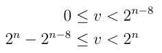

> 导航：[总目录](../../README.md) · [technotes](../../_indexes/technotes.md)


Technical Note TN2201

# Final Cut Pro - The 'r4fl' Pixel Format

Discusses the `'r4fl'` pixel format required to support greater than 8-bit rendering in Final Cut Pro.

[Background](#apple-f4xwc4dqnrsv64tfmyxwi33df52wszbpirkfgnbqgaydoojsgiwugsbrfvjukq2ujfhu4mi)[Format Description](#apple-f4xwc4dqnrsv64tfmyxwi33df52wszbpirkfgnbqgaydoojsgiwugsbrfvjukq2ujfhu4mq)[Additional Details](#apple-f4xwc4dqnrsv64tfmyxwi33df52wszbpirkfgnbqgaydoojsgiwugsbrfvjukq2ujfhu4my)[Codec Pixel Format Resource - 'cpix'](#apple-f4xwc4dqnrsv64tfmyxwi33df52wszbpirkfgnbqgaydoojsgiwugsbrfvjvkqstivbviskpjyzq)[Decompressors Generating 'rf4l'](#apple-f4xwc4dqnrsv64tfmyxwi33df52wszbpirkfgnbqgaydoojsgiwugsbrfvjvkqstivbviskpjy2a)[Compressors Receiving 'r4fl'](#apple-f4xwc4dqnrsv64tfmyxwi33df52wszbpirkfgnbqgaydoojsgiwugsbrfvjvkqstivbviskpjy2q)[Color Information](#apple-f4xwc4dqnrsv64tfmyxwi33df52wszbpirkfgnbqgaydoojsgiwugsbrfvjvkqstivbviskpjy3a)[References](#apple-f4xwc4dqnrsv64tfmyxwi33df52wszbpirkfgnbqgaydoojsgiwugsbrfvjukq2ujfhu4oa)[Document Revision History](#apple-f4xwc4dqnrsv64tfmyxwi33df52wszbpirkfgnbqgaydoojsgiwvezlwnfzws33ojbuxg5dpoj4s2rdpnz2ey2lonncwyzlnmvxhiskel4yq)

## Background

Since the release of Final Cut 3.0, rendering operations can go though either an 8-bit RGB path or an 8-bit Y’CbCr (`'r408'` pixel format) processing path. For your average user working with DV media, applying transitions and some simple titling, 8-bit rendering may be perfectly sufficient.

However, high-end users capturing and outputting 10-bit media, or even 8-bit users applying multiple effects/compositing require higher quality processing.

Apple has defined a 32-bit per component floating point rendering format called `'r4fl'` allowing Final Cut Pro to transparently support greater than 8-bit rendering operations.

Supporting a 10-bit render path allows you to:

- Preserve the native 10-bit media throughout the entire rendering pipeline.
- Avoid repeated quantization down to 8-bits between filters/compositing operations.

__Note:__ `'r4fl'` is intended as a rendering format not a storage format and therefore is __independent__ of the disk storage format a vendor may choose to implement. Additionally since it is a render format, the byte-order is considered to be native.

QuickTime has documented a greater than 8 bit on-disk storage format called 'v210' discussed in the [Uncompressed Y'CbCr Video in QuickTime Files](https://developer.apple.com/quicktime/icefloe/dispatch019.html) Ice Floe document.

[Back to Top](#)

## Format Description

In order to send 10-bit YUV data through the Final Cut Pro image processing path, an Image Codec must accept and provide pixel data in the Final Cut Pro 32-bit per component rendering pixel format defined by the Four Character Code `'r4fl'`.

`'r4fl'` is closely derived from the 8-bit ['r408'](https://developer.apple.com/quicktime/icefloe/dispatch027.html) rendering pixel format but supports superblack and of course has more bits of precision.

`'r4fl'` is a fully sampled 4:4:4:4 format (components are not shared across pixels) and allows Final Cut Pro to operate transparently in greater than 8-bit rendering configurations.

__Important:__ While this technical note refers to the chroma channels as "Cb/Cr", be aware that this is simply for convenience. The ranges differ from true "Cb/Cr" as well as "Pb/Pr".

For example:

- Cb/Cr, center = 128, max recommended excursion = 112
- Pb/Pr, center = 0, excursion=0.5

__Table 1__  Component Range

|  |  |  |
| A | Full transparency = 0.0; Full opacity = 1.0 | Corresponds to r408 0-255 |
| Y | CCIR-black = 0.0; CCIR-white = (235 - 16) / 255 = (940 - 64) / 1020 = ~0.859 | Corresponds to r408 0 - 255 (superblack represented as negative) |
| Cb | Achromatic ("neutral") = 128 / 255 = 512 / 1020 = ~0.502; Nominal peaks at 16 / 255 = 64 / 1020 = ~0.0627 and 240 / 255 = 960 / 1020 = ~0.941 | Corresponds to r408 0 - 255 ("neutral" = ~0.502) |
| Cr | Same ranges as Cb | Same ranges as Cb |

__Note:__ As shown above, `'r408'` and `'r4fl'` values correspond by normalizing by 255 (regardless of component).

__Table 2__

[Back to Top](#)

## Additional Details

### Codec Pixel Format Resource - 'cpix'

Both the Image Decompressor ('imdc') and Image Compressor ('imco') will need to supply a `'cpix'` component public resource used to inform Final Cut Pro (and other applications) that the Image Codec supports `'r4fl'` rendering (this is no different that what would need to be done when supporting the `'r408'` pixel format).

A codec advertising support for `'2vuy'`, `'r408'` and `'r4fl'` would for example, include a `'cpix'` resource as part of its public resource list (`'thnr'`) which looks like Listing 1.

__Listing 1__  Codec Pixel Format and Component Public Resource Map

```
resource 'cpix' (kMyCPIXResID) {     {         '2vuy','r408','r4fl'     } };  resource 'thnr' (kMyTHNRResID) {     {         'cdci', 1, 0,         'cdci', kMyCDCIResID, 0,          'cpix', 1, 0,         'cpix', kMyCPIXResID, 0,     } };
```

### Decompressors Generating 'rf4l'

Image Decompressors are expected to convert subsampled (eg. 4:2:2) material into the appropriate 4:4:4:4 format. It is the implementor's decision as to what approach is used to synthesize the missing chroma value.

If the on-disk format does not include alpha, the Image Decompressor should fill the entire alpha channel with 1.0 (opaque).

### Compressors Receiving 'r4fl'

Image Compressors are expected to convert the fully sampled 4:4:4:4 material into the appropriate subsampled format (eg. 4:2:2) as needed. It is the implementor's decision what filtering (if any) is used during the conversion.

The values supplied in the pixel buffer may include illegal undershoot/overshoot. It is the compressor's responsibility to clamp these values into the minimum/maximum legal SDI signal (but continue to allow values outside of CCIR recommendations).

For example, when converting an fp Y-value to 10-bit, the math would normally look like a multiplication.

However, Yint is constrained by the illegal CCIR values shown in Figure 1.

__Figure 1__



In other words, for n = 10-bits, the values 0, 1, 2, 3 and 1020, 1021, 1022, 1023 are illegal (reserved) synchronization values. Values of “>=4” and “<= 1019” may include values outside of CCIR recommendations, but should be preserved in the data, to allow preservation of superblack/superwhite material and so on.

It is the implementor's (hardware or compressor) responsibility to prevent these illegal values from being sent out in a digital stream. It is probably simplest for the Image Compressor to clamp these values.

### Color Information

It is expected that Image Codecs outputting `'r4fl'` will operate natively at CCIR video gamma.

Final Cut Pro assumes the following for `'r4fl'` pixel buffers:

- Primaries - SMPTE C primaries for Standard Definition Video (`kQTPrimaries_SMPTE_C`) and ITU-R BT.709-2 primaries for High Definition Video (`kQTPrimaries_ITU_R709_2`).
- Transfer Function - ITU-R BT.709-2 (`kQTTransferFunction_ITU_R709_2`).
- Matrix - ITU-R BT.601-4 for Standard Definition Video (`kQTMatrix_ITU_R_601_4`) and ITU-R BT.709-2 for High Definition Video (`kQTMatrix_ITU_R_709_2`).
[Back to Top](#)

## References

- [Rendering in Y'CbCr](https://developer.apple.com/quicktime/icefloe/dispatch027.html)
- [Uncompressed Y'CbCr Video in QuickTime Files](https://developer.apple.com/quicktime/icefloe/dispatch019.html)
- [QuickTime Pixel Format FourCCs](https://developer.apple.com/quicktime/icefloe/dispatch020.html)

[Back to Top](#)

---

#### Document Revision History

| __Date__ | __Notes__ |
| 2009-05-18 | Editorial |
| 2008-08-06 | New document that describes the 'r4fl' pixel format used by Final Cut Pro to support greater than 8-bit rendering. |

