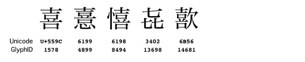
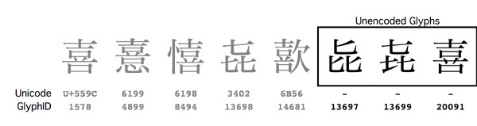
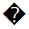
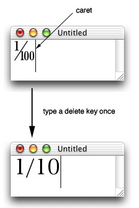
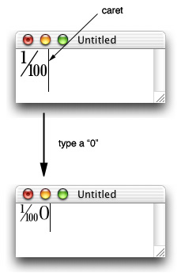

> 导航：[总目录](../../README.md) · [technotes](../../_indexes/technotes.md)


# Retired Document

__Important:__
This document may not represent best practices for current development. Links to downloads and other resources may no longer be valid.

Technical Note TN2079

# Glyph Access Protocol

__Important:__ This document may not represent best practices for current development. Links to downloads and other resources may no longer be valid.

The fonts included in Mac OS X contain thousands of glyphs that are outside the scope of Unicode. The Glyph Access Protocol allows applications and input methods to manipulate these unencoded glyphs.

This technical note describes how to support such glyphs using the Text Services Manager, ATSUI, Cocoa, and how to perform data exchange using the clipboard. Application and input method developers who wish to implement support for these services should read this technote.

[Introduction](#apple-f4xwc4dqnrsv64tfmyxwi33df52wszbpirkfgmjqgaydgmbzgywugsbrfveu4vcsj5cfkq2ujfhu4)[Representing Glyphs](#apple-f4xwc4dqnrsv64tfmyxwi33df52wszbpirkfgmjqgaydgmbzgywugsbrfvjukq2ujfhu4mi)[Text Services Manager Protocol](#apple-f4xwc4dqnrsv64tfmyxwi33df52wszbpirkfgmjqgaydgmbzgywugsbrfvjukq2ujfhu4mq)[Enabling Glyph Input for TSM Documents](#apple-f4xwc4dqnrsv64tfmyxwi33df52wszbpirkfgmjqgaydgmbzgywugsbrfvjukq2ujfhu4my)[ATSUI and Unencoded Glyphs](#apple-f4xwc4dqnrsv64tfmyxwi33df52wszbpirkfgmjqgaydgmbzgywugsbrfvjukq2ujfhu4na)[Cocoa and Unencoded Glyphs](#apple-f4xwc4dqnrsv64tfmyxwi33df52wszbpirkfgmjqgaydgmbzgywugsbrfvjukq2ujfhu4ni)[Scrap Type](#apple-f4xwc4dqnrsv64tfmyxwi33df52wszbpirkfgmjqgaydgmbzgywugsbrfvjukq2ujfhu4nq)[Guidelines for Editing Unencoded Glyphs](#apple-f4xwc4dqnrsv64tfmyxwi33df52wszbpirkfgmjqgaydgmbzgywugsbrfvjukq2ujfhu4ny)[Summary](#apple-f4xwc4dqnrsv64tfmyxwi33df52wszbpirkfgmjqgaydgmbzgywugsbrfvjukq2ugy)[References](#apple-f4xwc4dqnrsv64tfmyxwi33df52wszbpirkfgmjqgaydgmbzgywugsbrfvjekrsfkjcu4q2fkm)[Text Services Manager](#apple-f4xwc4dqnrsv64tfmyxwi33df52wszbpirkfgmjqgaydgmbzgywugsbrfvjekrsfkjcu4q2fkmwvirkykrpvgrkskzeugrktl5guctsbi5cve)[Apple Type Services for Unicode Imaging (ATSUI)](#apple-f4xwc4dqnrsv64tfmyxwi33df52wszbpirkfgmjqgaydgmbzgywugsbrfvjekrsfkjcu4q2fkmwucucqjrcv6vczkbcv6u2fkjlesq2fknpumt2sl5ku4skdj5cekx2jjvauoskoi5pv6qkuknkusxy)[Carbon Event Manager](#apple-f4xwc4dqnrsv64tfmyxwi33df52wszbpirkfgmjqgaydgmbzgywugsbrfvjekrsfkjcu4q2fkmwugqksijhu4x2fkzcu4vc7jvau4qkhivja)[Fonts and Tools](#apple-f4xwc4dqnrsv64tfmyxwi33df52wszbpirkfgmjqgaydgmbzgywugsbrfvjekrsfkjcu4q2fkmwumt2okrjv6qkoirpvit2pjrjq)[Adobe-Japan Character Collections](#apple-f4xwc4dqnrsv64tfmyxwi33df52wszbpirkfgmjqgaydgmbzgywugsbrfvjekrsfkjcu4q2fkmwucrcpijcv6ssbkbau4x2djbaveqkdkrcvex2dj5geyrkdkreu6tst)[Document Revision History](#apple-f4xwc4dqnrsv64tfmyxwi33df52wszbpirkfgmjqgaydgmbzgywvezlwnfzws33ojbuxg5dpoj4s2rdpnz2ey2lonncwyzlnmvxhiskel4yq)

## Introduction

The Glyph Access Protocol allows application and input method developers to support __unencoded glyphs__. In the context of this document, an unencoded glyph is a glyph contained in a font, yet not defined in the Unicode 3.2 standard. In other words, the glyph cannot be accessed by standard Unicode APIs and there is no entry for the glyph in the font's Unicode mapping table. Many fonts in Mac OS X contain unencoded glyphs. The Japanese font Hiragino Mincho Pro W3, for example, contains over 7,000 such glyphs.

Figure 1 illustrates 5 different variations of the Kanji "Ki". The 5 most common variations are defined in the Unicode 3.2 standard as U+559C, U+6199, U+6198, U+3402 and U+6B56.

__Figure 1__  Variants of the Kanji \"Ki\" defined in Unicode.



In reality, the Hiragino fonts in Mac OS X contain not 5, but 8 variations of the Kanji "Ki". As illustrated in Figure 2, the first 5 characters are defined in Unicode. However, the remaining 3 glyphs are not defined in Unicode and can only be referenced by their Glyph IDs.

__Figure 2__  All existing variants of the Kanji \"Ki\".



The Glyph Access Protocol allows developers to accomplish the following tasks:

- Support all glyphs (including unencoded glyphs) contained in fonts.
- Allow applications to exchange glyph data using the clipboard.
- Provide reasonable fallback behavior when glyphs are copied to non-glyph aware applications.
- Allow applications that support rich text layout using Cocoa, ATSUI or MLTE to add support for unencoded glyphs with minimal effort.
- Maintain consistency with basic text operations, including editing and searching text on base characters.

The Glyph Access Protocol does not provide the following services:

- __Cross-platform data exchange__. The Glyph Access Protocol is a contained imaging solution. File systems, databases, and Internet applications that exchange data with other platforms are outside the scope of the current implementation.
- __Support for non-Unicode applications__. The Glyph Access Protocol assumes the use of Unicode as a text encoding. Applications that are not Unicode-aware cannot take advantage of the protocol.

[Back to Top](#)

## Representing Glyphs

In order to support unencoded glyphs, there needs to be a standard way to specify glyphs by their glyph ID. The Glyph Access Protocol uses styled text to specify glyphs. Applications and input methods support unencoded glyphs by supporting an additional glyph style.

In the Glyph Access Protocol, each glyph is represented by a __base Unicode sequence__ and a __glyph attribute__ modifier. Glyph attributes must never overlap each other in a text run.

The base Unicode sequence is an array of Unicode characters that best describe the glyph. The base Unicode sequence defines the behavior of the text in operations such as editing and searching. The base Unicode sequence also defines fallback behavior for the text when the glyph attribute is lost or when the data is transfered to applications that do not support glyph attributes. In cases where the Unicode standard does not define an appropriate base sequence, the character 

(U+FFFD "REPLACEMENT CHARACTER") is used as the base Unicode sequence.

The glyph attribute specifies the actual glyph with which the base Unicode sequence is to be displayed. The glyph is identified by a font and a CID or GID. The glyph attribute data structure `TSMGlyphInfo` is defined below.

[Back to Top](#)

## Text Services Manager Protocol

Input methods send glyphs to applications using the optional `kEventParamTextInputGlyphInfoArray` parameter in text input events.

When your application receives a Carbon event with a `kEventParamTextInputGlyphInfoArray` parameter, it indicates that the event contains one or more glyphs. The following four Carbon text input events can carry the  `kEventParamTextInputGlyphInfoArray` parameter:

```
kEventTextInputUpdateActiveInputArea
kEventTextInputUnicodeForKeyEvent
kEventTextInputGetSelectedText
kEventTextInputUnicodeText
```

The `kEventTextInputGetSelectedText` parameter is a `TSMGlyphInfoArray`. `TSMGlyphInfoArray` is defined as follows:

__TextServices.h__

```swift
struct TSMGlyphInfoArray {
    ItemCount       numGlyphInfo; // UInt32
    TSMGlyphInfo    glyphInfo[];
};

struct TSMGlyphInfo {
    CFRange         range; // UTF16 offsets (two 32-bit integers)
    ATSFontRef      fontRef;
    UInt16          collection; // Glyph collection
    UInt16          glyphID; // GID (if collection is zero) or CID
};
```

`TSMGlyphInfo` corresponds to and describes one glyph embedded in a run of text.

`TSMGlyphInfo`.range specifies, in UTF-16 offsets, a range within the `TextInput text` to which this `TSMGlyphInfo` applies. It is the base Unicode sequence for the glyph.

`TSMGlyphInfo`.collection specifies how `TSMGlyphInfo`.`glyphID` should be interpreted. When the value is `kGlyphCollectionGID` (zero), `glyphID` specifies the glyph's ID. When it is a non-zero value, the value specifies a character collection and `glyphID` specifies a CID. `TSMGlyphInfo`.`fontRef` specifies the font with which the glyph should be displayed. `TSMGlyphInfo`.collection must match the character collection of the font defined in `fontRef`. When collections do not match, `TSMGlyphInfo` is invalid and should be ignored.

```
enum {
    kGlyphCollectionGID         = 0; // GlyphID is a glyph ID
    kGlyphCollectionAdobeCNS1   = 1;
    kGlyphCollectionAdobeGB1    = 2;
    kGlyphCollectionAdobeJapan1 = 3;
    kGlyphCollectionAdobeJapan2 = 4;
    kGlyphCollectionAdobeKorea1 = 5;
    kGlyphCollectionUnspecified = 0xFF; // Unspecified
                                           // glyphID is a CID
};
```

When `TSMGlyphInfo`.`glyphID` is zero, instead of specifying a glyph, `TSMGlyphInfo` is used to attach a font to a range of text. In this case, `TSMGlyphInfo`.`fontRef` specifies a font that should be used to display the range of text specified by `TSMGlyphInfo`.range. This is useful when using characters in the Unicode private use area. Windings and other Windows based pi fonts (symbol fonts) are examples of such characters. When `TSMGlyphInfo`.`glyphID` is zero, `TSMGlyphInfo`.collection should also be zero and applications should ignore its value.

Input method developers should use this attribute carefully since specifying fonts in input streams can lead to a confusing user interface. This attribute should be used only in cases where it is absolutely necessary. Some valid examples include entering unencoded glyphs and specifying the display font for characters in the private use area.

Once an application receives text from an input method, it is free to convert the text to its internal representations. However, the data must be converted back to the same `TSMGlyphInfo` format when the application responds to `kEventTextInputGetSelectedText`.

The `glyphID` can be translated into equivalent OpenType or AAT features that create the same result from the base character sequence. If you choose to do this, you should __not__ assume that OpenType or AAT tables are common across fonts, even if they have the same character collection. Since CIDs are guaranteed to be identical across fonts with the same character collection, CIDs are generally more robust than OpenType or AAT features.

AAT features are described at [http://developer.apple.com/fonts/](https://developer.apple.com/fonts/).

`ATSFontRef` can be converted to `ATSUFontID` by calling `FMGetFontFromATSFontRef()`.

[Back to Top](#)

## Enabling Glyph Input for TSM Documents

Applications that support input of unencoded glyphs must notify the Text Service Manager and input methods by setting the `kTSMDocumentPropertySupportGlyphInfo` property of each TSMDocument.

```
enum { kTSMDocumentPropertySupportGlyphInfo = 'dpgi' };

extern OSStatus TSMSetDocumentProperty(
    TSMDocumentID    docID,
    OSType           propertyTag,
    UInt32           propertySize,
    void *           propertyData);

extern OSStatus TSMGetDocumentProperty(
    TSMDocumentID    docID,
    OSType           propertyTag,
    UInt32           bufferSize,
    UInt32 *         actualSize,
    void *           propertyBuffer);
```

Input methods must examine the `kTSMDocumentPropertySupportGlyphInfo` property to determine whether the current TSMDocument supports glyph input.

__Note:__ Kotoeri and the Character Palette in Mac OS X 10.2 ignore the `kTSMDocumentPropertySupportGlyphInfo` property, but future versions will test the property before enabling glyph input in their user interfaces.

[Back to Top](#)

## ATSUI and Unencoded Glyphs

Unencoded glyphs are represented in ATSUI in a similar manner to the Text Services Manager protocol. Each `TSMGlyphInfo` structure is converted to the following data structure and attached to the style run as an ATSUI attribute.

When GlyphInfo.`glyphID` is non-zero, i.e. `GlyphInfo.collection` and GlyphInfo.`glyphID` contain valid data, these two fields are converted to an `ATSUGlyphSelector` attached with an `kATSUGlyphSelectorTag`.

When GlyphInfo.`fontRef` is not `kATSFontRefUnspecified` (zero), it is converted to an `ATSUFontID` attached with an `kATSUFontTag`.

```swift
enum { kATSUGlyphSelectorTag = 287L }; // type ATSUGlyphSelector
enum { kATSUFontTag = 261L }; // type ATSUFontID

struct ATSUGlyphSelector {                // 32bit selector
    UInt16    collection; // kGlyphCollectionXXX enum
    UInt16    glyphID; // GID (when collection==0) or CID
};
```

ATSUI is described at [http://developer.apple.com/documentation/Carbon/text/ATSUI/atsui.html](https://developer.apple.com/documentation/Carbon/text/ATSUI/atsui.html)

[Back to Top](#)

## Cocoa and Unencoded Glyphs

Glyph Access support in Cocoa is described below:

NSGlyphInfo:

[http://developer.apple.com/documentation/Cocoa/Reference/ApplicationKit/ObjC_classic/Classes/NSGlyphInfo.html](https://developer.apple.com/documentation/Cocoa/Reference/ApplicationKit/ObjC_classic/Classes/NSGlyphInfo.html)

NSTextView provides the following methods to enable entry of unencoded glyphs in text. For details on each method, see the related,documenttation.

```objc
 - (BOOL)acceptsGlyphInfo;
```

[http://developer.apple.com/documentation/Cocoa/Reference/ApplicationKit/ObjC_classic/Classes/NSTextView.html#BBCBBGIG](https://developer.apple.com/documentation/Cocoa/Reference/ApplicationKit/ObjC_classic/Classes/NSTextView.html#BBCBBGIG)

```objc
- (void)setAcceptsGlyphInfo:(BOOL)flag;
```

[http://developer.apple.com/documentation/Cocoa/Reference/ApplicationKit/ObjC_classic/Classes/NSTextView.html#BBCIHACG](https://developer.apple.com/documentation/Cocoa/Reference/ApplicationKit/ObjC_classic/Classes/NSTextView.html#BBCIHACG)

The TextEdit application in Mac OS X 10.2 and later supports the Glyph Access Protocol. Using TextEdit you can input, copy, paste and save unencoded glyphs.

[Back to Top](#)

## Scrap Type

The standard ATSUI representation is used to exchange text via the clipboard. "utxt" should have the same base character sequence as the TSM protocol. "ustl" will have the ATSUI attributes described above.

[Back to Top](#)

## Guidelines for Editing Unencoded Glyphs

In general, the behavior of text with a glyph attribute is identical to the behavior of the base Unicode sequence minus the glyph attribute. When any part of the base Unicode sequence is modified, the glyph attribute should be removed.

For example, say you have the special glyph "1/100" (one-hundredth or CID position 9824) with the base Unicode sequence "1" (one), "/" (slash), "1" (one), "0" (zero), "0" (zero). If you place the caret at the end of the sequence and press the delete key once, the base Unicode sequence will become "1" (one), "/" (slash), "1" (one), "0" (zero). As soon as the base Unicode sequence becomes "1/10", the sequence should no longer should be displayed with the glyph "1/100" (one-hundredth). The same rule applies when you modify the contents of the base Unicode sequence. For example, when "1/100" becomes "1/200".

__Figure 3__  Editing behavior and the glyph attribute words.



Unlike ordinary styles, a glyph attribute must never expand its range when text is inserted after the base Unicode sequence. For example, if you type a "0" (zero) after the glyph "1/100" (one-hundredth), the text should by displayed as the glyph "1/100" (one-hundredth) followed by a "0" (zero).

__Figure 4__  Editing behavior and the glyph attribute words.



When the user attempts to change the font of a glyph to a font that is inconsistent with the glyph attribute, your application can choose to notify the user of the inconsistency or simply ignore the glyph attribute when rendering the text.

[Back to Top](#)

## Summary

The fonts included in Mac OS X contain thousands of glyphs that are inaccessible using standard Unicode APIs. The Glyph Access Protocol defines a standard mechanism to access and exchange these unencoded glyphs with input methods and other applications.

[Back to Top](#)

## References

### Text Services Manager

[http://developer.apple.com/documentation/Carbon/text/TextServicesManager/textservicesmgr.html](https://developer.apple.com/documentation/Carbon/text/TextServicesManager/textservicesmgr.html)

### Apple Type Services for Unicode Imaging (ATSUI)

[http://developer.apple.com/documentation/Carbon/text/ATSUI/atsui.html](https://developer.apple.com/documentation/Carbon/text/ATSUI/atsui.html)

### Carbon Event Manager

[http://developer.apple.com/documentation/Carbon/oss/CarbonEventManager/carboneventmanager.html](https://developer.apple.com/documentation/Carbon/oss/CarbonEventManager/carboneventmanager.html)

### Fonts and Tools

[http://developer.apple.com/fonts/](https://developer.apple.com/fonts/)

### Adobe-Japan Character Collections

[Adobe-Japan1-4 Character Collection for CID-Keyed Fonts](http://partners.adobe.com/asn/developer/pdfs/tn/5078.Adobe-Japan1-4.pdf) (PDF)

[Adobe-Japan1-5 Character Collection for CID-Keyed Fonts](http://partners.adobe.com/asn/developer/pdfs/tn/5146.Adobe-Japan1-5.pdf) (PDF)

[Back to Top](#)

---

#### Document Revision History

| __Date__ | __Notes__ |
| 2014-03-06 | How to support unencoded glyphs using the TSM, ATSUI and Cocoa. |
| 2003-05-06 | New document that how to support unencoded glyphs using the TSM, ATSUI and Cocoa. |

