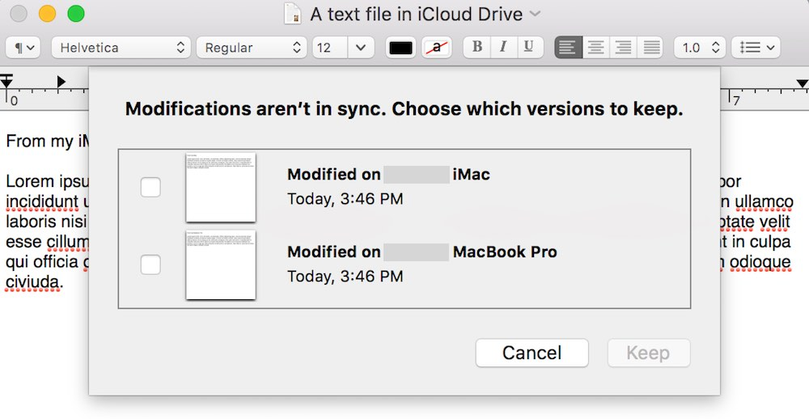

> 导航：[总目录](../../README.md) · [technotes](../../_indexes/technotes.md)


Technical Note TN2336

# Handling version conflicts in the iCloud environment

This technical note first introduces two scenarios that can lead to conflicts in the iCloud environment, then describes the different behaviors of iCloud Drive when the conflicts occurs on different iCloud container areas, and finally discusses how to handle version conflicts from within your apps.

[Introduction](#apple-f4xwc4dqnrsv64tfmyxwi33df52wszbpirkfgnbqgaytomjrgywugsbrfvke4vcbi4yq)[Understanding the conflicts in the iCloud environment](#apple-f4xwc4dqnrsv64tfmyxwi33df52wszbpirkfgnbqgaytomjrgywugsbrfvke4vcbi4za)[The document scope and data scope in an iCloud container](#apple-f4xwc4dqnrsv64tfmyxwi33df52wszbpirkfgnbqgaytomjrgywugsbrfvke4vcbi4zq)[Handling version conflicts in document-based apps](#apple-f4xwc4dqnrsv64tfmyxwi33df52wszbpirkfgnbqgaytomjrgywugsbrfvke4vcbi42a)[Handling version conflicts in non-document-based apps](#apple-f4xwc4dqnrsv64tfmyxwi33df52wszbpirkfgnbqgaytomjrgywugsbrfvke4vcbi42q)[Document Revision History](#apple-f4xwc4dqnrsv64tfmyxwi33df52wszbpirkfgnbqgaytomjrgywvezlwnfzws33ojbuxg5dpoj4s2rdpnz2ey2lonncwyzlnmvxhiskel4yq)

## Introduction

In the iCloud environment, it is possible that a user, accidentally or not, saves changes to the same file, or creates files with the same name, from multiple devices. Depending on the networking condition and the timing of synchronization, these actions likely, or even inevitably, lead to conflicts. Understanding and handling the conflicts are important for iCloud apps.

[Back to Top](#)

## Understanding the conflicts in the iCloud environment

In the real world, users may not see many conflicts when using apps. The reason is that the conflicts almost always happen randomly and most of them are invisible if the apps don't present them intentionally, or the apps have silently handled the conflicts without any user interaction. However, app developers can easily trigger a conflict by changing an existing file simultaneously from two peers. Here is how:

1. Prepare two Macs running the latest OS X, log in with a same Apple ID, and make iCloud Drive ready for use. Then connect the Macs to the Internet and make sure the network condition is good.
2. On one Mac, use TextEdit to create a file and save it to iCloud Drive. The file will soon synchronize to the other Mac.
3. On both Macs, open the file, make changes on the contents, and save the file at the same time.

After the save is synchronized, TextEdit should detect a version conflict and present a sheet for you to pick a winning version, as shown in Figure 1:

__Figure 1__  A version conflict in TextEdit.



Creating a file with the same name from two peers can trigger a conflict as well. Here are the steps to see that on iOS:

1. Prepare two devices running the latest iOS, log in with a same Apple ID, and make iCloud Drive ready for use.
2. Connect one device to the Internet and make sure the network condition is good, then turn on airplane mode on the other device so that nothing can synchronize through iCloud.
3. On the first device, create a file named “abc.txt”, add some text, and save it in the `Documents` folder of your iCloud container. (You may want to write a test app for this experiment as this needs to be done with code.) The file should soon synchronize through iCloud.
4. Do the same thing as step 3 on the second device, making sure the file on this device has different contents.
5. Now turn off airplane mode on the second device and connect it to the Internet. The device should soon synchronize through iCloud.

After the devices are synchronized, you should be able to see two files, “abc.txt” and “abc 2.txt”, appearing in your iCloud container. What happens here is that, when getting a new file from a different peer that has the same name as an existing file, iCloud Drive detects a new-file conflict and automatically handles it by giving the new file a bounced file name, which is generated by appending a number suffix to original file name. (The number suffix is bounced based on the existing file name, such as "abc 2.txt" based on "abc.txt", or "abc 3.txt" based on "abc 2.txt".)

To stably trigger the conflict in this case, we turn on airplane mode to ensure that the file created in the first device doesn’t synchronize to the second device before the second file is created. In the real world, the devices may not be in airplane mode, yet conflicts can still happen when the network condition is bad, thus are subtle and hard to reproduce.

__Note:__ When handling a new-file conflict, iCloud Drive looks into the contents of the files. If they are the same, iCloud Drive will determine that there is no conflict, thus won’t create a bounced file (a new file with a bounced file name).

[Back to Top](#)

## The document scope and data scope in an iCloud container

Creating a bounced file when a new-file conflict occurs is only applied to iCloud documents (including files and file packages) locating in the `Documents` folder. In an iCloud container, the `Documents` folder, also known as the "document scope", is for storing user-manageable documents, which users can see and delete individually when visiting `System` `Preferences` (OS X) or `Settings` (iOS). The `Documents` folder can also be exposed to iCloud Drive (see [Enabling Document Storage in iCloud Drive](https://developer.apple.com/library/mac/documentation/General/Conceptual/iCloudDesignGuide/Chapters/DesigningForDocumentsIniCloud.html#//apple_ref/doc/uid/TP40012094-CH2-SW20) for details), thus can be managed by users using `Finder` (OS X) or iCloud Drive app (iOS). When we duplicate a file with `Finder`, a bounced file is created under the same folder. Similarly, when a new-file conflict happens in the document scope, iCloud Drive creates a bounced file.

Files and file packages that are not managed by users should normally be stored outside of the `Documents` folder, where it is known as the "data scope", in an iCloud container. In `System` `Preferences` or `Settings`, the data-scoped files and file packages are grouped together as “data” and can be deleted by users only as a monolithic group. When conflicts happen in the data scope, iCloud Drive won’t create bounced files – it instead resolves them automatically by picking up a winning version and keeping the other changes in a losing version. So except for the new-file conflicts happening in the document scope causing bounced files to be generated, iCloud Drive automatically creates new versions for all other conflicts.

__Important:__ If you do not explicitly remove the versions that are no longer useful, they will continue to synchronize to all iCloud peers and consume the user's iCloud quota. So apps working heavily with iCloud files or file packages should observe the version conflicts and remove the useless versions, even though they don’t have to do a custom merge.

[Back to Top](#)

## Handling version conflicts in document-based apps

Handling version conflicts in document-based apps is straightforward because `UIDocument` (iOS) or `NSDocument` (OS X) has done most of the heavy lifting. If possible, app developers should always use `UIDocument` or `NSDocument` to manage their data in the iCloud environment.

On iOS, `UIDocument` posts a `UIDocumentStateChangedNotification` notification when a version conflict occurs in the document. You can observe the notification and implement your conflict-resolution strategies in the handler. For details on this topic, please see [Resolving Document Version Conflicts](https://developer.apple.com/library/ios/documentation/DataManagement/Conceptual/DocumentBasedAppPGiOS/ResolveVersionConflicts/ResolveVersionConflicts.html#//apple_ref/doc/uid/TP40011149-CH6-SW1) section in Document-Based App Programming Guide for iOS.

On OS X, `NSDocument` resolves conflicts automatically, including presenting a sheet for the user to pick the winner when a version conflict is detected (see Figure 1) and allowing the user to manage the document versions. The details are covered in [NSDocument Handles Conflict Resolution Among Document Versions](https://developer.apple.com/library/mac/documentation/DataManagement/Conceptual/DocBasedAppProgrammingGuideForOSX/ManagingLifecycle/ManagingLifecycle.html#//apple_ref/doc/uid/TP40011179-CH4-SW20) section in Document-Based App Programming Guide for Mac.

[Back to Top](#)

## Handling version conflicts in non-document-based apps

There are some scenarios where you are unable to use document objects. For example, if you want to handle version conflicts in a custom way in OS X, you can’t use `NSDocument` because it doesn’t provide interfaces for the customization.

To handle version conflicts in non-document-based apps, you can implement the `NSFilePresenter` protocol to get notified of version changes, then use the `NSFileVersion` class to get the versions of an URL and implement your own conflict-resolution strategies. When a version change occurs, one of the methods shown in Listing 1, if implemented, should be called:

__Listing 1__  Version-related methods in the `NSFilePresenter` protocol.

```swift
// For a file or file package
public func presentedItemDidGainVersion(version: NSFileVersion)
public func presentedItemDidLoseVersion(version: NSFileVersion)
public func presentedItemDidResolveConflictVersion(version: NSFileVersion)

// For a folder
public func presentedSubitemAtURL(url: NSURL, didGainVersion version: NSFileVersion)
public func presentedSubitemAtURL(url: NSURL, didLoseVersion version: NSFileVersion)
public func presentedSubitemAtURL(url: NSURL, didResolveConflictVersion version: NSFileVersion)
```

You can also choose to implement the `relinquishPresentedItemToWriter` method and check the version changes in the closure passed to the `writer`, as shown in Listing 2:

__Listing 2__  Check version changes after the presented item has been changed.

```swift
public func relinquishPresentedItemToWriter(writer: ((() -> Void)?) -> Void) {

    <Prepare for another object to write to the file>
    // Now let the writer know that it can have the file.
    // But pass a reacquisition block so that this object
    // can update itself when the writer is done.
    writer(){
        <Checking and handling the version changes here.>
    }
}
```

After resolving the version conflicts, you can use `NSFileVersion`'s `removeOtherVersionsOfItemAtURL` method to remove the useless versions. See [An Example: Letting the User Pick the Version](https://developer.apple.com/library/ios/documentation/DataManagement/Conceptual/DocumentBasedAppPGiOS/ResolveVersionConflicts/ResolveVersionConflicts.html#//apple_ref/doc/uid/TP40011149-CH6-SW2) for an example.

__Note:__ In the iCloud environment, every file access in your app, unless it is in the context of the reading or writing methods of `UIDocument` or `NSDocument`, should go through `NSFileCoordinator` so that it can be queued up and coordinated.

[Back to Top](#)

---

#### Document Revision History

| __Date__ | __Notes__ |
| 2016-05-16 | New document that helps you understand version conflicts in the iCloud environment and how to handle them in your apps |

