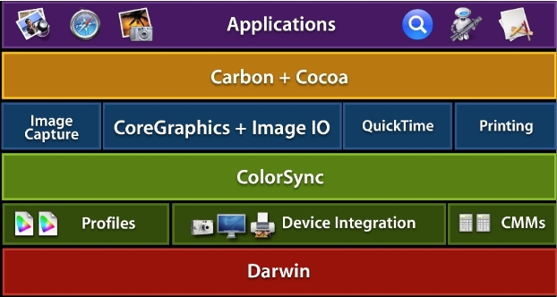
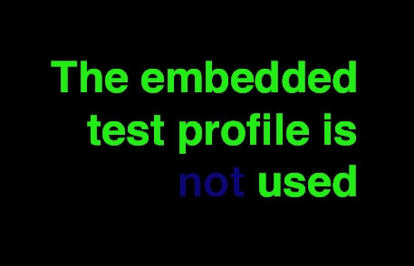

> 导航：[总目录](../../README.md) · [technotes](../../_indexes/technotes.md)

Technical Note TN2115

# Image Color Management

Describes how to easily determine whether or not your application is properly color managed when drawing or printing images and how to modify your code to ensure it is color managed.

[Introduction](#apple-f4xwc4dqnrsv64tfmyxwi33df52wszbpirkfgmjqgaydimbzhawugsbrfvjukq2ujfhu4mi)[Background - Mac OS X Color Management](#apple-f4xwc4dqnrsv64tfmyxwi33df52wszbpirkfgmjqgaydimbzhawugsbrfvjukq2ujfhu4mq)[The Problem](#apple-f4xwc4dqnrsv64tfmyxwi33df52wszbpirkfgmjqgaydimbzhawugsbrfvjukq2ujfhu4my)[How can I verify color management in my application when drawing or printing images?](#apple-f4xwc4dqnrsv64tfmyxwi33df52wszbpirkfgmjqgaydimbzhawugsbrfvjukq2ujfhu4na)[Why isn't my application being properly color managed when drawing or printing images?](#apple-f4xwc4dqnrsv64tfmyxwi33df52wszbpirkfgmjqgaydimbzhawugsbrfvjukq2ujfhu4ni)[How can I fix my application to be properly color managed when drawing or printing images?](#apple-f4xwc4dqnrsv64tfmyxwi33df52wszbpirkfgmjqgaydimbzhawugsbrfvjukq2ujfhu4nq)[Use the Image I/O framework for image handling](#apple-f4xwc4dqnrsv64tfmyxwi33df52wszbpirkfgmjqgaydimbzhawugsbrfvjvkqstivbviskpjy3a)[References](#apple-f4xwc4dqnrsv64tfmyxwi33df52wszbpirkfgmjqgaydimbzhawugsbrfvjukq2ujfhu4oa)[Downloadables](#apple-f4xwc4dqnrsv64tfmyxwi33df52wszbpirkfgmjqgaydimbzhawugsbrfvjukq2ujfhu4oi)[Document Revision History](#apple-f4xwc4dqnrsv64tfmyxwi33df52wszbpirkfgmjqgaydimbzhawvezlwnfzws33ojbuxg5dpoj4s2rdpnz2ey2lonncwyzlnmvxhiskel4yq)

## Introduction

With the growing prevalence of color digital media, such as digital photos, applications that handle color correctly when drawing or printing images benefit greatly by being able to accurately reproduce color over a wide range of devices. This results in a higher quality product and more satisfied customers. But how do you know if your application is properly color managed? Is there a simple test that will give you this information?

This Technote describes one technique for determining whether or not your application is being properly color managed when drawing or printing images.

[Back to Top](#)

## Background - Mac OS X Color Management

Mac OS X takes a system-wide approach to managing color data by integrating ICC color management via ColorSync into all layers of the graphics stack (for more information about ColorSync, please see [TN2035: ColorSync on Mac OS X](https://developer.apple.com/technotes/tn/tn2035.html)).

As Figure 1 shows, ColorSync is built into the system at a low level on top of Darwin. Built on top of ColorSync are a variety of graphics frameworks providing a diverse set of functionality, and most all of these frameworks make use of color management provided by ColorSync.

__Figure 1__  ColorSync Architectural Diagram

Developers who take advantage of the various color managed frameworks in Mac OS X can be confident their applications will display and print images correctly. For example, ColorSync color management on Mac OS X will recognize any profile embedded in an image for the following file formats:

JPEG, GIF, TIFF, PNG, PSD, PICT

When such images are then drawn or printed, the embedded image profile will be correctly color matched against a profile for the destination device (for example a monitor or printer). If no embedded profile is provided with the image file, Mac OS X will assume a Generic RGB color space (see [TN2035: ColorSync on Mac OS X](https://developer.apple.com/technotes/tn/tn2035.html) and [Q&A 1396 Creating color spaces that ensure color matching](https://developer.apple.com/qa/qa2004/qa1396.html)).

[Back to Top](#)

## The Problem

Color plays a very important role in the world of digital media. Color makes a difference—often a dramatic difference—in your images and graphics. Users can be very disappointed when they display or print an image and the color is vastly different from expectations. For this reason, applications that handle color correctly gain a distinct advantage over those that don't. But managing color correctly in your application can be increasingly difficult, and the availability of a wide variety of different image libraries complicates matters even further

So how do you really know if drawing or printing of images is being properly color managed in your application?

Or what if you also make use of a third-party framework in your application? Is there a simple technique for verifying proper color management when displaying or printing images in your application?

One simple technique is the use of images with embedded "trick" profiles. This Technote describes this technique.

[Back to Top](#)

## How can I verify color management in my application when drawing or printing images?

Included with this Technote are a set of image files with embedded "trick" profiles. These aren't "normal" profiles you would expect to see in a typical image file. Instead, these profiles were specially made to allow you to easily tell whether or not ColorSync color management is being performed when the image is drawn or printed. Simply look at the message displayed and you will know right away if the proper color management is being performed (the image files were constructed to display different colors when color managed).

For example, if you draw or print the enclosed image file "`TestRGB.jpg`" in an application which correctly performs color management (such as the Mac OS X Preview application) you should see the output as shown in Figure 2 below. This indicates the application is being properly color managed. In this case, the embedded image profile is being recognized by ColorSync and is being color-matched against an appropriate destination profile:

__Figure 2__  Image file properly color managed.

On the other hand, if you see the following output when drawing/printing the same image then you know your application is not being properly color managed. In this case, the embedded image profile is not being taken into account for any drawing or printing operation.

__Figure 3__  Image file \*not\* properly color managed.

[Back to Top](#)

## Why isn't my application being properly color managed when drawing or printing images?

If you display or print the enclosed images with "trick" profiles in your application and you find they are not being properly color managed it can be for one of the following reasons:

- You are not using one of the available color managed frameworks in Mac OS X which respect image profiles such as the Image I/O framework. For example, you could be using a third-party framework which does not support color management.
- You are using one of the available color managed frameworks in Mac OS X but you are circumventing the built-in color management (for example with the `CGImageCreateCopyWithColorSpace` function or others).
- You are writing your own image handling code but you are ignoring any embedded image profiles.
- You are using device color spaces (see [Q&A 1396 Creating color spaces that ensure color matching](https://developer.apple.com/qa/qa2004/qa1396.html)).

[Back to Top](#)

## How can I fix my application to be properly color managed when drawing or printing images?

What can you do to ensure your application will be properly color managed when drawing or printing images? Follow these guidelines:

- Use one of the available color managed frameworks in Mac OS X which respect embedded image profiles such as the Image I/O framework or the Cocoa `NSImage` class.
- If you are using a third-party image framework make sure it supports color management.
- If you are writing your own custom image-handling code make sure and identify any embedded profiles in your image files and color match these against a device profile for your drawing destination.

For examples of code written using one of the color managed frameworks in Mac OS X take a look at the available [Graphics & Imaging sample code](https://developer.apple.com/samplecode/GraphicsImaging/index-date.html) on the ADC website. For example, see the [ImageApp](https://developer.apple.com/samplecode/ImageApp/index.html) sample code for a good example of use of the Image I/O framework.

### Use the Image I/O framework for image handling

We recommend use of the Image I/O framework, introduced in Mac OS X v10.4, for working with images in your application. The Image I/O framework provides image reading or writing functionality for the Core Graphics framework (the Core Graphics framework and the the Image I/O framework together comprise the Quartz 2D API). The Image I/O framework is also a companion framework to `CGImage`.

Why make use of the Image I/O framework in your application? Because the Image I/O framework makes it easy to work with image file formats in a color managed way. The Image I/O framework provides the best compromise between an API which is easy to work with but at the same time provides access to a diverse set of options.

The Image I/O framework currently supports the following image file formats:

- Web standards

  TIFF, JPEG, PNG, GIF, JPEG-2000
- Floating Point HDR formats

  OpenEXR, Radiance, LogLuv TIFF, Float TIFF, and Pixar TIFF
- Camera Raw formats

  Canon, Nikon, Minolta, Olympus, Sony
- Others

  .bmp, .psd, .qtif, .tga, .sgi, .xbm, .icns, .ico, .pict, .ptng, .fpx
- MetaData

  Exif, IPTC, CIFF, GPS, some MakerNotes, …

ImageIO supports embedded profiles for the following image file formats:

- JPEG, GIF, TIFF, PNG, PSD, PICT

[Back to Top](#)

## References

- [TN2035: ColorSync on Mac OS X](https://developer.apple.com/technotes/tn/tn2035.html)
- [Q&A 1396 Creating color spaces that ensure color matching](https://developer.apple.com/qa/qa2004/qa1396.html)
- [CGImageSource Reference](https://developer.apple.com/documentation/GraphicsImaging/Reference/CGImageSource/index.html)
- [CGImageDestination Reference](https://developer.apple.com/documentation/GraphicsImaging/Reference/CGImageDestination/index.html)
- [Quartz Documentation](https://developer.apple.com/documentation/GraphicsImaging/Quartz-date.html)
- [ImageApp sample code](https://developer.apple.com/samplecode/ImageApp/index.html)

[Back to Top](#)

## Downloadables

- Images with trick profiles. ("tn2115_Images.zip", 870.7K)

[Back to Top](#)

---

#### Document Revision History

| __Date__ | __Notes__ |
| 2006-11-01 | New document that learn how to properly support color management in your application. |

