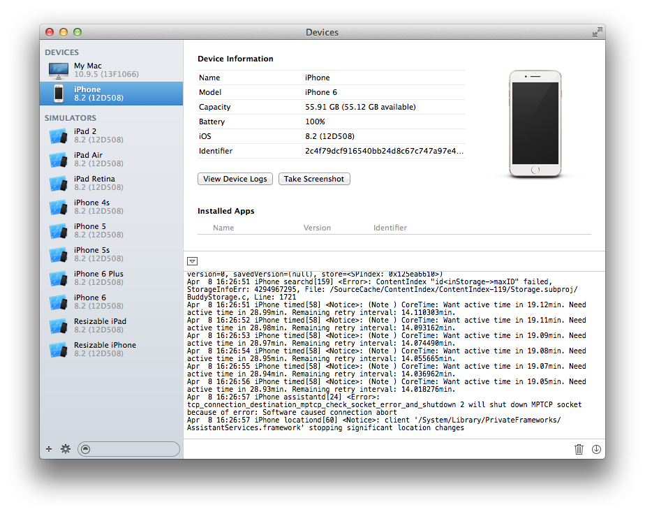

> 导航：[总目录](../../README.md) · [technotes](../../_indexes/technotes.md)


Technical Note TN2319

# Installation Failure Troubleshooting for iOS

This document assists with iOS App installation failures. Use it to diagnose specific causes and resolve app installation failures.

[Scope](#apple-f4xwc4dqnrsv64tfmyxwi33df52wszbpirkfgnbqgaytgnzxhawugsbrfvjugt2qiu)[Troubleshooting Process](#apple-f4xwc4dqnrsv64tfmyxwi33df52wszbpirkfgnbqgaytgnzxhawugsbrfvkfausp)[Extract errors from the device console](#apple-f4xwc4dqnrsv64tfmyxwi33df52wszbpirkfgnbqgaytgnzxhawugsbrfvbu6tstj5gektcpi5dustsh)[List of Installation Error Messages](#apple-f4xwc4dqnrsv64tfmyxwi33df52wszbpirkfgnbqgaytgnzxhawugsbrfvcveuspkjguku2tifdukuy)[Application Verification Failed](#apple-f4xwc4dqnrsv64tfmyxwi33df52wszbpirkfgnbqgaytgnzxhawugsbrfvcvav2b)[Could not verify executable](#apple-f4xwc4dqnrsv64tfmyxwi33df52wszbpirkfgnbqgaytgnzxhawugsbrfvcveuspkjguku2tifdukuzninhvktcel5he6vc7kzcveskglfpukwcfinkviqkcjrcq)[Signer identity related installation failures](#apple-f4xwc4dqnrsv64tfmyxwi33df52wszbpirkfgnbqgaytgnzxhawugsbrfvcveuspkjguku2tifdukuznkneuotsfkjpusrcfjzkesvczl5jektcbkrcuix2jjzjviqkmjraviskpjzpumqkjjrkverkt)[Device UDID missing from provisioning profile related install failures](#apple-f4xwc4dqnrsv64tfmyxwi33df52wszbpirkfgnbqgaytgnzxhawugsbrfvcveuspkjguku2tifdukuznircvmskdivpvkrcjirpu2sktkneu4r27izje6tk7kbje6vsjkneu6tsjjzdv6ucsj5destcfl5jektcbkrcuix2jjzjviqkmjrpumqkjjrkverkt)[Entitlement related installation failures](#apple-f4xwc4dqnrsv64tfmyxwi33df52wszbpirkfgnbqgaytgnzxhawugsbrfvcu4vcjkrgektkfjzkekussj5jfg)[Application is missing the application-identifier entitlement](#apple-f4xwc4dqnrsv64tfmyxwi33df52wszbpirkfgnbqgaytgnzxhawugsbrfvcveuspkjguku2tifdukuznififatcjinaviskpjzpusu27jvevgu2jjzdv6vciivpucucqjreugqkujfhu4x2jircu4vcjizeukus7ivhfiskujrcu2rkokq)[Upgrade's application-identifier does not match the installed app](#apple-f4xwc4dqnrsv64tfmyxwi33df52wszbpirkfgnbqgaytgnzxhawugsbrfvcveuspkjguku2tifdukuznkvieousbircv6u27ififatcjinaviskpjzpusrcfjzkesrsjivjf6rcpivjv6tspkrpu2qkuinef6vciivpuststkrauytcfirpucucq)[Device Console logging 'invalid info dictionary'](#apple-f4xwc4dqnrsv64tfmyxwi33df52wszbpirkfgnbqgaytgnzxhawugsbrfvcveuspkjguku2tifdukuznircvmskdivpugt2oknhuyrk7jrhuor2jjzdv6x2jjzlectcjirpustsgj5puiskdkreu6tsbkjmv6)[Targeted device family related install failures](#apple-f4xwc4dqnrsv64tfmyxwi33df52wszbpirkfgnbqgaytgnzxhawugsbrfvlfoqku)[Deployment target related install failures](#apple-f4xwc4dqnrsv64tfmyxwi33df52wszbpirkfgnbqgaytgnzxhawugsbrfvlfarcu)[A signed resource has been modified or deleted](#apple-f4xwc4dqnrsv64tfmyxwi33df52wszbpirkfgnbqgaytgnzxhawugsbrfvcveuspkjguku2tifdukuznifpvgskhjzcuix2sivju6vksincv6scbknpuerkfjzpu2t2ejfdesrkel5hvex2eivgekvcfiq)[Architecture related installation failures](#apple-f4xwc4dqnrsv64tfmyxwi33df52wszbpirkfgnbqgaytgnzxhawugsbrfvcvqqks)[App size related installation failures](#apple-f4xwc4dqnrsv64tfmyxwi33df52wszbpirkfgnbqgaytgnzxhawugsbrfvcveuspkjguku2tifdukuznififax2tjfnekx2sivgecvcfirpuststkrauytcbkreu6ts7izaustcvkjcvg)[UIRequiredDeviceCapabilities related installation failures](#apple-f4xwc4dqnrsv64tfmyxwi33df52wszbpirkfgnbqgaytgnzxhawugsbrfvcveuspkjguku2tifdukuznkveverkrkveverkeircvmskdivbucucbijeuyskujfcvgx2sivgecvcfirpuststkrauytcbkreu6ts7izaustcvkjcvg)[Resource rules path related installation failures](#apple-f4xwc4dqnrsv64tfmyxwi33df52wszbpirkfgnbqgaytgnzxhawugsbrfvcveuspkjguku2tifdukuznkjcvgt2vkjbukx2skvgeku27kbavisc7kjcuyqkuivcf6skoknkectcmifkest2ol5decskmkvjekuy)[Watch App bundle ID doesn't match the bundle ID expected by the Watch Extension](#apple-f4xwc4dqnrsv64tfmyxwi33df52wszbpirkfgnbqgaytgnzxhawugsbrfvcvqqsv)[My error isn't listed!](#apple-f4xwc4dqnrsv64tfmyxwi33df52wszbpirkfgnbqgaytgnzxhawugsbrfvcveuspkjguku2tifdukuznjvmv6rkskjhvex2jknhf6vc7jrevgvcfirpq)[Supporting Information](#apple-f4xwc4dqnrsv64tfmyxwi33df52wszbpirkfgnbqgaytgnzxhawugsbrfvhvivcp)[Analyze binaries in built products](#apple-f4xwc4dqnrsv64tfmyxwi33df52wszbpirkfgnbqgaytgnzxhawugsbrfvaueskc)[Paired Watch Information section does not show in Xcode's Devices window](#apple-f4xwc4dqnrsv64tfmyxwi33df52wszbpirkfgnbqgaytgnzxhawugsbrfvhfav2b)[Ensure Xcode's provisioning profiles are synced with the Certs IDs & Profiles website](#apple-f4xwc4dqnrsv64tfmyxwi33df52wszbpirkfgnbqgaytgnzxhawugsbrfveu4u2uifgeyucsj5destcf)[Check the bundle signature for corruption](#apple-f4xwc4dqnrsv64tfmyxwi33df52wszbpirkfgnbqgaytgnzxhawugsbrfvbu6usskvifiskpjy)[Restart Xcode after installing profiles or making other code signing changes](#apple-f4xwc4dqnrsv64tfmyxwi33df52wszbpirkfgnbqgaytgnzxhawugsbrfvjeku2uifjfiwcdj5cek)[Do a clean build after installing profiles or making other code signing changes](#apple-f4xwc4dqnrsv64tfmyxwi33df52wszbpirkfgnbqgaytgnzxhawugsbrfvbuyrkbjzbfkskmiq)[Additional troubleshooting resources](#apple-f4xwc4dqnrsv64tfmyxwi33df52wszbpirkfgnbqgaytgnzxhawugsbrfvauircjkreu6tsbjrpviuspkvbeyrktjbhu6vcjjzdv6usfknhvkusdivjq)[Document Revision History](#apple-f4xwc4dqnrsv64tfmyxwi33df52wszbpirkfgnbqgaytgnzxhawvezlwnfzws33ojbuxg5dpoj4s2rdpnz2ey2lonncwyzlnmvxhiskel4yq)

## Scope

This document is intended to help developers resolve installation failures of development or beta test builds that are installed through Xcode.

This document is not intended for:

- Users who are experiencing installation failure of App Store apps. Instead you should contact [iTunes Store Customer Support](http://www.apple.com/support/itunes) for assistance.
- Developers who are experiencing installation failure of App Store apps should instead contact [App Store Developer Support](http://itunesconnect.apple.com/WebObjects/iTunesConnect.woa/wa/jumpTo?page=contactUs&contactfaq=GeneralAppInquiry) through iTunes Connect.
- Server configuration troubleshooting for Over The Air (OTA) install failures are not covered here. Use this guide as a reference if the install failure persists through Xcode.

  If the install failure is not reproducible through Xcode you should instead contact [AppleCare for Enterprise Deployment](http://www.apple.com/support/products/pay-per-incident.html) or [Cross-Platform Integration support](http://www.apple.com/support/products/pay-per-incident.html) depending on your needs.

[Back to Top](#)

## Troubleshooting Process

Use the following process to troubleshoot installation failures that occur during Xcode run attempts or installation of beta test builds through Xcode.

### Extract errors from the device console

More often than not there is logging to be found in the device's console that gives a coherent reason for the failure, or, a substantial clue that can be used to extrapolate the cause.

__Note:__ Logging that is relevant to Watch App installation failures is found in the paired phone's device console.

To open the device console:

1. Use Xcode's Window menu > Devices, and select the iOS device on the side bar.
2. Click the down triangle button at the bottom-middle of the screen to bring up the console logging.

__Figure 1__  Device console for an iPhone.



Use the device console as follows to isolate logging messages that pertain to the installation failure:

1. Clear the device console using the trash icon in the bottom-right.
2. Attempt to install the app in order to reproduce the install failure.
3. Check the resulting console logging from top to bottom being sure to thoroughly analyze each line.
4. Check installation failure error messages you might find against the [List of Installation Error Messages](#apple-f4xwc4dqnrsv64tfmyxwi33df52wszbpirkfgnbqgaytgnzxhawugsbrfvcveuspkjguku2tifdukuy) covered in this document.
[Back to Top](#)

## List of Installation Error Messages

### Application Verification Failed

This is an error that occurs when attempting to run a newly installed watch app. The error is often caused by misconfigured target or code signing settings. Follow these steps to troubleshoot the issue:

1. Follow the standard installation [Troubleshooting Process](#apple-f4xwc4dqnrsv64tfmyxwi33df52wszbpirkfgnbqgaytgnzxhawugsbrfvkfausp).
2. Check these individual troubleshooting topics:

   - [Targeted device family related install failures](#apple-f4xwc4dqnrsv64tfmyxwi33df52wszbpirkfgnbqgaytgnzxhawugsbrfvlfoqku).
   - [Architecture related installation failures](#apple-f4xwc4dqnrsv64tfmyxwi33df52wszbpirkfgnbqgaytgnzxhawugsbrfvcvqqks).
   - [Watch App bundle ID doesn't match the bundle ID expected by the Watch Extension](#apple-f4xwc4dqnrsv64tfmyxwi33df52wszbpirkfgnbqgaytgnzxhawugsbrfvcvqqsv).
   - [Entitlement related installation failures](#apple-f4xwc4dqnrsv64tfmyxwi33df52wszbpirkfgnbqgaytgnzxhawugsbrfvcu4vcjkrgektkfjzkekussj5jfg).

### Could not verify executable

```
Could not verify executable at <path_to_the_app>
```

- Check Xcode's Target > Build Settings > Code Signing Identity build settings to ensure these values have a valid provisioning profile assigned to them.
- Ensure the application signature is not corrupt using the process covered in section: [Check the bundle signature for corruption](#apple-f4xwc4dqnrsv64tfmyxwi33df52wszbpirkfgnbqgaytgnzxhawugsbrfvbu6usskvifiskpjy)

### Signer identity related installation failures

- ```
  verify_signer_identity: (x) failed for {your_app/executable}
  ```

  This error indicates that an App Store distribution provisioning profile was mistakenly used to sign the Ad Hoc build. Please note that builds signed with an App Store distribution provisioning profile cannot be installed onto development or testing iOS Devices; they can only be submitted to iTunes Connect for App Review. To resolve this issue, sign the app with an Ad Hoc distribution provisioning profile instead.
- ```
  Signer identity does not match across app and its additional signed frameworks or plugins
  ```

  This error indicates that mismatched provisioning profiles are being chosen for code signing across your app and its additional signed frameworks and/or plugins.

  Following the steps for modern day code signing demonstrated by the following guide resolves this issue in every case. See __QA1814__ > [Setting up Xcode to automatically manage your provisioning profiles](https://developer.apple.com/library/mac/qa/qa1814/_index.html) and follow those steps for your app's target and any additional framework or plugin targets.

### Device UDID missing from provisioning profile related install failures

This is a general installation failure whereby a development or beta test app is attempting to install on an iOS device whose UDID is not contained in the app's embedded provisioning profile.

The relevant error message usually contained in log in this situation is:

```
profile not valid: <hex_identifier>
```

To resolve this error:

1. Add phone, watch and iPad UDIDs to __Certificates, Identifiers & Profiles__ website > [Devices](https://developer.apple.com/account/ios/device/deviceList.action) section. Find the UDIDs in __Xcode__ > Window > Devices pane after plugging the iPad, iPhone (or phone paired to your Apple Watch) into your Mac and select it in the sidebar. Paired watch UDIDs are displayed in a section titled Paired Watch Information.
2. Sync profile according to section: [Ensure Xcode's provisioning profiles are synced with the Certs IDs & Profiles website](#apple-f4xwc4dqnrsv64tfmyxwi33df52wszbpirkfgnbqgaytgnzxhawugsbrfveu4u2uifgeyucsj5destcf)

__Note:__ If Xcode does not show the Paired Watch Information section, restart Xcode. There are additional causes of this problem covered in [Paired Watch Information section does not show in Xcode's Devices window](#apple-f4xwc4dqnrsv64tfmyxwi33df52wszbpirkfgnbqgaytgnzxhawugsbrfvhfav2b).

### Entitlement related installation failures

An example error message printed to the device console in entitlement related installation failures is:

```
Entitlements are not valid
```

Identify which entitlements are causing the problem with the following steps:

1. Remove unnecessary entries in code signing entitlements plists. For example:

   - Remove keychain-access-groups (unless you are sharing keychain data across bundles)
   - Remove application-identifier; this entitlement is defined by the provisioning profile instead.
   - Remove get-task-allow; this entitlement is defined by the provisioning profile instead.

   __Important:__ As a general rule, prune your code signing entitlements plists to just those entitlements Xcode writes into this file as a result of configuration that is done on target Capabilities tabs.
2. If your app contains additional plugins such today or watch extensions, verify that entitlements match across the iOS app and its extensions using the following steps:

   Review the entitlements of the embedded provisioning profile in each bundle (the app and its plugins) in order to confirm the expected entitlements are present: __TN2318__ > [How do I check the entitlements associated to my Provisioning Profile?](https://developer.apple.com/library/ios/technotes/tn2318/_index.html#//apple_ref/doc/uid/DTS40013777-CH1-TNTAG65).

   The following variations across profiles are expected:

   - get-task-allow is true on development profiles, and false on distribution profiles
   - beta-reports-active is defined on App Store distribution profiles and is not present in other profiles.
   - keychain-access-groups should by default be an array containing one string that is equal to the application-identifier entitlement.
3. Analyze all entitlement sources and destinations according to the steps in guide [TN2318 - Code Signing Entitlements Troubleshooting](https://developer.apple.com/library/ios/technotes/tn2318/_index.html#//apple_ref/doc/uid/DTS40013777-CH1-TNTAG5)

### Application is missing the application-identifier entitlement

```
Application is missing the application-identifier entitlement
```

Warnings about missing application-identifier entitlements appearing in your console may pertain to remedies provided in this section. These can occur in iOS 8.1.3 and later.

This indicates that the app being installed did not have the application-identifier entitlement. This can be resolved by adding the application-identifier entitlement to the app through use of a custom Code Signing Entitlements file. The key/value pair to add is of the format:

```
 <key>application-identifier</key>
    <array>
        <string>{Your App ID Prefix}.your.bundle.ID</string>
    </array>
```

### Upgrade's application-identifier does not match the installed app

```
Upgrade's application-identifier entitlement string [....] does not match installed application's application-identifier string [....]; rejecting upgrade.
```

Warnings about your application-identifier entitlement string not matching your installed application-identifier string appearing in your console when trying to install an upgrade may pertain to this section. These can occur in iOS 8.1.3 and later.

The resolution of this installation error depends on whether you intend on changing the App ID prefix of your live app in the App Store.

- If you do not intend on changing your App ID prefix, this error is simply an indication that Xcode has chosen the wrong provisioning profile to code sign your app. Follow these steps to resolve the issue:

  1. You must locate or re-create a provisioning profile that uses the correct App ID prefix on the [Certs IDs & Profiles](https://developer.apple.com/account/overview.action) website.
  2. Click Edit on the profile to be certain the prefix is correct.
  3. Click Download and save the profile to disk.
  4. Optionally double check the App ID Prefix on the downloaded profile using the Terminal command in: [How do I check the entitlements associated to my Provisioning Profile?](https://developer.apple.com/library/ios/technotes/tn2318/_index.html#//apple_ref/doc/uid/DTS40013777-CH1-TNTAG65)
  5. Drag the profile onto the Xcode icon on your Dock to install it.
  6. Reattempt your app build and installation while making sure to code sign using the desired profile.
- If you do intend on changing your App ID prefix, follow these steps:

  1. Add a `previous-application-identifiers` entitlement to a code signing entitlements file for your app. Example format of this entitlement follows:

     ```
      <key>previous-application-identifiers</key>
         <array>
             <string>{Your Old App ID Prefix}.YourApp.Bundle.ID</string>
         </array>
     ```
  2. Request a special provisioning profile from Developer Programs that will also contain the above entitlement. Make this request through the [Developer Contact](https://developer.apple.com/contact/) page > __Membership__ > Enrollment and Account > [Apple Developer Program Support](https://developer.apple.com/contact/submit.php) form.

  __Note:__ Both steps are needed in order to successfully install development or beta test builds on top of an existing install that contains a different App ID prefix.

__Important:__ You should also be aware of the potential consequences of changing the prefix of a live app in the store. The following document covers this topic in detail: [QA1726 - Resolving the Potential Loss of Keychain Access warning](https://developer.apple.com/library/ios/qa/qa1726/_index.html).

### Device Console logging 'invalid info dictionary'

Installation failure of the watch app accompanied by `invalid info dictionary` device console logging indicates that there is an invalid key or syntax error in the watch app's Info.plist.

### Targeted device family related install failures

This is a broad type of error whereby an app is attempting to install onto a device type that is not compatible with its list of supported devices defined in its info.plist setting "UIDeviceFamily".

To resolve this error:

- Inspect Setting the Target iOS Devices for correctness. For example, a UIDeviceFamily setting of only "2" (2=iPad) will prevent an app from installing onto iPhones.
- As another example, watch apps must have a UIDeviceFamily value of '4' which indicate it is allowed to install on Apple Watch. If while analyzing the built watch binary via the steps in [Analyze binaries in built products](#apple-f4xwc4dqnrsv64tfmyxwi33df52wszbpirkfgnbqgaytgnzxhawugsbrfvaueskc) you find that the watch app's UIDeviceFamily is not '4', the watch target in your Xcode project was created in an early beta version of Xcode. You must remove the watch target from your project and recreate it with the current version of Xcode in order to correct this problem.

### Deployment target related install failures

This is a broad type of error whereby an app is attempting to install on an older version of the OS that is not supported according to the app's deployment target Info.plist setting "MinimumOSVersion".

- See Setting the Deployment Target and ensure this value is less than or equal to the version of iOS installed on the target device.
- For example, Apple Watch apps currently require a deployment target of iOS 8.2, however this project setting may become altered at one or more targets if the project is opened in Xcode 6.3 beta with the iOS 8.3 beta SDK. To resolve this problem:

  1. Create a backup of your .xcodeproj file.
  2. Show package contents on the .xcodeproj file.
  3. Edit the project.pbxproj file in TextEdit.
  4. Replace all occurrences of "8.3" with "8.2".
  5. Restart Xcode.

### A signed resource has been modified or deleted

This error message stops a run attempt and indicates that a corrupt signature was detected on one or more signed bundles associated with the install. This problem occurs when the OS validates a bundle before installation and determines that one or more files have been inserted, modified or removed from a bundle after it was code signed; the OS rejects such binaries as a security measure.

Most often the cause is traced back to custom build scripts that you've added to Build Phases.

Knowing the culprit files often narrows down a solution. Use the following two options to identify which files are the culprit:

- The OS console logging that results during this type of installation failure provides more information than that displayed in Xcode when this error stops a run. Use the steps in section [Extract errors from the device console](#apple-f4xwc4dqnrsv64tfmyxwi33df52wszbpirkfgnbqgaytgnzxhawugsbrfvbu6tstj5gektcpi5dustsh) to find that helpful logging which usually includes the culprit files.
- Use the Terminal command in section [Analyze binaries in built products](#apple-f4xwc4dqnrsv64tfmyxwi33df52wszbpirkfgnbqgaytgnzxhawugsbrfvaueskc) step 4 to check bundles for corruption. Be sure to check only the bundles that are in the documented hierarchy, and include all bundles that have been signed.

### Architecture related installation failures

This is a broad type of installation failure whereby an app is attempting to install on an OS which does not support any architecture provided by the app.

- See Setting Architectures for iOS Apps to ensure your app includes architectures required by the target device.
- For example, you must ensure the watch extension Architectures build setting is set to Standard 64bit.

### App size related installation failures

See (iOS only) App Size of the iTunes Connect Developer Guide to ensure your app is within the size limits.

### UIRequiredDeviceCapabilities related installation failures

- Ensure that your [UIRequiredDeviceCapabilities](../../documentation/General/Information%20Property%20List%20Key%20Reference/iOS%20Keys.md#apple-f4xwc4dqnrsv64tfmyxwi33df52wszbpkridimbqga4tenjsfvjvomy) Info.plist key does not include a value that would prevent installation on your target device.
- For example, requiring "armv7" will prevent your app from installing on iPhone 3G or earlier devices that use the armv6 architecture.

### Resource rules path related installation failures

If console logging accompanies your installation failure regarding obsolete resource rules paths you must use the following steps to resolve the issue.

Remove obsolete resource rules paths using the steps:

- Set the __Code Signing Resource Rules Path__ build setting at all targets to a blank value.
- Failure to remove resource rules paths can result in build and installation failures.
- New projects created in Xcode do not define values for this build setting.

### Watch App bundle ID doesn't match the bundle ID expected by the Watch Extension

The watch extension keeps a reference of its corresponding watch app within its Info.plist. The property key is: NSExtension > NSExtensionAttributes > `WKAppBundleIdentifier,` and it must be assigned the value of the watch app's bundle ID.

### My error isn't listed!

If your error message is not covered here, continue to the [Supporting Information](#apple-f4xwc4dqnrsv64tfmyxwi33df52wszbpirkfgnbqgaytgnzxhawugsbrfvhvivcp) section of this guide.

[Back to Top](#)

## Supporting Information

### Analyze binaries in built products

1. Find the built bundles in Xcode's project files pane. Expand the Products section to reveal the apps. Control-click the __phone app__ and choose Show in Finder.
2. Bundles to analyze are numbered in the hierarchy below:

   ```
   (1) iPhoneBundle.app
   (2) iPhoneBundle.app/Plugins/WatchExtension.appex
   (3) iPhoneBundle.app/Plugins/WatchExtension.appex/WatchApp.app
   (4) iPhoneBundle.app/Plugins/TodayExtension.appex
   ```

   1. Phone app bundle in root built products folder
   2. Watch extension that resides in the phone app's /Plugins folder
   3. Watch app that resides in the watch extension's bundle
   4. Today extension that resides in the phone app's /Plugins folder

   __Important:__ Do not analyze the watch extension and watch app that reside in the root built products folder; these are only __copies__ of the actual bundles that are sent to the device for installation and running (which reside in the phone app).
3. Check which provisioning profile Xcode chose to sign the bundle:
4. 1. Control-click the bundle and choose Show Package Contents.
   2. Find the embedded.mobileprovision file at the root level.
   3. Check the name and entitlements embedded in this profile using the command covered in section: [Entitlement related installation failures](#apple-f4xwc4dqnrsv64tfmyxwi33df52wszbpirkfgnbqgaytgnzxhawugsbrfvcu4vcjkrgektkfjzkekussj5jfg).
   4. A missing embedded.mobileprovision file indicates a code signing failure. To resolve it, follow this process:

      - Ensure the necessary profile has been created by refreshing profiles in Xcode via the __Preferences__ menu > Accounts > (your account) > View Details > "⟳" button..
      - [Restart Xcode after installing profiles or making other code signing changes](#apple-f4xwc4dqnrsv64tfmyxwi33df52wszbpirkfgnbqgaytgnzxhawugsbrfvjeku2uifjfiwcdj5cek).
      - [Do a clean build after installing profiles or making other code signing changes](#apple-f4xwc4dqnrsv64tfmyxwi33df52wszbpirkfgnbqgaytgnzxhawugsbrfvbuyrkbjzbfkskmiq).
      - Once again, [Analyze binaries in built products](#apple-f4xwc4dqnrsv64tfmyxwi33df52wszbpirkfgnbqgaytgnzxhawugsbrfvaueskc).
5. Check bundles for corruption using the steps in section: [Check the bundle signature for corruption](#apple-f4xwc4dqnrsv64tfmyxwi33df52wszbpirkfgnbqgaytgnzxhawugsbrfvbu6usskvifiskpjy).

### Paired Watch Information section does not show in Xcode's Devices window

Xcode shows the watch's UDID within its Window > Devices pane after clicking to select the paired phone on sidebar. If Xcode does not show the Paired Watch Information, perform the following steps:

1. Plug the paired phone into the development Mac using the lightning cable.
2. Ensure the phone and watch are paired.
3. Restart Xcode.

### Ensure Xcode's provisioning profiles are synced with the Certs IDs & Profiles website

1. Install all newly created or updated provisioning profile into Xcode by doing one of the following:
2. - Dowload the profile from the Certificates, Identifiers & Profiles website and then drag/drop it onto the Xcode icon on the Dock
   - Refresh profiles in Xcode via the __Preferences__ menu > Accounts > (your account) > View Details > "⟳" button.
3. [Restart Xcode after installing profiles or making other code signing changes](#apple-f4xwc4dqnrsv64tfmyxwi33df52wszbpirkfgnbqgaytgnzxhawugsbrfvjeku2uifjfiwcdj5cek).
4. [Do a clean build after installing profiles or making other code signing changes](#apple-f4xwc4dqnrsv64tfmyxwi33df52wszbpirkfgnbqgaytgnzxhawugsbrfvbuyrkbjzbfkskmiq).

### Check the bundle signature for corruption

Use the following process to check a bundle's signature for corruption:

1. Use the Terminal command:

   ```
   codesign -vvv /path/to/the.app
   ```

   __Note:__ Drag and drop the .app file from Finder into Terminal to automatically fill in the path.
2. Compare the command results with those listed in __TN2318__ > [Check the Signature For a Failure Root Cause](https://developer.apple.com/library/ios/technotes/tn2318/_index.html#//apple_ref/doc/uid/DTS40013777-CH1-ROOTCAUSE), which includes resolutions to known issues.

__Important:__ Repeat the process of checking for bundle corruption on any signed frameworks or plugins your bundle may optionally contain.

### Restart Xcode after installing profiles or making other code signing changes

Restarting Xcode is sometimes needed to straighten out Xcode's knowledge of code signing certificates and profiles. Therefore, try restarting Xcode if a recent code signing change is not taking effect.

### Do a clean build after installing profiles or making other code signing changes

Doing a clean build is sometimes needed for certain code signing changes to take effect. If for example, a built binary remains signed by an old provisioning profile, try doing a clean build.

[Back to Top](#)

## Additional troubleshooting resources

[TN2407 iOS Code Signing Troubleshooting](https://developer.apple.com/library/ios/technotes/tn2407/_index.html)

[Back to Top](#)

---

#### Document Revision History

| __Date__ | __Notes__ |
| 2017-10-25 | Removed references to iTunes as an installation vehicle as that is no longer available. |
| 2015-06-03 | Major editorial update. |
| 2015-03-17 | Added information about resolving application-identifier errors. |
| 2014-03-24 | Common cause additions. |
| 2013-09-23 | New document that assists with troubleshooting iOS app installation failure. |

