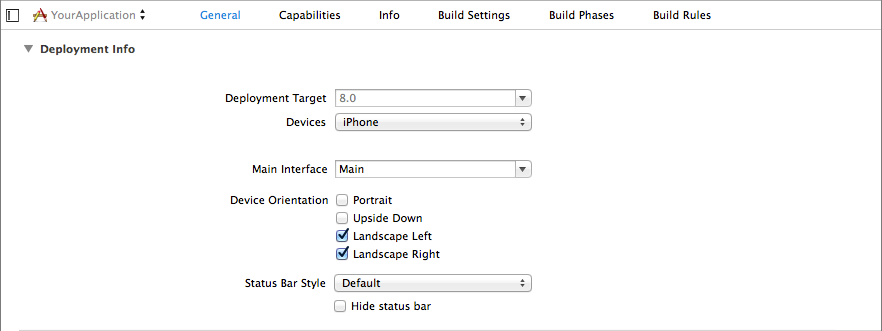
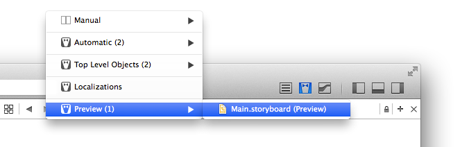
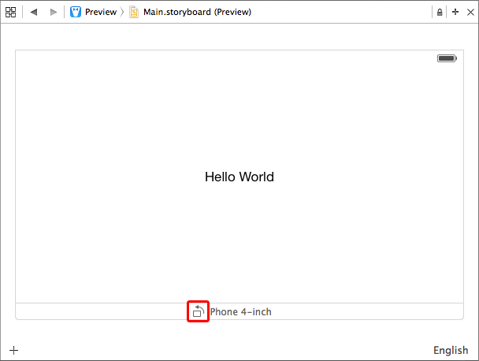
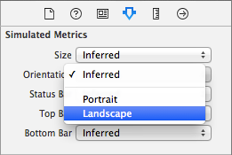

> 导航：[总目录](../../README.md) · [technotes](../../_indexes/technotes.md)


Technical Note TN2244

# Launching your iPhone Application in Landscape

This document describes in detail how to start your iPhone application in landscape orientation.

[Introduction](#apple-f4xwc4dqnrsv64tfmyxwi33df52wszbpirkfgnbqgaydsmbrgiwugsbrfvke4vcbi4yq)[Interface Orientation and the Status Bar](#apple-f4xwc4dqnrsv64tfmyxwi33df52wszbpirkfgnbqgaydsmbrgiwugsbrfvjviqkukvjv6qsbki)[Launch Images](#apple-f4xwc4dqnrsv64tfmyxwi33df52wszbpirkfgnbqgaydsmbrgiwugsbrfvgecvkoinef6sknifdukuy)[Configuring the App Window](#apple-f4xwc4dqnrsv64tfmyxwi33df52wszbpirkfgnbqgaydsmbrgiwugsbrfvbu6tsgjfdvkusjjzdv6vciivpucucql5lustsej5lq)[Methods to Implement in Your App's View Controllers](#apple-f4xwc4dqnrsv64tfmyxwi33df52wszbpirkfgnbqgaydsmbrgiwugsbrfvke4vcbi4zq)[Designing Your Views](#apple-f4xwc4dqnrsv64tfmyxwi33df52wszbpirkfgnbqgaydsmbrgiwugsbrfvke4vcbi42q)[Allowing Your App to Rotate Into Portrait Orientation After Launch](#apple-f4xwc4dqnrsv64tfmyxwi33df52wszbpirkfgnbqgaydsmbrgiwugsbrfvauytcpk5eu4r27lfhvkus7ififax2uj5pvet2uifkekx2jjzke6x2qj5jfiusbjfkf6t2sjfcu4vcbkreu6ts7ifdfirksl5gecvkoinea)[Document Revision History](#apple-f4xwc4dqnrsv64tfmyxwi33df52wszbpirkfgnbqgaydsmbrgiwvezlwnfzws33ojbuxg5dpoj4s2rdpnz2ey2lonncwyzlnmvxhiskel4yq)

## Introduction

iPhone applications typically launch into portrait orientation to match the orientation of the home screen. However, many applications are better suited to running in landscape orientation only. This document describes the changes you must apply to your application for it to launch into landscape orientation on iPhone and iPod Touch.

__Note:__ While the techniques described in this document can be applied to iPad applications, it is recommended that iPad applications support all interface orientations.

[Back to Top](#)

## Interface Orientation and the Status Bar

In the General tab of the project editor for your application' target, enable only the Landscape Left and Landscape Right options under __Supported Device Orientation__ as shown in Figure 1. Make sure you have selected iPhone from the Devices menu when making the changes.

__Figure 1__  Configuring the Supported Interface Orientations



Changes made here are reflected under the [UISupportedInterfaceOrientations](https://developer.apple.com/library/etc/redirect/DTS/ios/UISupportedInterfaceOrientations) key in your application's information property list.

The values of the `UISupportedInterfaceOrientations` key determine how the status bar is positioned while the the app is launching. In iOS 7 and below, if the `UIInterfaceOrientationPortrait` value is present, the status bar will always be positioned for portrait orientation. Otherwise, the status bar will be positioned according to the first orientation that appears under the `UISupportedInterfaceOrientations` key.

The absence of an interface orientation value from the `UISupportedInterfaceOrientations` key prevents your app from rotating to that orientation after launch, even if the app window's root view controller supports the orientation. This provides a quick way to restrict the interface orientations supported by your app without implementing the `-supportedInterfaceOrientations` method in your applications's view controllers. See the [View Controller Programming Guide](https://developer.apple.com/library/ios/#featuredarticles/ViewControllerPGforiPhoneOS/RespondingtoDeviceOrientationChanges/RespondingtoDeviceOrientationChanges.html#//apple_ref/doc/uid/TP40007457-CH7-SW3) for more information.

__Warning:__ Certain built-in system view controllers can only display in portrait orientation. Presenting one of these view controllers without `UIInterfaceOrientationPortrait` as one of the specified values for the `UISupportedInterfaceOrientations` key will raise an exception. See Allowing Your App to Rotate Into Portrait Orientation After Launch for more information.

[Back to Top](#)

## Launch Images

Launch images for iPhone apps are always sized to match the dimensions of the screen in portrait orientation. For applications that launch into landscape orientation, you should use your preferred graphics editing software to rotate the content of the launch image while keeping the image's size consistent with a portrait launch image (height > width).

__Avoid using asset catalogs to manage the launch images of landscape applications.__ Except for launch images used by the iPhone 6 Plus, asset catalogs assume that all iPhone launch images are for the portrait orientation. When your application is compiled, entries for each launch image are added to the compiled information property list under the `UILaunchImages` key. The value for the `UILaunchImageOrientation` key in each of these entries is always `Portrait`. These entries are then ignored at launch time because the value of `Portrait` for the `UILaunchImageOrientation` key does not match the launch orientation (Landscape Left or Landscape Right). The result is a blank screen during launch as the system cannot find an appropriate launch image.

Instead, you should use a [Launch File](https://developer.apple.com/library/ios/documentation/UserExperience/Conceptual/MobileHIG/LaunchImages.html) if your application only supports iOS 8 and above. Otherwise, you will need to add your launch images as resources to your project and then add the `UILaunchImages` key to your application's information property list. Be sure to disable use of the asset catalog for managing the launch images by selecting 'Don't use asset catalogs' from the Launch Image Source menu under the General tab of the project editor for your applications' target.

__Figure 2__  Select 'Don't use asset catalogs' from the Launch Images Source menu to disable catalog-managed launch images


Listing 1 shows an example of the `UILaunchImages` key with entires for each device. Add this snippet to your application's information property list and then edit the value under each `UILaunchImageName` key to match the corresponding image from your project. Do not include the extension or any modifiers (@2x, @3x). You can edit your information property list by control+clicking on it in the File Navigator and choosing __Open As > Source Code__ from the popup menu.

__Listing 1__  Entries under the UILaunchImages key specify the launch image for each particular screen size

```
 <key>UILaunchImages</key>
    <array>
        <dict>
            <key>UILaunchImageMinimumOSVersion</key>
            <string>7.0</string>
            <key>UILaunchImageName</key>
            <string>Default-iOS7-568h</string>
            <key>UILaunchImageOrientation</key>
            <string>Landscape</string>
            <key>UILaunchImageSize</key>
            <string>{320, 568}</string>
        </dict>
        <dict>
            <key>UILaunchImageMinimumOSVersion</key>
            <string>7.0</string>
            <key>UILaunchImageName</key>
            <string>Default-iOS7</string>
            <key>UILaunchImageOrientation</key>
            <string>Landscape</string>
            <key>UILaunchImageSize</key>
            <string>{320, 480}</string>
        </dict>
        <dict>
            <key>UILaunchImageMinimumOSVersion</key>
            <string>8.0</string>
            <key>UILaunchImageName</key>
            <string>Default-iOS8-667h</string>
            <key>UILaunchImageOrientation</key>
            <string>Landscape</string>
            <key>UILaunchImageSize</key>
            <string>{375, 667}</string>
        </dict>
        <dict>
            <key>UILaunchImageMinimumOSVersion</key>
            <string>8.0</string>
            <key>UILaunchImageName</key>
            <string>Default-iOS8-736h</string>
            <key>UILaunchImageOrientation</key>
            <string>Landscape</string>
            <key>UILaunchImageSize</key>
            <string>{414, 736}</string>
        </dict>
    </array>
```

[Back to Top](#)

## Configuring the App Window

Your application must assign a view controller to its window's `rootViewController` property before returning from `application:didFinishLaunchingWithOptions:`. If your application has specified a main storyboard, the initial view controller in the storyboard is automatically configured to be the window's root view controller.

[Back to Top](#)

## Methods to Implement in Your App's View Controllers

__For a view controller to support landscape orientation__, you don't need to do anything. By default, view controllers support all orientations except portrait upside-down. However, because `UIInterfaceOrientationPortrait` was not included in the list of interface orientation values for the `UISupportedInterfaceOrientations` key in your app's Information Property List, the app will not rotate into portrait orientation, leaving landscape left and landscape right as the only allowed orientations. See the [View Controller Programming Guide](https://developer.apple.com/library/ios/#featuredarticles/ViewControllerPGforiPhoneOS/RespondingtoDeviceOrientationChanges/RespondingtoDeviceOrientationChanges.html#//apple_ref/doc/uid/TP40007457-CH7-SW3) for more information.

__For a view controller to support landscape orientation on iOS 5 and below__, it must override the `shouldAutorotateToInterfaceOrientation:` method as shown in Listing 2.

__Listing 2__  Ensuring that landscape orientation is maintained

```objc
- (BOOL)shouldAutorotateToInterfaceOrientation:(UIInterfaceOrientation)interfaceOrientation
{
    return UIInterfaceOrientationIsLandscape(interfaceOrientation);
}
```

[Back to Top](#)

## Designing Your Views

When designing a landscape-only view in Interface Builder, you should make most of your changes while editing the `[wAny hAny]` size class. Unless your app only supports iOS 8 or later, you should avoid making changes while editing the `[wCompact hCompact]` or `[wAny hCompact]` size classes. Changes made to these size classes are not included in the compatibility storyboard generated for devices running iOS 7 and below. Changes which should only apply to the iPhone 6 Plus should be made while editing the `[wRegular hCompact]` size class.

Interface Builder can simulate landscape metrics of various iOS devices in the Preview assistant, displayed alongside the editor. Enable the assistant editor and select __Preview > Storyboard Name__ from the jump bar for the assistant editor as shown in Figure 3.

__Figure 3__  Selecting the Preview assistant



Simulated devices can be added using the + button in the bottom left corner of the assistant editor. To rotate a simulated device to landscape, click the button next to the device name as shown in Figure 4.

__Figure 4__  Click the button next to the device name to rotate



If you have opted to not use size classes for a storyboard, Interface Builder can apply landscape metrics to the canvas of the scene you are currently editing. When landscape metrics are applied, as shown in Figure 5, Interface Builder respects the constraints applied to each view and adjusts their position on the canvas.

__Figure 5__  Changing the simulated orientation of a view controller in Interface Builder.



Regardless of how you orient the canvas in Interface Builder, remember that storyboard scenes themselves have no concept of interface orientation.

[Back to Top](#)

## Allowing Your App to Rotate Into Portrait Orientation After Launch

Even if your app primarily displays its content in landscape, it may be advantageous or necessary to present certain view controllers in the portrait orientation. When UIKit detects a change in device orientation, it uses the `UIApplication` object and the root view controller to determine whether the new orientation is allowed. If both objects agree that the new orientation is supported, then auto rotation occurs. Otherwise the orientation change is ignored.

By default, the `UIApplication` object sources its supported interface orientations from the values specified for the `UISupportedInterfaceOrientations` key in the applications's Information Property List. You can override this behavior by implementing the `application:supportedInterfaceOrientationsForWindow:` method in your application's delegate. The supported orientation values returned by this method only take effect after the application has finished launching. You can therefore use this method to support a different set of orientations after launch.

__Listing 3__  Allowing your app to rotate into portrait after launch.

```objc
- (NSUInteger)application:(UIApplication *)application supportedInterfaceOrientationsForWindow:(UIWindow *)window
{
    return UIInterfaceOrientationMaskAllButUpsideDown;
}
```

Recall that view controllers support portrait and both landscape orientations by default. Without the `UIApplication` object preventing rotation into portrait orientation at the app level, you will need to implement `-supportedInterfaceOrientations` as shown in Listing 4 for all view controllers that must only display in landscape.

__Listing 4__  Supporting only landscape orientations for a view controller.

```objc
- (NSUInteger)supportedInterfaceOrientations
{
    return UIInterfaceOrientationMaskLandscape;
}
```

The system only queries the supported interface orientations of the app window's root view controller. You may discover that your view controller's `supportedInterfaceOrientations` method is not called if it is inside a container, such as a `UINavigationController`, which does not involve its child view controllers when deciding its supported interface orientations. In this case, the navigation controller's delegate should implement `navigationControllerSupportedInterfaceOrientations:` as shown in Listing 5. If your application must support iOS 6, you should instead subclass `UINavigationController` and override `supportedInterfaceOrientations` as shown in Listing 4.

__Listing 5__  Supporting only landscape orientations for a navigation controller.

```objc
-(NSUInteger)navigationControllerSupportedInterfaceOrientations:(UINavigationController *)navigationController
{
    return UIInterfaceOrientationMaskLandscape;
}
```

[Back to Top](#)

---

#### Document Revision History

| __Date__ | __Notes__ |
| 2015-05-26 | Updated for Xcode 6 and iOS 8. |
| 2013-08-09 | Updated to cover changes to auto-rotation that were introduced with iOS 6. |
| 2009-06-29 | New document that describes how to start your iPhone application in landscape orientation at launch time. |

